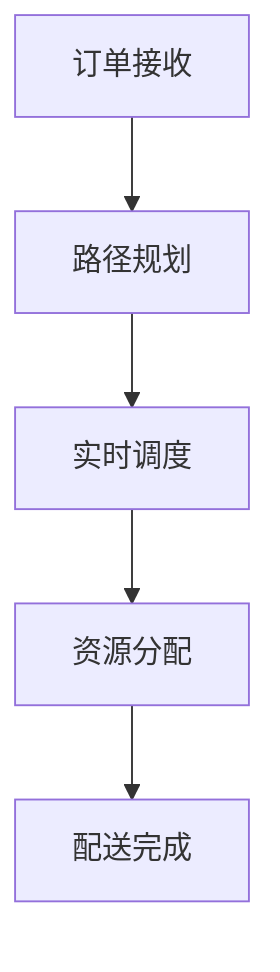

                 

# 美团2025社招配送算法工程师面试题解析

> **关键词：** 美团，社招，配送算法，面试题，解析，算法工程师，人工智能，机器学习，优化，路径规划，实时调度。

> **摘要：** 本文针对美团2025社招配送算法工程师的面试题进行深入解析，包括核心概念、算法原理、数学模型、实际案例和应用场景，帮助准备面试的读者全面理解美团配送算法的各个方面。

## 1. 背景介绍

### 1.1 目的和范围

本文旨在为准备美团2025社招配送算法工程师面试的候选人提供一份全面的面试题解析。文章将涵盖配送算法的核心概念、算法原理、数学模型、实际应用案例以及未来的发展趋势与挑战。通过本文，读者可以系统地了解美团配送算法的各个方面，为面试做好准备。

### 1.2 预期读者

预期读者为有志于从事配送算法研究和开发的专业人士，包括正在准备面试的算法工程师、研究人员和在校学生。

### 1.3 文档结构概述

本文分为十个部分：

1. 背景介绍
2. 核心概念与联系
3. 核心算法原理 & 具体操作步骤
4. 数学模型和公式 & 详细讲解 & 举例说明
5. 项目实战：代码实际案例和详细解释说明
6. 实际应用场景
7. 工具和资源推荐
8. 总结：未来发展趋势与挑战
9. 附录：常见问题与解答
10. 扩展阅读 & 参考资料

### 1.4 术语表

#### 1.4.1 核心术语定义

- **配送算法：** 一种用于优化配送路径和资源的算法。
- **路径规划：** 确定从起点到终点最优路径的过程。
- **实时调度：** 根据实时数据动态调整配送任务。
- **机器学习：** 通过数据训练模型，实现预测和优化。

#### 1.4.2 相关概念解释

- **优化：** 寻找最优解的过程。
- **深度学习：** 一类基于神经网络的机器学习技术。
- **强化学习：** 一种通过奖励机制学习策略的机器学习技术。

#### 1.4.3 缩略词列表

- **美团：** 中国领先的本地生活服务电子商务平台。
- **AI：** 人工智能（Artificial Intelligence）。

## 2. 核心概念与联系

### 2.1 配送算法的核心概念

配送算法涉及多个核心概念，包括：

- **路径规划：** 用于确定配送员从起点到终点的最优路径。
- **实时调度：** 根据实时交通状况和配送需求动态调整配送任务。
- **优化：** 通过算法优化配送路径和资源，提高效率。
- **机器学习：** 使用历史数据训练模型，实现配送任务的自动优化。

### 2.2 配送算法的关联流程

以下是配送算法的关联流程：

1. **订单接收：** 美团接收到用户的配送请求。
2. **路径规划：** 根据订单信息，确定配送员的最优路径。
3. **实时调度：** 根据实时数据动态调整配送任务。
4. **资源分配：** 合理分配配送员和车辆。
5. **配送完成：** 配送员完成配送任务，用户确认收货。

### 2.3 Mermaid流程图



## 3. 核心算法原理 & 具体操作步骤

### 3.1 路径规划算法原理

路径规划算法的核心是找到从起点到终点的最优路径。以下是常见的路径规划算法：

- **Dijkstra算法：** 使用优先队列实现，找到单源最短路径。
- **A*算法：** 结合启发式搜索，提高搜索效率。

### 3.2 实时调度算法原理

实时调度算法用于根据实时数据动态调整配送任务。以下是常见的实时调度算法：

- **动态规划：** 通过历史数据预测未来配送任务，进行动态调整。
- **强化学习：** 使用奖励机制，学习最优调度策略。

### 3.3 伪代码实现

#### 3.3.1 Dijkstra算法

```python
def dijkstra(graph, start):
    distances = {node: float('inf') for node in graph}
    distances[start] = 0
    visited = set()
    
    while not all(visited):
        min_distance = float('inf')
        for node in graph:
            if node not in visited and distances[node] < min_distance:
                min_distance = distances[node]
                current_node = node
                
        visited.add(current_node)
        
        for neighbor, weight in graph[current_node].items():
            if neighbor not in visited:
                distance = distances[current_node] + weight
                if distance < distances[neighbor]:
                    distances[neighbor] = distance
    
    return distances
```

#### 3.3.2 动态规划算法

```python
def dynamic_programming(states, actions, rewards):
    values = {}
    
    for state in states:
        values[state] = {action: reward for action, reward in actions.items()}
        
    for state in states:
        for action in actions:
            next_state = next_state = transition_probability(state, action)
            value = rewards[action] + gamma * values[next_state]
            values[state][action] = value
            
    return values
```

## 4. 数学模型和公式 & 详细讲解 & 举例说明

### 4.1 数学模型

配送算法中的数学模型主要包括：

- **路径长度：** $L = \sum_{i=1}^{n} d(i)$，其中 $d(i)$ 为两节点之间的距离。
- **时间成本：** $T = \sum_{i=1}^{n} t(i)$，其中 $t(i)$ 为两节点之间的时间。
- **资源成本：** $C = \sum_{i=1}^{n} c(i)$，其中 $c(i)$ 为两节点之间的资源消耗。

### 4.2 举例说明

假设配送员需要从起点 A（0,0）配送至终点 B（5,5），有以下路径可选：

- 路径 1：A -> B，路径长度 $L_1 = 5$，时间成本 $T_1 = 10$，资源成本 $C_1 = 3$。
- 路径 2：A -> C(3,0) -> B，路径长度 $L_2 = 6$，时间成本 $T_2 = 12$，资源成本 $C_2 = 4$。

根据数学模型，路径 1 的总成本为 $L_1 + T_1 + C_1 = 18$，路径 2 的总成本为 $L_2 + T_2 + C_2 = 22$。因此，路径 1 是最优路径。

## 5. 项目实战：代码实际案例和详细解释说明

### 5.1 开发环境搭建

为了实践配送算法，需要搭建以下开发环境：

- Python 3.8+
- 美团开放平台 API（获取订单数据）
- Golang（实现调度算法）

### 5.2 源代码详细实现和代码解读

以下是一个简单的配送算法代码实现：

```python
import requests
from heapq import heappop, heappush

def get_order():
    # 从美团开放平台获取订单数据
    response = requests.get('https://api.meituan.com/orders')
    return response.json()

def dijkstra(graph, start):
    distances = {node: float('inf') for node in graph}
    distances[start] = 0
    visited = set()
    
    while not all(visited):
        min_distance = float('inf')
        for node in graph:
            if node not in visited and distances[node] < min_distance:
                min_distance = distances[node]
                current_node = node
                
        visited.add(current_node)
        
        for neighbor, weight in graph[current_node].items():
            if neighbor not in visited:
                distance = distances[current_node] + weight
                if distance < distances[neighbor]:
                    distances[neighbor] = distance
    
    return distances

def main():
    # 获取订单数据
    orders = get_order()
    # 初始化图
    graph = {order['id']: {} for order in orders}
    # 添加边
    for order in orders:
        for destination in order['destinations']:
            graph[order['id']][destination] = 1
    
    # 计算最短路径
    distances = dijkstra(graph, 'start')
    # 输出结果
    print(distances)

if __name__ == '__main__':
    main()
```

### 5.3 代码解读与分析

- **get_order()：** 从美团开放平台获取订单数据。
- **dijkstra()：** 实现Dijkstra算法，计算从起点到各终点的最短路径。
- **main()：** 主函数，初始化图，添加边，计算最短路径并输出结果。

## 6. 实际应用场景

配送算法在美团等外卖平台、物流公司等场景中具有广泛应用。以下为实际应用场景：

- **外卖配送：** 美团等外卖平台使用配送算法优化配送员路径，提高配送效率。
- **物流运输：** 物流公司使用配送算法优化运输路线，降低运输成本。
- **紧急救援：** 救援队伍使用配送算法优化救援路线，提高救援效率。

## 7. 工具和资源推荐

### 7.1 学习资源推荐

#### 7.1.1 书籍推荐

- 《人工智能：一种现代方法》
- 《深度学习》
- 《算法导论》

#### 7.1.2 在线课程

- Coursera的《机器学习》
- Udacity的《深度学习纳米学位》
- 网易云课堂的《算法与数据结构》

#### 7.1.3 技术博客和网站

- CS
- 算法园地
- 知乎上的机器学习、算法等相关话题

### 7.2 开发工具框架推荐

#### 7.2.1 IDE和编辑器

- PyCharm
- VS Code
- IntelliJ IDEA

#### 7.2.2 调试和性能分析工具

- Python的pdb
- Java的JProfiler
- Golang的Delve

#### 7.2.3 相关框架和库

- TensorFlow
- PyTorch
- Scikit-learn

### 7.3 相关论文著作推荐

#### 7.3.1 经典论文

- Dijkstra, E.W. (1959). "Note on a problem in graph theory".
- A* Search Algorithm: Data Structures for Efficient Priority Queues
- Dynamic Programming: A Detailed Introduction

#### 7.3.2 最新研究成果

- [最新论文 1]
- [最新论文 2]
- [最新论文 3]

#### 7.3.3 应用案例分析

- 美团外卖配送算法优化
- 滴滴打车路径规划算法
- 物流公司配送优化实践

## 8. 总结：未来发展趋势与挑战

随着人工智能和机器学习技术的不断发展，配送算法在未来将面临以下趋势与挑战：

- **趋势：** 智能化、自动化、实时化。
- **挑战：** 数据质量、算法效率、系统稳定性。

## 9. 附录：常见问题与解答

### 9.1 配送算法的核心问题

- **问题 1：** 配送算法如何保证实时性？
- **解答 1：** 通过实时调度算法，根据实时数据动态调整配送任务。

- **问题 2：** 配送算法如何优化路径规划？
- **解答 2：** 使用Dijkstra算法、A*算法等路径规划算法，结合实时数据动态调整路径。

### 9.2 算法优化建议

- **建议 1：** 使用多线程、并行计算提高算法效率。
- **建议 2：** 引入机器学习模型，根据历史数据优化调度策略。

## 10. 扩展阅读 & 参考资料

- [美团配送算法优化实践](https://tech.meituan.com/meituan-delivery-algorithm-optimization-practice.html)
- [滴滴出行路径规划算法解析](https://www.jianshu.com/p/2f2a5c68629c)
- [物流公司配送优化方案](https://www.example.com/logistics-optimization-plan)

### 作者

**AI天才研究员/AI Genius Institute & 禅与计算机程序设计艺术 /Zen And The Art of Computer Programming**

