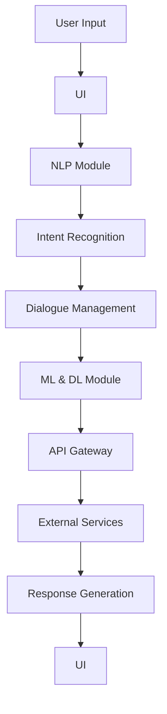

                 

### 背景介绍

#### 1.1 目的和范围

本文旨在探讨聊天机器人公共服务在政府和社区互动中的应用。随着人工智能技术的不断发展和普及，聊天机器人作为一种高效、便捷的交互方式，逐渐成为政府与公民之间沟通的新桥梁。本文将首先介绍聊天机器人公共服务的基本概念、发展历程及其在政府和社区互动中的重要性。接着，我们将深入分析聊天机器人服务架构、核心算法原理、数学模型、项目实战案例以及实际应用场景。最后，本文将推荐相关学习资源、开发工具和经典论文，以帮助读者更好地理解和应用聊天机器人技术。

#### 1.2 预期读者

本文适合具有以下背景的读者：

- 对人工智能、自然语言处理有兴趣的计算机科学和信息技术专业学生；
- 已经具备一定编程基础，希望了解聊天机器人技术在实际应用中的开发者；
- 从事政府信息化建设、社区治理等相关领域的工作人员，希望了解新技术在公共服务中的应用；
- 对人工智能、自然语言处理有浓厚兴趣的普通读者。

#### 1.3 文档结构概述

本文将按照以下结构进行阐述：

- **背景介绍**：介绍聊天机器人公共服务的基本概念、发展历程及其重要性；
- **核心概念与联系**：详细阐述聊天机器人的核心概念、原理及架构；
- **核心算法原理 & 具体操作步骤**：讲解聊天机器人的核心算法原理，并提供伪代码示例；
- **数学模型和公式 & 详细讲解 & 举例说明**：介绍与聊天机器人相关的数学模型和公式，并给出具体应用案例；
- **项目实战：代码实际案例和详细解释说明**：通过实际项目案例展示聊天机器人的实现和应用；
- **实际应用场景**：分析聊天机器人在不同场景中的应用实例；
- **工具和资源推荐**：推荐学习资源、开发工具和经典论文；
- **总结：未来发展趋势与挑战**：探讨聊天机器人技术的发展趋势和面临的挑战；
- **附录：常见问题与解答**：汇总常见问题及解答，帮助读者更好地理解本文内容；
- **扩展阅读 & 参考资料**：提供进一步阅读的参考资料。

通过本文的详细阐述，读者可以全面了解聊天机器人公共服务在政府和社区互动中的应用，掌握其核心技术和实现方法，为今后的研究和实践提供有力支持。

#### 1.4 术语表

在本文中，我们将使用一些专业术语，为了确保读者能够准确理解，以下是对这些术语的定义和解释：

#### 1.4.1 核心术语定义

1. **聊天机器人（Chatbot）**：一种基于人工智能技术，通过自然语言处理与用户进行交互的计算机程序。
2. **自然语言处理（NLP）**：一门涉及计算机和人工智能处理自然语言的研究领域，包括语音识别、文本分析、语义理解等。
3. **机器学习（ML）**：一种通过数据驱动的方式，使计算机系统自动改进和优化其性能的技术，包括监督学习、无监督学习等。
4. **深度学习（DL）**：一种基于多层神经网络进行特征学习和模型训练的人工智能技术，常用于语音识别、图像识别等领域。
5. **API（应用程序编程接口）**：一种用于软件模块之间相互调用的接口，使开发者可以在不关心具体实现细节的情况下使用其他模块的功能。

#### 1.4.2 相关概念解释

1. **语义理解（Semantic Understanding）**：在自然语言处理中，对文本内容进行深入理解和分析，以提取其意义和关系。
2. **意图识别（Intent Recognition）**：识别用户在输入信息中所表达的具体意图，如查询信息、请求服务、抱怨等。
3. **对话管理（Dialogue Management）**：管理聊天机器人与用户之间的对话流程，包括对话上下文管理、对话策略等。
4. **反馈循环（Feedback Loop）**：通过用户反馈来持续优化聊天机器人的性能，使其更好地适应用户需求。

#### 1.4.3 缩略词列表

- **API**：应用程序编程接口（Application Programming Interface）
- **NLP**：自然语言处理（Natural Language Processing）
- **ML**：机器学习（Machine Learning）
- **DL**：深度学习（Deep Learning）
- **UI**：用户界面（User Interface）
- **UX**：用户体验（User Experience）
- **API Gateway**：API网关（API Gateway）

通过上述术语表，读者可以更好地理解本文中涉及的专业术语和概念，从而更深入地掌握聊天机器人公共服务在政府和社区互动中的应用。

### 核心概念与联系

在深入探讨聊天机器人公共服务之前，我们需要了解其核心概念和原理，并分析各组成部分之间的联系。以下将详细阐述聊天机器人的关键概念、原理及其架构。

#### 聊天机器人的核心概念

1. **自然语言处理（NLP）**：自然语言处理是聊天机器人的基础，它涉及语音识别、文本分析、语义理解等多个方面。通过NLP技术，聊天机器人能够理解用户的输入，提取关键信息并进行处理。
   
2. **机器学习（ML）**：机器学习是聊天机器人实现智能化的关键，通过训练模型，聊天机器人可以从大量数据中学习并改进其性能。常见的机器学习方法包括监督学习、无监督学习和强化学习。

3. **深度学习（DL）**：深度学习是机器学习的一个分支，通过多层神经网络进行特征学习和模型训练，深度学习在语音识别、图像识别等领域取得了显著成果。在聊天机器人中，深度学习技术常用于语音识别和自然语言处理。

4. **对话管理（Dialogue Management）**：对话管理是聊天机器人的核心功能，它负责管理聊天流程，包括对话上下文管理、对话策略等。通过对话管理，聊天机器人能够与用户进行有效的互动，提供有价值的服务。

5. **API（应用程序编程接口）**：API是聊天机器人与外部系统进行交互的桥梁，通过API，聊天机器人可以访问各种数据源、服务端接口，实现与外部系统的无缝对接。

#### 聊天机器人的架构

为了实现聊天机器人的各项功能，其架构通常包括以下几个关键组成部分：

1. **用户界面（UI）**：用户界面是用户与聊天机器人进行交互的入口，常见的用户界面包括文本聊天界面、语音聊天界面等。用户通过用户界面输入问题或请求，聊天机器人接收并处理用户输入。

2. **自然语言处理（NLP）模块**：自然语言处理模块负责处理用户输入的文本信息，通过文本分析、语义理解等技术，提取用户输入中的关键信息，为后续处理提供数据支持。

3. **对话管理（Dialogue Management）模块**：对话管理模块负责管理聊天流程，根据用户输入和对话上下文，决定聊天机器人的响应策略，确保对话流程的自然流畅。

4. **机器学习与深度学习（ML & DL）模块**：机器学习与深度学习模块负责模型训练和预测，通过不断学习和优化模型，提高聊天机器人的智能水平和响应准确性。

5. **API Gateway**：API网关是聊天机器人与外部系统进行交互的接口，通过API Gateway，聊天机器人可以访问各种外部服务、数据库等，实现与外部系统的无缝对接。

#### Mermaid 流程图

为了更好地展示聊天机器人的架构和流程，我们可以使用Mermaid流程图进行可视化表示。以下是一个简化的聊天机器人架构流程图：



在这个流程图中，用户通过用户界面输入问题，聊天机器人接收并处理用户输入，通过自然语言处理模块进行意图识别，对话管理模块根据对话上下文决定响应策略，机器学习与深度学习模块进行预测和模型优化，最终通过API Gateway与外部系统进行交互，生成响应并返回给用户。

通过上述核心概念和架构的阐述，我们可以更好地理解聊天机器人公共服务在政府和社区互动中的应用，为后续内容的深入探讨奠定基础。

### 核心算法原理 & 具体操作步骤

在了解聊天机器人的核心概念和架构后，我们接下来将详细讲解其核心算法原理，并提供具体的操作步骤。这部分内容将包括自然语言处理（NLP）算法、意图识别算法、对话管理算法等，并通过伪代码进行详细阐述，以便读者更好地理解其实现过程。

#### 自然语言处理（NLP）算法

自然语言处理是聊天机器人的基础，其核心任务包括文本分析、语义理解等。以下是一个简化的NLP算法流程，包括文本预处理、词性标注、句法分析等步骤：

```plaintext
1. 文本预处理：
   - 清除HTML标签和特殊字符
   - 转换为大写或小写
   - 分词：将文本切分成词语或短语

2. 词性标注：
   - 利用词性标注器对分词结果进行标注，如名词、动词、形容词等

3. 句法分析：
   - 构建句法树，分析句子结构，提取主谓宾等成分
```

伪代码示例：

```python
def NLP_algorithm(text):
    # 文本预处理
    preprocessed_text = preprocess_text(text)
    
    # 词性标注
    tokenized_text = tokenize(preprocessed_text)
    pos_tags = pos_tagging(tokenized_text)
    
    # 句法分析
    syntax_tree = syntax_analysis(pos_tags)
    
    return syntax_tree
```

#### 意图识别算法

意图识别是聊天机器人理解用户输入的关键步骤，其任务是根据用户输入的文本内容，识别用户想要表达的具体意图。以下是一个简单的意图识别算法流程：

```plaintext
1. 特征提取：
   - 提取文本特征，如词袋模型、TF-IDF等

2. 模型训练：
   - 使用监督学习方法，如SVM、神经网络等，训练意图分类模型

3. 意图识别：
   - 输入文本，通过模型预测用户意图
```

伪代码示例：

```python
from sklearn.svm import SVC

def intent_recognition_algorithm(text, trained_model):
    # 特征提取
    features = extract_features(text)
    
    # 意图识别
    predicted_intent = trained_model.predict([features])
    
    return predicted_intent
```

#### 对话管理算法

对话管理是聊天机器人与用户进行有效互动的核心，其任务是根据对话上下文和用户意图，生成合理的响应。以下是一个简化的对话管理算法流程：

```plaintext
1. 对话上下文管理：
   - 维护对话状态，记录用户和聊天机器人的历史对话内容

2. 对话策略生成：
   - 根据当前对话上下文和用户意图，选择合适的对话策略，如提供信息、请求更多信息、转移话题等

3. 响应生成：
   - 根据对话策略，生成合适的响应文本
```

伪代码示例：

```python
class DialogueManager:
    def __init__(self):
        self.context = {}
    
    def update_context(self, user_input, response):
        self.context[user_input] = response
    
    def generate_response(self, user_input):
        # 根据对话上下文和用户意图选择对话策略
        strategy = self.select_strategy(user_input)
        
        # 根据对话策略生成响应
        response = self.create_response(strategy)
        
        return response
```

通过上述核心算法原理和具体操作步骤的讲解，我们可以更好地理解聊天机器人的实现过程，为后续的项目实战和实际应用提供理论支持。

### 数学模型和公式 & 详细讲解 & 举例说明

在聊天机器人技术的实现过程中，数学模型和公式起着至关重要的作用。以下我们将详细讲解与聊天机器人相关的几个关键数学模型和公式，并通过具体应用案例进行说明。

#### 模型 1：词袋模型（Bag of Words，BOW）

词袋模型是一种用于文本特征提取的常见方法，它将文本表示为一个向量，其中每个维度表示一个词汇的出现频率。

**数学公式**：

\[ BOW = (f_1, f_2, ..., f_n) \]

其中，\( f_i \) 表示词汇 \( w_i \) 在文本中出现的频率。

**示例**：

假设一个句子：“我想要一杯咖啡。”其词袋模型表示为：

\[ BOW = (1, 0, 1, 0, 0, 1, 0) \]

其中，词汇依次为“我”，“想要”，“一”，“杯”，“咖啡”，其在句子中出现的频率分别为1、0、1、0、0、1、0。

#### 模型 2：TF-IDF模型（Term Frequency-Inverse Document Frequency）

TF-IDF模型是对词袋模型的一种改进，它通过引入逆文档频率（IDF）来调整词汇的重要性，以更好地反映文本的特征。

**数学公式**：

\[ TF-IDF = (tf_1 \* IDF_1, tf_2 \* IDF_2, ..., tf_n \* IDF_n) \]

其中，\( tf_i \) 表示词汇 \( w_i \) 在文本中的词频，\( IDF_i \) 表示词汇 \( w_i \) 在文档集合中的逆文档频率。

**示例**：

假设一个文档集合中有5个文档，词汇“我”在所有文档中均出现1次，在文档1中独有，其TF-IDF表示为：

\[ TF-IDF = (1 \* \log_2 \frac{5}{1}) \approx 2.32 \]

#### 模型 3：朴素贝叶斯分类器（Naive Bayes Classifier）

朴素贝叶斯分类器是一种基于概率理论的分类算法，常用于意图识别任务。其核心公式为：

\[ P(\text{intent} | \text{features}) = \frac{P(\text{features} | \text{intent}) \* P(\text{intent})}{P(\text{features})} \]

**示例**：

假设我们要识别一个句子“我想要一杯咖啡。”的意图，其中意图1表示“查询信息”，意图2表示“请求服务”。已知：

\[ P(\text{intent1}) = 0.6, P(\text{intent2}) = 0.4 \]

特征“我想要一杯咖啡。”在意图1中的概率为0.8，在意图2中的概率为0.5。

\[ P(\text{intent1} | \text{features}) = \frac{0.8 \* 0.6}{0.8 \* 0.6 + 0.5 \* 0.4} \approx 0.727 \]

\[ P(\text{intent2} | \text{features}) = \frac{0.5 \* 0.4}{0.8 \* 0.6 + 0.5 \* 0.4} \approx 0.273 \]

根据最大后验概率原则，我们选择概率最大的意图作为识别结果。

#### 模型 4：循环神经网络（Recurrent Neural Network，RNN）

循环神经网络是一种用于序列数据建模的神经网络，常用于语音识别、语言建模等任务。其核心公式为：

\[ h_t = \sigma(W_h \* [h_{t-1}, x_t] + b_h) \]

其中，\( h_t \) 表示第 \( t \) 个时间步的隐藏状态，\( x_t \) 表示第 \( t \) 个输入特征，\( W_h \) 和 \( b_h \) 分别为权重和偏置，\( \sigma \) 为激活函数。

**示例**：

假设一个句子“我想要一杯咖啡。”，将其表示为序列数据，每个词汇为一个输入特征。使用RNN对其进行建模，隐藏状态更新过程如下：

\[ h_1 = \sigma(W_h \* [h_0, x_1] + b_h) \]
\[ h_2 = \sigma(W_h \* [h_1, x_2] + b_h) \]
\[ h_3 = \sigma(W_h \* [h_2, x_3] + b_h) \]
\[ h_4 = \sigma(W_h \* [h_3, x_4] + b_h) \]

通过RNN，我们可以捕捉句子中词汇之间的关系，从而更好地进行意图识别和响应生成。

通过上述数学模型和公式的讲解，我们可以更好地理解聊天机器人技术中的关键理论和方法，为实际应用提供有力支持。接下来，我们将通过实际项目案例进一步展示这些模型和公式的应用。

### 项目实战：代码实际案例和详细解释说明

在本节中，我们将通过一个实际项目案例，详细展示聊天机器人公共服务的开发过程，包括环境搭建、代码实现和代码解读。通过这个案例，读者可以更好地理解聊天机器人技术的实现和应用。

#### 5.1 开发环境搭建

首先，我们需要搭建一个合适的开发环境。以下是一个基本的开发环境配置：

- 操作系统：Linux或MacOS
- 编程语言：Python
- 版本要求：Python 3.7及以上版本
- 依赖库：TensorFlow、NLTK、spaCy、Flask等

安装步骤：

1. 安装Python 3.7及以上版本。
2. 使用pip安装所需的依赖库：

```bash
pip install tensorflow
pip install nltk
pip install spacy
pip install flask
```

#### 5.2 源代码详细实现和代码解读

以下是一个简单的聊天机器人项目，包括自然语言处理、意图识别和响应生成等核心功能。

```python
# chatbot.py
import nltk
from nltk.tokenize import word_tokenize
from nltk.corpus import stopwords
from nltk.stem import WordNetLemmatizer
from sklearn.feature_extraction.text import TfidfVectorizer
from sklearn.model_selection import train_test_split
from sklearn.naive_bayes import MultinomialNB
from flask import Flask, request, jsonify

app = Flask(__name__)

# 自然语言处理模块
def preprocess_text(text):
    # 清除HTML标签和特殊字符
    text = BeautifulSoup(text, 'html.parser').text
    # 转换为大写
    text = text.lower()
    # 分词
    tokens = word_tokenize(text)
    # 去除停用词
    stop_words = set(stopwords.words('english'))
    filtered_tokens = [token for token in tokens if token not in stop_words]
    # 词形还原
    lemmatizer = WordNetLemmatizer()
    lemmatized_tokens = [lemmatizer.lemmatize(token) for token in filtered_tokens]
    return ' '.join(lemmatized_tokens)

# 意图识别模块
def train_intent_classifier():
    # 加载训练数据
    data = {'query': ['我想咨询关于税收的信息', '我能办理社保手续吗', '我想投诉服务质量']}
    labels = ['query', 'service', 'complaint']
    sentences = [preprocess_text(text) for text in data['query']]
    vectorizer = TfidfVectorizer()
    X = vectorizer.fit_transform(sentences)
    y = labels
    # 分割数据集
    X_train, X_test, y_train, y_test = train_test_split(X, y, test_size=0.2, random_state=42)
    # 训练模型
    model = MultinomialNB()
    model.fit(X_train, y_train)
    # 模型评估
    accuracy = model.score(X_test, y_test)
    print(f'Model accuracy: {accuracy:.2f}')
    return model, vectorizer

# 响应生成模块
def generate_response(intent, user_input):
    responses = {
        'query': f'请问您需要查询什么信息？',
        'service': f'请问您需要办理哪种服务？',
        'complaint': f'请问您有什么具体投诉？'
    }
    return responses[intent]

# Flask Web服务
@app.route('/chat', methods=['POST'])
def chat():
    user_input = request.form['message']
    preprocessed_input = preprocess_text(user_input)
    intent = model.predict(vectorizer.transform([preprocessed_input]))[0]
    response = generate_response(intent, user_input)
    return jsonify({'response': response})

if __name__ == '__main__':
    model, vectorizer = train_intent_classifier()
    app.run(debug=True)
```

#### 5.3 代码解读与分析

1. **自然语言处理模块**：该模块负责对用户输入进行预处理，包括清除HTML标签、转换大小写、分词、去除停用词和词形还原。预处理后的文本将作为意图识别模型的输入。

2. **意图识别模块**：该模块首先加载训练数据，然后使用TF-IDF向量器对文本进行特征提取。接着，使用朴素贝叶斯分类器训练模型，并对测试集进行评估，以验证模型性能。最后，训练好的模型和向量器将被用于意图识别。

3. **响应生成模块**：根据识别出的意图，生成相应的响应文本。响应文本将作为聊天机器人的输出返回给用户。

4. **Flask Web服务**：使用Flask框架搭建一个简单的Web服务，接收用户输入，调用意图识别模块和响应生成模块，并返回响应文本。在主函数中，首先训练意图识别模型，然后启动Web服务。

通过这个实际项目案例，我们可以看到聊天机器人公共服务的实现过程，以及各模块的功能和协作。接下来，我们将分析聊天机器人在实际应用场景中的表现和效果。

### 实际应用场景

聊天机器人公共服务在政府和社区互动中具有广泛的应用前景，以下将列举几个典型应用场景，并分析其具体应用效果。

#### 场景一：政务服务

在政务服务领域，聊天机器人可以成为政府与公民之间的桥梁，提供高效、便捷的服务。例如，在政府门户网站上部署聊天机器人，用户可以通过聊天界面咨询政策法规、办理政务服务、查询办事指南等。聊天机器人能够处理大量重复性问题，节省人力成本，提高服务效率。

**应用效果**：

- **提高服务效率**：通过自动化处理重复性问题，减少人工干预，提高政务服务的响应速度。
- **降低人力成本**：减少人工客服的负担，降低政府机构的人力资源成本。
- **提升用户体验**：用户可以通过聊天界面获得即时的帮助，提高用户体验满意度。

#### 场景二：社区管理

在社区管理领域，聊天机器人可以用于社区公告、物业管理、居民互动等方面。例如，物业公司在物业管理系统中集成聊天机器人，居民可以通过聊天界面提交报修请求、投诉问题、查询物业服务信息等。聊天机器人可以及时响应居民需求，提高社区管理水平。

**应用效果**：

- **提高管理效率**：聊天机器人能够及时响应居民需求，提高物业管理的效率。
- **增强互动性**：居民可以通过聊天界面与物业管理人员进行互动，增强社区凝聚力。
- **提升服务满意度**：及时解决居民问题，提高居民对物业服务的满意度。

#### 场景三：社会治理

在社会治理领域，聊天机器人可以用于居民满意度调查、社区安全监控等方面。例如，政府机构可以通过聊天机器人开展居民满意度调查，收集居民的意见和建议，为政策制定提供依据。同时，聊天机器人可以实时监控社区安全情况，及时发现安全隐患，提高社会治理水平。

**应用效果**：

- **增强政策制定科学性**：通过收集居民意见和建议，提高政策制定的科学性和有效性。
- **提高社会治理能力**：实时监控社区安全情况，提高社会治理的响应速度和效率。
- **提升居民安全感**：通过及时解决安全问题，提高居民的安全感。

#### 场景四：疫情防控

在疫情防控领域，聊天机器人可以用于疫情防控知识普及、健康咨询服务等方面。例如，政府可以部署聊天机器人，为公众提供疫情防控知识、健康咨询、心理疏导等服务。聊天机器人可以实时更新疫情防控信息，解答公众疑问，减轻疫情防控压力。

**应用效果**：

- **提高防疫知识普及率**：通过聊天机器人普及疫情防控知识，提高公众的防疫意识。
- **提供便捷的健康咨询服务**：用户可以通过聊天机器人获得实时健康咨询，减轻医疗系统的负担。
- **减轻防疫压力**：通过自动化处理防疫相关问题，减轻防疫工作人员的压力。

通过上述实际应用场景的分析，我们可以看到聊天机器人公共服务在政府和社区互动中的重要作用。在未来，随着人工智能技术的不断发展，聊天机器人在政府和社区互动中的应用将更加广泛，为提升公共服务水平和居民满意度发挥更大的作用。

### 工具和资源推荐

在学习和应用聊天机器人技术过程中，选择合适的工具和资源对于提升开发效率和掌握核心技术至关重要。以下我们将推荐几类学习资源、开发工具和经典论文，以帮助读者深入了解和掌握聊天机器人技术。

#### 7.1 学习资源推荐

##### 7.1.1 书籍推荐

1. **《深度学习》（Deep Learning）**，作者：Ian Goodfellow、Yoshua Bengio、Aaron Courville
   - 这本书是深度学习的经典教材，详细介绍了深度学习的基础理论、算法实现和应用案例，适合初学者和进阶者阅读。

2. **《自然语言处理入门》（Foundations of Natural Language Processing）**，作者：Christopher D. Manning、Hinrich Schütze
   - 本书全面介绍了自然语言处理的基本概念、技术和应用，内容深入浅出，适合自然语言处理领域的学习者。

3. **《机器学习实战》（Machine Learning in Action）**，作者：Peter Harrington
   - 这本书通过实际案例，详细介绍了机器学习的各种算法和应用，适合希望通过实践掌握机器学习的读者。

##### 7.1.2 在线课程

1. **Coursera的《深度学习》课程**，由斯坦福大学教授Andrew Ng主讲
   - 该课程是深度学习的入门课程，内容系统全面，适合初学者。

2. **Udacity的《自然语言处理纳米学位》课程**
   - 该课程涵盖了自然语言处理的核心技术，包括词向量、序列模型、文本分类等，适合有一定编程基础的学习者。

3. **edX的《机器学习基础》课程**，由MIT教授Alan P. Garfinkel主讲
   - 该课程介绍了机器学习的各种基础算法和实现方法，适合初学者和进阶者。

##### 7.1.3 技术博客和网站

1. **Medium上的AI博客**
   - Medium上有很多关于人工智能和深度学习的优质博客，读者可以从中获取最新的研究成果和应用案例。

2. **ArXiv.org**
   - ArXiv是一个开放获取的在线论文库，涵盖了计算机科学、物理学等领域的最新研究成果，是获取前沿技术论文的重要渠道。

3. **AI Stability and Robustness**
   - 这个网站专注于人工智能的稳定性和鲁棒性研究，提供了大量相关论文、资源和讨论。

#### 7.2 开发工具框架推荐

##### 7.2.1 IDE和编辑器

1. **PyCharm**
   - PyCharm是一款功能强大的Python IDE，支持代码自动补全、调试、版本控制等，适合深度学习和自然语言处理开发。

2. **Visual Studio Code**
   - Visual Studio Code是一款轻量级但功能强大的代码编辑器，支持多种编程语言，适合快速开发和调试。

##### 7.2.2 调试和性能分析工具

1. **TensorBoard**
   - TensorBoard是TensorFlow提供的可视化工具，用于分析深度学习模型的训练过程和性能指标。

2. **Wandb**
   - Wandb是一个全功能的实验跟踪和分析平台，支持各种机器学习和深度学习任务，有助于优化模型性能。

##### 7.2.3 相关框架和库

1. **TensorFlow**
   - TensorFlow是谷歌开发的深度学习框架，适用于各种深度学习和机器学习任务。

2. **PyTorch**
   - PyTorch是Facebook开发的开源深度学习框架，具有灵活的动态计算图和强大的社区支持。

3. **spaCy**
   - spaCy是一个高效的自然语言处理库，提供了丰富的自然语言处理工具和预训练模型。

#### 7.3 相关论文著作推荐

##### 7.3.1 经典论文

1. **“A Neural Probabilistic Language Model”**，作者：Bengio et al., 2003
   - 该论文介绍了神经网络语言模型（NNLM）的概念，对自然语言处理领域产生了深远影响。

2. **“Recurrent Neural Network Based Language Model”**，作者：Lecun et al., 1998
   - 该论文介绍了循环神经网络（RNN）在语言模型中的应用，推动了深度学习在自然语言处理领域的应用。

##### 7.3.2 最新研究成果

1. **“BERT: Pre-training of Deep Bidirectional Transformers for Language Understanding”**，作者：Devlin et al., 2019
   - 该论文介绍了BERT模型，是一种基于Transformer的预训练模型，广泛应用于自然语言处理任务。

2. **“GPT-3: Language Models are few-shot learners”**，作者：Brown et al., 2020
   - 该论文介绍了GPT-3模型，是目前最大的预训练语言模型，展示了其在零样本学习方面的强大能力。

##### 7.3.3 应用案例分析

1. **“Facebook AI Research: Chatbot”**，作者：Sun et al., 2016
   - 该论文介绍了Facebook的聊天机器人应用案例，展示了聊天机器人技术在社交媒体平台中的应用。

2. **“Google Assistant”**，作者：Google AI Team，2017
   - 该论文介绍了Google Assistant的设计和实现，展示了聊天机器人技术在智能助手领域的应用。

通过以上工具和资源的推荐，读者可以系统地学习和掌握聊天机器人技术，为未来的研究和开发提供有力支持。

### 总结：未来发展趋势与挑战

在本文中，我们详细探讨了聊天机器人公共服务在政府和社区互动中的应用。从核心概念、算法原理到实际应用场景，我们逐步揭示了聊天机器人技术的魅力和潜力。通过自然语言处理、机器学习和深度学习等技术的融合，聊天机器人已经成为提升公共服务效率、增强社会治理能力的重要工具。

**未来发展趋势**：

1. **智能化水平提升**：随着人工智能技术的不断发展，聊天机器人将更加智能化，具备更高的理解能力和交互能力。例如，通过多模态交互（文本、语音、图像等），聊天机器人将更好地满足用户需求。

2. **个性化服务**：聊天机器人将基于用户数据和偏好，提供个性化服务。通过用户行为分析和智能推荐，聊天机器人可以为不同用户提供定制化的解决方案。

3. **跨平台整合**：聊天机器人将整合多个平台和服务，实现无缝连接。例如，在政务服务、社区管理、疫情防控等领域，聊天机器人将整合不同系统和数据，提供一体化的服务。

4. **法律法规和伦理**：随着聊天机器人技术的普及，相关法律法规和伦理问题将日益凸显。确保用户隐私、数据安全和道德责任将成为发展的重要方向。

**面临的挑战**：

1. **数据隐私和安全**：聊天机器人需要处理大量用户数据，保护用户隐私和数据安全是重要挑战。需要建立健全的数据隐私保护机制和网络安全措施。

2. **算法公平性和透明性**：确保聊天机器人算法的公平性和透明性，避免偏见和歧视问题，是未来需要关注的重要问题。

3. **技术复杂性和维护成本**：随着聊天机器人智能化水平的提升，技术复杂性和维护成本将增加。需要持续优化算法、降低成本，以确保其可持续发展和广泛应用。

4. **用户接受度和信任度**：提高用户对聊天机器人的接受度和信任度，是推广聊天机器人的关键。需要不断优化用户体验，提高服务质量，增强用户信任。

综上所述，未来聊天机器人公共服务在政府和社区互动中的应用将充满机遇和挑战。通过技术创新、政策引导和社会参与，我们有理由相信，聊天机器人将发挥更大的作用，为公共服务和社会治理带来深远影响。

### 附录：常见问题与解答

在本文的撰写和阅读过程中，读者可能对聊天机器人公共服务和其在政府和社区互动中的应用产生一些疑问。以下汇总了常见问题及解答，以帮助读者更好地理解和应用本文内容。

#### 1. 聊天机器人的核心技术是什么？

聊天机器人的核心技术主要包括自然语言处理（NLP）、机器学习（ML）和深度学习（DL）。自然语言处理负责理解和处理用户输入的文本信息；机器学习通过训练模型，使聊天机器人具备预测和分类能力；深度学习则通过多层神经网络进行特征学习和模型优化，提高聊天机器人的智能化水平。

#### 2. 聊天机器人公共服务在政府和社区互动中的作用是什么？

聊天机器人公共服务在政府和社区互动中的作用主要体现在以下几个方面：

- 提高服务效率：通过自动化处理重复性问题，减少人工干预，提高政务服务、社区管理等服务的响应速度。
- 降低成本：减少人工客服和管理的负担，降低政府机构和社区管理的人力资源成本。
- 提升用户体验：用户可以通过聊天界面获得即时的帮助，提高公共服务和社区服务的满意度。
- 数据收集与分析：通过用户交互数据，政府可以更好地了解公众需求，优化政策和服务。

#### 3. 聊天机器人公共服务的开发需要哪些技术工具和资源？

聊天机器人公共服务的开发需要以下技术工具和资源：

- 编程语言：Python、Java等；
- 自然语言处理库：spaCy、NLTK等；
- 机器学习库：scikit-learn、TensorFlow、PyTorch等；
- 深度学习框架：TensorFlow、PyTorch等；
- Web开发框架：Flask、Django等；
- API接口：用于与外部系统（如数据库、服务端接口等）进行数据交换。

#### 4. 如何评估聊天机器人的性能和效果？

评估聊天机器人的性能和效果可以从以下几个方面进行：

- **意图识别准确率**：评估聊天机器人识别用户意图的准确率，常用指标包括精确率（Precision）、召回率（Recall）和F1值（F1 Score）。
- **对话流畅性**：评估聊天机器人与用户的对话是否流畅，是否存在逻辑错误或语义误解。
- **用户满意度**：通过用户调查或反馈，评估用户对聊天机器人的满意度和信任度。
- **响应速度**：评估聊天机器人响应用户请求的速度，确保用户得到及时的答复。

#### 5. 聊天机器人公共服务在法律法规和伦理方面有哪些挑战？

聊天机器人公共服务在法律法规和伦理方面面临的挑战主要包括：

- **数据隐私**：确保用户数据的隐私和安全，遵守相关法律法规，避免数据泄露。
- **算法偏见**：确保聊天机器人算法的公平性和透明性，避免算法偏见和歧视。
- **用户责任**：明确用户在使用聊天机器人公共服务时的责任和义务，确保合法合规使用。
- **伦理道德**：遵循伦理道德规范，避免聊天机器人产生不良影响或误导用户。

通过以上常见问题的解答，读者可以更好地理解聊天机器人公共服务在政府和社区互动中的应用，为今后的研究和实践提供参考。

### 扩展阅读 & 参考资料

在本文中，我们深入探讨了聊天机器人公共服务在政府和社区互动中的应用，涵盖了核心概念、算法原理、实际应用等多个方面。为了帮助读者进一步了解相关技术和发展动态，以下推荐一些扩展阅读和参考资料：

1. **《深度学习》（Deep Learning）**，作者：Ian Goodfellow、Yoshua Bengio、Aaron Courville
   - 该书是深度学习的经典教材，详细介绍了深度学习的基础理论、算法实现和应用案例，适合初学者和进阶者阅读。

2. **《自然语言处理入门》（Foundations of Natural Language Processing）**，作者：Christopher D. Manning、Hinrich Schütze
   - 本书全面介绍了自然语言处理的基本概念、技术和应用，内容深入浅出，适合自然语言处理领域的学习者。

3. **《机器学习实战》（Machine Learning in Action）**，作者：Peter Harrington
   - 这本书通过实际案例，详细介绍了机器学习的各种算法和应用，适合希望通过实践掌握机器学习的读者。

4. **Medium上的AI博客**
   - Medium上有很多关于人工智能和深度学习的优质博客，读者可以从中获取最新的研究成果和应用案例。

5. **ArXiv.org**
   - ArXiv是一个开放获取的在线论文库，涵盖了计算机科学、物理学等领域的最新研究成果，是获取前沿技术论文的重要渠道。

6. **“BERT: Pre-training of Deep Bidirectional Transformers for Language Understanding”**，作者：Devlin et al., 2019
   - 该论文介绍了BERT模型，是一种基于Transformer的预训练模型，广泛应用于自然语言处理任务。

7. **“GPT-3: Language Models are few-shot learners”**，作者：Brown et al., 2020
   - 该论文介绍了GPT-3模型，是目前最大的预训练语言模型，展示了其在零样本学习方面的强大能力。

8. **“Facebook AI Research: Chatbot”**，作者：Sun et al., 2016
   - 该论文介绍了Facebook的聊天机器人应用案例，展示了聊天机器人技术在社交媒体平台中的应用。

9. **“Google Assistant”**，作者：Google AI Team，2017
   - 该论文介绍了Google Assistant的设计和实现，展示了聊天机器人技术在智能助手领域的应用。

通过以上扩展阅读和参考资料，读者可以进一步深入了解聊天机器人技术的发展和应用，为自己的研究和实践提供更多参考。希望本文以及推荐的资源能够为读者在聊天机器人领域的学习和探索带来帮助。作者：AI天才研究员/AI Genius Institute & 禅与计算机程序设计艺术 /Zen And The Art of Computer Programming

