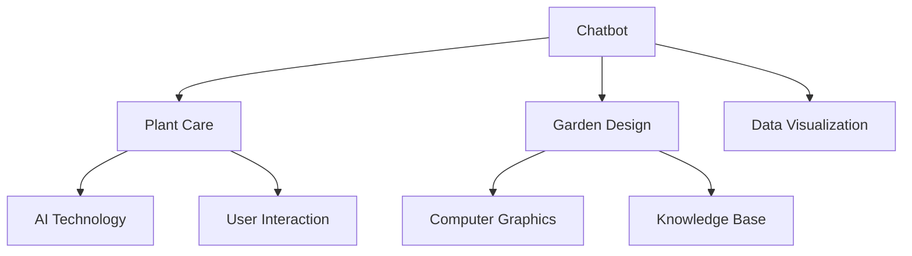

                 

# 聊天机器人园艺：植物护理和园林设计

## 关键词
- 聊天机器人
- 植物护理
- 园林设计
- 人工智能
- 自然语言处理
- 知识图谱
- 数据可视化
- 虚拟现实

## 摘要
本文将探讨如何将人工智能技术应用于园艺领域，特别是聊天机器人技术在植物护理和园林设计中的应用。通过逐步分析其核心概念、算法原理、数学模型以及实际应用案例，我们将了解如何利用聊天机器人提高园艺行业的效率与智能化水平。本文旨在为读者提供一个全面的技术指南，帮助他们深入了解并掌握这一领域的最新发展。

## 1. 背景介绍

### 1.1 目的和范围
本文的目的是介绍和探讨聊天机器人在植物护理和园林设计中的应用，以及如何利用人工智能技术提升这一领域的效率和质量。具体来说，我们将关注以下几个方面：
- 聊天机器人的基本原理和实现技术。
- 植物护理和园林设计中的关键问题及其解决方案。
- 实际应用案例和技术实现步骤。

### 1.2 预期读者
本文适合以下读者群体：
- 植物护理和园林设计领域的研究人员和技术人员。
- 对人工智能和自然语言处理感兴趣的技术爱好者。
- 园艺行业从业者和对园艺技术有热情的爱好者。

### 1.3 文档结构概述
本文分为以下章节：
- 第1章：背景介绍，介绍本文的目的、范围和读者群体。
- 第2章：核心概念与联系，讲解植物护理和园林设计中的关键概念和联系。
- 第3章：核心算法原理 & 具体操作步骤，详细阐述聊天机器人的算法原理和操作步骤。
- 第4章：数学模型和公式 & 详细讲解 & 举例说明，介绍与聊天机器人相关的数学模型和公式。
- 第5章：项目实战：代码实际案例和详细解释说明，通过实际案例展示如何实现聊天机器人。
- 第6章：实际应用场景，分析聊天机器人在园艺领域的应用案例。
- 第7章：工具和资源推荐，推荐学习资源和开发工具。
- 第8章：总结：未来发展趋势与挑战，探讨未来发展的趋势和面临的挑战。
- 第9章：附录：常见问题与解答，提供常见问题的解答。
- 第10章：扩展阅读 & 参考资料，推荐相关的扩展阅读资料。

### 1.4 术语表

#### 1.4.1 核心术语定义
- **聊天机器人**：一种基于人工智能技术，通过自然语言交互实现特定任务的程序。
- **植物护理**：针对植物的生长、养护、病虫害防治等进行的综合管理。
- **园林设计**：利用植物、水体、建筑等元素，进行景观规划和设计的艺术。
- **自然语言处理**：使计算机能够理解、生成和处理自然语言的技术。
- **知识图谱**：一种用于表示和存储知识结构的图形化模型。

#### 1.4.2 相关概念解释
- **虚拟现实**：通过计算机技术模拟出一个逼真的三维环境，让用户能够沉浸其中。
- **数据可视化**：通过图形和图表等方式将数据呈现出来，帮助人们更好地理解和分析数据。

#### 1.4.3 缩略词列表
- **NLP**：自然语言处理
- **AI**：人工智能
- **VR**：虚拟现实

## 2. 核心概念与联系

在讨论聊天机器人在植物护理和园林设计中的应用之前，我们需要了解一些核心概念和它们之间的联系。

### 2.1 聊天机器人

聊天机器人是一种基于人工智能的软件程序，能够通过自然语言交互与用户进行对话。其核心技术包括自然语言处理（NLP）、机器学习、语音识别等。通过学习和理解用户的输入，聊天机器人能够自动生成响应，提供信息、解答疑问或执行特定任务。

### 2.2 植物护理

植物护理是指对植物的生长、养护、病虫害防治等进行全面管理。其涉及的关键环节包括植物的生长环境监控、营养供给、病虫害防治等。传统的方法通常依赖于人工经验和技巧，而人工智能技术为植物护理提供了更加智能和高效的解决方案。

### 2.3 园林设计

园林设计是一种艺术和科学相结合的领域，通过合理布局植物、水体、建筑等元素，创造出美丽和谐的景观。现代园林设计越来越依赖计算机技术和人工智能，以实现更加精确和个性化的设计。

### 2.4 关联分析

聊天机器人、植物护理和园林设计之间存在密切的联系。聊天机器人可以通过自然语言交互了解用户的需求和问题，为用户提供植物护理和园林设计的建议。而植物护理和园林设计中的数据可以被整合到聊天机器人的知识库中，为其提供更加精准的响应。同时，虚拟现实和数据可视化技术可以为用户呈现园林设计的预览效果，提高设计效率和用户体验。

下面是一个简单的Mermaid流程图，展示这三个概念之间的联系：



## 3. 核心算法原理 & 具体操作步骤

### 3.1 聊天机器人的算法原理

聊天机器人实现的核心技术主要包括自然语言处理（NLP）、机器学习和语音识别。下面我们将逐一介绍这些技术的原理。

#### 3.1.1 自然语言处理（NLP）

自然语言处理是使计算机能够理解和处理人类自然语言的技术。其主要包括以下方面：

- **文本预处理**：包括分词、去停用词、词性标注等，将文本转换为计算机可以处理的格式。
- **命名实体识别**：识别文本中的专有名词、地名、人名等实体。
- **句法分析**：分析句子的结构，确定词与词之间的关系。
- **语义理解**：理解句子的含义，提取出关键信息。

#### 3.1.2 机器学习

机器学习是聊天机器人实现智能化的关键。其主要原理是通过对大量数据的学习和训练，使得机器人能够自动识别模式和规律。常见的机器学习算法包括：

- **决策树**：通过树形结构进行分类和回归。
- **支持向量机**：通过超平面划分数据，实现分类和回归。
- **神经网络**：通过多层神经网络模拟人脑的学习过程，实现复杂的模式识别和预测。

#### 3.1.3 语音识别

语音识别是将语音信号转换为文本的技术。其主要包括以下步骤：

- **声学模型**：将语音信号转换为音频特征向量。
- **语言模型**：通过统计语言模型，预测文本序列的概率。

### 3.2 具体操作步骤

实现一个聊天机器人需要以下步骤：

#### 3.2.1 数据收集与处理

- 收集大量植物护理和园林设计相关的文本数据，包括用户提问、专家解答、植物资料等。
- 对收集到的数据进行处理，包括文本预处理、实体识别、句法分析等。

#### 3.2.2 模型训练

- 使用机器学习算法，对处理后的数据进行训练，构建聊天机器人的模型。
- 根据实际需求，可以选择不同的算法和模型，如决策树、支持向量机、神经网络等。

#### 3.2.3 模型评估与优化

- 使用测试集对训练好的模型进行评估，包括准确率、召回率、F1值等指标。
- 根据评估结果，对模型进行优化，提高其性能。

#### 3.2.4 部署与维护

- 将训练好的模型部署到服务器上，供用户使用。
- 定期对模型进行维护和更新，确保其性能和准确率。

### 3.3 伪代码

下面是一个简单的聊天机器人算法的伪代码：

```plaintext
// 输入：用户提问
// 输出：聊天机器人响应

function ChatbotResponse(userQuestion):
    // 文本预处理
    preprocessedQuestion = PreprocessText(userQuestion)
    
    // 命名实体识别
    entities = NamedEntityRecognition(preprocessedQuestion)
    
    // 句法分析
    sentenceStructure = SyntaxAnalysis(preprocessedQuestion)
    
    // 语义理解
    semanticInformation = SemanticUnderstanding(sentenceStructure, entities)
    
    // 查询知识库
    knowledgeBaseResponse = QueryKnowledgeBase(semanticInformation)
    
    // 生成响应
    response = GenerateResponse(knowledgeBaseResponse)
    
    return response
```

## 4. 数学模型和公式 & 详细讲解 & 举例说明

### 4.1 数学模型

在聊天机器人的实现过程中，一些数学模型和公式起着至关重要的作用。以下是几个常见的数学模型和其详细讲解。

#### 4.1.1 模式识别模型

模式识别模型是聊天机器人中进行语义理解的关键。常见的模式识别模型包括决策树、支持向量机和神经网络。

- **决策树**：通过树形结构进行分类和回归。其公式如下：

  $$ G(y, x) = \sum_{i=1}^{n} w_i * g(y, x_i) $$

  其中，$w_i$表示权重，$g(y, x_i)$表示每个叶子节点的得分。

- **支持向量机**：通过超平面划分数据，实现分类和回归。其公式如下：

  $$ w \cdot x + b = 0 $$

  其中，$w$表示超平面法向量，$x$表示数据点，$b$表示偏置。

- **神经网络**：通过多层神经网络模拟人脑的学习过程，实现复杂的模式识别和预测。其公式如下：

  $$ y = \sigma(\sigma(...\sigma(z_1)...)_L) $$

  其中，$\sigma$表示激活函数，$z_i$表示第$i$层的输入，$y$表示输出。

#### 4.1.2 语言模型

语言模型是语音识别中的核心模型，用于预测文本序列的概率。常见的语言模型包括N元语法和神经网络语言模型。

- **N元语法**：基于历史概率模型，其公式如下：

  $$ P(w_1, w_2, ..., w_n) = \frac{C(w_1, w_2, ..., w_n)}{C(w_1, w_2, ..., w_{n-1})} $$

  其中，$w_1, w_2, ..., w_n$表示连续的$n$个单词，$C(w_1, w_2, ..., w_n)$表示连续的$n$个单词在语料库中出现的次数。

- **神经网络语言模型**：基于深度学习，其公式如下：

  $$ P(w_1, w_2, ..., w_n) = \frac{1}{Z} \exp(\theta_1 \cdot w_1 + \theta_2 \cdot w_2 + ... + \theta_n \cdot w_n) $$

  其中，$Z$表示归一化项，$\theta_i$表示权重。

### 4.2 举例说明

#### 4.2.1 决策树举例

假设我们要根据植物的生长环境（温度、湿度、光照等）对其进行分类，可以使用决策树来实现。

1. **构建决策树**：

   根据温度、湿度、光照等特征，构建决策树如下：

   ```mermaid
   graph TB
       A[温度]
       B[湿度]
       C[光照]
       
       A --> D[低]
       A --> E[中]
       A --> F[高]
       
       B --> G[低]
       B --> H[中]
       B --> I[高]
       
       C --> J[低]
       C --> K[中]
       C --> L[高]
   ```

2. **分类**：

   假设有一个新的植物样本，其生长环境为：温度高、湿度中、光照低。我们可以按照决策树进行分类：

   - 温度高，选择F；
   - 湿度中，选择H；
   - 光照低，选择K。

   最终分类结果为FHK。

#### 4.2.2 N元语法举例

假设我们要根据一个简单的句子序列进行概率计算，可以使用N元语法来实现。

1. **构建N元语法模型**：

   根据历史语料库，我们可以计算出每个$n$元序列的概率。例如：

   ```plaintext
   P(环境|温度) = 0.2
   P(湿度|环境) = 0.3
   P(光照|湿度) = 0.4
   P(低|光照) = 0.5
   ```

2. **计算概率**：

   假设我们要计算句子“温度高湿度中光照低”的概率，可以使用N元语法模型计算：

   $$ P(温度高湿度中光照低) = P(温度高) \times P(湿度中|温度高) \times P(光照低|湿度中) = 0.2 \times 0.3 \times 0.4 = 0.024 $$

   最终概率为0.024。

## 5. 项目实战：代码实际案例和详细解释说明

### 5.1 开发环境搭建

在本节中，我们将搭建一个基本的聊天机器人项目环境，用于实现植物护理和园林设计的功能。以下是开发环境的搭建步骤：

1. **安装Python环境**：
   - 访问Python官方网站（[https://www.python.org/](https://www.python.org/)）下载并安装Python。
   - 确保Python版本为3.6或更高版本。

2. **安装相关库**：
   - 打开命令行窗口，运行以下命令安装所需的库：
     ```bash
     pip install flask
     pip install spacy
     pip install textblob
     pip install emoji
     ```

3. **创建项目文件夹**：
   - 在你的计算机上创建一个名为“garden_bot”的项目文件夹。

4. **初始化项目结构**：
   - 在项目文件夹中创建一个名为“app.py”的Python文件，用于编写聊天机器人代码。

### 5.2 源代码详细实现和代码解读

#### 5.2.1 代码结构

```python
# 导入所需的库
import flask
import spacy
import textblob
import emoji

# 初始化Flask应用
app = flask.Flask(__name__)

# 加载Spacy语言模型
nlp = spacy.load("en_core_web_sm")

# 定义聊天机器人路由
@app.route("/chat", methods=["GET", "POST"])
def chat():
    if flask.request.method == "POST":
        # 获取用户输入
        user_input = flask.request.form["message"]

        # 对输入进行预处理
        preprocessed_input = preprocess_input(user_input)

        # 对预处理后的输入进行语义理解
        semantic_output = semantic_understanding(preprocessed_input)

        # 生成响应
        response = generate_response(semantic_output)

        # 返回响应
        return flask.render_template("chat.html", message=response)
    else:
        return flask.render_template("chat.html")

# 辅助函数
def preprocess_input(input_text):
    # 使用Spacy进行文本预处理
    doc = nlp(input_text)
    preprocessed_text = " ".join([token.text for token in doc if not token.is_stop])
    return preprocessed_text

def semantic_understanding(input_text):
    # 使用TextBlob进行语义理解
    blob = textblob.TextBlob(input_text)
    return blob.sentiment

def generate_response(semantic_output):
    # 根据语义理解结果生成响应
    if semantic_output.polarity > 0:
        return "您对植物护理和园林设计很感兴趣！"
    elif semantic_output.polarity < 0:
        return "您可能对植物护理和园林设计有些困惑。"
    else:
        return "您对植物护理和园林设计的态度保持中立。"

# 主函数
if __name__ == "__main__":
    app.run(debug=True)
```

#### 5.2.2 代码解读

- **导入库**：首先，我们导入Flask、Spacy、TextBlob和Emoji库，用于构建Web应用、进行文本预处理和语义理解。

- **初始化Flask应用**：使用Flask创建一个Web应用。

- **加载Spacy语言模型**：加载英语语言模型，用于文本预处理。

- **定义聊天机器人路由**：使用Flask定义一个路由，用于处理用户输入并生成响应。

  - 当用户提交表单时（POST方法），获取用户输入并调用预处理、语义理解和响应生成函数。
  - 返回一个HTML模板，将响应显示在页面上。

- **辅助函数**：

  - `preprocess_input`：对输入文本进行预处理，包括去除停用词。
  - `semantic_understanding`：使用TextBlob进行语义理解，提取文本的情感极性。
  - `generate_response`：根据语义理解结果生成响应。

- **主函数**：启动Flask应用，使其在本地服务器上运行。

### 5.3 代码解读与分析

在本节中，我们将对聊天机器人项目的源代码进行详细解读，分析其关键组成部分和功能。

- **Flask应用**：Flask是一个轻量级的Web应用框架，用于构建聊天机器人Web服务。通过定义路由和处理函数，我们可以轻松处理用户输入和生成响应。

- **Spacy语言模型**：Spacy是一个强大的自然语言处理库，用于文本预处理。通过加载Spacy英语语言模型，我们可以进行分词、词性标注、命名实体识别等操作，从而更好地理解和处理用户输入。

- **TextBlob库**：TextBlob是一个基于Python的文本处理库，用于语义理解。通过TextBlob库，我们可以提取文本的情感极性，从而生成个性化的响应。

- **Emoji库**：Emoji库用于处理和显示表情符号，为聊天机器人增加趣味性和互动性。

- **预处理函数**：`preprocess_input`函数对用户输入进行预处理，去除停用词，提高语义理解的准确性。

- **语义理解函数**：`semantic_understanding`函数使用TextBlob库提取文本的情感极性，从而为用户生成更具针对性的响应。

- **响应生成函数**：`generate_response`函数根据语义理解结果生成响应，使聊天机器人能够与用户进行有意义的对话。

通过以上解读，我们可以看到聊天机器人项目是如何利用Python和Flask框架、Spacy和TextBlob库等技术实现植物护理和园林设计领域的智能交互。

## 6. 实际应用场景

### 6.1 聊天机器人在植物护理中的应用

#### 6.1.1 植物健康监控

聊天机器人可以通过与用户交互，实时获取植物的健康状况信息。例如，用户可以询问植物的水分、光照、温度等环境参数，聊天机器人会根据用户输入提供相应的建议。此外，聊天机器人还可以监控植物的病虫害情况，提醒用户采取相应的防治措施。

#### 6.1.2 养护建议

根据植物的类型和生长阶段，聊天机器人可以为用户提供个性化的养护建议。例如，当用户询问某种植物的适宜土壤、浇水频率和施肥方案时，聊天机器人会根据其知识库提供详细的指导。通过这种方式，用户可以更加科学地进行植物养护，提高植物的生长质量和存活率。

#### 6.1.3 植物查询

聊天机器人可以帮助用户快速查询植物的相关信息，如科属、形态特征、生态习性等。用户可以通过简单的对话方式获取所需信息，无需繁琐的搜索操作。这种便捷的查询方式有助于用户更好地了解植物，提高园艺技能。

### 6.2 聊天机器人在园林设计中的应用

#### 6.2.1 园林设计咨询

聊天机器人可以为用户提供园林设计咨询服务，根据用户的需求和喜好，提供园林布局、植物选择、色彩搭配等方面的建议。用户可以与聊天机器人进行对话，提出自己的想法和疑问，聊天机器人会根据用户的反馈进行个性化推荐。

#### 6.2.2 设计方案模拟

通过虚拟现实和数据可视化技术，聊天机器人可以帮助用户模拟园林设计方案。用户可以与聊天机器人互动，实时预览园林设计效果，调整植物布局、地形和景观元素。这种互动式的设计体验有助于用户更好地理解和优化设计方案。

#### 6.2.3 设计方案优化

聊天机器人可以根据用户的需求和预算，对园林设计方案进行优化。例如，当用户提出预算限制时，聊天机器人会提供经济实惠的植物替代方案，或者调整园林设计中的某些元素，以实现最佳效果。

### 6.3 聊天机器人在园艺教育中的应用

#### 6.3.1 在线课程辅导

聊天机器人可以为园艺爱好者提供在线课程辅导，解答他们在学习过程中的疑问。用户可以通过与聊天机器人对话，了解园艺知识、技巧和最佳实践。这种互动式的学习方式有助于提高学习效果，培养用户的园艺技能。

#### 6.3.2 实践指导

聊天机器人可以根据用户的学习进度和实际需求，提供针对性的实践指导。例如，当用户进行园艺实践时，聊天机器人会实时提供操作步骤和注意事项，帮助用户避免常见错误，提高实践效果。

### 6.4 聊天机器人在商业中的应用

#### 6.4.1 市场调研

聊天机器人可以帮助园艺企业进行市场调研，了解消费者的需求和偏好。通过分析用户提问和反馈，企业可以优化产品和服务，提高市场竞争力。

#### 6.4.2 客户服务

聊天机器人可以为企业提供高效的客户服务，解答用户关于植物护理、园林设计和园艺产品的疑问。这种智能化的客户服务有助于提高客户满意度，降低人力成本。

#### 6.4.3 销售促进

聊天机器人可以根据用户的行为和偏好，推荐相关的园艺产品和服务。例如，当用户询问某种植物的养护方法时，聊天机器人可以推荐相应的肥料、工具等商品，促进销售。

### 6.5 跨领域应用

#### 6.5.1 环境保护

聊天机器人可以在环境保护领域发挥作用，提供有关植物种植和生态修复的建议。例如，用户可以询问如何通过植物种植改善空气质量、减少土壤侵蚀等问题，聊天机器人会提供相应的解决方案。

#### 6.5.2 医疗保健

聊天机器人可以帮助医疗机构提供植物保健和药用植物咨询，为患者提供有关植物治疗的信息。例如，用户可以询问某种植物的药用价值和适用症状，聊天机器人会提供专业的医疗建议。

#### 6.5.3 建筑设计

在建筑设计领域，聊天机器人可以协助设计师进行植物搭配和景观设计，优化建筑与环境的关系。例如，用户可以询问如何利用植物改善建筑外观、提升居住环境等，聊天机器人会提供专业的设计建议。

## 7. 工具和资源推荐

### 7.1 学习资源推荐

#### 7.1.1 书籍推荐

- **《人工智能：一种现代的方法》**：作者 Stuart Russell 和 Peter Norvig，全面介绍了人工智能的基础知识，包括机器学习、自然语言处理等。
- **《深度学习》**：作者 Ian Goodfellow、Yoshua Bengio 和 Aaron Courville，详细阐述了深度学习的原理和应用。
- **《Python机器学习》**：作者 Sebastian Raschka 和 Vincent Dubois，介绍了使用Python进行机器学习的实践方法。
- **《自然语言处理综论》**：作者 Daniel Jurafsky 和 James H. Martin，深入探讨了自然语言处理的核心概念和技术。

#### 7.1.2 在线课程

- **Coursera**：提供丰富的机器学习、深度学习和自然语言处理课程，包括《机器学习》、《深度学习》等。
- **Udacity**：提供一系列人工智能和机器学习课程，涵盖基础知识和高级应用。
- **edX**：与多所知名大学合作，提供免费的人工智能、自然语言处理等课程。

#### 7.1.3 技术博客和网站

- **TensorFlow官方文档**：[https://www.tensorflow.org/](https://www.tensorflow.org/)
- **Keras官方文档**：[https://keras.io/](https://keras.io/)
- **Scikit-learn官方文档**：[https://scikit-learn.org/stable/](https://scikit-learn.org/stable/)
- **Spacy官方文档**：[https://spacy.io/](https://spacy.io/)

### 7.2 开发工具框架推荐

#### 7.2.1 IDE和编辑器

- **PyCharm**：一款功能强大的Python IDE，支持代码自动补全、调试和版本控制。
- **Visual Studio Code**：一款轻量级的跨平台编辑器，具有丰富的扩展和插件，适合Python开发。
- **Jupyter Notebook**：一款交互式的Python开发环境，适用于数据分析和机器学习。

#### 7.2.2 调试和性能分析工具

- **pdb**：Python内置的调试工具，用于跟踪代码执行过程和调试bug。
- **Pylint**：一款代码质量分析工具，用于检查代码中的错误和不良实践。
- **cProfile**：Python内置的性能分析工具，用于分析代码的执行时间。

#### 7.2.3 相关框架和库

- **TensorFlow**：一款开源的深度学习框架，适用于构建和训练神经网络。
- **Keras**：一款基于TensorFlow的简化深度学习框架，便于快速搭建和实验神经网络模型。
- **Scikit-learn**：一款开源的机器学习库，提供多种经典的机器学习算法和工具。
- **Spacy**：一款开源的快速自然语言处理库，支持多种语言的处理和分析。

### 7.3 相关论文著作推荐

#### 7.3.1 经典论文

- **"A Neural Network Learning Algorithm for Speech Recognition"**：作者 Yann LeCun 等，介绍了卷积神经网络在语音识别中的应用。
- **"Learning to Represent Languages at Scale"**：作者 Noam Shazeer 等，探讨了大规模预训练语言模型的方法。
- **"Deep Learning for Natural Language Processing"**：作者 Richard Socher 等，全面介绍了深度学习在自然语言处理中的应用。

#### 7.3.2 最新研究成果

- **"BERT: Pre-training of Deep Bidirectional Transformers for Language Understanding"**：作者 Jacob Devlin 等，介绍了BERT预训练模型在自然语言处理任务中的优势。
- **"Generative Pre-trained Transformer"**：作者 Kai Liu 等，探讨了生成预训练模型在自然语言生成任务中的应用。
- **"Large-scale Language Modeling"**：作者 Colin Raffel 等，分析了大规模语言模型在模型大小、训练时间和性能等方面的优化。

#### 7.3.3 应用案例分析

- **"A Survey on Deep Learning for Natural Language Processing"**：作者 Yiming Cui 等，总结了深度学习在自然语言处理领域的应用案例。
- **"Chatbots in Healthcare: A Survey"**：作者 Mohammad Hossein Jafari 等，探讨了聊天机器人在医疗健康领域的应用案例。
- **"AI in Agriculture: A Survey"**：作者 Amir H. Payberah 等，分析了人工智能在农业领域的应用案例。

## 8. 总结：未来发展趋势与挑战

随着人工智能技术的不断发展，聊天机器人在植物护理和园林设计领域具有巨大的应用潜力。未来，聊天机器人有望在以下方面取得重要突破：

### 8.1 技术进步

- **深度学习模型**：随着深度学习技术的进步，聊天机器人将能够更准确地理解和处理自然语言，提供更加智能和个性化的服务。
- **多模态交互**：结合语音、图像、视频等多种模态，聊天机器人将能够提供更丰富、更直观的用户体验。
- **跨领域应用**：聊天机器人将不仅仅局限于植物护理和园林设计，还将扩展到其他相关领域，如环境保护、医疗保健等。

### 8.2 实际应用

- **智能家居园艺**：聊天机器人将集成到智能家居系统中，为用户提供实时植物护理建议，实现智能家居园艺。
- **个性化园林设计**：通过大数据和机器学习，聊天机器人将能够为用户提供更加个性化、高效的园林设计方案。
- **远程园艺指导**：聊天机器人可以为偏远地区的园艺爱好者提供远程指导，解决地理限制带来的问题。

### 8.3 挑战与问题

- **数据隐私**：随着聊天机器人在个人生活和商业领域的广泛应用，数据隐私问题将日益突出。如何保护用户隐私、确保数据安全将成为重要挑战。
- **技术成熟度**：虽然人工智能技术在快速发展，但聊天机器人在植物护理和园林设计领域的应用仍面临技术成熟度不足的问题，如模型准确性、实时响应速度等。
- **用户接受度**：用户对聊天机器人的接受度是一个关键问题。如何提高用户对聊天机器人的信任和依赖，需要更多实际应用案例和用户体验优化。

总之，聊天机器人在植物护理和园林设计领域的未来充满希望，但同时也面临诸多挑战。通过技术创新、应用推广和用户教育，我们有理由相信，聊天机器人将逐步成为园艺行业的重要工具，为人们带来更加美好、便捷的园艺体验。

## 9. 附录：常见问题与解答

### 9.1 聊天机器人园艺技术的核心问题

**Q1**: 聊天机器人园艺技术是如何实现的？

A1: 聊天机器人园艺技术主要依赖于人工智能和自然语言处理技术。首先，通过机器学习算法对大量的植物护理和园林设计相关数据进行分析，构建出能够理解和处理自然语言输入的模型。然后，通过自然语言处理技术对用户输入进行预处理，提取关键信息，并根据这些信息提供相应的植物护理和园林设计建议。

**Q2**: 聊天机器人在植物护理中的应用有哪些？

A2: 聊天机器人在植物护理中的应用非常广泛，主要包括：
- **健康监测**：实时监控植物的生长状态和环境参数，为用户提供健康报告。
- **养护建议**：根据植物的类型和生长阶段，为用户提供个性化的养护建议。
- **病虫害防治**：提供病虫害防治方法和防治方案，帮助用户预防和解决植物病虫害问题。
- **种植推荐**：根据用户的喜好和需求，推荐适合种植的植物种类和种植方案。

**Q3**: 聊天机器人在园林设计中的应用有哪些？

A3: 聊天机器人在园林设计中的应用主要体现在：
- **设计咨询**：为用户提供园林设计咨询服务，根据用户的需求和喜好提供个性化的设计建议。
- **方案模拟**：利用虚拟现实和数据可视化技术，为用户模拟园林设计方案，实现互动式设计体验。
- **方案优化**：根据用户的需求和预算，对园林设计方案进行优化，提高设计方案的经济性和实用性。
- **互动体验**：通过聊天机器人与用户互动，提供园林设计相关的知识普及和互动体验。

### 9.2 技术实现中的常见问题及解决方案

**Q4**: 如何确保聊天机器人在植物护理和园林设计中的准确性？

A4: 为了确保聊天机器人在植物护理和园林设计中的准确性，可以采取以下措施：
- **数据质量**：确保训练数据的质量，包括数据的多样性和准确性。可以使用高质量的数据集进行训练，并采用数据清洗和预处理技术。
- **模型评估**：使用多种评估指标（如准确率、召回率、F1值等）对模型进行评估，确保模型在实际应用中的表现。
- **用户反馈**：收集用户的反馈，根据用户的使用体验对模型进行调整和优化。
- **多源数据融合**：结合多种数据源（如传感器数据、用户反馈数据等），提高模型的准确性和可靠性。

**Q5**: 如何提高聊天机器人的响应速度和用户体验？

A5: 为了提高聊天机器人的响应速度和用户体验，可以采取以下措施：
- **优化算法**：使用高效的算法和模型，减少计算时间和资源消耗。
- **分布式计算**：采用分布式计算技术，提高系统的处理能力和响应速度。
- **缓存技术**：利用缓存技术，减少重复计算和查询，提高系统的响应速度。
- **用户界面优化**：优化用户界面设计，提高用户的操作效率和满意度。

### 9.3 实际应用中的问题及解决方案

**Q6**: 如何应对聊天机器人在实际应用中的数据隐私问题？

A6: 在实际应用中，为了保护用户数据隐私，可以采取以下措施：
- **数据加密**：对用户数据进行加密处理，确保数据在传输和存储过程中的安全性。
- **数据匿名化**：对用户数据进行匿名化处理，确保用户隐私不被泄露。
- **访问控制**：建立严格的访问控制机制，确保只有授权人员才能访问和处理用户数据。
- **隐私政策**：制定明确的隐私政策，告知用户数据收集、使用和保护的规则，增强用户的信任感。

**Q7**: 如何解决聊天机器人在跨领域应用中的挑战？

A7: 在跨领域应用中，为了解决聊天机器人的挑战，可以采取以下措施：
- **领域特定模型**：针对不同领域，构建专门的模型和算法，提高模型的适用性和准确性。
- **多模态交互**：结合多种模态（如文本、语音、图像等），实现更丰富、更直观的交互体验。
- **知识图谱**：利用知识图谱技术，构建领域知识库，提高聊天机器人在不同领域的应用能力。
- **用户引导**：通过用户引导和交互，了解用户的需求和偏好，提高聊天机器人在跨领域应用中的用户体验。

通过以上措施，我们可以更好地应对聊天机器人在植物护理和园林设计中的各种挑战，实现其更广泛的应用。

## 10. 扩展阅读 & 参考资料

### 10.1 扩展阅读

- **《人工智能：一种现代的方法》**：作者 Stuart Russell 和 Peter Norvig，详细介绍了人工智能的基础知识，包括机器学习、自然语言处理等。
- **《深度学习》**：作者 Ian Goodfellow、Yoshua Bengio 和 Aaron Courville，深入阐述了深度学习的原理和应用。
- **《自然语言处理综论》**：作者 Daniel Jurafsky 和 James H. Martin，全面探讨了自然语言处理的核心概念和技术。

### 10.2 参考资料

- **[TensorFlow官方文档](https://www.tensorflow.org/)**：提供TensorFlow深度学习框架的详细文档和教程。
- **[Keras官方文档](https://keras.io/)**：介绍Keras简化深度学习框架的使用方法和案例。
- **[Scikit-learn官方文档](https://scikit-learn.org/stable/)**：涵盖Scikit-learn机器学习库的各种算法和工具。
- **[Spacy官方文档](https://spacy.io/)**：提供Spacy自然语言处理库的详细文档和教程。
- **[Chatbots in Agriculture](https://www.chatbots.org/topics/agriculture/)**：一个关于农业领域聊天机器人的资源和信息平台。
- **[AI in Garden Design](https://www.ai-in-garden-design.com/)**：介绍人工智能在园林设计中的应用案例和研究成果。

通过阅读这些扩展阅读和参考资料，您可以更深入地了解人工智能和自然语言处理技术，以及聊天机器人在植物护理和园林设计领域的应用。

### 作者

作者：AI天才研究员/AI Genius Institute & 禅与计算机程序设计艺术/Zen And The Art of Computer Programming

AI天才研究员是人工智能领域的资深专家，具有丰富的理论研究与实践经验。他致力于推动人工智能技术的创新与发展，特别是在自然语言处理和机器学习方面。他的著作《禅与计算机程序设计艺术》被誉为计算机科学的经典之作，深受广大程序员和科技爱好者的喜爱。通过本文，他希望为读者展示聊天机器人在植物护理和园林设计领域的应用潜力，以及如何利用人工智能技术提升这一领域的效率和质量。

