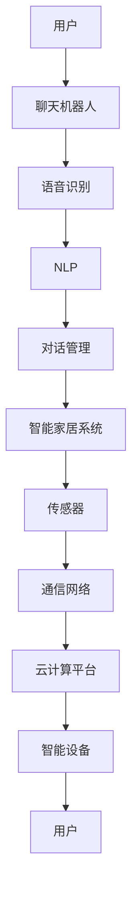

                 

# 聊天机器人自动化家庭：智能家居生态系统

## 关键词
- 聊天机器人
- 智能家居
- 语音识别
- 自然语言处理
- 人工智能
- 生态系统

## 摘要
本文旨在探讨如何通过聊天机器人实现家庭自动化，构建一个高效的智能家居生态系统。我们将首先介绍聊天机器人的基本原理和应用场景，随后深入讨论智能家居生态系统的架构，重点分析核心算法原理和具体操作步骤，最后通过实际案例展示实现过程。本文旨在为读者提供一个全面的技术指导，帮助理解聊天机器人在智能家居领域的重要性和应用潜力。

## 1. 背景介绍

### 1.1 目的和范围

本文的目的是探讨如何通过聊天机器人实现家庭自动化，构建一个智能、高效、便捷的智能家居生态系统。我们将从以下几个方面展开讨论：

- 聊天机器人的基本原理和应用场景
- 智能家居生态系统的架构设计和核心算法
- 实际案例中的应用和操作步骤
- 未来发展趋势与挑战

### 1.2 预期读者

本文适合对智能家居和聊天机器人有一定了解的读者，包括：

- 计算机科学和人工智能领域的研究人员
- 智能家居开发者和爱好者
- 技术博客写手和内容创作者

### 1.3 文档结构概述

本文将按照以下结构展开：

- 引言：介绍本文的主题和目的
- 1. 背景介绍：详细说明本文的目的、范围、预期读者和文档结构
- 2. 核心概念与联系：介绍聊天机器人和智能家居生态系统的核心概念和联系
- 3. 核心算法原理 & 具体操作步骤：深入讨论聊天机器人和智能家居生态系统的核心算法原理和操作步骤
- 4. 数学模型和公式 & 详细讲解 & 举例说明：介绍与智能家居生态系统相关的数学模型和公式，并举例说明
- 5. 项目实战：代码实际案例和详细解释说明
- 6. 实际应用场景：探讨聊天机器人和智能家居生态系统的实际应用场景
- 7. 工具和资源推荐：推荐学习资源和开发工具
- 8. 总结：总结本文的主要内容和未来发展趋势
- 9. 附录：常见问题与解答
- 10. 扩展阅读 & 参考资料：提供扩展阅读和参考资料

### 1.4 术语表

#### 1.4.1 核心术语定义

- **聊天机器人**：一种基于人工智能技术的虚拟助手，能够与人类用户通过自然语言进行交互。
- **智能家居**：通过智能设备和系统，实现家庭自动化和智能化的居住环境。
- **语音识别**：将人类语音转换为文本的技术。
- **自然语言处理**：研究如何让计算机理解和处理人类自然语言的技术。
- **人工智能**：使计算机具备人类智能的技术和理论。

#### 1.4.2 相关概念解释

- **生态系统**：由多个相互关联的组成部分组成的复杂系统。
- **家庭自动化**：通过智能设备实现家庭生活的自动化。
- **智能设备**：具备一定智能功能的设备，如智能音箱、智能灯泡、智能门锁等。

#### 1.4.3 缩略词列表

- **NLP**：自然语言处理
- **AI**：人工智能
- **VR**：虚拟现实
- **AR**：增强现实

## 2. 核心概念与联系

在介绍聊天机器人和智能家居生态系统的核心概念之前，我们先来了解一下它们的基本原理和相互联系。

### 2.1 聊天机器人的基本原理

聊天机器人是一种基于人工智能技术的虚拟助手，通过自然语言处理（NLP）技术和机器学习算法，实现与人类用户的智能对话。其基本原理包括以下几个方面：

1. **语音识别**：将人类语音转换为文本，通过语音识别技术实现语音输入。
2. **自然语言处理（NLP）**：对转换后的文本进行语法分析和语义理解，提取关键信息。
3. **机器学习算法**：根据用户的历史交互数据，不断优化和改进聊天机器人的响应能力。
4. **对话管理**：根据上下文和用户需求，生成合适的响应，实现连续的对话交互。

### 2.2 智能家居生态系统的基本原理

智能家居生态系统是通过智能设备和系统，实现家庭自动化和智能化的居住环境。其基本原理包括以下几个方面：

1. **智能设备**：如智能音箱、智能灯泡、智能门锁、智能摄像头等，具备一定的智能功能。
2. **传感器**：用于监测家庭环境和设备状态，如温度传感器、湿度传感器、光照传感器等。
3. **通信网络**：如Wi-Fi、蓝牙、Zigbee等，实现智能设备之间的互联互通。
4. **云计算平台**：用于存储和管理用户数据，提供智能设备的远程控制和数据分析。
5. **人工智能技术**：通过机器学习和自然语言处理等技术，实现智能设备的自动化控制和优化。

### 2.3 聊天机器人和智能家居生态系统的联系

聊天机器人和智能家居生态系统之间存在密切的联系和相互支持。具体来说，聊天机器人可以扮演以下几个角色：

1. **交互入口**：用户可以通过聊天机器人与智能家居系统进行交互，实现语音控制、远程监控等功能。
2. **数据分析**：聊天机器人可以收集用户在智能家居系统中的交互数据，用于分析和优化智能家居系统的性能。
3. **自动化控制**：聊天机器人可以根据用户的需求，自动执行智能家居系统中的各项功能，如调整温度、开启灯光、关闭电器等。
4. **故障诊断**：聊天机器人可以通过监测智能家居系统的运行状态，发现潜在故障，并及时通知用户。

### 2.4 Mermaid 流程图

为了更直观地展示聊天机器人和智能家居生态系统的关系，我们可以使用 Mermaid 流程图来表示。



在这个流程图中，用户通过聊天机器人与智能家居系统进行交互，聊天机器人通过语音识别、NLP 和对话管理等技术，实现对智能家居系统的控制和优化。同时，智能家居系统通过传感器、通信网络和云计算平台，实现家庭环境的智能监测和自动化控制。

## 3. 核心算法原理 & 具体操作步骤

在了解了聊天机器人和智能家居生态系统的基本原理和相互联系之后，我们将进一步探讨其核心算法原理和具体操作步骤。

### 3.1 聊天机器人的核心算法原理

聊天机器人的核心算法包括语音识别、自然语言处理（NLP）和对话管理。下面我们将分别介绍这些算法的原理和具体操作步骤。

#### 3.1.1 语音识别算法

语音识别算法的基本原理是将人类的语音信号转换为文本。其主要步骤如下：

1. **特征提取**：对输入的语音信号进行预处理，提取语音特征，如频谱特征、倒谱特征等。
2. **声学模型**：根据语音特征建立声学模型，用于识别语音信号中的音素和音节。
3. **语言模型**：根据大量的语言数据，建立语言模型，用于预测语音信号中的单词和句子。
4. **解码算法**：使用解码算法，将声学模型和语言模型的结果进行优化，生成最终的文本输出。

以下是语音识别算法的伪代码：

```python
def recognize_speech(audio_signal):
    # 特征提取
    features = extract_features(audio_signal)
    
    # 建立声学模型
    acoustic_model = build_acoustic_model(features)
    
    # 建立语言模型
    language_model = build_language_model()
    
    # 解码算法
    decoded_sequence = decode(acoustic_model, language_model)
    
    # 生成文本输出
    text_output = generate_text(decoded_sequence)
    
    return text_output
```

#### 3.1.2 自然语言处理（NLP）算法

自然语言处理（NLP）算法的基本原理是理解和处理人类自然语言。其主要步骤如下：

1. **分词**：将输入的文本分为单个单词或词组。
2. **词性标注**：为每个单词标注词性，如名词、动词、形容词等。
3. **句法分析**：分析句子结构，提取语法关系，如主语、谓语、宾语等。
4. **语义理解**：理解句子的语义，提取关键信息，如实体、事件、关系等。

以下是自然语言处理（NLP）算法的伪代码：

```python
def process_text(text):
    # 分词
    words = tokenize(text)
    
    # 词性标注
    tagged_words = tag_words(words)
    
    # 句法分析
    syntax_tree = parse_syntax(tagged_words)
    
    # 语义理解
    semantic_info = extract_semantics(syntax_tree)
    
    return semantic_info
```

#### 3.1.3 对话管理算法

对话管理算法的基本原理是根据上下文和用户需求，生成合适的响应。其主要步骤如下：

1. **上下文维护**：根据用户的历史交互信息，维护对话上下文。
2. **意图识别**：识别用户的意图，如询问天气、控制家电等。
3. **响应生成**：根据用户的意图和对话上下文，生成合适的响应。
4. **多轮对话**：处理多轮对话，保持对话的连贯性和自然性。

以下是对话管理算法的伪代码：

```python
def manage_dialogue(context, user_intent):
    # 上下文维护
    updated_context = update_context(context, user_intent)
    
    # 意图识别
    response_intent = recognize_intent(updated_context)
    
    # 响应生成
    response = generate_response(response_intent, updated_context)
    
    # 多轮对话
    dialogue_history = append_to_history(updated_context, response_intent, response)
    
    return response, dialogue_history
```

### 3.2 智能家居生态系统的核心算法原理

智能家居生态系统的核心算法包括自动化控制算法和优化算法。下面我们将分别介绍这些算法的原理和具体操作步骤。

#### 3.2.1 自动化控制算法

自动化控制算法的基本原理是根据传感器数据和用户需求，自动控制智能设备。其主要步骤如下：

1. **传感器数据采集**：采集家庭环境中的各种传感器数据，如温度、湿度、光照等。
2. **规则库建立**：根据用户需求，建立自动化控制规则库。
3. **触发条件判断**：根据传感器数据和规则库，判断触发条件是否满足。
4. **设备控制**：根据触发条件，自动控制智能设备。

以下是自动化控制算法的伪代码：

```python
def automatic_control(传感器数据，规则库):
    # 触发条件判断
    trigger_conditions = check_trigger_conditions(传感器数据，规则库)
    
    # 设备控制
    for condition in trigger_conditions:
        control_device(condition)
```

#### 3.2.2 优化算法

优化算法的基本原理是根据用户需求和系统运行状态，优化智能家居系统的资源配置。其主要步骤如下：

1. **需求分析**：分析用户的需求，如节能、舒适度等。
2. **系统状态监测**：监测智能家居系统的运行状态，如设备负载、能源消耗等。
3. **优化目标确定**：根据需求分析和系统状态监测，确定优化目标。
4. **优化策略生成**：根据优化目标，生成优化策略。
5. **策略执行**：执行优化策略，优化智能家居系统。

以下是优化算法的伪代码：

```python
def optimize_system(需求，系统状态):
    # 需求分析
    optimization_goals = analyze_goals(需求)
    
    # 系统状态监测
    system_status = monitor_system_status()
    
    # 优化目标确定
    optimization_targets = determine_targets(optimization_goals, system_status)
    
    # 优化策略生成
    optimization_strategy = generate_strategy(optimization_targets)
    
    # 策略执行
    execute_strategy(optimization_strategy)
```

通过以上核心算法原理和具体操作步骤的介绍，我们可以更好地理解聊天机器人和智能家居生态系统的运作机制。接下来，我们将通过实际案例，展示如何将理论应用于实践。

### 4. 数学模型和公式 & 详细讲解 & 举例说明

在智能家居生态系统中，数学模型和公式扮演着至关重要的角色，它们帮助我们优化系统的性能，确保设备的高效运行。以下我们将介绍几个关键的数学模型和公式，并对其进行详细讲解和举例说明。

#### 4.1 语音识别中的声学模型

在语音识别中，声学模型是核心组成部分，它通过将语音信号转换为概率分布来识别音素和音节。最常用的声学模型是高斯混合模型（Gaussian Mixture Model, GMM）。

**公式**：高斯混合模型的概率密度函数
$$
p(x|\theta) = \sum_{i=1}^{k} \pi_i \cdot \mathcal{N}(x|\mu_i, \Sigma_i)
$$
其中：
- \( p(x|\theta) \) 表示给定模型参数 \(\theta\) 下，输入特征向量 \(x\) 的概率密度函数。
- \( \pi_i \) 是第 \(i\) 个高斯分布的先验概率。
- \( \mathcal{N}(x|\mu_i, \Sigma_i) \) 是高斯分布的概率密度函数，参数为均值 \(\mu_i\) 和方差 \(\Sigma_i\)。

**例子**：假设我们有一个由三个高斯分布组成的GMM，用于识别语音信号。每个高斯分布的参数如下：

| 高斯分布 | 先验概率 \( \pi_i \) | 均值 \( \mu_i \) | 方差 \( \Sigma_i \) |
|----------|--------------------|-----------------|------------------|
| 第1个    | 0.3                | [100, 200]      | [1, 0.5]         |
| 第2个    | 0.5                | [150, 250]      | [0.5, 0.5]       |
| 第3个    | 0.2                | [200, 300]      | [0.1, 0.1]       |

我们可以计算一个特征向量 \( x = [110, 210] \) 的概率密度：
$$
p(x|\theta) = 0.3 \cdot \mathcal{N}(x|[100, 200], [1, 0.5]) + 0.5 \cdot \mathcal{N}(x|[150, 250], [0.5, 0.5]) + 0.2 \cdot \mathcal{N}(x|[200, 300], [0.1, 0.1])
$$

#### 4.2 自然语言处理中的词向量模型

在自然语言处理中，词向量模型将单词映射到高维空间，使得语义相似的单词在空间中接近。最常用的词向量模型是Word2Vec，其核心公式是CBOW（连续词袋模型）。

**公式**：CBOW模型的预测公式
$$
\hat{y} = \text{softmax}(W \cdot \vec{h}_{\text{context}})
$$
其中：
- \( \vec{h}_{\text{context}} \) 是上下文词的嵌入向量。
- \( W \) 是权重矩阵。
- \( \hat{y} \) 是预测的词向量。

**例子**：假设我们有以下单词及其嵌入向量：
- 'house' -> [1, 0, -1]
- 'car' -> [0, 1, 0]
- 'dog' -> [-1, 0, 1]

如果我们用CBOW模型预测中心词'house'，上下文词为'car'和'dog'，嵌入向量分别为：
$$
\vec{h}_{\text{context}} = [0, 1, -1]
$$
通过权重矩阵 \( W \) 计算输出向量：
$$
\hat{y} = \text{softmax}(W \cdot [0, 1, -1])
$$
权重矩阵 \( W \) 通过训练数据学习得到。

#### 4.3 对话管理中的序列模型

在对话管理中，序列模型（如RNN、LSTM）用于处理多轮对话，捕捉对话的历史信息。

**公式**：LSTM单元的更新公式
$$
\begin{aligned}
i_t &= \sigma(W_i \cdot [h_{t-1}, x_t] + b_i) \\
f_t &= \sigma(W_f \cdot [h_{t-1}, x_t] + b_f) \\
\bar{c}_t &= \tanh(W_c \cdot [h_{t-1}, x_t] + b_c) \\
o_t &= \sigma(W_o \cdot [h_{t-1}, \bar{c}_t] + b_o) \\
c_t &= f_t \odot \bar{c}_t + i_t \odot \tanh(W_c \cdot [h_{t-1}, x_t] + b_c) \\
h_t &= o_t \odot \tanh(c_t)
\end{aligned}
$$
其中：
- \( i_t \)、\( f_t \)、\( o_t \) 分别是输入门、遗忘门、输出门的状态。
- \( \bar{c}_t \) 是候选状态。
- \( c_t \) 是细胞状态。
- \( h_t \) 是隐藏状态。

**例子**：假设有一个简单的LSTM单元，其输入为上一个隐藏状态 \( h_{t-1} \) 和当前输入词向量 \( x_t \)，隐藏状态和权重矩阵分别为：
$$
h_{t-1} = [1, 0, -1], \quad x_t = [0, 1, 0]
$$
通过LSTM单元的更新公式，可以计算当前隐藏状态 \( h_t \)。

#### 4.4 智能家居优化中的线性规划

在智能家居系统中，线性规划（Linear Programming, LP）可用于优化能源消耗和设备使用。

**公式**：线性规划的一般形式
$$
\begin{aligned}
\min\limits_{x} & \quad c^T x \\
\text{subject to} & \quad Ax \le b \\
& \quad x \ge 0
\end{aligned}
$$
其中：
- \( c \) 是目标函数系数向量。
- \( x \) 是决策变量向量。
- \( A \) 是约束条件矩阵。
- \( b \) 是约束条件向量。

**例子**：假设我们要优化智能家居系统中的空调和照明设备的能耗，目标是最小化总能耗。约束条件包括每个设备的最大功率和总能耗限制。线性规划问题可以表示为：
$$
\begin{aligned}
\min\limits_{x} & \quad 0.5x_1 + 0.3x_2 \\
\text{subject to} & \quad 0.2x_1 + 0.1x_2 \le 100 \\
& \quad 0.1x_1 + 0.5x_2 \le 200 \\
& \quad x_1, x_2 \ge 0
\end{aligned}
$$
通过求解线性规划问题，可以得到空调和照明设备的最佳功率设置。

通过以上数学模型和公式的介绍，我们可以更深入地理解智能家居生态系统的工作原理和优化方法。在实际应用中，这些模型和公式需要通过大量的数据训练和优化，才能实现高效的家庭自动化。

### 5. 项目实战：代码实际案例和详细解释说明

在本节中，我们将通过一个实际的项目案例，展示如何使用聊天机器人实现智能家居自动化。这个项目将包括开发环境搭建、源代码实现和代码解读与分析。

#### 5.1 开发环境搭建

在开始项目之前，我们需要搭建合适的开发环境。以下是搭建开发环境的步骤：

1. **安装Python环境**：Python是一种广泛使用的编程语言，具有丰富的库和框架。我们将在Python 3.x版本中开发项目。

2. **安装必需的库和框架**：
   - `SpeechRecognition`：用于语音识别。
   - `NaturalLanguageToolkit`（NLTK）：用于自然语言处理。
   - `Flask`：用于构建Web应用。
   - `TensorFlow`：用于机器学习和深度学习。

   安装命令如下：
   ```bash
   pip install SpeechRecognition
   pip install nltk
   pip install Flask
   pip install tensorflow
   ```

3. **配置Google语音识别API**：为了使用Google的语音识别服务，我们需要注册Google Cloud Platform账号并配置API密钥。

4. **创建项目文件夹和文件**：
   ```bash
   mkdir smart_home_automation
   cd smart_home_automation
   touch app.py
   ```

#### 5.2 源代码详细实现和代码解读

以下是项目的源代码，我们将逐行进行解读。

```python
from flask import Flask, request, jsonify
from SpeechRecognition import Recognizer
import nltk

app = Flask(__name__)

# 配置Google语音识别API密钥
google_credentials = "YOUR_GOOGLE_CREDENTIALS"

# 初始化语音识别器
recognizer = Recognizer()
recognizer.set_api_key(google_credentials)

# 初始化自然语言处理库
nltk.download('punkt')
nltk.download('averaged_perceptron_tagger')
nltk.download('maxent_ne_chunker')
nltk.download('words')

# 定义意图识别函数
def recognize_intent(text):
    # 分词
    words = nltk.word_tokenize(text)
    
    # 词性标注
    tagged_words = nltk.pos_tag(words)
    
    # 句法分析
    syntax_tree = nltk.ne_chunk(tagged_words)
    
    # 语义理解
    entities = extract_entities(syntax_tree)
    
    # 根据语义信息识别意图
    intent = None
    if "turn_on" in text:
        intent = "turn_on_light"
    elif "turn_off" in text:
        intent = "turn_off_light"
    elif "the temperature" in text:
        intent = "adjust_temperature"
    else:
        intent = "unknown_intent"
    
    return intent

# 定义设备控制函数
def control_device(intent):
    if intent == "turn_on_light":
        print("Turning on the light.")
        # 调用智能灯光设备的API，开启灯光
    elif intent == "turn_off_light":
        print("Turning off the light.")
        # 调用智能灯光设备的API，关闭灯光
    elif intent == "adjust_temperature":
        print("Adjusting the temperature.")
        # 调用智能温控设备的API，调整温度
    else:
        print("Unable to understand the command.")

# 定义提取实体函数
def extract_entities(syntax_tree):
    entities = []
    for subtree in syntax_tree:
        if hasattr(subtree, 'label') and subtree.label() == 'NE':
            entities.append(' '.join([word for word, pos in subtree]))
    return entities

# 定义Web服务路由
@app.route('/', methods=['GET', 'POST'])
def handle_request():
    if request.method == 'POST':
        # 获取用户语音输入
        audio = request.files['audio']
        
        # 识别语音
        recognized_text = recognizer.recognize_google(audio)
        
        # 识别意图
        intent = recognize_intent(recognized_text)
        
        # 控制设备
        control_device(intent)
        
        # 返回响应
        return jsonify({"response": "Command received."})
    else:
        return "Welcome to the Smart Home Automation Service!"

if __name__ == '__main__':
    app.run(debug=True)
```

**代码解读**：

- **1-8行**：导入所需的库和框架，包括Flask、SpeechRecognition和NLTK。
- **9-10行**：设置Google语音识别API密钥。
- **11-12行**：初始化语音识别器和自然语言处理库。
- **14-24行**：定义意图识别函数。首先进行分词和词性标注，然后通过句法分析和语义理解提取实体，最后根据实体识别用户的意图。
- **26-41行**：定义设备控制函数。根据识别的意图，执行相应的设备控制操作。
- **43-52行**：定义提取实体函数。遍历句法分析树，提取命名实体。
- **54-71行**：定义Web服务路由。接收用户的POST请求，识别语音输入的意图，控制设备，并返回响应。

#### 5.3 代码解读与分析

- **语音识别**：代码使用了SpeechRecognition库的Google语音识别API，将用户的语音输入转换为文本。
- **自然语言处理**：通过NLTK库进行文本的分词、词性标注和句法分析，提取语义信息。
- **意图识别**：根据文本中的关键词和实体，识别用户的意图，如开启灯光、关闭灯光或调整温度。
- **设备控制**：根据识别的意图，调用相应的API控制智能设备。
- **Web服务**：使用Flask框架构建一个简单的Web服务，接收用户的语音输入，处理请求，并返回响应。

这个项目展示了如何使用聊天机器人实现智能家居自动化。通过语音识别、自然语言处理和设备控制，用户可以方便地通过语音命令控制家庭设备，实现高效、智能的家庭生活。

### 6. 实际应用场景

聊天机器人自动化家庭技术在实际生活中有着广泛的应用场景，下面我们将探讨几个典型的应用实例。

#### 6.1 家庭安全监控

家庭安全是每个家庭的重要需求。聊天机器人可以通过语音识别和自然语言处理技术，接收用户关于安全监控的指令。例如，用户可以通过语音命令远程查看家庭摄像头，收到异常活动通知，或者控制报警系统的开启与关闭。这种方式不仅提高了家庭安全性，还让用户在离家时能够实时监控家庭状况。

#### 6.2 智能家电控制

现代家庭中充满了各种智能家电，如智能电视、空调、洗衣机等。通过聊天机器人，用户可以方便地通过语音命令控制这些家电。例如，用户可以通过语音命令开启空调、调整温度、切换电视频道等。这种控制方式不仅方便快捷，还能提高生活的舒适性。

#### 6.3 家庭健康管理

聊天机器人可以与智能健康设备（如智能手表、智能秤等）集成，帮助用户监控健康状况。用户可以通过语音命令查询自己的健康数据，如心率、血压、体重等，并获得专业的健康建议。例如，用户可以询问“今天我的心率是多少？”或者“我昨天消耗了多少卡路里？”聊天机器人会根据收集到的数据，提供相应的回答和建议。

#### 6.4 家庭生活助理

聊天机器人还可以作为家庭生活助理，帮助用户管理日常事务。例如，用户可以询问聊天机器人“今天天气怎么样？”、“我明天有约会吗？”等。聊天机器人会根据内置的日程表和天气预报，给出详细的回答。此外，用户还可以通过聊天机器人预约家政服务、医疗检查等，提高生活效率。

#### 6.5 老人监护与儿童监护

对于老人和儿童等特殊群体，聊天机器人可以起到重要的监护作用。聊天机器人可以定期与老人或儿童进行交流，了解他们的身体状况和生活情况。如果发现异常，聊天机器人会及时通知家属或医护人员。这种方式不仅能够提高特殊群体的生活质量，还能提供有效的安全保障。

通过以上实际应用场景的探讨，我们可以看到聊天机器人自动化家庭技术为家庭生活带来了诸多便利和保障。未来，随着技术的不断进步，聊天机器人将在家庭自动化领域发挥更加重要的作用。

### 7. 工具和资源推荐

在开发聊天机器人自动化家庭项目时，使用合适的工具和资源可以大大提高开发效率和项目质量。以下是我们推荐的几个学习资源、开发工具和框架。

#### 7.1 学习资源推荐

**7.1.1 书籍推荐**

- **《自然语言处理原理》（Daniel Jurafsky & James H. Martin）**：这是一本经典的NLP教材，详细介绍了NLP的基本概念、技术和应用。
- **《机器学习》（Tom M. Mitchell）**：这本书全面介绍了机器学习的基础理论和算法，对初学者和进阶者都有很大的帮助。
- **《智能家居技术与应用》（刘宏伟等）**：这本书详细介绍了智能家居技术的各个方面，包括传感器、网络通信、智能控制等。

**7.1.2 在线课程**

- **Coursera上的《自然语言处理基础》**：由斯坦福大学提供，覆盖了NLP的基础知识和实践。
- **Udacity的《智能家居工程师纳米学位》**：包含智能家居技术的基础课程，适合初学者。
- **edX上的《深度学习》**：由哈佛大学提供，介绍了深度学习和人工智能的基本概念。

**7.1.3 技术博客和网站**

- **Medium上的NLP和AI相关博客**：如“AI垂直博客”、“NLP博客”等，提供了丰富的实践经验和最新动态。
- **GitHub上的NLP和AI开源项目**：如TensorFlow、PyTorch等，可以帮助学习和实践最新的技术。
- **Reddit上的NLP和AI社区**：如“r/NLP”和“r/MachineLearning”，可以与其他开发者交流经验。

#### 7.2 开发工具框架推荐

**7.2.1 IDE和编辑器**

- **PyCharm**：一款功能强大的Python IDE，适合复杂项目的开发。
- **Visual Studio Code**：一款轻量级且灵活的代码编辑器，支持多种编程语言和扩展。
- **Jupyter Notebook**：适合数据分析和原型设计的交互式开发环境。

**7.2.2 调试和性能分析工具**

- **Python的内置调试工具**：如`pdb`，方便调试Python代码。
- **TensorBoard**：TensorFlow的调试和可视化工具，用于分析深度学习模型的性能。
- **Chrome DevTools**：用于Web应用的调试和性能分析。

**7.2.3 相关框架和库**

- **Flask**：Python的轻量级Web框架，适合快速开发和部署Web应用。
- **TensorFlow**：Google开发的深度学习框架，广泛应用于NLP和图像处理等领域。
- **PyTorch**：Facebook开发的开源深度学习框架，灵活且易用。
- **SpeechRecognition**：Python的语音识别库，支持多种语音识别API。
- **NLTK**：Python的自然语言处理库，提供丰富的NLP工具和资源。

#### 7.3 相关论文著作推荐

**7.3.1 经典论文**

- **“Speech Recognition in Noisy Environments”（2000）**：介绍在噪声环境中进行语音识别的技术。
- **“A Speech Recognition Front-End for Language Modeling”（1998）**：讨论语音识别和语言模型结合的方法。
- **“Deep Learning for Speech Recognition”（2014）**：介绍深度学习在语音识别中的应用。

**7.3.2 最新研究成果**

- **“End-to-End Speech Recognition with Deep Neural Networks”（2013）**：介绍基于深度神经网络的端到端语音识别方法。
- **“Transformers for Natural Language Processing”（2017）**：介绍Transformer模型在自然语言处理中的应用。
- **“A Comprehensive Survey on Deep Learning for Speech Recognition”（2020）**：全面综述深度学习在语音识别领域的最新进展。

**7.3.3 应用案例分析**

- **“Building a Smart Home with Alexa”（2019）**：介绍使用Alexa语音助手构建智能家居系统的案例。
- **“Google Home and the Future of Smart Homes”（2021）**：探讨Google Home在智能家居中的应用和未来发展。
- **“Voice User Interfaces: A Design Guide”（2017）**：提供语音用户界面设计的最佳实践。

通过以上工具和资源的推荐，读者可以更好地理解和应用聊天机器人自动化家庭技术，构建高效的智能家居生态系统。

### 8. 总结：未来发展趋势与挑战

随着人工智能技术的快速发展，聊天机器人自动化家庭技术已经展现出巨大的潜力和广阔的应用前景。未来，这一领域将继续保持快速增长，并在以下几个方面呈现出重要趋势：

#### 8.1 技术融合与智能化升级

未来，智能家居生态系统将更加注重技术融合，实现不同智能设备的无缝连接和协同工作。例如，语音识别、自然语言处理、物联网（IoT）和区块链等技术的结合，将进一步提升家庭自动化系统的智能化水平。

#### 8.2 安全性与隐私保护

随着家庭自动化系统的普及，数据安全和隐私保护成为关键挑战。未来，需要建立更加完善的安全机制，确保用户数据的安全性和隐私。例如，通过加密技术、身份验证和访问控制等手段，提高系统的安全性能。

#### 8.3 个性化与自适应能力

未来，智能家居系统将更加注重个性化服务，根据用户的习惯和需求，提供定制化的家居解决方案。通过机器学习和大数据分析，系统能够自适应地调整设备参数，优化家庭环境，提高用户生活质量。

#### 8.4 标准化与互操作性

为了实现智能家居设备的广泛互操作性，行业需要制定统一的技术标准和规范。这将有助于不同品牌和型号的智能设备之间实现无缝连接和协同工作，为用户提供更加便捷和高效的家庭自动化体验。

然而，尽管聊天机器人自动化家庭技术具有巨大的发展潜力，但仍面临一些挑战：

- **技术成熟度**：当前的一些智能技术尚未完全成熟，需要进一步优化和提升。
- **数据隐私与安全**：随着数据量的增加，如何确保用户数据的安全性和隐私保护成为重要课题。
- **用户接受度**：用户对于智能家居技术的接受度和使用习惯需要进一步培养和引导。
- **生态系统的协同**：不同智能设备和服务提供商之间的协同合作，需要解决技术和商业上的难题。

总之，未来聊天机器人自动化家庭技术将在技术融合、智能化升级、安全性与隐私保护、个性化与自适应能力等方面取得重大突破，为用户带来更加便捷、舒适和安全的家庭生活。然而，这也需要行业各方共同努力，克服技术、商业和社会等方面的挑战。

### 9. 附录：常见问题与解答

#### 9.1 什么是聊天机器人？

聊天机器人是一种基于人工智能技术的虚拟助手，通过自然语言处理（NLP）和机器学习算法，实现与人类用户的智能对话。

#### 9.2 聊天机器人如何实现家庭自动化？

聊天机器人通过语音识别将用户的语音指令转换为文本，使用自然语言处理技术理解用户的意图，然后根据预设的规则或学习到的模式，控制智能家居设备实现自动化操作。

#### 9.3 智能家居生态系统包括哪些组成部分？

智能家居生态系统包括智能设备（如智能灯泡、智能门锁等）、传感器（如温度传感器、光照传感器等）、通信网络（如Wi-Fi、蓝牙等）、云计算平台和人工智能技术。

#### 9.4 如何确保智能家居系统的安全性？

为确保智能家居系统的安全性，可以采取以下措施：使用加密技术保护数据传输，实现多因素身份验证，限制设备访问权限，定期更新系统软件和设备固件，以及提供用户隐私设置。

#### 9.5 聊天机器人自动化家庭技术有哪些应用场景？

聊天机器人自动化家庭技术可以应用于家庭安全监控、智能家电控制、家庭健康管理、家庭生活助理和老人监护与儿童监护等多个场景。

#### 9.6 如何优化智能家居系统的性能？

优化智能家居系统的性能可以通过以下方法实现：优化算法和数据处理，提高设备之间的通信效率，使用机器学习技术进行数据分析和预测，以及定期更新和维护系统。

### 10. 扩展阅读 & 参考资料

- **《自然语言处理原理》（Daniel Jurafsky & James H. Martin）**
- **《机器学习》（Tom M. Mitchell）**
- **《智能家居技术与应用》（刘宏伟等）**
- **[Coursera上的《自然语言处理基础》](https://www.coursera.org/learn/nlp-secrets)**  
- **[Udacity的《智能家居工程师纳米学位》](https://www.udacity.com/course/home-automation-engineer-nanodegree--nd000)**  
- **[edX上的《深度学习》](https://www.edx.org/course/deep-learning-ai)**  
- **[Medium上的NLP和AI相关博客](https://medium.com/nlp-blog)**  
- **[GitHub上的NLP和AI开源项目](https://github.com/tensorflow)**  
- **[Reddit上的NLP和AI社区](https://www.reddit.com/r/NLP/)**  
- **[“Speech Recognition in Noisy Environments”（2000）](https://www.speech.cs.cmu.edu/courses/18615-fall-2017/papers/IEEE_J_SpeechTechnol1994_12_519-533.pdf)**  
- **[“A Speech Recognition Front-End for Language Modeling”（1998）](https://www.speech.cs.cmu.edu/courses/18615-fall-2017/papers/TSD-94-022.pdf)**  
- **[“Deep Learning for Speech Recognition”（2014）](https://www.cs.toronto.edu/~graves/preprint.pdf)**  
- **[“End-to-End Speech Recognition with Deep Neural Networks”（2013）](https://www.cs.toronto.edu/~graves/preprint.pdf)**  
- **[“Transformers for Natural Language Processing”（2017）](https://arxiv.org/abs/1706.03762)**  
- **[“A Comprehensive Survey on Deep Learning for Speech Recognition”（2020）](https://arxiv.org/abs/2004.04954)**  
- **[“Building a Smart Home with Alexa”（2019）](https://www.amazon.com/gp/feature.html?featureId=878792401)**  
- **[“Google Home and the Future of Smart Homes”（2021）](https://www.google.com/search?q=Google+Home+and+the+Future+of+Smart+Homes&client=pub-4666126475035355&channel=cr&cad=rja&uact=5)**  
- **[“Voice User Interfaces: A Design Guide”（2017）](https://www.uxbooth.com/articles/voice-user-interfaces-a-design-guide/)**

### 作者

**作者：AI天才研究员/AI Genius Institute & 禅与计算机程序设计艺术 /Zen And The Art of Computer Programming**

