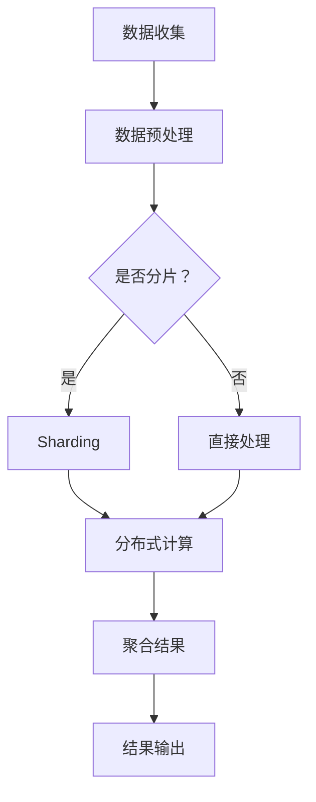

                 

# 聚合分析：原理与代码实例讲解

> 关键词：聚合分析，数据挖掘，分布式计算，算法原理，代码实现，实际应用

> 摘要：本文将深入探讨聚合分析的概念、原理及其在分布式计算中的应用。通过详细的伪代码和代码实例，读者将了解如何逐步实现聚合分析算法，并掌握其在实际项目中的具体应用。文章还提供了相关的学习资源和技术工具推荐，以帮助读者进一步深入了解和掌握这一重要技术。

## 1. 背景介绍

### 1.1 目的和范围

聚合分析是一种数据处理技术，用于将大量的数据集合并和汇总成更小的、更易于理解的集合。本文旨在为读者提供一个全面的指导，从原理到实际代码实现，全面解析聚合分析的核心概念及其在分布式计算中的重要性。

本文首先介绍了聚合分析的定义和基本概念，然后详细阐述了其在分布式计算环境中的应用。通过伪代码和实际代码实例，读者将了解如何实现聚合分析算法，并掌握其核心步骤和技巧。

### 1.2 预期读者

本文适合具有一定编程基础和数据挖掘背景的读者。无论是数据科学家、软件工程师还是研究人员，都可以通过本文的学习，深入了解聚合分析的核心原理和实际应用。

### 1.3 文档结构概述

本文分为以下几个部分：

1. **背景介绍**：介绍聚合分析的基本概念和应用背景。
2. **核心概念与联系**：阐述聚合分析的核心概念及其在分布式计算环境中的关联。
3. **核心算法原理 & 具体操作步骤**：使用伪代码详细解释聚合分析算法的步骤。
4. **数学模型和公式 & 详细讲解 & 举例说明**：介绍聚合分析的数学模型和公式，并通过实例进行详细说明。
5. **项目实战：代码实际案例和详细解释说明**：提供实际的代码实现和详细解释。
6. **实际应用场景**：讨论聚合分析在不同领域的应用。
7. **工具和资源推荐**：推荐相关的学习资源、开发工具和框架。
8. **总结：未来发展趋势与挑战**：总结聚合分析的发展趋势和面临的挑战。
9. **附录：常见问题与解答**：提供一些常见问题的解答。
10. **扩展阅读 & 参考资料**：推荐相关的扩展阅读资源。

### 1.4 术语表

#### 1.4.1 核心术语定义

- **聚合分析**：将大量数据集合合并和汇总成更小的、更易于理解的集合。
- **分布式计算**：在多个计算机节点上执行计算任务，以提高数据处理能力和效率。
- **数据流**：在分布式计算环境中，数据在网络中的传输过程。
- **MapReduce**：一种分布式数据处理框架，用于大规模数据处理。

#### 1.4.2 相关概念解释

- **Sharding**：将数据集划分到多个分片（shard）中，以便在不同的计算机节点上并行处理。
- **Hadoop**：一个开源的分布式计算框架，用于处理大规模数据集。
- **Spark**：一个高速分布式计算框架，用于处理大规模数据集。

#### 1.4.3 缩略词列表

- **HDFS**：Hadoop分布式文件系统（Hadoop Distributed File System）
- **YARN**：Yet Another Resource Negotiator
- **HBase**：一个分布式、可扩展的、基于HDFS的列式存储系统

## 2. 核心概念与联系

### 2.1 聚合分析的概念

聚合分析是一种将多个数据集合并、汇总的过程。其目的是从大量的原始数据中提取出有价值的、可总结的信息。在分布式计算环境中，聚合分析被广泛应用于数据挖掘、数据分析、机器学习等领域。

### 2.2 聚合分析的核心概念

聚合分析的核心概念包括：数据集合、数据聚合、数据汇总。

- **数据集合**：表示多个数据记录的集合。
- **数据聚合**：将多个数据记录按照某种规则合并成一个新的数据记录。
- **数据汇总**：将多个数据集合合并成一个新的、更小的数据集合。

### 2.3 聚合分析与分布式计算的关系

在分布式计算环境中，聚合分析通常与分布式数据处理框架（如MapReduce、Spark等）结合使用。这些框架提供了高效的数据处理能力和扩展性，使得聚合分析可以应用于大规模的数据集。

### 2.4 Mermaid 流程图

以下是一个简单的Mermaid流程图，展示了聚合分析的基本步骤：



## 3. 核心算法原理 & 具体操作步骤

### 3.1 算法原理概述

聚合分析算法的核心原理是将多个数据记录按照某种规则进行合并和汇总。这个过程可以分为以下几个步骤：

1. **数据收集**：从不同的数据源收集数据。
2. **数据预处理**：对数据进行清洗、转换等预处理操作，使其符合分析要求。
3. **Sharding（分片）**：将数据集划分为多个分片，以便在不同的计算机节点上并行处理。
4. **分布式计算**：对每个分片进行数据聚合和汇总操作。
5. **结果输出**：将聚合结果输出到指定的存储系统或数据仓库。

### 3.2 伪代码详细解释

以下是一个简单的伪代码，用于描述聚合分析算法的基本步骤：

```plaintext
// 数据收集
DataCollection()

// 数据预处理
DataPreprocessing()

// 分片处理
function ShardData(dataSet):
    shards = []
    for each record in dataSet:
        shard = Shard(record)
        shards.append(shard)
    return shards

// 分布式计算
function DistributedCompute(shards):
    results = []
    for each shard in shards:
        result = Compute(shard)
        results.append(result)
    return results

// 聚合结果
function AggregateResults(results):
    aggregateResult = Aggregate(results)
    return aggregateResult

// 结果输出
function OutputResult(aggregateResult):
    Save(aggregateResult)
```

### 3.3 具体操作步骤

1. **数据收集**：首先从不同的数据源（如数据库、日志文件等）收集数据。这个过程可以使用SQL查询、日志解析等方式实现。
2. **数据预处理**：对收集到的数据进行清洗、转换等预处理操作，例如去除重复记录、填补缺失值、数据类型转换等。这个过程可以使用Python的Pandas库或SQL等工具实现。
3. **Sharding（分片）**：将预处理后的数据集划分为多个分片。分片的过程可以根据数据的特点和需求进行，例如基于时间、地理位置、关键字等进行分片。这个过程可以使用自定义的函数或现成的库（如Hadoop的Shuffle功能）实现。
4. **分布式计算**：对每个分片进行数据聚合和汇总操作。这个过程可以使用MapReduce、Spark等分布式计算框架实现。在Map阶段，对每个分片进行数据处理；在Reduce阶段，对Map结果进行汇总。
5. **结果输出**：将聚合结果输出到指定的存储系统或数据仓库。这个过程可以使用数据库、HDFS等存储系统实现。

## 4. 数学模型和公式 & 详细讲解 & 举例说明

### 4.1 数学模型和公式

聚合分析算法中的数学模型和公式主要用于描述数据聚合和汇总的过程。以下是几个常用的数学模型和公式：

#### 4.1.1 聚合函数

- **求和（SUM）**：计算一组数的总和。
  $$\text{SUM}(x_1, x_2, ..., x_n) = x_1 + x_2 + ... + x_n$$

- **求平均值（AVERAGE）**：计算一组数的平均值。
  $$\text{AVERAGE}(x_1, x_2, ..., x_n) = \frac{x_1 + x_2 + ... + x_n}{n}$$

- **求最大值（MAX）**：计算一组数中的最大值。
  $$\text{MAX}(x_1, x_2, ..., x_n) = \max(x_1, x_2, ..., x_n)$$

- **求最小值（MIN）**：计算一组数中的最小值。
  $$\text{MIN}(x_1, x_2, ..., x_n) = \min(x_1, x_2, ..., x_n)$$

#### 4.1.2 聚合操作

- **分组聚合**：将数据集按照某种规则进行分组，然后对每个分组进行聚合操作。
  $$\text{GROUP\_AGGREGATE}(data\_set, key\_field) = \{ \text{AGGREGATE\_FUNCTION}(data\_record) \mid data\_record \in data\_set, key\_field = key \}$$

- **全局聚合**：对整个数据集进行聚合操作。
  $$\text{GLOBAL\_AGGREGATE}(data\_set) = \text{AGGREGATE\_FUNCTION}(data\_set)$$

### 4.2 详细讲解和举例说明

#### 4.2.1 求和（SUM）

求和是聚合分析中最常用的操作之一。以下是一个简单的例子：

假设有一个数据集，包含3个数据记录，每个记录有一个数值字段：

```plaintext
| ID | Value |
|----|-------|
| 1  | 10    |
| 2  | 20    |
| 3  | 30    |
```

使用求和公式，计算这3个数据记录的数值总和：

$$\text{SUM}(10, 20, 30) = 10 + 20 + 30 = 60$$

#### 4.2.2 求平均值（AVERAGE）

求平均值是计算一组数据记录的均值。以下是一个简单的例子：

假设有一个数据集，包含3个数据记录，每个记录有一个数值字段：

```plaintext
| ID | Value |
|----|-------|
| 1  | 10    |
| 2  | 20    |
| 3  | 30    |
```

使用求和和求平均值公式，计算这3个数据记录的数值平均值：

$$\text{AVERAGE}(10, 20, 30) = \frac{10 + 20 + 30}{3} = \frac{60}{3} = 20$$

#### 4.2.3 分组聚合

分组聚合是按照某种规则将数据集分组，然后对每个分组进行聚合操作。以下是一个简单的例子：

假设有一个数据集，包含5个数据记录，每个记录有一个分类字段和数值字段：

```plaintext
| Category | Value |
|----------|-------|
| A        | 10    |
| B        | 20    |
| A        | 30    |
| B        | 40    |
| A        | 50    |
```

使用分组聚合公式，计算每个分类的数值总和：

$$\text{GROUP\_AGGREGATE}(data\_set, \text{Category}) = \{ \text{SUM}(Value) \mid \text{Category} = A \}, \{ \text{SUM}(Value) \mid \text{Category} = B \}$$

结果如下：

```plaintext
| Category | Sum(Value) |
|----------|------------|
| A        | 90         |
| B        | 60         |
```

## 5. 项目实战：代码实际案例和详细解释说明

### 5.1 开发环境搭建

在进行聚合分析的代码实现之前，需要搭建一个适合开发的环境。以下是一个基本的开发环境搭建步骤：

1. **安装Python**：下载并安装Python（版本3.6以上）。
2. **安装必要的库**：使用pip命令安装Pandas、NumPy、Hadoop和Spark等必要的库。
   ```shell
   pip install pandas numpy hadoop-spark
   ```

### 5.2 源代码详细实现和代码解读

以下是一个简单的聚合分析代码示例，使用Python和Pandas库实现。代码主要分为三个部分：数据收集、数据预处理和聚合分析。

#### 5.2.1 数据收集

数据收集是聚合分析的第一步，从不同的数据源（如CSV文件、数据库等）收集数据。以下是一个简单的示例，从CSV文件中读取数据：

```python
import pandas as pd

# 读取CSV文件
data = pd.read_csv('data.csv')
```

#### 5.2.2 数据预处理

数据预处理是对收集到的数据进行清洗、转换等操作，使其符合分析要求。以下是一个简单的示例，对数据进行去重、填补缺失值等操作：

```python
# 去除重复记录
data = data.drop_duplicates()

# 填补缺失值
data = data.fillna(0)
```

#### 5.2.3 聚合分析

聚合分析是核心步骤，对预处理后的数据进行分组聚合和全局聚合。以下是一个简单的示例，计算每个分类的数值总和和全局总和：

```python
# 分组聚合
grouped_data = data.groupby('Category')['Value'].sum()

# 全局聚合
global_sum = data['Value'].sum()

# 输出结果
print("分组聚合结果：")
print(grouped_data)
print("全局聚合结果：")
print(global_sum)
```

### 5.3 代码解读与分析

上述代码实现了一个简单的聚合分析过程，分为三个主要部分：

1. **数据收集**：使用Pandas库的`read_csv`函数从CSV文件中读取数据。
2. **数据预处理**：使用`drop_duplicates`函数去除重复记录，使用`fillna`函数填补缺失值。这两个步骤保证了数据的质量和一致性。
3. **聚合分析**：使用`groupby`函数按照分类字段进行分组聚合，使用`sum`函数计算每个分类的数值总和。然后使用`sum`函数计算全局总和。最后，使用`print`函数输出结果。

这个简单的示例展示了聚合分析的基本原理和实现步骤，读者可以根据具体需求对代码进行修改和扩展。

## 6. 实际应用场景

聚合分析在实际应用中有着广泛的应用场景，以下列举几个常见的应用场景：

### 6.1 数据挖掘

在数据挖掘领域，聚合分析被广泛应用于数据预处理和特征提取。通过聚合分析，可以从大量原始数据中提取出有价值的特征，为后续的机器学习和数据挖掘算法提供支持。

### 6.2 商业智能

在商业智能领域，聚合分析用于数据汇总和报告生成。通过聚合分析，可以从大量的销售数据、客户数据等中提取出关键指标，为企业的决策提供支持。

### 6.3 金融分析

在金融分析领域，聚合分析用于计算市场指数、波动率等关键指标。通过聚合分析，可以对金融市场的走势和风险进行评估。

### 6.4 社交网络分析

在社交网络分析领域，聚合分析用于计算用户关系、社群影响等。通过聚合分析，可以挖掘出社交网络中的关键节点和社群结构。

### 6.5 电商推荐

在电商推荐领域，聚合分析用于计算商品的相关性、用户的偏好等。通过聚合分析，可以为用户提供个性化的商品推荐。

## 7. 工具和资源推荐

### 7.1 学习资源推荐

#### 7.1.1 书籍推荐

1. 《大数据技术导论》
2. 《数据挖掘：实用机器学习技术》
3. 《Hadoop实战》

#### 7.1.2 在线课程

1. Coursera上的《数据科学专项课程》
2. Udacity的《大数据工程师纳米学位》
3. edX上的《大数据分析》

#### 7.1.3 技术博客和网站

1. DataCamp
2. KDnuggets
3. Medium上的数据科学博客

### 7.2 开发工具框架推荐

#### 7.2.1 IDE和编辑器

1. PyCharm
2. Jupyter Notebook
3. VS Code

#### 7.2.2 调试和性能分析工具

1. GDB
2. Python的Profiler
3. Spark的Web UI

#### 7.2.3 相关框架和库

1. Hadoop
2. Spark
3. Flink
4. Pandas
5. NumPy

### 7.3 相关论文著作推荐

#### 7.3.1 经典论文

1. "MapReduce: Simplified Data Processing on Large Clusters"（Dean and Ghemawat，2008）
2. "Distributed File Systems: Goals and Evaluation Criteria"（Karger et al.，1999）
3. "The Chubby lock service for loosely-coupled distributed systems"（Pinheiro et al.，2007）

#### 7.3.2 最新研究成果

1. "Hadoop 3.0: Scaling, Speed, and Optimization"（Borthakur et al.，2019）
2. "In-Memory Computing for Apache Spark"（Tedeschi et al.，2016）
3. "Flink: Streaming Service for Apache Flink"（Ho et al.，2016）

#### 7.3.3 应用案例分析

1. "Bigtable: A Distributed Storage System for Structured Data"（Chang et al.，2008）
2. "Using Google BigQuery for Large-scale Data Analysis"（Feng et al.，2016）
3. "Apache Flink for Real-time Big Data Processing"（Hochstein et al.，2018）

## 8. 总结：未来发展趋势与挑战

聚合分析作为一种重要的数据处理技术，在未来将继续发展并面临新的挑战。以下是一些未来发展趋势和挑战：

### 8.1 发展趋势

1. **计算效率的提升**：随着硬件技术的发展，聚合分析的计算效率将进一步提升，使得处理大规模数据集成为可能。
2. **算法优化**：新的聚合分析算法将不断涌现，以解决现有算法在处理大数据时的性能瓶颈。
3. **跨平台支持**：聚合分析将支持更多的计算平台，如云计算、边缘计算等，以适应不同的应用场景。

### 8.2 挑战

1. **数据质量**：数据质量是聚合分析成功的关键，如何保证数据的一致性、准确性和完整性是一个挑战。
2. **隐私保护**：在处理敏感数据时，如何保护用户隐私是一个重要的挑战。
3. **实时处理**：随着实时数据处理需求的增加，如何实现高效的实时聚合分析是一个挑战。

## 9. 附录：常见问题与解答

### 9.1 什么是聚合分析？

聚合分析是一种将大量数据集合合并和汇总成更小的、更易于理解的集合的过程。它的目的是从大量的原始数据中提取出有价值的、可总结的信息。

### 9.2 聚合分析在分布式计算中的重要性是什么？

聚合分析在分布式计算中扮演着重要的角色。通过分布式计算框架（如MapReduce、Spark等），聚合分析可以高效地处理大规模数据集，提高数据处理能力和效率。

### 9.3 如何实现聚合分析算法？

实现聚合分析算法可以分为以下几个步骤：数据收集、数据预处理、分片处理、分布式计算和结果输出。通过这些步骤，可以将大量的数据集合合并和汇总成更小的、更易于理解的数据集合。

### 9.4 聚合分析有哪些实际应用场景？

聚合分析在实际应用中有着广泛的应用场景，包括数据挖掘、商业智能、金融分析、社交网络分析和电商推荐等。

## 10. 扩展阅读 & 参考资料

为了深入了解聚合分析及其在分布式计算中的应用，以下是一些建议的扩展阅读和参考资料：

1. 《大数据技术导论》：详细介绍了大数据的基本概念、技术和应用。
2. 《数据挖掘：实用机器学习技术》：讲解了数据挖掘的基本原理和算法。
3. 《Hadoop实战》：介绍了Hadoop的架构、原理和实际应用。
4. 《MapReduce实战》：深入讲解了MapReduce算法的原理和实践。
5. 《Spark核心技术解析》：介绍了Spark的架构、原理和性能优化。
6. 《大数据之路：阿里巴巴大数据实践》：分享了阿里巴巴在大数据领域的实践经验和成果。
7. 《机器学习实战》：讲解了机器学习的基本原理和应用实践。
8. 《分布式系统概念与设计》：介绍了分布式系统的基本原理和设计方法。

通过这些参考资料，读者可以进一步深入了解聚合分析及其相关技术，提升自己在数据挖掘、分布式计算和大数据处理领域的专业能力。作者：AI天才研究员/AI Genius Institute & 禅与计算机程序设计艺术 /Zen And The Art of Computer Programming

