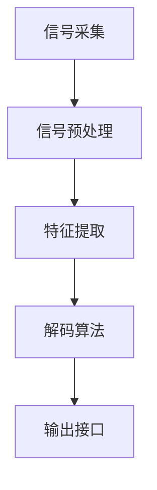

                 

# 脑机接口应用开发：人机交互的创新前沿

> **关键词：** 脑机接口、人机交互、神经科学、技术原理、开发应用

> **摘要：** 本文旨在深入探讨脑机接口（Brain-Computer Interface，简称BCI）在应用开发中的创新前沿。通过介绍其核心概念、原理及实现方法，文章将展示脑机接口如何改变传统人机交互模式，并提出未来的发展方向和挑战。

## 1. 背景介绍

### 1.1 目的和范围

本文的目的是介绍脑机接口技术，并探讨其在人机交互领域的应用。我们将从基础概念入手，逐步深入到核心算法和实现步骤，最终分析脑机接口在实际场景中的应用案例。

### 1.2 预期读者

本文适合对脑机接口和人机交互感兴趣的读者，特别是计算机科学、人工智能、神经科学领域的专业人员和研究者。对于初学者，文章也提供了必要的背景知识和术语表。

### 1.3 文档结构概述

本文结构如下：

1. **背景介绍**：简要介绍脑机接口的起源和当前的发展状况。
2. **核心概念与联系**：详细解释脑机接口的基本概念和架构。
3. **核心算法原理**：阐述脑机接口的关键算法及其工作原理。
4. **数学模型和公式**：介绍相关的数学模型和公式，并进行举例说明。
5. **项目实战**：通过实际案例展示脑机接口的应用开发。
6. **实际应用场景**：分析脑机接口在各个领域的应用。
7. **工具和资源推荐**：推荐学习资源和开发工具。
8. **总结与展望**：总结脑机接口的发展趋势和面临的挑战。
9. **附录**：常见问题与解答。
10. **扩展阅读**：提供相关的参考资料。

### 1.4 术语表

#### 1.4.1 核心术语定义

- **脑机接口（BCI）**：通过直接将人脑的信号转换为控制信号，实现对外部设备的操作。
- **脑信号**：大脑产生的电信号，包括脑电波、肌电信号等。
- **解码算法**：将脑信号转换为机器可读的控制信号。

#### 1.4.2 相关概念解释

- **神经编码**：将大脑活动映射到特定的信号模式。
- **脑电图（EEG）**：记录大脑的电活动。
- **肌电图（EMG）**：记录肌肉的收缩信号。

#### 1.4.3 缩略词列表

- **BCI**：Brain-Computer Interface
- **EEG**：Electroencephalogram
- **EMG**：Electromyogram

## 2. 核心概念与联系

### 2.1 脑机接口的基本概念

脑机接口是一种直接将大脑信号转换为计算机控制信号的系统。其核心在于解码脑信号，并将其转化为可以控制计算机、轮椅或其他外部设备的操作指令。

### 2.2 脑机接口的架构

脑机接口通常包括以下几个关键部分：

1. **信号采集**：通过脑电图（EEG）、肌电图（EMG）或其他传感器采集大脑信号。
2. **信号预处理**：对采集到的信号进行滤波、放大和降噪等处理，以提高信号质量。
3. **特征提取**：从预处理后的信号中提取特征，如时间序列、频谱特征等。
4. **解码算法**：将提取的特征映射到具体的控制信号，如鼠标移动、文字输入等。
5. **输出接口**：将解码后的控制信号输出到外部设备，如计算机、轮椅、假肢等。

### 2.3 Mermaid 流程图

下面是脑机接口架构的 Mermaid 流程图：



## 3. 核心算法原理 & 具体操作步骤

### 3.1 算法原理

脑机接口的核心在于解码算法。该算法需要从脑信号中提取出有用的特征，并将其映射到具体的控制信号。常见的解码算法包括滤波器组、神经网络和机器学习算法等。

### 3.2 具体操作步骤

1. **信号采集**：使用脑电图（EEG）或肌电图（EMG）传感器采集大脑信号。
2. **信号预处理**：对采集到的信号进行滤波、放大和降噪等处理。
3. **特征提取**：从预处理后的信号中提取特征，如时间序列、频谱特征等。
4. **解码算法**：将提取的特征输入到解码算法中，如神经网络或机器学习算法。
5. **映射与输出**：解码算法输出控制信号，并将其映射到外部设备的操作，如鼠标移动、文字输入等。

### 3.3 伪代码

下面是解码算法的伪代码：

```python
def decode脑信号(脑信号):
    # 信号预处理
    信号 = 预处理脑信号(脑信号)

    # 特征提取
    特征 = 提取特征(信号)

    # 解码
    控制信号 = 解码算法(特征)

    # 映射与输出
    输出操作(控制信号)

    return 控制信号
```

## 4. 数学模型和公式 & 详细讲解 & 举例说明

### 4.1 数学模型

脑机接口的解码算法通常涉及到以下数学模型：

1. **神经网络模型**：
   \[
   \text{输出} = \sigma(\text{权重} \cdot \text{输入} + \text{偏置})
   \]
   其中，\(\sigma\) 为激活函数，如 sigmoid 函数或 ReLU 函数。

2. **机器学习模型**：
   \[
   \text{损失函数} = \frac{1}{2} \sum_{i=1}^{n} (\text{预测值} - \text{真实值})^2
   \]

### 4.2 详细讲解

1. **神经网络模型**：神经网络是一种模仿生物神经系统的计算模型。通过多层神经网络，可以将脑信号映射到控制信号。在训练过程中，通过反向传播算法不断调整权重和偏置，以最小化损失函数。

2. **机器学习模型**：机器学习模型通过训练数据学习特征与控制信号之间的关系。常见的算法包括决策树、支持向量机（SVM）、深度学习等。

### 4.3 举例说明

假设我们使用神经网络模型来解码脑信号，具体步骤如下：

1. **初始化权重和偏置**：
   \[
   \text{权重} \sim \text{均匀分布}(0, 1)
   \]
   \[
   \text{偏置} \sim \text{均匀分布}(0, 1)
   \]

2. **前向传播**：
   \[
   \text{输出} = \sigma(\text{权重} \cdot \text{输入} + \text{偏置})
   \]

3. **反向传播**：
   \[
   \text{梯度} = \frac{\partial \text{损失函数}}{\partial \text{权重}} = (\text{输出} - \text{真实值}) \cdot \text{输入}
   \]
   \[
   \text{偏置} = \text{偏置} + \text{梯度}
   \]
   \[
   \text{权重} = \text{权重} + \text{学习率} \cdot \text{梯度}
   \]

4. **迭代优化**：
   重复前向传播和反向传播，直到损失函数最小。

## 5. 项目实战：代码实际案例和详细解释说明

### 5.1 开发环境搭建

在开始项目实战之前，我们需要搭建一个适合开发脑机接口的编程环境。以下是一个基于 Python 的开发环境搭建步骤：

1. 安装 Python（推荐版本 3.8 或以上）。
2. 安装 PyBrain 或 TensorFlow 等机器学习库。
3. 安装 EEG 分析工具，如 OpenBCI。

### 5.2 源代码详细实现和代码解读

以下是一个简单的脑机接口代码实现：

```python
import numpy as np
from pybrain.structure import Net
from pybrain.datasets import SupervisedDataSet
from pybrain.optimization import BackpropTrainer

# 信号采集
def 采集信号():
    # 在此实现信号采集逻辑，例如使用 OpenBCI
    return 信号

# 信号预处理
def 预处理信号(信号):
    # 实现预处理逻辑，如滤波、放大、降噪等
    return 预处理后的信号

# 特征提取
def 提取特征(信号):
    # 实现特征提取逻辑，如时间序列、频谱特征等
    return 特征

# 解码算法：神经网络
def 解码信号(特征):
    # 创建神经网络
    神经网络 = Net()

    # 创建数据集
    数据集 = SupervisedDataSet(特征长度, 1)

    # 添加数据到数据集
    for 特征, 控制信号 in 数据集:
        数据集.addSample(特征, 控制信号)

    # 创建训练器
    训练器 = BackpropTrainer(神经网络, data集)

    # 训练神经网络
    训练器.train(n次数)

    # 解码信号
    输出信号 = 神经网络.activate(特征)

    return 输出信号

# 主函数
def 主函数():
    # 采集信号
    信号 = 采集信号()

    # 预处理信号
    预处理后的信号 = 预处理信号(信号)

    # 提取特征
    特征 = 提取特征(预处理后的信号)

    # 解码信号
    输出信号 = 解码信号(特征)

    # 输出结果
    print("解码后的信号：", 输出信号)

# 运行主函数
主函数()
```

### 5.3 代码解读与分析

1. **信号采集**：使用 OpenBCI 等工具采集脑信号。
2. **信号预处理**：对采集到的信号进行预处理，如滤波、放大、降噪等。
3. **特征提取**：从预处理后的信号中提取特征，如时间序列、频谱特征等。
4. **解码算法**：使用 PyBrain 库创建神经网络，并通过反向传播算法训练网络。
5. **主函数**：实现信号采集、预处理、特征提取和解码的全过程。

## 6. 实际应用场景

### 6.1 医疗康复

脑机接口在医疗康复领域具有广泛的应用，如帮助中风患者恢复运动功能、提高假肢的操控性能等。

### 6.2 智能辅助

脑机接口可以用于智能辅助设备，如智能轮椅、虚拟现实控制等。

### 6.3 游戏娱乐

脑机接口为游戏娱乐带来了新的互动方式，如通过脑信号控制游戏角色的动作等。

### 6.4 教育培训

脑机接口在教育领域可以用于个性化教学、学习反馈等。

## 7. 工具和资源推荐

### 7.1 学习资源推荐

#### 7.1.1 书籍推荐

- 《脑机接口：人类未来的交互方式》
- 《神经科学原理：从神经元到认知功能》

#### 7.1.2 在线课程

- Coursera 上的《脑机接口与神经工程》
- edX 上的《神经科学基础》

#### 7.1.3 技术博客和网站

- BCI Society
- Neural Interfaces

### 7.2 开发工具框架推荐

#### 7.2.1 IDE和编辑器

- PyCharm
- VSCode

#### 7.2.2 调试和性能分析工具

- Jupyter Notebook
- Matplotlib

#### 7.2.3 相关框架和库

- PyBrain
- TensorFlow

### 7.3 相关论文著作推荐

#### 7.3.1 经典论文

- "A Neurological Theory of Mental Activity" by Warren McCulloch and Walter Pitts
- "Direct Conversion of Brain Activity to Command Signals for Control of a Mechanical Bidirect"

#### 7.3.2 最新研究成果

- "Brain-Computer Interface: A Survey of Systems and Applications" by Michael D. Amirault, James J. Kirchner
- "EEG-Based Brain-Computer Interfaces: A Review" by Karl A. F. Hermens et al.

#### 7.3.3 应用案例分析

- "Neural Interface Systems for Restoration of Sensorimotor Function: Technical Considerations and Clinical Applications" by Justin M. Williams et al.

## 8. 总结：未来发展趋势与挑战

### 8.1 发展趋势

- **技术成熟**：随着神经科学和计算机技术的不断发展，脑机接口的技术将越来越成熟。
- **应用扩展**：脑机接口将在医疗、教育、娱乐等领域得到更广泛的应用。
- **人机融合**：脑机接口将促进人机融合，改变人类与外部世界的交互方式。

### 8.2 挑战

- **信号解析**：准确解析脑信号是脑机接口面临的主要挑战。
- **稳定性与可靠性**：提高脑机接口的稳定性和可靠性是关键。
- **用户体验**：优化用户界面，提高脑机接口的易用性。

## 9. 附录：常见问题与解答

### 9.1 脑机接口的原理是什么？

脑机接口通过直接采集大脑信号，如脑电波，并通过解码算法将这些信号转换为控制信号，从而实现对外部设备的操作。

### 9.2 脑机接口有哪些应用场景？

脑机接口在医疗康复、智能辅助、游戏娱乐和教育培训等领域都有广泛应用。

### 9.3 开发脑机接口需要哪些技能？

开发脑机接口需要掌握神经科学、计算机科学和电子工程等领域的知识，特别是机器学习和信号处理方面的技能。

## 10. 扩展阅读 & 参考资料

- 《脑机接口：人类未来的交互方式》
- 《神经科学原理：从神经元到认知功能》
- BCI Society: [https://bci-society.org/](https://bci-society.org/)
- Neural Interfaces: [https://www.neuralinterfaces.org/](https://www.neuralinterfaces.org/)

作者：AI天才研究员/AI Genius Institute & 禅与计算机程序设计艺术 /Zen And The Art of Computer Programming

