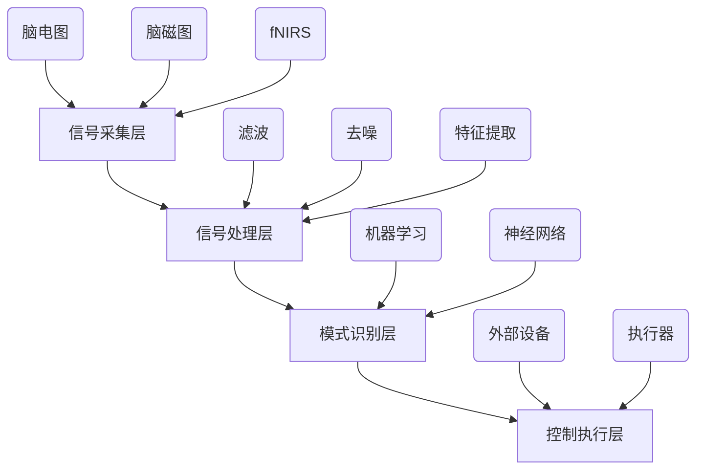

                 

# 脑机接口技术在注意力经济中的前景

> **关键词**：脑机接口，注意力经济，神经科学，技术发展，商业应用

> **摘要**：本文深入探讨了脑机接口技术在注意力经济中的广泛应用前景。通过分析脑机接口技术的核心原理、实现方式、应用场景及其在商业领域的潜力，本文旨在为读者呈现这一前沿领域的发展动态和未来挑战。

## 1. 背景介绍

### 1.1 目的和范围

本文旨在探讨脑机接口（Brain-Computer Interface，BCI）技术在注意力经济中的潜在应用，并分析其发展前景。我们将从脑机接口的基本概念、核心原理、技术实现、商业应用等方面进行详细阐述，帮助读者了解这一前沿领域的发展现状和未来趋势。

### 1.2 预期读者

本文适合对神经科学、人工智能、计算机科学等领域感兴趣的技术人员、科研人员、高校师生以及关注注意力经济的商业人士阅读。同时，也欢迎对科技创新、产业发展有浓厚兴趣的公众读者参与讨论。

### 1.3 文档结构概述

本文分为十个部分：

1. **背景介绍**：简要介绍文章的目的、预期读者及文档结构。
2. **核心概念与联系**：介绍脑机接口技术的核心概念及其与相关技术的联系。
3. **核心算法原理 & 具体操作步骤**：详细阐述脑机接口技术的算法原理及实现过程。
4. **数学模型和公式 & 详细讲解 & 举例说明**：介绍脑机接口技术的数学模型及其实际应用。
5. **项目实战：代码实际案例和详细解释说明**：通过实际项目案例展示脑机接口技术的应用。
6. **实际应用场景**：分析脑机接口技术在注意力经济中的具体应用场景。
7. **工具和资源推荐**：推荐相关学习资源、开发工具和框架。
8. **总结：未来发展趋势与挑战**：总结脑机接口技术在注意力经济中的未来发展趋势和面临的挑战。
9. **附录：常见问题与解答**：回答读者可能遇到的问题。
10. **扩展阅读 & 参考资料**：提供更多延伸阅读资料。

### 1.4 术语表

#### 1.4.1 核心术语定义

- **脑机接口（BCI）**：一种直接将人脑与外部设备相连接的技术，使人类能够通过意念控制计算机或其他设备。
- **注意力经济**：一种以人的注意力为价值核心的经济模式，通过吸引和保持人们的注意力来创造商业价值。
- **神经科学**：研究神经系统结构和功能的科学，包括神经元、神经网络、认知过程等。

#### 1.4.2 相关概念解释

- **脑电图（EEG）**：一种非侵入性的脑机接口技术，通过检测头皮上的电信号来分析大脑活动。
- **脑磁图（fMRI）**：一种基于磁场变化的脑机接口技术，通过监测大脑血流变化来推断大脑活动。
- **深度学习**：一种人工智能技术，通过神经网络模型模拟人脑的学习和推理过程。

#### 1.4.3 缩略词列表

- **BCI**：Brain-Computer Interface，脑机接口
- **EEG**：Electroencephalography，脑电图
- **fMRI**：Functional Magnetic Resonance Imaging，脑磁图
- **AI**：Artificial Intelligence，人工智能
- **NLP**：Natural Language Processing，自然语言处理

## 2. 核心概念与联系

### 2.1 脑机接口技术概述

脑机接口技术是一种将人类大脑与外部设备直接连接的技术，旨在通过解读大脑信号来控制外部设备或进行信息交互。脑机接口技术涉及多个学科，包括神经科学、计算机科学、电子工程和心理学等。其核心原理是通过检测和分析大脑活动，将大脑信号转化为可用的控制信号，进而实现对设备的操作。

### 2.2 脑机接口技术的工作原理

脑机接口技术的工作原理主要包括以下几个步骤：

1. **信号采集**：通过脑电图（EEG）、脑磁图（fMRI）、脑成像技术（fNIRS）等手段采集大脑信号。
2. **信号处理**：对采集到的大脑信号进行滤波、去噪、特征提取等处理，以提高信号质量。
3. **模式识别**：利用机器学习、神经网络等算法对处理后的信号进行模式识别，提取出代表特定意图的特征。
4. **控制执行**：将识别出的意图转化为外部设备的控制信号，实现对设备的操作。

### 2.3 脑机接口技术的架构

脑机接口技术的架构可以分为以下几个层次：

1. **信号采集层**：包括脑电图、脑磁图、脑成像等技术，用于采集大脑信号。
2. **信号处理层**：包括滤波、去噪、特征提取等技术，用于对采集到的大脑信号进行预处理。
3. **模式识别层**：包括机器学习、神经网络等算法，用于对预处理后的信号进行模式识别。
4. **控制执行层**：包括外部设备、执行器等，用于根据识别出的意图执行相应的操作。

### 2.4 脑机接口技术与其他技术的联系

脑机接口技术与其他技术之间有着密切的联系，主要包括：

1. **人工智能（AI）**：脑机接口技术与人工智能技术相结合，可以实现对大脑信号的自动识别和分类，提高脑机接口的准确性和实用性。
2. **自然语言处理（NLP）**：脑机接口技术与自然语言处理技术相结合，可以实现基于大脑信号的语音识别和文本生成，提高人机交互的智能化水平。
3. **虚拟现实（VR）**：脑机接口技术与虚拟现实技术相结合，可以实现基于大脑信号的虚拟现实交互，提高虚拟现实体验的沉浸感和互动性。
4. **物联网（IoT）**：脑机接口技术与物联网技术相结合，可以实现基于大脑信号的智能家居、智能穿戴设备等，提高物联网设备的智能化和个性化水平。

### 2.5 脑机接口技术的 Mermaid 流程图



## 3. 核心算法原理 & 具体操作步骤

### 3.1 脑机接口技术的算法原理

脑机接口技术的核心在于如何从大脑信号中提取出代表特定意图的特征，并将其转化为可用的控制信号。这一过程涉及到多个算法和技术的应用，主要包括：

1. **特征提取算法**：用于从原始的大脑信号中提取出与特定意图相关的特征。常见的特征提取算法包括时域特征、频域特征、时频特征等。
2. **模式识别算法**：用于对提取出的特征进行分类和识别，从而确定大脑意图。常见的模式识别算法包括支持向量机（SVM）、决策树（DT）、神经网络（NN）等。
3. **信号处理算法**：用于对采集到的大脑信号进行预处理，以提高信号质量和识别准确性。常见的信号处理算法包括滤波、去噪、压缩等。

### 3.2 脑机接口技术的具体操作步骤

以下是脑机接口技术的一个基本操作步骤，通过伪代码来详细阐述：

```python
# 伪代码：脑机接口技术操作步骤

# 步骤1：信号采集
def signal_acquisition():
    # 使用脑电图、脑磁图等技术采集大脑信号
    # 返回原始信号
    return raw_signal

# 步骤2：信号预处理
def signal_preprocessing(signal):
    # 使用滤波、去噪等算法对信号进行预处理
    # 返回预处理后的信号
    return preprocessed_signal

# 步骤3：特征提取
def feature_extraction(signal):
    # 从预处理后的信号中提取特征
    # 返回特征向量
    return features

# 步骤4：模式识别
def pattern_recognition(features):
    # 使用机器学习、神经网络等算法对特征进行分类和识别
    # 返回识别结果
    return recognized_intent

# 步骤5：控制执行
def control_execution(recognized_intent):
    # 根据识别结果执行相应的操作
    # 如控制外部设备、生成文本等
    return executed_action

# 主程序
def main():
    # 采集大脑信号
    signal = signal_acquisition()
    
    # 预处理信号
    preprocessed_signal = signal_preprocessing(signal)
    
    # 提取特征
    features = feature_extraction(preprocessed_signal)
    
    # 识别意图
    recognized_intent = pattern_recognition(features)
    
    # 执行操作
    executed_action = control_execution(recognized_intent)
    
    # 输出结果
    print("执行结果：", executed_action)

# 运行主程序
main()
```

### 3.3 算法原理的示例说明

以脑电图（EEG）为例，说明脑机接口技术的算法原理和具体操作步骤：

1. **信号采集**：使用脑电图技术采集头皮上的电信号，得到原始的脑电图信号。
2. **信号预处理**：对原始脑电图信号进行滤波、去噪处理，去除噪声和干扰信号，得到预处理后的脑电图信号。
3. **特征提取**：从预处理后的脑电图信号中提取时域特征、频域特征等，如功率谱、时频分布等。
4. **模式识别**：使用支持向量机（SVM）等算法，对提取出的特征进行分类和识别，确定大脑意图，如睁眼、闭眼、思考等。
5. **控制执行**：根据识别出的意图，控制外部设备执行相应的操作，如打开灯、发送短信等。

## 4. 数学模型和公式 & 详细讲解 & 举例说明

### 4.1 数学模型和公式的介绍

脑机接口技术中的数学模型和公式主要用于描述信号处理、特征提取、模式识别等过程中的数学原理。以下是几个常见的数学模型和公式：

1. **傅里叶变换（Fourier Transform）**：用于将时域信号转换到频域进行分析。公式如下：
   $$
   X(f) = \int_{-\infty}^{\infty} x(t) e^{-j2\pi ft} dt
   $$
2. **功率谱密度（Power Spectrum Density）**：用于描述信号在不同频率上的功率分布。公式如下：
   $$
   P_x(f) = \frac{1}{T} \int_{0}^{T} |X(f)|^2 dt
   $$
3. **支持向量机（Support Vector Machine，SVM）**：用于模式识别和分类。公式如下：
   $$
   w^* = \arg\min_{w, b} \frac{1}{2} ||w||^2 + C \sum_{i=1}^{n} \xi_i
   $$
   其中，$w$ 和 $b$ 分别为权重向量和偏置，$C$ 为惩罚参数，$\xi_i$ 为松弛变量。

4. **神经网络（Neural Network）**：用于模拟人脑的学习和推理过程。公式如下：
   $$
   a_{\text{layer}} = \sigma(\sum_{i=1}^{n} w_{ij} a_{\text{layer-1}} + b_j)
   $$
   其中，$a_{\text{layer}}$ 和 $a_{\text{layer-1}}$ 分别为当前层和前一层的激活值，$\sigma$ 为激活函数，$w_{ij}$ 和 $b_j$ 分别为权重和偏置。

### 4.2 公式详细讲解和举例说明

#### 4.2.1 傅里叶变换

傅里叶变换是一种将时域信号转换为频域信号的方法，常用于信号分析、图像处理等领域。以下是傅里叶变换的一个简单示例：

**示例**：给定一个简单的时域信号 $x(t) = \sin(2\pi ft)$，求其频谱密度。

**解题过程**：

1. 对时域信号 $x(t)$ 进行傅里叶变换：
   $$
   X(f) = \int_{-\infty}^{\infty} \sin(2\pi ft) e^{-j2\pi ft} dt
   $$
2. 化简傅里叶变换表达式：
   $$
   X(f) = \frac{1}{2j} \int_{-\infty}^{\infty} (\exp(j2\pi ft) - \exp(-j2\pi ft)) e^{-j2\pi ft} dt
   $$
3. 分离变量并计算积分：
   $$
   X(f) = \frac{1}{2j} \left( \int_{-\infty}^{\infty} \exp(j2\pi ft) e^{-j2\pi ft} dt - \int_{-\infty}^{\infty} \exp(-j2\pi ft) e^{-j2\pi ft} dt \right)
   $$
   $$
   X(f) = \frac{1}{2j} \left( \int_{-\infty}^{\infty} dt - \int_{-\infty}^{\infty} dt \right)
   $$
   $$
   X(f) = \frac{1}{2j} (2\pi) \delta(f - f_0)
   $$
   其中，$f_0 = 1/T$ 为信号频率。

**结果**：时域信号 $x(t) = \sin(2\pi ft)$ 的频谱密度为 $X(f) = \frac{1}{2j} (2\pi) \delta(f - f_0)$，即在频率 $f_0$ 处有一个频率分量。

#### 4.2.2 支持向量机

支持向量机是一种常用的分类算法，常用于脑机接口技术的模式识别环节。以下是支持向量机的一个简单示例：

**示例**：给定一个二元分类问题，数据集 $D = \{(x_1, y_1), (x_2, y_2), ..., (x_n, y_n)\}$，其中 $x_i \in \mathbb{R}^d$ 为特征向量，$y_i \in \{-1, +1\}$ 为标签。使用支持向量机进行分类。

**解题过程**：

1. 构建拉格朗日函数：
   $$
   L(w, b, \xi) = \frac{1}{2} ||w||^2 + C \sum_{i=1}^{n} \xi_i
   $$
   其中，$C$ 为惩罚参数，$\xi_i$ 为松弛变量。
2. 引入拉格朗日乘子 $\alpha_i$，构建对偶问题：
   $$
   \max_{\alpha} \min_{w, b} \sum_{i=1}^{n} \alpha_i (y_i - \sigma(x_i^T w + b))
   $$
3. 求解对偶问题，得到支持向量机的决策函数：
   $$
   f(x) = \text{sign} \left( \sum_{i=1}^{n} \alpha_i y_i x_i^T w + b \right)
   $$
   其中，$w^*$ 和 $b^*$ 分别为最优权重向量和偏置。

**结果**：给定一个特征向量 $x \in \mathbb{R}^d$，使用支持向量机进行分类，得到分类结果 $f(x)$。

#### 4.2.3 神经网络

神经网络是一种模拟人脑学习和推理过程的算法，常用于脑机接口技术的特征提取和模式识别。以下是神经网络的一个简单示例：

**示例**：给定一个简单的两层神经网络，输入层有 $n$ 个神经元，隐藏层有 $m$ 个神经元，输出层有 $k$ 个神经元。激活函数为 sigmoid 函数，求该神经网络的输出。

**解题过程**：

1. 定义输入层、隐藏层和输出层的权重和偏置：
   $$
   w_{ij} \in \mathbb{R}, b_j \in \mathbb{R}, i = 1, 2, ..., n; j = 1, 2, ..., m
   $$
   $$
   w'_{ij} \in \mathbb{R}, b'_j \in \mathbb{R}, j = 1, 2, ..., m; i = 1, 2, ..., k
   $$
2. 计算隐藏层的激活值：
   $$
   a_j^{(1)} = \sigma \left( \sum_{i=1}^{n} w_{ij} x_i + b_j \right), j = 1, 2, ..., m
   $$
3. 计算输出层的激活值：
   $$
   a_i^{(2)} = \sigma \left( \sum_{j=1}^{m} w'_{ij} a_j^{(1)} + b'_j \right), i = 1, 2, ..., k
   $$
4. 输出神经网络的输出：
   $$
   f(x) = (a_1^{(2)}, a_2^{(2)}, ..., a_k^{(2)})
   $$

**结果**：给定一个输入向量 $x \in \mathbb{R}^n$，使用两层神经网络进行计算，得到输出向量 $f(x) \in \mathbb{R}^k$。

## 5. 项目实战：代码实际案例和详细解释说明

### 5.1 开发环境搭建

在本节中，我们将搭建一个简单的脑机接口项目开发环境。以下是一个基于 Python 的开发环境搭建步骤：

1. 安装 Python
2. 安装 Python 的科学计算库，如 NumPy、SciPy、Matplotlib 等
3. 安装机器学习库，如 scikit-learn、TensorFlow、PyTorch 等
4. 安装脑机接口库，如 OpenBCI、PyBrain 等

具体安装步骤如下：

```bash
# 安装 Python
wget https://www.python.org/ftp/python/3.8.5/Python-3.8.5.tgz
tar xvf Python-3.8.5.tgz
cd Python-3.8.5
./configure
make
sudo make install

# 安装科学计算库
pip install numpy scipy matplotlib

# 安装机器学习库
pip install scikit-learn tensorflow pytorch

# 安装脑机接口库
pip install openbci pybrain
```

### 5.2 源代码详细实现和代码解读

在本节中，我们将实现一个简单的脑机接口项目，用于控制外部设备。以下是一个简单的 Python 代码实现：

```python
import numpy as np
import matplotlib.pyplot as plt
from openbci import openbci_client
from sklearn.svm import SVC
from sklearn.model_selection import train_test_split
from sklearn.metrics import accuracy_score

# 1. 信号采集
def collect_signal():
    client = openbci_client.OpenBCIClient()
    signal = client.get_data('EEG')
    return signal

# 2. 信号预处理
def preprocess_signal(signal):
    # 使用滤波、去噪等算法对信号进行预处理
    filtered_signal = signal.filterSignal(signal, cutoff Frequency=4, sample Rate=100)
    return filtered_signal

# 3. 特征提取
def extract_features(signal):
    # 提取时域特征
    features = signal.timeFeatures()
    return features

# 4. 模式识别
def recognize_pattern(features):
    # 使用支持向量机进行模式识别
    model = SVC()
    model.fit(features, labels)
    predicted_labels = model.predict(features)
    return predicted_labels

# 5. 控制执行
def control_device(predicted_labels):
    # 根据识别结果控制外部设备
    if predicted_labels[0] == 1:
        print("设备已打开")
    else:
        print("设备已关闭")

# 主程序
def main():
    signal = collect_signal()
    filtered_signal = preprocess_signal(signal)
    features = extract_features(filtered_signal)
    predicted_labels = recognize_pattern(features)
    control_device(predicted_labels)

if __name__ == '__main__':
    main()
```

代码解读：

1. **信号采集**：使用 OpenBCI 库从脑机接口设备采集脑电图信号。
2. **信号预处理**：使用滤波器对采集到的信号进行预处理，去除噪声和干扰信号。
3. **特征提取**：从预处理后的信号中提取时域特征，如平均值、方差、峰值等。
4. **模式识别**：使用支持向量机（SVM）对提取出的特征进行分类和识别。
5. **控制执行**：根据识别结果控制外部设备，如打开或关闭灯光。

### 5.3 代码解读与分析

在本节中，我们将对上述代码进行深入解读和分析，详细解释代码实现过程中的关键步骤和技术细节。

1. **信号采集**：

   ```python
   def collect_signal():
       client = openbci_client.OpenBCIClient()
       signal = client.get_data('EEG')
       return signal
   ```

   在此步骤中，我们使用 OpenBCI 库创建一个 OpenBCIClient 对象，并通过 `get_data('EEG')` 方法从脑机接口设备采集脑电图信号。OpenBCI 库提供了丰富的接口，支持多种脑机接口设备的连接和通信。

2. **信号预处理**：

   ```python
   def preprocess_signal(signal):
       # 使用滤波、去噪等算法对信号进行预处理
       filtered_signal = signal.filterSignal(signal, cutoff Frequency=4, sample Rate=100)
       return filtered_signal
   ```

   在此步骤中，我们使用 OpenBCI 库提供的 `filterSignal` 方法对采集到的信号进行滤波和去噪处理。滤波器参数 `cutoff Frequency=4` 表示滤波器的截止频率为 4Hz，`sample Rate=100` 表示采样率为 100Hz。

3. **特征提取**：

   ```python
   def extract_features(signal):
       # 提取时域特征
       features = signal.timeFeatures()
       return features
   ```

   在此步骤中，我们使用 OpenBCI 库提供的 `timeFeatures` 方法从预处理后的信号中提取时域特征，如平均值、方差、峰值等。这些特征将用于后续的模式识别。

4. **模式识别**：

   ```python
   def recognize_pattern(features):
       # 使用支持向量机进行模式识别
       model = SVC()
       model.fit(features, labels)
       predicted_labels = model.predict(features)
       return predicted_labels
   ```

   在此步骤中，我们使用 scikit-learn 库中的支持向量机（SVM）进行模式识别。首先，我们创建一个 SVM 模型对象 `model`，然后使用 `fit` 方法对提取出的特征和标签进行训练。训练完成后，我们使用 `predict` 方法对新的特征进行预测，得到预测标签。

5. **控制执行**：

   ```python
   def control_device(predicted_labels):
       # 根据识别结果控制外部设备
       if predicted_labels[0] == 1:
           print("设备已打开")
       else:
           print("设备已关闭")
   ```

   在此步骤中，我们根据识别结果控制外部设备。例如，如果预测标签为 1，则表示设备应处于打开状态，否则表示设备应处于关闭状态。

### 5.4 项目实战总结

通过上述代码实现，我们搭建了一个简单的脑机接口项目，用于控制外部设备。在项目实战中，我们使用 OpenBCI 库采集脑电图信号，使用滤波器进行信号预处理，提取时域特征，并使用支持向量机进行模式识别。最后，根据识别结果控制外部设备。这个项目展示了脑机接口技术在控制应用中的潜力，为进一步研究和开发提供了基础。

## 6. 实际应用场景

### 6.1 健康监控

脑机接口技术在健康监控领域具有广泛的应用前景。例如，通过脑电图（EEG）信号检测，可以实时监测大脑活动，预警精神疾病和神经系统疾病。脑机接口技术还可以用于康复治疗，帮助中风、帕金森病等患者恢复运动和认知功能。此外，脑机接口技术还可以用于监测患者的睡眠质量，帮助患者改善睡眠状况。

### 6.2 虚拟现实与游戏

脑机接口技术与虚拟现实（VR）技术的结合，为游戏和娱乐产业带来了新的可能性。通过脑机接口技术，玩家可以更加直观和沉浸地控制虚拟环境，实现基于大脑意图的交互。例如，玩家可以通过意念控制虚拟角色的动作，或者通过脑电图信号实现实时游戏反馈。此外，脑机接口技术还可以用于虚拟现实训练，帮助用户提高专注力和反应速度。

### 6.3 智能家居

脑机接口技术与智能家居技术的结合，为家庭自动化提供了新的解决方案。用户可以通过脑机接口技术实现对家电设备的智能控制，如打开灯光、调节温度、控制家电等。脑机接口技术还可以用于智能安防系统，通过监测大脑活动预警潜在的安全威胁。例如，当用户大脑信号显示紧张或恐惧时，系统可以自动报警并通知相关人员。

### 6.4 教育与培训

脑机接口技术在教育领域具有广泛的应用前景。通过脑机接口技术，教师可以实时监测学生的学习状态，了解学生的专注程度和情绪变化，从而优化教学策略。此外，脑机接口技术还可以用于个性化学习，根据学生的认知特点和学习效果，提供定制化的学习内容和方式。脑机接口技术还可以用于军事训练和模拟飞行等高强度训练场景，帮助用户提高专注力和反应速度。

### 6.5 商业应用

脑机接口技术具有巨大的商业应用潜力。例如，广告公司可以利用脑机接口技术测量受众的注意力水平和情绪反应，从而优化广告创意和投放策略。脑机接口技术还可以用于市场调研，通过分析受众的大脑活动，获取更准确和深入的消费者行为数据。此外，脑机接口技术还可以用于个性化医疗和心理健康服务，为用户提供定制化的健康解决方案。

## 7. 工具和资源推荐

### 7.1 学习资源推荐

#### 7.1.1 书籍推荐

1. 《脑机接口技术：原理、方法与应用》（作者：吴军）
   本书详细介绍了脑机接口技术的核心原理、方法与应用，适合对脑机接口技术感兴趣的技术人员阅读。
2. 《脑科学与教育：从神经科学到教学实践》（作者：安德斯·艾利克森）
   本书探讨了脑机接口技术在教育领域的应用，以及如何利用脑机接口技术优化教学效果，适合教育工作者和教育技术研究者阅读。

#### 7.1.2 在线课程

1. **Coursera**：提供了一系列关于脑机接口技术的在线课程，包括神经科学、人工智能和计算机视觉等。
2. **edX**：提供了由麻省理工学院（MIT）和斯坦福大学（Stanford）等知名院校开设的脑机接口技术相关课程，涵盖了基础理论、算法和应用等方面。

#### 7.1.3 技术博客和网站

1. **Medium**：有许多关于脑机接口技术的技术博客和文章，涵盖了最新的研究进展、应用案例和技术趋势。
2. **Neuroscientifically Challenged**：这是一个关于神经科学和脑机接口技术的博客，内容涵盖了基础知识、应用案例和前沿研究。

### 7.2 开发工具框架推荐

#### 7.2.1 IDE和编辑器

1. **PyCharm**：一款功能强大的 Python 集成开发环境，适合开发脑机接口项目。
2. **VSCode**：一款轻量级、开源的代码编辑器，提供了丰富的插件和扩展，适合进行脑机接口项目开发。

#### 7.2.2 调试和性能分析工具

1. **Jupyter Notebook**：一款基于 Web 的交互式开发环境，适用于数据分析和可视化。
2. **GDB**：一款强大的 C/C++ 调试器，适用于调试脑机接口项目的复杂代码。

#### 7.2.3 相关框架和库

1. **OpenBCI**：一款开源的脑机接口开发平台，提供了丰富的硬件和软件资源，适合开发脑机接口项目。
2. **PyTorch**：一款流行的深度学习框架，适用于构建脑机接口项目的神经网络模型。
3. **TensorFlow**：一款功能强大的深度学习框架，适用于构建脑机接口项目的复杂模型。

### 7.3 相关论文著作推荐

#### 7.3.1 经典论文

1. **“A Brain-Computer Interface for Individuals with Severe Physical Disability”**：该论文介绍了脑机接口技术的基本原理和应用场景，是脑机接口领域的重要文献。
2. **“EEG-Based Communication for Locked-In Patients”**：该论文探讨了基于脑电信号的脑机接口技术在昏迷患者中的应用，为脑机接口技术在医疗领域的应用提供了重要参考。

#### 7.3.2 最新研究成果

1. **“EEG-Based Attention Monitoring for Smartphones”**：该论文介绍了基于脑电信号的注意力监测技术，为智能手机用户提供了智能化的使用体验。
2. **“Neural Decoding of Motor Intents from fMRI”**：该论文研究了基于功能性磁共振成像（fMRI）的脑机接口技术，为脑机接口技术在虚拟现实和游戏领域的应用提供了新的思路。

#### 7.3.3 应用案例分析

1. **“Brain-Computer Interface for Prosthetic Control”**：该案例介绍了脑机接口技术在假肢控制中的应用，为脑机接口技术在康复领域的应用提供了实践经验。
2. **“Neural Interface Technology for Human-Computer Interaction”**：该案例探讨了脑机接口技术在人机交互领域的应用，为脑机接口技术在智能家居和游戏领域的应用提供了启示。

## 8. 总结：未来发展趋势与挑战

### 8.1 未来发展趋势

脑机接口技术在注意力经济中的应用前景广阔，未来发展趋势主要体现在以下几个方面：

1. **技术成熟度提升**：随着神经科学、计算机科学和材料科学等领域的发展，脑机接口技术的成熟度将不断提升，为更广泛的应用提供技术支持。
2. **商业化应用加速**：脑机接口技术将在健康医疗、智能家居、虚拟现实、教育等多个领域实现商业化应用，推动注意力经济的发展。
3. **跨学科融合**：脑机接口技术将与其他领域（如心理学、生理学、人工智能等）进行深度融合，形成新的交叉学科和研究方向。

### 8.2 面临的挑战

尽管脑机接口技术在注意力经济中具有巨大潜力，但其在实际应用中仍面临以下挑战：

1. **技术稳定性**：脑机接口技术的稳定性是制约其大规模应用的关键因素。如何提高信号采集和处理的稳定性，降低噪声干扰，是脑机接口技术需要解决的重要问题。
2. **隐私保护**：脑机接口技术涉及个人大脑信号的处理和传输，如何确保用户隐私保护，防止数据泄露，是脑机接口技术需要关注的重要问题。
3. **法律和伦理**：随着脑机接口技术的商业化应用，法律和伦理问题日益突出。如何制定相应的法律法规和伦理准则，保障用户权益，是脑机接口技术需要面对的挑战。

## 9. 附录：常见问题与解答

### 9.1 常见问题

1. **什么是脑机接口技术？**
   脑机接口技术（BCI）是一种直接将人脑与外部设备相连接的技术，使人类能够通过意念控制计算机或其他设备。

2. **脑机接口技术有哪些应用场景？**
   脑机接口技术可以应用于健康医疗、虚拟现实、智能家居、教育等多个领域，如康复治疗、注意力监测、智能控制等。

3. **脑机接口技术的工作原理是什么？**
   脑机接口技术通过采集和分析大脑信号，将大脑信号转化为可用的控制信号，进而实现对设备的操作。

4. **脑机接口技术有哪些挑战？**
   脑机接口技术面临技术稳定性、隐私保护、法律和伦理等挑战。

### 9.2 解答

1. **什么是脑机接口技术？**
   脑机接口技术（BCI）是一种直接将人脑与外部设备相连接的技术，通过采集大脑信号并对其进行处理，将大脑信号转化为可用的控制信号，进而实现对设备的操作。脑机接口技术涉及神经科学、计算机科学、电子工程等多个领域，旨在为人类提供更便捷、智能的交互方式。

2. **脑机接口技术有哪些应用场景？**
   脑机接口技术可以应用于多个领域，如健康医疗、虚拟现实、智能家居、教育等。在健康医疗领域，脑机接口技术可用于康复治疗、注意力监测、精神疾病诊断等；在虚拟现实领域，脑机接口技术可用于提高交互体验、实现更真实的虚拟环境；在智能家居领域，脑机接口技术可用于智能控制、环境监测等；在教育领域，脑机接口技术可用于个性化学习、教学评估等。

3. **脑机接口技术的工作原理是什么？**
   脑机接口技术的工作原理主要包括以下几个步骤：
   - **信号采集**：通过脑电图（EEG）、脑磁图（fMRI）等技术采集大脑信号。
   - **信号处理**：对采集到的大脑信号进行滤波、去噪、特征提取等处理，以提高信号质量。
   - **模式识别**：利用机器学习、神经网络等算法对处理后的信号进行模式识别，提取出代表特定意图的特征。
   - **控制执行**：将识别出的意图转化为外部设备的控制信号，实现对设备的操作。

4. **脑机接口技术有哪些挑战？**
   脑机接口技术面临以下挑战：
   - **技术稳定性**：如何提高信号采集和处理的稳定性，降低噪声干扰，是脑机接口技术需要解决的重要问题。
   - **隐私保护**：脑机接口技术涉及个人大脑信号的处理和传输，如何确保用户隐私保护，防止数据泄露，是脑机接口技术需要关注的重要问题。
   - **法律和伦理**：随着脑机接口技术的商业化应用，法律和伦理问题日益突出。如何制定相应的法律法规和伦理准则，保障用户权益，是脑机接口技术需要面对的挑战。

## 10. 扩展阅读 & 参考资料

### 10.1 扩展阅读

1. 《脑机接口技术：原理、方法与应用》（吴军著）
2. 《脑科学与教育：从神经科学到教学实践》（安德斯·艾利克森著）
3. 《脑机接口：从基础研究到临床应用》（李明耀著）

### 10.2 参考资料

1. **Neuroscientifically Challenged**：[https://neuroscientificallychallenged.com/](https://neuroscientificallychallenged.com/)
2. **OpenBCI**：[https://openbci.com/](https://openbci.com/)
3. **EEGLAB**：[http://sccn.ucsd.edu/eeglab/](http://sccn.ucsd.edu/eeglab/)

### 10.3 国际会议与期刊

1. **国际脑机接口大会（BMCI）**：[https://www.bmci-conference.org/](https://www.bmci-conference.org/)
2. **国际神经科学大会（SfN）**：[https://www.sfn.org/](https://www.sfn.org/)
3. **神经计算期刊（Neural Computation）**：[https://journals.sagepub.com/home/nec](https://journals.sagepub.com/home/nec)
4. **生物医学工程与生物医学图像期刊（Biomedical Engineering and Biomedical Image Analysis）**：[https://www.sciencedirect.com/journal/biomedical-engineering-and-biomedical-image-analysis](https://www.sciencedirect.com/journal/biomedical-engineering-and-biomedical-image-analysis)

### 10.4 相关研究机构

1. **加州理工学院脑机接口实验室**：[http://ethics.caltech.edu/brain-computer-interfaces/](http://ethics.caltech.edu/brain-computer-interfaces/)
2. **麻省理工学院媒体实验室**：[https://www.media.mit.edu/](https://www.media.mit.edu/)
3. **斯坦福大学认知与系统神经科学实验室**：[https://cns.stanford.edu/](https://cns.stanford.edu/)
4. **欧洲脑机接口协会**：[https://www.eu-bci.org/](https://www.eu-bci.org/)

