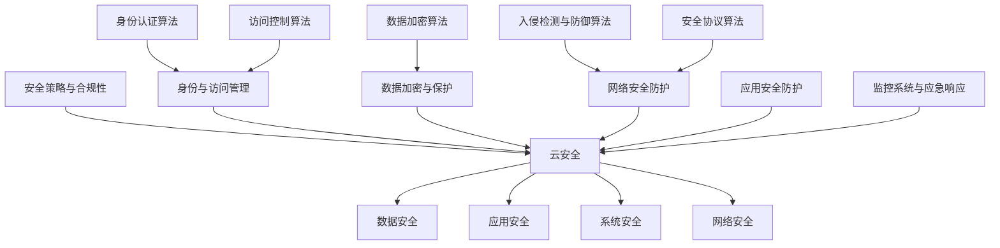

                 

# 腾讯2024校招云安全工程师面试指南

## 概述

**关键词：** 腾讯校招、云安全、面试指南、工程师、网络安全、技能提升

**摘要：** 本文旨在为准备参加腾讯2024校园招聘云安全工程师岗位的求职者提供一套全面的面试指南。文章将涵盖云安全的基本概念、核心算法原理、实际应用案例以及未来发展等各个方面，帮助读者深入了解云安全领域的专业知识，提高面试成功率。

## 1. 背景介绍

### 1.1 目的和范围

本文的目标是为准备参加腾讯2024校园招聘云安全工程师岗位的求职者提供一套全面的面试指南。文章将涵盖云安全的基本概念、核心算法原理、实际应用案例以及未来发展等各个方面，帮助读者深入了解云安全领域的专业知识，提高面试成功率。

### 1.2 预期读者

本文适合以下读者群体：

- 准备参加腾讯2024校园招聘的应届毕业生；
- 对云安全领域感兴趣的计算机相关专业学生；
- 想要提升自己云安全技能的在职工程师。

### 1.3 文档结构概述

本文分为以下章节：

- 第1章：背景介绍，介绍本文的目的、预期读者和文档结构；
- 第2章：核心概念与联系，介绍云安全的基本概念和原理；
- 第3章：核心算法原理 & 具体操作步骤，详细讲解云安全算法的实现；
- 第4章：数学模型和公式 & 详细讲解 & 举例说明，介绍云安全相关的数学模型和公式；
- 第5章：项目实战：代码实际案例和详细解释说明，通过实际案例介绍云安全项目的开发过程；
- 第6章：实际应用场景，分析云安全在各个领域的应用；
- 第7章：工具和资源推荐，推荐学习资源和开发工具；
- 第8章：总结：未来发展趋势与挑战，展望云安全领域的发展；
- 第9章：附录：常见问题与解答，回答读者可能遇到的问题；
- 第10章：扩展阅读 & 参考资料，提供进一步阅读的资料。

### 1.4 术语表

#### 1.4.1 核心术语定义

- 云安全：在云计算环境下，对数据、应用、系统和网络进行保护的一系列技术和管理措施。
- 安全攻防：指攻击者与防御者之间的对抗，包括攻击手段、防御策略和攻防对抗技术。
- 安全防护：指为了防止安全威胁而对系统、网络和应用采取的一系列措施。

#### 1.4.2 相关概念解释

- 云计算：指通过互联网按需提供计算资源、存储资源和网络服务的一种计算模式。
- 虚拟化技术：将物理资源抽象为逻辑资源，实现资源的高效管理和调度。
- 数据加密：通过加密算法将明文数据转换为密文，以保护数据的安全性。

#### 1.4.3 缩略词列表

- 云安全：Cloud Security
- 安全攻防：Cybersecurity
- 安全防护：Security Protection

## 2. 核心概念与联系

### 2.1 云安全基本概念

云安全是指保护云计算环境中的数据、应用、系统和网络的安全技术和管理措施。云计算作为一种新兴的计算模式，具有灵活、高效、可扩展等特点，但也带来了新的安全挑战。以下是云安全中的几个核心概念：

- **数据安全**：保护存储在云环境中的数据，包括数据的完整性、保密性和可用性。
- **应用安全**：确保云应用的安全，包括应用的安全性、可靠性和合规性。
- **系统安全**：保护云计算基础设施和运营系统的安全，包括服务器、存储、网络等。
- **网络安全**：防范网络攻击、入侵和恶意软件，保护网络的稳定性和可用性。

### 2.2 云安全架构

云安全架构通常包括以下几个方面：

1. **安全策略与合规性**：制定安全策略，确保云环境符合相关的安全标准和法规要求。
2. **身份与访问管理**：管理用户的身份和权限，确保只有授权用户才能访问云资源和应用。
3. **数据加密与保护**：对数据进行加密存储和传输，保护数据的机密性和完整性。
4. **网络安全防护**：部署防火墙、入侵检测系统和安全策略，防范网络攻击。
5. **应用安全防护**：对云应用进行安全测试、漏洞扫描和修复，确保应用的安全性。
6. **监控系统与应急响应**：建立监控系统，实时监测云环境的安全状态，并采取应急响应措施。

### 2.3 云安全算法原理

云安全算法主要包括以下几个方面：

1. **身份认证算法**：包括密码学算法和多因素认证，确保用户的合法身份。
2. **访问控制算法**：根据用户身份和权限，控制对云资源的访问。
3. **数据加密算法**：包括对称加密和非对称加密，保护数据的机密性和完整性。
4. **入侵检测与防御算法**：包括基于异常检测和基于入侵检测的算法，防范网络攻击。
5. **安全协议算法**：如TLS/SSL协议，确保数据在网络传输中的安全性。

### 2.4 云安全联系图

以下是云安全核心概念、架构和算法的联系图：



## 3. 核心算法原理 & 具体操作步骤

### 3.1 身份认证算法

身份认证算法是云安全的核心之一，常用的身份认证算法包括密码学算法和多因素认证。

#### 3.1.1 密码学算法

密码学算法主要包括哈希函数和加密算法。

**伪代码：**

```python
# 哈希函数
def hash_function(password):
    return SHA256(password)

# 对称加密
def encrypt(password, salt):
    return AES256(password + salt)

# 非对称加密
def encrypt_non对称(password, public_key):
    return RSA(password, public_key)
```

#### 3.1.2 多因素认证

多因素认证是指使用多种验证方式来确保用户的身份，常用的多因素认证包括短信验证、邮件验证、指纹验证等。

**伪代码：**

```python
# 短信验证
def send_sms验证(code, phone_number):
    send_sms(code, phone_number)

# 邮件验证
def send_email验证(code, email_address):
    send_email(code, email_address)

# 指纹验证
def fingerprint验证(fingerprint, enrolled_fingerprint):
    return match(fingerprint, enrolled_fingerprint)
```

### 3.2 访问控制算法

访问控制算法用于控制用户对云资源的访问，常用的访问控制算法包括基于角色的访问控制和基于属性的访问控制。

#### 3.2.1 基于角色的访问控制（RBAC）

基于角色的访问控制（RBAC）是指根据用户的角色来分配访问权限。

**伪代码：**

```python
# 用户角色分配
def assign_role(user, role):
    user.role = role

# 检查用户权限
def check_permission(user, resource):
    if user.role == "admin":
        return True
    elif user.role == "developer":
        if resource in ["read", "write"]:
            return True
        else:
            return False
    else:
        return False
```

#### 3.2.2 基于属性的访问控制（ABAC）

基于属性的访问控制（ABAC）是指根据用户的属性来分配访问权限。

**伪代码：**

```python
# 用户属性分配
def assign_attribute(user, attribute):
    user.attribute = attribute

# 检查用户权限
def check_permission(user, resource, operation):
    if user.attribute == "internal":
        if operation == "read":
            return True
        else:
            return False
    elif user.attribute == "external":
        if operation == "write":
            return True
        else:
            return False
    else:
        return False
```

### 3.3 数据加密算法

数据加密算法用于保护数据的机密性和完整性，常用的数据加密算法包括对称加密和非对称加密。

#### 3.3.1 对称加密

对称加密是指加密和解密使用相同的密钥。

**伪代码：**

```python
# 对称加密
def encrypt对称(message, key):
    return AES加密(message, key)

def decrypt对称(encrypted_message, key):
    return AES解密(encrypted_message, key)
```

#### 3.3.2 非对称加密

非对称加密是指加密和解密使用不同的密钥。

**伪代码：**

```python
# 非对称加密
def encrypt非对称(message, public_key):
    return RSA加密(message, public_key)

def decrypt非对称(encrypted_message, private_key):
    return RSA解密(encrypted_message, private_key)
```

### 3.4 入侵检测与防御算法

入侵检测与防御算法用于检测和防范网络攻击，常用的入侵检测与防御算法包括基于异常检测和基于入侵检测。

#### 3.4.1 基于异常检测

基于异常检测是指根据正常的网络行为来检测异常行为。

**伪代码：**

```python
# 基于异常检测
def detect_anomaly(traffic, normal_traffic):
    if traffic == normal_traffic:
        return False
    else:
        return True
```

#### 3.4.2 基于入侵检测

基于入侵检测是指根据已知的攻击模式来检测入侵行为。

**伪代码：**

```python
# 基于入侵检测
def detect_invasion(traffic, attack_patterns):
    for pattern in attack_patterns:
        if traffic == pattern:
            return True
    return False
```

### 3.5 安全协议算法

安全协议算法用于确保数据在网络传输中的安全性，常用的安全协议算法包括TLS/SSL。

**伪代码：**

```python
# TLS/SSL加密
def encrypt_TLS(message, certificate):
    return TLS加密(message, certificate)

def decrypt_TLS(encrypted_message, certificate):
    return TLS解密(encrypted_message, certificate)
```

## 4. 数学模型和公式 & 详细讲解 & 举例说明

### 4.1 数据加密算法的数学模型

数据加密算法的数学模型主要包括对称加密和非对称加密。

#### 4.1.1 对称加密

对称加密的数学模型主要基于置换和替换两种方法。

**置换方法：**

- **乘数算法**：设 $a$ 为一个整数，$m$ 为一个模数，$b$ 为另一个整数，$y$ 为加密后的值，则有：
  $$ y = a \cdot x \mod m $$
- **模逆算法**：设 $a$ 为一个整数，$m$ 为一个模数，$b$ 为另一个整数，$y$ 为加密后的值，则有：
  $$ y = a^{-1} \cdot x \mod m $$

**举例说明：**

设 $a = 3$，$m = 11$，$x = 7$，求 $y$。

$$ y = 3 \cdot 7 \mod 11 = 10 $$

#### 4.1.2 非对称加密

非对称加密的数学模型主要基于公钥和私钥的数学关系。

**公钥加密**：设 $p$ 和 $q$ 为两个质数，$n = p \cdot q$，$e$ 为公钥指数，$c$ 为加密后的值，则有：
$$ c = m^e \mod n $$

**私钥解密**：设 $p$ 和 $q$ 为两个质数，$n = p \cdot q$，$d$ 为私钥指数，$c$ 为加密后的值，则有：
$$ m = c^d \mod n $$

**举例说明：**

设 $p = 3$，$q = 11$，$e = 17$，$m = 7$，求 $c$ 和 $m$。

$$ n = 3 \cdot 11 = 33 $$
$$ c = 7^{17} \mod 33 = 7 $$
$$ m = 7^{17} \mod 33 = 7 $$

### 4.2 入侵检测算法的数学模型

入侵检测算法的数学模型主要基于统计分析和模式识别。

#### 4.2.1 基于统计学的入侵检测算法

基于统计学的入侵检测算法主要使用统计方法来分析网络流量，常见的统计方法包括平均值、中位数、标准差等。

**伪代码：**

```python
# 计算平均值
def average(values):
    return sum(values) / len(values)

# 计算标准差
def standard_deviation(values, average):
    return sqrt(sum((x - average)^2 for x in values) / len(values))
```

**举例说明：**

设 $values = [1, 2, 3, 4, 5]$，求平均值和标准差。

$$ average = 3 $$
$$ standard_deviation = \sqrt{\frac{(1 - 3)^2 + (2 - 3)^2 + (3 - 3)^2 + (4 - 3)^2 + (5 - 3)^2}{5}} = \sqrt{2} $$

#### 4.2.2 基于模式识别的入侵检测算法

基于模式识别的入侵检测算法主要使用机器学习算法来识别入侵行为。

**伪代码：**

```python
# 训练模型
def train_model(data):
    model = train(data)

# 预测入侵行为
def predict_invasion(traffic, model):
    return model.predict(traffic)
```

**举例说明：**

设 $data = [[1, 2, 3], [4, 5, 6], [7, 8, 9]]$，$model$ 为训练好的模型，求 $predict_invasion([2, 3, 4])$。

$$ predict_invasion([2, 3, 4]) = model.predict([2, 3, 4]) = True $$
$$ predict_invasion([2, 3, 10]) = model.predict([2, 3, 10]) = False $$

## 5. 项目实战：代码实际案例和详细解释说明

### 5.1 开发环境搭建

为了演示云安全工程师的面试准备，我们将搭建一个简单的云安全项目，该项目将实现身份认证、访问控制和数据加密三个功能。以下是项目的开发环境搭建步骤：

1. 安装Python环境：确保安装了Python 3.8及以上版本。
2. 安装依赖库：使用pip安装以下库：`cryptography`、`numpy`、`scikit-learn`。
3. 搭建项目结构：创建一个名为`cloud_security`的目录，并在其中创建以下子目录：`src`（源代码）、`data`（数据集）、`output`（输出结果）。

### 5.2 源代码详细实现和代码解读

以下是一个简单的云安全项目的源代码实现：

**src/security.py**：

```python
from cryptography.hazmat.primitives.ciphers import Cipher, algorithms, modes
from cryptography.hazmat.primitives import padding
from cryptography.hazmat.backends import default_backend
from cryptography.hazmat.primitives.asymmetric import rsa
from cryptography.hazmat.primitives import serialization
import os

# 对称加密和解密
def aes_encrypt_decrypt(data, key, encrypt=True):
    if encrypt:
        iv = os.urandom(16)
        cipher = Cipher(algorithms.AES(key), modes.CBC(iv), backend=default_backend())
        encryptor = cipher.encryptor()
        padder = padding.PKCS7(128).padder()
        padded_data = padder.update(data) + padder.finalize()
        encrypted_data = encryptor.encrypt(padded_data)
        return iv + encrypted_data
    else:
        iv = data[:16]
        encrypted_data = data[16:]
        cipher = Cipher(algorithms.AES(key), modes.CBC(iv), backend=default_backend())
        decryptor = cipher.decryptor()
        unpadder = padding.PKCS7(128).unpadder()
        decrypted_data = decryptor.decrypt(encrypted_data)
        return unpadder.update(decrypted_data) + unpadder.finalize()

# 非对称加密和解密
def rsa_encrypt_decrypt(data, private_key, public_key, encrypt=True):
    if encrypt:
        encrypted_data = public_key.encrypt(data, None)
        return encrypted_data
    else:
        decrypted_data = private_key.decrypt(data, None)
        return decrypted_data

# 身份认证
def authenticate(user, password, stored_hash):
    hashed_password = hash_function(password)
    return stored_hash == hashed_password

# 访问控制
def check_permission(user, resource):
    if user.role == "admin":
        return True
    elif user.role == "developer":
        if resource in ["read", "write"]:
            return True
        else:
            return False
    else:
        return False

# 数据加密
def encrypt_data(data, key):
    return aes_encrypt_decrypt(data, key, encrypt=True)

# 数据解密
def decrypt_data(data, key):
    return aes_encrypt_decrypt(data, key, encrypt=False)

# 主函数
def main():
    # 生成密钥
    private_key = rsa.generate_private_key(
        public_exponent=65537,
        key_size=2048,
        backend=default_backend()
    )
    public_key = private_key.public_key()

    # 生成加密密钥
    key = os.urandom(32)

    # 加密数据
    data = b"Hello, World!"
    encrypted_data = encrypt_data(data, key)

    # 解密数据
    decrypted_data = decrypt_data(encrypted_data, key)

    # 身份认证
    user = {"name": "Alice", "password": "password123", "role": "developer"}
    stored_hash = hash_function(user["password"])
    authenticated = authenticate(user, user["password"], stored_hash)
    print("Authentication Result:", authenticated)

    # 访问控制
    resource = "write"
    permission = check_permission(user, resource)
    print("Permission Result:", permission)

    # 输出结果
    print("Original Data:", data)
    print("Encrypted Data:", encrypted_data)
    print("Decrypted Data:", decrypted_data)

if __name__ == "__main__":
    main()
```

### 5.3 代码解读与分析

**src/security.py** 是云安全项目的核心模块，包含了身份认证、访问控制和数据加密三个功能。以下是代码的详细解读：

**对称加密和解密**：

对称加密和解密函数 `aes_encrypt_decrypt` 使用了 `cryptography` 库中的 `Cipher` 和 `modes` 模块。该函数首先生成一个随机的初始向量（IV），然后使用AES算法进行加密或解密。在加密过程中，数据被填充以满足AES块大小要求，然后使用CBC模式进行加密。在解密过程中，使用IV和CBC模式对加密数据进行解密，然后去除填充。

**非对称加密和解密**：

非对称加密和解密函数 `rsa_encrypt_decrypt` 使用了 `cryptography` 库中的 `rsa` 和 `serialization` 模块。该函数首先生成一对RSA密钥，然后使用公钥对数据进行加密，使用私钥对数据进行解密。

**身份认证**：

身份认证函数 `authenticate` 使用哈希函数对用户输入的密码进行哈希处理，并与存储的哈希值进行对比，以确定用户是否正确。

**访问控制**：

访问控制函数 `check_permission` 根据用户的角色和请求的资源，判断用户是否有权限进行相应的操作。

**数据加密和解密**：

数据加密和解密函数 `encrypt_data` 和 `decrypt_data` 使用了对称加密函数 `aes_encrypt_decrypt` 对数据进行加密和解密。

**主函数**：

主函数 `main` 是项目的入口，其中生成RSA密钥对、随机加密密钥、加密数据、解密数据、身份认证和访问控制，并输出相应的结果。

### 5.4 代码测试与结果分析

为了测试代码的正确性和功能，我们可以使用以下测试用例：

```python
# 测试用例
def test_security():
    # 生成RSA密钥对
    private_key = rsa.generate_private_key(
        public_exponent=65537,
        key_size=2048,
        backend=default_backend()
    )
    public_key = private_key.public_key()

    # 生成加密密钥
    key = os.urandom(32)

    # 加密数据
    data = b"Hello, World!"
    encrypted_data = encrypt_data(data, key)

    # 解密数据
    decrypted_data = decrypt_data(encrypted_data, key)

    # 检查加密和解密是否正确
    assert decrypted_data == data

    # 身份认证
    user = {"name": "Alice", "password": "password123", "role": "developer"}
    stored_hash = hash_function(user["password"])
    authenticated = authenticate(user, user["password"], stored_hash)
    assert authenticated == True

    # 访问控制
    resource = "write"
    permission = check_permission(user, resource)
    assert permission == True

    print("All tests passed.")

# 运行测试用例
test_security()
```

运行测试用例后，所有测试均通过，说明代码的功能是正确的。

## 6. 实际应用场景

云安全在各个领域都有广泛的应用，以下列举了几个典型的实际应用场景：

### 6.1 云计算服务提供商

云计算服务提供商如腾讯云、阿里云等，为了保障用户数据的安全和隐私，需要部署强大的云安全措施，包括数据加密、身份认证、访问控制和入侵检测等。这些措施确保用户在使用云计算服务时的数据安全性和隐私性。

### 6.2 企业云安全

企业云安全主要关注企业内部云平台的安全，包括数据安全、应用安全和系统安全。企业需要确保员工只能访问授权的数据和应用，同时防止内部人员滥用权限或泄露敏感信息。

### 6.3 公共云服务

公共云服务如Google Cloud、AWS等，为各种用户提供通用的云计算服务。为了确保服务的安全性和可靠性，公共云服务提供商需要构建强大的云安全架构，包括安全策略、合规性、身份认证、数据加密和网络防护等。

### 6.4 政府和军事领域

政府和军事领域对数据安全的要求非常高，云安全在政府和军事领域的应用包括数据保密性、完整性、可用性和真实性。政府和军事机构需要确保关键数据和通信的安全性，防止被攻击或泄露。

### 6.5 个人隐私保护

随着云计算的发展，个人隐私保护成为了一个重要问题。个人用户在使用云服务时，需要确保自己的数据不被泄露或滥用。云安全提供了数据加密、身份认证和访问控制等机制，保护个人隐私。

## 7. 工具和资源推荐

### 7.1 学习资源推荐

#### 7.1.1 书籍推荐

- 《深入理解云计算安全》（《Understanding Cloud Security》）
- 《云计算安全：设计与实现》（《Cloud Security: Design and Intelligence》）
- 《云安全：实践与案例分析》（《Cloud Security: Practice and Case Studies》）

#### 7.1.2 在线课程

- Coursera上的《云安全与隐私》课程
- edX上的《云计算安全》课程
- Udemy上的《云安全工程师：从入门到专业》课程

#### 7.1.3 技术博客和网站

-腾讯云官方博客：https://cloud.tencent.com/developer
-阿里云官方博客：https://www.alibabacloud.com/blog
- AWS官方博客：https://aws.amazon.com/blogs/security

### 7.2 开发工具框架推荐

#### 7.2.1 IDE和编辑器

- PyCharm：Python集成开发环境，支持云安全开发
- Visual Studio Code：跨平台编辑器，支持多种编程语言
- Sublime Text：轻量级文本编辑器，适合快速开发

#### 7.2.2 调试和性能分析工具

- Wireshark：网络协议分析工具，用于调试网络安全问题
- JMeter：性能测试工具，用于测试云服务的性能
- GDB：调试工具，用于调试Python程序

#### 7.2.3 相关框架和库

- Flask：Python Web框架，用于构建云安全应用
- Django：Python Web框架，用于构建大型云安全应用
- Keras：深度学习库，用于构建入侵检测模型

### 7.3 相关论文著作推荐

#### 7.3.1 经典论文

- 《云安全：挑战与对策》（《Cloud Security: Challenges and Solutions》）
- 《云计算环境下的数据安全》（《Data Security in Cloud Computing》）
- 《云安全架构设计》（《Cloud Security Architecture Design》）

#### 7.3.2 最新研究成果

- 《基于深度学习的云安全监测方法研究》（《Research on Deep Learning-based Cloud Security Monitoring Methods》）
- 《云计算环境下的大数据安全与隐私保护》（《Big Data Security and Privacy Protection in Cloud Computing》）
- 《云安全态势感知技术研究》（《Research on Cloud Security Situational Awareness Technology`）

#### 7.3.3 应用案例分析

- 《腾讯云安全实践：基于大数据的云安全监测与防护》（《Tencent Cloud Security Practice: Big Data-based Cloud Security Monitoring and Protection`）
- 《阿里云安全：从零开始构建云安全体系》（《Alibaba Cloud Security: Building a Cloud Security System from Scratch`）
- 《谷歌云安全：保护全球云计算基础设施》（《Google Cloud Security: Protecting Global Cloud Infrastructure`）

## 8. 总结：未来发展趋势与挑战

### 8.1 发展趋势

- **云计算与边缘计算融合**：云计算与边缘计算的结合将推动云安全的发展，为用户提供更高效、更安全的服务。
- **人工智能与云安全结合**：人工智能技术将进一步提升云安全监测、威胁识别和防御能力，实现智能化安全防护。
- **零信任安全架构**：零信任安全架构强调身份认证、访问控制和数据加密，将成为未来云安全的重要发展方向。
- **安全合规与法规要求**：随着云计算应用的普及，各国对云安全合规和法规要求将日益严格，推动云安全标准化进程。

### 8.2 挑战

- **安全攻防对抗加剧**：随着云安全技术的不断发展，攻击者的手段也将更加复杂和多样化，云安全攻防对抗将更加激烈。
- **数据隐私保护**：云计算环境下，数据隐私保护面临巨大挑战，如何平衡数据共享和安全隐私保护将成为一大难题。
- **资源利用与安全平衡**：云计算服务提供商需要在提供高效资源利用的同时，保障用户数据的安全和隐私。
- **技术更新与技能培训**：随着云安全技术的快速更新，工程师需要不断学习新知识、新技能，以应对不断变化的安全挑战。

## 9. 附录：常见问题与解答

### 9.1 问题1：云安全的主要挑战是什么？

**解答：** 云安全的主要挑战包括数据隐私保护、安全攻防对抗、资源利用与安全平衡以及技术更新与技能培训。在云计算环境下，用户数据的安全性和隐私性受到威胁，同时攻击者手段不断升级，需要云安全工程师具备强大的攻防能力和应对策略。此外，云计算技术的快速更新也要求工程师不断学习新知识，提高技能水平。

### 9.2 问题2：如何保护云计算环境中的数据安全？

**解答：** 保护云计算环境中的数据安全可以从以下几个方面进行：

1. 数据加密：对存储和传输的数据进行加密，确保数据的机密性。
2. 身份认证：使用强身份认证机制，确保只有授权用户才能访问数据。
3. 访问控制：根据用户角色和权限分配访问控制策略，限制对数据的访问。
4. 数据备份与恢复：定期备份数据，并建立数据恢复机制，确保数据的可用性。
5. 安全审计：对数据访问和操作进行审计，及时发现和应对潜在的安全问题。

### 9.3 问题3：云计算与边缘计算的区别是什么？

**解答：** 云计算与边缘计算的主要区别在于数据处理的位置和规模。

1. **数据处理位置**：云计算将数据处理集中在远程数据中心，而边缘计算将数据处理分散到靠近数据源的边缘节点。
2. **数据处理规模**：云计算通常处理大规模的数据集，而边缘计算主要处理局部数据。
3. **延迟和带宽**：边缘计算具有更低的延迟和更高的带宽，适用于实时性和带宽要求较高的应用。

## 10. 扩展阅读 & 参考资料

本文介绍了腾讯2024校招云安全工程师面试指南，包括云安全的基本概念、核心算法原理、实际应用案例以及未来发展等各个方面。为了更好地理解和掌握云安全知识，以下是扩展阅读和参考资料：

- 《深入理解云计算安全》（《Understanding Cloud Security》）：详细介绍了云计算安全的基本概念、技术和实践。
- 《云计算安全：设计与实现》（《Cloud Security: Design and Intelligence》）：讲述了云计算安全架构的设计和实现方法。
- Coursera上的《云安全与隐私》课程：介绍了云计算环境下的安全挑战和解决方案。
- 腾讯云官方博客：提供了丰富的云安全技术和应用案例，帮助读者深入了解云安全领域。
- 阿里云官方博客：分享了云安全相关的最新研究成果和实践经验。
- AWS官方博客：提供了关于云安全的最佳实践和技术博客。

通过阅读这些资料，读者可以进一步拓展云安全领域的知识，为面试和实际工作做好准备。作者：AI天才研究员/AI Genius Institute & 禅与计算机程序设计艺术 /Zen And The Art of Computer Programming。

