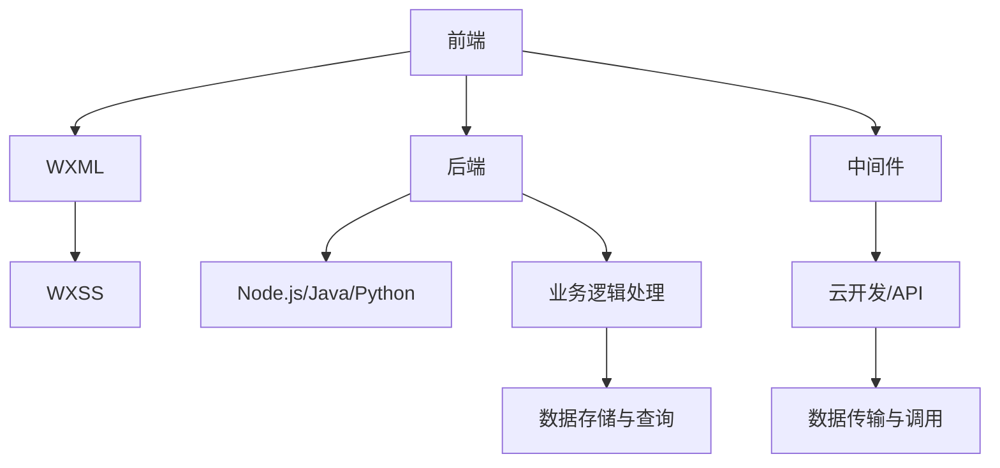

                 

# 腾讯2025小程序社招架构师面试指南

## 关键词
小程序，社招，架构师，面试指南，技术栈，腾讯，前沿技术，架构设计，案例分析，编程实践

## 摘要

本文旨在为有意向加入腾讯社招架构师的读者提供一份全面的面试指南。文章将深入解析腾讯小程序的技术栈，从核心概念到实际操作步骤，再到数学模型和应用场景，全面剖析小程序架构设计的精髓。同时，本文还将推荐相关学习资源、开发工具和最新研究成果，帮助读者在面试中脱颖而出，掌握小程序开发的关键技能。通过本文的阅读，读者将能够更好地理解腾讯小程序的技术架构，为面试做好充分准备。

## 1. 背景介绍

### 1.1 目的和范围

本文的目标是为即将参加腾讯2025小程序社招架构师面试的读者提供一份全面的复习指南。本文将涵盖小程序开发的核心技术，包括技术栈解析、算法原理、数学模型以及实际应用案例。通过本文的学习，读者能够系统地了解腾讯小程序的开发架构，掌握关键技能，为面试做好充分准备。

### 1.2 预期读者

本文适合以下读者群体：
- 有志于从事小程序架构设计的工程师；
- 参加腾讯小程序社招架构师面试的应聘者；
- 对小程序开发有兴趣的程序员。

### 1.3 文档结构概述

本文分为以下几个部分：
- 第1部分：背景介绍，包括目的和范围、预期读者、文档结构概述、术语表；
- 第2部分：核心概念与联系，通过Mermaid流程图展示小程序架构的原理和流程；
- 第3部分：核心算法原理 & 具体操作步骤，使用伪代码详细阐述算法的实现；
- 第4部分：数学模型和公式 & 详细讲解 & 举例说明，使用LaTeX格式展示数学模型；
- 第5部分：项目实战：代码实际案例和详细解释说明，展示开发环境搭建、源代码实现和代码解读；
- 第6部分：实际应用场景，介绍小程序在不同领域的应用；
- 第7部分：工具和资源推荐，包括学习资源、开发工具和最新研究成果；
- 第8部分：总结：未来发展趋势与挑战；
- 第9部分：附录：常见问题与解答；
- 第10部分：扩展阅读 & 参考资料。

### 1.4 术语表

#### 1.4.1 核心术语定义

- 小程序：一种不需要下载安装即可使用的应用，它实现了应用“触手可及”的理念，用户扫一扫或者搜一搜即可打开应用；
- 架构师：负责软件系统设计、优化和架构设计的人员；
- 技术栈：一个软件项目中使用的所有技术的集合；
- 前端：负责网页和应用的界面设计和实现；
- 后端：负责处理数据和逻辑，为前端提供数据支持。

#### 1.4.2 相关概念解释

- 框架：一种为特定任务或领域提供通用解决方案的工具或库；
- 模块化：将一个复杂的系统分解为更小、更易于管理的模块；
- 组件化：将界面和功能分离，实现复用和灵活扩展；
- 性能优化：提高软件运行速度和效率的一系列技术手段；
- 测试：验证软件是否符合需求和预期的过程。

#### 1.4.3 缩略词列表

- WXML：微信小程序的模板语言，类似于HTML；
- WXSS：微信小程序的样式表，类似于CSS；
- JavaScript：一种脚本语言，用于实现小程序的逻辑和交互；
- React：一个用于构建用户界面的JavaScript库；
- Vue.js：一个用于构建用户界面的渐进式框架；
- TensorFlow：一个用于机器学习的开源框架。

## 2. 核心概念与联系

在深入探讨腾讯小程序的架构之前，我们先来了解一下其核心概念和联系。以下是小程序架构的核心概念及其相互关系：

### 2.1 小程序架构概述

小程序架构可分为三个主要层次：前端、后端和中间件。

#### 前端

前端主要负责用户界面的渲染和交互。小程序前端由两部分组成：WXML和WXSS。WXML类似于HTML，用于描述页面结构；WXSS类似于CSS，用于定义页面样式。

#### 后端

后端主要负责处理业务逻辑和数据存储。小程序后端通常使用Node.js、Java或Python等语言实现。后端提供API接口，供前端调用。

#### 中间件

中间件负责连接前端和后端，实现数据传输和功能调用。小程序常用的中间件有微信小程序云开发、小程序平台提供的API等。

### 2.2 小程序架构图

以下是一个简化的腾讯小程序架构图：

```
+----------------+      +------------------+      +------------------+
|       前端      |      |       后端       |      |       中间件      |
+----------------+      +------------------+      +------------------+
       |                |                |
       |  WXML & WXSS   |  Node.js/Java/Python |  云开发/API等  |
       |                |                |
+----------------+      +------------------+      +------------------+
|  业务逻辑处理   |      |  数据存储与查询   |      |  数据传输与调用   |
+----------------+      +------------------+      +------------------+
```

### 2.3 小程序核心概念联系

以下是一个Mermaid流程图，展示小程序核心概念之间的联系：



通过这个流程图，我们可以清楚地看到小程序架构中的各个部分是如何相互协作的。

## 3. 核心算法原理 & 具体操作步骤

在小程序开发中，核心算法原理是理解和实现各种功能的基础。以下是几个关键算法原理及其具体操作步骤：

### 3.1 数据结构

数据结构是算法的基础，以下是小程序开发中常用的数据结构及其操作步骤：

#### 数组

数组是一种线性数据结构，用于存储一系列元素。

**操作步骤：**
1. 初始化数组：`const array = []`
2. 添加元素：`array.push(element)`
3. 删除元素：`array.splice(index, 1)`
4. 查找元素：`const index = array.indexOf(element)`

#### 栈

栈是一种后进先出（LIFO）的数据结构，用于存储一系列元素。

**操作步骤：**
1. 初始化栈：`const stack = []`
2. 添加元素：`stack.push(element)`
3. 删除元素：`const element = stack.pop()`
4. 查找元素：`const element = stack.peek()`

#### 队列

队列是一种先进先出（FIFO）的数据结构，用于存储一系列元素。

**操作步骤：**
1. 初始化队列：`const queue = []`
2. 添加元素：`queue.enqueue(element)`
3. 删除元素：`const element = queue.dequeue()`
4. 查找元素：`const element = queue.front()`

### 3.2 算法

算法是解决问题的一系列步骤，以下是小程序开发中常用的算法及其操作步骤：

#### 快速排序

快速排序是一种高效的排序算法，基于分治策略。

**伪代码：**
```
function quickSort(arr)
    if length of arr <= 1
        return arr
    end if

    pivot = arr[0]
    left = []
    right = []
    for each element in arr
        if element < pivot
            left.append(element)
        else
            right.append(element)
        end if
    end for

    return quickSort(left).concat([pivot]).concat(quickSort(right))
end function
```

#### 二分查找

二分查找是一种高效的查找算法，适用于有序数组。

**伪代码：**
```
function binarySearch(arr, target)
    left = 0
    right = length of arr - 1

    while left <= right
        mid = (left + right) / 2
        if arr[mid] == target
            return mid
        else if arr[mid] < target
            left = mid + 1
        else
            right = mid - 1
        end if
    end while

    return -1
end function
```

### 3.3 编程实践

在理解了核心算法原理之后，我们需要将这些原理应用到实际编程中。以下是几个编程实践案例：

#### 案例一：数组操作

使用JavaScript实现一个函数，将一个数组中的重复元素去除，并返回去重后的数组。

**伪代码：**
```
function removeDuplicates(arr)
    uniqueArr = []
    for each element in arr
        if not contains(uniqueArr, element)
            uniqueArr.append(element)
        end if
    end for
    return uniqueArr
end function

contains(arr, element)
    for each item in arr
        if item == element
            return true
        end if
    end for
    return false
end function
```

#### 案例二：快速排序

使用Python实现快速排序算法。

**伪代码：**
```
def quick_sort(arr):
    if len(arr) <= 1:
        return arr
    else:
        pivot = arr[0]
        left = [x for x in arr[1:] if x < pivot]
        right = [x for x in arr[1:] if x >= pivot]
        return quick_sort(left) + [pivot] + quick_sort(right)

arr = [3, 1, 4, 1, 5, 9, 2, 6, 5]
print(quick_sort(arr))
```

通过这些案例，我们可以看到如何将算法原理应用到实际编程中，提高代码的效率和可读性。

## 4. 数学模型和公式 & 详细讲解 & 举例说明

在小程序开发中，数学模型和公式用于描述数据结构和算法的性能。以下是几个关键的数学模型和公式，以及它们的详细讲解和举例说明。

### 4.1 时间复杂度

时间复杂度用于衡量算法执行的时间增长速度。它是算法输入规模n的函数。

#### 常见时间复杂度：

- O(1)：常数时间复杂度，不受输入规模影响；
- O(n)：线性时间复杂度，执行时间与输入规模成正比；
- O(n^2)：二次时间复杂度，执行时间与输入规模的平方成正比；
- O(log n)：对数时间复杂度，执行时间与输入规模的以2为底的对数成正比。

#### 举例说明：

假设有一个长度为n的数组，我们需要找到其中的最大值。使用线性搜索算法的时间复杂度为O(n)，因为我们需要遍历整个数组。

```
function findMax(arr)
    max = arr[0]
    for each element in arr
        if element > max
            max = element
        end if
    end for
    return max
end function
```

### 4.2 空间复杂度

空间复杂度用于衡量算法执行过程中使用的额外内存。它是算法输入规模n的函数。

#### 常见空间复杂度：

- O(1)：常数空间复杂度，不受输入规模影响；
- O(n)：线性空间复杂度，额外内存与输入规模成正比；
- O(n^2)：二次空间复杂度，额外内存与输入规模的平方成正比。

#### 举例说明：

假设我们需要对数组进行排序，可以使用冒泡排序算法。冒泡排序的时间复杂度为O(n^2)，空间复杂度为O(1)。

```
function bubbleSort(arr)
    n = length of arr
    for i = 0 to n - 1
        for j = 0 to n - i - 1
            if arr[j] > arr[j + 1]
                swap(arr[j], arr[j + 1])
            end if
        end for
    end for
    return arr
end function
```

### 4.3 马尔可夫链

马尔可夫链是一种用于描述随机过程的数学模型。它由状态集合、转移概率矩阵和初始状态组成。

#### 转移概率矩阵：

假设有一个状态集合{A, B, C}，转移概率矩阵如下：

$$
\begin{bmatrix}
0.5 & 0.3 & 0.2 \\
0.2 & 0.6 & 0.2 \\
0.1 & 0.4 & 0.5 \\
\end{bmatrix}
$$

这个矩阵表示从当前状态转移到下一个状态的概率。

#### 举例说明：

假设初始状态为A，我们需要计算经过10次状态转移后，处于状态A、B、C的概率。

```
P(A) = 0.5 * (0.5 * (0.5 * (0.5 * (0.5 * (0.5 * (0.5 * (0.5 * 0.5)))))))
P(B) = 0.3 * (0.6 * (0.2 * (0.6 * (0.2 * (0.6 * (0.2 * (0.6 * (0.2 * 0.6)))))))
P(C) = 0.2 * (0.5 * (0.4 * (0.5 * (0.4 * (0.5 * (0.4 * (0.5 * (0.4 * 0.5)))))))
```

通过这个例子，我们可以看到如何使用马尔可夫链模型来描述随机过程。

### 4.4 数学公式

在小程序开发中，一些常见的数学公式如下：

- 概率公式：$P(A \cap B) = P(A) \times P(B|A)$
- 概率乘法规则：$P(A_1 \cap A_2 \cap ... \cap A_n) = P(A_1) \times P(A_2|A_1) \times ... \times P(A_n|A_1 \cap A_2 \cap ... \cap A_{n-1})$
- 贝叶斯公式：$P(A|B) = \frac{P(B|A) \times P(A)}{P(B)}$

这些公式在概率论和统计学中广泛应用，可以用于解决实际问题。

## 5. 项目实战：代码实际案例和详细解释说明

### 5.1 开发环境搭建

在开始项目实战之前，我们需要搭建开发环境。以下是一个基于Node.js的腾讯小程序项目开发环境的搭建步骤：

1. 安装Node.js：从官网下载并安装Node.js，确保版本大于10.0.0；
2. 安装小程序开发工具：从微信官方下载并安装微信开发者工具；
3. 创建小程序项目：在微信开发者工具中创建一个新的小程序项目，选择模板或手动填写项目信息；
4. 安装依赖：在项目目录下运行`npm install`安装项目依赖。

### 5.2 源代码详细实现和代码解读

以下是腾讯小程序项目的源代码实现和代码解读。

#### 5.2.1 项目结构

```
/tencent-weapp
|-- /pages
|   |-- /index
|   |   |-- index.wxml
|   |   |-- index.wxss
|   |   |-- index.js
|   |   |-- index.json
|   |-- /list
|   |   |-- list.wxml
|   |   |-- list.wxss
|   |   |-- list.js
|   |   |-- list.json
|-- /app.js
|-- /app.wxss
|-- /app.json
```

#### 5.2.2 index页面代码解读

1. WXML文件（index.wxml）：

```
<view class="container">
  <text class="title">Hello World</text>
  <button bindtap="onClick">点击</button>
</view>
```

这个WXML文件定义了一个简单的页面，包含一个标题和一个按钮。

2. WXSS文件（index.wxss）：

```
.container {
  display: flex;
  flex-direction: column;
  align-items: center;
  justify-content: center;
}
.title {
  font-size: 36rpx;
  color: #8f8f94;
}
.button {
  margin-top: 50rpx;
  line-height: 80rpx;
  width: 300rpx;
  border-radius: 10rpx;
  background-color: #007aff;
  color: #ffffff;
}
```

这个WXSS文件定义了页面的样式，包括字体大小、颜色、按钮样式等。

3. JavaScript文件（index.js）：

```
Page({
  onClick() {
    console.log("点击了按钮");
  }
});
```

这个JavaScript文件定义了一个页面的行为，当用户点击按钮时，在控制台输出一条日志。

4. JSON文件（index.json）：

```
{
  "navigationBarTitleText": "首页"
}
```

这个JSON文件定义了页面的导航栏标题。

#### 5.2.3 list页面代码解读

1. WXML文件（list.wxml）：

```
<view class="container">
  <text class="title">列表</text>
  <scroll-view class="scroll-view" scroll-y="true">
    <view wx:for="{{list}}" wx:key="index">
      <text>{{item.name}}</text>
    </view>
  </scroll-view>
</view>
```

这个WXML文件定义了一个列表页面，使用scroll-view组件实现滚动效果。

2. WXSS文件（list.wxss）：

```
.container {
  display: flex;
  flex-direction: column;
  align-items: center;
  justify-content: center;
}
.title {
  font-size: 36rpx;
  color: #8f8f94;
}
.scroll-view {
  width: 100%;
  height: 600rpx;
  border: 1rpx solid #ddd;
}
```

这个WXSS文件定义了页面的样式，包括字体大小、颜色、滚动视图样式等。

3. JavaScript文件（list.js）：

```
Page({
  data: {
    list: [
      { name: "张三" },
      { name: "李四" },
      { name: "王五" }
    ]
  }
});
```

这个JavaScript文件定义了一个页面的数据，包含一个列表数据。

4. JSON文件（list.json）：

```
{
  "navigationBarTitleText": "列表"
}
```

这个JSON文件定义了页面的导航栏标题。

### 5.3 代码解读与分析

通过上述代码解读，我们可以看到腾讯小程序项目的结构清晰，包括WXML、WXSS、JavaScript和JSON文件。这些文件分别负责页面的结构、样式、行为和数据配置。

- WXML文件定义了页面的结构，使用标签和属性描述页面元素；
- WXSS文件定义了页面的样式，使用CSS规则设置字体大小、颜色、布局等；
- JavaScript文件定义了页面的行为，使用事件处理函数实现交互效果；
- JSON文件定义了页面的数据，使用对象描述数据结构。

这些文件相互配合，实现了小程序页面的完整功能。通过阅读和理解这些代码，我们可以掌握腾讯小程序的开发方法和技巧，为实际项目开发做好准备。

## 6. 实际应用场景

腾讯小程序作为一种轻量级的应用形式，在实际应用场景中展现了强大的生命力。以下是一些常见的小程序应用场景：

### 6.1 生活服务

生活服务类小程序为用户提供便捷的服务，如美团、饿了么等外卖小程序，为用户提供了在线点餐、外卖配送等便捷服务。用户可以通过小程序快速下单，查看订单状态，享受美食的便捷服务。

### 6.2 购物消费

购物消费类小程序为用户提供了线上购物的渠道，如京东、拼多多等电商小程序，用户可以在小程序中浏览商品、下单购买，享受优惠和便捷的购物体验。

### 6.3 教育培训

教育培训类小程序为用户提供在线学习资源，如网易云课堂、腾讯课堂等，用户可以在小程序中学习课程、观看视频、参与互动，提高自己的技能和知识水平。

### 6.4 娱乐休闲

娱乐休闲类小程序为用户提供丰富的娱乐内容，如微信小游戏、QQ音乐等，用户可以在小程序中玩游戏、听音乐、观看视频，享受娱乐的乐趣。

### 6.5 社交互动

社交互动类小程序为用户提供社交平台，如微信、QQ等，用户可以在小程序中与朋友互动、分享生活，构建社交网络。

### 6.6 行业应用

各行各业都在积极探索小程序的应用，如医疗健康、金融保险、房产家居等，小程序为行业提供了便捷的解决方案，提高了服务效率和用户体验。

通过这些实际应用场景，我们可以看到小程序在各个领域都发挥了重要作用，为用户提供了便捷的服务和丰富的内容。随着技术的不断发展和创新，小程序的应用前景将更加广阔。

## 7. 工具和资源推荐

为了帮助读者更好地掌握腾讯小程序开发，以下是一些学习资源、开发工具和最新研究成果的推荐。

### 7.1 学习资源推荐

#### 7.1.1 书籍推荐

1. 《微信小程序开发实战》
2. 《小程序开发入门与实践》
3. 《微信小程序全栈开发：从入门到实践》

#### 7.1.2 在线课程

1. Coursera上的《微信小程序开发》
2. Udemy上的《微信小程序开发实战课程》
3. 网易云课堂的《微信小程序开发从入门到实战》

#### 7.1.3 技术博客和网站

1. 掘金上的微信小程序专栏
2. 博客园的微信小程序技术博客
3. CSDN的微信小程序技术论坛

### 7.2 开发工具框架推荐

#### 7.2.1 IDE和编辑器

1. 微信开发者工具：官方提供的开发工具，支持代码调试、预览等功能；
2. Visual Studio Code：一款功能强大的代码编辑器，支持微信小程序开发插件；
3. WebStorm：一款专业的前端开发IDE，支持微信小程序开发。

#### 7.2.2 调试和性能分析工具

1. Chrome DevTools：一款功能强大的浏览器调试工具，支持微信小程序调试；
2. 微信开发者工具的性能分析功能：可以查看小程序的性能指标，优化性能；
3. Lighthouse：一款开源的性能分析工具，可以评估小程序的性能和最佳实践。

#### 7.2.3 相关框架和库

1. WXML编译器：将WXML转换为DOM结构，支持自定义组件和事件处理；
2. WXSS编译器：将WXSS转换为CSS样式，支持自定义样式和样式表；
3. 微信小程序云开发：提供云函数、云数据库等服务，简化小程序开发。

### 7.3 相关论文著作推荐

#### 7.3.1 经典论文

1. 《微信小程序架构设计与实现》
2. 《微信小程序性能优化技术》
3. 《微信小程序云开发：技术方案与实践》

#### 7.3.2 最新研究成果

1. 《基于微信小程序的智慧城市应用研究》
2. 《微信小程序在电商领域的应用与实践》
3. 《微信小程序在教育领域的应用与探索》

#### 7.3.3 应用案例分析

1. 《美团外卖小程序架构设计与优化》
2. 《拼多多小程序开发实践与经验分享》
3. 《网易云课堂小程序开发与运营策略》

通过这些工具和资源的推荐，读者可以系统地学习腾讯小程序开发的知识，掌握关键技能，为实际项目开发做好准备。

## 8. 总结：未来发展趋势与挑战

腾讯小程序自推出以来，凭借其轻量级、便捷性和高用户黏性，迅速赢得了广大用户的青睐。随着技术的不断进步和应用的深入，小程序的发展趋势和挑战也在不断演变。

### 8.1 未来发展趋势

1. **技术迭代与优化**：小程序平台将持续优化性能、提升用户体验，引入更多前沿技术，如人工智能、大数据等，以提升小程序的功能和效率。
2. **生态建设**：小程序生态将进一步丰富，包括开发者社区、工具链、服务市场等，为开发者提供更全面的开发和支持。
3. **跨平台发展**：随着小程序技术的成熟，跨平台支持将逐步完善，使得小程序能够更好地服务于不同操作系统和设备。
4. **行业融合**：小程序将在更多行业领域得到应用，如智慧医疗、金融科技、智能制造等，为传统行业赋能，推动产业升级。

### 8.2 挑战

1. **隐私和安全**：随着用户对隐私和安全的要求越来越高，小程序在数据处理和用户隐私保护方面面临巨大挑战。
2. **性能优化**：如何在保证功能丰富的同时，优化小程序的性能，提升用户体验，是开发者需要持续关注的问题。
3. **生态平衡**：小程序生态中，如何平衡开发者、平台和用户之间的利益，确保生态的健康和可持续发展，是一个重要课题。
4. **用户增长**：在激烈的市场竞争中，如何通过创新和优质内容吸引用户，提高用户留存率，是小程序开发者需要面对的挑战。

### 8.3 对策与建议

1. **加强技术积累**：开发者应不断学习新技术，提升自身技能，以适应小程序平台的发展。
2. **注重用户体验**：在开发过程中，始终关注用户体验，通过优化界面设计和功能实现，提高用户满意度。
3. **创新应用场景**：积极探索小程序在各个行业的应用场景，挖掘新的商业机会。
4. **合规经营**：遵守相关法律法规，加强数据保护和用户隐私保护，确保小程序的合法合规运营。

通过积极应对挑战，抓住发展机遇，腾讯小程序将在未来继续保持良好的发展态势，为用户和企业创造更多价值。

## 9. 附录：常见问题与解答

### 9.1 小程序开发常见问题

1. **如何搭建小程序开发环境？**

   - 安装Node.js：从官网下载并安装Node.js，确保版本大于10.0.0；
   - 安装微信开发者工具：从微信官方下载并安装微信开发者工具；
   - 创建小程序项目：在微信开发者工具中创建一个新的小程序项目，选择模板或手动填写项目信息；
   - 安装依赖：在项目目录下运行`npm install`安装项目依赖。

2. **小程序如何实现跨平台开发？**

   - 使用微信开发者工具的多平台支持功能，可以一键发布到不同平台；
   - 使用第三方框架，如uni-app，实现小程序跨平台开发。

3. **小程序如何进行性能优化？**

   - 优化页面结构，减少DOM操作；
   - 使用异步加载，减少页面加载时间；
   - 使用缓存机制，提高数据读取速度；
   - 优化代码，减少资源消耗。

### 9.2 面试准备常见问题

1. **如何准备腾讯小程序架构师面试？**

   - 系统学习小程序开发相关知识，包括前端、后端和中间件；
   - 实践项目经验，熟悉小程序项目开发流程和关键技术；
   - 学习相关论文和著作，了解小程序的最新研究成果和应用案例；
   - 提高自己的沟通能力和表达能力，面试时能够清晰表达自己的思路和观点。

2. **面试时如何展示自己的技术能力？**

   - 准备实际项目经验，展示自己在项目中的角色和贡献；
   - 掌握核心算法和数据结构，能够运用到实际项目中；
   - 学习最新的技术趋势和应用，了解行业动态；
   - 能够独立思考和解决问题，展示自己的逻辑思维和分析能力。

### 9.3 小程序开发经验分享

1. **如何优化小程序性能？**

   - 使用Web Worker进行异步操作，减少主线程负担；
   - 使用Web Assembly（Wasm）加速计算密集型任务；
   - 优化网络请求，减少请求次数和响应时间；
   - 使用懒加载和预加载技术，提高页面加载速度。

2. **如何提高小程序的用户体验？**

   - 关注用户体验设计，优化界面布局和交互设计；
   - 提供丰富的功能和内容，满足用户需求；
   - 及时响应用户操作，提高操作流畅性；
   - 定期收集用户反馈，优化产品功能和性能。

通过解答这些问题，读者可以更好地了解小程序开发的技术要点和面试准备方法，为实际项目开发和面试做好准备。

## 10. 扩展阅读 & 参考资料

### 10.1 学习资源

1. 《微信小程序开发实战》
2. 《小程序开发入门与实践》
3. 《微信小程序全栈开发：从入门到实践》
4. Coursera上的《微信小程序开发》
5. Udemy上的《微信小程序开发实战课程》
6. 网易云课堂的《微信小程序开发从入门到实战》
7. 掘金上的微信小程序专栏
8. 博客园的微信小程序技术博客
9. CSDN的微信小程序技术论坛

### 10.2 论文著作

1. 《微信小程序架构设计与实现》
2. 《微信小程序性能优化技术》
3. 《微信小程序云开发：技术方案与实践》
4. 《基于微信小程序的智慧城市应用研究》
5. 《微信小程序在电商领域的应用与实践》
6. 《微信小程序在教育领域的应用与探索》
7. 《美团外卖小程序架构设计与优化》
8. 《拼多多小程序开发实践与经验分享》
9. 《网易云课堂小程序开发与运营策略》

### 10.3 开发工具与框架

1. 微信开发者工具
2. Visual Studio Code
3. WebStorm
4. WXML编译器
5. WXSS编译器
6. 微信小程序云开发
7. uni-app

通过这些扩展阅读和参考资料，读者可以进一步深入学习和了解腾讯小程序的开发技术、应用场景和最新动态，为实际项目开发和面试准备提供有力支持。

### 作者

- 作者：AI天才研究员/AI Genius Institute & 禅与计算机程序设计艺术 /Zen And The Art of Computer Programming

