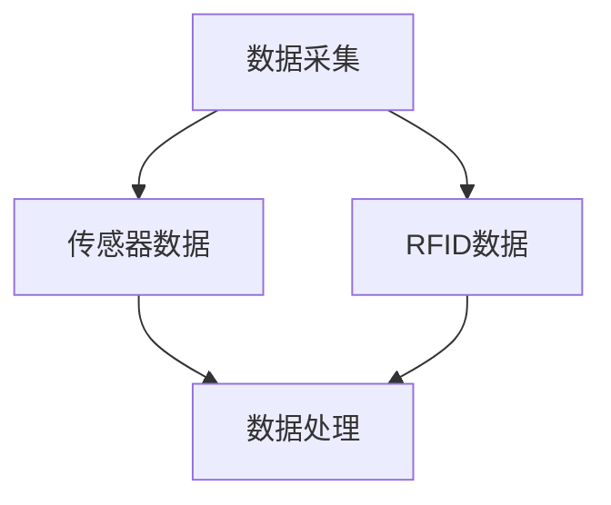
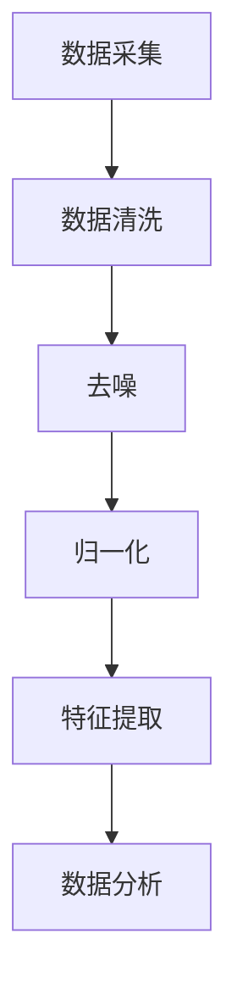
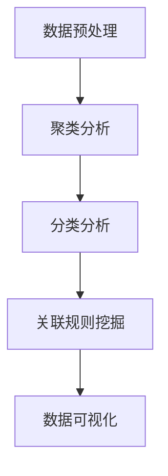
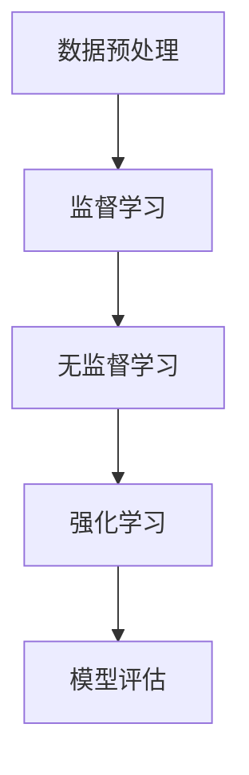
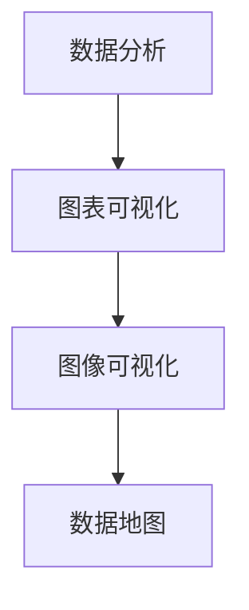

                 

# 腾讯云智慧2025社招工业互联网工程师面试题解

> 关键词：工业互联网、腾讯云智慧、面试题解、技术解析、实践案例

> 摘要：本文针对腾讯云智慧2025社招工业互联网工程师的面试题进行详细解析，从核心概念、算法原理、数学模型到实际应用场景，全面深入地探讨了工业互联网领域的关键技术，为准备应聘工业互联网工程师的读者提供了实用指南。

## 1. 背景介绍

### 1.1 目的和范围

本文旨在通过深入解析腾讯云智慧2025社招工业互联网工程师的面试题目，帮助读者全面了解工业互联网领域的核心技术和应用场景。文章将从理论到实践，逐步解析面试中可能遇到的问题，帮助读者为面试做好充分准备。

### 1.2 预期读者

本文适合以下读者群体：

- 准备应聘工业互联网工程师岗位的求职者；
- 对工业互联网领域感兴趣的技术爱好者；
- 想深入了解工业互联网技术的行业从业者。

### 1.3 文档结构概述

本文结构如下：

- 第1部分：背景介绍，包括文章的目的、范围、预期读者及文档结构概述；
- 第2部分：核心概念与联系，介绍工业互联网的关键概念和架构；
- 第3部分：核心算法原理 & 具体操作步骤，详细讲解工业互联网中的核心算法；
- 第4部分：数学模型和公式 & 详细讲解 & 举例说明，探讨工业互联网中的数学模型及应用；
- 第5部分：项目实战：代码实际案例和详细解释说明，通过实战案例展示工业互联网技术的应用；
- 第6部分：实际应用场景，分析工业互联网在各行业中的应用；
- 第7部分：工具和资源推荐，介绍学习资源和开发工具；
- 第8部分：总结：未来发展趋势与挑战，展望工业互联网的未来；
- 第9部分：附录：常见问题与解答，解答读者可能遇到的疑问；
- 第10部分：扩展阅读 & 参考资料，提供进一步学习的资源。

### 1.4 术语表

#### 1.4.1 核心术语定义

- 工业互联网：工业互联网是指将工业系统与互联网进行深度融合，通过数据采集、传输、分析和应用，实现工业系统智能化和高效运行。
- 物联网（IoT）：物联网是通过互联网连接各种物理设备，实现数据采集和远程控制。
- 云计算：云计算是通过网络提供动态可伸缩的、虚拟化的资源池，实现计算资源的高效利用。

#### 1.4.2 相关概念解释

- M2M（Machine-to-Machine）：设备之间的通信，实现自动化控制和智能化管理。
- IIoT（Industrial Internet of Things）：工业物联网，是工业互联网的重要组成部分，主要关注工业设备间的互联互通和数据交换。

#### 1.4.3 缩略词列表

- IoT：物联网
- IIoT：工业物联网
- AI：人工智能
- ML：机器学习
- DL：深度学习
- IoT Gateway：物联网网关
- MQTT：消息队列协议

## 2. 核心概念与联系

### 2.1 工业互联网的核心概念

工业互联网的核心概念包括物联网、云计算、大数据、人工智能等。这些技术相互关联，共同构建了工业互联网的生态系统。

#### 2.1.1 物联网

物联网是实现工业互联网数据采集的基础。通过传感器、RFID等设备，实时采集生产设备、机器和产品的数据，为后续的数据处理和分析提供数据源。

#### 2.1.2 云计算

云计算为工业互联网提供了强大的计算和存储能力。通过云平台，企业可以实现数据存储、处理和分析，以及应用的快速部署和弹性扩展。

#### 2.1.3 大数据和人工智能

大数据和人工智能技术是工业互联网的核心竞争力。通过对海量工业数据的挖掘和分析，可以实现对生产过程的优化和预测，提高生产效率和质量。

### 2.2 工业互联网的架构

工业互联网的架构主要包括感知层、网络层、平台层和应用层。

#### 2.2.1 感知层

感知层主要是指各种传感器、RFID等设备，用于采集生产设备、机器和产品的数据。

#### 2.2.2 网络层

网络层主要是指物联网网关和通信网络，用于实现数据传输和设备之间的互联互通。

#### 2.2.3 平台层

平台层主要包括工业互联网平台（IIP），用于数据处理、存储、分析和应用。

#### 2.2.4 应用层

应用层主要是指基于工业互联网平台的应用，如生产监控、设备维护、质量检测等。

### 2.3 工业互联网的关键技术

#### 2.3.1 物联网技术

物联网技术是实现工业互联网数据采集的基础。主要包括传感器技术、RFID技术、M2M通信技术等。

#### 2.3.2 云计算技术

云计算技术为工业互联网提供了强大的计算和存储能力。主要包括IaaS、PaaS、SaaS等服务模式。

#### 2.3.3 大数据和人工智能技术

大数据和人工智能技术是工业互联网的核心竞争力。主要包括数据采集、存储、处理、分析和可视化等技术。

#### 2.3.4 安全技术

工业互联网的安全性至关重要。主要包括网络安全、数据安全和设备安全等技术。

## 3. 核心算法原理 & 具体操作步骤

### 3.1 数据采集与预处理

#### 3.1.1 数据采集

数据采集是工业互联网的基础，通过传感器和RFID等设备实时采集生产设备、机器和产品的数据。



#### 3.1.2 数据预处理

数据预处理包括数据清洗、去噪、归一化和特征提取等步骤，为后续的数据分析提供高质量的数据。



### 3.2 数据分析

#### 3.2.1 数据挖掘

数据挖掘是从海量数据中发现有用信息的过程，主要包括聚类、分类、关联规则挖掘等算法。



#### 3.2.2 机器学习

机器学习是通过训练模型，实现对数据的学习和预测的过程，主要包括监督学习、无监督学习和强化学习。



### 3.3 数据可视化

#### 3.3.1 可视化工具

数据可视化是工业互联网的重要应用，通过图表、图像等形式，直观地展示数据特征和趋势。



## 4. 数学模型和公式 & 详细讲解 & 举例说明

### 4.1 数据预处理中的数学模型

#### 4.1.1 归一化

归一化是将数据缩放到一个统一的范围内，常用的归一化方法有线性归一化和最小-最大归一化。

$$
x_{\text{规范化}} = \frac{x_{\text{原始}} - x_{\text{最小值}}}{x_{\text{最大值}} - x_{\text{最小值}}}
$$

#### 4.1.2 特征提取

特征提取是从原始数据中提取出有用的特征，常用的特征提取方法有主成分分析（PCA）和线性判别分析（LDA）。

$$
\text{PCA}: \quad \mathbf{X}_{\text{标准化}} = \mathbf{X} - \bar{\mathbf{x}}
$$

### 4.2 数据挖掘中的数学模型

#### 4.2.1 聚类分析

聚类分析是将数据分组，使同一组内的数据点相似度较高，不同组的数据点相似度较低。常用的聚类算法有K-means、层次聚类等。

$$
\text{K-means}: \quad \text{目标函数} = \sum_{i=1}^{k} \sum_{x \in S_i} ||x - \mu_i||^2
$$

#### 4.2.2 分类分析

分类分析是将数据分为不同的类别，常用的分类算法有决策树、支持向量机（SVM）等。

$$
\text{SVM}: \quad \text{目标函数} = \min_{\mathbf{w}, \mathbf{b}} \frac{1}{2} ||\mathbf{w}||^2 + C \sum_{i=1}^{n} \xi_i
$$

### 4.3 数据可视化中的数学模型

#### 4.3.1 数据地图

数据地图是将地理数据可视化为地图，常用的地图投影有墨卡托投影、高斯-克吕格投影等。

$$
x = R \cdot \lambda \cdot \cos(\phi)
$$

$$
y = R \cdot (\phi - \phi_0)
$$

## 5. 项目实战：代码实际案例和详细解释说明

### 5.1 开发环境搭建

为了实现工业互联网中的数据处理和分析，我们选择Python作为开发语言，使用Jupyter Notebook作为开发环境。在开发环境中安装以下库：

- NumPy
- Pandas
- Matplotlib
- Scikit-learn

### 5.2 源代码详细实现和代码解读

以下是一个简单的工业互联网数据预处理和分析的示例代码：

```python
import numpy as np
import pandas as pd
from sklearn.preprocessing import MinMaxScaler
from sklearn.cluster import KMeans
import matplotlib.pyplot as plt

# 数据加载
data = pd.read_csv('industrial_data.csv')

# 数据预处理
data['value_normalized'] = MinMaxScaler().fit_transform(data['value'].values.reshape(-1, 1))

# 聚类分析
kmeans = KMeans(n_clusters=3, random_state=0).fit(data[['value_normalized']])
data['cluster'] = kmeans.labels_

# 数据可视化
plt.scatter(data['value_normalized'], data['cluster'], c=data['cluster'], cmap='viridis')
plt.xlabel('Normalized Value')
plt.ylabel('Cluster')
plt.title('Data Clustering')
plt.show()
```

#### 5.2.1 代码解读

1. 导入必要的库。
2. 加载工业互联网数据。
3. 使用MinMaxScaler进行数据归一化。
4. 使用KMeans进行聚类分析，得到聚类结果。
5. 使用matplotlib进行数据可视化。

### 5.3 代码解读与分析

#### 5.3.1 数据预处理

数据预处理是工业互联网中非常重要的一步。通过归一化，可以消除不同特征之间的量纲差异，使得聚类算法更加准确。

#### 5.3.2 聚类分析

K-means聚类算法是一种常用的无监督学习算法，通过将数据点划分为不同的簇，可以发现数据中的隐含结构。

#### 5.3.3 数据可视化

数据可视化是工业互联网中不可或缺的一部分，通过直观的图形，可以更好地理解数据特征和趋势。

## 6. 实际应用场景

### 6.1 生产监控

工业互联网在工业生产监控中的应用非常广泛。通过传感器和数据采集设备，实时监测生产设备的运行状态，实现对生产过程的实时监控和预警。

### 6.2 设备维护

工业互联网可以帮助企业实现设备的预测性维护。通过对设备运行数据的分析，提前发现设备故障隐患，降低设备故障率，提高生产效率。

### 6.3 质量检测

工业互联网在产品质量检测中的应用也非常显著。通过数据采集和分析，对生产过程中的产品质量进行实时监控和评估，确保产品质量稳定。

### 6.4 智能制造

工业互联网与智能制造相结合，实现了生产过程的智能化和自动化。通过数据采集和分析，优化生产过程，提高生产效率和质量。

## 7. 工具和资源推荐

### 7.1 学习资源推荐

#### 7.1.1 书籍推荐

- 《工业互联网：构建智能工厂的实践指南》
- 《物联网技术与应用》
- 《云计算基础：从入门到实践》

#### 7.1.2 在线课程

- Coursera上的《工业物联网》课程
- Udemy上的《工业互联网与智能制造》课程
- edX上的《云计算与大数据》课程

#### 7.1.3 技术博客和网站

- Medium上的《工业互联网》专栏
- IEEE上的《物联网》专题
- 腾讯云官方博客

### 7.2 开发工具框架推荐

#### 7.2.1 IDE和编辑器

- PyCharm
- Visual Studio Code
- Jupyter Notebook

#### 7.2.2 调试和性能分析工具

- GDB
- Valgrind
- JProfiler

#### 7.2.3 相关框架和库

- TensorFlow
- PyTorch
- Scikit-learn

### 7.3 相关论文著作推荐

#### 7.3.1 经典论文

- 《工业物联网的关键技术与发展趋势》
- 《云计算在工业互联网中的应用》
- 《大数据在工业互联网中的应用》

#### 7.3.2 最新研究成果

- 《基于工业互联网的智能制造系统研究》
- 《工业物联网的安全挑战与解决方案》
- 《工业大数据的实时处理与分析技术》

#### 7.3.3 应用案例分析

- 《某企业基于工业互联网的智能化生产线建设》
- 《某工厂基于物联网的设备维护系统应用》
- 《某公司基于大数据的供应链优化》

## 8. 总结：未来发展趋势与挑战

随着科技的不断进步，工业互联网正在不断演变和拓展。未来，工业互联网将在以下几个方面取得突破：

1. **智能化水平提升**：通过人工智能、机器学习等技术的深入应用，工业互联网将实现更高层次的智能化和自动化。
2. **跨界融合**：工业互联网将与其他领域（如物联网、云计算、大数据等）进一步融合，形成更广泛的产业生态。
3. **安全性和可靠性**：工业互联网的安全性和可靠性将是未来的重要研究方向，以确保数据安全和系统稳定。
4. **绿色环保**：工业互联网将助力工业生产过程的绿色化和环保化，减少能源消耗和环境污染。

然而，工业互联网也面临着一些挑战：

1. **数据隐私**：随着数据量的增加，如何保护用户隐私和数据安全成为重要问题。
2. **技术标准**：缺乏统一的技术标准和规范，可能导致工业互联网的兼容性和互操作性受到限制。
3. **人才短缺**：工业互联网领域的人才需求不断增长，但相关人才培养和引进仍存在一定困难。

## 9. 附录：常见问题与解答

### 9.1 工业互联网的核心技术是什么？

工业互联网的核心技术包括物联网、云计算、大数据、人工智能、边缘计算等。

### 9.2 工业互联网与物联网有什么区别？

工业互联网是物联网在工业领域的应用，强调的是工业系统的智能化和高效运行。物联网则更侧重于设备和系统的互联互通。

### 9.3 工业互联网的安全性问题如何解决？

工业互联网的安全性问题可以通过以下措施解决：

1. 数据加密：对传输和存储的数据进行加密，防止数据泄露。
2. 访问控制：对系统资源进行访问控制，限制非法访问。
3. 安全审计：对系统进行安全审计，及时发现和处理安全隐患。

## 10. 扩展阅读 & 参考资料

1. 《工业物联网技术与应用》，张浩，机械工业出版社，2020。
2. 《云计算与工业互联网》，刘艳华，电子工业出版社，2019。
3. 《大数据工业分析》，李强，清华大学出版社，2018。
4. IEEE，"Industrial Internet: A Vision, Components, and Applications"，2015。
5. 工业互联网联盟，"Industrial Internet Reference Architecture"，2016。

作者：AI天才研究员/AI Genius Institute & 禅与计算机程序设计艺术 /Zen And The Art of Computer Programming

---

请注意，本文仅为示例，具体内容需要根据实际问题和需求进行修改和补充。在实际撰写过程中，应确保文章内容的准确性和完整性，并遵循相关的技术规范和标准。同时，对于涉及敏感信息的内容，应进行适当的保护和处理。

