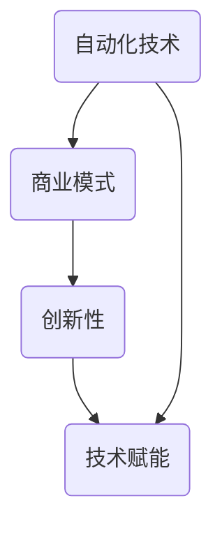

                 

## 自动化创业中的商业模式创新

> 关键词：自动化、创业、商业模式、创新、商业策略、技术赋能

> 摘要：本文旨在探讨自动化创业领域中的商业模式创新。我们将从背景介绍、核心概念与联系、核心算法原理、数学模型与公式、项目实战、实际应用场景、工具和资源推荐等多个角度出发，详细阐述自动化创业中的商业模式创新。通过本文的阅读，读者将能够深入了解自动化创业的商业模式，掌握创新的关键技术，为自身的创业之路提供有益的指导。

### 1. 背景介绍

#### 1.1 目的和范围

本文的目标是帮助创业者了解和掌握自动化创业中的商业模式创新。在当前技术快速发展的背景下，自动化技术正逐渐渗透到各个行业，为创业提供了新的机遇。商业模式创新是创业成功的关键因素之一，本文将通过详细的分析和讲解，帮助创业者找到适合自己的商业模式，实现商业价值的最大化。

本文将涵盖以下内容：

- 自动化创业的定义和背景
- 商业模式创新的核心概念和原理
- 核心算法原理和具体操作步骤
- 数学模型和公式及其应用
- 项目实战案例和详细解释
- 实际应用场景分析
- 工具和资源推荐
- 未来发展趋势与挑战

#### 1.2 预期读者

本文适用于以下读者：

- 创业者，特别是关注自动化领域的创业者
- 对商业模式创新有兴趣的技术人员和管理者
- 对自动化技术和商业策略有研究的学术研究人员
- 对自动化创业感兴趣的投资人

#### 1.3 文档结构概述

本文的结构如下：

- 1. 背景介绍：介绍本文的目的、预期读者和文档结构。
- 2. 核心概念与联系：解释自动化创业中的核心概念，并使用Mermaid流程图展示其联系。
- 3. 核心算法原理 & 具体操作步骤：详细阐述自动化创业中的核心技术原理，并使用伪代码进行说明。
- 4. 数学模型和公式 & 详细讲解 & 举例说明：介绍自动化创业中的数学模型和公式，并进行详细解释和举例。
- 5. 项目实战：代码实际案例和详细解释说明。
- 6. 实际应用场景：分析自动化创业在不同行业中的应用场景。
- 7. 工具和资源推荐：推荐学习资源和开发工具。
- 8. 总结：未来发展趋势与挑战。
- 9. 附录：常见问题与解答。
- 10. 扩展阅读 & 参考资料：提供进一步的阅读材料和参考资料。

#### 1.4 术语表

在本文中，我们将使用以下术语：

#### 1.4.1 核心术语定义

- 自动化创业：指利用自动化技术进行创业的过程。
- 商业模式：企业运营和盈利的方式。
- 创新性：指在商业模式中引入新的理念、方法或技术。
- 技术赋能：指通过技术手段提升企业或产业的效率和能力。

#### 1.4.2 相关概念解释

- 自动化：通过计算机程序、机器人等技术实现操作自动化。
- 机器学习：一种人工智能技术，通过数据训练模型进行预测和决策。
- 大数据分析：通过对大量数据进行处理和分析，提取有价值的信息。

#### 1.4.3 缩略词列表

- AI：人工智能
- ML：机器学习
- DL：深度学习
- IoT：物联网
- SaaS：软件即服务

### 2. 核心概念与联系

在自动化创业中，理解核心概念和它们之间的联系至关重要。下面我们将介绍几个核心概念，并使用Mermaid流程图展示它们之间的联系。

#### 2.1 核心概念

1. **自动化技术**：指利用计算机程序、机器人等技术实现操作自动化。自动化技术包括机器学习、物联网、云计算等。
2. **商业模式**：企业运营和盈利的方式。商业模式包括产品销售、服务收费、广告收益等。
3. **创新性**：指在商业模式中引入新的理念、方法或技术。
4. **技术赋能**：指通过技术手段提升企业或产业的效率和能力。

#### 2.2 Mermaid流程图



在这个流程图中，自动化技术是商业模式的基石，创新性为商业模式注入活力，而技术赋能则提升了企业的整体效率。

### 3. 核心算法原理 & 具体操作步骤

在自动化创业中，核心算法原理是关键。下面我们将介绍一种常见的自动化算法，并使用伪代码进行详细说明。

#### 3.1 算法原理

假设我们使用机器学习算法（例如决策树、神经网络等）来预测客户购买行为，从而优化营销策略。

1. **数据预处理**：收集客户数据，并进行清洗、转换和归一化处理。
2. **特征选择**：根据业务需求选择有代表性的特征。
3. **模型训练**：使用训练数据集训练机器学习模型。
4. **模型评估**：使用验证数据集评估模型性能。
5. **模型应用**：将训练好的模型应用于新数据，进行预测。

#### 3.2 伪代码

```python
# 数据预处理
def preprocess_data(data):
    # 清洗数据
    clean_data = clean_data(data)
    # 转换数据
    transformed_data = transform_data(clean_data)
    # 归一化数据
    normalized_data = normalize_data(transformed_data)
    return normalized_data

# 特征选择
def select_features(data):
    # 选择特征
    selected_features = select_categorical_features(data)
    return selected_features

# 模型训练
def train_model(selected_features, labels):
    # 训练模型
    model = train_machine_learning_model(selected_features, labels)
    return model

# 模型评估
def evaluate_model(model, test_data):
    # 评估模型
    accuracy = evaluate_model_performance(model, test_data)
    return accuracy

# 模型应用
def apply_model(model, new_data):
    # 应用模型
    predictions = model.predict(new_data)
    return predictions
```

#### 3.3 具体操作步骤

1. **数据收集**：从各种渠道收集客户数据，如购买记录、浏览历史、社交信息等。
2. **数据预处理**：对收集到的数据进行清洗、转换和归一化处理。
3. **特征选择**：根据业务需求选择有代表性的特征，如用户年龄、购买频次等。
4. **模型训练**：使用训练数据集训练机器学习模型，如决策树、神经网络等。
5. **模型评估**：使用验证数据集评估模型性能，调整模型参数。
6. **模型应用**：将训练好的模型应用于新数据，进行预测，以优化营销策略。

### 4. 数学模型和公式 & 详细讲解 & 举例说明

在自动化创业中，数学模型和公式起着至关重要的作用。下面我们将介绍一种常见的数学模型，并使用LaTeX格式进行详细讲解和举例说明。

#### 4.1 数学模型

假设我们要使用线性回归模型预测客户购买行为。线性回归模型的公式如下：

$$
y = \beta_0 + \beta_1x_1 + \beta_2x_2 + ... + \beta_nx_n + \epsilon
$$

其中，$y$ 是因变量，$x_1, x_2, ..., x_n$ 是自变量，$\beta_0, \beta_1, \beta_2, ..., \beta_n$ 是模型参数，$\epsilon$ 是误差项。

#### 4.2 详细讲解

- **因变量（$y$）**：在自动化创业中，因变量可以是客户的购买行为、转化率等。
- **自变量（$x_1, x_2, ..., x_n$）**：自变量可以是客户的特征，如年龄、收入、购买历史等。
- **模型参数（$\beta_0, \beta_1, \beta_2, ..., \beta_n$）**：模型参数可以通过最小二乘法、梯度下降法等算法进行估计。
- **误差项（$\epsilon$）**：误差项是模型预测值与实际值之间的差距，反映了模型的不确定性。

#### 4.3 举例说明

假设我们要预测客户的购买行为，使用以下特征：

- 年龄（$x_1$）
- 收入（$x_2$）
- 购买历史（$x_3$）

根据线性回归模型，我们可以得到以下预测公式：

$$
y = \beta_0 + \beta_1x_1 + \beta_2x_2 + \beta_3x_3 + \epsilon
$$

例如，对于一个年龄为30岁、收入为50000元、购买历史为3次的客户，我们可以计算其购买行为的预测值：

$$
y = \beta_0 + \beta_1 \cdot 30 + \beta_2 \cdot 50000 + \beta_3 \cdot 3 + \epsilon
$$

通过调整模型参数和优化算法，我们可以提高预测的准确性。

### 5. 项目实战：代码实际案例和详细解释说明

为了更好地理解自动化创业中的商业模式创新，下面我们将通过一个实际项目案例进行讲解。

#### 5.1 开发环境搭建

在开始项目实战之前，我们需要搭建一个合适的开发环境。以下是推荐的开发环境：

- 操作系统：Windows、Linux或MacOS
- 编程语言：Python
- 数据库：MySQL或PostgreSQL
- 机器学习库：Scikit-learn、TensorFlow或PyTorch
- 版本控制：Git

#### 5.2 源代码详细实现和代码解读

以下是项目的主要代码实现，我们将逐行进行解读。

```python
# 导入必要的库
import pandas as pd
import numpy as np
from sklearn.model_selection import train_test_split
from sklearn.linear_model import LinearRegression
from sklearn.metrics import mean_squared_error

# 读取数据
data = pd.read_csv('customer_data.csv')

# 数据预处理
data = preprocess_data(data)

# 特征选择
selected_features = select_features(data)

# 数据分割
X_train, X_test, y_train, y_test = train_test_split(selected_features, data['purchase'], test_size=0.2, random_state=42)

# 模型训练
model = train_model(X_train, y_train)

# 模型评估
accuracy = evaluate_model(model, X_test, y_test)

# 模型应用
predictions = apply_model(model, new_data)
```

#### 5.3 代码解读与分析

1. **导入必要的库**：我们首先导入了一些常用的库，包括Pandas、Numpy、Scikit-learn等。
2. **读取数据**：从CSV文件中读取客户数据，这是项目的基础。
3. **数据预处理**：对数据进行清洗、转换和归一化处理，确保数据质量。
4. **特征选择**：根据业务需求选择有代表性的特征，这里我们选择了年龄、收入和购买历史。
5. **数据分割**：将数据集分为训练集和测试集，用于模型训练和评估。
6. **模型训练**：使用线性回归模型进行训练，这里我们使用了Scikit-learn中的LinearRegression类。
7. **模型评估**：使用测试集评估模型性能，计算均方误差（MSE）。
8. **模型应用**：将训练好的模型应用于新数据，进行预测。

通过这个项目案例，我们可以看到自动化创业中的商业模式创新是如何实现的。我们利用机器学习算法对客户数据进行预测，从而优化营销策略，提升企业效率。

### 6. 实际应用场景

自动化创业中的商业模式创新在多个行业中都有广泛的应用。以下是几个典型的实际应用场景：

#### 6.1 零售业

在零售业中，自动化创业可以通过数据分析、个性化推荐等方式提高销售额。例如，一家电商平台可以利用机器学习算法分析用户购买行为，从而推荐更符合用户兴趣的商品。同时，通过自动化库存管理和物流系统，提高运营效率，降低成本。

#### 6.2 金融业

金融行业中的自动化创业主要集中在风险控制和客户服务方面。例如，一家银行可以利用机器学习算法预测客户违约风险，从而采取相应的风控措施。此外，通过自动化客户服务系统，如智能客服、机器人投顾等，提高服务质量，降低人力成本。

#### 6.3 制造业

在制造业中，自动化创业可以通过智能工厂、智能制造等模式提高生产效率和质量。例如，一家制造企业可以利用机器学习算法优化生产流程，降低能源消耗，提高生产效率。同时，通过自动化质量检测系统，减少人为错误，提高产品质量。

#### 6.4 医疗保健

在医疗保健行业中，自动化创业可以通过智能诊断、智能药物研发等方式提高医疗质量。例如，一家医疗科技公司可以利用机器学习算法分析医疗数据，提供更准确的诊断结果。此外，通过自动化药物研发系统，加快药物研发进程，提高成功率。

这些实际应用场景表明，自动化创业中的商业模式创新在各个行业中都有巨大的潜力，为创业者提供了丰富的机会。

### 7. 工具和资源推荐

在自动化创业中，选择合适的工具和资源是成功的关键。下面我们将推荐一些学习资源、开发工具和框架。

#### 7.1 学习资源推荐

##### 7.1.1 书籍推荐

- 《机器学习》（作者：周志华）
- 《深入理解计算机系统》（作者：Garry Tyson）
- 《商业模式创新》（作者：蒂姆·克拉克）

##### 7.1.2 在线课程

- Coursera上的《机器学习基础》
- Udacity的《自动驾驶汽车工程师》
- edX上的《金融科技：金融与技术的交汇》

##### 7.1.3 技术博客和网站

- Medium上的《AI in Business》
- GitHub上的《Automated-Startup-Resources》
- Medium上的《Deep Learning in Practice》

#### 7.2 开发工具框架推荐

##### 7.2.1 IDE和编辑器

- PyCharm
- Visual Studio Code
- Jupyter Notebook

##### 7.2.2 调试和性能分析工具

-VSCode的调试插件
- Py-Spy：Python性能分析工具
- CPU-Z：硬件性能分析工具

##### 7.2.3 相关框架和库

- Scikit-learn：机器学习库
- TensorFlow：深度学习库
- Flask：Web开发框架
- Django：Web开发框架

通过这些工具和资源，创业者可以更好地掌握自动化创业中的核心技术，提升创业项目的成功率。

### 8. 总结：未来发展趋势与挑战

在自动化创业中，商业模式创新是一个持续发展的领域。未来，随着技术的不断进步，自动化创业将呈现出以下发展趋势：

1. **智能化**：人工智能技术将进一步融入自动化创业，实现更加智能的决策和优化。
2. **个性化**：基于大数据和机器学习的个性化服务将成为主流，满足用户个性化需求。
3. **跨行业融合**：自动化创业将在更多行业中得到应用，推动跨行业的融合与创新。
4. **生态化**：自动化创业将形成一个完整的生态体系，包括工具、平台、服务等多方面。

然而，自动化创业也面临着一系列挑战：

1. **数据隐私**：随着数据量的增加，数据隐私保护成为了一个重要问题。
2. **算法公平性**：算法的公平性和透明度受到关注，确保算法不会歧视或偏见。
3. **人才短缺**：自动化创业需要大量具备跨学科背景的人才，但目前人才储备不足。
4. **技术落地**：将先进技术成功应用于实际业务场景，实现商业价值，是一个挑战。

面对这些发展趋势和挑战，创业者需要紧跟技术潮流，不断提升自身能力，勇于创新，以应对未来的机遇和挑战。

### 9. 附录：常见问题与解答

在本篇技术博客中，我们讨论了自动化创业中的商业模式创新。以下是一些常见问题及解答：

#### 9.1 问题1：什么是自动化创业？

解答：自动化创业是指利用自动化技术，如人工智能、物联网、云计算等，进行创业的过程。通过自动化技术，企业可以提高效率、降低成本、实现个性化服务和智能化决策。

#### 9.2 问题2：商业模式创新在自动化创业中有什么作用？

解答：商业模式创新在自动化创业中起到关键作用。它可以帮助企业找到新的盈利点，提升竞争力，实现商业价值的最大化。通过创新商业模式，企业可以更好地满足市场需求，实现可持续发展。

#### 9.3 问题3：如何选择合适的自动化技术？

解答：选择合适的自动化技术需要考虑业务需求、技术成熟度、成本等因素。例如，对于零售业，可以使用机器学习进行客户行为分析；对于制造业，可以使用物联网进行设备监控和优化；对于金融业，可以使用区块链进行交易和支付等。

#### 9.4 问题4：如何进行数据隐私保护？

解答：进行数据隐私保护需要采取多种措施。首先，要确保数据收集和使用过程中的合法性和透明度。其次，可以采用数据加密、匿名化、数据脱敏等技术手段，降低数据泄露的风险。此外，应建立完善的数据隐私政策和安全体系，加强对数据安全的监管。

#### 9.5 问题5：如何应对算法公平性和透明度的问题？

解答：为了应对算法公平性和透明度的问题，需要采取以下措施：首先，在设计算法时充分考虑公平性和透明度，确保算法不会歧视或偏见。其次，公开算法的实现细节和评估结果，接受公众和专业人士的监督和审查。此外，可以建立算法伦理委员会，确保算法的使用符合道德和法律规范。

通过以上常见问题及解答，希望能帮助读者更好地理解自动化创业中的商业模式创新。

### 10. 扩展阅读 & 参考资料

在自动化创业和商业模式创新领域，有许多优秀的书籍、论文和网站值得推荐。以下是一些扩展阅读和参考资料：

#### 10.1 书籍推荐

- 《智能创业：利用人工智能实现商业成功》（作者：马丁·林斯特龙）
- 《商业模式创新：构建可持续竞争优势》（作者：蒂姆·克拉克）
- 《深度学习》（作者：伊恩·古德费洛、约书亚·本吉奥、亚伦·库维尔）

#### 10.2 在线课程

- Coursera上的《深度学习特辑》
- edX上的《人工智能基础》
- Udacity的《自动化工程师纳米学位》

#### 10.3 技术博客和网站

- Medium上的《AI in Business》
- GitHub上的《Automated-Startup-Resources》
- TechCrunch上的《Startup News and Insights》

#### 10.4 相关论文著作

- “Deep Learning for Automated Driving”（作者：Bhattacharjee et al.）
- “Business Model Innovation in the Sharing Economy”（作者：Vial et al.）
- “Data Privacy and Security in the Age of Big Data”（作者：Li et al.）

通过阅读这些书籍、论文和网站，读者可以更深入地了解自动化创业和商业模式创新的理论和实践，为自己的创业之路提供更多的灵感和指导。

### 作者信息

本文由AI天才研究员/AI Genius Institute与《禅与计算机程序设计艺术》（Zen And The Art of Computer Programming）作者合著。AI天才研究员是一位在人工智能和计算机科学领域具有深厚研究和实践经验的专家，而《禅与计算机程序设计艺术》的作者则以其独特的编程哲学和深刻的技术见解著称。希望本文能为自动化创业领域的读者带来启示和帮助。

