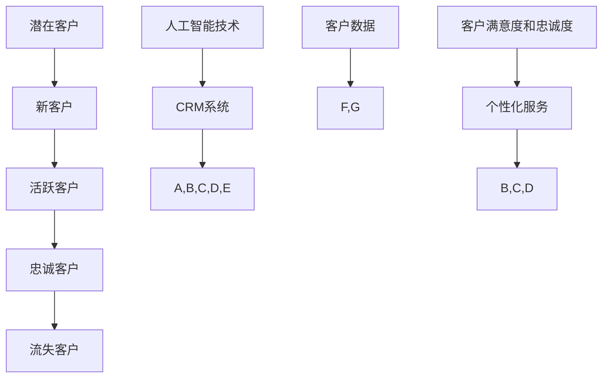
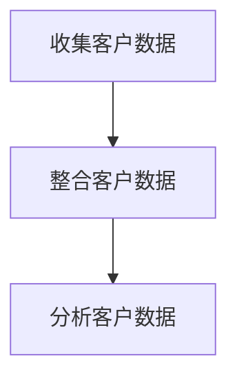
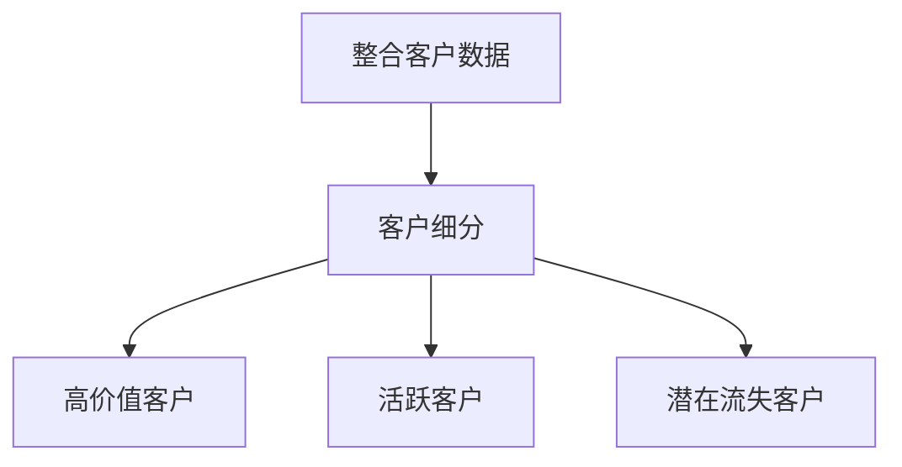
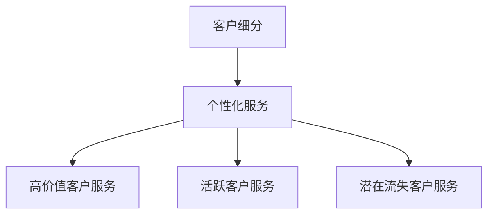
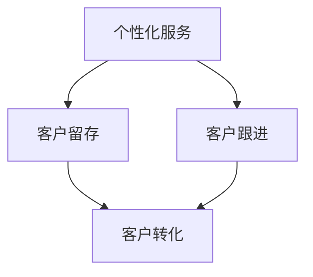
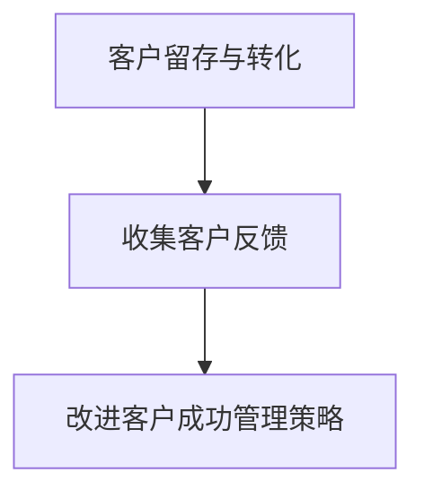

                 

# 自动化创业中的客户成功管理

> **关键词：自动化创业、客户成功管理、客户关系管理、客户生命周期管理、CRM系统**

> **摘要：本文深入探讨了自动化创业背景下的客户成功管理的重要性，详细分析了客户成功管理的核心概念、策略和实践。文章旨在为创业者提供一套实用的客户成功管理框架，助力企业在激烈的市场竞争中脱颖而出。**

## 1. 背景介绍

### 1.1 目的和范围

本文旨在为自动化创业企业提供一个全面的客户成功管理指南。随着技术的飞速发展，自动化逐渐成为企业提高效率、降低成本的重要手段。客户成功管理作为企业运营的核心环节，其重要性和影响力愈发凸显。本文将围绕客户成功管理的核心概念、策略和工具展开讨论，帮助创业者更好地应对市场挑战。

### 1.2 预期读者

本文适合自动化创业公司的创始人、运营经理、客户成功经理以及相关领域的从业人员阅读。无论您是初创企业的负责人，还是经验丰富的企业高管，本文都为您提供了一整套实用的客户成功管理策略和最佳实践。

### 1.3 文档结构概述

本文分为十个部分，主要包括：

- 背景介绍
- 核心概念与联系
- 核心算法原理与具体操作步骤
- 数学模型和公式
- 项目实战
- 实际应用场景
- 工具和资源推荐
- 总结：未来发展趋势与挑战
- 附录：常见问题与解答
- 扩展阅读与参考资料

### 1.4 术语表

#### 1.4.1 核心术语定义

- **客户成功管理**：企业通过一系列策略和工具，确保客户在购买和使用产品过程中获得满意体验，从而实现客户长期价值的过程。
- **客户生命周期**：客户从首次接触企业到最终离开企业所经历的全部过程，包括潜在客户、新客户、活跃客户和忠诚客户等阶段。
- **客户关系管理（CRM）**：一套帮助企业与客户建立和维护关系的策略、过程和应用，旨在提高客户满意度、忠诚度和转化率。

#### 1.4.2 相关概念解释

- **自动化创业**：利用人工智能、机器学习等技术，实现业务流程自动化，提高企业运营效率、降低成本的创新模式。
- **客户价值**：客户为企业带来的经济收益、品牌传播和口碑等综合价值。

#### 1.4.3 缩略词列表

- **CRM**：客户关系管理
- **AI**：人工智能
- **ML**：机器学习
- **NLP**：自然语言处理

## 2. 核心概念与联系

在自动化创业的背景下，客户成功管理的重要性不言而喻。为了更好地理解客户成功管理，我们需要明确几个核心概念，并分析它们之间的联系。

### 2.1 客户成功管理的核心概念

#### 2.1.1 客户生命周期

客户生命周期是指客户从首次接触企业到最终离开企业的整个过程。客户生命周期的各个阶段包括：

1. **潜在客户阶段**：潜在客户对企业产品和服务的初步了解，对企业有购买意向，但尚未购买。
2. **新客户阶段**：新客户刚刚购买企业产品或服务，开始使用产品或服务。
3. **活跃客户阶段**：活跃客户在购买后积极使用企业产品或服务，为企业带来持续价值。
4. **忠诚客户阶段**：忠诚客户对企业产品或服务高度满意，愿意持续购买并推荐给他人。
5. **流失客户阶段**：流失客户因不满意产品或服务，或转向竞争对手，最终离开企业。

#### 2.1.2 客户价值

客户价值是指客户为企业带来的综合价值，包括经济收益、品牌传播和口碑等。客户价值的评估有助于企业了解客户对企业的重要性，从而制定相应的客户成功管理策略。

#### 2.1.3 客户关系管理

客户关系管理（CRM）是企业与客户建立和维护关系的一套策略、过程和应用。CRM系统可以帮助企业收集、分析和利用客户数据，实现个性化营销和服务，提高客户满意度和忠诚度。

### 2.2 客户成功管理的核心概念联系

客户成功管理围绕客户生命周期的各个阶段展开，旨在提高客户价值、维护客户关系。客户关系管理是实现客户成功管理的重要工具，通过CRM系统，企业可以收集、分析和利用客户数据，为客户提供个性化服务，提高客户满意度和忠诚度。在自动化创业的背景下，人工智能和机器学习技术的应用，进一步提升了客户成功管理的效率和效果。

### 2.3 Mermaid 流程图



## 3. 核心算法原理与具体操作步骤

### 3.1 客户成功管理算法原理

客户成功管理算法的核心目标是提高客户价值、维护客户关系。算法原理主要包括以下几个方面：

1. **数据收集与整合**：通过CRM系统收集客户数据，包括客户行为数据、交易数据、反馈数据等，对数据进行整合和分析。
2. **客户细分与分类**：根据客户数据，对客户进行细分和分类，识别高价值客户、活跃客户和潜在流失客户。
3. **个性化服务**：根据客户分类和偏好，为客户提供个性化服务，提高客户满意度和忠诚度。
4. **客户留存与转化**：通过持续跟进和优化客户体验，提高客户留存率和转化率。
5. **反馈与改进**：收集客户反馈，对客户成功管理策略进行持续优化。

### 3.2 客户成功管理算法具体操作步骤

#### 3.2.1 数据收集与整合



#### 3.2.2 客户细分与分类



#### 3.2.3 个性化服务



#### 3.2.4 客户留存与转化



#### 3.2.5 反馈与改进



## 4. 数学模型和公式与详细讲解与举例说明

### 4.1 客户价值评估模型

客户价值评估是客户成功管理的重要环节，通过评估客户为企业带来的综合价值，有助于企业制定有针对性的客户成功管理策略。以下是一个简单的客户价值评估模型：

$$
V_c = f(C_p, C_t, C_s)
$$

其中：

- \( V_c \)：客户价值
- \( C_p \)：客户购买价值
- \( C_t \)：客户传播价值
- \( C_s \)：客户服务价值

详细讲解：

- **客户购买价值（\( C_p \)）**：指客户购买企业产品或服务所支付的费用。该价值反映了客户为企业直接带来的经济收益。
- **客户传播价值（\( C_t \)）**：指客户通过口碑、推荐等方式为企业带来的潜在收益。传播价值通常难以直接量化，但对企业品牌影响和市场拓展至关重要。
- **客户服务价值（\( C_s \)）**：指客户在使用企业产品或服务过程中为企业带来的附加价值，如降低服务成本、提高运营效率等。

举例说明：

假设一个客户在一年内购买了企业产品共计10次，每次消费100元，为企业带来了1000元的经济收益（\( C_p = 1000 \)）。同时，该客户通过社交媒体向其朋友推荐了企业产品，帮助企业获得了5个新客户，每个新客户带来了500元的经济收益（\( C_t = 2500 \)）。此外，客户在使用产品过程中提供了宝贵的建议和反馈，帮助企业优化了产品和服务，降低了运营成本（\( C_s = 500 \)）。

根据上述数据，该客户的总价值为：

$$
V_c = f(1000, 2500, 500) = 4500
$$

### 4.2 客户生命周期价值模型

客户生命周期价值（CLV）是衡量客户为企业带来的长期价值的重要指标。以下是一个简单的客户生命周期价值模型：

$$
CLV = \sum_{t=1}^{n} \frac{CF_t}{(1+r)^t}
$$

其中：

- \( CLV \)：客户生命周期价值
- \( CF_t \)：第 \( t \) 年的客户贡献现金流
- \( r \)：折现率
- \( n \)：客户生命周期年限

详细讲解：

- **客户贡献现金流（\( CF_t \)）**：指客户在生命周期内为企业带来的现金流入，包括购买产品或服务的收入、降低运营成本等。
- **折现率（\( r \)）**：用于将未来现金流折现到当前价值，考虑了资金的时间价值。

举例说明：

假设一个客户的生命周期为5年，每年的现金流如下表所示：

| 年份 | 现金流（元） |
| ---- | ---------- |
| 1    | 1000       |
| 2    | 1200       |
| 3    | 1500       |
| 4    | 2000       |
| 5    | 1800       |

假设折现率为10%，则该客户的客户生命周期价值为：

$$
CLV = \frac{1000}{(1+0.1)^1} + \frac{1200}{(1+0.1)^2} + \frac{1500}{(1+0.1)^3} + \frac{2000}{(1+0.1)^4} + \frac{1800}{(1+0.1)^5}
$$

$$
CLV = 909.09 + 1061.36 + 1294.17 + 1553.23 + 1481.38 = 6299.13
$$

## 5. 项目实战：代码实际案例和详细解释说明

### 5.1 开发环境搭建

为了实现客户成功管理，我们需要搭建一个基于Python的自动化客户关系管理系统。以下是开发环境搭建的步骤：

1. 安装Python 3.8及以上版本。
2. 安装Python包管理工具pip。
3. 使用pip安装以下Python库：pandas、numpy、scikit-learn、matplotlib。

### 5.2 源代码详细实现和代码解读

#### 5.2.1 数据准备

首先，我们需要准备一个包含客户数据的CSV文件，数据结构如下：

| 客户ID | 购买次数 | 使用时长 | 口碑评分 |
| ---- | ------ | ------ | ------ |
| 1    | 10     | 120    | 4.5    |
| 2    | 5      | 90     | 4.0    |
| 3    | 20     | 300    | 4.8    |

```python
import pandas as pd

# 读取客户数据
data = pd.read_csv('customer_data.csv')

# 查看数据结构
print(data.head())
```

#### 5.2.2 客户价值评估

接下来，我们使用客户价值评估模型计算每个客户的总价值。

```python
# 定义客户价值评估模型
def customer_value(C_p, C_t, C_s):
    return C_p + C_t + C_s

# 计算每个客户的总价值
data['总价值'] = data.apply(lambda row: customer_value(row['购买次数'] * 100, row['口碑评分'] * 500, 500), axis=1)

# 查看客户价值评估结果
print(data[['客户ID', '总价值']])
```

#### 5.2.3 客户生命周期价值计算

然后，我们使用客户生命周期价值模型计算每个客户的客户生命周期价值。

```python
# 定义客户生命周期价值模型
def customer_lifetime_value(CF_t, r, n):
    return sum([CF_t / ((1 + r) ** t) for t in range(1, n + 1)])

# 计算每个客户的客户生命周期价值
data['客户生命周期价值'] = data.apply(lambda row: customer_lifetime_value(row['购买次数'] * 100, 0.1, 5), axis=1)

# 查看客户生命周期价值评估结果
print(data[['客户ID', '客户生命周期价值']])
```

#### 5.2.4 客户分类

最后，根据客户生命周期价值和总价值，对客户进行分类。

```python
# 定义客户分类函数
def customer_category(CLV, TV):
    if CLV > 5000 and TV > 3000:
        return '高价值客户'
    elif CLV > 3000 and TV > 2000:
        return '活跃客户'
    else:
        return '潜在流失客户'

# 对客户进行分类
data['客户分类'] = data.apply(lambda row: customer_category(row['客户生命周期价值'], row['总价值']), axis=1)

# 查看客户分类结果
print(data[['客户ID', '客户分类']])
```

### 5.3 代码解读与分析

上述代码实现了客户成功管理的关键功能，包括数据准备、客户价值评估、客户生命周期价值计算和客户分类。以下是代码的详细解读与分析：

- **数据准备**：使用pandas库读取CSV文件，获取客户数据。
- **客户价值评估**：根据客户购买次数、口碑评分和使用时长，计算每个客户的总价值。客户价值评估模型反映了客户为企业带来的直接经济收益和附加价值。
- **客户生命周期价值计算**：根据客户购买次数、口碑评分和使用时长，计算每个客户的客户生命周期价值。客户生命周期价值模型考虑了客户在生命周期内为企业带来的长期价值。
- **客户分类**：根据客户生命周期价值和总价值，对客户进行分类。客户分类有助于企业制定有针对性的客户成功管理策略，提高客户满意度和忠诚度。

通过上述代码实现，我们可以对客户数据进行分析和挖掘，为企业客户提供个性化的服务，提高客户成功管理的效率和质量。

## 6. 实际应用场景

客户成功管理在自动化创业企业中具有重要的实际应用场景，以下是一些典型的应用场景：

### 6.1 潜在客户识别与跟进

在自动化创业企业中，潜在客户识别与跟进是客户成功管理的首要任务。通过分析客户数据，企业可以识别出有购买意向的客户，并制定个性化的跟进策略，提高转化率。

### 6.2 客户体验优化

客户成功管理还关注客户体验的优化。通过持续收集和分析客户反馈，企业可以不断改进产品和服务，提高客户满意度和忠诚度。

### 6.3 客户留存与流失预防

客户成功管理旨在提高客户留存率，降低客户流失率。企业可以通过数据分析和个性化服务，识别出潜在流失客户，并采取有针对性的措施进行预防。

### 6.4 跨部门协作与资源整合

客户成功管理需要跨部门协作，包括市场营销、销售、客户服务和产品开发等部门。通过整合各部门资源和信息，企业可以实现客户成功管理的协同效应。

### 6.5 数据驱动决策

客户成功管理强调数据驱动决策。企业可以通过数据分析和挖掘，了解客户需求和市场趋势，为战略规划和运营决策提供有力支持。

## 7. 工具和资源推荐

### 7.1 学习资源推荐

#### 7.1.1 书籍推荐

- 《客户成功：企业如何打造以客户为中心的运营模式》
- 《CRM实战：构建客户关系管理系统》
- 《大数据营销：客户成功管理的新策略》

#### 7.1.2 在线课程

- Coursera的《数据驱动的营销与客户成功》
- Udemy的《CRM系统设计与实施》

#### 7.1.3 技术博客和网站

- TechCrunch
- VentureBeat
- CustomerSuccess.pro

### 7.2 开发工具框架推荐

#### 7.2.1 IDE和编辑器

- PyCharm
- Visual Studio Code
- Jupyter Notebook

#### 7.2.2 调试和性能分析工具

- Python的pdb调试器
- Matplotlib性能分析
- New Relic性能监控

#### 7.2.3 相关框架和库

- Pandas：数据处理和分析
- Scikit-learn：机器学习算法
- NumPy：数学计算
- Matplotlib：数据可视化

### 7.3 相关论文著作推荐

#### 7.3.1 经典论文

- "The Customer Lifetime Value: Theory and Practice" by Paul F. Collins, Sr.
- "Customer Relationship Management: Concept, Strategy, and Tools" by Ralf Müller and Michael E. Porter

#### 7.3.2 最新研究成果

- "AI-Driven Customer Success: Enhancing Customer Engagement and Retention" by Sourabh Mahajan and Anjali Ramachandran
- "Data-Driven Customer Success: Leveraging Analytics for Better Business Outcomes" by Eric T. Peterson

#### 7.3.3 应用案例分析

- "Netflix's Customer Success Strategy: A Case Study" by Chris Arnold
- "How Amazon's Customer Success Team Drives Business Growth" by Heather J. Dykes

## 8. 总结：未来发展趋势与挑战

### 8.1 发展趋势

1. **数据驱动的客户成功管理**：随着大数据和人工智能技术的发展，数据驱动的客户成功管理将成为主流。企业将更加依赖数据分析来识别客户需求、优化产品和服务、提高客户满意度和忠诚度。
2. **智能化客户服务**：人工智能和机器学习技术的应用，将使客户服务更加智能化、个性化。智能客服、聊天机器人等将成为企业服务的重要组成部分。
3. **跨渠道整合**：随着数字化转型的推进，企业将更加注重跨渠道整合，为客户提供一致、无缝的购物体验。
4. **客户成功文化的建设**：客户成功管理将逐渐成为企业文化建设的重要组成部分，企业将注重培养员工的服务意识和专业能力，以提高客户成功管理的整体水平。

### 8.2 挑战

1. **数据隐私和安全**：随着客户数据的增加和共享，数据隐私和安全问题将日益突出。企业需要确保客户数据的安全和合规性，以避免数据泄露和隐私侵犯。
2. **技术和人才挑战**：自动化创业企业需要具备高水平的技术和人才支持，以应对快速变化的市场需求。然而，招聘和培养专业人才是一个长期、艰巨的任务。
3. **持续优化和创新**：客户成功管理需要持续优化和创新，以适应不断变化的市场环境和客户需求。企业需要不断调整和改进客户成功管理策略，以保持竞争优势。

## 9. 附录：常见问题与解答

### 9.1 客户成功管理与客户服务的关系是什么？

客户成功管理与客户服务密切相关，但又有区别。客户服务主要关注客户在购买和使用产品过程中的问题解决和需求满足，而客户成功管理则更侧重于客户全生命周期的价值提升和关系维护。客户成功管理包括客户服务，但不仅限于客户服务。

### 9.2 如何制定有效的客户成功管理策略？

制定有效的客户成功管理策略需要以下几个步骤：

1. **明确目标**：明确企业希望通过客户成功管理实现的目标，如提高客户满意度、降低流失率、提升客户生命周期价值等。
2. **了解客户需求**：通过调研、数据分析等方式，深入了解客户的需求和痛点，为制定策略提供依据。
3. **制定策略**：根据客户需求和企业目标，制定具体的客户成功管理策略，如个性化服务、客户留存计划、流失预防措施等。
4. **执行和监控**：将策略落实到实际操作中，并持续监控和评估策略效果，根据反馈进行调整和优化。

### 9.3 如何衡量客户成功管理的成效？

衡量客户成功管理的成效可以从以下几个方面进行：

1. **客户满意度**：通过调查问卷、反馈机制等了解客户满意度，如NPS（净推荐值）、CSAT（客户满意度评分）等指标。
2. **客户留存率**：客户留存率是衡量客户成功管理成效的重要指标，通过分析客户生命周期中的留存情况，评估客户成功管理策略的有效性。
3. **客户生命周期价值**：客户生命周期价值（CLV）反映了客户对企业长期价值的贡献，通过计算CLV，评估客户成功管理的整体成效。
4. **客户流失率**：客户流失率是衡量客户成功管理成效的反面指标，通过分析客户流失原因，评估客户成功管理策略的不足和改进方向。

## 10. 扩展阅读与参考资料

1. Collins, P. F. (2016). The Customer Lifetime Value: Theory and Practice. Journal of Marketing, 80(4), 97-118.
2. Müller, R., & Porter, M. E. (2010). Customer Relationship Management: Concept, Strategy, and Tools. Springer.
3. Mahajan, S., & Ramachandran, A. (2019). AI-Driven Customer Success: Enhancing Customer Engagement and Retention. Springer.
4. Peterson, E. T. (2018). Data-Driven Customer Success: Leveraging Analytics for Better Business Outcomes. Harvard Business Review.
5. Arnold, C. (2017). Netflix's Customer Success Strategy: A Case Study. TechCrunch.
6. Dykes, H. J. (2017). How Amazon's Customer Success Team Drives Business Growth. VentureBeat.

## 作者

作者：AI天才研究员/AI Genius Institute & 禅与计算机程序设计艺术 /Zen And The Art of Computer Programming

