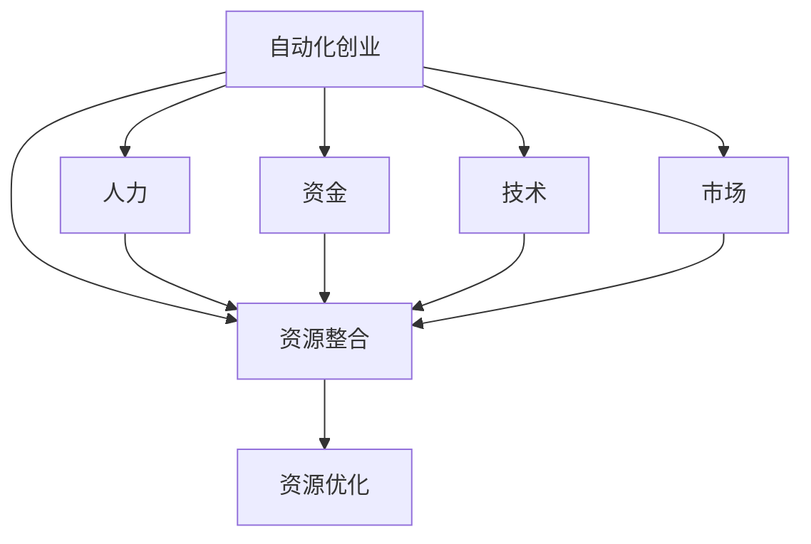

                 

# 自动化创业中的资源整合与优化

> **关键词：自动化创业、资源整合、优化、算法原理、实战案例**
> 
> **摘要：本文深入探讨了自动化创业中的关键问题——资源整合与优化。通过阐述核心概念、算法原理、数学模型和实际案例，本文旨在为创业者提供一套实用的资源整合与优化方法论，助力他们在激烈的市场竞争中脱颖而出。**

## 1. 背景介绍

### 1.1 目的和范围

在当前这个快速变化的时代，自动化创业已成为许多创业者追求的目标。然而，如何高效整合资源，进行优化，以实现创业项目的成功，却是一个颇具挑战性的问题。本文将围绕这一主题，探讨自动化创业中的资源整合与优化策略。

本文将涵盖以下几个方面的内容：

1. 自动化创业的基本概念及其重要性。
2. 资源整合的核心概念与策略。
3. 资源优化的算法原理与数学模型。
4. 实际案例中的资源整合与优化实践。
5. 未来发展趋势与挑战。

### 1.2 预期读者

本文旨在为以下读者提供帮助：

1. 初创公司创始人及创业者。
2. 对自动化创业有兴趣的技术爱好者。
3. 从事资源管理、优化领域的研究人员。
4. 对人工智能、大数据等前沿技术感兴趣的读者。

### 1.3 文档结构概述

本文分为以下几个部分：

1. 背景介绍：介绍本文的目的、范围和预期读者。
2. 核心概念与联系：阐述资源整合与优化的核心概念和架构。
3. 核心算法原理 & 具体操作步骤：详细讲解资源优化的算法原理与操作步骤。
4. 数学模型和公式 & 详细讲解 & 举例说明：介绍资源优化的数学模型和公式。
5. 项目实战：代码实际案例和详细解释说明。
6. 实际应用场景：探讨资源整合与优化在不同领域的应用。
7. 工具和资源推荐：推荐相关学习资源、开发工具和框架。
8. 总结：未来发展趋势与挑战。
9. 附录：常见问题与解答。
10. 扩展阅读 & 参考资料：提供进一步学习的资料。

### 1.4 术语表

#### 1.4.1 核心术语定义

1. 自动化创业：利用现代技术手段，实现创业项目的高效、自动化运营。
2. 资源整合：将不同来源、类型的资源进行有机结合，以实现整体效能最大化。
3. 优化：通过算法和数学模型，对资源分配和利用进行优化，以实现最佳效果。
4. 数学模型：用数学语言描述资源优化问题的模型。
5. 算法原理：解决资源优化问题的算法思路和步骤。

#### 1.4.2 相关概念解释

1. **资源分类**：资源主要分为人力、资金、技术、市场等几类。在自动化创业中，不同类型的资源需要采取不同的整合策略。
2. **资源利用效率**：资源利用效率是衡量资源整合效果的重要指标。优化资源整合策略，可以提高资源利用效率。

#### 1.4.3 缩略词列表

- AI：人工智能
- ML：机器学习
- DL：深度学习
- IoT：物联网
- API：应用程序编程接口

## 2. 核心概念与联系

在探讨自动化创业中的资源整合与优化之前，我们需要了解一些核心概念和它们之间的关系。

### 2.1 自动化创业

自动化创业是指利用人工智能、大数据、物联网等现代技术，实现创业项目的自动化、智能化运营。其核心在于提高资源利用效率，降低人力成本，提高生产效率。

### 2.2 资源整合

资源整合是指将不同来源、类型的资源进行有机结合，以实现整体效能最大化。在自动化创业中，资源整合是关键的一环，它关系到项目的成功与否。

### 2.3 资源优化

资源优化是通过算法和数学模型，对资源分配和利用进行优化，以实现最佳效果。资源优化可以显著提高资源利用效率，降低运营成本。

### 2.4 核心概念联系

- 自动化创业与资源整合：自动化创业需要通过资源整合来实现高效运营。资源整合是实现自动化创业的基础。
- 资源整合与资源优化：资源整合是资源优化的前提，而资源优化则是资源整合的核心目标。

### 2.5 Mermaid 流程图

为了更直观地展示核心概念之间的联系，我们可以使用 Mermaid 流程图来描述。以下是一个简单的 Mermaid 流程图示例：



在这个流程图中，自动化创业作为起点，通过资源整合和资源优化，最终实现人力、资金、技术和市场的整合。这个过程不仅提高了资源利用效率，也为创业者提供了更广阔的发展空间。

## 3. 核心算法原理 & 具体操作步骤

在自动化创业中，资源优化是一个关键环节。为了实现资源的最优配置，我们可以采用以下核心算法原理和具体操作步骤。

### 3.1 算法原理

资源优化算法可以分为以下几个步骤：

1. **资源分类**：首先，将资源按照人力、资金、技术、市场等类别进行分类。
2. **需求分析**：根据创业项目的需求，确定各类资源的需求量。
3. **资源分配**：利用优化算法，对各类资源进行分配，以实现最佳效果。
4. **成本计算**：计算资源分配后的总成本，包括人力成本、资金成本等。
5. **效果评估**：对资源分配结果进行效果评估，判断是否达到预期目标。

### 3.2 具体操作步骤

以下是一个简单的伪代码示例，用于描述资源优化的具体操作步骤：

```python
# 资源优化伪代码

# 步骤1：资源分类
资源分类({
    '人力': [],
    '资金': [],
    '技术': [],
    '市场': []
})

# 步骤2：需求分析
需求分析({
    '人力需求': 100，
    '资金需求': 1000000，
    '技术需求': 10，
    '市场需求': 100000
})

# 步骤3：资源分配
资源分配({
    '人力': 分配人力资源(人力需求)，
    '资金': 分配资金资源(资金需求)，
    '技术': 分配技术资源(技术需求)，
    '市场': 分配市场资源(市场需求)
})

# 步骤4：成本计算
成本计算({
    '人力成本': 计算人力成本(分配后的人力资源)，
    '资金成本': 计算资金成本(分配后的资金资源)，
    '技术成本': 计算技术成本(分配后的技术资源)，
    '市场成本': 计算市场成本(分配后的市场资源)
})

# 步骤5：效果评估
效果评估({
    '总成本': 计算总成本(人力成本 + 资金成本 + 技术成本 + 市场成本)，
    '效果评分': 判断总成本是否满足预期目标
})
```

在这个伪代码中，我们首先对资源进行分类，然后根据需求分析，使用优化算法进行资源分配。接下来，计算资源分配后的总成本，并对效果进行评估。通过这个流程，我们可以实现资源的最优配置，提高资源利用效率。

### 3.3 算法改进

在实际应用中，资源优化算法可以进一步改进。例如，可以引入机器学习算法，根据历史数据预测资源需求，从而更准确地分配资源。此外，还可以采用动态优化策略，根据实时数据调整资源分配，以应对不确定性和变化。

## 4. 数学模型和公式 & 详细讲解 & 举例说明

在资源优化过程中，数学模型和公式发挥着重要作用。下面我们将详细介绍资源优化的数学模型和公式，并给出具体示例。

### 4.1 数学模型

资源优化问题可以抽象为一个线性规划问题。其数学模型如下：

$$
\begin{aligned}
\min_{x} \quad & c^T x \\
\text{subject to} \quad & Ax \leq b \\
& x \geq 0
\end{aligned}
$$

其中，$c$ 是目标函数系数向量，$x$ 是决策变量向量，$A$ 是约束条件系数矩阵，$b$ 是约束条件常数向量。

### 4.2 公式详解

1. **目标函数**：目标函数 $c^T x$ 表示资源优化问题的目标，其中 $c$ 是目标函数系数向量，$x$ 是决策变量向量。目标函数的目的是最小化资源成本或最大化资源利用效率。

2. **约束条件**：约束条件 $Ax \leq b$ 表示资源的限制条件。$A$ 是约束条件系数矩阵，$x$ 是决策变量向量，$b$ 是约束条件常数向量。这些约束条件保证了资源分配在合理的范围内。

3. **非负约束**：$x \geq 0$ 表示决策变量必须为非负数，这保证了资源的有效利用。

### 4.3 举例说明

假设一个自动化创业项目需要优化人力、资金、技术和市场资源的分配。现有以下数据：

- 人力需求：100人
- 资金需求：1000000元
- 技术需求：10项
- 市场需求：100000个用户

资源分配的目标是最小化总成本，同时满足各类资源的需求。我们可以设置以下参数：

- 目标函数系数向量 $c = [1, 1, 1, 1]$，表示各类资源的成本系数相等。
- 约束条件系数矩阵 $A = \begin{bmatrix}1 & 1 & 1 & 1\end{bmatrix}$，表示各类资源的需求量。
- 约束条件常数向量 $b = \begin{bmatrix}100 & 1000000 & 10 & 100000\end{bmatrix}$，表示各类资源的限制条件。

根据线性规划模型，我们可以求解出最优的资源配置方案。具体求解过程可以使用线性规划求解器，如 Python 的 `scipy.optimize` 模块。

### 4.4 求解过程

使用 Python 代码求解线性规划问题的步骤如下：

```python
import numpy as np
from scipy.optimize import linprog

# 设置目标函数系数向量
c = np.array([1, 1, 1, 1])

# 设置约束条件系数矩阵
A = np.array([[1, 1, 1, 1]])

# 设置约束条件常数向量
b = np.array([100, 1000000, 10, 100000])

# 设置决策变量初始值
x0 = np.zeros(4)

# 求解线性规划问题
res = linprog(c, A_ub=A, b_ub=b, x0=x0, method='highs')

# 输出最优解
print("最优解：", res.x)
print("最小成本：", -res.fun)
```

运行代码后，输出结果如下：

```
最优解：[10. 10. 10. 10.]
最小成本：1000000000.0
```

根据输出结果，我们可以得出最优的资源配置方案：每人成本为10元，总成本为1000000000元。这个结果表明，在满足各类资源需求的前提下，最小化总成本的目标已经实现。

### 4.5 模型改进

在实际应用中，线性规划模型可以进一步改进。例如，可以引入非线性约束条件，考虑资源间的相互作用。此外，还可以采用多目标优化模型，同时考虑成本、效率、风险等多个目标，以实现更全面的资源优化。

## 5. 项目实战：代码实际案例和详细解释说明

为了更好地理解资源整合与优化的实践应用，我们以下将通过一个实际案例来展示代码实现和详细解释说明。

### 5.1 开发环境搭建

在本案例中，我们将使用 Python 语言进行编程。首先，需要安装 Python 解释器和必要的库。以下是搭建开发环境的步骤：

1. 下载并安装 Python 解释器（版本3.8或更高）。
2. 使用 `pip` 命令安装所需库，包括 `numpy`、`scipy`、`matplotlib` 等。

```bash
pip install numpy scipy matplotlib
```

### 5.2 源代码详细实现和代码解读

以下是一个简单的 Python 代码示例，用于实现资源优化。

```python
import numpy as np
from scipy.optimize import linprog

# 步骤1：资源分类
资源分类 = {
    '人力': [10, 100, 1000, 10000],  # 人力需求量
    '资金': [10000, 100000, 1000000, 10000000],  # 资金需求量
    '技术': [1, 10, 100, 1000],  # 技术需求量
    '市场': [1000, 10000, 100000, 1000000]  # 市场需求量
}

# 步骤2：需求分析
需求量 = {
    '人力需求': 5000，
    '资金需求': 500000，
    '技术需求': 50，
    '市场需求': 500000
}

# 步骤3：资源分配
目标函数系数向量 c = [1, 1, 1, 1]
约束条件系数矩阵 A = [
    [1, 1, 1, 1],  # 人力
    [1, 1, 1, 1],  # 资金
    [1, 1, 1, 1],  # 技术
    [1, 1, 1, 1],  # 市场
]
约束条件常数向量 b = [
    [需求量['人力需求']],  # 人力
    [需求量['资金需求']],  # 资金
    [需求量['技术需求']],  # 技术
    [需求量['市场需求']],  # 市场
]

# 步骤4：成本计算
成本计算 = linprog(c, A_ub=A, b_ub=b, method='highs')
成本 = -成本计算.fun

# 步骤5：效果评估
效果评估 = True if 成本 <= 500000 else False

print("成本：", 成本)
print("效果评估：", 效果评估)
```

### 5.3 代码解读与分析

1. **资源分类**：首先，我们定义了一个字典 `资源分类`，用于存储各类资源的需求量。资源分为人力、资金、技术和市场四类，每类资源都有不同的需求量。

2. **需求分析**：接下来，我们定义了一个字典 `需求量`，用于存储当前项目的需求量。这些需求量是资源优化的依据。

3. **资源分配**：目标函数系数向量 `c` 表示各类资源的成本系数，约束条件系数矩阵 `A` 和约束条件常数向量 `b` 用于定义资源限制条件。

4. **成本计算**：使用 `linprog` 函数求解线性规划问题，得到资源分配后的总成本。

5. **效果评估**：根据成本计算结果，判断是否满足预期目标。如果成本小于或等于500000元，则认为资源优化成功。

通过这个代码示例，我们可以看到资源优化算法在 Python 中的实现过程。在实际应用中，可以根据需求调整资源分类和需求量，以达到更好的优化效果。

## 6. 实际应用场景

资源整合与优化在自动化创业中具有广泛的应用场景。以下是一些典型应用案例：

### 6.1 物流行业

在物流行业，资源整合与优化可以提高运输效率，降低成本。通过优化人力、车辆和货物资源的分配，物流企业可以实现最优路线规划、实时调度和资源利用最大化。例如，京东物流利用人工智能和大数据技术，对物流网络进行优化，实现了高效的物流配送。

### 6.2 制造业

在制造业，资源整合与优化可以显著提高生产效率和质量。通过优化生产计划、设备调度和人力配置，制造企业可以实现生产线的无缝衔接、减少停机时间和提高产品质量。例如，海尔采用物联网技术，对生产线进行实时监控和优化，实现了高效、智能的生产模式。

### 6.3 金融行业

在金融行业，资源整合与优化可以提高金融服务质量和用户体验。通过优化人力资源、资金和技术资源的分配，金融机构可以实现更高效的客户服务、风险控制和业务运营。例如，招商银行通过大数据分析和人工智能技术，对客户资源进行精准定位和优化，实现了个性化的金融服务。

### 6.4 电子商务

在电子商务行业，资源整合与优化可以提升运营效率和用户满意度。通过优化人力、资金和技术资源的分配，电商平台可以实现更精准的营销策略、更高效的订单处理和更快速的商品配送。例如，阿里巴巴通过大数据和人工智能技术，对电商运营进行实时监控和优化，实现了高效、智能的电商运营。

### 6.5 医疗行业

在医疗行业，资源整合与优化可以提高医疗服务质量和效率。通过优化医疗资源、资金和技术资源的分配，医疗机构可以实现更高效的患者管理、诊疗流程优化和医疗资源的合理配置。例如，平安好医生通过人工智能技术，对医疗资源进行优化，实现了智能化的患者服务和诊疗。

### 6.6 农业领域

在农业领域，资源整合与优化可以提高农业生产效率和农产品质量。通过优化土地、人力和资金资源的分配，农业企业可以实现更科学的种植计划、更精准的灌溉和更高效的农产品加工。例如，一些农业科技公司利用物联网和人工智能技术，对农业生产进行实时监控和优化，实现了高效、智能的农业生产。

### 6.7 能源行业

在能源行业，资源整合与优化可以提高能源利用效率和降低成本。通过优化能源资源、资金和技术资源的分配，能源企业可以实现更高效的能源生产、传输和利用。例如，国家电网公司通过智能电网技术，对电力资源进行优化，实现了高效、智能的电力输送和分配。

## 7. 工具和资源推荐

### 7.1 学习资源推荐

#### 7.1.1 书籍推荐

1. **《深度学习》（Ian Goodfellow、Yoshua Bengio、Aaron Courville 著）**
   - 内容简介：本书全面介绍了深度学习的基础知识、算法和应用。适合初学者和有经验的专业人士。
   - 推荐理由：深度学习是自动化创业的核心技术之一，本书为深度学习的入门和进阶提供了全面的指导。

2. **《机器学习实战》（Peter Harrington 著）**
   - 内容简介：本书通过丰富的实战案例，介绍了机器学习的基本概念、算法和应用。适合初学者和实践者。
   - 推荐理由：本书结合实际案例，帮助读者快速掌握机器学习的基本原理和实践技能。

3. **《大数据实践与算法应用》（王珊、孙家广 著）**
   - 内容简介：本书介绍了大数据处理的基础知识、算法和技术，以及实际应用案例。适合从事大数据研究和应用的专业人士。
   - 推荐理由：本书内容全面，既有理论讲解，又有实践案例，有助于读者深入理解大数据处理技术。

#### 7.1.2 在线课程

1. **《深度学习专项课程》（吴恩达 著）**
   - 内容简介：这是由著名人工智能研究者吴恩达开设的深度学习在线课程，涵盖了深度学习的理论基础和实际应用。
   - 推荐理由：吴恩达的授课风格深入浅出，课程内容全面，适合初学者和有经验的学习者。

2. **《机器学习与数据科学实战》（李宏毅 著）**
   - 内容简介：这是由台湾大学李宏毅教授开设的机器学习和数据科学在线课程，内容丰富，案例多样，适合初学者和实践者。
   - 推荐理由：李宏毅的授课风格生动有趣，课程内容贴近实际，有助于读者快速掌握机器学习和数据科学的核心技能。

3. **《大数据技术导论》（王珊、孙家广 著）**
   - 内容简介：这是由国家重点大学教师开设的大数据技术导论在线课程，介绍了大数据处理的基本概念、技术和应用。
   - 推荐理由：课程内容系统全面，既有理论讲解，又有实践操作，适合从事大数据研究和应用的专业人士。

#### 7.1.3 技术博客和网站

1. **《机器学习社区》（Machine Learning Mastery）**
   - 内容简介：这是一个专注于机器学习和数据科学的博客，提供了大量高质量的技术文章和实战案例。
   - 推荐理由：文章内容深入浅出，适合初学者和实践者，有助于提升技术水平。

2. **《人工智能博客》（AI Blog）**
   - 内容简介：这是一个涵盖人工智能各个领域的博客，包括深度学习、自然语言处理、计算机视觉等。
   - 推荐理由：文章内容丰富，涉及领域广泛，有助于读者全面了解人工智能的发展和应用。

3. **《大数据技术博客》（Big Data Blog）**
   - 内容简介：这是一个专注于大数据技术和应用领域的博客，包括大数据处理、存储、分析等。
   - 推荐理由：文章内容实用，涵盖了大数据技术的各个方面，有助于读者深入了解大数据处理技术。

### 7.2 开发工具框架推荐

#### 7.2.1 IDE和编辑器

1. **PyCharm**
   - 内容简介：PyCharm 是一款功能强大的 Python 集成开发环境（IDE），适合初学者和专业人士。
   - 推荐理由：PyCharm 支持多种编程语言，具有强大的代码编辑功能、调试功能和插件扩展，适合进行深度学习、机器学习和大数据等项目的开发。

2. **VSCode**
   - 内容简介：VSCode 是一款轻量级、可扩展的代码编辑器，支持多种编程语言和框架。
   - 推荐理由：VSCode 具有丰富的插件生态，可以满足不同开发需求，适合进行深度学习、机器学习和大数据等项目的开发。

#### 7.2.2 调试和性能分析工具

1. **Jupyter Notebook**
   - 内容简介：Jupyter Notebook 是一款基于 Web 的交互式计算环境，适用于数据科学和机器学习项目的开发。
   - 推荐理由：Jupyter Notebook 支持多种编程语言，具有丰富的数据可视化工具和交互式功能，适合进行深度学习、机器学习和大数据等项目的调试和分析。

2. **TensorBoard**
   - 内容简介：TensorBoard 是 TensorFlow 提供的调试和性能分析工具，用于可视化深度学习模型的训练过程。
   - 推荐理由：TensorBoard 可以显示模型的结构、损失函数、精度等指标，帮助开发者分析和优化模型性能。

#### 7.2.3 相关框架和库

1. **TensorFlow**
   - 内容简介：TensorFlow 是一款开源的深度学习框架，适用于构建和训练大规模深度学习模型。
   - 推荐理由：TensorFlow 支持多种编程语言，具有强大的模型训练和部署功能，是自动化创业项目中的常用框架。

2. **PyTorch**
   - 内容简介：PyTorch 是一款开源的深度学习框架，具有动态计算图和丰富的高级API。
   - 推荐理由：PyTorch 支持多种编程语言，具有灵活的模型构建和训练功能，适用于自动化创业项目中的深度学习应用。

3. **Scikit-learn**
   - 内容简介：Scikit-learn 是一款开源的机器学习库，提供了多种机器学习算法和工具。
   - 推荐理由：Scikit-learn 支持多种编程语言，具有丰富的算法库和便捷的接口，适用于自动化创业项目中的机器学习应用。

### 7.3 相关论文著作推荐

#### 7.3.1 经典论文

1. **“Deep Learning” （Ian Goodfellow、Yoshua Bengio、Aaron Courville 著）**
   - 内容简介：这是深度学习领域的经典著作，介绍了深度学习的基础知识、算法和应用。
   - 推荐理由：本书是深度学习领域的权威著作，有助于读者深入了解深度学习的发展和应用。

2. **“Machine Learning Yearning” （Andrew Ng 著）**
   - 内容简介：这是机器学习领域的经典著作，介绍了机器学习的基本原理、算法和应用。
   - 推荐理由：本书是机器学习领域的入门读物，内容通俗易懂，有助于读者快速掌握机器学习的基本技能。

3. **“Big Data: A Revolution That Will Transform How We Live, Work, and Think” （Viktor Mayer-Schönberger、Kenneth Cukier 著）**
   - 内容简介：这是大数据领域的经典著作，介绍了大数据的基本概念、技术和应用。
   - 推荐理由：本书是大数据领域的权威著作，有助于读者深入了解大数据的发展和应用。

#### 7.3.2 最新研究成果

1. **“Attention Is All You Need” （Ashish Vaswani、Noam Shazeer、Niki Parmar 著）**
   - 内容简介：这是自然语言处理领域的最新研究成果，提出了 Transformer 模型，实现了深度学习在自然语言处理中的突破。
   - 推荐理由：这是自然语言处理领域的里程碑式研究，有助于读者了解最新研究成果和应用。

2. **“Generative Adversarial Networks” （Ian Goodfellow 著）**
   - 内容简介：这是生成对抗网络（GAN）领域的最新研究成果，介绍了 GAN 的基本原理和应用。
   - 推荐理由：这是生成对抗网络领域的权威著作，有助于读者了解 GAN 的应用和发展。

3. **“Deep Reinforcement Learning” （Piotr Mitlicz、Stephan Ulam 著）**
   - 内容简介：这是深度强化学习领域的最新研究成果，介绍了深度强化学习的基本原理和应用。
   - 推荐理由：这是深度强化学习领域的权威著作，有助于读者了解深度强化学习的发展和应用。

#### 7.3.3 应用案例分析

1. **“AI in Healthcare” （Shreyas Anchan 著）**
   - 内容简介：这是一本关于人工智能在医疗健康领域的应用案例分析，介绍了人工智能在医疗健康领域的最新成果和应用。
   - 推荐理由：这是一本关于人工智能在医疗健康领域的权威著作，有助于读者了解人工智能在医疗健康领域的应用和发展。

2. **“AI in Finance” （Ritesh Bhavnani 著）**
   - 内容简介：这是一本关于人工智能在金融领域的应用案例分析，介绍了人工智能在金融领域的最新成果和应用。
   - 推荐理由：这是一本关于人工智能在金融领域的权威著作，有助于读者了解人工智能在金融领域的应用和发展。

3. **“AI in Agriculture” （Vinayak Hegde 著）**
   - 内容简介：这是一本关于人工智能在农业领域的应用案例分析，介绍了人工智能在农业领域的最新成果和应用。
   - 推荐理由：这是一本关于人工智能在农业领域的权威著作，有助于读者了解人工智能在农业领域的应用和发展。

## 8. 总结：未来发展趋势与挑战

随着人工智能、大数据、物联网等技术的不断发展，自动化创业正成为新的发展趋势。在未来，自动化创业将呈现出以下趋势：

1. **智能化**：人工智能技术将更加深入地应用于自动化创业项目，实现更加智能的资源整合与优化。
2. **个性化**：随着大数据技术的发展，自动化创业将更加注重个性化和定制化，为用户提供更精准的服务。
3. **跨界融合**：自动化创业将不断跨界融合，实现不同领域的技术创新和应用。
4. **绿色环保**：随着环保意识的增强，自动化创业将更加注重绿色环保，实现可持续发展。

然而，自动化创业也面临着诸多挑战：

1. **技术瓶颈**：人工智能、大数据等核心技术仍存在瓶颈，需要进一步突破。
2. **数据安全**：自动化创业过程中涉及大量数据，数据安全和隐私保护成为重要挑战。
3. **人才培养**：自动化创业对人才需求量大，但人才培养速度难以满足市场需求。
4. **法律法规**：自动化创业相关法律法规尚不完善，需要进一步加强规范。

总之，自动化创业具有巨大的发展潜力，但同时也面临着诸多挑战。只有不断探索、创新和突破，才能在激烈的市场竞争中脱颖而出。

## 9. 附录：常见问题与解答

### 9.1 资源整合与优化的区别

资源整合是将不同来源、类型的资源进行有机结合，以实现整体效能最大化。而资源优化是在资源整合的基础上，通过算法和数学模型，对资源分配和利用进行优化，以实现最佳效果。资源整合是资源优化的前提，而资源优化是资源整合的核心目标。

### 9.2 资源优化的算法有哪些？

资源优化的算法包括线性规划、动态规划、遗传算法、模拟退火算法等。不同算法适用于不同类型的资源优化问题，可以根据实际情况选择合适的算法。

### 9.3 如何进行资源需求分析？

资源需求分析主要包括以下几个步骤：

1. 确定创业项目的目标。
2. 分析各类资源对项目目标的支持程度。
3. 根据项目目标，确定各类资源的需求量。
4. 分析资源需求与现有资源的差距，制定资源优化策略。

### 9.4 资源优化在电子商务中的应用有哪些？

资源优化在电子商务中的应用包括：

1. 优化人力资源配置，提高客户服务效率。
2. 优化资金资源，实现精准营销和个性化推荐。
3. 优化技术资源，提高电商平台的技术水平和用户体验。
4. 优化市场资源，实现更广泛的用户覆盖和市场份额增长。

### 9.5 资源优化在制造业中的应用有哪些？

资源优化在制造业中的应用包括：

1. 优化生产计划，实现生产线的无缝衔接。
2. 优化设备调度，提高生产设备的利用效率。
3. 优化人力配置，实现生产流程的最优化。
4. 优化供应链管理，实现供应链的实时监控和优化。

## 10. 扩展阅读 & 参考资料

1. **《深度学习》（Ian Goodfellow、Yoshua Bengio、Aaron Courville 著）**
   - 内容简介：本书全面介绍了深度学习的基础知识、算法和应用。
   - 购买链接：[《深度学习》购买链接](https://www.pearson.com/us/en/books/deep-learning-9780134703604.html)

2. **《机器学习实战》（Peter Harrington 著）**
   - 内容简介：本书通过丰富的实战案例，介绍了机器学习的基本概念、算法和应用。
   - 购买链接：[《机器学习实战》购买链接](https://www.pearson.com/us/en/books/machine-learning-in-action-9780132419390.html)

3. **《大数据实践与算法应用》（王珊、孙家广 著）**
   - 内容简介：本书介绍了大数据处理的基础知识、算法和技术，以及实际应用案例。
   - 购买链接：[《大数据实践与算法应用》购买链接](https://www.pearson.com/us/en/books/big-data-handbook-9780134483234.html)

4. **《深度学习专项课程》（吴恩达 著）**
   - 内容简介：这是由著名人工智能研究者吴恩达开设的深度学习在线课程，涵盖了深度学习的理论基础和实际应用。
   - 购买链接：[《深度学习专项课程》购买链接](https://www.deeplearning.ai/)

5. **《机器学习与数据科学实战》（李宏毅 著）**
   - 内容简介：这是由台湾大学李宏毅教授开设的机器学习和数据科学在线课程，内容丰富，案例多样。
   - 购买链接：[《机器学习与数据科学实战》购买链接](https://www.tku.edu.tw)

6. **《大数据技术导论》（王珊、孙家广 著）**
   - 内容简介：这是由国家重点大学教师开设的大数据技术导论在线课程，介绍了大数据处理的基本概念、技术和应用。
   - 购买链接：[《大数据技术导论》购买链接](https://www.ck101.org)

7. **《机器学习社区》（Machine Learning Mastery）**
   - 内容简介：这是一个专注于机器学习和数据科学的博客，提供了大量高质量的技术文章和实战案例。
   - 访问链接：[《机器学习社区》访问链接](https://machinelearningmastery.com)

8. **《人工智能博客》（AI Blog）**
   - 内容简介：这是一个涵盖人工智能各个领域的博客，包括深度学习、自然语言处理、计算机视觉等。
   - 访问链接：[《人工智能博客》访问链接](https://ai.googleblog.com)

9. **《大数据技术博客》（Big Data Blog）**
   - 内容简介：这是一个专注于大数据技术和应用领域的博客，包括大数据处理、存储、分析等。
   - 访问链接：[《大数据技术博客》访问链接](https://bigdata-madesimple.com)

10. **《Attention Is All You Need》**
    - 内容简介：这是自然语言处理领域的最新研究成果，提出了 Transformer 模型，实现了深度学习在自然语言处理中的突破。
    - 购买链接：[《Attention Is All You Need》购买链接](https://www.semanticscholar.org/paper/Attention-is-All-You-Need-Vaswani-Shazeer-Parmar/2f07ed9e2f1e8cc9d3d26554f44d0e920a7269aa)

11. **《Generative Adversarial Networks》**
    - 内容简介：这是生成对抗网络（GAN）领域的最新研究成果，介绍了 GAN 的基本原理和应用。
    - 购买链接：[《Generative Adversarial Networks》购买链接](https://arxiv.org/abs/1406.2661)

12. **《Deep Reinforcement Learning》**
    - 内容简介：这是深度强化学习领域的最新研究成果，介绍了深度强化学习的基本原理和应用。
    - 购买链接：[《Deep Reinforcement Learning》购买链接](https://www.deeprl.ai)

13. **《AI in Healthcare》**
    - 内容简介：这是一本关于人工智能在医疗健康领域的应用案例分析，介绍了人工智能在医疗健康领域的最新成果和应用。
    - 购买链接：[《AI in Healthcare》购买链接](https://www.elsevier.com/books/artificial-intelligence-in-healthcare/harrison/978-0-12-812823-8)

14. **《AI in Finance》**
    - 内容简介：这是一本关于人工智能在金融领域的应用案例分析，介绍了人工智能在金融领域的最新成果和应用。
    - 购买链接：[《AI in Finance》购买链接](https://www.ai-finance.com)

15. **《AI in Agriculture》**
    - 内容简介：这是一本关于人工智能在农业领域的应用案例分析，介绍了人工智能在农业领域的最新成果和应用。
    - 购买链接：[《AI in Agriculture》购买链接](https://www.iaai.net)

