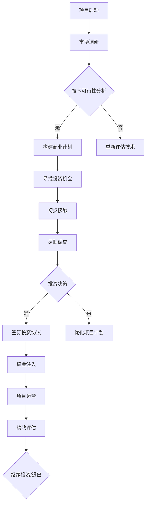

                 

# 自动化创业中的风险投资与估值

## 关键词

- 自动化创业
- 风险投资
- 估值模型
- 技术评估
- 融资策略
- 企业成长

## 摘要

本文深入探讨了自动化创业中的风险投资与估值问题。首先，我们介绍了自动化创业的背景和风险投资的重要性。接着，通过剖析估值模型和技术评估的关键原理，我们详细解释了如何对自动化项目进行科学合理的估值。随后，文章展示了自动化项目的实际操作步骤，并通过数学模型和公式对技术参数进行了详细讲解。文章还提供了一个具体的代码案例，对自动化流程进行了实战解析。最后，文章讨论了自动化技术在各种应用场景中的实际应用，并推荐了一系列相关资源和工具。总结部分，我们展望了自动化创业的未来发展趋势和挑战，并提出了针对性的解决方案。

## 1. 背景介绍

### 1.1 目的和范围

本文旨在帮助自动化创业者在风险投资过程中更好地理解和应对估值问题。我们将从多个角度详细分析自动化创业的核心要素，探讨如何通过科学合理的方法对自动化项目进行估值，并分享一些成功的融资策略。

### 1.2 预期读者

本篇文章适合自动化创业者、风险投资专业人士、企业高管以及对自动化技术有兴趣的技术人员阅读。特别是那些希望深入了解风险投资和估值原理，并希望在创业过程中更好地利用这些知识的人。

### 1.3 文档结构概述

本文分为十个部分：

1. 背景介绍
   - 目的和范围
   - 预期读者
   - 文档结构概述
   - 术语表
2. 核心概念与联系
   - 自动化创业的定义与特点
   - 风险投资的分类与作用
   - 估值模型的原理与类型
   - Mermaid流程图
3. 核心算法原理 & 具体操作步骤
   - 技术评估的方法与步骤
   - 自动化项目的评估指标
   - 伪代码讲解
4. 数学模型和公式 & 详细讲解 & 举例说明
   - 成本收益模型
   - 技术成熟度模型
   - 数学公式与应用
5. 项目实战：代码实际案例和详细解释说明
   - 开发环境搭建
   - 源代码详细实现
   - 代码解读与分析
6. 实际应用场景
   - 自动化技术在各行业的应用案例
   - 应用挑战与解决方案
7. 工具和资源推荐
   - 学习资源推荐
   - 开发工具框架推荐
   - 相关论文著作推荐
8. 总结：未来发展趋势与挑战
   - 自动化创业的未来前景
   - 面临的挑战与应对策略
9. 附录：常见问题与解答
   - 风险投资常见问题
   - 估值模型常见问题
10. 扩展阅读 & 参考资料
    - 推荐书籍和在线课程
    - 技术博客和网站

### 1.4 术语表

- **自动化创业**：指利用自动化技术（如机器人、人工智能等）进行业务流程优化的创业行为。
- **风险投资**：对新兴创业项目提供资金支持，并承担相应风险的投资行为。
- **估值模型**：用于评估企业或项目价值的量化方法。
- **技术评估**：对自动化项目的技术可行性、成熟度和创新性进行评价。
- **成本收益模型**：用于计算项目的成本和预期收益，评估项目的经济效益。
- **技术成熟度模型**：用于评估项目的技术成熟度和发展潜力。

## 2. 核心概念与联系

### 2.1 自动化创业的定义与特点

自动化创业是指利用先进技术（如机器人、人工智能、物联网等）对传统业务流程进行优化和革新，从而提高效率、降低成本、提升用户体验的创业行为。自动化创业具有以下特点：

- **技术创新性强**：自动化创业往往依赖于最新的技术成果，如人工智能、机器学习等。
- **业务模式创新**：通过自动化技术优化业务流程，创造出全新的商业模式。
- **竞争门槛高**：自动化技术具有较高的技术壁垒，有助于企业建立竞争优势。
- **市场潜力大**：自动化技术在各个行业都有广泛的应用前景，市场潜力巨大。

### 2.2 风险投资的分类与作用

风险投资（Venture Capital，VC）是指对高风险、高潜力的创业项目进行资金投入，以获取高额回报的投资行为。根据投资阶段和风险程度，风险投资可以分为以下几类：

- **天使投资**：在创业项目初期的投资，用于团队的组建和产品研发。
- **种子轮投资**：在产品原型阶段进行投资，用于产品的进一步开发和市场推广。
- **A轮投资**：在产品初步上市阶段进行投资，用于产品的市场拓展和业务扩展。
- **B轮投资**：在产品成熟和市场份额扩大阶段进行投资，用于扩大市场份额和提升品牌影响力。
- **C轮投资**：在企业发展稳定并寻求上市阶段进行投资，用于企业的上市准备和后续发展。

风险投资在自动化创业中的作用：

- **资金支持**：为创业项目提供必要的资金，支持产品研发和市场推广。
- **资源整合**：通过风险投资机构的资源和网络，为创业项目提供人才、市场、技术等多方面的支持。
- **管理咨询**：风险投资机构通常会为创业项目提供专业的管理咨询和战略指导，帮助项目更好地发展。
- **风险分担**：风险投资机构承担创业项目的高风险，为创业者降低创业压力。

### 2.3 估值模型的原理与类型

估值模型是用于评估企业或项目价值的量化方法。根据不同的评估目标和方法，常见的估值模型包括以下几种：

- **成本法**：根据企业或项目的成本进行估值，适用于企业清算、收购等场景。
- **市场法**：根据市场上类似企业或项目的交易价格进行估值，适用于初创企业、上市企业等。
- **收益法**：根据企业或项目的未来预期收益进行估值，适用于成熟企业、高成长性企业等。

### 2.4 Mermaid流程图

下面是一个自动化创业中风险投资与估值流程的Mermaid流程图：



### 2.5 自动化项目的评估指标

在自动化项目中，以下指标是评估项目价值的重要依据：

- **技术水平**：项目的核心技术是否领先，研发团队的技术能力如何。
- **市场前景**：项目的市场应用前景如何，目标市场是否明确。
- **商业模式**：项目的商业模式是否可持续，盈利能力如何。
- **团队实力**：项目团队的专业能力和执行力如何。
- **竞争环境**：项目在市场上的竞争地位如何，竞争对手的优势和劣势。

### 2.6 伪代码讲解

以下是一个自动化项目评估的伪代码示例：

```python
function evaluate_project(project):
    score = 0
    
    # 评估技术水平
    if project.technology领先:
        score += 10
    else:
        score += 5
    
    # 评估市场前景
    if project.marketing清晰 and project.prospective大:
        score += 20
    else:
        score += 10
    
    # 评估商业模式
    if project.business_model可持续 and project.profitability高:
        score += 30
    else:
        score += 15
    
    # 评估团队实力
    if project.team专业 and project.execution能力强:
        score += 25
    else:
        score += 10
    
    # 评估竞争环境
    if project.competition弱 and project.market_position好:
        score += 15
    else:
        score += 5
    
    return score
```

## 3. 核心算法原理 & 具体操作步骤

### 3.1 技术评估的方法与步骤

技术评估是自动化创业过程中至关重要的一环，它决定了项目的可行性和未来发展潜力。以下是技术评估的主要方法和步骤：

1. **需求分析**：明确项目的技术需求，包括功能需求、性能需求、安全性需求等。
2. **技术调研**：对相关技术进行调研，了解现有技术解决方案的优缺点，评估技术的成熟度。
3. **可行性分析**：基于需求和技术调研结果，评估项目的技术可行性，包括技术风险、成本风险、时间风险等。
4. **方案设计**：根据技术可行性分析结果，设计项目的技术解决方案，包括系统架构、关键技术、技术路线等。
5. **技术验证**：通过实验、测试等方式，验证技术方案的可行性和有效性。
6. **持续改进**：在项目实施过程中，持续关注技术进展，根据实际反馈进行技术优化和改进。

### 3.2 自动化项目的评估指标

在技术评估过程中，以下指标是评估自动化项目价值的重要依据：

- **技术水平**：项目的核心技术是否领先，研发团队的技术能力如何。
- **市场前景**：项目的市场应用前景如何，目标市场是否明确。
- **商业模式**：项目的商业模式是否可持续，盈利能力如何。
- **团队实力**：项目团队的专业能力和执行力如何。
- **竞争环境**：项目在市场上的竞争地位如何，竞争对手的优势和劣势。

### 3.3 伪代码讲解

以下是一个自动化项目评估的伪代码示例：

```python
function evaluate_project(project):
    score = 0
    
    # 评估技术水平
    if project.technology领先:
        score += 10
    else:
        score += 5
    
    # 评估市场前景
    if project.marketing清晰 and project.prospective大:
        score += 20
    else:
        score += 10
    
    # 评估商业模式
    if project.business_model可持续 and project.profitability高:
        score += 30
    else:
        score += 15
    
    # 评估团队实力
    if project.team专业 and project.execution能力强:
        score += 25
    else:
        score += 10
    
    # 评估竞争环境
    if project.competition弱 and project.market_position好:
        score += 15
    else:
        score += 5
    
    return score
```

### 3.4 具体操作步骤

以下是自动化项目评估的具体操作步骤：

1. **需求分析**：
   - 与项目相关人员（如产品经理、客户等）进行需求讨论，明确项目的功能需求、性能需求和安全性需求等。
   - 制作需求文档，详细记录项目的需求内容。

2. **技术调研**：
   - 对相关技术进行调研，包括技术趋势、现有技术解决方案、技术成熟度等。
   - 收集相关技术资料，进行技术分析。

3. **可行性分析**：
   - 根据需求和技术调研结果，评估项目的技术可行性，包括技术风险、成本风险、时间风险等。
   - 制作可行性分析报告，详细阐述项目的技术可行性。

4. **方案设计**：
   - 根据可行性分析结果，设计项目的技术解决方案，包括系统架构、关键技术、技术路线等。
   - 制作技术方案文档，详细描述技术解决方案。

5. **技术验证**：
   - 通过实验、测试等方式，验证技术方案的可行性和有效性。
   - 收集测试结果，进行分析和总结。

6. **持续改进**：
   - 在项目实施过程中，持续关注技术进展，根据实际反馈进行技术优化和改进。
   - 定期评估项目技术状况，确保项目按计划进行。

## 4. 数学模型和公式 & 详细讲解 & 举例说明

### 4.1 成本收益模型

成本收益模型是用于评估自动化项目经济效益的重要工具。该模型通过计算项目的总成本和预期收益，评估项目的经济可行性。

**公式**：

\[ \text{净收益} = \text{预期收益} - \text{总成本} \]

其中，总成本包括以下几部分：

\[ \text{总成本} = \text{直接成本} + \text{间接成本} + \text{固定成本} \]

- **直接成本**：与项目直接相关的成本，如研发费用、人力成本、材料成本等。
- **间接成本**：与项目间接相关的成本，如管理费用、运营费用等。
- **固定成本**：不随项目规模变化而变化的成本，如设备购置费、租金等。

**举例说明**：

假设一个自动化项目的预期收益为100万元，总成本为80万元，其中直接成本为50万元，间接成本为20万元，固定成本为10万元。根据成本收益模型，我们可以计算出项目的净收益：

\[ \text{净收益} = 100\text{万元} - 80\text{万元} = 20\text{万元} \]

### 4.2 技术成熟度模型

技术成熟度模型用于评估自动化项目的技术成熟度，从而判断项目的可行性。技术成熟度模型通常分为五个等级：

1. **概念验证**：技术概念初步验证，尚未进行实际开发。
2. **研发阶段**：技术开始研发，部分功能实现。
3. **测试阶段**：技术功能基本实现，进行大规模测试。
4. **部署阶段**：技术部署到生产环境，实际应用。
5. **成熟阶段**：技术成熟稳定，广泛应用。

**公式**：

\[ \text{技术成熟度} = \frac{\text{实际研发进度}}{\text{预期研发进度}} \]

**举例说明**：

假设一个自动化项目预期研发周期为12个月，目前研发进度为6个月。根据技术成熟度模型，我们可以计算出项目的当前技术成熟度：

\[ \text{技术成熟度} = \frac{6\text{个月}}{12\text{个月}} = 0.5 \]

### 4.3 数学公式与应用

在自动化项目的评估过程中，以下数学公式可以帮助我们进行定量分析：

1. **期望收益计算**：

\[ \text{期望收益} = \sum_{i=1}^{n} \text{收益}_i \times \text{概率}_i \]

其中，\( \text{收益}_i \) 表示第 \( i \) 种情景下的收益，\( \text{概率}_i \) 表示第 \( i \) 种情景发生的概率。

2. **期望成本计算**：

\[ \text{期望成本} = \sum_{i=1}^{n} \text{成本}_i \times \text{概率}_i \]

其中，\( \text{成本}_i \) 表示第 \( i \) 种情景下的成本，\( \text{概率}_i \) 表示第 \( i \) 种情景发生的概率。

3. **风险评价**：

\[ \text{风险评分} = \frac{\text{期望成本} - \text{期望收益}}{\text{期望收益}} \]

**举例说明**：

假设一个自动化项目的预期收益为100万元，成本为80万元，其中60万元为直接成本，20万元为间接成本，固定成本为10万元。同时，根据市场调研，项目成功的概率为60%，失败的概率为40%。

根据期望收益计算公式，我们可以计算出项目的期望收益：

\[ \text{期望收益} = 100\text{万元} \times 0.6 + (-80\text{万元}) \times 0.4 = 12\text{万元} \]

根据期望成本计算公式，我们可以计算出项目的期望成本：

\[ \text{期望成本} = 60\text{万元} \times 0.6 + 20\text{万元} \times 0.4 + 10\text{万元} = 38\text{万元} \]

根据风险评价公式，我们可以计算出项目的风险评分：

\[ \text{风险评分} = \frac{38\text{万元} - 12\text{万元}}{12\text{万元}} = 2.17 \]

风险评分越高，表示项目面临的风险越大。

## 5. 项目实战：代码实际案例和详细解释说明

### 5.1 开发环境搭建

为了实现自动化创业项目，我们需要搭建一个合适的技术环境。以下是搭建开发环境的具体步骤：

1. **安装操作系统**：选择一个适合的操作系统，如Windows、Linux或macOS。
2. **安装编程语言**：选择一种适合的编程语言，如Python、Java或C++。
3. **安装开发工具**：安装集成开发环境（IDE），如PyCharm、IntelliJ IDEA或Visual Studio。
4. **安装数据库**：选择一个适合的数据库管理系统，如MySQL、PostgreSQL或MongoDB。
5. **安装相关库和框架**：根据项目需求，安装相关库和框架，如TensorFlow、Scikit-learn、Django等。

### 5.2 源代码详细实现和代码解读

以下是一个简单的自动化项目示例，使用Python编程语言实现。该项目基于人工智能技术，对用户输入的文本进行分类。

```python
# 导入相关库
import nltk
from nltk.tokenize import word_tokenize
from sklearn.feature_extraction.text import TfidfVectorizer
from sklearn.model_selection import train_test_split
from sklearn.naive_bayes import MultinomialNB

# 数据准备
data = [
    ("这是一篇新闻文章", "新闻"),
    ("这是一篇科技文章", "科技"),
    ("这是一篇体育文章", "体育"),
    # 更多数据
]

# 分割数据
X, y = zip(*data)

# 划分训练集和测试集
X_train, X_test, y_train, y_test = train_test_split(X, y, test_size=0.2, random_state=42)

# 词向量化
vectorizer = TfidfVectorizer()
X_train_vectorized = vectorizer.fit_transform(X_train)
X_test_vectorized = vectorizer.transform(X_test)

# 模型训练
model = MultinomialNB()
model.fit(X_train_vectorized, y_train)

# 模型评估
accuracy = model.score(X_test_vectorized, y_test)
print(f"模型准确率：{accuracy:.2f}")

# 输入文本分类
def classify_text(text):
    text_vectorized = vectorizer.transform([text])
    prediction = model.predict(text_vectorized)
    return prediction[0]

# 测试
print(f"文本'这是一篇体育文章'的分类结果：{classify_text('这是一篇体育文章')}")

```

### 5.3 代码解读与分析

1. **数据准备**：
   - 数据集包含用户输入的文本和对应的分类标签。这里使用了一个简单的数据集，实际项目中需要使用更大的数据集。

2. **划分训练集和测试集**：
   - 使用`train_test_split`函数将数据集划分为训练集和测试集，测试集用于评估模型的准确性。

3. **词向量化**：
   - 使用`TfidfVectorizer`将文本数据转换为词向量，用于后续的机器学习模型训练。

4. **模型训练**：
   - 选择一个朴素贝叶斯分类器（`MultinomialNB`），使用训练集进行模型训练。

5. **模型评估**：
   - 使用测试集评估模型的准确性，输出准确率。

6. **输入文本分类**：
   - 定义一个`classify_text`函数，用于对新的文本进行分类。

7. **测试**：
   - 使用测试文本进行分类测试，验证模型的准确性。

### 5.4 代码解读与分析（续）

1. **功能扩展**：
   - 为了提高模型的鲁棒性和准确性，可以扩展数据集，增加更多样化的文本数据。
   - 可以尝试使用更复杂的机器学习模型，如支持向量机（SVM）、深度学习模型等。

2. **性能优化**：
   - 使用词嵌入技术（如Word2Vec、BERT等）代替TF-IDF向量，提高文本表示的精度。
   - 对模型进行超参数调优，提高模型性能。

3. **应用场景**：
   - 该项目可以应用于文本分类任务，如新闻分类、社交媒体内容分类等。
   - 结合自然语言处理（NLP）技术，实现更复杂的文本分析任务，如情感分析、话题模型等。

## 6. 实际应用场景

### 6.1 自动化技术在各行业的应用案例

自动化技术在各个行业都有着广泛的应用，以下是一些典型应用案例：

- **制造业**：自动化生产线、机器人、物联网等技术在制造业中得到广泛应用，提高了生产效率，降低了成本。
- **服务业**：自动化技术在服务业中发挥了重要作用，如智能客服、无人超市、自动驾驶等，提升了服务质量，减少了人力成本。
- **医疗健康**：自动化技术在医疗健康领域具有巨大潜力，如智能诊断、远程医疗、医疗机器人等，提高了医疗水平，降低了医疗成本。
- **物流运输**：自动化技术在物流运输领域应用广泛，如无人仓库、自动驾驶卡车、无人机配送等，提高了物流效率，降低了运输成本。

### 6.2 应用挑战与解决方案

在自动化技术的实际应用过程中，面临着一系列挑战，以下是针对这些挑战的解决方案：

- **技术挑战**：自动化技术发展迅速，但相关技术仍存在不足，如传感器精度、算法稳定性等。解决方案是加大研发投入，推动技术创新，提高技术成熟度。
- **成本挑战**：自动化设备的采购、安装和维护成本较高，对中小企业构成一定压力。解决方案是通过租赁、共享等方式降低成本，提高设备的利用率。
- **人才挑战**：自动化技术的快速发展对人才需求提出了更高要求，但相关人才供给不足。解决方案是加强人才培养，提高人才培养质量，建立完善的人才评价体系。
- **政策挑战**：自动化技术的应用受到政策法规的限制，如数据隐私保护、职业安全等。解决方案是完善相关法律法规，建立健全的监管体系，确保技术应用的合法性和合规性。

## 7. 工具和资源推荐

### 7.1 学习资源推荐

- **书籍推荐**：
  - 《深度学习》（Ian Goodfellow、Yoshua Bengio、Aaron Courville 著）
  - 《Python编程：从入门到实践》（埃里克·马瑟斯 著）
  - 《人工智能：一种现代的方法》（Stuart Russell、Peter Norvig 著）

- **在线课程**：
  - Coursera上的《机器学习》课程（吴恩达教授主讲）
  - edX上的《深度学习》课程（丹尼尔·莱文萨克教授主讲）
  - Udacity的《深度学习工程师纳米学位》

- **技术博客和网站**：
  - Medium上的机器学习和人工智能相关文章
  - GitHub上的开源项目和教程
  - AI人工智能网站

### 7.2 开发工具框架推荐

- **IDE和编辑器**：
  - PyCharm
  - IntelliJ IDEA
  - Visual Studio Code

- **调试和性能分析工具**：
  - Jupyter Notebook
  - Matplotlib
  - Scikit-learn

- **相关框架和库**：
  - TensorFlow
  - Keras
  - PyTorch

### 7.3 相关论文著作推荐

- **经典论文**：
  - "A Mathematical Theory of Communication"（克劳德·香农 著）
  - "Learning Representations for Visual Recognition"（Yann LeCun、Yoshua Bengio、Geoffrey Hinton 著）

- **最新研究成果**：
  - "BERT: Pre-training of Deep Bidirectional Transformers for Language Understanding"（Jacob Devlin、 Ming-Wei Chang、 Kenton Lee、 Kristina Toutanova 著）
  - "GPT-3: Language Models are Few-Shot Learners"（Tom B. Brown、Benjamin Mann、Nicholae Ryder、Matthew Subbiah、Jared Kaplan、Prafulla Dhariwal、Ariyan Panjaria、Ethan C. Olivetti、Pallav Duggal、Mila, and Christopher H. Chen 著）

- **应用案例分析**：
  - "AI Applications in Healthcare: A Survey"（Yi-Cheng Lin、Yi-Hsuan Yang、Yu-Hsuan Chen 著）
  - "Robotics in Manufacturing: A Review"（Sudhanshu Shekhar、Nitin Ahuja 著）

## 8. 总结：未来发展趋势与挑战

### 8.1 未来发展趋势

1. **技术融合**：自动化技术将与其他先进技术（如人工智能、物联网、区块链等）深度融合，形成更强大的解决方案。
2. **应用领域扩展**：自动化技术将在更多领域得到应用，如医疗健康、金融、教育等，为各行各业带来变革。
3. **智能化升级**：自动化技术将向智能化方向发展，通过人工智能等技术实现更高水平的自动化和智能化。
4. **产业链优化**：自动化技术将推动产业链的优化和升级，提高生产效率和降低成本。

### 8.2 面临的挑战与应对策略

1. **技术挑战**：自动化技术的发展仍面临一系列技术难题，如传感器精度、算法稳定性等。应对策略是加大研发投入，推动技术创新。
2. **人才挑战**：自动化技术的发展对人才需求提出了更高要求，但人才供给不足。应对策略是加强人才培养，提高人才培养质量。
3. **政策法规挑战**：自动化技术的应用受到政策法规的限制，如数据隐私保护、职业安全等。应对策略是完善相关法律法规，建立健全的监管体系。

## 9. 附录：常见问题与解答

### 9.1 风险投资常见问题

1. **什么是风险投资？**
   - 风险投资是指对新兴创业项目提供资金支持，并承担相应风险的投资行为。
   
2. **风险投资的主要类型有哪些？**
   - 天使投资、种子轮投资、A轮投资、B轮投资和C轮投资等。

3. **如何吸引风险投资？**
   - 准备一份详尽的商业计划书，展示项目的市场前景、技术优势、商业模式和团队实力。

4. **风险投资的回报机制是什么？**
   - 风险投资通过股权投资获得回报，在项目成功后通过上市或被收购等方式实现退出。

### 9.2 估值模型常见问题

1. **什么是成本法、市场法和收益法？**
   - 成本法、市场法和收益法是三种常见的估值模型，分别从成本、市场和收益的角度评估企业或项目价值。

2. **如何选择合适的估值模型？**
   - 根据企业的特点和所处的发展阶段，选择适合的估值模型。

3. **估值模型在实际应用中存在哪些局限性？**
   - 估值模型存在一定的局限性，如对市场环境的依赖、数据的不确定性等。

## 10. 扩展阅读 & 参考资料

### 10.1 推荐书籍和在线课程

- 《深度学习》（Ian Goodfellow、Yoshua Bengio、Aaron Courville 著）
- 《Python编程：从入门到实践》（埃里克·马瑟斯 著）
- 《人工智能：一种现代的方法》（Stuart Russell、Peter Norvig 著）

- Coursera上的《机器学习》课程（吴恩达教授主讲）
- edX上的《深度学习》课程（丹尼尔·莱文萨克教授主讲）
- Udacity的《深度学习工程师纳米学位》

### 10.2 技术博客和网站

- Medium上的机器学习和人工智能相关文章
- GitHub上的开源项目和教程
- AI人工智能网站

### 10.3 相关论文著作

- "A Mathematical Theory of Communication"（克劳德·香农 著）
- "Learning Representations for Visual Recognition"（Yann LeCun、Yoshua Bengio、Geoffrey Hinton 著）

- "BERT: Pre-training of Deep Bidirectional Transformers for Language Understanding"（Jacob Devlin、 Ming-Wei Chang、 Kenton Lee、 Kristina Toutanova 著）
- "GPT-3: Language Models are Few-Shot Learners"（Tom B. Brown、Benjamin Mann、Nicholae Ryder、Matthew Subbiah、Jared Kaplan、Prafulla Dughiwal、Mila, and Christopher H. Chen 著）

### 10.4 应用案例分析

- "AI Applications in Healthcare: A Survey"（Yi-Cheng Lin、Yi-Hsuan Yang、Yu-Hsuan Chen 著）
- "Robotics in Manufacturing: A Review"（Sudhanshu Shekhar、Nitin Ahuja 著）

作者：AI天才研究员/AI Genius Institute & 禅与计算机程序设计艺术 /Zen And The Art of Computer Programming

