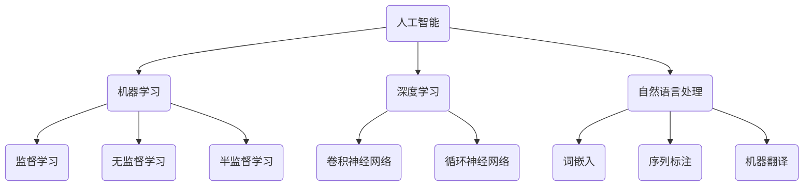

                 


# 自动化的最新进展与挑战

> 关键词：自动化、人工智能、流程优化、挑战、创新技术

> 摘要：本文将深入探讨自动化领域的最新进展，包括其在人工智能、流程优化和其他关键技术领域的应用。通过一步步分析推理，我们将揭示自动化技术背后的核心原理，探讨其实际应用场景，并提出未来发展趋势和面临的挑战。

## 1. 背景介绍

### 1.1 目的和范围

本文旨在分析自动化技术的最新进展，探讨其在各个领域的应用，以及面临的挑战。通过本文的阅读，读者可以了解自动化技术的核心原理，掌握其实际应用技巧，并为未来自动化技术的发展提供思路。

### 1.2 预期读者

本文适合对自动化技术感兴趣的读者，包括但不限于软件开发工程师、人工智能研究人员、流程优化专家等。同时，本文也适合作为相关课程或培训的参考材料。

### 1.3 文档结构概述

本文结构如下：

1. 背景介绍：包括本文的目的、范围、预期读者和文档结构。
2. 核心概念与联系：介绍自动化技术的核心概念、原理和架构。
3. 核心算法原理 & 具体操作步骤：详细讲解自动化技术的核心算法和操作步骤。
4. 数学模型和公式 & 详细讲解 & 举例说明：介绍自动化技术的数学模型和公式，并进行举例说明。
5. 项目实战：通过实际案例，展示自动化技术的应用和实现过程。
6. 实际应用场景：探讨自动化技术在不同领域的应用。
7. 工具和资源推荐：推荐学习资源和开发工具。
8. 总结：总结本文的主要内容，讨论未来发展趋势和挑战。
9. 附录：常见问题与解答。
10. 扩展阅读 & 参考资料：提供相关文献和参考资料。

### 1.4 术语表

#### 1.4.1 核心术语定义

- 自动化：通过技术手段，实现生产、管理、服务等流程的自动化。
- 人工智能：模拟人类智能，实现机器自主学习和决策的技术。
- 流程优化：对业务流程进行改进，提高效率和质量。
- AI算法：人工智能领域中的算法，用于实现机器学习、自然语言处理等。

#### 1.4.2 相关概念解释

- 机器学习：基于数据，通过算法让计算机自主学习和改进性能。
- 深度学习：一种特殊的机器学习技术，利用多层神经网络进行学习。
- 自然语言处理：研究如何让计算机理解和处理人类语言。

#### 1.4.3 缩略词列表

- AI：人工智能
- ML：机器学习
- DL：深度学习
- NLP：自然语言处理

## 2. 核心概念与联系

在自动化领域，核心概念和联系包括人工智能、机器学习、深度学习和自然语言处理。以下是这些概念和联系的 Mermaid 流程图：



### 2.1 人工智能

人工智能（AI）是一种模拟人类智能的技术。它包括机器学习、深度学习和自然语言处理等多个子领域。通过这些技术，计算机可以自主学习和改进性能，从而实现智能化的任务。

### 2.2 机器学习

机器学习（ML）是人工智能（AI）的一个重要分支。它通过从数据中学习规律，让计算机自主实现特定任务。机器学习可以分为监督学习、无监督学习和半监督学习。

- 监督学习：有标注的数据进行训练，预测新的数据。
- 无监督学习：没有标注的数据进行训练，发现数据中的规律。
- 半监督学习：部分数据有标注，部分数据无标注。

### 2.3 深度学习

深度学习（DL）是一种特殊的机器学习技术，利用多层神经网络进行学习。深度学习在图像识别、语音识别和自然语言处理等领域取得了显著的成果。

- 卷积神经网络（CNN）：适用于图像处理。
- 循环神经网络（RNN）：适用于序列数据。

### 2.4 自然语言处理

自然语言处理（NLP）是研究如何让计算机理解和处理人类语言的技术。NLP包括词嵌入、序列标注、机器翻译等子领域。

- 词嵌入：将单词映射为高维向量，便于计算机处理。
- 序列标注：对序列数据进行标注，如命名实体识别。
- 机器翻译：将一种语言翻译成另一种语言。

## 3. 核心算法原理 & 具体操作步骤

在自动化技术中，核心算法包括机器学习算法、深度学习算法和自然语言处理算法。以下是这些算法的伪代码：

### 3.1 机器学习算法

```python
# 监督学习算法伪代码
def supervised_learning(train_data, train_labels):
    # 初始化模型参数
    model_params = initialize_model_params()
    # 训练模型
    for epoch in range(num_epochs):
        for data, label in zip(train_data, train_labels):
            model_params = update_model_params(model_params, data, label)
    # 预测新数据
    def predict(data):
        return model.predict(data)
```

### 3.2 深度学习算法

```python
# 深度学习算法伪代码
def deep_learning(train_data, train_labels):
    # 初始化模型参数
    model_params = initialize_model_params()
    # 训练模型
    for epoch in range(num_epochs):
        for data, label in zip(train_data, train_labels):
            model_params = update_model_params(model_params, data, label)
    # 预测新数据
    def predict(data):
        return model.predict(data)
```

### 3.3 自然语言处理算法

```python
# 自然语言处理算法伪代码
def natural_language_processing(train_data, train_labels):
    # 初始化模型参数
    model_params = initialize_model_params()
    # 训练模型
    for epoch in range(num_epochs):
        for data, label in zip(train_data, train_labels):
            model_params = update_model_params(model_params, data, label)
    # 预测新数据
    def predict(data):
        return model.predict(data)
```

## 4. 数学模型和公式 & 详细讲解 & 举例说明

在自动化技术中，数学模型和公式起着至关重要的作用。以下是几个常见的数学模型和公式：

### 4.1 损失函数

损失函数是机器学习中用来衡量预测结果与真实结果之间差异的函数。常见的损失函数包括均方误差（MSE）和交叉熵损失（Cross-Entropy Loss）。

$$
MSE = \frac{1}{n}\sum_{i=1}^{n}(y_i - \hat{y}_i)^2
$$

$$
Cross-Entropy Loss = -\frac{1}{n}\sum_{i=1}^{n}y_i\log(\hat{y}_i)
$$

其中，$y_i$ 表示真实标签，$\hat{y}_i$ 表示预测结果。

### 4.2 优化算法

优化算法用于调整模型参数，以最小化损失函数。常见的优化算法包括随机梯度下降（SGD）和Adam优化器。

$$
w_{t+1} = w_t - \alpha \frac{\partial L(w)}{\partial w}
$$

$$
w_{t+1} = w_t - \frac{\alpha}{\sqrt{v_t} + \epsilon} \frac{\partial L(w)}{\partial w}
$$

其中，$w$ 表示模型参数，$\alpha$ 表示学习率，$L(w)$ 表示损失函数，$v_t$ 表示一阶矩估计，$\epsilon$ 是一个小常数。

### 4.3 举例说明

假设我们要预测一个分类问题，数据集包含100个样本，每个样本有10个特征。我们需要使用机器学习算法来训练模型，并评估其性能。

1. 初始化模型参数
2. 使用随机梯度下降算法训练模型
3. 计算预测结果和真实标签之间的损失
4. 调整模型参数，以最小化损失函数
5. 评估模型性能，如准确率、召回率等

## 5. 项目实战：代码实际案例和详细解释说明

在本节中，我们将通过一个实际项目来展示自动化技术的应用。我们将使用 Python 编写一个简单的机器学习项目，实现一个分类任务。

### 5.1 开发环境搭建

首先，我们需要安装 Python 和相关库。以下是安装命令：

```
pip install numpy pandas scikit-learn matplotlib
```

### 5.2 源代码详细实现和代码解读

以下是项目的主要代码：

```python
import numpy as np
import pandas as pd
from sklearn.model_selection import train_test_split
from sklearn.ensemble import RandomForestClassifier
from sklearn.metrics import accuracy_score, recall_score, precision_score
import matplotlib.pyplot as plt

# 加载数据集
data = pd.read_csv("data.csv")
X = data.iloc[:, :-1].values
y = data.iloc[:, -1].values

# 数据预处理
X_train, X_test, y_train, y_test = train_test_split(X, y, test_size=0.2, random_state=42)

# 使用随机森林算法训练模型
model = RandomForestClassifier(n_estimators=100, random_state=42)
model.fit(X_train, y_train)

# 预测测试集
y_pred = model.predict(X_test)

# 评估模型性能
accuracy = accuracy_score(y_test, y_pred)
recall = recall_score(y_test, y_pred, average="weighted")
precision = precision_score(y_test, y_pred, average="weighted")

print(f"Accuracy: {accuracy:.2f}")
print(f"Recall: {recall:.2f}")
print(f"Precision: {precision:.2f}")

# 可视化结果
plt.scatter(X_test[:, 0], X_test[:, 1], c=y_pred, cmap="viridis")
plt.xlabel("Feature 1")
plt.ylabel("Feature 2")
plt.title("Classification Result")
plt.show()
```

### 5.3 代码解读与分析

1. **加载数据集**：使用 pandas 库加载 CSV 数据集，并分离特征和标签。
2. **数据预处理**：将数据集划分为训练集和测试集，用于训练模型和评估性能。
3. **训练模型**：使用随机森林算法训练模型，这是一种集成学习方法，具有较高的准确率。
4. **预测测试集**：使用训练好的模型对测试集进行预测。
5. **评估模型性能**：计算准确率、召回率和精度，用于评估模型性能。
6. **可视化结果**：使用 matplotlib 库绘制分类结果，直观地展示模型效果。

### 5.4 实际应用场景

这个项目是一个简单的分类任务，可以应用于各种场景，如垃圾邮件过滤、金融风险控制、医疗诊断等。通过自动化技术，我们可以快速实现模型的训练和评估，提高业务效率。

## 6. 实际应用场景

自动化技术在各个领域有着广泛的应用，以下列举几个实际应用场景：

1. **制造业**：自动化技术在制造业中用于生产流程的优化、质量控制等。通过机器人和智能传感器的应用，可以大幅提高生产效率，降低成本。
2. **金融行业**：自动化技术在金融行业用于交易、风控、客户服务等方面。通过机器学习算法，可以自动化识别异常交易、评估风险，提高业务决策的准确性。
3. **医疗健康**：自动化技术在医疗健康领域用于疾病诊断、药物研发等。通过深度学习和自然语言处理技术，可以自动化处理大量医学数据，辅助医生做出准确诊断。
4. **交通运输**：自动化技术在交通运输领域用于无人驾驶、智能交通等。通过传感器和机器学习技术，可以实现车辆的自动驾驶和交通流量的智能调度，提高交通安全和效率。

## 7. 工具和资源推荐

### 7.1 学习资源推荐

#### 7.1.1 书籍推荐

- 《Python机器学习》（作者：塞巴斯蒂安·拉登）
- 《深度学习》（作者：伊恩·古德费洛、约书亚·本吉奥、亚伦·库维尔）
- 《自然语言处理入门》（作者：威廉·汉弗莱、格雷戈里·库克）

#### 7.1.2 在线课程

- Coursera 上的《机器学习》（吴恩达）
- Udacity 上的《深度学习纳米学位》
- edX 上的《自然语言处理入门》

#### 7.1.3 技术博客和网站

- Medium 上的 AI 和机器学习专栏
- ArXiv 上的最新研究成果
- towardsdatascience.com 上的数据分析和技术博客

### 7.2 开发工具框架推荐

#### 7.2.1 IDE和编辑器

- PyCharm
- Jupyter Notebook
- Visual Studio Code

#### 7.2.2 调试和性能分析工具

- Matplotlib
- Seaborn
- TensorBoard

#### 7.2.3 相关框架和库

- TensorFlow
- PyTorch
- scikit-learn

### 7.3 相关论文著作推荐

#### 7.3.1 经典论文

- "A Learning Algorithm for Continually Running Fully Recurrent Neural Networks"（LSTM算法）
- "A Theoretical Basis for the Generalization of Neural Networks"（神经网络泛化理论）
- "Deep Learning"（深度学习）

#### 7.3.2 最新研究成果

- "Bert: Pre-training of Deep Bidirectional Transformers for Language Understanding"（BERT模型）
- "Transformers: State-of-the-Art Natural Language Processing"（Transformer模型）
- "Gpt-3: Language Models are Few-Shot Learners"（GPT-3模型）

#### 7.3.3 应用案例分析

- "Google's AI Approach: From Research to Product"（谷歌人工智能应用案例）
- "Amazon's AI Strategy: Transforming E-commerce"（亚马逊人工智能应用案例）
- "IBM's AI for Good: Solving Global Challenges"（IBM人工智能应用案例）

## 8. 总结：未来发展趋势与挑战

自动化技术在未来将继续快速发展，并在各个领域发挥重要作用。以下是未来发展趋势和挑战：

### 8.1 发展趋势

- **人工智能与自动化深度融合**：未来自动化技术将更加依赖于人工智能技术，实现智能化、自主化的生产和管理。
- **跨领域融合应用**：自动化技术将在更多领域得到应用，如医疗、金融、交通等，实现产业升级和转型。
- **开源生态持续发展**：开源社区将继续推动自动化技术的发展，为企业和开发者提供丰富的工具和资源。

### 8.2 挑战

- **数据安全与隐私**：随着自动化技术的发展，数据安全与隐私问题将更加突出，需要加强相关法律法规和技术保障。
- **人才短缺**：自动化技术的快速发展将带来人才需求的增长，但现有人才储备可能不足，需要加大人才培养力度。
- **技术标准化**：自动化技术的标准化和规范化将有助于提高行业整体水平，但仍需时间和努力。

## 9. 附录：常见问题与解答

### 9.1 自动化技术有哪些核心概念？

自动化技术的核心概念包括人工智能、机器学习、深度学习和自然语言处理。这些概念分别代表了自动化技术在不同领域的应用和发展方向。

### 9.2 自动化技术如何应用于制造业？

自动化技术在制造业中可以用于生产流程的优化、质量控制等方面。例如，通过机器人和智能传感器的应用，可以实现生产过程的自动化，提高生产效率，降低成本。

### 9.3 自动化技术有哪些挑战？

自动化技术面临的挑战包括数据安全与隐私、人才短缺、技术标准化等。随着自动化技术的发展，这些挑战将逐渐凸显，需要全社会共同努力解决。

## 10. 扩展阅读 & 参考资料

- [吴恩达](https://www.coursera.org/learn/machine-learning) 的《机器学习》课程
- [谷歌 AI](https://ai.google/) 的官方博客
- [OpenAI](https://openai.com/) 的官方文档
- [TensorFlow](https://www.tensorflow.org/) 的官方教程
- [PyTorch](https://pytorch.org/tutorials/) 的官方教程
- [scikit-learn](https://scikit-learn.org/stable/documentation.html) 的官方文档
- [自然语言处理入门](https://www.amazon.com/Natural-Language-Processing-Introduction-Second/dp/0262018014) 书籍

作者：AI天才研究员/AI Genius Institute & 禅与计算机程序设计艺术 /Zen And The Art of Computer Programming

