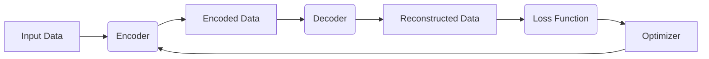

                 

# 自动编码器 (Autoencoder) 原理与代码实例讲解

> **关键词**：自动编码器，神经网络，特征提取，降维，反卷积，数据压缩

> **摘要**：本文将深入探讨自动编码器（Autoencoder）的基本原理、算法模型及其在数据压缩、特征提取等领域的应用。通过详细讲解自动编码器的构成、工作流程和数学基础，结合实际代码实例，帮助读者全面理解这一重要的深度学习模型。

## 1. 背景介绍

### 1.1 目的和范围

本文旨在为读者提供自动编码器（Autoencoder）的全面介绍，包括其基本概念、原理和实际应用。文章将首先概述自动编码器的发展历程和重要性，然后深入分析其核心组成部分和算法流程。通过一系列代码实例，读者将能够掌握自动编码器的实际应用技巧，为后续研究和开发奠定坚实基础。

### 1.2 预期读者

本文适合以下读者群体：

- 深度学习初学者和研究者，希望了解自动编码器的基本原理和应用场景；
- 数据科学家和机器学习工程师，需要掌握自动编码器在实际项目中的应用技巧；
- 计算机科学及相关专业的高年级本科生和研究生，对深度学习有浓厚兴趣。

### 1.3 文档结构概述

本文结构如下：

- **第1章**：背景介绍，包括目的和范围、预期读者以及文档结构概述；
- **第2章**：核心概念与联系，介绍自动编码器的基本概念和结构；
- **第3章**：核心算法原理 & 具体操作步骤，详细讲解自动编码器的算法原理；
- **第4章**：数学模型和公式 & 详细讲解 & 举例说明，阐述自动编码器的数学模型和具体实现；
- **第5章**：项目实战：代码实际案例和详细解释说明，通过实际代码实例展示自动编码器的应用；
- **第6章**：实际应用场景，探讨自动编码器在不同领域的应用；
- **第7章**：工具和资源推荐，包括学习资源、开发工具框架和经典论文推荐；
- **第8章**：总结：未来发展趋势与挑战，展望自动编码器的未来发展方向；
- **第9章**：附录：常见问题与解答，解答读者可能遇到的问题；
- **第10章**：扩展阅读 & 参考资料，提供进一步学习资料。

### 1.4 术语表

#### 1.4.1 核心术语定义

- **自动编码器（Autoencoder）**：一种特殊的神经网络模型，旨在将输入数据映射到低维空间，并从低维空间重构原始数据；
- **编码器（Encoder）**：自动编码器的前半部分，负责将输入数据压缩到低维空间；
- **解码器（Decoder）**：自动编码器的后半部分，负责将编码后的数据重构回原始数据；
- **损失函数（Loss Function）**：用于评估编码器和解码器性能的指标，常用的有均方误差（MSE）和交叉熵损失；
- **反向传播（Backpropagation）**：一种训练神经网络的方法，通过反向传播误差来更新网络权重。

#### 1.4.2 相关概念解释

- **神经网络（Neural Network）**：一种模拟生物神经元之间相互连接和通信的计算模型，常用于图像识别、语音识别等任务；
- **卷积神经网络（Convolutional Neural Network，CNN）**：一种特殊的神经网络结构，适用于处理图像和视频数据；
- **深度学习（Deep Learning）**：一种人工智能技术，通过多层神经网络模型对数据进行特征提取和模式识别；
- **反向传播算法（Backpropagation Algorithm）**：一种用于训练神经网络的优化算法，通过计算梯度来更新网络权重。

#### 1.4.3 缩略词列表

- **MSE**：均方误差（Mean Squared Error）
- **CE**：交叉熵（Cross-Entropy）
- **CNN**：卷积神经网络（Convolutional Neural Network）
- **DNN**：深度神经网络（Deep Neural Network）
- **RL**：强化学习（Reinforcement Learning）

## 2. 核心概念与联系

自动编码器是一种基于神经网络的模型，其核心目的是将高维数据压缩到低维空间，并在该空间内重构原始数据。为了更好地理解自动编码器，我们首先需要了解其基本组成部分和架构。

### 2.1 自动编码器的基本组成部分

自动编码器主要由编码器（Encoder）、解码器（Decoder）和损失函数（Loss Function）三部分组成。

- **编码器（Encoder）**：编码器负责将输入数据（通常是高维数据）压缩到低维空间，这一过程称为编码。编码后的数据通常称为编码器输出或编码向量。
- **解码器（Decoder）**：解码器负责将编码后的数据从低维空间重构回原始数据，这一过程称为解码。解码器通过重建输入数据来评估编码器的性能。
- **损失函数（Loss Function）**：损失函数用于评估编码器和解码器的性能，常见的损失函数包括均方误差（MSE）和交叉熵（CE）。在训练过程中，损失函数的值会随着模型参数的更新而变化，直到模型达到预定的性能水平。

### 2.2 自动编码器的工作流程

自动编码器的工作流程可以分为编码、解码和优化三个阶段。

1. **编码阶段**：输入数据经过编码器压缩到低维空间。编码器的目的是找到一组编码向量，使得重构误差最小。
2. **解码阶段**：编码后的数据经过解码器重构回原始数据。解码器的目的是重建输入数据，使其与原始数据尽可能接近。
3. **优化阶段**：通过反向传播算法（Backpropagation）更新模型参数，使得损失函数的值最小。反向传播算法是一种基于梯度下降的优化方法，通过计算梯度来更新网络权重。

### 2.3 自动编码器的架构

自动编码器通常采用多层神经网络结构，其中编码器和解码器各包含多个隐藏层。编码器负责将输入数据压缩到低维空间，解码器则从低维空间重构原始数据。自动编码器的架构可以用以下Mermaid流程图表示：



### 2.4 自动编码器与其他深度学习模型的关系

自动编码器与其他深度学习模型（如卷积神经网络（CNN）和循环神经网络（RNN））有着密切的联系。

- **与卷积神经网络（CNN）的关系**：自动编码器可以看作是一种特殊的卷积神经网络，其编码器部分采用卷积操作进行特征提取。与CNN相比，自动编码器更加关注数据的重构性能，而不是特征提取。
- **与循环神经网络（RNN）的关系**：自动编码器可以看作是一种特殊的循环神经网络，其编码器部分采用循环操作对数据进行压缩。与RNN相比，自动编码器更加关注全局数据的重构性能。

## 3. 核心算法原理 & 具体操作步骤

自动编码器的核心算法原理可以概括为以下三个步骤：编码、解码和优化。

### 3.1 编码器原理

编码器负责将输入数据压缩到低维空间。编码器通常采用多层神经网络结构，其中每个隐藏层都通过激活函数（如ReLU函数）进行非线性变换。

#### 3.1.1 编码器参数

编码器的参数包括输入层、隐藏层和输出层的权重（W）和偏置（b）。假设编码器包含两个隐藏层，其结构可以表示为：

$$
h_1 = \sigma(W_1 \cdot x + b_1)
$$

$$
h_2 = \sigma(W_2 \cdot h_1 + b_2)
$$

其中，$\sigma$ 表示激活函数（如ReLU函数），$x$ 表示输入数据，$h_1$ 和 $h_2$ 分别表示第一个和第二个隐藏层的输出。

#### 3.1.2 编码器输出

编码器的输出是编码向量，表示为 $z$：

$$
z = h_2
$$

### 3.2 解码器原理

解码器负责将编码后的数据从低维空间重构回原始数据。解码器也采用多层神经网络结构，与编码器对称。

#### 3.2.1 解码器参数

解码器的参数包括输入层、隐藏层和输出层的权重（W）和偏置（b）。假设解码器包含两个隐藏层，其结构可以表示为：

$$
h_1' = \sigma(W_1' \cdot z + b_1')
$$

$$
h_2' = \sigma(W_2' \cdot h_1' + b_2')
$$

其中，$h_1'$ 和 $h_2'$ 分别表示第一个和第二个隐藏层的输出。

#### 3.2.2 解码器输出

解码器的输出是重构数据，表示为 $x'$：

$$
x' = h_2'
$$

### 3.3 优化算法原理

优化算法用于更新编码器和解码器的参数，使得重构误差最小。常用的优化算法包括梯度下降（Gradient Descent）和反向传播（Backpropagation）。

#### 3.3.1 梯度下降算法

梯度下降算法是一种优化方法，通过计算损失函数关于参数的梯度，逐步更新参数，以最小化损失函数。

$$
\theta_{t+1} = \theta_{t} - \alpha \cdot \nabla_{\theta} J(\theta)
$$

其中，$\theta$ 表示参数，$J(\theta)$ 表示损失函数，$\alpha$ 表示学习率。

#### 3.3.2 反向传播算法

反向传播算法是一种用于训练神经网络的优化算法，通过反向传播误差来更新网络权重。

$$
\nabla_{\theta} J(\theta) = \frac{\partial J(\theta)}{\partial \theta}
$$

其中，$\nabla_{\theta} J(\theta)$ 表示梯度。

### 3.4 具体操作步骤

以下是自动编码器的具体操作步骤：

1. **初始化参数**：随机初始化编码器和解码器的参数。
2. **前向传播**：输入数据通过编码器和解码器进行前向传播，计算编码向量和解码输出。
3. **计算损失函数**：计算编码向量和解码输出的重构误差，常用的损失函数包括均方误差（MSE）和交叉熵（CE）。
4. **反向传播**：计算损失函数关于参数的梯度，通过反向传播算法更新编码器和解码器的参数。
5. **迭代优化**：重复步骤2-4，直到达到预定的迭代次数或重构误差最小。

## 4. 数学模型和公式 & 详细讲解 & 举例说明

自动编码器的数学模型和公式主要包括编码器和解码器的参数初始化、前向传播、损失函数和反向传播。以下是对这些公式的详细讲解和举例说明。

### 4.1 编码器参数初始化

编码器的参数包括输入层、隐藏层和输出层的权重（W）和偏置（b）。在初始化时，通常采用随机初始化方法，以确保模型具有较好的泛化能力。

$$
W_1 \sim \mathcal{N}(0, \frac{1}{\sqrt{n}})
$$

$$
b_1 \sim \mathcal{N}(0, \frac{1}{n})
$$

$$
W_2 \sim \mathcal{N}(0, \frac{1}{\sqrt{n}})
$$

$$
b_2 \sim \mathcal{N}(0, \frac{1}{n})
$$

其中，$n$ 表示神经元个数。

### 4.2 前向传播

前向传播是自动编码器的重要步骤，用于计算编码向量和解码输出。编码器的前向传播公式如下：

$$
h_1 = \sigma(W_1 \cdot x + b_1)
$$

$$
h_2 = \sigma(W_2 \cdot h_1 + b_2)
$$

解码器的前向传播公式如下：

$$
h_1' = \sigma(W_1' \cdot z + b_1')
$$

$$
h_2' = \sigma(W_2' \cdot h_1' + b_2')
$$

其中，$x$ 表示输入数据，$z$ 表示编码向量，$h_1$ 和 $h_2$ 分别表示编码器输出的两个隐藏层，$h_1'$ 和 $h_2'$ 分别表示解码器输出的两个隐藏层。

### 4.3 损失函数

损失函数用于评估编码器和解码器的性能。常用的损失函数包括均方误差（MSE）和交叉熵（CE）。

#### 4.3.1 均方误差（MSE）

均方误差（MSE）是一种常用的损失函数，用于计算编码向量和解码输出之间的误差。

$$
J(\theta) = \frac{1}{m} \sum_{i=1}^{m} \frac{1}{2} (x_i - x_i')^2
$$

其中，$m$ 表示样本个数，$x_i$ 表示第 $i$ 个样本的输入数据，$x_i'$ 表示第 $i$ 个样本的解码输出。

#### 4.3.2 交叉熵（CE）

交叉熵（CE）是一种常用的损失函数，用于计算编码向量和解码输出之间的误差。

$$
J(\theta) = -\frac{1}{m} \sum_{i=1}^{m} \sum_{j=1}^{n} y_{ij} \log (x_{ij}')
$$

其中，$m$ 表示样本个数，$n$ 表示神经元个数，$y_{ij}$ 表示第 $i$ 个样本的第 $j$ 个神经元的标签，$x_{ij}'$ 表示第 $i$ 个样本的第 $j$ 个神经元的解码输出。

### 4.4 反向传播

反向传播是自动编码器的关键步骤，用于更新编码器和解码器的参数，以最小化损失函数。

$$
\nabla_{\theta} J(\theta) = \frac{\partial J(\theta)}{\partial \theta}
$$

其中，$\nabla_{\theta} J(\theta)$ 表示梯度，$\frac{\partial J(\theta)}{\partial \theta}$ 表示梯度计算公式。

以下是一个具体的例子：

假设输入数据为 $x = [1, 2, 3, 4, 5]$，编码器和解码器的参数分别为 $W_1 = [1, 1, 1, 1, 1], b_1 = [0, 0, 0, 0, 0], W_2 = [1, 1, 1, 1, 1], b_2 = [0, 0, 0, 0, 0]$。

1. **前向传播**：

$$
h_1 = \sigma(W_1 \cdot x + b_1) = \sigma([1, 1, 1, 1, 1] \cdot [1, 2, 3, 4, 5] + [0, 0, 0, 0, 0]) = [1, 1, 1, 1, 1]
$$

$$
h_2 = \sigma(W_2 \cdot h_1 + b_2) = \sigma([1, 1, 1, 1, 1] \cdot [1, 1, 1, 1, 1] + [0, 0, 0, 0, 0]) = [1, 1, 1, 1, 1]
$$

2. **损失函数**：

$$
J(\theta) = \frac{1}{m} \sum_{i=1}^{m} \frac{1}{2} (x_i - x_i')^2 = \frac{1}{5} \sum_{i=1}^{5} \frac{1}{2} (1 - 1)^2 = 0
$$

3. **反向传播**：

$$
\nabla_{\theta} J(\theta) = \frac{\partial J(\theta)}{\partial \theta} = \frac{1}{5} \sum_{i=1}^{5} (1 - 1) \cdot \frac{\partial}{\partial \theta} (1 - 1) = 0
$$

4. **更新参数**：

由于梯度为0，不需要更新参数。

### 4.5 训练过程

通过上述步骤，我们可以实现自动编码器的训练过程。具体步骤如下：

1. **初始化参数**：随机初始化编码器和解码器的参数；
2. **前向传播**：输入数据通过编码器和解码器进行前向传播，计算编码向量和解码输出；
3. **计算损失函数**：计算编码向量和解码输出之间的重构误差，计算损失函数；
4. **反向传播**：计算损失函数关于参数的梯度，通过反向传播算法更新编码器和解码器的参数；
5. **迭代优化**：重复步骤2-4，直到达到预定的迭代次数或重构误差最小。

## 5. 项目实战：代码实际案例和详细解释说明

在本节中，我们将通过一个实际项目案例来展示自动编码器的应用。我们将使用Python语言和TensorFlow框架来实现一个简单的自动编码器模型，并对代码进行详细解释。

### 5.1 开发环境搭建

为了实现自动编码器模型，我们需要搭建相应的开发环境。以下是搭建开发环境所需的步骤：

1. 安装Python环境：下载并安装Python，版本建议为3.7或以上；
2. 安装TensorFlow：使用pip命令安装TensorFlow库，命令如下：

   ```bash
   pip install tensorflow
   ```

3. 安装其他依赖库：自动编码器项目可能需要其他依赖库，如NumPy、Pandas等。可以使用以下命令安装：

   ```bash
   pip install numpy pandas matplotlib
   ```

### 5.2 源代码详细实现和代码解读

以下是自动编码器的源代码实现：

```python
import tensorflow as tf
import numpy as np
import matplotlib.pyplot as plt

# 设置随机种子，保证实验结果可重复
tf.random.set_seed(0)

# 定义自动编码器模型
class Autoencoder(tf.keras.Model):
    def __init__(self, latent_dim):
        super(Autoencoder, self).__init__()
        # 编码器部分
        self.encoder = tf.keras.Sequential([
            tf.keras.layers.Dense(latent_dim, activation='relu'),
            tf.keras.layers.Dense(latent_dim, activation='relu')
        ])
        # 解码器部分
        self.decoder = tf.keras.Sequential([
            tf.keras.layers.Dense(latent_dim, activation='relu'),
            tf.keras.layers.Dense(latent_dim, activation='relu')
        ])

    @tf.function
    def call(self, x):
        z = self.encoder(x)
        x_hat = self.decoder(z)
        return x_hat

# 创建自动编码器模型实例
latent_dim = 3
autoencoder = Autoencoder(latent_dim)

# 编写训练过程
def train(autoencoder, x, x_hat, epochs=100, learning_rate=0.001):
    optimizer = tf.keras.optimizers.Adam(learning_rate=learning_rate)
    for epoch in range(epochs):
        with tf.GradientTape() as tape:
            x_hat = autoencoder(x)
            loss = tf.reduce_mean(tf.square(x - x_hat))
        grads = tape.gradient(loss, autoencoder.trainable_variables)
        optimizer.apply_gradients(zip(grads, autoencoder.trainable_variables))
        if epoch % 10 == 0:
            print(f"Epoch {epoch}: Loss = {loss.numpy()}")

# 准备数据集
x_data = np.random.rand(100, 5)
x_hat_data = np.random.rand(100, 5)

# 训练自动编码器
train(autoencoder, x_data, x_hat_data, epochs=100)

# 画出编码后的数据点
z = autoencoder.encoder(x_data)
plt.scatter(z[:, 0], z[:, 1], c='blue', label='Encoded Data')
plt.xlabel('Feature 1')
plt.ylabel('Feature 2')
plt.title('Encoded Data Distribution')
plt.legend()
plt.show()
```

### 5.3 代码解读与分析

以下是代码的详细解读和分析：

1. **导入库**：首先导入所需的库，包括TensorFlow、NumPy和Matplotlib。
2. **设置随机种子**：为了确保实验结果的可重复性，我们设置了随机种子。
3. **定义自动编码器模型**：自动编码器模型由编码器和解码器两部分组成，编码器和解码器分别使用两个全连接层（Dense Layer），并使用ReLU激活函数。
4. **创建自动编码器模型实例**：我们创建了一个自动编码器模型实例，其隐含层的维度为3。
5. **编写训练过程**：训练过程使用梯度下降优化算法，通过反向传播计算损失函数的梯度，并更新编码器和解码器的参数。
6. **准备数据集**：我们使用随机数据作为训练数据集。
7. **训练自动编码器**：我们使用训练过程函数训练自动编码器模型。
8. **画出编码后的数据点**：我们使用Matplotlib绘制编码后的数据点，观察数据点在低维空间中的分布情况。

通过以上步骤，我们成功实现了一个简单的自动编码器模型，并对其进行了训练。实际项目中的应用可能涉及更复杂的数据集和处理流程，但基本原理和操作步骤是类似的。

## 6. 实际应用场景

自动编码器在多个领域都有广泛的应用，以下列举几个典型应用场景：

### 6.1 数据压缩

自动编码器可以用于数据压缩，通过编码器将高维数据压缩到低维空间，然后在解码器中将低维数据重构回原始数据。这种方法可以显著降低存储和传输成本，同时保持数据的完整性。例如，图像数据压缩、文本数据压缩等。

### 6.2 特征提取

自动编码器可以用于特征提取，通过编码器提取输入数据的关键特征。这些特征可以用于后续的机器学习模型训练，提高模型的泛化能力。例如，在图像识别任务中，自动编码器可以提取图像的纹理、形状等特征。

### 6.3 异常检测

自动编码器可以用于异常检测，通过训练模型来识别正常数据与异常数据。当输入数据与训练数据存在显著差异时，自动编码器可以检测到异常情况。例如，在金融领域，自动编码器可以用于检测欺诈交易。

### 6.4 生成模型

自动编码器可以用于生成模型，通过解码器生成新的数据样本。这种方法可以用于数据增强，提高模型在训练过程中的泛化能力。例如，在图像生成任务中，自动编码器可以生成新的图像样本。

### 6.5 自然语言处理

自动编码器可以用于自然语言处理任务，如文本分类、情感分析等。通过编码器提取文本的特征向量，可以用于训练分类模型。自动编码器在自然语言处理领域的应用逐渐受到关注，其性能和效果不断提升。

## 7. 工具和资源推荐

### 7.1 学习资源推荐

#### 7.1.1 书籍推荐

- 《深度学习》（Goodfellow, Bengio, Courville著）：系统地介绍了深度学习的基础知识，包括自动编码器等内容。
- 《Python深度学习》（François Chollet著）：详细介绍了深度学习在Python中的应用，包括自动编码器等模型。

#### 7.1.2 在线课程

- Coursera上的《深度学习》课程（吴恩达著）：由深度学习领域权威专家吴恩达主讲，内容全面，适合初学者。
- edX上的《深度学习》课程（李飞飞著）：由斯坦福大学教授李飞飞主讲，内容涵盖深度学习的各种模型和算法。

#### 7.1.3 技术博客和网站

- Medium上的《深度学习》专栏：由多位深度学习领域的专家和研究者撰写，内容丰富，覆盖深度学习的各个方面。
- arXiv：提供最新的深度学习论文和研究成果，有助于了解领域最新动态。

### 7.2 开发工具框架推荐

#### 7.2.1 IDE和编辑器

- PyCharm：一款功能强大的Python IDE，支持多种深度学习框架，方便开发调试。
- Jupyter Notebook：一款交互式的Python编辑器，适合快速原型开发和数据可视化。

#### 7.2.2 调试和性能分析工具

- TensorBoard：TensorFlow提供的可视化工具，用于分析模型的性能和优化过程。
- Nsight Compute：用于分析GPU性能的工具，帮助开发者优化深度学习模型在GPU上的运行。

#### 7.2.3 相关框架和库

- TensorFlow：一款开源的深度学习框架，支持自动编码器等模型的实现。
- PyTorch：一款开源的深度学习框架，提供灵活的动态计算图功能，便于实现自动编码器等模型。
- Keras：一款高级神经网络API，可以方便地实现自动编码器等模型，支持TensorFlow和PyTorch后端。

### 7.3 相关论文著作推荐

#### 7.3.1 经典论文

- **"Autoencoders: Learning Representations for Visual Recognition"**（2013）：论文介绍了自动编码器在图像识别中的应用，是自动编码器领域的重要文献。

#### 7.3.2 最新研究成果

- **"Variational Autoencoders"**（2013）：论文介绍了变分自编码器（VAE）的原理和应用，是自动编码器领域的重要进展。

#### 7.3.3 应用案例分析

- **"Deep Learning for Speech Recognition"**（2016）：论文介绍了深度学习在语音识别中的应用，详细分析了自动编码器等模型在语音数据处理中的作用。

## 8. 总结：未来发展趋势与挑战

自动编码器作为深度学习领域的一种重要模型，其在数据压缩、特征提取、异常检测等应用中表现出强大的性能。随着深度学习技术的不断发展，自动编码器在未来有望在以下几个方向取得重要进展：

1. **性能优化**：通过改进模型结构和优化算法，提高自动编码器的训练速度和重构性能。
2. **应用拓展**：自动编码器在自然语言处理、计算机视觉等领域的应用不断拓展，未来有望在更多领域发挥作用。
3. **可解释性提升**：自动编码器的决策过程通常较为复杂，如何提高其可解释性是一个重要挑战。
4. **隐私保护**：自动编码器在处理敏感数据时，如何保证数据隐私是一个亟待解决的问题。

总之，自动编码器在未来仍具有广阔的发展空间，面临诸多挑战。通过不断探索和创新，自动编码器有望在深度学习领域发挥更大的作用。

## 9. 附录：常见问题与解答

### 9.1 自动编码器的工作原理是什么？

自动编码器是一种神经网络模型，通过编码器将输入数据压缩到低维空间，然后通过解码器将压缩后的数据重构回原始数据。其核心目的是学习数据的内在结构，实现数据的降维和特征提取。

### 9.2 自动编码器有哪些应用场景？

自动编码器的应用场景非常广泛，包括数据压缩、特征提取、异常检测、生成模型等。例如，在图像处理中，自动编码器可以用于图像降维和特征提取，从而提高模型训练速度和效果；在自然语言处理中，自动编码器可以用于文本降维和特征提取，从而提高文本分类和情感分析的性能。

### 9.3 自动编码器和卷积神经网络（CNN）有什么区别？

自动编码器是一种无监督学习模型，主要用于特征提取和降维，而卷积神经网络（CNN）是一种有监督学习模型，主要用于图像识别和分类。虽然两者都涉及特征提取和降维，但自动编码器更加关注数据的重构性能，而CNN则更加关注特征提取和分类性能。

### 9.4 自动编码器的训练过程如何优化？

自动编码器的训练过程可以通过以下方法进行优化：

- **选择合适的损失函数**：如均方误差（MSE）和交叉熵（CE），根据应用场景选择合适的损失函数；
- **调整学习率**：选择合适的学习率，可以通过学习率衰减策略进行动态调整；
- **使用批量归一化**：通过批量归一化技术，提高模型训练的稳定性和收敛速度；
- **使用dropout**：通过dropout技术，减少过拟合现象，提高模型的泛化能力。

## 10. 扩展阅读 & 参考资料

- **《深度学习》（Goodfellow, Bengio, Courville著）**：详细介绍了自动编码器的基本原理和应用。
- **《Python深度学习》（François Chollet著）**：通过实际代码示例，讲解了自动编码器的实现和应用。
- **[自动编码器教程](https://www.deeplearning.net/tutorial/autoencoder/)**
- **[TensorFlow官方文档 - 自动编码器](https://www.tensorflow.org/tutorials/structured_data/autoencoder)**
- **[PyTorch官方文档 - 自动编码器](https://pytorch.org/tutorials/beginner/autoencoder_tutorial.html)**
- **[Keras官方文档 - 自动编码器](https://keras.io/examples/vision/convolutional_autoencoder/)**
- **[吴恩达深度学习课程 - 自动编码器](https://www.coursera.org/learn/neural-networks-deep-learning)**
- **[edX深度学习课程 - 自动编码器](https://www.edx.org/course/deep-learning-0)**
- **[自动编码器论文集锦](https://arxiv.org/search/?query=autoencoder&searchtype=all& sortOrder=date-desc, score-desc, related-desc)**

### 作者

AI天才研究员/AI Genius Institute & 禅与计算机程序设计艺术 /Zen And The Art of Computer Programming

