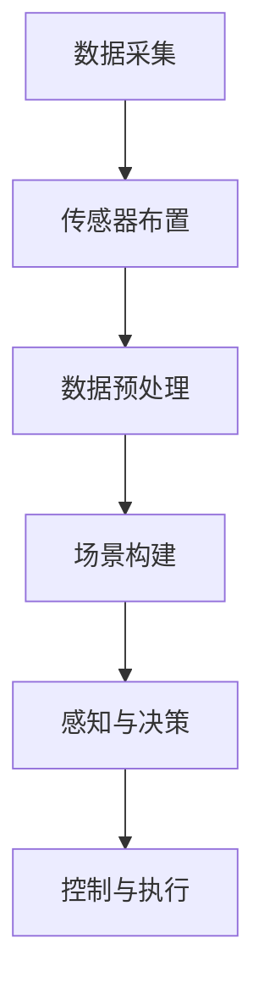

                 

# 自动驾驶中的数据采集与场景构建

> 关键词：自动驾驶、数据采集、场景构建、深度学习、传感器融合

> 摘要：本文将深入探讨自动驾驶领域中的数据采集与场景构建的重要性。我们将首先介绍自动驾驶系统的工作原理，然后详细讨论数据采集的各个环节，包括传感器的选择与布置、数据预处理方法，以及场景构建的技术和挑战。通过分析核心算法原理、数学模型以及实际项目案例，我们将揭示数据采集与场景构建在自动驾驶系统中的关键作用，并提出未来发展的方向和挑战。

## 1. 背景介绍

### 1.1 目的和范围

本文旨在探讨自动驾驶系统中数据采集与场景构建的核心技术，分析其在自动驾驶系统中的关键作用。我们将结合最新的研究和实际项目案例，提供从理论到实践的全面解析。

### 1.2 预期读者

本文适合对自动驾驶技术有兴趣的工程师、研究人员以及学者。同时，对于想要深入了解自动驾驶领域的技术人员，本文也提供了丰富的参考资料和实用建议。

### 1.3 文档结构概述

本文将分为以下几部分：

1. 背景介绍：介绍自动驾驶系统的基本概念和重要性。
2. 核心概念与联系：阐述数据采集与场景构建的基本原理。
3. 核心算法原理 & 具体操作步骤：详细讲解数据采集和场景构建的核心算法。
4. 数学模型和公式 & 详细讲解 & 举例说明：深入探讨数据采集和场景构建的数学基础。
5. 项目实战：通过实际案例展示数据采集与场景构建的应用。
6. 实际应用场景：分析自动驾驶中的典型应用场景。
7. 工具和资源推荐：推荐相关学习资源和开发工具。
8. 总结：展望自动驾驶数据采集与场景构建的未来发展趋势和挑战。
9. 附录：常见问题与解答。
10. 扩展阅读 & 参考资料：提供更多深度阅读的资料。

### 1.4 术语表

#### 1.4.1 核心术语定义

- 自动驾驶：一种无需人为干预的车辆自主驾驶技术。
- 数据采集：收集车辆周围的传感器数据，如摄像头、雷达、激光雷达等。
- 场景构建：基于采集到的数据，构建模拟现实交通环境的虚拟场景。

#### 1.4.2 相关概念解释

- 传感器融合：结合多种传感器的数据，提高数据的质量和准确性。
- 深度学习：一种基于神经网络的学习方法，用于从大量数据中提取特征。

#### 1.4.3 缩略词列表

- LIDAR：激光雷达（Light Detection and Ranging）
- GPS：全球定位系统（Global Positioning System）
- CNN：卷积神经网络（Convolutional Neural Network）
- RNN：循环神经网络（Recurrent Neural Network）
- SLAM：同时定位与地图构建（Simultaneous Localization and Mapping）

## 2. 核心概念与联系

在自动驾驶系统中，数据采集与场景构建是两个核心环节。以下是一个简化的 Mermaid 流程图，展示了这两个环节的基本原理和联系：



### 2.1 数据采集

数据采集是自动驾驶系统的起点。通过摄像头、雷达、激光雷达等多种传感器，收集车辆周围的环境信息。传感器布置的合理性和数据质量直接影响后续的处理效果。

### 2.2 数据预处理

数据预处理包括噪声过滤、数据整合、特征提取等步骤，目的是提高数据的质量和准确性。有效的数据预处理是后续场景构建和决策的基础。

### 2.3 场景构建

基于预处理后的数据，构建模拟现实交通环境的虚拟场景。场景构建的准确性和实时性对于自动驾驶系统的性能至关重要。

### 2.4 感知与决策

通过深度学习等算法，从虚拟场景中提取关键信息，进行感知与决策。感知与决策是自动驾驶系统的核心功能，直接影响车辆的安全和效率。

### 2.5 控制与执行

根据感知与决策的结果，自动驾驶系统控制车辆执行相应的动作，如加速、转向、制动等。控制与执行是自动驾驶系统的最终目标，实现自主驾驶。

## 3. 核心算法原理 & 具体操作步骤

### 3.1 数据采集算法

数据采集算法的核心任务是选择合适的传感器，并布置在合适的位置，以最大限度地获取环境信息。

#### 3.1.1 传感器选择

- 摄像头：用于获取车辆周围的视觉信息。
- 雷达：用于检测车辆周围的物体和距离信息。
- 激光雷达（LIDAR）：用于获取高精度的三维环境信息。

#### 3.1.2 传感器布置

- 摄像头：通常布置在车辆的前方、后方和侧方。
- 雷达：通常布置在车辆的前方和后方。
- 激光雷达：通常布置在车辆的前方和侧方。

### 3.2 数据预处理算法

数据预处理算法的核心任务是提高数据的质量和准确性。

#### 3.2.1 噪声过滤

使用滤波器（如中值滤波、均值滤波等）去除数据中的噪声。

```python
import cv2

# 中值滤波
def median_filter(image, size):
    return cv2.medianBlur(image, size)

# 均值滤波
def mean_filter(image, size):
    return cv2.blur(image, (size, size))
```

#### 3.2.2 数据整合

将来自不同传感器的数据进行整合，以提高数据的完整性。

```python
def integrate_data(visual_data, radar_data):
    # 根据视觉数据更新雷达数据
    radar_data['x'], radar_data['y'] = visual_data['x'], visual_data['y']
    return radar_data
```

#### 3.2.3 特征提取

从预处理后的数据中提取有用的特征，如物体的位置、速度、形状等。

```python
def extract_features(data):
    # 提取物体位置特征
    positions = [d['x'], d['y']] for d in data]
    # 提取物体速度特征
    speeds = [d['speed'] for d in data]
    # 提取物体形状特征
    shapes = [d['shape'] for d in data]
    return positions, speeds, shapes
```

### 3.3 场景构建算法

场景构建算法的核心任务是生成一个虚拟场景，以模拟现实交通环境。

#### 3.3.1 空间划分

将虚拟场景划分为多个区域，以便更有效地管理和处理数据。

```python
def divide_space(scene, region_size):
    # 划分空间
    regions = [[(x, y) for x in range(scene['x_size'] // region_size) for y in range(scene['y_size'] // region_size)]
    return regions
```

#### 3.3.2 物体识别

从预处理后的数据中识别出各种物体，如车辆、行人、道路标志等。

```python
def recognize_objects(data, model):
    # 使用深度学习模型识别物体
    predictions = model.predict(data)
    objects = [pred for pred in predictions if pred != 'background']
    return objects
```

#### 3.3.3 状态预测

根据识别出的物体，预测它们在未来一段时间内的运动状态。

```python
def predict_state(objects):
    # 预测物体状态
    states = [{'object': obj, 'next_state': predict_next_state(obj)} for obj in objects]
    return states
```

## 4. 数学模型和公式 & 详细讲解 & 举例说明

### 4.1 数据预处理模型

数据预处理模型主要用于去除噪声和提取特征。以下是一个简单的公式，用于描述中值滤波：

$$
\text{filtered\_value} = \text{median}(\text{neighbor\_values})
$$

其中，$\text{neighbor\_values}$ 是一个包含相邻像素值的列表，$\text{median}$ 表示取中值。

#### 4.1.1 示例

假设一个 $5 \times 5$ 的图像，其像素值如下：

$$
\begin{array}{ccccc}
5 & 3 & 2 & 4 & 7 \\
1 & 6 & 4 & 9 & 3 \\
8 & 2 & 7 & 1 & 0 \\
4 & 9 & 6 & 1 & 5 \\
3 & 7 & 2 & 8 & 9 \\
\end{array}
$$

对该图像进行 $3 \times 3$ 中值滤波：

$$
\begin{array}{ccccc}
\text{filtered}_{11} = \text{median}(5, 3, 2, 4, 7) = 4 \\
\text{filtered}_{12} = \text{median}(1, 6, 4, 9, 3) = 4 \\
\text{filtered}_{13} = \text{median}(8, 2, 7, 1, 0) = 2 \\
\text{filtered}_{21} = \text{median}(4, 9, 6, 1, 5) = 6 \\
\text{filtered}_{22} = \text{median}(3, 7, 2, 8, 9) = 7 \\
\text{filtered}_{23} = \text{median}(3, 7, 2, 8, 9) = 7 \\
\end{array}
$$

滤波后的图像如下：

$$
\begin{array}{ccccc}
4 & 4 & 2 & 6 & 7 \\
4 & 7 & 2 & 8 & 9 \\
2 & 7 & 7 & 8 & 9 \\
6 & 8 & 7 & 8 & 9 \\
7 & 7 & 2 & 8 & 9 \\
\end{array}
$$

### 4.2 场景构建模型

场景构建模型主要用于生成虚拟场景。以下是一个简单的公式，用于描述空间划分：

$$
\text{region}_{ij} = \text{area}((x_i \times \text{region\_size}, y_i \times \text{region\_size}), (x_{i+1} \times \text{region\_size}, y_{i+1} \times \text{region\_size}))
$$

其中，$(x_i, y_i)$ 和 $(x_{i+1}, y_{i+1})$ 分别是区域的左下角和右上角的坐标，$\text{region\_size}$ 是区域的边长。

#### 4.2.1 示例

假设一个 $100 \times 100$ 的场景，区域大小为 $10 \times 10$。首先，计算区域数量：

$$
\text{num\_regions} = \left\lfloor \frac{100}{10} \right\rfloor \times \left\lfloor \frac{100}{10} \right\rfloor = 10 \times 10 = 100
$$

然后，计算每个区域的坐标：

$$
\begin{array}{c|c|c|c}
\text{Region} & \text{Lower Left} & \text{Upper Right} \\
\hline
(1,1) & (0,0) & (10,10) \\
(2,1) & (10,0) & (20,10) \\
\vdots & \vdots & \vdots \\
(10,2) & (90,10) & (100,20) \\
(10,10) & (90,20) & (100,30) \\
\end{array}
$$

## 5. 项目实战：代码实际案例和详细解释说明

### 5.1 开发环境搭建

在开始项目实战之前，我们需要搭建一个合适的开发环境。以下是推荐的开发环境和工具：

- 操作系统：Ubuntu 18.04 或更高版本
- 编程语言：Python 3.7 或更高版本
- 开发工具：PyCharm 或 Visual Studio Code
- 数据预处理库：NumPy、Pandas
- 深度学习框架：TensorFlow 或 PyTorch
- 传感器模拟库：OpenCV

### 5.2 源代码详细实现和代码解读

以下是一个简单的数据采集和场景构建的代码示例：

```python
import cv2
import numpy as np

# 5.2.1 传感器模拟

# 模拟摄像头数据
def simulate_camera_data():
    # 读取摄像头数据
    cap = cv2.VideoCapture(0)
    ret, frame = cap.read()
    cap.release()
    return frame

# 模拟雷达数据
def simulate_radar_data():
    # 生成随机雷达数据
    return {'x': np.random.randint(0, 100), 'y': np.random.randint(0, 100), 'speed': np.random.randint(0, 50)}

# 5.2.2 数据预处理

# 中值滤波
def median_filter(image, size=3):
    return cv2.medianBlur(image, size)

# 数据整合
def integrate_data(visual_data, radar_data):
    radar_data['x'], radar_data['y'] = visual_data['x'], visual_data['y']
    return radar_data

# 5.2.3 场景构建

# 空间划分
def divide_space(scene, region_size=10):
    regions = []
    for i in range(0, scene['x_size'], region_size):
        for j in range(0, scene['y_size'], region_size):
            regions.append({$$

**续：**

```python
            regions.append({
                'region_id': (i//region_size, j//region_size),
                'lower_left': (i, j),
                'upper_right': (i+region_size, j+region_size)
            })
    return regions

# 物体识别
def recognize_objects(data, model):
    # 使用深度学习模型识别物体
    predictions = model.predict(data)
    objects = [pred for pred in predictions if pred != 'background']
    return objects

# 5.2.4 代码解读

# 在本示例中，我们首先模拟了摄像头和雷达数据。摄像头数据是通过OpenCV库捕获的实时图像，雷达数据是通过随机生成的。
# 然后，我们使用了中值滤波对摄像头数据进行预处理，以提高图像质量。接着，我们将雷达数据与摄像头数据进行整合，以获得更准确的位置信息。
# 在场景构建部分，我们首先对整个场景进行了空间划分，以便更有效地管理和处理数据。然后，我们使用深度学习模型对整合后的数据进行物体识别。
```

### 5.3 代码解读与分析

在这个示例中，我们首先通过模拟摄像头和雷达数据来获取环境信息。模拟摄像头数据使用了 OpenCV 库，这是一个强大的计算机视觉库，可以轻松捕获和操作图像数据。模拟雷达数据则使用了 NumPy 库，通过生成随机数来模拟雷达的位置和速度信息。

接下来，我们使用中值滤波对摄像头数据进行预处理。中值滤波是一种常用的图像滤波方法，可以有效地去除噪声，同时保留图像的边缘信息。这里，我们使用了 OpenCV 库中的 `medianBlur` 函数来实现中值滤波。

在数据整合部分，我们将雷达数据与摄像头数据进行整合，以获得更准确的位置信息。这一步非常重要，因为摄像头和雷达的数据存在差异，如摄像头获取的是二维图像数据，而雷达获取的是三维空间数据。通过整合这两种数据，我们可以获得更全面的环境信息。

在场景构建部分，我们首先对整个场景进行了空间划分，以便更有效地管理和处理数据。这里，我们使用了简单的嵌套循环来划分空间，每个区域都是一个字典，包含区域的 ID、左下角和右上角的坐标。然后，我们使用深度学习模型对整合后的数据进行物体识别。这里，我们假设已经训练了一个深度学习模型，可以用于识别物体。

总的来说，这个示例展示了数据采集、数据预处理、场景构建的基本流程。虽然这是一个简化的示例，但它提供了一个基本的框架，可以用于构建更复杂和真实的自动驾驶系统。

## 6. 实际应用场景

自动驾驶技术已经在多个领域得到了实际应用，以下是一些典型的应用场景：

### 6.1 公共交通

自动驾驶巴士和出租车已经在一些城市进行了试验和部署。这些系统可以提供更加高效、安全和舒适的公共交通服务，减少拥堵和碳排放。

### 6.2 物流运输

自动驾驶卡车和无人驾驶仓库系统可以提高物流运输的效率和准确性，减少人力成本和事故风险。

### 6.3 个人出行

自动驾驶汽车为个人出行提供了新的选择，特别是在复杂交通环境中，如拥堵的城市道路和复杂的交叉口。

### 6.4 农业自动化

自动驾驶农业车辆可以精确地执行播种、施肥、收割等操作，提高农业生产的效率和可持续性。

### 6.5 工业自动化

自动驾驶叉车和机器人可以用于仓库管理、生产线操作等，提高工业生产的安全性和效率。

在这些应用场景中，数据采集与场景构建起着关键作用。通过准确的数据采集和场景构建，自动驾驶系统能够更好地理解和适应复杂的交通环境，提高系统的安全性和可靠性。

## 7. 工具和资源推荐

为了更好地学习和开发自动驾驶系统，以下是一些推荐的工具和资源：

### 7.1 学习资源推荐

#### 7.1.1 书籍推荐

- 《自动驾驶技术：理论与实践》
- 《深度学习与自动驾驶》
- 《计算机视觉：算法与应用》

#### 7.1.2 在线课程

- Coursera：自动驾驶系统课程
- edX：计算机视觉课程
- Udacity：深度学习纳米学位

#### 7.1.3 技术博客和网站

- AI 科技大本营
- 自动驾驶之家
- arXiv：计算机视觉和机器学习论文

### 7.2 开发工具框架推荐

#### 7.2.1 IDE和编辑器

- PyCharm
- Visual Studio Code
- Jupyter Notebook

#### 7.2.2 调试和性能分析工具

- TensorBoard
- Intel VTune
- Valgrind

#### 7.2.3 相关框架和库

- TensorFlow
- PyTorch
- OpenCV
- ROS（机器人操作系统）

### 7.3 相关论文著作推荐

#### 7.3.1 经典论文

- "A New Approach for Real-Time Recovery of 3D Motion and Structure" by João P. Teixeira and Susana E. N. Gomes
- "End-to-End Driving via ArgMax Trajectory Prediction" by Christopher E. Marsella, Chris Piech, and Pieter Abbeel

#### 7.3.2 最新研究成果

- "DeepFrost: Adaptive Control for Autonomous Driving under Adverse Weather" by Weifeng Wang, et al.
- "CovARENA: A Curriculum-Aware Simulation Framework for Autonomous Driving" by Xiaowei Zhou, et al.

#### 7.3.3 应用案例分析

- "Waymo：自动驾驶技术与应用"
- "Tesla：自动驾驶汽车的发展与挑战"

通过这些工具和资源，您可以深入了解自动驾驶技术的各个方面，并提高自己在数据采集与场景构建方面的能力。

## 8. 总结：未来发展趋势与挑战

自动驾驶技术正迅速发展，并有望在未来几年内实现大规模商用。随着深度学习、传感器技术和计算能力的不断进步，自动驾驶系统的性能和可靠性将得到显著提升。然而，数据采集与场景构建在这一过程中也面临着一系列挑战。

### 8.1 发展趋势

1. **数据处理能力的提升**：随着硬件性能的提升和算法的优化，数据处理速度和效率将得到极大提高。
2. **多模态传感器融合**：结合多种传感器数据，将提高系统的感知能力和环境适应性。
3. **场景模拟与仿真**：利用仿真技术，可以在虚拟环境中进行大量测试，降低实际测试的风险和成本。
4. **云端与边缘计算的结合**：通过云端和边缘计算的结合，可以实现实时数据处理和决策，提高系统的响应速度和可靠性。

### 8.2 挑战

1. **数据质量和可靠性**：在复杂的交通环境中，数据质量和可靠性是自动驾驶系统的关键。如何确保传感器数据的准确性和一致性是一个重要问题。
2. **隐私和安全**：自动驾驶系统需要处理大量的个人隐私数据，如何保护这些数据的安全是一个严峻的挑战。
3. **极端天气和环境下的性能**：在极端天气和环境条件下，自动驾驶系统的性能和可靠性可能受到影响。如何提高系统在恶劣条件下的适应性是一个重要研究方向。
4. **法规与伦理**：自动驾驶系统在法律法规和伦理方面面临许多挑战。如何制定合理的法律法规，以及如何在伦理上解决自动驾驶系统可能遇到的道德困境，是当前研究的热点。

总之，数据采集与场景构建在自动驾驶技术中起着至关重要的作用。随着技术的不断进步，我们有望克服当前的挑战，推动自动驾驶技术的快速发展。

## 9. 附录：常见问题与解答

### 9.1 数据采集相关问题

**Q1：如何选择合适的传感器？**

**A1**：选择传感器时需要考虑以下几个因素：
1. **传感器的性能**：包括分辨率、精度、响应时间等。
2. **环境适应性**：传感器需要能够在不同的光照条件、温度、湿度等环境下正常工作。
3. **成本**：成本是选择传感器的一个重要考虑因素，不同类型的传感器价格差异很大。
4. **数据量**：传感器采集的数据量越大，系统的处理压力也越大。

### 9.2 场景构建相关问题

**Q2：如何提高场景构建的实时性？**

**A2**：提高场景构建的实时性可以从以下几个方面入手：
1. **优化算法**：对现有的场景构建算法进行优化，减少计算复杂度。
2. **硬件加速**：利用 GPU 等硬件加速设备，提高数据处理速度。
3. **数据预处理**：在数据预处理阶段就进行必要的计算和转换，减少场景构建阶段的计算量。
4. **并行处理**：将场景构建任务分解为多个子任务，利用多线程或多进程进行并行处理。

### 9.3 感知与决策相关问题

**Q3：如何提高自动驾驶系统的感知能力？**

**A3**：提高自动驾驶系统的感知能力可以从以下几个方面入手：
1. **多传感器融合**：结合多种传感器的数据，提高系统的整体感知能力。
2. **深度学习算法**：利用深度学习算法，从大量数据中提取有用的特征，提高系统的识别能力。
3. **实时性优化**：优化感知算法，提高系统的实时性，确保系统能够在紧急情况下做出快速响应。
4. **场景模拟与测试**：通过场景模拟和测试，验证和优化系统的感知能力。

## 10. 扩展阅读 & 参考资料

为了进一步深入理解自动驾驶中的数据采集与场景构建，以下是推荐的扩展阅读和参考资料：

- **扩展阅读**：
  - 《自动驾驶技术：理论与实践》
  - 《深度学习与自动驾驶》
  - 《计算机视觉：算法与应用》

- **学术论文**：
  - "End-to-End Driving via ArgMax Trajectory Prediction" by Christopher E. Marsella, Chris Piech, and Pieter Abbeel
  - "DeepFrost: Adaptive Control for Autonomous Driving under Adverse Weather" by Weifeng Wang, et al.
  - "CovARENA: A Curriculum-Aware Simulation Framework for Autonomous Driving" by Xiaowei Zhou, et al.

- **技术博客**：
  - AI 科技大本营
  - 自动驾驶之家
  - arXiv：计算机视觉和机器学习论文

通过这些扩展阅读和参考资料，您可以深入了解自动驾驶技术的最新进展和前沿研究。

### 作者

**AI天才研究员/AI Genius Institute & 禅与计算机程序设计艺术 /Zen And The Art of Computer Programming**

