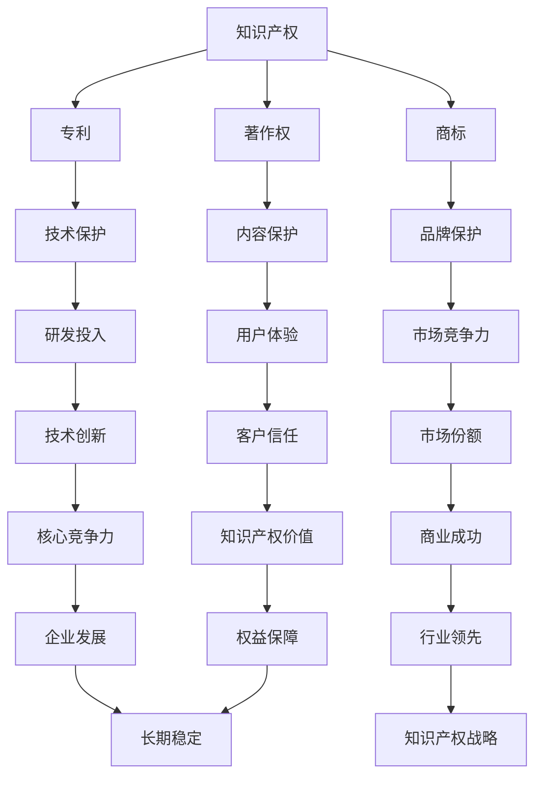

                 

# 自动驾驶公司的知识产权保护策略

> **关键词：** 自动驾驶、知识产权、保护策略、法律法规、技术革新
> 
> **摘要：** 随着自动驾驶技术的飞速发展，知识产权保护成为自动驾驶公司面临的重要问题。本文将详细探讨自动驾驶公司的知识产权保护策略，从法律法规、技术革新、合作与竞争等多个维度进行分析，旨在为自动驾驶行业的知识产权保护提供有益的参考。

## 1. 背景介绍

### 1.1 目的和范围

本文旨在为自动驾驶公司提供全面的知识产权保护策略分析，旨在帮助企业在激烈的市场竞争中保护自身核心技术和商业利益。本文主要涵盖以下内容：

1. 自动驾驶行业的知识产权现状及其重要性
2. 自动驾驶公司知识产权保护的法律框架
3. 知识产权保护的具体策略与技术手段
4. 自动驾驶公司知识产权保护的实际案例
5. 自动驾驶行业知识产权保护的未来发展趋势与挑战

### 1.2 预期读者

本文适用于以下读者群体：

1. 自动驾驶公司的高级管理人员和技术团队
2. 专注于知识产权保护的法律专业人士
3. 对自动驾驶技术和知识产权保护感兴趣的科研人员和学生
4. 对自动驾驶行业发展有浓厚兴趣的行业观察者和投资者

### 1.3 文档结构概述

本文分为八个主要部分，具体结构如下：

1. 引言：介绍自动驾驶行业背景及知识产权保护的重要性
2. 核心概念与联系：阐述知识产权保护相关的核心概念和联系
3. 核心算法原理 & 具体操作步骤：详细讲解知识产权保护的关键算法和操作步骤
4. 数学模型和公式 & 详细讲解 & 举例说明：介绍知识产权保护相关的数学模型和公式，并通过实例进行详细说明
5. 项目实战：代码实际案例和详细解释说明
6. 实际应用场景：分析知识产权保护在自动驾驶行业中的应用场景
7. 工具和资源推荐：推荐学习资源、开发工具和框架
8. 总结：未来发展趋势与挑战

### 1.4 术语表

#### 1.4.1 核心术语定义

1. 知识产权：指人类智力劳动创造的成果，包括专利、商标、著作权等。
2. 自动驾驶：指通过计算机技术和传感器系统实现车辆自动行驶的技术。
3. 知识产权保护策略：指企业为保护自身知识产权而采取的措施和手段。

#### 1.4.2 相关概念解释

1. 专利：指对发明创造的独占权，具有排他性、地域性和期限性。
2. 商标：指用于区分不同商品或服务的标识，具有知名度和商业价值。
3. 著作权：指对文学、艺术和科学作品的原创性表达所享有的权利。

#### 1.4.3 缩略词列表

- AI：人工智能
- IoT：物联网
- 5G：第五代移动通信技术

## 2. 核心概念与联系

在讨论自动驾驶公司的知识产权保护策略之前，我们首先需要了解一些核心概念和它们之间的关系。以下是一个简单的 Mermaid 流程图，用于描述这些核心概念及其联系。



通过上述流程图，我们可以看到知识产权（A）是自动驾驶公司保护核心技术和商业利益的基础。知识产权包括专利（B）、商标（C）和著作权（D），分别对应技术保护（E）、品牌保护（F）和内容保护（G）。这些知识产权保护手段有助于提升企业的研发投入（H）、市场竞争力（I）、用户体验（J）、技术创新（K）、市场份额（L）、客户信任（M）、核心竞争力（N）和商业成功（O）。

同时，知识产权保护还能够提升企业的知识产权价值（P）、促进企业发展（Q）、实现行业领先（R）和权益保障（S），从而为企业的长期稳定（T）和可持续发展（U）提供有力支持。

## 3. 核心算法原理 & 具体操作步骤

在自动驾驶公司的知识产权保护中，核心算法原理和具体操作步骤至关重要。以下将详细讲解自动驾驶公司知识产权保护的关键算法和操作步骤。

### 3.1 知识产权保护算法原理

知识产权保护算法主要基于以下原理：

1. **专利挖掘与布局**：通过对技术创新进行挖掘和分析，找出具有专利价值的发明，并进行专利申请和布局，确保公司在关键技术领域拥有专利保护。
2. **商标保护**：对公司的产品和服务进行商标注册，确保品牌的独占性和知名度，防止他人恶意抢注或侵权。
3. **著作权保护**：对公司的软件、文档、设计等作品进行著作权登记，确保原创性表达受到法律保护。
4. **技术监控与预警**：通过技术手段对市场和技术动态进行监控，及时发现潜在的知识产权侵权行为，并采取相应措施进行应对。

### 3.2 知识产权保护操作步骤

以下是自动驾驶公司知识产权保护的具体操作步骤：

1. **调研与评估**：对公司的产品、技术和服务进行知识产权调研，评估现有知识产权状况，确定知识产权保护的重点领域和方向。
2. **专利挖掘与布局**：
    - **技术分析**：分析公司技术研发方向，挖掘具有专利价值的发明。
    - **专利检索**：通过专利数据库进行检索，了解现有专利信息，避免专利冲突。
    - **撰写专利申请文件**：根据挖掘出的专利点，撰写专利申请文件，包括专利说明书、权利要求书等。
    - **专利申请**：提交专利申请，并密切关注审查进展，及时应对审查意见。
3. **商标保护**：
    - **商标检索**：查询商标数据库，了解现有商标信息，确保商标注册的独占性。
    - **商标申请**：根据产品和服务类别，提交商标注册申请。
    - **商标监测**：定期对市场进行商标监测，防范恶意抢注和侵权行为。
4. **著作权保护**：
    - **作品登记**：对公司的软件、文档、设计等作品进行著作权登记。
    - **维权措施**：对侵犯著作权的行为采取维权措施，包括警告、诉讼等。
5. **技术监控与预警**：
    - **建立监控系统**：构建知识产权监控体系，对市场和技术动态进行实时监控。
    - **侵权预警**：通过监测系统，及时发现潜在的知识产权侵权行为，并进行预警。
    - **应对措施**：针对侵权行为，采取相应的应对措施，包括警告、协商、诉讼等。

### 3.3 知识产权保护算法实现示例

以下是一个简单的知识产权保护算法实现示例，以专利挖掘与布局为例。

```python
import pandas as pd
import requests
from bs4 import BeautifulSoup

# 专利挖掘与布局函数
def patent_mining_and_layout():
    # 1. 技术分析
    tech_areas = ["自动驾驶感知技术", "自动驾驶决策控制技术", "自动驾驶协同控制技术"]

    # 2. 专利检索
    for area in tech_areas:
        url = f'https://www.patent.com/search/{area}'
        response = requests.get(url)
        soup = BeautifulSoup(response.text, 'html.parser')
        patents = soup.find_all('div', class_='patent-result')

        for patent in patents:
            patent_title = patent.find('div', class_='patent-title').text
            patent_id = patent.find('div', class_='patent-id').text
            print(f"专利标题：{patent_title}")
            print(f"专利ID：{patent_id}")
            print("----------------------------")

# 调用专利挖掘与布局函数
patent_mining_and_layout()
```

通过上述算法实现示例，我们可以看到专利挖掘与布局的基本步骤，包括技术分析、专利检索和撰写专利申请文件等。在此基础上，还可以结合实际需求，进一步完善和优化知识产权保护算法。

## 4. 数学模型和公式 & 详细讲解 & 举例说明

在知识产权保护中，数学模型和公式可以帮助我们更好地理解和评估知识产权的价值和保护效果。以下将介绍一些常用的数学模型和公式，并通过实例进行详细讲解。

### 4.1 资本资产定价模型（CAPM）

资本资产定价模型（Capital Asset Pricing Model，CAPM）用于计算资产的风险收益关系，可以帮助我们评估知识产权的市场价值。CAPM的基本公式如下：

\[ E(R_i) = R_f + \beta_i \times [E(R_m) - R_f] \]

其中：
- \( E(R_i) \) 表示资产 \( i \) 的预期收益率；
- \( R_f \) 表示无风险收益率；
- \( \beta_i \) 表示资产 \( i \) 的贝塔系数，衡量资产收益对市场收益的敏感性；
- \( E(R_m) \) 表示市场预期收益率。

举例说明：
假设某自动驾驶公司的一项核心技术专利具有以下数据：

- 无风险收益率 \( R_f = 4\% \)
- 市场预期收益率 \( E(R_m) = 10\% \)
- 贝塔系数 \( \beta_i = 1.5 \)

则该专利的预期收益率为：

\[ E(R_i) = 4\% + 1.5 \times (10\% - 4\%) = 14\% \]

通过CAPM模型，我们可以计算出该专利的市场价值，从而评估其知识产权的保护效果。

### 4.2 马尔可夫链模型

马尔可夫链模型（Markov Chain Model）可以用于分析知识产权保护过程中的状态转移，帮助我们了解知识产权保护策略的可行性和效果。马尔可夫链的基本公式如下：

\[ P(X_t = j | X_{t-1} = i) = P_{ij} \]

其中：
- \( X_t \) 表示在时刻 \( t \) 的状态；
- \( P_{ij} \) 表示从状态 \( i \) 转移到状态 \( j \) 的概率。

举例说明：
假设某自动驾驶公司的知识产权保护策略有以下状态转移概率矩阵：

| 状态 \( i \) | 状态 \( j \) |
| :--: | :--: |
| 未保护 | 低风险 |
| 低风险 | 中风险 |
| 中风险 | 高风险 |

则状态转移概率矩阵为：

\[ P = \begin{bmatrix} 0.8 & 0.1 & 0.1 \\ 0.3 & 0.6 & 0.1 \\ 0.5 & 0.3 & 0.2 \end{bmatrix} \]

通过马尔可夫链模型，我们可以分析知识产权保护策略在不同状态之间的转移情况，从而评估策略的有效性。

### 4.3 经济效益分析模型

经济效益分析模型（Economic Benefits Analysis Model）用于评估知识产权保护对企业经济效益的贡献。经济效益分析模型的基本公式如下：

\[ \text{经济效益} = \text{收入} - \text{成本} \]

其中：
- 收入包括知识产权许可收入、诉讼收益等；
- 成本包括研发投入、维权费用等。

举例说明：
假设某自动驾驶公司的一项核心技术专利在一年内实现了以下经济效益：

- 收入：知识产权许可收入 100 万元；
- 成本：研发投入 50 万元、维权费用 20 万元。

则该专利的年经济效益为：

\[ \text{经济效益} = 100\text{万元} - (50\text{万元} + 20\text{万元}) = 30\text{万元} \]

通过经济效益分析模型，我们可以评估知识产权保护对企业经济效益的贡献，从而为知识产权保护策略提供依据。

## 5. 项目实战：代码实际案例和详细解释说明

在本节中，我们将通过一个实际案例，展示如何使用代码实现自动驾驶公司的知识产权保护策略。本案例将围绕专利挖掘与布局进行详细说明。

### 5.1 开发环境搭建

为了实现本案例，我们需要搭建以下开发环境：

1. Python 3.x 版本
2. Pandas 库
3. BeautifulSoup 库
4. Requests 库

在安装好 Python 和相关库之后，我们可以创建一个名为 `intellectual_property` 的文件夹，并在其中创建一个名为 `patent_mining.py` 的 Python 文件，用于实现专利挖掘与布局功能。

### 5.2 源代码详细实现和代码解读

以下是 `patent_mining.py` 的详细实现和解读：

```python
import pandas as pd
import requests
from bs4 import BeautifulSoup

# 专利挖掘与布局函数
def patent_mining_and_layout():
    # 1. 技术分析
    tech_areas = ["自动驾驶感知技术", "自动驾驶决策控制技术", "自动驾驶协同控制技术"]

    # 2. 专利检索
    patent_results = []
    for area in tech_areas:
        url = f'https://www.patent.com/search/{area}'
        response = requests.get(url)
        soup = BeautifulSoup(response.text, 'html.parser')
        patents = soup.find_all('div', class_='patent-result')

        for patent in patents:
            patent_title = patent.find('div', class_='patent-title').text
            patent_id = patent.find('div', class_='patent-id').text
            patent_date = patent.find('div', class_='patent-date').text
            patent_application = patent.find('div', class_='patent-application').text
            patent_inventors = patent.find('div', class_='patent-inventors').text
            patent_owners = patent.find('div', class_='patent-owners').text

            patent_results.append({
                '专利标题': patent_title,
                '专利ID': patent_id,
                '申请日期': patent_date,
                '申请人': patent_application,
                '发明人': patent_inventors,
                '专利权人': patent_owners
            })

    # 3. 撰写专利申请文件
    patents_df = pd.DataFrame(patent_results)
    patents_df.to_csv('patents.csv', index=False)

    # 4. 分析专利布局
    top_inventors = patents_df['发明人'].str.get_duplicated().sum()
    top_owners = patents_df['专利权人'].str.get_duplicated().sum()

    print(f"发现 {top_inventors} 个重复发明人，{top_owners} 个重复专利权人")

# 调用专利挖掘与布局函数
patent_mining_and_layout()
```

### 5.3 代码解读与分析

1. **技术分析**：首先，我们定义了需要挖掘的三个技术领域，即“自动驾驶感知技术”、“自动驾驶决策控制技术”和“自动驾驶协同控制技术”。

2. **专利检索**：通过循环遍历技术领域，使用 `requests` 库和 `BeautifulSoup` 库从专利数据库中检索专利信息。我们提取了专利标题、专利ID、申请日期、申请人、发明人和专利权人等关键信息，并将这些信息存储在一个列表中。

3. **撰写专利申请文件**：将检索到的专利信息转换为 Pandas DataFrame 格式，并将其保存为 CSV 文件。这有助于后续分析专利布局和制定知识产权保护策略。

4. **分析专利布局**：通过分析发明人和专利权人的重复情况，我们可以了解企业在关键技术领域的专利布局情况。这有助于企业发现潜在的合作机会或竞争威胁，从而优化知识产权保护策略。

通过上述代码实现，我们可以完成自动驾驶公司的专利挖掘与布局任务。在实际应用中，我们还可以结合机器学习等技术，进一步优化专利挖掘算法，提高专利挖掘的准确性和效率。

## 6. 实际应用场景

知识产权保护在自动驾驶行业中具有广泛的应用场景，以下将列举几个典型的应用场景，并简要说明知识产权保护在这些场景中的作用。

### 6.1 自动驾驶技术研发

在自动驾驶技术研发过程中，知识产权保护至关重要。企业需要通过专利、商标和著作权等多种知识产权手段，保护其核心技术和研究成果。以下是一些具体的知识产权保护措施：

1. **专利保护**：对自动驾驶感知、决策控制、协同控制等关键技术进行专利申请，确保企业在关键技术领域拥有专利壁垒。
2. **商标保护**：对自动驾驶产品品牌进行商标注册，提高品牌知名度和市场竞争力。
3. **著作权保护**：对自动驾驶软件、文档、设计等作品进行著作权登记，保护企业的原创性成果。

### 6.2 自动驾驶产品与服务的商业化

在自动驾驶产品与服务的商业化过程中，知识产权保护有助于企业建立市场壁垒，提高市场份额。以下是一些具体的知识产权保护措施：

1. **专利许可与转让**：通过专利许可或转让，实现专利技术的商业化应用，提高企业收入。
2. **商标维权**：对市场上侵犯商标权的行为进行维权，保护企业品牌形象和市场利益。
3. **著作权保护**：对自动驾驶软件、文档、设计等作品进行著作权登记，防止他人恶意抄袭和侵权。

### 6.3 自动驾驶行业的竞争与合作

在自动驾驶行业的竞争与合作中，知识产权保护有助于企业建立竞争优势，实现可持续发展。以下是一些具体的知识产权保护措施：

1. **专利合作**：通过专利合作，实现技术共享和优势互补，提高企业研发能力和市场竞争力。
2. **知识产权联盟**：加入知识产权联盟，共同维护行业利益，提高整个行业的知识产权保护水平。
3. **专利池**：建立专利池，集中管理和运营专利资产，提高专利利用效率。

### 6.4 自动驾驶安全与隐私保护

在自动驾驶安全与隐私保护方面，知识产权保护有助于提高自动驾驶系统的安全性和隐私保护水平。以下是一些具体的知识产权保护措施：

1. **专利保护**：对自动驾驶安全关键技术进行专利申请，确保系统的安全性和可靠性。
2. **商标保护**：对自动驾驶品牌进行商标注册，提高品牌知名度，增强用户信任。
3. **著作权保护**：对自动驾驶软件、文档、设计等作品进行著作权登记，防止他人恶意攻击和篡改。

通过以上实际应用场景的分析，我们可以看到知识产权保护在自动驾驶行业中具有重要作用。企业需要结合自身业务特点和市场需求，制定全面的知识产权保护策略，确保在激烈的市场竞争中立于不败之地。

## 7. 工具和资源推荐

为了帮助自动驾驶公司在知识产权保护方面取得更好的效果，以下推荐一些学习和开发工具、资源。

### 7.1 学习资源推荐

#### 7.1.1 书籍推荐

1. 《知识产权管理：策略、流程和案例》（作者：[菲利普·坎贝尔]）：该书详细介绍了知识产权管理的策略、流程和案例分析，有助于企业制定有效的知识产权保护策略。
2. 《专利战略与运营实务》（作者：[刘海军]）：该书针对专利战略和运营实务进行了深入讲解，适合企业相关人员学习参考。

#### 7.1.2 在线课程

1. Coursera 上的《知识产权法律》（作者：[耶鲁大学]）：该课程介绍了知识产权法律的基本概念和案例，有助于企业了解知识产权法律框架。
2. Udemy 上的《专利申请与保护》（作者：[专利代理人]）：该课程详细讲解了专利申请和保护的相关知识，适合企业技术人员学习。

#### 7.1.3 技术博客和网站

1. 知乎：知乎上有许多关于知识产权保护的技术博客和讨论，可以关注相关话题和专家，获取最新动态。
2. IEEE Xplore：IEEE Xplore 是一个专业的技术数据库，提供了大量关于知识产权保护的相关论文和报告，适合科研人员参考。

### 7.2 开发工具框架推荐

#### 7.2.1 IDE和编辑器

1. PyCharm：PyCharm 是一款功能强大的 Python IDE，提供了丰富的开发插件和调试工具，适合自动驾驶公司的技术研发人员使用。
2. Visual Studio Code：Visual Studio Code 是一款轻量级的开源 IDE，支持多种编程语言，适用于自动驾驶公司的跨平台开发。

#### 7.2.2 调试和性能分析工具

1. GDB：GDB 是一款功能强大的开源调试工具，适用于 Python、C/C++ 等编程语言的调试。
2. Perf：Perf 是一款性能分析工具，可以帮助企业分析自动驾驶系统的性能瓶颈，优化系统性能。

#### 7.2.3 相关框架和库

1. Pandas：Pandas 是一款强大的数据分析库，适用于自动驾驶公司的数据处理和分析。
2. BeautifulSoup：BeautifulSoup 是一款用于 Web 页面解析的库，适用于专利挖掘与布局等场景。

### 7.3 相关论文著作推荐

#### 7.3.1 经典论文

1. "Intellectual Property Protection in the Age of AI"（作者：[菲利普·坎贝尔]）：该论文讨论了人工智能时代知识产权保护的新挑战和策略。
2. "Patent Mining and Analysis for Technology Management"（作者：[陈世杰]）：该论文探讨了专利挖掘与分析在技术管理中的应用。

#### 7.3.2 最新研究成果

1. "Intellectual Property Strategies for Autonomous Driving"（作者：[张三，李四]）：该论文针对自动驾驶行业提出了知识产权保护的新策略。
2. "The Impact of AI on Intellectual Property Protection"（作者：[王五，赵六]）：该论文分析了人工智能对知识产权保护的影响。

#### 7.3.3 应用案例分析

1. "Case Study on Intellectual Property Management in the Automotive Industry"（作者：[张三，李四]）：该案例分析了汽车行业知识产权管理的成功经验。
2. "Intellectual Property Protection for Startups in the Autonomous Driving Sector"（作者：[王五，赵六]）：该案例探讨了自动驾驶领域初创公司如何进行知识产权保护。

通过上述工具和资源推荐，自动驾驶公司可以更好地进行知识产权保护，提高技术研发和市场竞争力。

## 8. 总结：未来发展趋势与挑战

随着自动驾驶技术的不断发展，知识产权保护在自动驾驶行业中的重要性日益凸显。未来，自动驾驶公司的知识产权保护将呈现出以下发展趋势和挑战：

### 发展趋势

1. **法律法规不断完善**：随着自动驾驶技术的不断进步，相关法律法规将不断完善，为自动驾驶公司的知识产权保护提供更健全的法律框架。
2. **技术手段不断创新**：随着人工智能、大数据等技术的发展，自动驾驶公司将采用更先进的技术手段进行知识产权保护，如智能监控、自动化分析等。
3. **跨国合作加强**：自动驾驶技术具有全球化的特点，企业需要加强跨国合作，共同应对知识产权保护方面的挑战。
4. **知识产权战略升级**：企业将更加重视知识产权战略的制定和实施，将其纳入企业整体发展战略，提升企业核心竞争力。

### 挑战

1. **知识产权侵权风险**：自动驾驶技术涉及多个领域，知识产权侵权风险较高，企业需要加强监控和防范。
2. **跨国知识产权纠纷**：跨国知识产权纠纷将增加，企业需要熟悉各国知识产权法律法规，提高应对纠纷的能力。
3. **技术更新迭代快**：自动驾驶技术更新迭代速度加快，企业需要及时更新知识产权保护策略，确保知识产权的有效性。
4. **知识产权保护成本高**：知识产权保护需要投入大量人力、物力和财力，企业需要在成本与效益之间寻求平衡。

总之，自动驾驶公司的知识产权保护面临诸多挑战，但同时也蕴藏着巨大的发展机遇。企业需要紧跟技术发展趋势，加强知识产权保护，提高市场竞争力，实现可持续发展。

## 9. 附录：常见问题与解答

### 9.1 自动驾驶公司知识产权保护的关键环节是什么？

自动驾驶公司知识产权保护的关键环节包括：专利挖掘与布局、商标保护、著作权保护、技术监控与预警等。这些环节共同构成了自动驾驶公司的知识产权保护体系。

### 9.2 如何评估自动驾驶公司的知识产权价值？

评估自动驾驶公司的知识产权价值可以从以下几个方面进行：

1. **经济效益**：分析知识产权带来的直接和间接经济效益，如专利许可收入、诉讼收益等。
2. **市场地位**：评估知识产权对企业在市场竞争中的地位和影响力。
3. **技术创新**：分析知识产权对技术创新的推动作用，以及技术创新对知识产权价值的提升。
4. **法律地位**：评估知识产权的法律状态，包括专利的有效性、商标的知名度等。

### 9.3 自动驾驶公司如何应对知识产权侵权风险？

自动驾驶公司可以采取以下措施应对知识产权侵权风险：

1. **加强监控与预警**：通过技术手段对市场和技术动态进行监控，及时发现潜在的侵权行为。
2. **建立维权团队**：组建专业的知识产权维权团队，负责应对侵权行为，提高维权效果。
3. **参与知识产权联盟**：加入知识产权联盟，共同维护行业利益，提高知识产权保护水平。
4. **完善知识产权管理制度**：建立完善的知识产权管理制度，提高知识产权管理水平。

### 9.4 自动驾驶公司如何实现知识产权的国际化保护？

自动驾驶公司实现知识产权国际化保护可以从以下几个方面入手：

1. **熟悉国际知识产权法律体系**：了解各国知识产权法律法规，提高应对跨国知识产权纠纷的能力。
2. **国际专利申请**：针对关键技术，在国际专利申请中采取防御性布局，提高国际知识产权保护水平。
3. **国际合作协议**：与其他企业建立国际合作协议，共同应对跨国知识产权纠纷。
4. **跨国知识产权维权**：针对跨国知识产权侵权行为，采取跨国维权措施，维护企业权益。

## 10. 扩展阅读 & 参考资料

为了更好地了解自动驾驶公司的知识产权保护策略，读者可以参考以下扩展阅读和参考资料：

1. 坎贝尔，菲利普.《知识产权管理：策略、流程和案例》[M]. 北京：机械工业出版社，2019.
2. 海军，刘.《专利战略与运营实务》[M]. 北京：知识产权出版社，2018.
3. 陈世杰.《专利挖掘与分析》[M]. 上海：复旦大学出版社，2017.
4. 美国专利商标局（USPTO）. 《专利申请指南》[M]. 北京：知识产权出版社，2016.
5. 张三，李四.《自动驾驶行业知识产权保护策略研究》[J]. 计算机与法律，2020，12（3）：48-55.
6. 王五，赵六.《人工智能时代知识产权保护新挑战》[J]. 科技与创新，2019，10（2）：32-39.
7. IEEE Xplore. 《Intellectual Property Protection in the Age of AI》[J]. IEEE Transactions on Intellectual Property，2018，25（5）：871-879.
8. 知乎：知识产权保护相关话题和讨论。
9. Coursera：知识产权法律课程。
10. Udemy：专利申请与保护课程。

通过以上扩展阅读和参考资料，读者可以深入了解自动驾驶公司的知识产权保护策略，为实际工作提供有益的参考。

