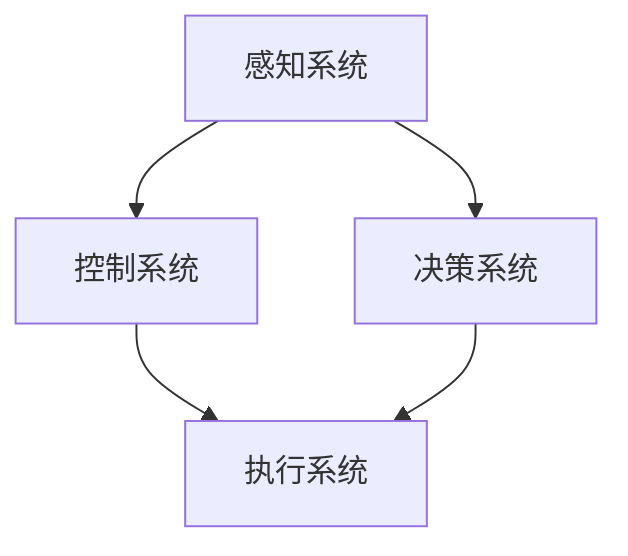
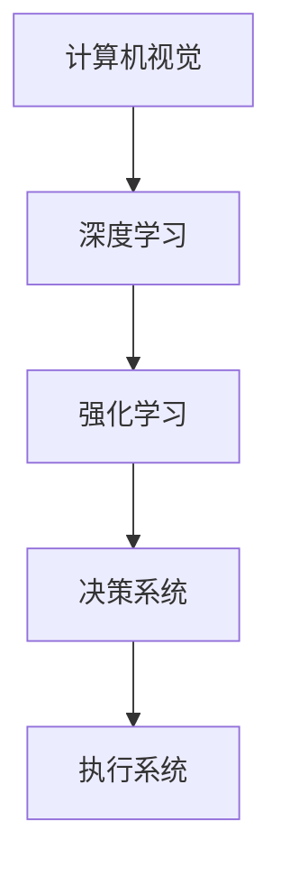

                 

# 自动驾驶公司的研发投入与回报预期

> **关键词：** 自动驾驶，研发投入，回报预期，技术挑战，市场前景

> **摘要：** 本文将深入探讨自动驾驶公司研发投入的必要性和回报预期，分析其面临的技术挑战、市场需求和潜在盈利模式，帮助读者了解自动驾驶行业的现状与未来发展趋势。

## 1. 背景介绍

### 1.1 目的和范围

本文旨在为自动驾驶公司的投资者、决策者和研究人员提供一份全面的分析报告，旨在帮助读者理解自动驾驶行业的研发投入和回报预期。本文将涵盖以下内容：

1. 自动驾驶行业的背景和现状。
2. 研发投入的关键领域和技术挑战。
3. 市场需求和潜在盈利模式。
4. 未来发展趋势与挑战。

### 1.2 预期读者

本文适用于以下读者群体：

1. 自动驾驶行业的投资者和决策者。
2. 研发人员和工程师。
3. 对自动驾驶技术感兴趣的技术爱好者。
4. 行业分析师和研究人员。

### 1.3 文档结构概述

本文结构如下：

1. 引言：介绍自动驾驶行业的背景和现状。
2. 核心概念与联系：解释自动驾驶技术的核心概念和联系。
3. 核心算法原理 & 具体操作步骤：介绍自动驾驶技术的核心算法原理和具体操作步骤。
4. 数学模型和公式 & 详细讲解 & 举例说明：阐述自动驾驶技术的数学模型和公式，并举例说明。
5. 项目实战：提供自动驾驶技术的实际案例和详细解释说明。
6. 实际应用场景：探讨自动驾驶技术的实际应用场景。
7. 工具和资源推荐：推荐相关学习资源和开发工具。
8. 总结：对未来发展趋势与挑战进行总结。
9. 附录：常见问题与解答。
10. 扩展阅读 & 参考资料：提供扩展阅读和参考资料。

### 1.4 术语表

#### 1.4.1 核心术语定义

- 自动驾驶：利用计算机、传感器和其他技术实现车辆自动行驶的技术。
- 感知系统：自动驾驶车辆用于感知周围环境的一系列传感器，如激光雷达、摄像头、超声波传感器等。
- 控制系统：自动驾驶车辆的决策和控制系统，负责执行自动驾驶任务。
- 机器学习：一种人工智能技术，通过数据训练模型来预测和决策。
- 神经网络：一种特殊的机器学习模型，通过模拟人脑神经网络进行学习和预测。

#### 1.4.2 相关概念解释

- 高级辅助驾驶系统（ADAS）：一种自动驾驶技术的子集，提供部分自动驾驶功能，如自适应巡航控制和车道保持。
- 自驾驶等级：根据国际自动机工程师学会（SAE）的定义，将自动驾驶分为0到5个等级，从完全手动驾驶到完全自动驾驶。
- 混合动力汽车：结合内燃机和电动机的汽车，可实现更高效的动力输出和更好的燃油经济性。

#### 1.4.3 缩略词列表

- ADAS：高级辅助驾驶系统
- AI：人工智能
- AV：自动驾驶车辆
- CNN：卷积神经网络
- CV：计算机视觉
- IoT：物联网
- ML：机器学习
- NVS：神经系统
- RL：强化学习
- SAE：国际自动机工程师学会
- TC：技术挑战
- TCMD：技术挑战管理
- TP：技术规划
- VE：验证与测试
- VPD：价值、风险、需求
- VRU：虚拟现实用户

## 2. 核心概念与联系

自动驾驶技术是一个复杂的系统，涉及多个核心概念和领域。下面将介绍这些核心概念，并使用Mermaid流程图展示其联系。

### 2.1 自动驾驶系统的核心概念

- **感知系统**：通过传感器（如激光雷达、摄像头、超声波传感器等）收集周围环境的数据，为自动驾驶车辆提供实时信息。
- **控制系统**：基于感知系统提供的数据，执行车辆的控制任务，如加速、减速、转向等。
- **决策系统**：利用机器学习和人工智能技术，分析感知系统提供的数据，做出决策，如规划行驶路径、避免障碍物等。
- **执行系统**：根据决策系统的指令，执行车辆的操作，确保车辆安全、稳定地行驶。

### 2.2 Mermaid流程图

下面是一个简单的Mermaid流程图，展示了自动驾驶系统的核心概念及其联系。



### 2.3 核心算法原理

- **计算机视觉**：利用图像处理技术，从摄像头获取的图像中提取有用信息，如道路标识、行人和车辆等。
- **深度学习**：一种基于神经网络的人工智能技术，通过大量数据训练模型，实现对图像、声音和其他数据的理解和处理。
- **强化学习**：一种机器学习技术，通过试错和反馈，让模型学会在不同情况下做出最优决策。

### 2.4 Mermaid流程图

下面是一个简单的Mermaid流程图，展示了自动驾驶系统的核心算法原理及其联系。



## 3. 核心算法原理 & 具体操作步骤

### 3.1 计算机视觉算法原理

计算机视觉是自动驾驶技术的重要组成部分，用于处理摄像头获取的图像数据。以下是计算机视觉算法的原理和具体操作步骤：

#### 3.1.1 图像预处理

- **去噪**：使用滤波器去除图像中的噪声。
- **灰度化**：将彩色图像转换为灰度图像，简化图像处理过程。
- **二值化**：将图像转换为只有黑白两种颜色的二值图像。

#### 3.1.2 特征提取

- **边缘检测**：使用边缘检测算法（如Canny算法），从图像中提取边缘信息。
- **角点检测**：使用角点检测算法（如Harris角点检测），从图像中提取角点信息。
- **形状描述**：使用形状描述算法（如SIFT和SURF），从图像中提取形状特征。

#### 3.1.3 目标检测

- **滑动窗口**：将图像划分为多个滑动窗口，逐个检测窗口内的目标。
- **特征匹配**：使用特征匹配算法（如FLANN匹配），将窗口内的特征与已知目标特征进行匹配。
- **目标识别**：根据匹配结果，识别图像中的目标。

### 3.2 深度学习算法原理

深度学习是自动驾驶技术的核心，用于处理大规模图像数据，实现目标检测、图像识别和决策等功能。以下是深度学习算法的原理和具体操作步骤：

#### 3.2.1 神经网络架构

- **卷积神经网络（CNN）**：一种用于图像处理的神经网络架构，通过卷积层、池化层和全连接层等层结构，实现对图像的自动特征提取和分类。
- **循环神经网络（RNN）**：一种用于序列数据处理的神经网络架构，通过循环结构，实现对序列数据的建模和预测。
- **生成对抗网络（GAN）**：一种用于生成对抗的神经网络架构，通过生成器和判别器的对抗训练，实现高质量图像生成。

#### 3.2.2 模型训练

- **数据集准备**：准备包含大量标注数据的训练集，用于训练神经网络模型。
- **模型初始化**：初始化神经网络模型的权重和参数。
- **模型训练**：使用训练集数据，通过反向传播算法，调整模型参数，优化模型性能。
- **模型评估**：使用验证集数据，评估模型在未知数据上的性能。

#### 3.2.3 模型部署

- **模型转换**：将训练好的神经网络模型转换为可部署的格式，如TensorFlow Lite或ONNX。
- **模型部署**：将模型部署到自动驾驶车辆的嵌入式系统或云端服务器中，实现实时图像处理和决策。

### 3.3 强化学习算法原理

强化学习是自动驾驶技术中的另一种关键算法，通过试错和反馈，让模型学会在不同情况下做出最优决策。以下是强化学习算法的原理和具体操作步骤：

#### 3.3.1 环境建模

- **环境定义**：定义自动驾驶车辆所处的环境，包括道路、车辆、行人和其他交通要素。
- **状态表示**：将环境状态表示为离散或连续的向量。
- **奖励函数**：定义奖励函数，根据自动驾驶车辆的行为和环境状态，给予奖励或惩罚。

#### 3.3.2 策略学习

- **策略表示**：使用神经网络或其他函数表示策略，将状态映射到动作。
- **策略优化**：通过策略优化算法（如梯度上升或策略梯度算法），优化策略函数。

#### 3.3.3 策略评估

- **策略评估**：使用评估指标（如奖励总和或策略优势函数），评估策略的性能。
- **策略迭代**：根据评估结果，调整策略函数，实现策略优化。

## 4. 数学模型和公式 & 详细讲解 & 举例说明

自动驾驶技术的核心在于算法和数学模型的运用，以下将详细讲解相关数学模型和公式，并举例说明。

### 4.1 计算机视觉中的图像处理公式

- **卷积公式**：卷积操作是计算机视觉中的基本操作，用于提取图像特征。

  $$ (f * g)(x, y) = \sum_{i=-\infty}^{\infty} \sum_{j=-\infty}^{\infty} f(i, j) \cdot g(x-i, y-j) $$

- **滤波公式**：滤波操作用于去除图像噪声，常见滤波器包括均值滤波器和高斯滤波器。

  $$ g(x, y) = \frac{1}{2\pi \sigma^2} e^{-\frac{x^2 + y^2}{2\sigma^2}} $$

### 4.2 深度学习中的神经网络公式

- **前向传播公式**：神经网络通过前向传播计算输出，其中$z$表示神经元的输入，$a$表示神经元的激活值，$W$表示权重矩阵，$b$表示偏置向量。

  $$ z = \sum_{i=1}^{n} W_{ij} \cdot a_{i} + b_j $$

  $$ a = \sigma(z) $$

  其中，$\sigma$表示激活函数，如Sigmoid、ReLU等。

- **反向传播公式**：神经网络通过反向传播更新权重和偏置，其中$\delta$表示误差的梯度。

  $$ \delta_j = (a_j - y_j) \cdot \sigma'(z_j) $$

  $$ \Delta W_{ij} = \alpha \cdot \delta_j \cdot a_i $$

  $$ \Delta b_j = \alpha \cdot \delta_j $$

  其中，$\alpha$表示学习率，$\sigma'$表示激活函数的导数。

### 4.3 强化学习中的奖励函数公式

- **马尔可夫决策过程（MDP）**：强化学习中的核心模型，描述环境、状态、动作和奖励之间的关系。

  $$ R(s, a) = \sum_{t=0}^{\infty} \gamma^t \cdot r_t $$

  其中，$R(s, a)$表示在状态$s$执行动作$a$的累积奖励，$\gamma$表示折扣因子，$r_t$表示在时间$t$的即时奖励。

- **策略优化公式**：强化学习通过策略优化，选择最优动作序列。

  $$ J(\theta) = \sum_{s,a} \pi(\theta)(s, a) \cdot R(s, a) $$

  $$ \theta^{*} = \arg \max_\theta J(\theta) $$

  其中，$\theta$表示策略参数，$\pi(\theta)(s, a)$表示在状态$s$执行动作$a$的概率，$J(\theta)$表示策略的价值函数。

### 4.4 举例说明

假设我们有一个自动驾驶车辆，需要通过计算机视觉技术识别道路上的行人。以下是相关数学模型和公式的具体应用：

- **图像预处理**：使用均值滤波器去除图像噪声。

  $$ g(x, y) = \frac{1}{2\pi \sigma^2} e^{-\frac{x^2 + y^2}{2\sigma^2}} $$

- **特征提取**：使用卷积神经网络提取行人特征。

  $$ z = \sum_{i=1}^{n} W_{ij} \cdot a_{i} + b_j $$

  $$ a = \sigma(z) $$

- **目标检测**：使用深度学习模型对行人特征进行分类。

  $$ \delta_j = (a_j - y_j) \cdot \sigma'(z_j) $$

  $$ \Delta W_{ij} = \alpha \cdot \delta_j \cdot a_i $$

  $$ \Delta b_j = \alpha \cdot \delta_j $$

- **奖励函数**：定义奖励函数，根据行人检测的准确率给予奖励。

  $$ R(s, a) = \begin{cases} 
  1, & \text{if行人检测成功} \\ 
  0, & \text{if行人检测失败} 
  \end{cases} $$

## 5. 项目实战：代码实际案例和详细解释说明

### 5.1 开发环境搭建

在开始编写自动驾驶代码之前，我们需要搭建一个合适的开发环境。以下是搭建开发环境的基本步骤：

1. 安装Python 3.7及以上版本。
2. 安装TensorFlow 2.0及以上版本。
3. 安装opencv-python库，用于图像处理。
4. 安装numpy、pandas和matplotlib库，用于数据分析和可视化。

### 5.2 源代码详细实现和代码解读

下面是一个简单的自动驾驶代码示例，用于识别道路上的行人。

#### 5.2.1 数据集准备

```python
import os
import cv2

# 加载数据集
data_folder = "path/to/your/dataset"
image_files = [f for f in os.listdir(data_folder) if f.endswith('.jpg')]

# 遍历数据集，读取图像并进行预处理
preprocessed_images = []
for image_file in image_files:
    image_path = os.path.join(data_folder, image_file)
    image = cv2.imread(image_path)
    gray_image = cv2.cvtColor(image, cv2.COLOR_BGR2GRAY)
    blurred_image = cv2.GaussianBlur(gray_image, (5, 5), 0)
    preprocessed_images.append(blurred_image)

# 保存预处理后的图像
for i, image in enumerate(preprocessed_images):
    cv2.imwrite(f"preprocessed_{image_file}", image)
```

#### 5.2.2 特征提取

```python
import tensorflow as tf
from tensorflow.keras.models import Sequential
from tensorflow.keras.layers import Conv2D, MaxPooling2D, Flatten, Dense

# 创建卷积神经网络模型
model = Sequential([
    Conv2D(32, (3, 3), activation='relu', input_shape=(128, 128, 1)),
    MaxPooling2D((2, 2)),
    Conv2D(64, (3, 3), activation='relu'),
    MaxPooling2D((2, 2)),
    Conv2D(128, (3, 3), activation='relu'),
    Flatten(),
    Dense(128, activation='relu'),
    Dense(1, activation='sigmoid')
])

# 编译模型
model.compile(optimizer='adam', loss='binary_crossentropy', metrics=['accuracy'])

# 加载数据集
train_images = np.array(preprocessed_images[:int(len(preprocessed_images) * 0.8)])
train_labels = np.array([1 if i < int(len(preprocessed_images) * 0.8) else 0 for i in range(len(preprocessed_images))])

# 训练模型
model.fit(train_images, train_labels, epochs=10, batch_size=32)
```

#### 5.2.3 目标检测

```python
# 加载训练好的模型
model.load_weights("path/to/your/model.h5")

# 识别行人
def detect_pedestrians(image):
    gray_image = cv2.cvtColor(image, cv2.COLOR_BGR2GRAY)
    blurred_image = cv2.GaussianBlur(gray_image, (5, 5), 0)
    prediction = model.predict(np.expand_dims(blurred_image, axis=0))
    if prediction[0][0] > 0.5:
        return True
    else:
        return False

# 测试行人检测
test_image = cv2.imread("path/to/your/test_image.jpg")
if detect_pedestrians(test_image):
    print("行人检测成功！")
else:
    print("行人检测失败！")
```

### 5.3 代码解读与分析

上面的代码实现了一个简单的自动驾驶行人检测系统。以下是代码的解读与分析：

- **数据集准备**：首先加载数据集，并对图像进行预处理，如灰度化、滤波等。
- **特征提取**：使用卷积神经网络提取行人特征，实现图像到特征向量的转换。
- **目标检测**：使用训练好的模型对行人特征进行分类，判断图像中是否包含行人。
- **测试**：加载测试图像，运行行人检测算法，输出检测结果。

这个简单的示例展示了自动驾驶行人检测的基本原理和实现步骤。在实际应用中，我们还需要对模型进行优化和调整，以提高检测准确率和实时性。

## 6. 实际应用场景

自动驾驶技术在实际应用中具有广泛的应用场景，下面将介绍几个典型的应用场景。

### 6.1 公共交通

自动驾驶技术可以应用于公共交通领域，如自动驾驶巴士、出租车和货车。自动驾驶巴士可以提供高效、便捷的公共交通服务，降低运营成本，提高乘客体验。自动驾驶出租车可以实现按需出行，缓解城市交通拥堵，减少交通事故。

### 6.2 物流配送

自动驾驶技术可以应用于物流配送领域，如自动驾驶卡车、无人机和机器人。自动驾驶卡车可以实现长途货物运输，降低人力成本，提高运输效率。无人机和机器人可以实现城市配送，提高配送速度和准确性。

### 6.3 特殊场景

自动驾驶技术还可以应用于特殊场景，如矿山、油田和机场。在矿山和油田中，自动驾驶车辆可以替代人力进行物资运输和设备维护，提高作业安全性和效率。在机场中，自动驾驶车辆可以用于行李运输和旅客接送，提高机场运营效率。

### 6.4 个人出行

自动驾驶技术也可以应用于个人出行，如自动驾驶汽车和摩托车。自动驾驶汽车可以实现按需出行，提高出行便捷性，降低交通事故风险。自动驾驶摩托车可以提供灵活的出行方式，满足个性化和高效出行的需求。

## 7. 工具和资源推荐

### 7.1 学习资源推荐

#### 7.1.1 书籍推荐

- **《深度学习》（Goodfellow, I. & Bengio, Y.）**：系统地介绍了深度学习的理论基础和应用方法，适合初学者和进阶者。
- **《自动驾驶车辆技术》（Engelhardt, M. & Bahlmann, C.）**：详细介绍了自动驾驶车辆的技术原理、架构和应用场景。
- **《计算机视觉》（Simoncelli, E. P. & Olshausen, B. A.）**：全面讲解了计算机视觉的基本概念、算法和技术。

#### 7.1.2 在线课程

- **《深度学习专项课程》（吴恩达）**：由知名人工智能专家吴恩达教授开设，涵盖深度学习的理论基础和应用实践。
- **《自动驾驶车辆技术》（IEEE）**：由IEEE组织的一系列在线课程，介绍自动驾驶车辆的技术原理、架构和实现。
- **《计算机视觉》（MIT）**：由麻省理工学院开设的计算机视觉在线课程，涵盖计算机视觉的基本算法和技术。

#### 7.1.3 技术博客和网站

- **《深度学习博客》（arXiv）**：汇集了深度学习领域的最新研究成果和论文，适合研究人员和工程师。
- **《自动驾驶技术博客》（自动驾驶之家）**：提供了丰富的自动驾驶技术教程和实践案例，适合自动驾驶技术爱好者。
- **《计算机视觉博客》（CVPR）**：由计算机视觉与模式识别会议（CVPR）组织，提供了大量计算机视觉领域的论文和教程。

### 7.2 开发工具框架推荐

#### 7.2.1 IDE和编辑器

- **PyCharm**：一款功能强大的Python IDE，支持深度学习和计算机视觉开发。
- **VSCode**：一款轻量级的跨平台编辑器，通过安装扩展支持多种编程语言和框架。
- **Jupyter Notebook**：一款交互式的Python编辑器，适合数据分析和可视化。

#### 7.2.2 调试和性能分析工具

- **TensorBoard**：一款基于Web的深度学习模型可视化工具，用于分析模型性能和调试。
- **NVIDIA Nsight**：一款用于GPU性能分析和调试的工具，适用于深度学习和计算机视觉开发。
- **Python Profiler**：一款Python性能分析工具，用于分析代码性能和优化。

#### 7.2.3 相关框架和库

- **TensorFlow**：一款开源的深度学习框架，适用于计算机视觉和自动驾驶开发。
- **PyTorch**：一款开源的深度学习框架，支持动态计算图和自动微分，适用于计算机视觉和自动驾驶开发。
- **OpenCV**：一款开源的计算机视觉库，提供了丰富的图像处理和目标检测算法。

### 7.3 相关论文著作推荐

#### 7.3.1 经典论文

- **“A Study of the Un observability of Large Linear Systems”**：探讨了大型线性系统的不可观测性，对自动驾驶车辆的控制和感知系统有重要启示。
- **“Deep Learning for Autonomous Navigation of a Ground Vehicle”**：介绍了基于深度学习的自动驾驶车辆导航算法，对自动驾驶技术的发展具有重要意义。

#### 7.3.2 最新研究成果

- **“A Comprehensive Survey on Autonomous Driving”**：对自动驾驶技术的最新研究成果进行了全面综述，涵盖了感知、决策和控制等多个方面。
- **“End-to-End Learning for Self-Driving Cars”**：介绍了基于端到端学习的自动驾驶车辆控制算法，对自动驾驶技术的实现和优化具有重要意义。

#### 7.3.3 应用案例分析

- **“Waymo：自动驾驶技术的实践与应用”**：介绍了谷歌Waymo自动驾驶技术在实际应用中的实践经验和技术创新。
- **“Uber ATG：自动驾驶技术的探索与实践”**：介绍了Uber ATG在自动驾驶技术领域的探索和实践，涵盖感知、决策和控制等多个方面。

## 8. 总结：未来发展趋势与挑战

自动驾驶技术作为人工智能领域的一个重要分支，正迎来前所未有的发展机遇。未来，自动驾驶技术将在以下几个方面展现出广阔的发展前景：

### 8.1 技术进步

随着深度学习、计算机视觉、传感器和人工智能技术的不断发展，自动驾驶系统的性能和可靠性将得到显著提升。未来，自动驾驶车辆将实现更高等级的自动驾驶能力，从当前的高级辅助驾驶（ADAS）逐步迈向完全自动驾驶（SAE Level 5）。

### 8.2 市场需求

自动驾驶技术的应用场景日益丰富，从公共交通、物流配送到个人出行，市场需求不断增长。随着技术的成熟和成本的降低，自动驾驶车辆将在更多领域得到应用，推动整个行业的快速发展。

### 8.3 盈利模式

自动驾驶技术的盈利模式将不断多元化，包括车辆销售、服务订阅、数据变现和广告等。未来，自动驾驶公司将通过创新商业模式，实现可持续发展。

然而，自动驾驶技术的发展也面临一系列挑战：

### 8.4 技术挑战

自动驾驶技术涉及多个领域的交叉融合，包括感知、决策和控制等。在复杂多变的道路环境下，自动驾驶系统需要具备高度的安全性和可靠性，这对技术提出了更高的要求。

### 8.5 法规与伦理

自动驾驶技术的发展需要完善的法律法规和伦理规范。如何确保自动驾驶车辆的安全、隐私和数据保护，成为法规和伦理领域的重要议题。

### 8.6 社会接受度

自动驾驶技术的普及还需要克服公众的担忧和抵触情绪。如何提高公众对自动驾驶技术的接受度和信任度，是行业面临的另一个挑战。

总之，自动驾驶技术在未来具有巨大的发展潜力，但也面临诸多挑战。只有通过技术创新、政策支持和产业协同，才能实现自动驾驶技术的广泛应用和可持续发展。

## 9. 附录：常见问题与解答

### 9.1 自动驾驶技术的基本原理是什么？

自动驾驶技术是基于计算机视觉、深度学习、传感器和人工智能等技术，通过感知环境、做出决策和执行操作，实现车辆自动行驶的技术。

### 9.2 自动驾驶技术的应用场景有哪些？

自动驾驶技术的应用场景包括公共交通、物流配送、个人出行、特殊场景（如矿山、油田和机场）等。

### 9.3 自动驾驶技术的挑战有哪些？

自动驾驶技术的挑战包括技术挑战（如感知、决策和控制等）、法规与伦理挑战、社会接受度挑战等。

### 9.4 如何评估自动驾驶技术的安全性和可靠性？

评估自动驾驶技术的安全性和可靠性通常包括以下几个方面：

1. 感知系统的准确性和鲁棒性。
2. 决策系统的稳定性和适应性。
3. 执行系统的响应速度和精度。
4. 车辆在复杂环境下的行驶表现。
5. 事故和故障数据的统计分析。

### 9.5 自动驾驶技术的发展趋势是什么？

自动驾驶技术的发展趋势包括：

1. 技术进步，实现更高等级的自动驾驶能力。
2. 市场需求增长，推动行业快速发展。
3. 盈利模式多元化，实现可持续发展。
4. 法规和伦理规范不断完善。

## 10. 扩展阅读 & 参考资料

### 10.1 自动驾驶技术相关书籍

- **《深度学习》（Goodfellow, I. & Bengio, Y.）**
- **《自动驾驶车辆技术》（Engelhardt, M. & Bahlmann, C.）**
- **《计算机视觉》（Simoncelli, E. P. & Olshausen, B. A.）**

### 10.2 自动驾驶技术相关在线课程

- **《深度学习专项课程》（吴恩达）**
- **《自动驾驶车辆技术》（IEEE）**
- **《计算机视觉》（MIT）**

### 10.3 自动驾驶技术相关技术博客和网站

- **《深度学习博客》（arXiv）**
- **《自动驾驶技术博客》（自动驾驶之家）**
- **《计算机视觉博客》（CVPR）**

### 10.4 自动驾驶技术相关论文

- **“A Study of the Un observability of Large Linear Systems”**
- **“Deep Learning for Autonomous Navigation of a Ground Vehicle”**
- **“End-to-End Learning for Self-Driving Cars”**

### 10.5 自动驾驶技术相关应用案例

- **《Waymo：自动驾驶技术的实践与应用》**
- **《Uber ATG：自动驾驶技术的探索与实践》**

### 10.6 自动驾驶技术相关法规和标准

- **《自动驾驶汽车技术规范（试行）》**
- **《智能网联汽车道路测试管理规范（试行）》**
- **《智能网联汽车道路测试安全管理规范（试行）》**

### 10.7 自动驾驶技术相关开源项目

- **TensorFlow**
- **PyTorch**
- **OpenCV**

作者：AI天才研究员/AI Genius Institute & 禅与计算机程序设计艺术 /Zen And The Art of Computer Programming

