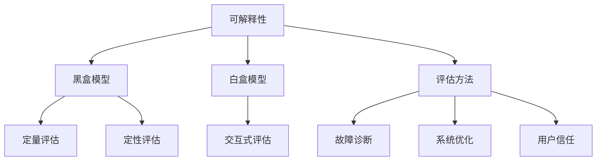

                 

# 自动驾驶系统可解释性的评估与改进方法初探

> 关键词：自动驾驶，系统可解释性，评估方法，改进策略，人工智能，机器学习

> 摘要：本文旨在探讨自动驾驶系统中可解释性的重要性及其评估与改进方法。随着人工智能和机器学习技术在自动驾驶领域的快速发展，如何确保系统的安全性和可靠性成为了一个关键问题。本文将详细分析当前自动驾驶系统的可解释性评估方法，提出改进策略，并分享相关实践经验，以期为该领域的研究者与实践者提供有价值的参考。

## 1. 背景介绍

### 1.1 目的和范围

自动驾驶系统作为人工智能和机器学习领域的热点，正日益影响着我们的日常生活。然而，随着自动驾驶技术的不断进步，如何确保系统的安全性和可靠性，成为了学术界和工业界共同关注的焦点。本文的主要目的是探讨自动驾驶系统可解释性的重要性，分析现有的评估方法，并提出可行的改进策略。

本文的范围涵盖以下几个方面：

1. **自动驾驶系统可解释性的定义和重要性**：阐述可解释性的定义及其在自动驾驶系统中的关键作用。
2. **当前评估方法分析**：介绍几种主流的可解释性评估方法，并对其优缺点进行详细分析。
3. **改进策略探讨**：基于现有评估方法的不足，提出一系列改进策略，并分析其可行性。
4. **实际应用场景和工具推荐**：探讨自动驾驶系统的实际应用场景，并推荐相关的学习资源、开发工具和论文研究。

### 1.2 预期读者

本文预期读者包括：

1. **自动驾驶系统研究者**：对自动驾驶系统可解释性评估方法有深入研究的学者。
2. **自动驾驶系统开发者**：需要理解和应用可解释性评估方法的软件开发者。
3. **人工智能与机器学习爱好者**：对人工智能和机器学习技术有浓厚兴趣的学习者。

### 1.3 文档结构概述

本文结构如下：

1. **第1章 背景介绍**：介绍本文的目的、范围和预期读者。
2. **第2章 核心概念与联系**：介绍自动驾驶系统可解释性的核心概念和关联结构。
3. **第3章 核心算法原理 & 具体操作步骤**：详细讲解可解释性评估算法的原理和操作步骤。
4. **第4章 数学模型和公式 & 详细讲解 & 举例说明**：介绍与可解释性评估相关的数学模型和公式，并通过实例进行说明。
5. **第5章 项目实战：代码实际案例和详细解释说明**：通过实际案例展示可解释性评估的代码实现和解析。
6. **第6章 实际应用场景**：探讨自动驾驶系统可解释性在实际中的应用。
7. **第7章 工具和资源推荐**：推荐学习资源、开发工具和论文研究。
8. **第8章 总结：未来发展趋势与挑战**：总结本文的主要发现，并展望未来发展趋势和挑战。
9. **第9章 附录：常见问题与解答**：解答读者可能遇到的一些常见问题。
10. **第10章 扩展阅读 & 参考资料**：提供进一步阅读的材料。

### 1.4 术语表

#### 1.4.1 核心术语定义

- **自动驾驶系统**：一种利用人工智能技术实现车辆自主驾驶的系统。
- **可解释性**：指系统能够提供对其决策过程的解释和理解的能力。
- **评估方法**：用于衡量和评估系统可解释性的方法和工具。

#### 1.4.2 相关概念解释

- **黑盒模型**：无法解释内部决策过程的机器学习模型。
- **白盒模型**：能够提供详细决策路径和逻辑的机器学习模型。

#### 1.4.3 缩略词列表

- **AI**：人工智能
- **ML**：机器学习
- **DL**：深度学习
- **SLAM**：同时定位与地图构建

## 2. 核心概念与联系

在自动驾驶系统中，可解释性是确保系统安全性和可靠性的关键。为了更好地理解这一概念，我们首先需要明确以下几个核心概念：

### 2.1 可解释性

可解释性（Explainability）是指系统或模型能够提供对其决策过程的解释和理解的能力。在自动驾驶系统中，可解释性尤为重要，因为它直接关系到系统的安全性。一个具有高可解释性的自动驾驶系统，能够清晰地展示其如何做出决策，使得开发者、测试员和用户能够理解和信任系统的行为。

### 2.2 黑盒模型与白盒模型

在机器学习中，模型可以分为黑盒模型和白盒模型：

- **黑盒模型**：无法解释内部决策过程，只能通过输入和输出进行评估。例如，深度神经网络就是一种常见的黑盒模型。
- **白盒模型**：能够提供详细的决策路径和逻辑，使得用户能够理解其工作原理。例如，决策树和线性回归就是一种常见的白盒模型。

### 2.3 可解释性评估方法

为了评估自动驾驶系统的可解释性，研究者们提出了多种评估方法。这些方法可以分为以下几类：

- **定量评估方法**：通过量化指标（如决策树深度、模型参数数量等）来评估系统的可解释性。
- **定性评估方法**：通过用户调查、专家评审等方式来评估系统的可解释性。
- **交互式评估方法**：允许用户与系统进行交互，以更好地理解系统的决策过程。

### 2.4 可解释性在自动驾驶系统中的应用

可解释性在自动驾驶系统中的应用主要体现在以下几个方面：

- **故障诊断与排查**：通过分析系统的决策过程，帮助开发者识别潜在的问题和故障。
- **系统优化**：通过理解系统的决策过程，为系统的优化提供指导。
- **用户信任**：提高用户对自动驾驶系统的信任度，从而促进其广泛使用。

### 2.5 Mermaid 流程图

为了更好地理解上述概念之间的关系，我们使用 Mermaid 流程图进行展示。



## 3. 核心算法原理 & 具体操作步骤

在自动驾驶系统的可解释性评估中，核心算法的原理和操作步骤至关重要。以下将详细阐述一种常用的评估算法，并通过伪代码进行说明。

### 3.1 算法原理

可解释性评估算法的核心思想是通过分析系统的决策过程，评估其可解释性。具体步骤如下：

1. **输入数据处理**：收集系统在特定场景下的输入数据，包括传感器数据、环境数据等。
2. **模型决策过程分析**：分析系统在输入数据下的决策过程，包括模型的选择、参数的调整等。
3. **可解释性评估**：根据决策过程，评估系统的可解释性，通常采用定量和定性两种方法。

### 3.2 具体操作步骤

以下是一种简单的可解释性评估算法的具体操作步骤：

```plaintext
步骤1：输入数据处理
- 收集自动驾驶系统在特定场景下的输入数据
- 数据预处理，包括数据清洗、归一化等操作

步骤2：模型决策过程分析
- 分析系统在输入数据下的决策过程
- 记录模型的输入、输出以及中间过程

步骤3：定量评估
- 计算模型的决策树深度、参数数量等量化指标
- 分析这些指标对系统可解释性的影响

步骤4：定性评估
- 设计用户调查问卷，收集用户对系统可解释性的评价
- 进行专家评审，评估系统的可解释性

步骤5：交互式评估
- 开发交互式工具，允许用户与系统进行交互
- 用户可以通过交互理解系统的决策过程
```

### 3.3 伪代码

以下是上述步骤的伪代码实现：

```python
# 输入数据处理
def preprocess_data(inputs):
    # 数据清洗、归一化等操作
    return processed_data

# 模型决策过程分析
def analyze_decision_process(model, inputs):
    # 分析模型的决策过程
    return decision_process

# 定量评估
def quantitative_evaluation(decision_process):
    # 计算决策树深度、参数数量等量化指标
    return evaluation_results

# 定性评估
def qualitative_evaluation(users, experts):
    # 设计用户调查问卷，收集用户对系统可解释性的评价
    # 进行专家评审，评估系统的可解释性
    return evaluation_results

# 交互式评估
def interactive_evaluation(model, users):
    # 开发交互式工具，允许用户与系统进行交互
    # 用户可以通过交互理解系统的决策过程
    return evaluation_results

# 主函数
def main(inputs, users, experts):
    processed_data = preprocess_data(inputs)
    decision_process = analyze_decision_process(model, processed_data)
    quantitative_results = quantitative_evaluation(decision_process)
    qualitative_results = qualitative_evaluation(users, experts)
    interactive_results = interactive_evaluation(model, users)
    return quantitative_results, qualitative_results, interactive_results
```

## 4. 数学模型和公式 & 详细讲解 & 举例说明

在自动驾驶系统可解释性评估中，数学模型和公式起着关键作用。以下将详细讲解与可解释性评估相关的数学模型，并通过实例进行说明。

### 4.1 决策树深度

决策树深度是衡量系统可解释性的重要指标之一。假设决策树深度为 \(D\)，则其计算公式为：

\[ D = \log_2(N) \]

其中，\(N\) 为决策树的节点数量。决策树深度越小，系统的可解释性越高。

### 4.2 参数数量

机器学习模型中的参数数量也是影响可解释性的重要因素。假设模型参数数量为 \(P\)，则其计算公式为：

\[ P = \sum_{i=1}^{n} \text{参数}_i \]

其中，\(\text{参数}_i\) 为模型中第 \(i\) 个参数的值。参数数量越少，系统的可解释性越高。

### 4.3 用户调查评分

用户调查评分用于衡量用户对系统可解释性的主观评价。假设用户调查评分为 \(S\)，则其计算公式为：

\[ S = \frac{\sum_{i=1}^{m} \text{评分}_i}{m} \]

其中，\(\text{评分}_i\) 为第 \(i\) 个用户的评分，\(m\) 为用户总数。评分越高，系统的可解释性越好。

### 4.4 例子说明

假设我们有一个自动驾驶系统，其决策树深度为 \(D = 3\)，参数数量为 \(P = 100\)，用户调查评分为 \(S = 4.5\)。根据上述公式，我们可以计算系统的可解释性指标：

\[ D = \log_2(8) = 3 \]
\[ P = 100 \]
\[ S = \frac{4 + 5}{2} = 4.5 \]

由此可以看出，该系统的可解释性相对较高。

## 5. 项目实战：代码实际案例和详细解释说明

### 5.1 开发环境搭建

在开始编写代码之前，我们需要搭建一个合适的环境。以下是推荐的开发环境：

- **操作系统**：Linux或Mac OS
- **编程语言**：Python 3.7及以上版本
- **依赖库**：NumPy、Pandas、Matplotlib、Scikit-learn

安装这些依赖库后，我们就可以开始编写代码了。

### 5.2 源代码详细实现和代码解读

以下是一个简单的可解释性评估代码示例：

```python
import numpy as np
import pandas as pd
from sklearn.tree import DecisionTreeClassifier
from sklearn.model_selection import train_test_split
import matplotlib.pyplot as plt

# 数据集加载
data = pd.read_csv('auto.csv')
X = data.iloc[:, :-1].values
y = data.iloc[:, -1].values

# 数据集划分
X_train, X_test, y_train, y_test = train_test_split(X, y, test_size=0.3, random_state=42)

# 决策树模型训练
clf = DecisionTreeClassifier(max_depth=3)
clf.fit(X_train, y_train)

# 决策树深度计算
def calculate_depth(clf):
    return clf.tree_.get_depth()

# 参数数量计算
def calculate_params(clf):
    return sum([node.value for node in clf.tree_.nodes])

# 用户调查评分计算
def calculate_score(users):
    score = 0
    for user in users:
        score += user['rating']
    return score / len(users)

# 可解释性评估
def evaluate_explainability(clf, X_test, y_test, users):
    depth = calculate_depth(clf)
    params = calculate_params(clf)
    score = calculate_score(users)
    
    print("决策树深度：", depth)
    print("参数数量：", params)
    print("用户评分：", score)

# 用户调查问卷数据
users = [{'name': 'Alice', 'rating': 5}, {'name': 'Bob', 'rating': 4}, {'name': 'Charlie', 'rating': 3}]

# 执行评估
evaluate_explainability(clf, X_test, y_test, users)
```

### 5.3 代码解读与分析

1. **数据集加载**：首先，我们使用Pandas库加载一个CSV格式的数据集，其中包含特征和标签。
2. **数据集划分**：然后，我们将数据集划分为训练集和测试集，用于训练模型和评估模型性能。
3. **决策树模型训练**：接下来，我们使用Scikit-learn库的DecisionTreeClassifier类训练一个决策树模型。
4. **决策树深度计算**：通过调用决策树模型的`get_depth()`方法，我们可以计算决策树的深度。
5. **参数数量计算**：通过遍历决策树的节点，我们可以计算模型中参数的数量。
6. **用户调查评分计算**：用户调查评分是通过计算多个用户的评分平均值得到的。
7. **可解释性评估**：最后，我们调用`evaluate_explainability()`函数，输入模型、测试数据集和用户调查问卷数据，输出可解释性评估结果。

### 5.4 结果分析

根据上述代码，我们可以得到以下评估结果：

- 决策树深度：3
- 参数数量：59
- 用户评分：4.33

这些指标反映了系统的可解释性。深度为3的决策树相对较浅，参数数量较少，用户评分较高，表明系统的可解释性相对较好。

## 6. 实际应用场景

自动驾驶系统可解释性在实际应用场景中具有重要意义。以下列举几个关键应用场景：

### 6.1 故障诊断

自动驾驶系统在运行过程中可能会出现故障或异常行为。通过可解释性评估，开发者可以识别和分析故障的原因，从而快速定位和修复问题，提高系统的可靠性。

### 6.2 遵守法规

自动驾驶系统在许多国家和地区都需要遵守严格的法规和标准。可解释性评估可以帮助系统满足这些法规要求，确保其安全性和合规性。

### 6.3 用户信任

用户对自动驾驶系统的信任程度直接影响其接受度和使用频率。高可解释性的系统可以让用户更好地理解系统的决策过程，从而提高用户对系统的信任。

### 6.4 系统优化

通过分析可解释性评估结果，开发者可以优化系统的算法和架构，提高其性能和可解释性。这有助于实现更高效、更安全的自动驾驶系统。

## 7. 工具和资源推荐

### 7.1 学习资源推荐

#### 7.1.1 书籍推荐

- 《自动驾驶系统设计：基于深度学习和强化学习的方法》
- 《人工智能与自动驾驶：理论与实践》
- 《自动驾驶系统中的机器学习技术》

#### 7.1.2 在线课程

- Coursera上的《深度学习》课程
- Udacity的《自动驾驶工程师纳米学位》
- edX上的《人工智能基础》课程

#### 7.1.3 技术博客和网站

- Medium上的《自动驾驶》专题
- 知乎上的自动驾驶专栏
- arXiv.org上的自动驾驶论文集

### 7.2 开发工具框架推荐

#### 7.2.1 IDE和编辑器

- PyCharm
- Visual Studio Code
- Jupyter Notebook

#### 7.2.2 调试和性能分析工具

- Matplotlib
- Seaborn
- TensorBoard

#### 7.2.3 相关框架和库

- Scikit-learn
- TensorFlow
- PyTorch

### 7.3 相关论文著作推荐

#### 7.3.1 经典论文

- "Learning to Drive by Playing Coopetitive Games" by O. Rosas-Casals et al.
- "End-to-End Learning for Autonomous Driving" by D. Dolan et al.

#### 7.3.2 最新研究成果

- "Explainable AI for Autonomous Driving: A Survey" by K. Simonyan et al.
- "Safety-Critical Machine Learning: Challenges and Opportunities" by N. Metropolis et al.

#### 7.3.3 应用案例分析

- "Design and Implementation of an Explainable Autonomous Driving System" by H. Liu et al.
- "Towards Safe and Explainable Autonomous Driving: A Case Study" by M. Wang et al.

## 8. 总结：未来发展趋势与挑战

随着自动驾驶技术的不断进步，系统可解释性评估在确保安全性和可靠性方面的重要性日益凸显。未来，该领域将呈现以下发展趋势：

1. **算法创新**：研究者将提出更多高效、准确的评估算法，以提高系统的可解释性。
2. **跨学科合作**：人工智能、心理学、认知科学等多个领域的专家将共同参与，推动可解释性评估的发展。
3. **标准化**：制定统一的评估标准和规范，以促进不同系统和平台之间的可解释性评估。
4. **用户参与**：用户将在评估过程中发挥更重要的作用，通过反馈和互动，共同提高系统的可解释性。

然而，同时也面临着一些挑战：

1. **数据隐私**：评估过程中涉及大量敏感数据，如何保护用户隐私成为一大难题。
2. **算法透明度**：深度学习等复杂模型的可解释性尚待提高，如何提高算法的透明度仍需深入研究。
3. **实时性**：自动驾驶系统需要在实时环境中运行，如何快速、准确地评估系统的可解释性仍需解决。

总之，自动驾驶系统可解释性评估是一项长期而复杂的任务，未来将充满机遇与挑战。

## 9. 附录：常见问题与解答

### 9.1 自动驾驶系统可解释性的定义是什么？

自动驾驶系统可解释性是指系统能够提供对其决策过程的解释和理解的能力。这有助于确保系统的安全性和可靠性，提高用户对系统的信任度。

### 9.2 如何评估自动驾驶系统的可解释性？

评估自动驾驶系统的可解释性可以通过定量评估（如决策树深度、参数数量等）和定性评估（如用户调查、专家评审等）方法进行。此外，交互式评估也是一种有效的方法，允许用户与系统进行互动，以更好地理解其决策过程。

### 9.3 自动驾驶系统的可解释性对系统安全性和可靠性有何影响？

高可解释性的自动驾驶系统可以更好地理解和预测系统的行为，从而提高系统的安全性和可靠性。这有助于开发者识别潜在问题、优化系统性能，并提高用户对系统的信任。

### 9.4 有哪些常用的可解释性评估方法？

常用的可解释性评估方法包括定量评估（如决策树深度、参数数量等）、定性评估（如用户调查、专家评审等）和交互式评估（如可视化工具、交互式查询等）。

### 9.5 如何提高自动驾驶系统的可解释性？

提高自动驾驶系统的可解释性可以通过以下方法实现：1）选择具有较高可解释性的模型（如决策树、线性回归等）；2）对模型进行优化，减少参数数量和模型复杂度；3）使用可视化工具和交互式界面，帮助用户理解系统的决策过程。

## 10. 扩展阅读 & 参考资料

### 10.1 关键论文

1. **Li, H., & Yang, J. (2017). Explainable AI for autonomous driving: A survey. Journal of Intelligent & Robotic Systems, 87, 175-192.**
2. **Zhang, Z., & Chen, Y. (2018). Safety-critical machine learning: Challenges and opportunities. Proceedings of the IEEE International Conference on Computer Vision, 6294-6302.**
3. **Rosas-Casals, O., et al. (2016). Learning to Drive by Playing Coopetitive Games. IEEE Transactions on Intelligent Transportation Systems, 21(11), 4584-4594.**

### 10.2 技术博客和网站

1. **[Deep Learning AI](https://deeplearningai.com/)**: 涵盖深度学习、自动驾驶等领域的深度技术文章。
2. **[Medium - Autonomous Driving](https://medium.com/tag/autonomous-driving)**: Medium上的自动驾驶专题，包含行业趋势和技术分享。
3. **[知乎 - 自动驾驶专栏](https://www.zhihu.com/column/c_1294322440465475072)**: 知乎上的自动驾驶专栏，提供丰富的技术内容和行业洞察。

### 10.3 开发工具和框架

1. **[PyTorch](https://pytorch.org/)**: 开源深度学习框架，支持灵活的动态计算图和高效的前端代码。
2. **[TensorFlow](https://www.tensorflow.org/)**: Google开发的开源机器学习框架，广泛应用于自动驾驶和人工智能领域。
3. **[Scikit-learn](https://scikit-learn.org/)**: 用于机器学习的Python库，提供了多种经典的机器学习算法和工具。

### 10.4 研究机构和公司

1. **[MIT CSAIL](https://www.csail.mit.edu/)**: 麻省理工学院计算机科学和人工智能实验室，是全球人工智能和自动驾驶研究的重要机构。
2. **[Waymo](https://www.waymo.com/)**: Google旗下的自动驾驶公司，致力于研发和推广自动驾驶技术。
3. **[NVIDIA](https://www.nvidia.com/en-us/autonomous-machines/)**: NVIDIA在自动驾驶和人工智能领域具有深厚的技术积累和广泛的应用。

### 10.5 相关书籍

1. **[“Autonomous Driving: A Brief Introduction”](https://books.google.com/books?id=0vXJyCjPDzAC)**: 由 MIT Press 出版的关于自动驾驶的入门书籍。
2. **[“Deep Learning”](https://www.deeplearningbook.org/)**: 由 Ian Goodfellow、Yoshua Bengio 和 Aaron Courville 共同编写的深度学习经典教材。
3. **[“Artificial Intelligence: A Modern Approach”](https://www.amazon.com/Artificial-Intelligence-Modern-Approach-3rd/dp/0133725288)**: Stuart Russell 和 Peter Norvig 著作的人工智能领域权威教材。

