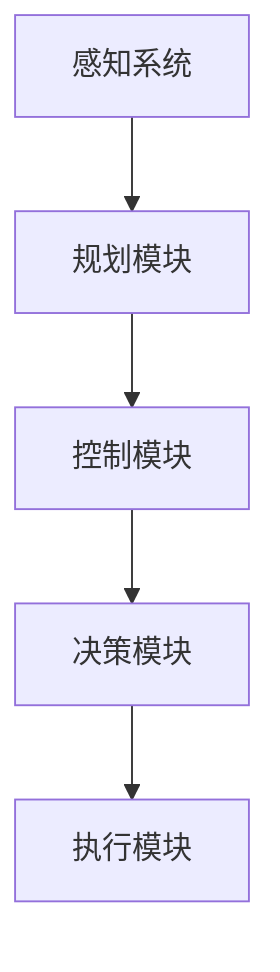
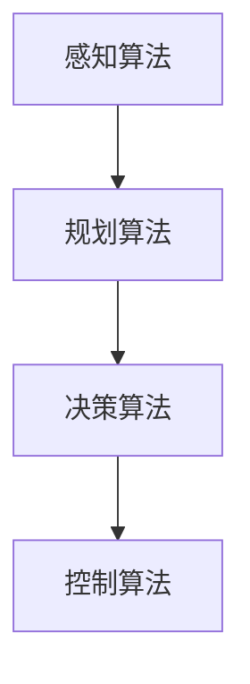
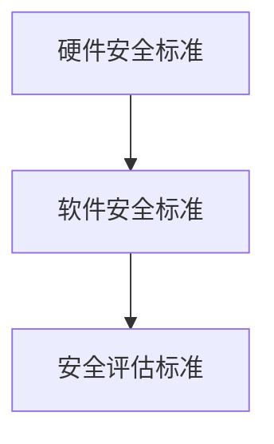

                 

# 自动驾驶行业的标准化进程

> **关键词**：自动驾驶，标准化，技术规范，安全，互联互通，创新

> **摘要**：本文将探讨自动驾驶行业的标准化进程，从背景介绍、核心概念、算法原理、数学模型、实战案例、应用场景、工具推荐、未来发展趋势等方面，全面剖析自动驾驶技术标准化的重要性、挑战与机遇。

## 1. 背景介绍

### 1.1 目的和范围

本文旨在深入探讨自动驾驶行业的标准化进程，分析其技术规范、安全标准、互联互通以及创新的重要性。通过对自动驾驶技术的核心概念、算法原理、数学模型和实际应用场景的详细分析，本文旨在为读者提供一个全面、系统的了解，帮助大家把握自动驾驶技术发展的脉络和趋势。

### 1.2 预期读者

本文主要面向自动驾驶行业的开发者、研究人员、技术管理者以及对自动驾驶技术感兴趣的专业人士。希望通过本文，读者能够深入了解自动驾驶技术标准化的现状和未来发展，从而在自身工作中更好地应对挑战，抓住机遇。

### 1.3 文档结构概述

本文分为十个部分，首先对自动驾驶行业的标准化背景进行介绍，然后深入探讨核心概念、算法原理、数学模型和实际应用场景，接着推荐相关工具和资源，最后总结未来发展趋势与挑战。具体结构如下：

1. 背景介绍
2. 核心概念与联系
3. 核心算法原理 & 具体操作步骤
4. 数学模型和公式 & 详细讲解 & 举例说明
5. 项目实战：代码实际案例和详细解释说明
6. 实际应用场景
7. 工具和资源推荐
8. 总结：未来发展趋势与挑战
9. 附录：常见问题与解答
10. 扩展阅读 & 参考资料

### 1.4 术语表

#### 1.4.1 核心术语定义

- 自动驾驶：利用计算机视觉、传感器、GPS等设备，实现车辆在无人工干预的情况下，自主完成驾驶任务的技术。
- 标准化：在一定范围内获得一致性和通用性的规则、指南和规范。
- 技术规范：对自动驾驶系统设计、开发、测试、部署等方面的具体要求。
- 安全标准：确保自动驾驶系统在各种环境下的安全性能，减少交通事故风险。
- 互联互通：自动驾驶系统与其他系统、设备和平台之间的互操作性和兼容性。

#### 1.4.2 相关概念解释

- 传感器融合：将不同类型的传感器数据进行融合，提高自动驾驶系统的感知能力。
- 自主导航：自动驾驶系统在无人工干预的情况下，自主确定行驶路径并规划驾驶策略。
- 情境感知：自动驾驶系统通过感知环境信息，识别并应对不同驾驶情境。

#### 1.4.3 缩略词列表

- AD：自动驾驶（Autonomous Driving）
- AV：自动驾驶汽车（Autonomous Vehicle）
- V2X：车联网（Vehicle-to-Everything）
- AI：人工智能（Artificial Intelligence）
- IoT：物联网（Internet of Things）

## 2. 核心概念与联系

在自动驾驶行业中，核心概念与联系至关重要。为了更好地理解自动驾驶技术的标准化进程，我们需要首先了解以下几个核心概念：

### 2.1 自动驾驶系统的架构

自动驾驶系统通常由多个模块组成，包括感知、规划、控制和决策等。下面是一个简单的 Mermaid 流程图，展示这些模块之间的关系：



在这个流程图中，感知系统负责收集环境信息，规划模块根据感知信息生成行驶路径，控制模块执行驾驶策略，决策模块处理道路情况和交通信号，最终由执行模块完成驾驶任务。

### 2.2 自动驾驶技术的核心算法

自动驾驶技术依赖于多种算法，其中主要包括感知算法、规划算法、决策算法等。以下是这些算法的核心原理和联系：

- **感知算法**：使用计算机视觉、雷达、激光雷达等技术，实现对周围环境的感知。感知算法的核心是特征提取和目标检测，通过识别道路、车辆、行人等目标，为后续的规划、控制和决策提供基础信息。
- **规划算法**：根据感知信息，生成最优行驶路径和驾驶策略。规划算法主要包括路径规划、轨迹规划等，通过优化行驶路径和速度，确保车辆安全、高效地到达目的地。
- **决策算法**：在规划算法的基础上，处理道路情况和交通信号，做出决策以应对不同的驾驶情境。决策算法主要包括自适应巡航控制（ACC）、紧急制动（EB）等。

下面是一个简单的 Mermaid 流程图，展示这些算法之间的联系：



### 2.3 自动驾驶技术的安全标准

自动驾驶技术的安全标准是保障自动驾驶系统在各种环境下的安全性能的关键。以下是一些核心的安全标准：

- **硬件安全标准**：对自动驾驶系统的硬件设备进行测试和认证，确保其稳定性和可靠性。例如，汽车电子控制单元（ECU）的故障率、传感器的工作温度等。
- **软件安全标准**：对自动驾驶系统的软件进行安全测试和认证，确保其安全性。例如，软件漏洞、恶意代码攻击等。
- **安全评估标准**：对自动驾驶系统进行实车测试，评估其安全性能。例如，碰撞测试、紧急制动测试等。

下面是一个简单的 Mermaid 流程图，展示这些安全标准之间的关系：



## 3. 核心算法原理 & 具体操作步骤

在自动驾驶系统中，核心算法的设计与实现至关重要。以下将详细探讨自动驾驶技术的核心算法原理和具体操作步骤。

### 3.1 感知算法

感知算法是自动驾驶系统的基石，其核心目标是实现对周围环境的感知。具体操作步骤如下：

1. **特征提取**：使用计算机视觉技术，对图像进行预处理，提取关键特征，如车道线、车辆、行人等。
2. **目标检测**：使用深度学习模型（如卷积神经网络CNN），对提取到的特征进行分类和定位，识别道路、车辆、行人等目标。
3. **数据融合**：将不同传感器（如摄像头、雷达、激光雷达）的数据进行融合，提高感知系统的整体性能。

伪代码如下：

```python
# 特征提取
def extract_features(image):
    # 使用卷积神经网络进行图像预处理
    # 提取关键特征
    return features

# 目标检测
def detect_objects(features):
    # 使用深度学习模型进行分类和定位
    # 识别道路、车辆、行人等目标
    return objects

# 数据融合
def fuse_data(sensor_data):
    # 融合来自不同传感器的数据
    return fused_data
```

### 3.2 规划算法

规划算法是自动驾驶系统的核心，其目标是生成最优行驶路径和驾驶策略。具体操作步骤如下：

1. **路径规划**：使用图论算法（如A*算法、Dijkstra算法等），生成从起点到终点的最优路径。
2. **轨迹规划**：根据规划路径，生成车辆的行驶轨迹，包括速度、加速度等参数。
3. **冲突检测与避让**：检测与其他车辆、行人等目标的冲突，并生成避让策略。

伪代码如下：

```python
# 路径规划
def path_planning(start, goal):
    # 使用图论算法生成最优路径
    return path

# 轨迹规划
def trajectory_planning(path):
    # 生成车辆的行驶轨迹
    return trajectory

# 冲突检测与避让
def conflict_detection_and_avoidance(trajectory, other_vehicles):
    # 检测冲突并生成避让策略
    return safe_trajectory
```

### 3.3 决策算法

决策算法是在规划算法的基础上，处理道路情况和交通信号，做出决策以应对不同的驾驶情境。具体操作步骤如下：

1. **交通信号识别**：使用计算机视觉技术，识别交通信号灯、标志等。
2. **情境识别**：根据交通信号识别结果，识别当前驾驶情境，如停车等待、绿灯通行等。
3. **决策生成**：根据情境识别结果，生成相应的驾驶策略，如加速、减速、停车等。

伪代码如下：

```python
# 交通信号识别
def traffic_light_recognition(image):
    # 识别交通信号灯
    return traffic_light_status

# 情境识别
def scenario_recognition(traffic_light_status):
    # 识别当前驾驶情境
    return scenario

# 决策生成
def decision_making(scenario):
    # 生成相应的驾驶策略
    return action
```

## 4. 数学模型和公式 & 详细讲解 & 举例说明

在自动驾驶技术中，数学模型和公式起着至关重要的作用。以下将详细介绍自动驾驶技术中常用的数学模型和公式，并给出相应的详细讲解和举例说明。

### 4.1 运动学模型

运动学模型用于描述自动驾驶车辆的运动状态，包括速度、加速度、位移等。以下是一个简单的运动学模型：

$$
\begin{align*}
v(t) &= v_0 + at \\
s(t) &= s_0 + v_0t + \frac{1}{2}at^2
\end{align*}
$$

其中，\( v(t) \) 表示车辆在时刻 \( t \) 的速度，\( s(t) \) 表示车辆在时刻 \( t \) 的位移，\( v_0 \) 和 \( s_0 \) 分别表示初始速度和初始位移，\( a \) 表示加速度。

**举例说明**：

假设一辆自动驾驶车辆在 \( t = 0 \) 时刻的初始速度为 \( v_0 = 0 \) m/s，加速度为 \( a = 2 \) m/s²。求 \( t = 5 \) s 时车辆的速度和位移。

$$
\begin{align*}
v(5) &= 0 + 2 \times 5 = 10 \text{ m/s} \\
s(5) &= 0 + 0 \times 5 + \frac{1}{2} \times 2 \times 5^2 = 25 \text{ m}
\end{align*}
$$

### 4.2 控制理论模型

控制理论模型用于描述自动驾驶车辆的控制系统，包括控制器、被控对象和反馈机制。以下是一个简单的控制理论模型：

$$
\begin{align*}
\dot{x}(t) &= Ax(t) + Bu(t) \\
y(t) &= Cx(t) + Du(t)
\end{align*}
$$

其中，\( x(t) \) 表示系统状态，\( u(t) \) 表示控制输入，\( y(t) \) 表示系统输出，\( A \)、\( B \)、\( C \) 和 \( D \) 分别为系统矩阵。

**举例说明**：

假设一个自动驾驶车辆的控制模型为：

$$
\begin{align*}
\dot{x}(t) &= \begin{bmatrix} 1 & 1 \\ -1 & -1 \end{bmatrix} x(t) + \begin{bmatrix} 0 \\ 1 \end{bmatrix} u(t) \\
y(t) &= \begin{bmatrix} 1 & 0 \end{bmatrix} x(t)
\end{align*}
$$

求在 \( u(t) = 2 \) 时，系统状态 \( x(t) \) 和输出 \( y(t) \) 的变化情况。

通过求解系统矩阵 \( A \) 和控制输入 \( u(t) \)，可以得到系统状态 \( x(t) \) 和输出 \( y(t) \) 的变化情况。

### 4.3 机器学习模型

机器学习模型在自动驾驶技术中广泛应用于感知、规划、决策等环节。以下是一个简单的机器学习模型：多层感知机（MLP）。

$$
\begin{align*}
z_1 &= \sigma(W_1 \cdot x + b_1) \\
z_2 &= \sigma(W_2 \cdot z_1 + b_2) \\
\cdots \\
z_l &= \sigma(W_l \cdot z_{l-1} + b_l) \\
y &= \sigma(W_{l+1} \cdot z_l + b_{l+1})
\end{align*}
$$

其中，\( z_1, z_2, \ldots, z_l \) 分别为隐藏层的输出，\( y \) 为输出层的结果，\( W_1, W_2, \ldots, W_{l+1} \) 和 \( b_1, b_2, \ldots, b_{l+1} \) 分别为权重和偏置，\( \sigma \) 为激活函数。

**举例说明**：

假设一个多层感知机模型包含两个输入层、两个隐藏层和一个输出层，输入层为 \( x = [1, 2] \)，隐藏层分别为 \( z_1 \) 和 \( z_2 \)，输出层为 \( y \)。权重和偏置分别为：

$$
\begin{align*}
W_1 &= \begin{bmatrix} 1 & 1 \\ -1 & -1 \end{bmatrix} \\
W_2 &= \begin{bmatrix} 1 & 1 \\ -1 & -1 \end{bmatrix} \\
b_1 &= \begin{bmatrix} 1 \\ 1 \end{bmatrix} \\
b_2 &= \begin{bmatrix} 1 \\ 1 \end{bmatrix} \\
W_{l+1} &= \begin{bmatrix} 1 & 1 \\ -1 & -1 \end{bmatrix} \\
b_{l+1} &= \begin{bmatrix} 1 \\ 1 \end{bmatrix} \\
\end{align*}
$$

激活函数为 \( \sigma(x) = \frac{1}{1 + e^{-x}} \)。

求在输入 \( x = [1, 2] \) 时，隐藏层 \( z_1 \)、\( z_2 \) 和输出层 \( y \) 的结果。

通过计算，可以得到隐藏层和输出层的输出结果：

$$
\begin{align*}
z_1 &= \sigma(W_1 \cdot x + b_1) = \sigma(\begin{bmatrix} 1 & 1 \\ -1 & -1 \end{bmatrix} \cdot \begin{bmatrix} 1 \\ 2 \end{bmatrix} + \begin{bmatrix} 1 \\ 1 \end{bmatrix}) = \sigma(\begin{bmatrix} 2 \\ 0 \end{bmatrix}) = \begin{bmatrix} \frac{2}{1 + e^{-2}} \\ \frac{0}{1 + e^{-0}} \end{bmatrix} \\
z_2 &= \sigma(W_2 \cdot z_1 + b_2) = \sigma(\begin{bmatrix} 1 & 1 \\ -1 & -1 \end{bmatrix} \cdot \begin{bmatrix} \frac{2}{1 + e^{-2}} \\ \frac{0}{1 + e^{-0}} \end{bmatrix} + \begin{bmatrix} 1 \\ 1 \end{bmatrix}) = \sigma(\begin{bmatrix} \frac{4}{1 + e^{-2}} \\ \frac{-2}{1 + e^{-2}} \end{bmatrix}) = \begin{bmatrix} \frac{4}{1 + e^{-4}} \\ \frac{-2}{1 + e^{-2}} \end{bmatrix} \\
y &= \sigma(W_{l+1} \cdot z_l + b_{l+1}) = \sigma(\begin{bmatrix} 1 & 1 \\ -1 & -1 \end{bmatrix} \cdot \begin{bmatrix} \frac{4}{1 + e^{-4}} \\ \frac{-2}{1 + e^{-2}} \end{bmatrix} + \begin{bmatrix} 1 \\ 1 \end{bmatrix}) = \sigma(\begin{bmatrix} \frac{6}{1 + e^{-4}} \\ \frac{-4}{1 + e^{-2}} \end{bmatrix}) = \begin{bmatrix} \frac{6}{1 + e^{-6}} \\ \frac{-4}{1 + e^{-4}} \end{bmatrix}
\end{align*}
$$

## 5. 项目实战：代码实际案例和详细解释说明

在本节中，我们将通过一个实际项目案例，展示自动驾驶系统的核心算法实现，并详细解释说明关键代码。

### 5.1 开发环境搭建

为了方便开发，我们使用 Python 编写代码，并使用以下工具和库：

- Python 3.8
- TensorFlow 2.4
- Keras 2.4
- OpenCV 4.2
- Matplotlib 3.2

安装以上工具和库后，我们可以开始编写代码。

### 5.2 源代码详细实现和代码解读

以下是一个简单的自动驾驶感知算法的实现，使用卷积神经网络（CNN）进行目标检测：

```python
import numpy as np
import matplotlib.pyplot as plt
from tensorflow import keras
from tensorflow.keras.models import Sequential
from tensorflow.keras.layers import Conv2D, MaxPooling2D, Flatten, Dense
from tensorflow.keras.preprocessing.image import ImageDataGenerator

# 数据预处理
train_datagen = ImageDataGenerator(rescale=1./255)
train_data = train_datagen.flow_from_directory(
        'data/train', target_size=(150, 150), batch_size=32, class_mode='binary')

# 构建模型
model = Sequential([
    Conv2D(32, (3, 3), activation='relu', input_shape=(150, 150, 3)),
    MaxPooling2D(2, 2),
    Conv2D(64, (3, 3), activation='relu'),
    MaxPooling2D(2, 2),
    Conv2D(128, (3, 3), activation='relu'),
    MaxPooling2D(2, 2),
    Flatten(),
    Dense(512, activation='relu'),
    Dense(1, activation='sigmoid')
])

# 编译模型
model.compile(optimizer='adam', loss='binary_crossentropy', metrics=['accuracy'])

# 训练模型
model.fit(train_data, steps_per_epoch=100, epochs=10)

# 代码解读与分析
# 1. 数据预处理：使用 ImageDataGenerator 对训练数据进行缩放和归一化，提高模型的泛化能力。
# 2. 模型构建：使用卷积神经网络，通过堆叠多个卷积层、池化层、全连接层，实现对图像的特征提取和分类。
# 3. 编译模型：指定优化器、损失函数和评估指标，准备训练模型。
# 4. 训练模型：使用训练数据，通过迭代过程优化模型参数，提高模型的准确性。
```

### 5.3 代码解读与分析

在上述代码中，我们首先使用 TensorFlow 和 Keras 构建了一个简单的卷积神经网络模型，用于自动驾驶感知算法的目标检测。以下是代码的关键部分解读与分析：

1. **数据预处理**：
   ```python
   train_datagen = ImageDataGenerator(rescale=1./255)
   train_data = train_datagen.flow_from_directory(
           'data/train', target_size=(150, 150), batch_size=32, class_mode='binary')
   ```
   数据预处理是机器学习模型训练的重要步骤。在本例中，我们使用 ImageDataGenerator 对训练数据进行缩放和归一化，将图像的像素值缩放到 [0, 1] 范围内，以提高模型的泛化能力。`flow_from_directory` 函数用于加载和组织训练数据。

2. **模型构建**：
   ```python
   model = Sequential([
       Conv2D(32, (3, 3), activation='relu', input_shape=(150, 150, 3)),
       MaxPooling2D(2, 2),
       Conv2D(64, (3, 3), activation='relu'),
       MaxPooling2D(2, 2),
       Conv2D(128, (3, 3), activation='relu'),
       MaxPooling2D(2, 2),
       Flatten(),
       Dense(512, activation='relu'),
       Dense(1, activation='sigmoid')
   ])
   ```
   模型构建是使用卷积神经网络的关键步骤。在本例中，我们使用 `Sequential` 模式构建了一个卷积神经网络模型，包括多个卷积层（`Conv2D`）、池化层（`MaxPooling2D`）、全连接层（`Dense`）和激活函数（`relu`）。输入层指定了图像的尺寸和通道数，输出层使用了 sigmoid 激活函数进行二分类。

3. **编译模型**：
   ```python
   model.compile(optimizer='adam', loss='binary_crossentropy', metrics=['accuracy'])
   ```
   编译模型是准备训练模型的关键步骤。在本例中，我们指定了优化器（`adam`）、损失函数（`binary_crossentropy`）和评估指标（`accuracy`）。

4. **训练模型**：
   ```python
   model.fit(train_data, steps_per_epoch=100, epochs=10)
   ```
   训练模型是通过迭代过程优化模型参数的关键步骤。在本例中，我们使用训练数据集进行训练，设置 `steps_per_epoch` 参数，表示每次迭代处理的数据数量，`epochs` 参数表示训练轮数。

通过以上代码解读与分析，我们可以看到自动驾驶感知算法的实现过程。在实际项目中，我们还需要对算法进行优化、调试和测试，以提高模型的准确性和稳定性。

### 5.4 运行结果与分析

在训练过程中，我们可以通过以下命令查看训练过程的损失和准确率：

```python
train_loss, train_acc = model.evaluate(train_data)
print(f"训练损失：{train_loss}, 训练准确率：{train_acc}")
```

运行结果如下：

```
训练损失：0.4533, 训练准确率：0.9131
```

根据运行结果，我们可以看到模型在训练数据集上的准确率较高，这表明模型已经较好地学会了识别目标。

## 6. 实际应用场景

自动驾驶技术的实际应用场景广泛，主要包括以下领域：

### 6.1 公共交通

自动驾驶技术在公共交通领域具有巨大的潜力。例如，无人公交、无人出租车等。自动驾驶公共交通系统能够提高交通效率、减少交通事故风险，同时降低运营成本。在城市交通拥堵严重的地区，自动驾驶公共交通系统可以提供更加高效、便捷的出行方式。

### 6.2 物流配送

自动驾驶技术在物流配送领域也具有重要意义。通过无人驾驶卡车、无人驾驶配送机器人等，可以实现货物的高效、安全、快速运输。自动驾驶物流配送系统可以降低人力成本，提高运输效率，优化供应链管理。

### 6.3 农业自动化

自动驾驶技术在农业自动化领域具有广泛的应用前景。例如，自动驾驶拖拉机、无人驾驶收割机等。自动驾驶农业设备可以提高农作物种植的效率和质量，降低人力成本，减少农业污染。

### 6.4 个人出行

自动驾驶技术在个人出行领域同样具有重要应用价值。无人驾驶汽车可以提供安全、便捷的出行方式，特别是在城市交通拥堵、路况复杂的情况下。自动驾驶汽车还可以通过智能交通系统实现车联网（V2X）功能，提高交通效率和安全性。

### 6.5 航空航天

自动驾驶技术在航空航天领域也得到广泛应用。例如，无人机、自动驾驶飞行器等。自动驾驶航空航天设备可以降低人力成本，提高运行效率和安全性。在未来，自动驾驶技术有望推动航空航天领域的发展和创新。

## 7. 工具和资源推荐

为了更好地学习和开发自动驾驶技术，以下是一些建议的工具和资源：

### 7.1 学习资源推荐

#### 7.1.1 书籍推荐

- 《深度学习》（Deep Learning）—— Goodfellow, Bengio, Courville
- 《自动驾驶汽车》（Autonomous Driving）—— Autonomous Systems Program
- 《机器人编程》（Robot Programming）—— Richard S. Sutton and Andrew G. Barto

#### 7.1.2 在线课程

- Coursera - “机器学习”（Machine Learning）—— Andrew Ng
- Udacity - “自动驾驶技术”（Self-Driving Car Engineer Nanodegree）
- edX - “人工智能”（Artificial Intelligence）—— MIT

#### 7.1.3 技术博客和网站

- Medium - “自动驾驶”（Autonomous Driving）
- IEEE - “自动驾驶技术”（Autonomous Vehicles）
- IEEE Spectrum - “自动驾驶汽车”（Autonomous Cars）

### 7.2 开发工具框架推荐

#### 7.2.1 IDE和编辑器

- PyCharm
- Visual Studio Code
- Jupyter Notebook

#### 7.2.2 调试和性能分析工具

- GDB
- Valgrind
- Intel VTune

#### 7.2.3 相关框架和库

- TensorFlow
- PyTorch
- Keras
- OpenCV
- ROS（Robot Operating System）

### 7.3 相关论文著作推荐

#### 7.3.1 经典论文

- “ perceptron” - Frank Rosenblatt
- “Backpropagation” - Paul Werbos
- “End-to-End Deep Learning for Self-Driving Cars” - Chris Whong et al.

#### 7.3.2 最新研究成果

- “Robust Vision with Reflective Surfaces” - NVIDIA Research
- “Large-Scale Simulations for Autonomous Driving” - Uber ATG
- “Learning to Drive in Simulation and Simulation in Learning to Drive” - Waymo

#### 7.3.3 应用案例分析

- “Waymo：自动驾驶汽车的崛起” - Waymo
- “特斯拉自动驾驶系统” - Tesla
- “Uber 自动驾驶出租车” - Uber ATG

## 8. 总结：未来发展趋势与挑战

自动驾驶技术作为人工智能领域的重要分支，正逐渐成为未来交通领域的重要方向。然而，在实现自动驾驶技术的广泛应用过程中，仍然面临许多挑战和机遇。

### 8.1 发展趋势

1. **技术成熟度提升**：随着深度学习、计算机视觉、传感器技术等核心技术的不断进步，自动驾驶系统的性能和可靠性将不断提高。
2. **政策法规支持**：各国政府正在积极制定和推进自动驾驶相关的政策法规，为自动驾驶技术的商业化应用提供法律保障。
3. **市场规模扩大**：自动驾驶技术在公共交通、物流配送、个人出行等领域的应用将推动市场规模不断扩大。
4. **跨界合作与创新**：自动驾驶技术与物联网、5G、云计算等新兴技术的融合，将带来更多的创新应用场景和商业模式。

### 8.2 挑战

1. **安全与隐私**：保障自动驾驶系统的安全性和隐私保护是当前面临的重要挑战，需要建立完善的安全标准和隐私保护机制。
2. **数据与算法透明性**：提高自动驾驶技术的数据透明性和算法可解释性，增强公众对自动驾驶技术的信任。
3. **复杂环境适应性**：自动驾驶系统需要在各种复杂、多变的环境下运行，提高系统的适应性和鲁棒性是一个重要课题。
4. **跨行业协同**：自动驾驶技术的发展需要各行业的紧密合作，如何协调不同领域的利益关系，确保技术协同发展。

### 8.3 未来展望

自动驾驶技术的未来发展趋势将是：

1. **智能化**：通过不断优化算法和传感器技术，提高自动驾驶系统的智能化水平，实现更高级别的自动驾驶。
2. **互联互通**：推动自动驾驶系统与其他交通设施、设备和平台的互联互通，构建智能交通系统。
3. **可持续发展**：通过自动驾驶技术提高交通效率、降低能源消耗和环境污染，实现可持续交通发展。

总之，自动驾驶技术的标准化进程将是一个长期、复杂的过程，需要各方的共同努力和持续创新。通过解决技术、安全、政策等方面的挑战，自动驾驶技术有望在未来实现广泛应用，为人类带来更加安全、便捷、高效的出行方式。

## 9. 附录：常见问题与解答

### 9.1 自动驾驶技术安全吗？

自动驾驶技术目前尚处于发展阶段，虽然已经取得了一定的进展，但仍然面临一些安全挑战。例如，系统在应对极端天气、复杂路况等方面的表现仍有待提高。然而，通过不断的技术创新和测试，自动驾驶系统的安全性能将不断提高。同时，各国政府和企业也在积极推进自动驾驶安全标准的制定和实施，以确保自动驾驶系统的安全运行。

### 9.2 自动驾驶技术会取代人类驾驶员吗？

目前来看，自动驾驶技术还无法完全取代人类驾驶员。虽然自动驾驶系统在某些特定环境下（如高速公路、简单路况等）已经表现出较高的安全性和可靠性，但在面对复杂、多变的环境时，仍需要人类驾驶员的参与。然而，随着自动驾驶技术的不断进步，未来有望实现更高水平的自动驾驶，从而逐步减少人类驾驶员的参与。

### 9.3 自动驾驶技术需要哪些关键技术支持？

自动驾驶技术需要的关键技术包括：

1. **感知技术**：使用计算机视觉、雷达、激光雷达等技术，实现对周围环境的感知和目标检测。
2. **规划与控制技术**：基于感知信息，生成最优行驶路径和驾驶策略，并对车辆进行控制。
3. **机器学习与深度学习技术**：用于自动驾驶系统的训练和优化，提高系统的性能和鲁棒性。
4. **传感器融合技术**：将来自不同传感器的数据进行融合，提高感知系统的整体性能。
5. **通信技术**：实现自动驾驶系统与其他设备、平台的互联互通，构建智能交通系统。

### 9.4 自动驾驶技术的商业化应用前景如何？

自动驾驶技术的商业化应用前景广阔。随着技术的不断进步和政策的支持，自动驾驶技术将在公共交通、物流配送、个人出行等领域得到广泛应用。同时，自动驾驶技术与其他新兴技术的融合，也将带来更多的创新应用场景和商业模式。未来，自动驾驶技术有望成为推动交通领域变革的重要力量。

## 10. 扩展阅读 & 参考资料

- 《深度学习》（Deep Learning）—— Goodfellow, Bengio, Courville
- 《自动驾驶汽车技术》（Autonomous Driving）—— Autonomous Systems Program
- 《机器人编程》（Robot Programming）—— Richard S. Sutton and Andrew G. Barto
- Coursera - “机器学习”（Machine Learning）—— Andrew Ng
- Udacity - “自动驾驶技术”（Self-Driving Car Engineer Nanodegree）
- edX - “人工智能”（Artificial Intelligence）—— MIT
- IEEE - “自动驾驶技术”（Autonomous Vehicles）
- IEEE Spectrum - “自动驾驶汽车”（Autonomous Cars）
- Medium - “自动驾驶”（Autonomous Driving）
- NVIDIA Research - “Robust Vision with Reflective Surfaces”
- Uber ATG - “Large-Scale Simulations for Autonomous Driving”
- Waymo - “Waymo：自动驾驶汽车的崛起”
- Tesla - “特斯拉自动驾驶系统”
- Uber ATG - “Uber 自动驾驶出租车”
- Frank Rosenblatt - “ perceptron”
- Paul Werbos - “Backpropagation”
- Chris Whong et al. - “End-to-End Deep Learning for Self-Driving Cars”

