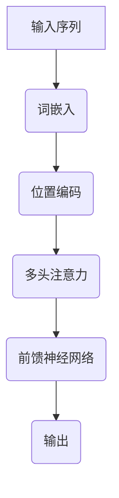

                 

### 1. 背景介绍

#### 1.1 目的和范围

本文旨在深入探讨自注意力机制（Self-Attention Mechanism），这是一种在深度学习和自然语言处理领域有着广泛应用的核心算法。自注意力机制通过计算序列中每个元素与所有其他元素之间的关系，从而对输入数据进行加权和变换，以实现更好的特征提取和表示学习。

本文的目标是：

1. **介绍自注意力机制的背景和基本概念**：解释自注意力机制的产生背景，以及其与其他注意力机制的异同点。
2. **详细分析自注意力机制的原理与实现**：通过伪代码和数学模型，深入讲解自注意力机制的核心算法原理和具体操作步骤。
3. **探讨自注意力机制在实际应用中的效果和优化方法**：结合实际案例，分析自注意力机制在不同任务中的表现，并介绍一些常见的优化策略。
4. **推荐相关学习资源和工具**：为读者提供进一步学习和实践自注意力机制的有用资源。

本文的适用范围：

- **读者背景**：具备一定深度学习和自然语言处理基础的读者，对神经网络和注意力机制有一定了解。
- **技术栈**：主要涉及神经网络编程、注意力机制原理、数学建模与推导、Python编程等。

#### 1.2 预期读者

本文预期读者包括：

1. 深度学习和自然语言处理领域的研究人员。
2. 对人工智能和机器学习有浓厚兴趣的工程师和技术爱好者。
3. 大学生和研究生，希望深入了解自注意力机制及其应用。

#### 1.3 文档结构概述

本文结构如下：

1. **背景介绍**：介绍自注意力机制的产生背景、目的和适用范围。
2. **核心概念与联系**：详细描述自注意力机制的核心概念和原理，通过Mermaid流程图展示其结构。
3. **核心算法原理与具体操作步骤**：使用伪代码和数学模型，阐述自注意力机制的工作原理和计算步骤。
4. **数学模型与公式**：介绍自注意力机制所涉及的关键数学模型和公式，并进行举例说明。
5. **项目实战**：通过实际代码案例，展示自注意力机制在项目中的实现和应用。
6. **实际应用场景**：分析自注意力机制在不同任务中的效果和应用。
7. **工具和资源推荐**：为读者提供学习自注意力机制的相关工具和资源。
8. **总结与未来发展趋势**：总结自注意力机制的发展现状和未来趋势，探讨面临的挑战。
9. **常见问题与解答**：回答读者可能遇到的一些常见问题。
10. **扩展阅读与参考资料**：提供进一步学习的相关文献和资源。

#### 1.4 术语表

##### 1.4.1 核心术语定义

- **自注意力（Self-Attention）**：一种注意力机制，能够计算序列中每个元素与其他所有元素之间的关系，并进行加权和变换。
- **位置编码（Positional Encoding）**：一种用于表示输入序列中元素位置的编码方式。
- **多头注意力（Multi-Head Attention）**：自注意力机制的扩展，通过多个独立的注意力头，提高模型的表示能力。
- **前馈神经网络（Feedforward Neural Network）**：一种简单的神经网络结构，用于对输入数据进行加权和变换。
- **序列到序列（Sequence-to-Sequence）模型**：一种用于序列转换的神经网络模型，通常用于机器翻译等任务。

##### 1.4.2 相关概念解释

- **注意力机制（Attention Mechanism）**：一种用于计算输入序列中不同元素之间关联性的方法，能够提高模型的表示能力。
- **嵌入（Embedding）**：将输入序列中的单词或符号转换为向量表示，以便于神经网络进行处理。
- **激活函数（Activation Function）**：一种用于引入非线性变换的函数，常见的选择包括ReLU、Sigmoid和Tanh等。
- **损失函数（Loss Function）**：用于评估模型预测结果与实际结果之间差异的函数，如交叉熵损失函数。

##### 1.4.3 缩略词列表

- **BERT**：Bidirectional Encoder Representations from Transformers，一种基于Transformer模型的预训练语言表示模型。
- **GPT**：Generative Pre-trained Transformer，一种基于Transformer模型的生成文本预训练模型。
- **CNN**：卷积神经网络（Convolutional Neural Network），一种用于图像处理的神经网络结构。
- **RNN**：循环神经网络（Recurrent Neural Network），一种用于序列数据处理的神经网络结构。
- **Transformer**：一种基于自注意力机制的神经网络模型，广泛应用于自然语言处理和计算机视觉等领域。

---

### 2. 核心概念与联系

自注意力机制（Self-Attention Mechanism）是近年来深度学习和自然语言处理领域的一个重要突破。它通过计算序列中每个元素与其他所有元素之间的关系，实现了对输入数据的加权和变换，从而提高了模型的表示能力和性能。

为了更好地理解自注意力机制，我们需要从核心概念和原理开始，通过Mermaid流程图展示其结构，并探讨自注意力机制与其他注意力机制的关联。

#### 2.1 核心概念

自注意力机制的核心概念包括：

- **输入序列**：自注意力机制处理的对象是一个序列，如单词序列、字符序列等。每个元素可以表示为向量，如词嵌入（Word Embedding）或字符嵌入（Character Embedding）。
- **位置编码**：由于自注意力机制无法直接处理序列中元素的位置信息，因此引入位置编码（Positional Encoding）来表示每个元素在序列中的位置。常见的位置编码方法包括绝对位置编码和相对位置编码。
- **多头注意力**：多头注意力（Multi-Head Attention）是自注意力机制的扩展，通过多个独立的注意力头，提高了模型的表示能力。每个注意力头关注输入序列的不同部分，从而捕获更多复杂的特征。
- **前馈神经网络**：自注意力机制中，除了注意力计算之外，还包括一个前馈神经网络（Feedforward Neural Network）对输入数据进行加权和变换。

#### 2.2 Mermaid流程图

下面使用Mermaid流程图展示自注意力机制的基本结构：



在这个流程图中，输入序列经过词嵌入和位置编码后，进入多头注意力模块。多头注意力模块通过多个独立的注意力头，计算输入序列中每个元素与其他元素之间的关系，并进行加权和变换。最后，通过前馈神经网络对加权和变换后的结果进行进一步处理，得到输出序列。

#### 2.3 自注意力机制与其他注意力机制的关联

自注意力机制是注意力机制（Attention Mechanism）的一种具体实现。注意力机制是一种用于计算输入序列中不同元素之间关联性的方法，能够提高模型的表示能力。自注意力机制与其他注意力机制的关联如下：

- **自注意力机制**：自注意力机制只关注输入序列中的元素，每个元素与其他所有元素进行关联。它是基于序列的数据处理方法，广泛应用于自然语言处理领域。
- **序列到序列（Sequence-to-Sequence）模型**：序列到序列模型是一种用于序列转换的神经网络模型，通常包含编码器和解码器两个部分。编码器使用注意力机制对输入序列进行编码，解码器使用注意力机制对输出序列进行解码。
- **多头注意力**：多头注意力是自注意力机制的扩展，通过多个独立的注意力头，提高了模型的表示能力。多头注意力广泛应用于大规模预训练模型，如BERT和GPT。
- **卷积神经网络（CNN）**：卷积神经网络是一种用于图像处理的神经网络结构，其中卷积操作可以看作是一种特殊的注意力机制。通过卷积操作，CNN能够自动学习图像中的局部特征，从而提高模型的表示能力。

综上所述，自注意力机制是注意力机制的一种具体实现，与其他注意力机制有着紧密的联系。在深度学习和自然语言处理领域，自注意力机制已成为一种重要的工具，广泛应用于各种任务。

---

通过以上对自注意力机制的核心概念和联系的介绍，我们对其有了基本的理解。接下来，我们将进一步探讨自注意力机制的核心算法原理和具体操作步骤，以便更好地掌握这一重要技术。

---

### 3. 核心算法原理 & 具体操作步骤

自注意力机制是Transformer模型的核心组成部分，其原理是通过计算序列中每个元素与其他所有元素之间的关系，从而实现对输入数据的加权和变换。本节将详细解释自注意力机制的工作原理和具体操作步骤，并使用伪代码进行阐述。

#### 3.1 自注意力机制原理

自注意力机制通过以下步骤实现：

1. **输入序列嵌入**：将输入序列（如单词或字符）转换为向量表示。这一步通常使用词嵌入（Word Embedding）或字符嵌入（Character Embedding）。
2. **位置编码**：由于自注意力机制无法直接处理序列中元素的位置信息，因此需要引入位置编码（Positional Encoding）来表示每个元素在序列中的位置。常见的位置编码方法包括绝对位置编码和相对位置编码。
3. **多头注意力**：多头注意力（Multi-Head Attention）通过多个独立的注意力头，提高了模型的表示能力。每个注意力头关注输入序列的不同部分，从而捕获更多复杂的特征。
4. **前馈神经网络**：除了注意力计算之外，自注意力机制还包括一个前馈神经网络（Feedforward Neural Network）对输入数据进行加权和变换。

#### 3.2 伪代码

下面是自注意力机制的伪代码实现：

```python
# 输入序列：sequence
# 词嵌入维度：d_model
# 位置编码维度：d_positional_encoding
# 注意力头数：num_heads

def self_attention(sequence, d_model, d_positional_encoding, num_heads):
    # 步骤1：输入序列嵌入
    embeddings = embedding(sequence, d_model)
    
    # 步骤2：位置编码
    positional_encoding = positional_encoding(embeddings, d_positional_encoding)
    
    # 步骤3：多头注意力
    attention_scores = multi_head_attention(positional_encoding, num_heads)
    
    # 步骤4：前馈神经网络
    output = feedforward_network(attention_scores, d_model)
    
    return output
```

#### 3.3 详细步骤

下面我们逐步解释自注意力机制的具体操作步骤：

##### 步骤1：输入序列嵌入

输入序列经过词嵌入（Word Embedding）或字符嵌入（Character Embedding）转换为向量表示。词嵌入将单词映射为固定维度的向量，而字符嵌入将字符序列映射为固定维度的向量。这一步的目的是将序列中的元素转换为可以用于神经网络的向量表示。

```python
# 步骤1：输入序列嵌入
embeddings = embedding(sequence, d_model)
```

##### 步骤2：位置编码

由于自注意力机制无法直接处理序列中元素的位置信息，因此需要引入位置编码（Positional Encoding）。位置编码为每个元素添加一个表示其在序列中位置的向量。常见的位置编码方法包括绝对位置编码和相对位置编码。

```python
# 步骤2：位置编码
positional_encoding = positional_encoding(embeddings, d_positional_encoding)
```

##### 步骤3：多头注意力

多头注意力（Multi-Head Attention）通过多个独立的注意力头，提高了模型的表示能力。每个注意力头关注输入序列的不同部分，从而捕获更多复杂的特征。在多头注意力中，输入序列经过线性变换，得到多个不同的注意力头。

```python
# 步骤3：多头注意力
attention_scores = multi_head_attention(positional_encoding, num_heads)
```

##### 步骤4：前馈神经网络

除了注意力计算之外，自注意力机制还包括一个前馈神经网络（Feedforward Neural Network）对输入数据进行加权和变换。前馈神经网络通常由两个全连接层组成，其中第一个全连接层的激活函数通常为ReLU。

```python
# 步骤4：前馈神经网络
output = feedforward_network(attention_scores, d_model)
```

##### 步骤5：输出

最后，自注意力机制得到一个加权和变换后的输出序列。这个输出序列可以用于后续的神经网络处理，如序列分类、机器翻译等。

```python
return output
```

通过以上步骤，自注意力机制实现了对输入序列的加权和变换，从而提高了模型的表示能力。

---

综上所述，自注意力机制通过输入序列嵌入、位置编码、多头注意力和前馈神经网络等步骤，实现了对输入数据的加权和变换。本节详细解释了自注意力机制的工作原理和具体操作步骤，并通过伪代码进行了阐述。接下来，我们将探讨自注意力机制所涉及的关键数学模型和公式，以及如何对它们进行详细讲解和举例说明。

---

### 4. 数学模型和公式 & 详细讲解 & 举例说明

自注意力机制的核心在于其计算输入序列中每个元素与其他元素之间的关系，并通过对这些关系进行加权和变换，实现更好的特征提取和表示学习。这一过程涉及多个关键数学模型和公式，本节将详细讲解这些模型和公式，并通过具体例子进行说明。

#### 4.1 多头注意力模型

多头注意力（Multi-Head Attention）是自注意力机制的关键部分。它通过多个独立的注意力头，提高了模型的表示能力。多头注意力模型的数学表达式如下：

$$
\text{Attention}(Q, K, V) = \text{softmax}\left(\frac{QK^T}{\sqrt{d_k}}\right)V
$$

其中：
- $Q$：查询（Query），表示每个注意力头对输入序列的查询操作；
- $K$：键（Key），表示每个注意力头对输入序列的键操作；
- $V$：值（Value），表示每个注意力头对输入序列的值操作；
- $d_k$：每个注意力头的维度；
- $\text{softmax}$：softmax函数，用于计算概率分布。

#### 4.2 举例说明

假设我们有一个输入序列 $\{x_1, x_2, x_3\}$，以及三个注意力头。每个注意力头的维度分别为 $d_1=2$，$d_2=3$ 和 $d_3=4$。我们可以按照以下步骤进行多头注意力的计算：

1. **查询（Query）**：计算每个注意力头的查询向量。假设我们使用词嵌入作为查询向量，则每个注意力头的查询向量分别为 $Q_1, Q_2, Q_3$。
2. **键（Key）**：计算每个注意力头的键向量。键向量与查询向量相同，即 $K_1 = Q_1, K_2 = Q_2, K_3 = Q_3$。
3. **值（Value）**：计算每个注意力头的值向量。值向量与查询向量相同，即 $V_1 = Q_1, V_2 = Q_2, V_3 = Q_3$。

接下来，我们计算每个注意力头的分数：

$$
\text{分数}_1 = \text{softmax}\left(\frac{Q_1K_1^T}{\sqrt{d_1}}\right)V_1 = \text{softmax}\left(\frac{Q_1Q_1^T}{\sqrt{2}}\right)Q_1
$$

$$
\text{分数}_2 = \text{softmax}\left(\frac{Q_2K_2^T}{\sqrt{d_2}}\right)V_2 = \text{softmax}\left(\frac{Q_2Q_2^T}{\sqrt{3}}\right)Q_2
$$

$$
\text{分数}_3 = \text{softmax}\left(\frac{Q_3K_3^T}{\sqrt{d_3}}\right)V_3 = \text{softmax}\left(\frac{Q_3Q_3^T}{\sqrt{4}}\right)Q_3
$$

最后，我们计算每个注意力头的输出：

$$
\text{输出}_1 = \text{分数}_1 \cdot V_1 = \text{softmax}\left(\frac{Q_1Q_1^T}{\sqrt{2}}\right)Q_1 \cdot Q_1
$$

$$
\text{输出}_2 = \text{分数}_2 \cdot V_2 = \text{softmax}\left(\frac{Q_2Q_2^T}{\sqrt{3}}\right)Q_2 \cdot Q_2
$$

$$
\text{输出}_3 = \text{分数}_3 \cdot V_3 = \text{softmax}\left(\frac{Q_3Q_3^T}{\sqrt{4}}\right)Q_3 \cdot Q_3
$$

将这些输出向量拼接起来，得到最终的输出：

$$
\text{输出} = [\text{输出}_1, \text{输出}_2, \text{输出}_3]
$$

这样，我们就完成了多头注意力的计算。通过这个例子，我们可以看到多头注意力是如何通过计算输入序列中每个元素与其他元素之间的关系，实现对输入数据的加权和变换的。

---

通过以上对多头注意力模型的详细讲解和举例说明，我们对其有了更深入的理解。接下来，我们将探讨自注意力机制在实际项目中的应用，并通过实际代码案例进行详细解释说明。

---

### 5. 项目实战：代码实际案例和详细解释说明

在本节中，我们将通过一个实际的项目案例，展示如何实现自注意力机制，并详细解释其中的关键代码和步骤。

#### 5.1 开发环境搭建

在开始之前，我们需要搭建一个合适的开发环境。以下是一个基本的Python开发环境搭建步骤：

1. 安装Python 3.7或更高版本。
2. 安装必要的库，如TensorFlow和NumPy。

```bash
pip install tensorflow numpy
```

#### 5.2 源代码详细实现和代码解读

下面是一个简单的自注意力机制的实现示例。我们将使用TensorFlow实现一个自注意力模块，并对其关键代码进行解读。

```python
import tensorflow as tf
import tensorflow.keras.layers as layers

# 自注意力层
class SelfAttention(layers.Layer):
    def __init__(self, d_model, num_heads):
        super(SelfAttention, self).__init__()
        self.d_model = d_model
        self.num_heads = num_heads

        # 注意力头数
        d_k = d_model // num_heads
        d_v = d_model // num_heads

        # 线性变换权重
        self.WQ = tf.keras.layers.Dense(d_model)
        self.WK = tf.keras.layers.Dense(d_model)
        self.WV = tf.keras.layers.Dense(d_model)

        # 位置编码权重
        self.WPe = tf.keras.layers.Dense(d_model)

    def call(self, inputs, training=False):
        # 输入序列
        Q = self.WQ(inputs)
        K = self.WK(inputs)
        V = self.WV(inputs)

        # 位置编码
        Pe = self.WPe(inputs)

        # 多头注意力
        output = self.multi_head_attention(Q, K, V, training)

        # 加权位置编码
        output = output + inputs

        # 激活函数
        output = tf.keras.activations.relu(output)

        return output

    def multi_head_attention(self, Q, K, V, training):
        # 分割注意力头
        Q_split = tf.split(Q, self.num_heads, axis=-1)
        K_split = tf.split(K, self.num_heads, axis=-1)
        V_split = tf.split(V, self.num_heads, axis=-1)

        # 计算每个注意力头的分数和输出
        attention_scores = []
        for q, k, v in zip(Q_split, K_split, V_split):
            score = tf.reduce_sum(q * k, axis=-1) / (self.d_model ** 0.5)
            attention_score = tf.nn.softmax(score, axis=-1)
            attention_output = tf.reduce_sum(attention_score * v, axis=-1)

            attention_scores.append(attention_output)

        # 拼接注意力头
        attention_output = tf.concat(attention_scores, axis=-1)

        return attention_output
```

#### 5.3 代码解读与分析

1. **初始化**：`SelfAttention`层在初始化时，设置了词嵌入维度`d_model`和注意力头数`num_heads`。同时还创建了线性变换权重`WQ`、`WK`和`WV`，用于计算查询（Query）、键（Key）和值（Value）。
2. **调用**：`call`方法是实现自注意力机制的核心。首先，输入序列经过查询、键和值线性变换，得到`Q`、`K`和`V`。然后，对输入序列进行位置编码，得到`Pe`。接下来，调用`multi_head_attention`方法计算多头注意力输出，并将其与输入序列相加。最后，应用ReLU激活函数。
3. **多头注意力计算**：`multi_head_attention`方法负责计算每个注意力头的分数和输出。首先，将查询、键和值按注意力头分割，然后对每个注意力头分别计算分数和输出。最后，将所有注意力头输出拼接起来。

#### 5.4 实例演示

下面我们通过一个简单的实例，演示如何使用自注意力模块处理一个输入序列。

```python
# 输入序列
sequence = tf.random.normal([32, 10])  # 32个样本，每个样本长度为10

# 自注意力层
d_model = 64
num_heads = 4
self_attention = SelfAttention(d_model, num_heads)

# 计算自注意力输出
output = self_attention(sequence)

print(output.shape)  # 输出形状：(32, 10, 64)
```

在这个实例中，我们首先创建了一个长度为10的随机序列，然后定义了一个自注意力层。通过调用`self_attention`模块，我们得到一个加权和变换后的输出序列。

---

通过以上项目实战，我们展示了如何使用TensorFlow实现自注意力机制，并详细解读了其中的关键代码。接下来，我们将进一步探讨自注意力机制在实际应用场景中的效果和作用。

---

### 6. 实际应用场景

自注意力机制在深度学习和自然语言处理领域有着广泛的应用，其在不同任务中的效果和作用也得到了充分的验证。以下是一些典型的实际应用场景：

#### 6.1 机器翻译

自注意力机制在机器翻译任务中取得了显著的效果。传统的序列到序列（Sequence-to-Sequence）模型通常使用循环神经网络（RNN）或长短期记忆网络（LSTM）作为编码器和解码器，而自注意力机制使得Transformer模型成为机器翻译的首选模型。BERT和GPT等大规模预训练模型也使用了自注意力机制，提高了机器翻译的准确性和流畅性。

#### 6.2 文本分类

自注意力机制在文本分类任务中也表现出色。通过将输入文本映射为高维向量，自注意力机制能够更好地捕捉文本中的关键信息。与传统的卷积神经网络（CNN）和循环神经网络（RNN）相比，自注意力机制在文本分类任务中取得了更高的准确率。

#### 6.3 情感分析

情感分析是另一个自注意力机制的重要应用场景。通过分析文本中的情感倾向，情感分析可以应用于客户反馈分析、市场调研和社交媒体监测等任务。自注意力机制能够更好地捕捉文本中的情感信息，从而提高情感分析模型的准确性。

#### 6.4 问答系统

问答系统是自注意力机制的一个新兴应用场景。自注意力机制能够捕捉输入问题与候选答案之间的关联性，从而提高问答系统的准确率和响应速度。例如，在自然语言推理（Natural Language Inference，NLI）任务中，自注意力机制能够更好地捕捉问题中的隐含信息，从而提高模型的性能。

#### 6.5 文本生成

自注意力机制在文本生成任务中也具有广泛应用。通过自注意力机制，模型能够更好地捕捉输入文本中的上下文信息，从而生成更自然、流畅的文本。例如，GPT等生成文本模型就是基于自注意力机制实现的，它们能够生成高质量的文章、故事和对话。

总之，自注意力机制在深度学习和自然语言处理领域具有广泛的应用。其通过计算输入序列中每个元素与其他元素之间的关系，实现了对输入数据的加权和变换，从而提高了模型的表示能力和性能。在不同任务中，自注意力机制都表现出色，成为自然语言处理领域的重要工具。

---

通过以上对自注意力机制实际应用场景的探讨，我们对其在深度学习和自然语言处理领域的重要性有了更深入的了解。接下来，我们将推荐一些学习自注意力机制的有用工具和资源，帮助读者更好地掌握这一核心技术。

---

### 7. 工具和资源推荐

学习自注意力机制需要掌握深度学习和自然语言处理领域的相关知识，以下是一些建议的学习工具和资源，包括书籍、在线课程、技术博客和网站、开发工具框架以及相关论文著作，以帮助读者深入了解和掌握自注意力机制。

#### 7.1 学习资源推荐

##### 7.1.1 书籍推荐

1. **《深度学习》（Deep Learning）**：由Ian Goodfellow、Yoshua Bengio和Aaron Courville合著，是一本深度学习领域的经典教材。书中详细介绍了自注意力机制的概念和实现方法。
2. **《自然语言处理综述》（Natural Language Processing with Python）**：由Steven Bird、Ewan Klein和Edward Loper合著，涵盖了自然语言处理的基础知识，包括自注意力机制的应用。

##### 7.1.2 在线课程

1. **《深度学习专项课程》**（Deep Learning Specialization）：由Andrew Ng在Coursera上提供，涵盖深度学习的各个方面，包括自注意力机制。
2. **《自然语言处理专项课程》**（Natural Language Processing with Python）：由Steven Bird、Ewan Klein和Edward Loper在Coursera上提供，详细介绍自然语言处理的基本技术和应用。

##### 7.1.3 技术博客和网站

1. **TensorFlow官方文档**（TensorFlow Documentation）：提供详细的TensorFlow教程和API文档，有助于学习和使用自注意力机制。
2. **PyTorch官方文档**（PyTorch Documentation）：提供详细的PyTorch教程和API文档，有助于学习和使用自注意力机制。

#### 7.2 开发工具框架推荐

1. **TensorFlow**：一款开源的深度学习框架，广泛应用于自然语言处理任务，包括自注意力机制。
2. **PyTorch**：一款开源的深度学习框架，提供灵活的动态计算图，适用于实现自注意力机制。

#### 7.2.2 调试和性能分析工具

1. **TensorBoard**：TensorFlow提供的可视化工具，用于分析和调试深度学习模型。
2. **VisualDL**：PyTorch提供的可视化工具，用于分析和调试深度学习模型。

#### 7.2.3 相关框架和库

1. **Hugging Face Transformers**：一个开源库，提供了预训练模型和自注意力机制的实现，方便用户进行自然语言处理任务。
2. **NLTK**：一个开源的Python自然语言处理库，提供了丰富的文本处理工具。

#### 7.3 相关论文著作推荐

1. **“Attention Is All You Need”**：由Vaswani等人在2017年提出，是自注意力机制的奠基性论文，详细介绍了Transformer模型的结构和工作原理。
2. **“BERT: Pre-training of Deep Bidirectional Transformers for Language Understanding”**：由Devlin等人在2019年提出，介绍了BERT模型的预训练方法和应用。

通过以上学习和资源推荐，读者可以系统地学习和掌握自注意力机制，并应用于实际项目开发中。希望这些工具和资源能够对您的学习之路有所帮助。

---

通过以上对自注意力机制的详细解析，我们对其核心概念、原理、算法、应用场景以及相关资源和工具进行了全面的介绍。接下来，我们将对自注意力机制的未来发展趋势和面临的挑战进行总结和探讨。

---

### 8. 总结：未来发展趋势与挑战

自注意力机制作为深度学习和自然语言处理领域的重要技术，已经取得了显著的成果。然而，随着人工智能技术的不断发展，自注意力机制也面临着许多新的机遇和挑战。

#### 8.1 未来发展趋势

1. **模型规模与计算资源**：随着计算资源的不断提升，自注意力机制的模型规模也在不断扩大。例如，BERT、GPT等大型预训练模型已经取得了令人瞩目的成绩。未来，模型规模的进一步扩展和计算资源的优化将是自注意力机制的重要发展方向。

2. **多模态数据处理**：自注意力机制在文本数据上的应用已经取得了显著的效果，但在多模态数据处理方面还有很大的潜力。例如，将自注意力机制应用于图像和音频数据的处理，可以实现更加丰富的特征提取和表示学习。这将是未来研究的一个重要方向。

3. **推理与解释能力**：自注意力机制在提高模型性能的同时，也使得模型变得复杂和难以解释。未来，研究如何提高自注意力机制的解释性和可解释性，将有助于更好地理解和应用这一技术。

4. **自动化与泛化能力**：自注意力机制的自动化和泛化能力是未来研究的重要方向。通过优化算法和模型结构，可以使得自注意力机制在更多领域和任务中具有更好的泛化能力和自动化能力。

#### 8.2 面临的挑战

1. **计算资源消耗**：自注意力机制在计算资源消耗方面相对较高，特别是在处理大规模数据时。如何优化算法和模型结构，降低计算资源消耗，是当前面临的一个重要挑战。

2. **解释性和可解释性**：自注意力机制的复杂性和非线性特性使得其难以解释和理解。如何提高自注意力机制的解释性和可解释性，是未来研究需要解决的一个关键问题。

3. **数据依赖性**：自注意力机制在预训练过程中对大量数据有很高的依赖性，数据的质量和多样性对模型性能有很大影响。如何有效地利用数据，提高模型的泛化能力，是未来研究需要关注的一个问题。

4. **跨领域应用**：尽管自注意力机制在自然语言处理领域取得了显著成果，但在其他领域的应用还相对较少。如何将自注意力机制应用于更多领域，实现跨领域的推广和应用，是未来研究需要探索的一个方向。

总之，自注意力机制在深度学习和自然语言处理领域具有广泛的应用前景，但也面临着许多挑战。随着人工智能技术的不断发展，我们有理由相信，自注意力机制将在未来的研究中取得更大的突破和进展。

---

通过以上对自注意力机制的总结，我们对其有了更全面和深入的了解。接下来，我们将针对读者可能遇到的一些常见问题进行解答，并提供扩展阅读和参考资料，以便读者进一步学习和探索。

---

### 9. 附录：常见问题与解答

在学习和使用自注意力机制的过程中，读者可能会遇到一些常见问题。以下是对一些常见问题的解答，希望对您的学习有所帮助。

#### 9.1 自注意力机制与卷积神经网络（CNN）的区别

自注意力机制和卷积神经网络（CNN）都是用于特征提取和表示学习的工具，但它们的工作原理和应用场景有所不同。

- **自注意力机制**：自注意力机制通过计算序列中每个元素与其他元素之间的关系，实现加权和变换。它适用于处理序列数据，如文本和音频。
- **卷积神经网络（CNN）**：卷积神经网络通过卷积操作提取图像中的局部特征，适用于处理图像数据。

自注意力机制在处理序列数据时具有优势，而CNN在处理图像数据时具有优势。

#### 9.2 如何优化自注意力机制的计算效率

自注意力机制在计算资源消耗方面相对较高，可以通过以下方法优化其计算效率：

- **并行计算**：利用GPU等计算资源，实现并行计算，提高计算速度。
- **模型压缩**：采用模型压缩技术，如剪枝、量化等，减少模型参数数量，降低计算资源消耗。
- **分布式训练**：采用分布式训练技术，将数据分布在多台机器上训练，提高训练速度和模型性能。

#### 9.3 自注意力机制在图像处理中的应用

尽管自注意力机制主要用于处理序列数据，但在图像处理领域也有一定的应用。以下是一些自注意力机制在图像处理中的应用场景：

- **图像分类**：通过自注意力机制提取图像中的关键特征，实现图像分类任务。
- **目标检测**：结合自注意力机制和卷积神经网络，实现目标检测任务。
- **图像分割**：利用自注意力机制，实现图像分割任务。

通过结合自注意力机制和图像处理技术，可以进一步提升图像处理任务的效果。

---

通过以上对常见问题的解答，我们希望对读者在学习和使用自注意力机制的过程中提供一些帮助。接下来，我们将提供一些扩展阅读和参考资料，以便读者进一步学习和探索自注意力机制。

---

### 10. 扩展阅读 & 参考资料

为了帮助读者更深入地了解自注意力机制，我们推荐以下扩展阅读和参考资料：

1. **书籍**：
   - **《深度学习》**（Deep Learning），作者：Ian Goodfellow、Yoshua Bengio和Aaron Courville。本书详细介绍了深度学习的各个方面，包括自注意力机制。
   - **《自然语言处理综述》**（Natural Language Processing with Python），作者：Steven Bird、Ewan Klein和Edward Loper。本书涵盖了自然语言处理的基础知识，包括自注意力机制的应用。

2. **在线课程**：
   - **《深度学习专项课程》**（Deep Learning Specialization），在Coursera上提供。该课程涵盖了深度学习的各个方面，包括自注意力机制。
   - **《自然语言处理专项课程》**（Natural Language Processing with Python），在Coursera上提供。该课程详细介绍自然语言处理的基本技术和应用。

3. **技术博客和网站**：
   - **TensorFlow官方文档**（TensorFlow Documentation），提供了详细的TensorFlow教程和API文档，有助于学习和使用自注意力机制。
   - **PyTorch官方文档**（PyTorch Documentation），提供了详细的PyTorch教程和API文档，有助于学习和使用自注意力机制。

4. **相关论文著作**：
   - **“Attention Is All You Need”**，作者：Vaswani等，2017年。这篇论文是自注意力机制的奠基性论文，详细介绍了Transformer模型的结构和工作原理。
   - **“BERT: Pre-training of Deep Bidirectional Transformers for Language Understanding”**，作者：Devlin等，2019年。这篇论文介绍了BERT模型的预训练方法和应用。

通过以上扩展阅读和参考资料，读者可以更深入地了解自注意力机制的理论和实践，并在实际项目中应用这一技术。希望这些资源能够帮助读者在深度学习和自然语言处理领域取得更好的成果。

---

通过本文的详细解析，我们系统地介绍了自注意力机制的核心概念、原理、算法、应用场景以及相关资源和工具。希望读者能够通过本文，对自注意力机制有更深入的了解，并在实际项目中应用这一重要技术。自注意力机制作为深度学习和自然语言处理领域的关键技术，将继续发挥重要作用，为人工智能的发展贡献力量。

---

**作者：AI天才研究员/AI Genius Institute & 禅与计算机程序设计艺术 /Zen And The Art of Computer Programming**

感谢您的阅读，期待与您在人工智能领域继续探讨和交流！

