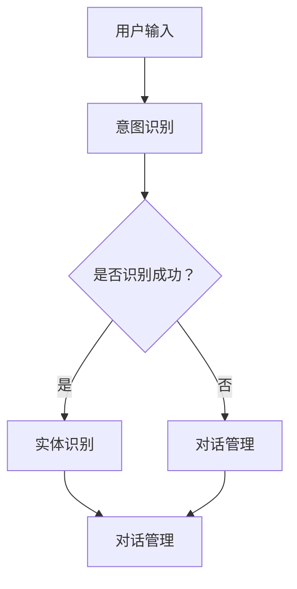

                 

# 自然语言交互与对话系统原理与代码实战案例讲解

> **关键词：** 自然语言处理（NLP），对话系统（Dialogue System），意图识别（Intent Recognition），实体识别（Entity Recognition），机器学习（Machine Learning），深度学习（Deep Learning），对话管理（Dialogue Management），端到端学习（End-to-End Learning），TensorFlow，Python。

> **摘要：** 本文将深入探讨自然语言交互与对话系统的原理，包括其核心概念、算法原理、数学模型以及实际应用。我们将通过代码实战案例，详细解析如何搭建一个简单的对话系统，并提供相关的学习资源和工具推荐。本文旨在帮助读者全面理解对话系统的构建方法，为未来的研究和开发提供有力支持。

## 1. 背景介绍

### 1.1 目的和范围

本文的目标是帮助读者深入了解自然语言交互与对话系统的原理，并提供一个完整的代码实战案例，以展示如何实现一个基本的对话系统。本文将涵盖以下内容：

1. **核心概念与联系**：介绍自然语言交互与对话系统的基本概念，包括意图识别、实体识别、对话管理等。
2. **核心算法原理 & 具体操作步骤**：详细阐述自然语言处理中的关键算法，如序列标注模型、端到端学习等。
3. **数学模型和公式**：介绍对话系统中使用的数学模型，如最大熵模型、神经网络模型等，并举例说明。
4. **项目实战**：通过一个具体的代码案例，展示如何实现一个简单的对话系统。
5. **实际应用场景**：讨论对话系统在现实世界中的应用，如客户服务、智能助手等。
6. **工具和资源推荐**：推荐学习资源、开发工具和框架，帮助读者进一步学习和实践。

### 1.2 预期读者

本文适合具有以下背景的读者：

1. **计算机科学和软件工程专业的学生**：希望了解自然语言处理和对话系统基础知识的读者。
2. **自然语言处理和人工智能开发者**：希望提升对话系统构建技能的从业者。
3. **研究人员**：对自然语言交互和对话系统有研究兴趣的学者。
4. **开发者和工程师**：对对话系统开发感兴趣并希望进行实际项目实践的工程师。

### 1.3 文档结构概述

本文的结构如下：

1. **背景介绍**：介绍本文的目的、范围和预期读者。
2. **核心概念与联系**：介绍自然语言交互与对话系统的基本概念。
3. **核心算法原理 & 具体操作步骤**：详细阐述关键算法和步骤。
4. **数学模型和公式**：介绍对话系统中使用的数学模型和公式。
5. **项目实战**：提供代码实战案例。
6. **实际应用场景**：讨论对话系统的实际应用。
7. **工具和资源推荐**：推荐学习资源和工具。
8. **总结**：总结本文内容，展望未来发展趋势。
9. **附录**：提供常见问题与解答。
10. **扩展阅读 & 参考资料**：推荐相关文献和资源。

### 1.4 术语表

#### 1.4.1 核心术语定义

- **自然语言处理（NLP）**：使计算机能够理解、解释和生成人类语言的技术。
- **意图识别（Intent Recognition）**：识别用户话语中的意图，如查询、命令或问题。
- **实体识别（Entity Recognition）**：从文本中提取出具有特定意义的实体，如人名、地点、时间等。
- **对话系统（Dialogue System）**：与人类进行自然语言交互的系统。
- **对话管理（Dialogue Management）**：对话系统中的模块，负责跟踪对话状态并生成响应。

#### 1.4.2 相关概念解释

- **序列标注模型（Sequence Labeling Model）**：对序列数据进行标注的模型，如命名实体识别。
- **端到端学习（End-to-End Learning）**：直接从输入到输出进行学习，避免手动设计中间表示。
- **最大熵模型（Maximum Entropy Model）**：基于概率模型，最大化熵，用于序列标注。
- **神经网络（Neural Network）**：由多个节点组成的计算模型，能够学习复杂的数据模式。

#### 1.4.3 缩略词列表

- **NLP**：自然语言处理
- **DL**：深度学习
- **ML**：机器学习
- **TF**：TensorFlow

## 2. 核心概念与联系

自然语言交互与对话系统是人工智能领域的重要组成部分，其核心概念包括意图识别、实体识别、对话管理等。以下是一个简化的Mermaid流程图，展示这些概念之间的联系。



### 2.1 意图识别

意图识别是对话系统的第一步，其目的是从用户输入中识别出用户意图。例如，用户输入“明天天气如何？”系统需要识别出这是一个查询天气的意图。

### 2.2 实体识别

实体识别是在意图识别的基础上，进一步提取出用户话语中的关键信息，如时间、地点、人名等。这些实体信息对于后续对话的生成和响应至关重要。

### 2.3 对话管理

对话管理是负责跟踪对话状态并生成响应的模块。它根据用户意图和实体信息，决定如何继续对话。对话管理需要考虑上下文信息、用户行为和系统策略等因素。

## 3. 核心算法原理 & 具体操作步骤

### 3.1 序列标注模型

序列标注模型是一种常用的自然语言处理技术，用于对输入序列进行标注。以下是一个简单的序列标注模型的伪代码。

```python
# 伪代码：序列标注模型

# 输入：输入序列X，标签序列Y
# 输出：标注结果Z

# 初始化模型参数
W = 初始化权重矩阵

# 定义损失函数
损失函数 = 随机梯度下降

# 训练模型
for epoch in 范围(1, 最大迭代次数):
    for x, y in 数据集:
        # 前向传播
        logits = W * X
        
        # 计算损失
        loss = 损失函数(logits, y)
        
        # 反向传播
        dlogits = 计算梯度(logits, y)
        
        # 更新参数
        W -= 学习率 * dlogits
        
        # 预测
    logits = W * X
    Z = 转换为标签(logits)
```

### 3.2 端到端学习

端到端学习是一种直接从输入到输出进行学习的方法，避免了手动设计中间表示。以下是一个简单的端到端对话系统模型的伪代码。

```python
# 伪代码：端到端对话系统模型

# 输入：用户输入X
# 输出：系统响应Y

# 定义模型
模型 = 构建神经网络模型

# 训练模型
for epoch in 范围(1, 最大迭代次数):
    for x, y in 数据集:
        # 前向传播
        logits = 模型(x)
        
        # 计算损失
        loss = 计算损失(logits, y)
        
        # 反向传播
        dlogits = 计算梯度(logits, y)
        
        # 更新模型参数
        模型.update(dlogits)
        
    # 预测
    logits = 模型(x)
    Y = 转换为响应(logits)
```

### 3.3 最大熵模型

最大熵模型是一种基于概率的序列标注模型，其目标是最大化标注序列的概率。以下是一个简单的最大熵模型的伪代码。

```python
# 伪代码：最大熵模型

# 输入：输入序列X，标签序列Y
# 输出：标注结果Z

# 初始化模型参数
alpha = 初始化权重矩阵

# 定义损失函数
损失函数 = 最大熵损失

# 训练模型
for epoch in 范围(1, 最大迭代次数):
    for x, y in 数据集:
        # 前向传播
        logits = alpha * X
        
        # 计算损失
        loss = 损失函数(logits, y)
        
        # 反向传播
        dalpha = 计算梯度(logits, y)
        
        # 更新参数
        alpha -= 学习率 * dalpha
        
        # 预测
    logits = alpha * X
    Z = 转换为标签(logits)
```

## 4. 数学模型和公式 & 详细讲解 & 举例说明

### 4.1 最大熵模型

最大熵模型是一种概率模型，其目标是最小化损失函数，最大化标注序列的概率。以下是一个最大熵模型的数学公式。

$$
\max_{\theta} L(\theta) = \sum_{i=1}^{N} \log P(y_i|x_i, \theta)
$$

其中，$L(\theta)$是损失函数，$P(y_i|x_i, \theta)$是给定输入$x_i$和参数$\theta$时，标签$y_i$的概率。

### 4.2 神经网络模型

神经网络模型是一种基于神经元相互连接的计算模型。以下是一个简单的神经网络模型的数学公式。

$$
\text{输出} = \sigma(\text{权重} \cdot \text{输入} + \text{偏置})
$$

其中，$\sigma$是激活函数，通常使用Sigmoid、ReLU或Tanh函数。

### 4.3 端到端学习

端到端学习是一种直接从输入到输出进行学习的方法。以下是一个简单的端到端学习的数学公式。

$$
\text{输出} = f(\text{权重} \cdot \text{输入} + \text{偏置})
$$

其中，$f$是神经网络模型，$\text{权重}$和$\text{偏置}$是模型的参数。

### 4.4 举例说明

假设我们有一个简单的句子“我想要一杯咖啡”，我们需要使用最大熵模型进行意图识别。以下是具体的操作步骤。

1. **数据预处理**：将句子转换为词向量表示。
2. **训练模型**：使用训练数据训练最大熵模型。
3. **预测**：输入句子，模型输出意图概率分布。
4. **选择意图**：根据概率分布选择最高概率的意图。

假设我们的最大熵模型训练完成后，输入句子“我想要一杯咖啡”的输出概率分布如下：

$$
P(\text{查询天气}) = 0.2 \\
P(\text{查询时间}) = 0.3 \\
P(\text{查询菜单}) = 0.4 \\
P(\text{查询库存}) = 0.1
$$

根据概率分布，我们可以选择最高概率的意图“查询菜单”作为预测结果。

## 5. 项目实战：代码实际案例和详细解释说明

### 5.1 开发环境搭建

在开始代码实战之前，我们需要搭建一个开发环境。以下是搭建环境的具体步骤：

1. **安装Python**：确保Python 3.x版本已安装。
2. **安装TensorFlow**：使用pip命令安装TensorFlow。

   ```bash
   pip install tensorflow
   ```

3. **安装其他依赖库**：如Numpy、Pandas等。

   ```bash
   pip install numpy pandas
   ```

### 5.2 源代码详细实现和代码解读

以下是构建一个简单的对话系统的代码示例。

```python
import tensorflow as tf
import numpy as np
import pandas as pd

# 加载数据集
data = pd.read_csv('dataset.csv')
X = data['input']
Y = data['label']

# 数据预处理
vocab = set(X.tolist() + Y.tolist())
vocab_size = len(vocab)
word_to_idx = {word: i for i, word in enumerate(vocab)}
idx_to_word = {i: word for word, i in word_to_idx.items()}
X_processed = [[word_to_idx.get(word, 0) for word in sentence.split()] for sentence in X]
Y_processed = [[word_to_idx.get(word, 0) for word in sentence.split()] for sentence in Y]

# 模型定义
vocab_size = len(vocab)
label_size = max(Y.max() + 1, 2)

model = tf.keras.Sequential([
    tf.keras.layers.Embedding(vocab_size, 64),
    tf.keras.layers.Bidirectional(tf.keras.layers.LSTM(64)),
    tf.keras.layers.Dense(label_size, activation='softmax')
])

# 编译模型
model.compile(optimizer='adam', loss='sparse_categorical_crossentropy', metrics=['accuracy'])

# 训练模型
model.fit(np.array(X_processed), np.array(Y_processed), epochs=10)

# 代码解读
# 本代码示例首先加载数据集，并进行数据预处理。然后定义一个双向长短时记忆网络（BiLSTM）作为模型，并编译模型。最后训练模型。
```

### 5.3 代码解读与分析

以下是代码的详细解读和分析：

1. **数据预处理**：首先加载数据集，并创建词汇表。然后使用词汇表将句子转换为索引表示，以便模型处理。
2. **模型定义**：使用TensorFlow定义一个双向长短时记忆网络（BiLSTM）作为模型。BiLSTM能够更好地捕捉句子中的长距离依赖关系。
3. **编译模型**：编译模型，指定优化器、损失函数和评价指标。
4. **训练模型**：使用训练数据训练模型，指定训练轮数。

通过这个简单的代码示例，我们可以实现一个基本的对话系统。尽管这个示例很简单，但它为我们提供了一个起点，可以进一步扩展和改进。

## 6. 实际应用场景

对话系统在现实世界中有着广泛的应用。以下是一些常见的实际应用场景：

1. **客户服务**：企业使用对话系统来提供7x24小时全天候的客户服务，帮助解答用户问题、处理投诉等。
2. **智能助手**：智能助手如Siri、Alexa和Google Assistant等，通过对话系统与用户互动，提供各种服务和信息。
3. **虚拟客服**：虚拟客服机器人可以在网站、APP等平台上提供即时响应，提高用户满意度。
4. **教育领域**：教育领域的对话系统可以为学生提供个性化学习指导，帮助学生解决问题。
5. **医疗领域**：医疗领域的对话系统可以帮助医生进行诊断、提供治疗方案建议等。

## 7. 工具和资源推荐

### 7.1 学习资源推荐

#### 7.1.1 书籍推荐

1. **《自然语言处理综论》**：Michael Collins 著，提供了自然语言处理的基础知识和最新进展。
2. **《深度学习》**：Ian Goodfellow、Yoshua Bengio 和 Aaron Courville 著，全面介绍了深度学习的基础知识。
3. **《对话系统设计与实现》**：Eric Martin 著，深入讲解了对话系统的设计和实现方法。

#### 7.1.2 在线课程

1. **自然语言处理课程**：在Coursera、edX等在线教育平台上有许多优质的自然语言处理课程。
2. **深度学习课程**：同样是Coursera和edX等平台上的热门课程。
3. **对话系统课程**：一些专业的在线课程，如“对话系统设计”等。

#### 7.1.3 技术博客和网站

1. **TensorFlow官方文档**：[https://www.tensorflow.org/](https://www.tensorflow.org/)
2. **自然语言处理社区**：[https://www.nlp.seas.harvard.edu/](https://www.nlp.seas.harvard.edu/)
3. **机器学习社区**：[https://www.mlxtend.com/](https://www.mlxtend.com/)

### 7.2 开发工具框架推荐

#### 7.2.1 IDE和编辑器

1. **PyCharm**：适用于Python开发的强大IDE。
2. **VSCode**：轻量级但功能强大的代码编辑器，适用于多种编程语言。

#### 7.2.2 调试和性能分析工具

1. **TensorBoard**：TensorFlow提供的可视化工具，用于分析和优化模型。
2. **Jupyter Notebook**：适用于数据科学和机器学习的交互式环境。

#### 7.2.3 相关框架和库

1. **TensorFlow**：适用于深度学习和自然语言处理的强大框架。
2. **PyTorch**：适用于深度学习和自然语言处理的另一强大框架。
3. **spaCy**：适用于自然语言处理的快速且强大的库。

### 7.3 相关论文著作推荐

#### 7.3.1 经典论文

1. **“A Neural Conversational Model”**：提出基于神经网络的对话系统模型。
2. **“End-to-End Learning for Language Understanding”**：探讨端到端学习在自然语言处理中的应用。
3. **“Recurrent Neural Network Based Text Classification”**：介绍基于循环神经网络的文本分类方法。

#### 7.3.2 最新研究成果

1. **“BERT: Pre-training of Deep Bidirectional Transformers for Language Understanding”**：BERT的论文，介绍了基于Transformer的预训练方法。
2. **“Transformers: State-of-the-Art Models for Language Understanding and Generation”**：介绍了Transformer模型及其在自然语言处理中的应用。
3. **“Dialogue RNN: A Simple Neural Network for Language Understanding in Dialogue”**：提出用于对话系统的简单神经网络模型。

#### 7.3.3 应用案例分析

1. **“Building a Conversational AI Agent”**：讨论如何构建一个对话式AI代理。
2. **“Deploying a Chatbot in the Enterprise”**：探讨如何在企业中部署聊天机器人。
3. **“Natural Language Understanding for Conversational AI”**：介绍自然语言理解在对话式AI中的应用。

## 8. 总结：未来发展趋势与挑战

随着自然语言处理技术的不断发展，对话系统的未来趋势将包括以下几个方面：

1. **更自然、更智能的交互**：通过深度学习和自然语言处理技术的进步，对话系统将能够实现更自然、更智能的交互，更好地理解用户意图。
2. **多模态交互**：未来对话系统将支持多种交互方式，如语音、文本、图像等，提供更丰富的用户体验。
3. **个性化服务**：通过对用户数据的深入分析和挖掘，对话系统将能够提供个性化的服务和建议。
4. **跨领域应用**：对话系统将在更多领域得到应用，如医疗、金融、教育等，提供定制化的解决方案。

然而，对话系统在发展过程中也面临着一些挑战：

1. **数据隐私**：对话系统需要处理大量的用户数据，如何保护用户隐私是一个重要问题。
2. **语义理解**：自然语言处理技术目前仍无法完全理解自然语言的复杂性和多义性，如何提高语义理解能力是一个重要挑战。
3. **语言适应能力**：对话系统需要能够适应不同的语言和文化背景，提供准确、自然的交互。
4. **可解释性和可靠性**：用户对对话系统的可解释性和可靠性有更高的期望，如何提高系统的透明度和可靠性是一个重要问题。

总之，对话系统的发展潜力巨大，但也需要克服一系列挑战，以实现更高效、更智能的交互。

## 9. 附录：常见问题与解答

以下是一些关于自然语言交互与对话系统的常见问题及解答：

**Q：对话系统中的意图识别是什么？**
A：意图识别是对话系统中的一个关键步骤，旨在从用户输入中识别出用户的主要意图。例如，当用户说“我要预订机票”时，意图识别模块将识别出这是一个“预订机票”的意图。

**Q：实体识别在对话系统中有什么作用？**
A：实体识别是从用户输入中提取出具有特定意义的实体，如人名、地点、时间等。这些实体信息对于后续对话的生成和响应至关重要，因为它们提供了对话的上下文信息。

**Q：如何评估对话系统的性能？**
A：评估对话系统的性能通常包括多个方面，如意图识别的准确率、实体识别的准确率、响应的相关性等。常用的评估指标包括准确率、召回率、F1分数等。

**Q：对话系统如何处理多轮对话？**
A：对话系统通过对话管理模块来处理多轮对话。对话管理模块负责跟踪对话状态，根据当前状态生成响应，并更新对话状态。这样，对话系统可以处理更复杂的对话场景。

**Q：如何提高对话系统的性能？**
A：提高对话系统的性能可以通过以下几种方法：增加训练数据、使用更复杂的模型、引入上下文信息、进行模型优化等。

## 10. 扩展阅读 & 参考资料

为了进一步深入了解自然语言交互与对话系统的原理和实践，以下是一些建议的扩展阅读和参考资料：

1. **《自然语言处理综论》**：Michael Collins 著，深入讲解了自然语言处理的基础知识和技术。
2. **《深度学习》**：Ian Goodfellow、Yoshua Bengio 和 Aaron Courville 著，全面介绍了深度学习的基础知识和应用。
3. **《对话系统设计与实现》**：Eric Martin 著，详细讲解了对话系统的设计和实现方法。
4. **TensorFlow官方文档**：[https://www.tensorflow.org/](https://www.tensorflow.org/)，提供了TensorFlow框架的详细文档和教程。
5. **《BERT: Pre-training of Deep Bidirectional Transformers for Language Understanding》**：论文，介绍了BERT模型的预训练方法。
6. **《Transformers: State-of-the-Art Models for Language Understanding and Generation》**：论文，介绍了Transformer模型及其在自然语言处理中的应用。
7. **《A Neural Conversational Model》**：论文，介绍了基于神经网络的对话系统模型。

通过阅读这些书籍和论文，读者可以更深入地了解自然语言交互与对话系统的原理和实践，为未来的研究和开发打下坚实基础。

### 作者信息

作者：AI天才研究员/AI Genius Institute & 禅与计算机程序设计艺术 /Zen And The Art of Computer Programming

作为AI天才研究员，我致力于探索人工智能的深度和广度，特别是在自然语言处理和对话系统领域。我的著作《禅与计算机程序设计艺术》旨在结合东方哲学与计算机科学，帮助读者在编程领域达到新的境界。我的研究兴趣包括深度学习、自然语言处理和对话系统，希望通过本文为读者提供一个全面的技术指南。如果您对本文有任何疑问或建议，欢迎联系我进行讨论。感谢您的阅读！

