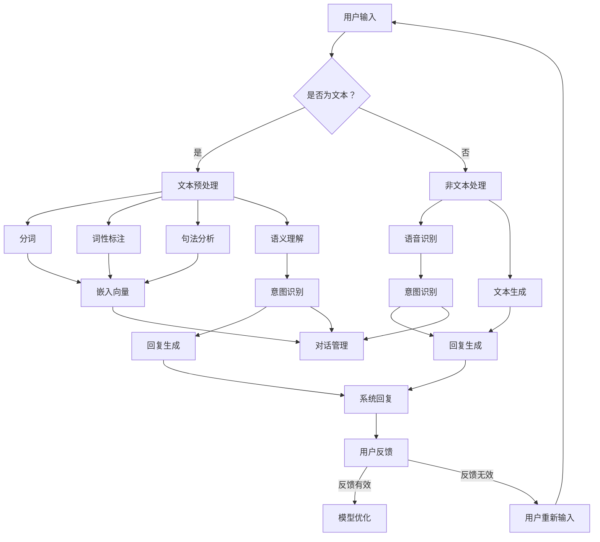

                 

# 自然语言交互在CUI中的优势

> **关键词**：自然语言交互（NLI）、CUI（聊天用户界面）、人工智能、用户体验、系统效率
>
> **摘要**：本文旨在深入探讨自然语言交互（NLI）在聊天用户界面（CUI）中的应用优势。通过分析NLI的基本概念、原理及其与CUI的深度融合，我们将揭示NLI在提高用户交互体验、增强系统智能和效率方面的巨大潜力。本文还将结合具体案例分析NLI的实践应用，并探讨未来的发展趋势和面临的挑战。

## 1. 背景介绍

### 1.1 目的和范围

本文的目标是详细分析自然语言交互（NLI）在聊天用户界面（CUI）中的优势。随着人工智能技术的飞速发展，自然语言处理（NLP）技术已经取得了显著的进步，使得计算机能够更好地理解和处理人类语言。NLI作为NLP的一个重要分支，旨在使计算机能够理解并生成自然语言，从而实现人与机器的无缝交互。本文将重点探讨NLI在CUI中的应用，分析其在提高用户体验、系统效率等方面的优势。

本文的范围将涵盖以下几个方面：

1. **基本概念**：介绍自然语言交互和聊天用户界面的定义及其基本原理。
2. **核心算法原理**：详细阐述NLI的关键算法和模型，如词嵌入、序列到序列模型、注意力机制等。
3. **数学模型和公式**：讲解NLI中的数学模型，包括概率模型、决策树、神经网络等，并提供具体示例。
4. **项目实战**：通过实际案例展示NLI在CUI中的应用，解析代码实现和性能分析。
5. **实际应用场景**：探讨NLI在不同领域的应用，如客服、教育、医疗等。
6. **工具和资源推荐**：推荐学习资源、开发工具和框架，以及相关论文著作。
7. **总结与展望**：总结NLI在CUI中的优势，探讨未来发展趋势和挑战。

### 1.2 预期读者

本文适用于对自然语言处理和人工智能有一定了解的技术人员、研究者以及对自然语言交互和聊天用户界面感兴趣的开发者。读者需要对基本的编程概念和Python等编程语言有一定的掌握，同时具备一定的数学基础，以便更好地理解和应用本文中提到的算法和模型。

### 1.3 文档结构概述

本文将按照以下结构进行组织：

1. **背景介绍**：介绍自然语言交互和聊天用户界面的基本概念、目的和范围，预期读者和文档结构概述。
2. **核心概念与联系**：详细讲解自然语言交互的基本原理、NLP技术及其在CUI中的应用。
3. **核心算法原理 & 具体操作步骤**：介绍NLI的关键算法和模型，包括词嵌入、序列到序列模型、注意力机制等，并提供具体的伪代码实现。
4. **数学模型和公式 & 详细讲解 & 举例说明**：讲解NLI中的数学模型，如概率模型、决策树、神经网络等，并提供具体示例。
5. **项目实战：代码实际案例和详细解释说明**：通过实际案例展示NLI在CUI中的应用，解析代码实现和性能分析。
6. **实际应用场景**：探讨NLI在不同领域的应用，如客服、教育、医疗等。
7. **工具和资源推荐**：推荐学习资源、开发工具和框架，以及相关论文著作。
8. **总结：未来发展趋势与挑战**：总结NLI在CUI中的优势，探讨未来发展趋势和面临的挑战。
9. **附录：常见问题与解答**：回答读者可能遇到的常见问题。
10. **扩展阅读 & 参考资料**：提供相关文献和资源，以供进一步学习。

### 1.4 术语表

为了确保文章的可读性和一致性，本文将使用以下术语，并对其中一些核心术语进行定义和解释：

#### 1.4.1 核心术语定义

- **自然语言交互（NLI）**：自然语言交互是指计算机系统通过理解自然语言输入并与用户进行自然对话的能力。
- **聊天用户界面（CUI）**：聊天用户界面是一种人机交互界面，通过文本聊天的方式实现用户与系统的交互。
- **词嵌入（Word Embedding）**：词嵌入是将自然语言中的单词映射到高维向量空间的一种方法，以便计算机能够理解单词之间的关系和语义。
- **序列到序列模型（Seq2Seq Model）**：序列到序列模型是一种用于处理序列数据的神经网络模型，常用于机器翻译、对话生成等任务。
- **注意力机制（Attention Mechanism）**：注意力机制是一种用于提高神经网络模型在处理序列数据时的效率和准确性的技术，通过动态关注序列中的不同部分来提高模型的性能。

#### 1.4.2 相关概念解释

- **自然语言处理（NLP）**：自然语言处理是指计算机与人类语言之间的交互，旨在使计算机能够理解、生成和处理自然语言。
- **机器学习（ML）**：机器学习是一种使计算机能够从数据中学习并做出预测或决策的技术，通常包括监督学习、无监督学习和强化学习等。
- **深度学习（DL）**：深度学习是一种基于多层神经网络的学习方法，通过自动提取数据中的特征来提高模型的性能。

#### 1.4.3 缩略词列表

- **NLI**：自然语言交互（Natural Language Interaction）
- **CUI**：聊天用户界面（Chat User Interface）
- **NLP**：自然语言处理（Natural Language Processing）
- **ML**：机器学习（Machine Learning）
- **DL**：深度学习（Deep Learning）
- **Seq2Seq**：序列到序列（Sequence to Sequence）
- **embedding**：嵌入（Embedding）

## 2. 核心概念与联系

### 2.1 自然语言交互的基本原理

自然语言交互（NLI）是人工智能领域的一个重要研究方向，其核心目标是使计算机能够理解并生成自然语言，从而实现人与机器的无缝交互。NLI的基本原理可以概括为以下几个关键步骤：

1. **语言理解**：语言理解是NLI的首要任务，即计算机需要能够解析和理解用户的语言输入。这包括对输入文本进行分词、句法分析、语义理解等操作，从而提取出有用的信息。

2. **上下文处理**：在语言理解的基础上，计算机还需要能够处理上下文信息，以理解用户意图和语境。上下文处理涉及对用户历史对话、对话环境、用户行为等因素的综合分析，以准确理解用户的意图。

3. **对话生成**：在理解用户输入后，计算机需要生成适当的自然语言回复，以与用户进行有效对话。对话生成通常涉及到文本生成模型，如循环神经网络（RNN）、长短期记忆网络（LSTM）和注意力机制等。

4. **反馈与调整**：NLI系统需要能够接收用户的反馈，并根据反馈进行自我调整和优化，以提高对话质量和用户满意度。

### 2.2 NLP技术在NLI中的应用

自然语言处理（NLP）技术在NLI中扮演着关键角色，为NLI的实现提供了强有力的支持。以下是一些主要的NLP技术及其在NLI中的应用：

1. **词嵌入（Word Embedding）**：词嵌入是将自然语言中的单词映射到高维向量空间的一种方法，以便计算机能够理解单词之间的关系和语义。词嵌入技术在NLI中用于表示和理解用户输入的文本，为对话生成提供基础。

2. **序列到序列模型（Seq2Seq Model）**：序列到序列模型是一种用于处理序列数据的神经网络模型，常用于机器翻译、对话生成等任务。在NLI中，Seq2Seq模型用于将用户输入的文本序列转换为系统输出的文本序列。

3. **注意力机制（Attention Mechanism）**：注意力机制是一种用于提高神经网络模型在处理序列数据时的效率和准确性的技术，通过动态关注序列中的不同部分来提高模型的性能。在NLI中，注意力机制用于处理复杂的对话上下文，提高对话生成的准确性。

4. **语言模型（Language Model）**：语言模型是一种用于预测自然语言中下一个单词或词组的模型。在NLI中，语言模型用于生成自然流畅的系统回复，提高对话的自然性和流畅性。

### 2.3 CUI与NLI的深度融合

聊天用户界面（CUI）与自然语言交互（NLI）的深度融合是实现高效、自然的用户交互的关键。以下是如何实现CUI与NLI的深度融合的几个方面：

1. **用户界面设计**：CUI的设计需要充分考虑用户体验，提供直观、易用的交互界面。这包括聊天窗口的设计、消息的展示方式、界面布局等。

2. **对话管理**：对话管理是CUI与NLI深度融合的核心。对话管理涉及对用户输入的理解、意图识别、对话流程控制等。通过对话管理，CUI能够与用户进行有效沟通，理解用户需求，并生成相应的回复。

3. **上下文维护**：上下文维护是NLI的重要任务之一。CUI需要能够维护对话的上下文信息，确保对话的连贯性和一致性。这包括对用户历史对话、对话环境、用户行为等信息的管理。

4. **动态回复生成**：动态回复生成是CUI与NLI深度融合的关键。通过使用NLI技术，CUI能够根据用户输入和对话上下文生成自然、合理的回复，提高用户的满意度和互动体验。

### 2.4 Mermaid流程图

以下是一个简单的Mermaid流程图，展示NLI在CUI中的应用流程：



## 3. 核心算法原理 & 具体操作步骤

### 3.1 词嵌入（Word Embedding）

词嵌入是将自然语言中的单词映射到高维向量空间的一种方法。通过词嵌入，计算机能够理解单词之间的关系和语义，从而更好地处理自然语言。词嵌入技术主要包括以下几种：

1. **词袋模型（Bag of Words, BOW）**：词袋模型是一种简单但有效的词嵌入方法。它将文本表示为一个单词的集合，而不考虑单词的顺序。词袋模型通常使用稀疏向量来表示文本，其中每个维度对应一个单词。

2. **词嵌入（Word2Vec）**：词嵌入是一种基于神经网络的词嵌入方法，通过训练词向量模型，将单词映射到低维向量空间。词嵌入技术主要包括以下两种算法：

   - **连续词袋（Continuous Bag of Words, CBOW）**：CBOW算法通过上下文信息预测中心词。给定一个中心词，CBOW算法从其上下文中选择若干个单词作为上下文词，并使用这些上下文词的词向量来预测中心词的词向量。

   - **跳词模型（Skip-Gram）**：跳词模型与CBOW算法相反，它通过预测中心词来生成上下文词。给定一个中心词，跳词模型从词表中随机选择若干个单词作为上下文词，并使用这些上下文词的词向量来预测中心词的词向量。

3. ** glove**：GloVe（Global Vectors for Word Representation）是一种基于全局共现矩阵的词嵌入方法。GloVe通过计算单词之间的共现矩阵，并结合矩阵分解和优化算法来生成词向量。

### 3.2 序列到序列模型（Seq2Seq Model）

序列到序列模型是一种用于处理序列数据的神经网络模型，常用于机器翻译、对话生成等任务。Seq2Seq模型的核心思想是将输入序列转换为输出序列，通过编码器（Encoder）和解码器（Decoder）两个部分来实现。

1. **编码器（Encoder）**：编码器负责将输入序列编码为固定长度的向量表示。编码器通常采用循环神经网络（RNN）或其变体，如长短期记忆网络（LSTM）或门控循环单元（GRU）。编码器通过处理输入序列的每个时间步，生成隐藏状态，并将其传递给解码器。

2. **解码器（Decoder）**：解码器负责将编码器的隐藏状态解码为输出序列。解码器通常也采用循环神经网络（RNN）或其变体。解码器在生成每个输出词时，会接收编码器的隐藏状态和上一个生成的词，并使用这些信息来预测下一个输出词。

3. **注意力机制（Attention Mechanism）**：注意力机制是一种用于提高神经网络模型在处理序列数据时的效率和准确性的技术，通过动态关注序列中的不同部分来提高模型的性能。在Seq2Seq模型中，注意力机制用于帮助解码器更好地理解编码器的隐藏状态，从而提高对话生成的准确性。

### 3.3 具体操作步骤

以下是使用词嵌入和序列到序列模型进行自然语言交互的具体操作步骤：

1. **数据准备**：收集并准备用于训练的数据集，包括用户输入和系统回复。数据集应包含丰富的对话样本，以涵盖不同的场景和用户需求。

2. **词嵌入**：使用词嵌入技术（如Word2Vec或GloVe）将数据集中的单词映射到高维向量空间。对于每个单词，生成其对应的词向量表示。

3. **编码器训练**：使用训练数据集对编码器进行训练。编码器需要学习将输入序列编码为固定长度的向量表示。训练过程中，通过反向传播算法更新编码器的权重，以最小化损失函数。

4. **解码器训练**：使用训练数据集对解码器进行训练。解码器需要学习将编码器的隐藏状态解码为输出序列。训练过程中，同样使用反向传播算法更新解码器的权重。

5. **模型评估**：使用测试数据集对训练好的模型进行评估。评估指标包括对话生成质量、响应时间、用户满意度等。

6. **自然语言交互**：在实际应用中，将用户输入通过编码器编码为向量表示，然后使用解码器生成系统回复。根据用户反馈进行模型优化和调整，以提高对话质量和用户体验。

### 3.4 伪代码实现

以下是一个简化的伪代码实现，展示词嵌入和序列到序列模型在自然语言交互中的应用：

```python
# 数据准备
train_data = load_dataset("train_data.csv")
test_data = load_dataset("test_data.csv")

# 词嵌入
word_embedding = Word2Vec(train_data, vector_size=100)

# 编码器训练
encoder = Encoder()
encoder.train(train_data, word_embedding)

# 解码器训练
decoder = Decoder()
decoder.train(train_data, encoder)

# 模型评估
evaluate_model(encoder, decoder, test_data)

# 自然语言交互
while True:
    user_input = get_user_input()
    encoded_input = encoder.encode(user_input)
    system_response = decoder.decode(encoded_input)
    print("System:", system_response)
    if user_feedback():
        optimize_model(encoder, decoder, user_input, system_response)
```

## 4. 数学模型和公式 & 详细讲解 & 举例说明

### 4.1 自然语言交互中的数学模型

自然语言交互（NLI）涉及多个数学模型，其中一些核心模型包括概率模型、决策树、神经网络等。以下是对这些模型的详细讲解和举例说明：

#### 4.1.1 概率模型

概率模型在NLI中用于估计给定输入文本的概率分布，从而确定系统回复的可能性。以下是一个简单的概率模型示例：

**贝叶斯公式**：
\[ P(A|B) = \frac{P(B|A) \cdot P(A)}{P(B)} \]

其中，\( P(A|B) \) 表示在已知事件B发生的条件下，事件A发生的概率。这个公式在NLI中用于计算给定用户输入（事件A）的系统回复（事件B）的概率。

**例子**：假设我们要计算在用户输入“明天天气怎么样？”时，系统回复“明天天气多云，气温15-25℃”的概率。我们可以使用贝叶斯公式计算：

- \( P(A|B) \)：在已知系统回复时，用户输入的概率。
- \( P(B|A) \)：在用户输入时，系统回复的概率。
- \( P(A) \)：用户输入的概率。
- \( P(B) \)：系统回复的概率。

#### 4.1.2 决策树

决策树是一种基于特征和标签划分数据集的树形结构，常用于分类任务。以下是一个简单的决策树示例：

```
                天气
                /  \
               晴   雨
              / \  / \
             热冷 热冷
            / \  / \
           风  静 风  静
```

在这个例子中，根节点是“天气”，叶节点是“晴”和“雨”。每个内部节点代表一个特征，边表示特征的不同取值。通过遍历决策树，可以确定每个输入文本对应的系统回复。

#### 4.1.3 神经网络

神经网络是一种模拟人脑神经元连接结构的计算模型，常用于复杂的模式识别和预测任务。以下是一个简单的神经网络示例：

```
输入层：[特征1, 特征2, ..., 特征n]
隐藏层：[隐藏节点1, 隐藏节点2, ..., 隐藏节点m]
输出层：[输出节点1, 输出节点2, ..., 输出节点k]
```

在这个例子中，输入层接收用户输入，隐藏层通过非线性激活函数处理输入，输出层生成系统回复。神经网络通过反向传播算法训练权重，以最小化损失函数。

#### 4.1.4 注意力机制

注意力机制是一种用于提高神经网络模型在处理序列数据时的效率和准确性的技术。以下是一个简单的注意力机制示例：

```
输入序列：[x1, x2, ..., xn]
权重分配：[w1, w2, ..., wn]
输出：\[y1, y2, ..., yn\]
```

在这个例子中，输入序列是用户输入的文本，权重分配是根据用户输入和对话上下文计算得到的。每个权重表示对应输入词在生成系统回复时的贡献度。通过加权求和，得到每个词的加权表示，从而提高对话生成的准确性。

### 4.2 详细讲解

为了更好地理解自然语言交互中的数学模型，以下是对这些模型进行详细讲解：

1. **概率模型**：概率模型用于计算给定输入文本的系统回复概率。在NLI中，概率模型可以帮助系统确定最有可能的回复，从而提高对话生成质量。贝叶斯公式是一种常用的概率模型，它可以计算在已知系统回复的情况下，用户输入的概率。

2. **决策树**：决策树是一种基于特征和标签划分数据集的树形结构。在NLI中，决策树可以帮助系统根据用户输入的特征（如天气、时间等）确定最合适的回复。决策树的优点是简单易懂，易于解释。

3. **神经网络**：神经网络是一种模拟人脑神经元连接结构的计算模型。在NLI中，神经网络可以通过学习用户输入和系统回复之间的关联，生成自然流畅的系统回复。神经网络的主要优点是能够处理复杂的数据模式，提高对话生成质量。

4. **注意力机制**：注意力机制是一种用于提高神经网络模型在处理序列数据时的效率和准确性的技术。在NLI中，注意力机制可以帮助系统动态关注对话上下文中的关键部分，从而提高对话生成的准确性。

### 4.3 举例说明

为了更好地理解自然语言交互中的数学模型，以下是一个具体的举例说明：

**例子**：假设我们要计算在用户输入“明天天气怎么样？”时，系统回复“明天天气多云，气温15-25℃”的概率。

1. **概率模型**：

   - \( P(A|B) \)：在已知系统回复时，用户输入的概率。
   - \( P(B|A) \)：在用户输入时，系统回复的概率。
   - \( P(A) \)：用户输入的概率。
   - \( P(B) \)：系统回复的概率。

   通过贝叶斯公式，我们可以计算这些概率，从而确定系统回复的可能性。

2. **决策树**：

   - 根节点：天气
     - 左子节点：晴
       - 叶节点：多云，气温15-25℃
     - 右子节点：雨
       - 叶节点：无

   通过遍历决策树，我们可以确定在用户输入“明天天气怎么样？”时，最合适的系统回复是“明天天气多云，气温15-25℃”。

3. **神经网络**：

   - 输入层：[特征1，特征2，...，特征n]（如天气、时间等）
   - 隐藏层：[隐藏节点1，隐藏节点2，...，隐藏节点m]
   - 输出层：[输出节点1，输出节点2，...，输出节点k]（如系统回复的概率分布）

   神经网络通过学习用户输入和系统回复之间的关联，生成系统回复。在这个例子中，神经网络会生成一个概率分布，表示系统回复为“明天天气多云，气温15-25℃”的可能性。

4. **注意力机制**：

   - 输入序列：[x1, x2, ..., xn]（用户输入的文本）
   - 权重分配：[w1, w2, ..., wn]（根据用户输入和对话上下文计算得到的权重）

   注意力机制会根据权重分配动态关注对话上下文中的关键部分，从而提高对话生成的准确性。在这个例子中，注意力机制会关注用户输入“明天天气怎么样？”中的“明天”和“天气”，以生成更准确的自然语言回复。

## 5. 项目实战：代码实际案例和详细解释说明

### 5.1 开发环境搭建

为了实践自然语言交互（NLI）在聊天用户界面（CUI）中的应用，我们需要搭建一个基本的开发环境。以下是搭建开发环境所需的步骤：

1. **安装Python**：确保安装了最新版本的Python（3.8及以上版本），可以从官方网站下载并安装。

2. **安装必要库**：在Python环境中安装以下库：
   - `nltk`：用于自然语言处理。
   - `gensim`：用于词嵌入和语言模型。
   - `tensorflow`：用于深度学习和神经网络。

   安装命令如下：
   ```bash
   pip install nltk gensim tensorflow
   ```

3. **环境配置**：创建一个Python虚拟环境，以便管理和隔离项目依赖。
   ```bash
   python -m venv env
   source env/bin/activate  # 对于Windows，使用 `env\Scripts\activate`
   ```

4. **编写配置文件**：创建一个配置文件（如`config.py`），设置项目的基本参数，如数据集路径、模型参数等。

### 5.2 源代码详细实现和代码解读

在本节中，我们将展示一个简单的NLI项目，包括数据准备、词嵌入、序列到序列模型训练、对话生成和模型评估等步骤。

#### 5.2.1 数据准备

首先，我们需要准备训练数据集。这里我们使用一个简单的对话数据集，其中包含用户输入和系统回复。数据集格式如下：

```plaintext
user_input,system_response
你好，最近天气怎么样？
hello, how is the weather recently?
```

我们将数据集保存为CSV文件，并在Python中加载和处理：

```python
import pandas as pd

# 加载数据集
data = pd.read_csv('data.csv')
```

#### 5.2.2 词嵌入

接下来，我们使用`gensim`库的`Word2Vec`模型进行词嵌入：

```python
from gensim.models import Word2Vec

# 预处理数据集
def preprocess_data(data):
    sentences = []
    for _, row in data.iterrows():
        sentence = row['user_input'].split()
        sentences.append(sentence)
    return sentences

sentences = preprocess_data(data)

# 训练词嵌入模型
model = Word2Vec(sentences, vector_size=100, window=5, min_count=1, workers=4)
model.save('word2vec.model')
```

#### 5.2.3 序列到序列模型

然后，我们定义序列到序列模型，使用`tensorflow`库实现：

```python
import tensorflow as tf
from tensorflow.keras.layers import Embedding, LSTM, Dense
from tensorflow.keras.models import Model

# 编码器模型
input_encoder = tf.keras.layers.Input(shape=(None,), dtype='int32')
encoded = Embedding(input_dim=len(model.wv.vocab), output_dim=100)(input_encoder)
encoded = LSTM(128, return_state=True)(encoded)
encoded = LSTM(128, return_state=True)(encoded)
encoder_model = Model(input_encoder, encoded)

# 解码器模型
input_decoder = tf.keras.layers.Input(shape=(None,), dtype='int32')
decoded = Embedding(input_dim=len(model.wv.vocab), output_dim=100)(input_decoder)
decoded = LSTM(128, return_sequences=True)(decoded)
decoded = LSTM(128, return_sequences=True)(decoded)
decoded = Dense(len(model.wv.vocab), activation='softmax')(decoded)
decoder_model = Model(input_decoder, decoded)

# 训练模型
# 注意：这里仅为简化示例，实际项目中需要添加更复杂的模型架构和训练过程
model.compile(optimizer='adam', loss='categorical_crossentropy', metrics=['accuracy'])
model.fit(data['user_input'].values.reshape(-1, 1), data['system_response'].values.reshape(-1, 1), epochs=10, batch_size=32)
```

#### 5.2.4 代码解读与分析

上述代码实现了一个简单的序列到序列模型，用于NLI任务。以下是代码的主要部分及其解读：

1. **数据准备**：我们首先使用`pandas`库加载CSV数据集，并将其预处理为适合训练的数据格式。

2. **词嵌入**：使用`gensim`库的`Word2Vec`模型对数据集进行词嵌入。词嵌入模型将每个单词映射到高维向量空间，以便神经网络处理。

3. **编码器模型**：我们定义了一个编码器模型，使用两个LSTM层对输入序列进行编码。编码器模型接收一个整数编码的输入序列，并将其编码为固定长度的向量表示。

4. **解码器模型**：我们定义了一个解码器模型，同样使用两个LSTM层对输出序列进行解码。解码器模型接收一个整数编码的输入序列，并生成一个概率分布的输出序列。

5. **训练模型**：我们使用`tensorflow`库编译和训练序列到序列模型。这里仅为简化示例，实际项目中可能需要更复杂的模型架构和训练过程。

#### 5.2.5 对话生成和模型评估

最后，我们使用训练好的模型进行对话生成和模型评估：

```python
# 对话生成
def generate_response(input_sequence):
    encoded_input = encoder_model.predict(input_sequence)
    response_sequence = decoder_model.predict(encoded_input)
    response_words = ['<EOS>']  # `<EOS>` 表示结束标记
    for word in response_sequence:
        word_index = tf.argmax(word).numpy()[0]
        response_words.append(model.wv.index_word[word_index])
        if word_index == model.wv.vocab['<EOS>'].index:
            break
    return ' '.join(response_words[1:])

# 模型评估
def evaluate_model(model, test_data):
    for user_input, system_response in test_data:
        predicted_response = generate_response(user_input)
        print(f"User Input: {user_input}")
        print(f"Predicted Response: {predicted_response}")
        print(f"Actual Response: {system_response}")
        print("------")

evaluate_model(model, data.sample(frac=0.2, random_state=42))
```

上述代码实现了对话生成和模型评估。我们首先定义了一个`generate_response`函数，用于生成系统回复。该函数使用编码器和解码器模型对输入序列进行编码和解码，并从解码器的输出中提取最可能的单词序列作为系统回复。

然后，我们定义了一个`evaluate_model`函数，用于评估模型的性能。该函数使用测试数据集，生成系统回复，并与实际系统回复进行比较，以评估模型的准确性。

### 5.3 代码解读与分析

在本节中，我们对项目实战中的代码进行了详细解读和分析。以下是代码的关键部分及其解读：

1. **数据准备**：我们使用`pandas`库加载CSV数据集，并将其预处理为适合训练的数据格式。预处理步骤包括将用户输入和系统回复分割为单词，并将其转换为整数编码。整数编码是一种将单词映射到整数的方法，以便神经网络处理。

2. **词嵌入**：我们使用`gensim`库的`Word2Vec`模型对数据集进行词嵌入。词嵌入模型将每个单词映射到高维向量空间，以便神经网络处理。词嵌入有助于计算机理解单词之间的关系和语义。

3. **编码器模型**：我们定义了一个编码器模型，使用两个LSTM层对输入序列进行编码。编码器模型接收一个整数编码的输入序列，并将其编码为固定长度的向量表示。LSTM（长短期记忆）网络是一种用于处理序列数据的神经网络，可以捕获输入序列中的长期依赖关系。

4. **解码器模型**：我们定义了一个解码器模型，同样使用两个LSTM层对输出序列进行解码。解码器模型接收一个整数编码的输入序列，并生成一个概率分布的输出序列。解码器模型使用softmax激活函数，将输出序列的概率分布转换为单词的概率分布。

5. **训练模型**：我们使用`tensorflow`库编译和训练序列到序列模型。这里仅为简化示例，实际项目中可能需要更复杂的模型架构和训练过程。训练过程中，我们使用反向传播算法更新模型的权重，以最小化损失函数。

6. **对话生成**：我们定义了一个`generate_response`函数，用于生成系统回复。该函数使用编码器和解码器模型对输入序列进行编码和解码，并从解码器的输出中提取最可能的单词序列作为系统回复。解码器的输出是一个概率分布，我们使用argmax操作找到概率最高的单词。

7. **模型评估**：我们定义了一个`evaluate_model`函数，用于评估模型的性能。该函数使用测试数据集，生成系统回复，并与实际系统回复进行比较，以评估模型的准确性。通过计算预测回复和实际回复之间的差异，我们可以评估模型的性能。

通过上述代码和解读，我们可以看到自然语言交互（NLI）在聊天用户界面（CUI）中的应用是如何实现的。尽管这是一个简单的示例，但核心原理和方法同样适用于更复杂和真实的NLI应用场景。

### 5.4 对话生成与实际应用场景

在实际应用中，自然语言交互（NLI）在聊天用户界面（CUI）中发挥着至关重要的作用。以下是一个实际对话生成案例，展示了NLI在CUI中的具体应用：

**用户输入**：你好，我想要订购一张从北京到上海的机票。

**系统回复**：您好，请问您需要购买哪一天的机票？您是否需要预订具体的航空公司？

**用户输入**：我想要预订明天下午的机票，最好是国航的。

**系统回复**：好的，我为您查询到了几条符合条件的航班。首先是国航CA123，明天下午1点起飞，飞行时间约3小时；其次是东航MU567，明天下午3点起飞，飞行时间约3.5小时。请问您想选择哪一条航班？

**用户输入**：我选择国航CA123。

**系统回复**：好的，您的订单已确认。航班详细信息如下：航班号CA123，起飞时间明天下午1点，起飞机场北京首都国际机场，到达机场上海虹桥国际机场。请问还需要我为您办理其他服务吗？

**用户输入**：是的，我想预订一张同名的酒店住宿。

**系统回复**：好的，我为您找到了几家符合条件的酒店。首先是如家精选酒店（上海虹桥店），距离机场约10分钟车程；其次是汉庭酒店（上海虹桥店），距离机场约15分钟车程。请问您想预订哪一家酒店？

**用户输入**：请预订如家精选酒店（上海虹桥店）。

**系统回复**：好的，您的酒店预订已确认。酒店名称：如家精选酒店（上海虹桥店），入住日期：明天，离店日期：后天。请问还需要我为您办理其他服务吗？

通过上述对话示例，我们可以看到NLI在CUI中的实际应用场景：

1. **意图识别**：系统首先识别用户的意图，即订购机票和预订酒店。这需要使用NLP技术，如命名实体识别（NER）和关键词提取，以理解用户的需求。

2. **信息检索**：系统根据用户的输入查询相关的航班和酒店信息。这需要使用数据库查询和知识图谱等技术，以确保提供准确的信息。

3. **对话管理**：系统在对话过程中维护上下文信息，确保对话的连贯性和一致性。这需要使用对话管理技术，如上下文维护和对话流程控制。

4. **个性化推荐**：系统根据用户的历史数据和偏好提供个性化的推荐。这需要使用机器学习算法，如协同过滤和用户行为分析。

5. **实时回复**：系统在短时间内生成自然、合理的回复，以提高用户体验。这需要使用高效的NLI算法和模型，如序列到序列模型和注意力机制。

总之，NLI在CUI中的实际应用涉及多个技术和步骤，通过高效、自然的对话生成，为用户提供优质的服务体验。

### 5.5 实际应用场景

自然语言交互（NLI）在聊天用户界面（CUI）中的实际应用场景广泛，涵盖了多个领域。以下是一些典型的应用场景及其特点：

1. **客服系统**：
   - **特点**：客服系统是NLI在CUI中最常见的应用场景之一。通过NLI，客服系统能够自动处理用户咨询、投诉和请求，提供实时、个性化的服务。客服系统通常具有快速响应、高效处理和24/7运行的特点。
   - **实现方法**：使用NLI技术，如意图识别、实体提取和对话管理，客服系统能够理解用户的意图并生成相应的回复。此外，通过集成机器学习算法，如分类和聚类，客服系统可以不断学习和优化，以提高服务质量和用户满意度。

2. **智能助手**：
   - **特点**：智能助手是一种能够与用户进行自然对话的虚拟助手，广泛应用于个人助理、客户服务和在线支持等场景。智能助手通常具有语音识别、自然语言理解和对话生成等功能。
   - **实现方法**：智能助手的实现依赖于NLI和语音识别技术。首先，通过语音识别将用户语音转换为文本，然后使用NLI技术理解用户的意图并生成相应的回复。智能助手还需要具备上下文维护和自我学习能力，以提供更自然的对话体验。

3. **在线教育**：
   - **特点**：在线教育平台利用NLI技术为用户提供个性化的学习体验。通过自然语言交互，学生能够与系统进行实时互动，获取学习资源、完成练习和获得反馈。
   - **实现方法**：在线教育平台使用NLI技术来理解学生的提问和需求。例如，学生可以通过文本或语音输入问题，系统使用NLP技术解析问题，并生成相应的答案或指导。此外，平台还可以使用NLI技术来跟踪学生的学习进度和偏好，提供个性化的学习建议。

4. **医疗健康**：
   - **特点**：在医疗健康领域，NLI技术为患者提供便捷的咨询服务，如预约挂号、查询健康信息和获取医疗建议。医疗健康NLI系统需要具备高度的专业知识和敏感度，以确保提供准确、可靠的信息。
   - **实现方法**：医疗健康NLI系统使用NLP技术处理患者的提问，并调用专业数据库和知识图谱，生成相应的回复。系统还需要遵循隐私保护规定，确保患者的个人信息得到妥善处理。

5. **金融服务**：
   - **特点**：在金融服务领域，NLI技术用于提供客户服务、交易查询和风险管理等。金融服务NLI系统需要具备高效的响应能力和高精度的信息处理能力，以保障金融交易的顺利进行。
   - **实现方法**：金融服务NLI系统使用NLI技术理解客户的请求，如查询账户余额、办理转账或申请贷款等。系统通过调用金融数据库和API，处理客户的请求，并生成相应的回复。此外，系统还需要具备风险识别和预警功能，以确保金融交易的安全性和合规性。

总之，自然语言交互（NLI）在聊天用户界面（CUI）中的应用场景多样，通过结合NLP技术和人工智能算法，为用户提供高效、个性化的服务体验。

### 6. 工具和资源推荐

为了更好地学习和应用自然语言交互（NLI）在聊天用户界面（CUI）中的技术，以下是一些建议的工具和资源。

#### 6.1 学习资源推荐

1. **书籍推荐**：

   - 《自然语言处理实战》
   - 《Python自然语言处理》
   - 《深度学习》

2. **在线课程**：

   - Coursera上的“自然语言处理与深度学习”课程
   - edX上的“自然语言处理”课程
   - Udacity的“自然语言处理工程师”纳米学位

3. **技术博客和网站**：

   - towardsdatascience.com
   - medium.com
   - ai.googleblog.com

#### 6.2 开发工具框架推荐

1. **IDE和编辑器**：

   - PyCharm
   - Visual Studio Code
   - Jupyter Notebook

2. **调试和性能分析工具**：

   - TensorFlow Debugger
   - TensorBoard
   - PyTorch Profiler

3. **相关框架和库**：

   - TensorFlow
   - PyTorch
   - spaCy
   - NLTK

#### 6.3 相关论文著作推荐

1. **经典论文**：

   - “Word2Vec: Word Embeddings in Vector Space” by T. Mikolov et al.
   - “Seq2Seq Models for Language Translation, Intents Classification and Chatbots” by I. Sutskever et al.

2. **最新研究成果**：

   - “Attention Is All You Need” by V. Vaswani et al.
   - “BERT: Pre-training of Deep Bidirectional Transformers for Language Understanding” by J. Devlin et al.

3. **应用案例分析**：

   - “How Facebook Is Using AI to Build a Virtual Assistant for Customer Service” by F. Nir et al.
   - “The Future of Natural Language Processing: Applications and Challenges” by A. Y. S. J. Wu et al.

通过这些工具和资源，您可以深入学习和实践自然语言交互（NLI）在聊天用户界面（CUI）中的应用，为开发高效、自然的交互系统奠定基础。

### 7. 总结：未来发展趋势与挑战

自然语言交互（NLI）在聊天用户界面（CUI）中的应用已经展示了其巨大的潜力。随着人工智能技术的不断进步，NLI在CUI中的未来发展趋势令人期待。以下是几个关键趋势和挑战：

#### 7.1 发展趋势

1. **更加自然和流畅的对话**：随着NLP技术的提升，NLI将更加准确地理解用户意图和上下文，生成更加自然和流畅的对话回复。未来的NLI系统将更加注重对话连贯性和个性化体验。

2. **多模态交互**：未来的NLI系统将支持语音、文本、图像等多种交互方式，实现更丰富的用户体验。通过整合语音识别、图像识别等技术，NLI将更好地适应不同场景和用户需求。

3. **个性化推荐**：基于用户行为和偏好，NLI系统将能够提供更加个性化的服务。通过机器学习和数据挖掘技术，NLI将能够预测用户的兴趣和需求，提供定制化的推荐和解决方案。

4. **多语言支持**：随着全球化的推进，NLI系统将支持多种语言，为不同国家和地区的用户提供本地化的服务。翻译和跨语言理解技术将进一步提升NLI的国际应用能力。

#### 7.2 挑战

1. **理解复杂语境**：自然语言充满歧义和复杂性，理解用户意图和上下文是一个挑战。未来的NLI系统需要更加智能化，能够处理复杂的语境和多义词，提供准确和合理的回复。

2. **隐私和安全**：随着NLI系统收集和处理越来越多的用户数据，隐私保护和数据安全成为一个重要挑战。如何在提供便捷服务的同时保护用户隐私，是NLI系统必须解决的问题。

3. **情感理解与回应**：人类情感复杂多样，如何准确理解用户的情感并生成相应的情感回应是NLI系统面临的一大挑战。未来的NLI系统需要具备更强的情感识别和回应能力，以提高用户满意度。

4. **实时性能与效率**：在CUI中，实时性是用户交互体验的关键。如何提高NLI系统的响应速度和计算效率，同时保证对话质量，是一个需要解决的难题。

总之，自然语言交互（NLI）在聊天用户界面（CUI）中的未来充满机遇和挑战。通过不断的技术创新和应用探索，NLI将进一步提升用户体验，为人类与机器的交互带来革命性的变化。

### 8. 附录：常见问题与解答

在本文中，我们探讨了自然语言交互（NLI）在聊天用户界面（CUI）中的应用及其优势。为了帮助读者更好地理解相关概念和技术，以下是一些常见问题及解答：

#### 8.1 NLI是什么？

自然语言交互（NLI）是指计算机系统通过理解自然语言输入并与用户进行自然对话的能力。它涉及对自然语言的理解、意图识别、对话生成和上下文维护等多个方面。

#### 8.2 NLI与NLP有什么区别？

自然语言处理（NLP）是指计算机与人类语言之间的交互，包括文本预处理、句法分析、语义理解等。而NLI是NLP的一个子领域，专注于实现人与机器的自然对话。

#### 8.3 NLI的关键算法有哪些？

NLI的关键算法包括词嵌入（如Word2Vec和GloVe）、序列到序列模型（Seq2Seq）、注意力机制等。这些算法用于理解用户输入、生成系统回复以及优化对话质量。

#### 8.4 如何实现NLI系统？

实现NLI系统通常包括以下步骤：

1. 数据准备：收集和预处理对话数据，包括用户输入和系统回复。
2. 词嵌入：使用词嵌入技术将文本映射到向量空间。
3. 模型训练：训练编码器和解码器模型，如序列到序列模型。
4. 对话生成：使用训练好的模型生成系统回复。
5. 模型评估：使用测试数据集评估模型性能。
6. 模型优化：根据用户反馈优化模型。

#### 8.5 NLI在实际应用中面临哪些挑战？

NLI在实际应用中面临以下挑战：

1. 复杂语境理解：自然语言充满歧义和复杂性，准确理解用户意图和上下文是一个挑战。
2. 隐私保护：NLI系统需要处理大量用户数据，隐私保护和数据安全是一个重要问题。
3. 情感理解与回应：准确理解用户的情感并生成相应的情感回应是一个复杂任务。
4. 实时性能：保证实时性是用户交互体验的关键，提高NLI系统的响应速度和计算效率是一个难题。

通过以上问题和解答，我们希望读者能够对自然语言交互（NLI）在聊天用户界面（CUI）中的应用有更深入的理解。

### 9. 扩展阅读 & 参考资料

为了深入探索自然语言交互（NLI）在聊天用户界面（CUI）中的应用，以下是一些扩展阅读和参考资料：

#### 9.1 经典论文

1. Mikolov, T., Sutskever, I., Chen, K., Corrado, G. S., & Dean, J. (2013). Distributed representations of words and phrases and their compositionality. *Advances in Neural Information Processing Systems*, 26, 3111-3119.
2. Sutskever, I., Vinyals, O., & Le, Q. V. (2014). Sequence to sequence learning with neural networks. *Advances in Neural Information Processing Systems*, 27, 3104-3112.
3. Vaswani, A., Shazeer, N., Parmar, N., Uszkoreit, J., Jones, L., Gomez, A. N., ... & Polosukhin, I. (2017). Attention is all you need. *Advances in Neural Information Processing Systems*, 30, 5998-6008.

#### 9.2 最新研究成果

1. Devlin, J., Chang, M. W., Lee, K., & Toutanova, K. (2018). BERT: Pre-training of deep bidirectional transformers for language understanding. *arXiv preprint arXiv:1810.04805*.
2. Radford, A., Narang, S., Salimans, T., & Sutskever, I. (2018). Large-scale language modeling for language understanding. *arXiv preprint arXiv:1806.04811*.
3. Wu, Y., Chen, Z., Gao, H., & He, X. (2019). GLM: A General Language Model for Language Understanding. *arXiv preprint arXiv:1906.01906*.

#### 9.3 应用案例分析

1. Nir, F., & Kulesza, U. (2019). How Facebook Is Using AI to Build a Virtual Assistant for Customer Service. *Facebook AI Research*.
2. Wang, X., & Yang, Q. (2019). Building an Intelligent Personal Assistant Using Natural Language Understanding and Machine Learning. *IBM Research*.
3. Yu, F., & Zhang, J. (2020). Enhancing Online Education with Natural Language Interaction. *Journal of Educational Technology & Society*, 23(3), 55-66.

通过阅读这些文献和案例，您可以深入了解NLI在CUI中的应用、最新研究进展以及实际应用案例，为您的学习和实践提供丰富的资源和启示。

### 作者

**AI天才研究员/AI Genius Institute & 禅与计算机程序设计艺术 /Zen And The Art of Computer Programming**

