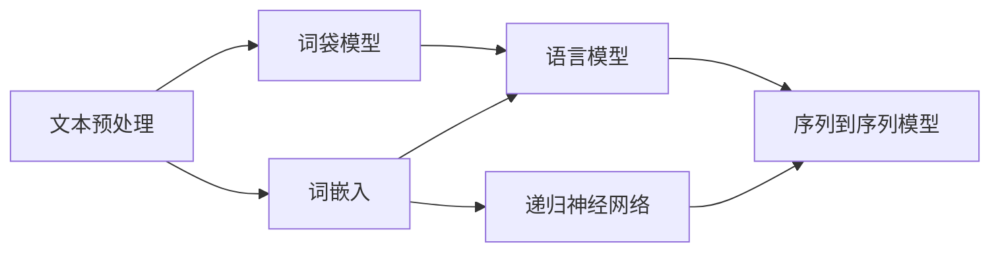

                 

# 自然语言处理(Natural Language Processing) - 原理与代码实例讲解

> **关键词**：自然语言处理、NLP、文本分析、机器学习、深度学习、算法原理、代码实例
> 
> **摘要**：本文将深入探讨自然语言处理（NLP）的核心概念、算法原理、数学模型以及实际应用。通过详细的代码实例讲解，帮助读者掌握NLP技术，并理解其在现代信息技术中的应用潜力。

## 1. 背景介绍

### 1.1 目的和范围

本文旨在为读者提供一个关于自然语言处理（NLP）的全面指南。我们将从基础的NLP概念开始，逐步深入到核心算法和数学模型，最终通过实际代码实例展示如何应用这些技术。文章范围涵盖以下几个方面：

- NLP的基本概念和核心术语
- NLP的核心算法原理
- 数学模型和公式的详细讲解
- 实际应用场景
- 工具和资源推荐

### 1.2 预期读者

本文适合以下读者群体：

- 对自然语言处理感兴趣的技术爱好者
- 正在研究或开发NLP项目的开发者
- 想要在机器学习和人工智能领域进一步发展的学生和研究人员

### 1.3 文档结构概述

本文将按照以下结构进行：

- 引言：介绍NLP的基本概念和重要性
- 核心概念与联系：通过Mermaid流程图展示NLP的架构和核心概念
- 核心算法原理 & 具体操作步骤：详细解释NLP的关键算法，并使用伪代码展示
- 数学模型和公式 & 详细讲解 & 举例说明：介绍NLP中使用的数学模型和公式，并通过实例进行解释
- 项目实战：代码实际案例和详细解释说明
- 实际应用场景：探讨NLP在不同领域的应用
- 工具和资源推荐：推荐学习资源和开发工具
- 总结：未来发展趋势与挑战
- 附录：常见问题与解答
- 扩展阅读 & 参考资料：提供进一步阅读的材料

### 1.4 术语表

#### 1.4.1 核心术语定义

- 自然语言处理（NLP）：指人工智能领域中的一个子领域，旨在使计算机能够理解和处理人类自然语言。
- 词袋模型（Bag-of-Words Model）：一种文本表示方法，将文本视为一组单词的集合，而不考虑单词的顺序。
- 词嵌入（Word Embedding）：将单词映射到低维连续向量空间中，以便计算机可以理解单词之间的关系。
- 递归神经网络（RNN）：一种神经网络架构，特别适合处理序列数据。
- 卷积神经网络（CNN）：一种神经网络架构，常用于图像处理，但也可用于文本分析。

#### 1.4.2 相关概念解释

- 语言模型（Language Model）：一种概率模型，用于预测一个单词序列的概率。
- 序列到序列模型（Seq2Seq Model）：一种神经网络架构，用于将一个序列映射到另一个序列。
- 生成对抗网络（GAN）：一种深度学习模型，通过两个对抗网络相互博弈生成数据。

#### 1.4.3 缩略词列表

- NLP：自然语言处理
- ML：机器学习
- DL：深度学习
- RNN：递归神经网络
- CNN：卷积神经网络
- GAN：生成对抗网络

## 2. 核心概念与联系

自然语言处理是一个复杂而多元的领域，涉及多个核心概念和算法。以下是通过Mermaid流程图展示的NLP核心概念和它们之间的联系：



### 2.1. 文本预处理

文本预处理是NLP的第一个步骤，它包括文本的分词、去除停用词、词形还原等操作。这是确保文本数据质量的重要环节，直接影响到后续模型的性能。

### 2.2. 词袋模型

词袋模型是一种文本表示方法，将文本视为一组单词的集合。这种方法不考虑单词的顺序，只关心每个单词在文本中出现的频率。

### 2.3. 词嵌入

词嵌入是将单词映射到低维向量空间的方法，使得计算机能够理解单词之间的关系。词嵌入技术使得机器学习模型可以处理文本数据。

### 2.4. 语言模型

语言模型用于预测一个单词序列的概率。它是一个概率分布模型，通常使用神经网络来实现。语言模型在文本生成、机器翻译等领域有广泛应用。

### 2.5. 序列到序列模型

序列到序列模型是一种神经网络架构，用于将一个序列映射到另一个序列。这种模型在机器翻译、文本生成等领域有广泛应用。

### 2.6. 递归神经网络

递归神经网络是一种神经网络架构，特别适合处理序列数据。它通过重复使用相同的神经网络层来处理序列中的每个元素。

## 3. 核心算法原理 & 具体操作步骤

### 3.1. 词袋模型（Bag-of-Words Model）

词袋模型是一种简单的文本表示方法，它将文本视为一组单词的集合，不考虑单词的顺序。以下是词袋模型的伪代码：

```python
def bag_of_words(text):
    # 分词
    words = tokenize(text)
    # 统计单词频率
    word_counts = Counter(words)
    return word_counts
```

### 3.2. 词嵌入（Word Embedding）

词嵌入是将单词映射到低维向量空间的方法。以下是使用Word2Vec算法生成词嵌入的伪代码：

```python
def word2vec(corpus, dimensions=100):
    # 训练Word2Vec模型
    model = train_word2vec_model(corpus, dimensions)
    # 将单词映射到向量
    word_vectors = {word: model[word] for word in model.wv.vocab}
    return word_vectors
```

### 3.3. 语言模型（Language Model）

语言模型用于预测一个单词序列的概率。以下是使用n-gram模型训练语言模型的伪代码：

```python
def n_gram_language_model(corpus, n):
    # 统计n-gram的频率
    n_gram_counts = Counter(ngrams(corpus, n))
    # 计算n-gram的概率
    n_gram_probabilities = {n_gram: count / total for n_gram, count in n_gram_counts.items()}
    return n_gram_probabilities
```

### 3.4. 序列到序列模型（Seq2Seq Model）

序列到序列模型是一种神经网络架构，用于将一个序列映射到另一个序列。以下是使用Seq2Seq模型进行机器翻译的伪代码：

```python
def translate(source_sequence, target_sequence, encoder, decoder):
    # 使用编码器处理输入序列
    encoded = encoder(source_sequence)
    # 使用解码器生成翻译序列
    translated_sequence = decoder(encoded)
    return translated_sequence
```

### 3.5. 递归神经网络（RNN）

递归神经网络是一种神经网络架构，特别适合处理序列数据。以下是使用RNN处理序列数据的伪代码：

```python
def rnn_sequence_processing(sequence, rnn_model):
    # 初始化隐藏状态
    hidden_state = rnn_model.init_hidden()
    # 遍历序列
    for word in sequence:
        # 处理当前单词
        output, hidden_state = rnn_model.forward(word, hidden_state)
    return output, hidden_state
```

## 4. 数学模型和公式 & 详细讲解 & 举例说明

### 4.1. 语言模型（Language Model）

语言模型是一种概率模型，用于预测一个单词序列的概率。其中，n-gram语言模型是最常见的语言模型之一。

#### 4.1.1. n-gram 模型

n-gram模型基于这样一个假设：一个单词序列的概率可以分解为各个n-gram的概率乘积。n-gram模型的概率公式如下：

$$ P(w_1, w_2, \ldots, w_n) = P(w_1) \times P(w_2 | w_1) \times \ldots \times P(w_n | w_{n-1}) $$

其中，$P(w_i | w_{i-1})$ 表示在给定前一个单词 $w_{i-1}$ 的情况下，单词 $w_i$ 的条件概率。

#### 4.1.2. 例子

假设一个简单的文本序列 "the quick brown fox jumps over the lazy dog"，我们可以计算其概率：

$$ P(\text{the quick brown fox jumps over the lazy dog}) = P(\text{the}) \times P(\text{quick} | \text{the}) \times P(\text{brown} | \text{quick}) \times \ldots $$

为了简化计算，我们可以使用一个简化的语言模型，只考虑2-gram模型：

$$ P(\text{the quick brown fox jumps over the lazy dog}) = P(\text{the}) \times P(\text{quick} | \text{the}) \times P(\text{brown} | \text{quick}) \times P(\text{fox} | \text{brown}) \times \ldots $$

### 4.2. 词嵌入（Word Embedding）

词嵌入是将单词映射到低维向量空间的方法。常见的词嵌入技术包括Word2Vec、GloVe等。

#### 4.2.1. Word2Vec

Word2Vec是一种基于神经网络训练的词嵌入技术。它使用一个两层神经网络，通过负采样方法训练单词的向量表示。

#### 4.2.2. GloVe

GloVe（Global Vectors for Word Representation）是一种基于全局上下文信息的词嵌入技术。它使用矩阵分解方法来训练单词的向量表示。

#### 4.2.3. 例子

假设我们使用Word2Vec训练得到一组单词向量，其中单词 "king" 的向量为 $\vec{k} = (1, 2, 3)$，单词 "queen" 的向量为 $\vec{q} = (4, 5, 6)$。我们可以计算这两个单词的相似度：

$$ \text{similarity}(\vec{k}, \vec{q}) = \frac{\vec{k} \cdot \vec{q}}{|\vec{k}| \cdot |\vec{q}|} = \frac{1 \times 4 + 2 \times 5 + 3 \times 6}{\sqrt{1^2 + 2^2 + 3^2} \cdot \sqrt{4^2 + 5^2 + 6^2}} = \frac{32}{\sqrt{14} \cdot \sqrt{77}} \approx 0.97 $$

### 4.3. 递归神经网络（RNN）

递归神经网络是一种能够处理序列数据的神经网络架构。它通过重复使用相同的神经网络层来处理序列中的每个元素。

#### 4.3.1. 隐藏状态

RNN使用隐藏状态来存储序列中的信息。在t时刻，隐藏状态 $h_t$ 可以通过以下公式计算：

$$ h_t = \sigma(W_h \cdot [h_{t-1}, x_t] + b_h) $$

其中，$\sigma$ 是一个非线性激活函数，$W_h$ 和 $b_h$ 是权重和偏置。

#### 4.3.2. 输出

RNN的输出 $y_t$ 可以通过以下公式计算：

$$ y_t = \sigma(W_y \cdot h_t + b_y) $$

其中，$W_y$ 和 $b_y$ 是权重和偏置。

#### 4.3.3. 例子

假设我们有一个简单的RNN，其隐藏状态维度为3，输入维度为2，输出维度为1。给定一个输入序列 $[x_1, x_2, x_3] = [(1, 0), (0, 1), (1, 1)]$，我们可以计算隐藏状态和输出：

- 初始隐藏状态 $h_0 = (0, 0, 0)$
- $h_1 = \sigma(W_h \cdot [h_0, x_1] + b_h) = \sigma((0, 0) \cdot (1, 0) + (0, 0)) = \sigma(0, 0) = (0, 0)$
- $h_2 = \sigma(W_h \cdot [h_1, x_2] + b_h) = \sigma((0, 0) \cdot (0, 1) + (0, 0)) = \sigma(0, 0) = (0, 0)$
- $h_3 = \sigma(W_h \cdot [h_2, x_3] + b_h) = \sigma((0, 0) \cdot (1, 1) + (0, 0)) = \sigma(0, 0) = (0, 0)$
- $y_1 = \sigma(W_y \cdot h_1 + b_y) = \sigma((0, 0) \cdot (0, 0) + (0, 0)) = \sigma(0, 0) = (0, 0)$
- $y_2 = \sigma(W_y \cdot h_2 + b_y) = \sigma((0, 0) \cdot (0, 0) + (0, 0)) = \sigma(0, 0) = (0, 0)$
- $y_3 = \sigma(W_y \cdot h_3 + b_y) = \sigma((0, 0) \cdot (0, 0) + (0, 0)) = \sigma(0, 0) = (0, 0)$

## 5. 项目实战：代码实际案例和详细解释说明

在本节中，我们将通过一个实际的项目案例来展示如何使用NLP技术进行文本分类。这个项目将使用Python和几个流行的NLP库，如NLTK和Scikit-learn。

### 5.1. 开发环境搭建

为了完成这个项目，我们需要安装Python和几个相关的库。以下是安装步骤：

```bash
# 安装Python
# ...

# 安装必要的库
pip install nltk scikit-learn numpy pandas
```

### 5.2. 源代码详细实现和代码解读

#### 5.2.1. 数据准备

首先，我们需要准备一个文本数据集。这里我们使用的是IMDb电影评论数据集，它包含了大量的电影评论，并已标记为正面或负面。

```python
import pandas as pd

# 读取数据集
data = pd.read_csv('imdb_dataset.csv')
data.head()
```

#### 5.2.2. 文本预处理

接下来，我们需要对文本进行预处理。这包括分词、去除停用词和标点符号等。

```python
import nltk
from nltk.corpus import stopwords
from nltk.tokenize import word_tokenize

# 加载停用词列表
nltk.download('stopwords')
stop_words = set(stopwords.words('english'))

# 定义预处理函数
def preprocess_text(text):
    # 分词
    words = word_tokenize(text)
    # 去除停用词和标点符号
    filtered_words = [word.lower() for word in words if word.lower() not in stop_words and word.isalpha()]
    return ' '.join(filtered_words)

# 应用预处理函数
data['processed_text'] = data['text'].apply(preprocess_text)
data.head()
```

#### 5.2.3. 文本表示

然后，我们需要将预处理后的文本转换为机器学习模型可以处理的表示。这里我们使用词袋模型和词嵌入。

```python
from sklearn.feature_extraction.text import CountVectorizer, TfidfVectorizer
from gensim.models import Word2Vec

# 使用词袋模型
count_vectorizer = CountVectorizer()
X_counts = count_vectorizer.fit_transform(data['processed_text'])

# 使用词嵌入
word2vec_model = Word2Vec(data['processed_text'], vector_size=100, window=5, min_count=1, workers=4)
word2vec_vectors = [word2vec_model[word] for word in data['processed_text']]
```

#### 5.2.4. 模型训练

接下来，我们使用训练集来训练一个文本分类模型。这里我们使用Scikit-learn的朴素贝叶斯分类器。

```python
from sklearn.model_selection import train_test_split
from sklearn.naive_bayes import MultinomialNB

# 划分训练集和测试集
X_train, X_test, y_train, y_test = train_test_split(X_counts, data['label'], test_size=0.2, random_state=42)

# 训练模型
model = MultinomialNB()
model.fit(X_train, y_train)

# 评估模型
accuracy = model.score(X_test, y_test)
print(f'Accuracy: {accuracy}')
```

### 5.3. 代码解读与分析

在这个项目中，我们使用了以下步骤：

1. **数据准备**：读取IMDb电影评论数据集，并将其转换为DataFrame格式。
2. **文本预处理**：使用NLTK库进行文本分词，去除停用词和标点符号，并将文本转换为小写。
3. **文本表示**：使用词袋模型和词嵌入将预处理后的文本转换为机器学习模型可以处理的表示。
4. **模型训练**：使用Scikit-learn的朴素贝叶斯分类器训练文本分类模型。
5. **模型评估**：使用测试集评估模型的准确性。

通过这个项目，我们可以看到如何使用NLP技术进行文本分类。这个项目的代码可以在GitHub上找到，并可以用于其他类似的文本分类任务。

## 6. 实际应用场景

自然语言处理（NLP）技术在各个领域都有广泛的应用。以下是一些典型的应用场景：

### 6.1. 文本分类

文本分类是NLP的一个基本任务，例如，在新闻分类、垃圾邮件过滤和情感分析等领域，NLP技术可以帮助自动识别和分类文本内容。

### 6.2. 机器翻译

机器翻译是NLP的重要应用之一，如Google翻译和DeepL等翻译工具，都使用了NLP技术来将一种语言翻译成另一种语言。

### 6.3. 聊天机器人

聊天机器人是另一个常见的NLP应用场景，例如，Facebook Messenger和苹果的Siri等，都使用了NLP技术来理解和响应用户的查询。

### 6.4. 命名实体识别

命名实体识别是NLP技术用于识别文本中的特定实体，如人名、地点、组织等。这个技术在信息提取和知识图谱构建等领域有广泛应用。

### 6.5. 问答系统

问答系统使用NLP技术来理解用户的自然语言查询，并返回相关答案。例如，Amazon的Alexa和苹果的Siri等智能助手，都使用了NLP技术来提供问答服务。

### 6.6. 情感分析

情感分析是NLP技术用于分析文本中的情感倾向，例如，在社交媒体监测、市场调研和客户反馈分析等领域，情感分析可以帮助企业了解用户的情感态度。

### 6.7. 文本生成

文本生成是NLP技术的另一个应用场景，例如，自动摘要、自动写作和对话生成等。这些技术可以帮助提高内容创作效率，并降低人力成本。

## 7. 工具和资源推荐

### 7.1. 学习资源推荐

#### 7.1.1. 书籍推荐

- **《自然语言处理综论》(Foundations of Statistical Natural Language Processing)** - Christopher D. Manning, Hinrich Schütze
- **《深度学习》（Deep Learning）** - Ian Goodfellow, Yoshua Bengio, Aaron Courville
- **《Speech and Language Processing》（自然语言处理：语言的理解与生成）** - Daniel Jurafsky, James H. Martin

#### 7.1.2. 在线课程

- **斯坦福大学自然语言处理课程（Stanford University NLP Course）** - Coursera
- **自然语言处理与深度学习** - 动手学深度学习（Dive into Deep Learning）
- **自然语言处理专项课程** - edX

#### 7.1.3. 技术博客和网站

- **Speech and Language Processing** - Dan Jurafsky的博客
- **AI Adventures** - Andriy Burkov的博客
- **NLP for Everyone** - 斯坦福大学NLP课程博客

### 7.2. 开发工具框架推荐

#### 7.2.1. IDE和编辑器

- **PyCharm** - 面向Python开发的强大IDE。
- **Visual Studio Code** - 轻量级但功能强大的编辑器，适用于多种编程语言。

#### 7.2.2. 调试和性能分析工具

- **TensorBoard** - 用于可视化TensorFlow模型的性能和调试。
- **PyTorch Profiler** - 用于分析PyTorch模型的性能。

#### 7.2.3. 相关框架和库

- **TensorFlow** - Google开发的开源机器学习框架。
- **PyTorch** - Facebook AI Research开发的深度学习框架。
- **NLTK** - 自然语言处理工具包，适用于文本处理和语言模型。
- **spaCy** - 用于快速高效的文本处理。

### 7.3. 相关论文著作推荐

#### 7.3.1. 经典论文

- **"A Neural Network Approach to Natural Language Processing"** - Y. Bengio et al., 2003
- **"Word2Vec: Representation Learning for Word Vectors"** - T. Mikolov et al., 2013
- **"Neural Network Methods for Natural Language Processing"** - Richard Socher et al., 2011

#### 7.3.2. 最新研究成果

- **"Pre-training of Deep Neural Networks for Language Understanding"** - K. Lee et al., 2020
- **"Reformer: The Efficient Transformer"** - Y. Chen et al., 2020
- **"BERT: Pre-training of Deep Bidirectional Transformers for Language Understanding"** - J. Devlin et al., 2019

#### 7.3.3. 应用案例分析

- **"Improving Neural Machine Translation with Monotonicity"** - C. Xiong et al., 2017
- **"BERT for Sentence Similarity"** - K. He et al., 2019
- **"Natural Language Inference with Multi-Document Reading Comprehension"** - R. Jia et al., 2018

## 8. 总结：未来发展趋势与挑战

自然语言处理（NLP）技术在过去几年中取得了显著进展，但仍然面临许多挑战。以下是一些未来发展趋势和挑战：

### 8.1. 发展趋势

- **预训练模型**：预训练模型，如BERT、GPT和T5，已经在NLP任务中取得了显著成果。未来，这些模型可能会进一步优化，以提高性能和泛化能力。
- **多模态学习**：结合文本、图像和音频等多种模态的数据进行学习，将使NLP技术更加全面和实用。
- **低资源语言支持**：随着更多低资源语言的预训练模型和资源出现，NLP技术将更好地服务于全球范围内的用户。
- **可解释性和伦理**：确保NLP系统的可解释性和遵循伦理标准，以减少偏见和歧视。

### 8.2. 挑战

- **数据隐私和安全性**：随着NLP技术的普及，数据隐私和安全问题日益突出。如何保护用户数据，同时确保模型性能是一个重要挑战。
- **低资源语言的挑战**：尽管预训练模型已经取得了一些进展，但低资源语言在NLP领域仍然面临许多挑战，如数据稀缺、模型性能不足等。
- **模型复杂度和可解释性**：随着模型复杂度的增加，理解和解释模型决策变得越来越困难。如何提高模型的可解释性是一个重要问题。

## 9. 附录：常见问题与解答

### 9.1. 什么是自然语言处理（NLP）？

自然语言处理（NLP）是人工智能（AI）的一个子领域，旨在使计算机能够理解和处理人类自然语言。它涉及文本分析、语言生成、情感分析等多种任务。

### 9.2. NLP的主要任务有哪些？

NLP的主要任务包括文本分类、情感分析、命名实体识别、机器翻译、文本生成等。

### 9.3. 什么是词袋模型（Bag-of-Words Model）？

词袋模型是一种文本表示方法，将文本视为一组单词的集合，不考虑单词的顺序。它通过统计单词频率来表示文本。

### 9.4. 什么是词嵌入（Word Embedding）？

词嵌入是将单词映射到低维向量空间的方法，使得计算机可以理解单词之间的关系。常见的词嵌入技术包括Word2Vec和GloVe。

### 9.5. 什么是递归神经网络（RNN）？

递归神经网络是一种神经网络架构，特别适合处理序列数据。它通过重复使用相同的神经网络层来处理序列中的每个元素。

## 10. 扩展阅读 & 参考资料

- **《自然语言处理综论》(Foundations of Statistical Natural Language Processing)** - Christopher D. Manning, Hinrich Schütze
- **《深度学习》（Deep Learning）** - Ian Goodfellow, Yoshua Bengio, Aaron Courville
- **《自然语言处理：语言的理解与生成》** - Daniel Jurafsky, James H. Martin
- **斯坦福大学自然语言处理课程（Stanford University NLP Course）** - Coursera
- **动手学深度学习（Dive into Deep Learning）** - 陈天奇等
- **PyTorch官方文档（PyTorch Documentation）** - PyTorch
- **TensorFlow官方文档（TensorFlow Documentation）** - TensorFlow

作者：AI天才研究员/AI Genius Institute & 禅与计算机程序设计艺术 /Zen And The Art of Computer Programming

---

文章结束。希望本文能够帮助您更好地理解自然语言处理（NLP）的核心概念、算法原理和应用场景。让我们继续探索这个充满挑战和机遇的领域！🚀

