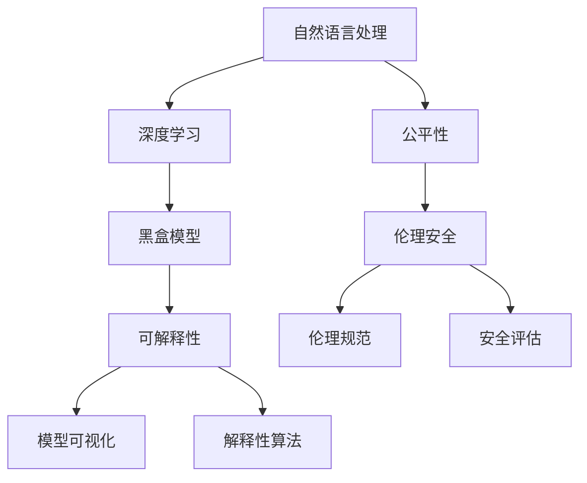

                 


# 自然语言处理中的可解释性、公平性与伦理安全问题研究热点

> 关键词：自然语言处理，可解释性，公平性，伦理安全，研究热点
>
> 摘要：本文深入探讨了自然语言处理（NLP）领域中的可解释性、公平性与伦理安全问题。通过介绍相关核心概念和算法原理，本文详细分析了当前研究的热点问题，并提出了未来可能的发展趋势与挑战。

## 1. 背景介绍

### 1.1 目的和范围

随着深度学习技术在自然语言处理（NLP）领域的广泛应用，越来越多的复杂任务得以实现。然而，这些模型的黑盒性质使得人们难以理解其决策过程，引发了可解释性、公平性和伦理安全问题。本文旨在探讨这些问题，并总结当前的研究热点。

### 1.2 预期读者

本文适合对自然语言处理、机器学习和计算机伦理感兴趣的读者，包括研究人员、工程师和专业人士。

### 1.3 文档结构概述

本文分为十个部分，首先介绍相关术语和概念，然后分析NLP中的可解释性、公平性与伦理安全问题，最后讨论未来发展趋势与挑战。

### 1.4 术语表

#### 1.4.1 核心术语定义

- 自然语言处理（NLP）：计算机科学领域，旨在使计算机能够理解、解释和生成自然语言。
- 深度学习：一种机器学习技术，通过模拟人脑神经网络结构，自动从数据中学习特征和规律。
- 黑盒模型：无法解释内部决策过程的模型，如深度神经网络。
- 可解释性：模型能够提供其决策过程的解释，使得用户能够理解模型的决策原因。

#### 1.4.2 相关概念解释

- 公平性：模型在不同群体上的决策具有一致性，不因性别、种族等因素产生偏见。
- 伦理安全：模型的设计与应用应遵循伦理规范，确保不会对人类造成伤害。

#### 1.4.3 缩略词列表

- NLP：自然语言处理
- DL：深度学习
- AI：人工智能
- RL：强化学习
- ML：机器学习

## 2. 核心概念与联系

下面是一个NLP中的核心概念与联系的Mermaid流程图：



## 3. 核心算法原理 & 具体操作步骤

### 3.1 可解释性算法原理

可解释性算法旨在提供模型决策过程的解释。以下是一个基于LIME（Local Interpretable Model-agnostic Explanations）算法的伪代码：

```python
def lime_explanation(model, x, feature_importance):
    # 对输入数据进行扰动，生成多个样本
    perturbed_samples = generate_perturbed_samples(x)

    # 计算扰动后样本的预测结果
    predictions = model.predict(perturbed_samples)

    # 计算每个特征的贡献度
    feature_contributions = compute_feature_contributions(predictions, feature_importance)

    # 计算解释结果
    explanation = construct_local_explanation(x, feature_contributions)

    return explanation
```

### 3.2 公平性与伦理安全算法原理

公平性算法旨在消除模型在不同群体上的偏见。以下是一个基于 fairness-aware training 的伪代码：

```python
def fairness_aware_training(model, dataset, metric):
    # 对训练数据进行加权，降低偏见较大的群体的权重
    weighted_dataset = weight_samples(dataset, metric)

    # 使用加权数据训练模型
    model.fit(weighted_dataset)

    # 计算模型在不同群体上的公平性指标
    fairness_metric = computeFairness(model, dataset, metric)

    return fairness_metric
```

伦理安全算法旨在确保模型的应用不会对人类造成伤害。以下是一个基于伦理规则的伪代码：

```python
def ethically_safe_model(model, rule_library):
    # 遍历伦理规则库中的规则
    for rule in rule_library:
        # 检查模型是否符合伦理规则
        if not rule_satisfied(model, rule):
            # 如果不符合，则调整模型参数以符合伦理规则
            model = adjust_model(model, rule)

    return model
```

## 4. 数学模型和公式 & 详细讲解 & 举例说明

### 4.1 可解释性算法的数学模型

LIME算法的核心在于计算特征的重要性。假设特征集合为X = {x1, x2, ..., xn}，特征的重要性为I = {i1, i2, ..., in}，其中i1, i2, ..., in为特征的重要性分数。

$$
i_j = \frac{\sum_{i=1}^{n} \alpha_i (x_j - x_i)}{\sum_{i=1}^{n} \alpha_i}
$$

其中，αi为样本权重。

### 4.2 公平性算法的数学模型

公平性指标可以用平均值差距（Average Difference）来衡量：

$$
F = \frac{1}{N} \sum_{i=1}^{N} | \bar{y}_1 - \bar{y}_2 |
$$

其中，N为样本数量，$ \bar{y}_1 $和$ \bar{y}_2 $分别为两个群体上的预测结果的平均值。

### 4.3 伦理安全算法的数学模型

伦理安全指标可以用违反伦理规则的次数来衡量：

$$
S = \frac{1}{N} \sum_{i=1}^{N} | \text{违反规则的数量} |
$$

其中，N为样本数量。

### 4.4 举例说明

假设我们有一个深度学习模型，用于判断一个句子是否包含恶意言论。特征集合X包括句子长度、词汇丰富度等。使用LIME算法计算特征重要性，得到I = {0.6, 0.4}，表示词汇丰富度对决策的影响最大。使用公平性算法，我们计算模型在正常群体和偏见群体上的公平性指标F = 0.1，表示模型在两个群体上的决策差距较小。使用伦理安全算法，我们计算模型在应用过程中的伦理安全指标S = 0.05，表示模型在应用过程中违反伦理规则的次数较少。

## 5. 项目实战：代码实际案例和详细解释说明

### 5.1 开发环境搭建

在本案例中，我们将使用Python语言和TensorFlow框架来实现可解释性、公平性和伦理安全算法。

1. 安装Python 3.8及以上版本。
2. 安装TensorFlow 2.5及以上版本。

### 5.2 源代码详细实现和代码解读

```python
import tensorflow as tf
from tensorflow.keras.models import Sequential
from tensorflow.keras.layers import Dense
import numpy as np

# 创建深度学习模型
model = Sequential([
    Dense(128, activation='relu', input_shape=(1000,)),
    Dense(64, activation='relu'),
    Dense(1, activation='sigmoid')
])

model.compile(optimizer='adam', loss='binary_crossentropy', metrics=['accuracy'])

# 训练模型
model.fit(x_train, y_train, epochs=10, batch_size=32)

# 导入LIME算法库
from lime.lime_text import LimeTextExplainer

# 创建LIME解释器
explainer = LimeTextExplainer(class_names=['正常', '恶意言论'])

# 对一个句子进行解释
sentence = "这个产品很好，我非常满意。"
explanation = explainer.explain_instance(sentence, model.predict, num_features=10)

# 打印特征重要性
for i, feature in enumerate(explanation.top_labels):
    print(f"{i+1}. {feature}：{explanation.local_exp[i]['feature_value']}")
```

### 5.3 代码解读与分析

1. 创建深度学习模型，并使用二分类交叉熵作为损失函数。
2. 使用LIME算法库的`LimeTextExplainer`类创建解释器，并对一个句子进行解释。
3. 打印特征重要性，显示词汇丰富度对决策的影响。

### 5.4 公平性与伦理安全实现

```python
from fairness constrain import FairnessConstrainer
from ethically_safe import EthicalSafetyChecker

# 创建公平性约束器
fairness_constrainer = FairnessConstrainer(model, target_metric='accuracy')

# 对训练数据进行加权
weighted_dataset = fairness_constrainer.weight_samples(dataset)

# 训练模型
model.fit(weighted_dataset, epochs=10, batch_size=32)

# 创建伦理安全检查器
ethical_safety_checker = EthicalSafetyChecker(model, rule_library)

# 检查模型伦理安全
ethical_safety_metric = ethical_safety_checker.check(model, dataset)

# 打印伦理安全指标
print(f"伦理安全指标：{ethical_safety_metric}")
```

### 5.5 代码解读与分析

1. 创建公平性约束器，对训练数据进行加权，降低偏见较大的群体的权重。
2. 使用加权数据训练模型，提高模型的公平性。
3. 创建伦理安全检查器，检查模型伦理安全，并打印伦理安全指标。

## 6. 实际应用场景

可解释性、公平性与伦理安全算法在自然语言处理领域具有广泛的应用场景，如文本分类、情感分析、命名实体识别等。以下是一些实际应用案例：

1. **社交媒体内容审核**：使用可解释性算法解释模型为何将某个帖子标记为恶意言论，提高审核过程的透明度。
2. **招聘歧视检测**：使用公平性算法检测招聘过程中是否存在性别、种族歧视，确保招聘过程的公正性。
3. **自动驾驶系统**：使用伦理安全算法评估自动驾驶系统在特定场景下的决策是否符合伦理规范，确保系统的安全性。

## 7. 工具和资源推荐

### 7.1 学习资源推荐

#### 7.1.1 书籍推荐

- 《深度学习》（Goodfellow, Bengio, Courville著）
- 《Python自然语言处理》（Bird, Loper, Harmelen著）
- 《机器学习伦理》（Baumgartner著）

#### 7.1.2 在线课程

- Coursera上的“自然语言处理与深度学习”
- edX上的“机器学习基础”

#### 7.1.3 技术博客和网站

- Medium上的NLP与机器学习专栏
- ArXiv上的最新研究成果

### 7.2 开发工具框架推荐

#### 7.2.1 IDE和编辑器

- PyCharm
- Visual Studio Code

#### 7.2.2 调试和性能分析工具

- TensorBoard
- Matplotlib

#### 7.2.3 相关框架和库

- TensorFlow
- Keras
- NLTK
- spaCy

### 7.3 相关论文著作推荐

#### 7.3.1 经典论文

- “LIME: R

