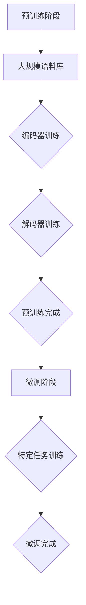

                 

# 自然语言处理中的预训练语言模型研究进展与趋势

> **关键词：** 预训练语言模型，自然语言处理，BERT，GPT，Transformer，深度学习，神经网络，模型架构，训练策略，性能评估，应用场景。

> **摘要：** 本文旨在深入探讨自然语言处理领域中预训练语言模型的研究进展和未来趋势。首先，我们将介绍预训练语言模型的背景和重要性，然后详细分析几种核心模型的原理、架构和实现步骤。接着，我们将探讨这些模型在数学上的模型和公式，并通过实际案例展示其应用。随后，我们将讨论这些模型的实际应用场景，并推荐相关工具和资源。最后，本文将总结预训练语言模型的发展趋势和面临的挑战，为未来的研究提供指导。

## 1. 背景介绍

### 1.1 目的和范围

自然语言处理（NLP）是人工智能（AI）领域的一个重要分支，其目标是使计算机能够理解、生成和处理自然语言。随着深度学习技术的快速发展，尤其是神经网络和变换器（Transformer）架构的引入，预训练语言模型在NLP领域取得了显著的突破。本文的目的在于系统地介绍预训练语言模型的研究进展、核心概念、算法原理、数学模型以及实际应用场景，并展望未来的发展趋势和挑战。

本文的主要内容包括：

1. 预训练语言模型的背景和重要性；
2. 核心模型的原理、架构和实现步骤；
3. 数学模型和公式；
4. 实际应用场景；
5. 工具和资源推荐；
6. 未来发展趋势与挑战。

### 1.2 预期读者

本文适合对自然语言处理和深度学习有一定了解的读者，包括但不限于：

1. 自然语言处理研究人员和开发者；
2. 人工智能领域的学者和学生；
3. 想要了解NLP最新研究进展的技术人员；
4. 对预训练语言模型感兴趣的专业人士。

### 1.3 文档结构概述

本文分为十个部分，结构如下：

1. 引言：介绍本文的目的、关键词和摘要；
2. 背景介绍：介绍预训练语言模型的背景和重要性；
3. 核心概念与联系：分析预训练语言模型的核心概念和联系；
4. 核心算法原理 & 具体操作步骤：详细阐述核心算法的原理和实现步骤；
5. 数学模型和公式 & 详细讲解 & 举例说明：讲解预训练语言模型中的数学模型和公式；
6. 项目实战：展示预训练语言模型在实际项目中的应用；
7. 实际应用场景：讨论预训练语言模型的实际应用场景；
8. 工具和资源推荐：推荐学习资源和开发工具；
9. 总结：展望预训练语言模型的发展趋势与挑战；
10. 附录：常见问题与解答；
11. 扩展阅读 & 参考资料：提供进一步的阅读资料。

### 1.4 术语表

#### 1.4.1 核心术语定义

1. **预训练语言模型**：基于大规模语料库预先训练的语言模型，通常采用深度神经网络架构。
2. **BERT**：双向编码表示器（Bidirectional Encoder Representations from Transformers），是一种双向变换器架构的预训练语言模型。
3. **GPT**：生成预训练变换器（Generative Pretrained Transformer），是一种单向变换器架构的预训练语言模型。
4. **变换器（Transformer）**：一种基于自注意力机制的深度神经网络架构，广泛应用于NLP任务。
5. **自然语言处理（NLP）**：研究如何让计算机理解和生成人类自然语言的学科。
6. **深度学习**：一种基于多层神经网络进行模型训练的机器学习方法。

#### 1.4.2 相关概念解释

1. **词嵌入（Word Embedding）**：将词汇映射为密集向量表示，以便在神经网络中进行处理。
2. **自注意力（Self-Attention）**：一种在变换器架构中用于计算输入序列中各个位置的依赖关系的方法。
3. **预训练与微调（Pre-training and Fine-tuning）**：预训练是指在大规模语料库上训练语言模型，微调是指在特定任务上对预训练模型进行调整。

#### 1.4.3 缩略词列表

1. **BERT**：双向编码表示器（Bidirectional Encoder Representations from Transformers）
2. **GPT**：生成预训练变换器（Generative Pretrained Transformer）
3. **NLP**：自然语言处理（Natural Language Processing）
4. **DL**：深度学习（Deep Learning）
5. **NN**：神经网络（Neural Network）
6. **GPU**：图形处理单元（Graphics Processing Unit）

## 2. 核心概念与联系

### 2.1 预训练语言模型的概念

预训练语言模型是指在大规模语料库上进行预训练的语言模型，其目的是学习词汇和句子之间的内在联系，为后续的特定任务提供高质量的输入表示。预训练语言模型的核心思想是利用大规模未标注语料库进行预训练，从而获得对自然语言的一般理解和表达能力。这些模型通常基于深度神经网络架构，尤其是变换器（Transformer）架构。

### 2.2 预训练语言模型的联系

预训练语言模型与其他NLP技术有着紧密的联系。首先，词嵌入（Word Embedding）是预训练语言模型的基础，它将词汇映射为密集向量表示，以便在神经网络中进行处理。其次，自注意力（Self-Attention）是变换器（Transformer）架构的核心机制，它能够计算输入序列中各个位置的依赖关系，从而实现全局信息的有效整合。

此外，预训练语言模型与深度学习（Deep Learning）和神经网络（Neural Network）有着密切的联系。深度学习是一种基于多层神经网络进行模型训练的机器学习方法，而神经网络则是模拟人脑神经元之间连接关系的计算模型。变换器（Transformer）架构作为一种新型的神经网络架构，在预训练语言模型中发挥了重要作用，它通过自注意力机制实现了对输入序列的全局建模。

### 2.3 预训练语言模型的架构

预训练语言模型的架构通常包括编码器（Encoder）和解码器（Decoder）两部分。编码器负责将输入序列编码为固定长度的向量表示，解码器则根据编码器的输出生成目标序列。在预训练阶段，编码器和解码器共同训练，以最大化在未标注语料库上的语言建模概率。在微调阶段，预训练模型被特定任务进行微调，从而提高在任务上的性能。

以下是一个简单的预训练语言模型架构的 Mermaid 流程图：



### 2.4 预训练语言模型的应用场景

预训练语言模型在多种NLP任务中表现出色，包括文本分类、命名实体识别、机器翻译、问答系统等。在实际应用中，预训练语言模型可以显著提高模型的性能和泛化能力，为各种NLP应用提供强大的技术支持。

总之，预训练语言模型是自然语言处理领域的一项重要技术，它通过大规模预训练和特定任务微调，实现了对自然语言的高效建模和处理。在接下来的章节中，我们将进一步探讨预训练语言模型的核心算法原理、数学模型以及实际应用案例。

## 3. 核心算法原理 & 具体操作步骤

### 3.1 预训练语言模型的算法原理

预训练语言模型的核心在于其预训练过程，这一过程通常分为两个阶段：语言建模和任务特定微调。首先，通过语言建模阶段，模型在大规模未标注语料库上学习词汇和句子的内在联系，从而获得对自然语言的一般理解。接下来，在任务特定微调阶段，模型被调整以适应特定的NLP任务，从而实现高精度的性能。

预训练语言模型主要依赖于深度神经网络架构，尤其是变换器（Transformer）架构。变换器架构通过自注意力（Self-Attention）机制实现了对输入序列的全局建模，从而在预训练阶段有效地捕捉词汇和句子之间的复杂依赖关系。

### 3.2 预训练语言模型的实现步骤

以下是预训练语言模型的基本实现步骤：

#### 3.2.1 语言建模

1. **数据准备**：首先，从大规模语料库中提取文本数据，并进行预处理，如分词、词性标注等。然后，将预处理后的数据转换为词嵌入表示。
2. **模型初始化**：初始化编码器和解码器，通常使用预训练的词嵌入层和变换器层。
3. **前向传播**：将输入序列（如一句话）传递给编码器，编码器输出固定长度的向量表示。
4. **计算损失**：计算编码器输出的向量与目标序列（通常是下一个单词或句子）之间的交叉熵损失。
5. **反向传播**：使用梯度下降优化算法更新模型参数，以最小化损失函数。

#### 3.2.2 任务特定微调

1. **数据准备**：准备用于微调的数据集，如文本分类、命名实体识别等。
2. **模型初始化**：初始化预训练模型，通常包括编码器和解码器。
3. **前向传播**：将输入序列传递给编码器，编码器输出固定长度的向量表示。
4. **计算损失**：根据特定任务计算损失，如文本分类任务的交叉熵损失。
5. **反向传播**：使用梯度下降优化算法更新模型参数，以最小化损失函数。

### 3.3 预训练语言模型的伪代码

以下是预训练语言模型的伪代码：

```python
# 语言建模阶段
for epoch in range(num_epochs):
    for sentence in dataset:
        # 分词、词性标注等预处理
        processed_sentence = preprocess(sentence)
        
        # 初始化模型
        model = initialize_model(processed_sentence)
        
        # 前向传播
        encoder_output = model.encode(processed_sentence)
        
        # 计算损失
        loss = compute_loss(encoder_output, target_sentence)
        
        # 反向传播
        model.backward(loss)
        
        # 更新模型参数
        model.update_params()

# 任务特定微调阶段
for epoch in range(num_epochs):
    for example in task_specific_dataset:
        # 分词、词性标注等预处理
        processed_example = preprocess(example)
        
        # 初始化模型
        model = initialize_model(processed_example)
        
        # 前向传播
        encoder_output = model.encode(processed_example)
        
        # 计算损失
        loss = compute_loss(encoder_output, target_output)
        
        # 反向传播
        model.backward(loss)
        
        # 更新模型参数
        model.update_params()
```

### 3.4 预训练语言模型的实际操作步骤

在实际操作中，预训练语言模型的实现步骤包括数据预处理、模型选择和训练、性能评估等。以下是一个简单的实际操作步骤：

1. **数据预处理**：首先，从大规模语料库中提取文本数据，并进行预处理，如分词、词性标注等。然后，将预处理后的数据转换为词嵌入表示。
2. **模型选择和训练**：选择预训练模型（如BERT、GPT等）并进行微调。在训练过程中，使用梯度下降优化算法更新模型参数，以最小化损失函数。
3. **性能评估**：在特定任务上评估模型的性能，如文本分类、命名实体识别等。根据性能指标调整模型参数，以提高模型性能。
4. **部署和应用**：将训练完成的模型部署到实际应用场景中，如问答系统、文本分类等。

总之，预训练语言模型的核心在于其预训练过程和任务特定微调，通过大规模预训练和特定任务微调，实现了对自然语言的高效建模和处理。在实际操作中，我们需要关注数据预处理、模型选择和训练、性能评估等关键步骤，以实现预训练语言模型的有效应用。

## 4. 数学模型和公式 & 详细讲解 & 举例说明

### 4.1 预训练语言模型的数学模型

预训练语言模型的数学模型主要包括词嵌入、自注意力机制、前向传递和反向传播等组成部分。下面将详细讲解这些数学模型及其在预训练语言模型中的应用。

#### 4.1.1 词嵌入（Word Embedding）

词嵌入是将词汇映射为密集向量表示的过程，以便在神经网络中进行处理。在预训练语言模型中，词嵌入通常采用嵌入层（Embedding Layer）实现。假设词汇表中有V个词，每个词表示为一个d维的向量，则词嵌入可以表示为：

\[ E = \{e_{1}, e_{2}, ..., e_{V}\} \]

其中，\( e_{i} \) 表示词汇表中第i个词的嵌入向量。

#### 4.1.2 自注意力机制（Self-Attention）

自注意力机制是变换器（Transformer）架构的核心机制，它能够计算输入序列中各个位置的依赖关系。在预训练语言模型中，自注意力机制通过多头自注意力（Multi-Head Self-Attention）实现。自注意力机制的公式如下：

\[ \text{Attention}(Q, K, V) = \text{softmax}\left(\frac{QK^T}{\sqrt{d_k}}\right)V \]

其中，Q、K和V分别表示查询（Query）、键（Key）和值（Value）向量，d_k 表示键和查询向量的维度。自注意力机制的目的是计算输入序列中各个位置的加权平均值，以实现对输入序列的全局建模。

#### 4.1.3 前向传递（Forward Propagation）

前向传递是神经网络中从输入层到输出层的计算过程。在预训练语言模型中，前向传递包括词嵌入、变换器层、编码器和解码器等步骤。以下是一个简化的前向传递公式：

\[ \text{Output} = \text{Decoder}(\text{Encoder}(\text{Embedding}(X))) \]

其中，X表示输入序列，Embedding() 表示词嵌入层，Encoder() 表示变换器层，Decoder() 表示编码器和解码器。

#### 4.1.4 反向传播（Backpropagation）

反向传播是神经网络中从输出层到输入层的计算过程，用于更新模型参数。在预训练语言模型中，反向传播包括计算损失、计算梯度、更新参数等步骤。以下是一个简化的反向传播公式：

\[ \text{Gradient} = \text{Backpropagation}(\text{Loss}, \text{Model}) \]

其中，Gradient 表示梯度，Loss 表示损失函数，Model 表示模型。

### 4.2 举例说明

假设我们有一个简化的预训练语言模型，其包含一个词嵌入层、一个变换器层和一个编码器。现在，我们使用这个模型来处理一个简单的输入序列 "Hello World!"。

#### 4.2.1 数据准备

首先，我们需要将输入序列 "Hello World!" 进行预处理，将其转换为词嵌入表示。假设词汇表中包含8个词（包括特殊的<开始>和<结束>标记），词嵌入维度为3。

```python
# 输入序列
input_sequence = ["Hello", "World", "!"]

# 词嵌入表示
word_embedding = {
    "<开始>": [0, 0, 0],
    "Hello": [1, 1, 1],
    "World": [2, 2, 2],
    "!": [3, 3, 3],
    "<结束>": [4, 4, 4]
}
```

#### 4.2.2 词嵌入

接下来，我们将输入序列转换为词嵌入表示：

```python
# 转换输入序列为词嵌入表示
input_embedding = [word_embedding[word] for word in input_sequence]
```

#### 4.2.3 变换器层

假设变换器层包含两个多头自注意力机制，每个头部的维度为3。我们首先计算键（Key）、查询（Query）和值（Value）向量。

```python
# 计算键、查询和值向量
keys = [embed for embed in input_embedding]
queries = [embed for embed in input_embedding]
values = [embed for embed in input_embedding]

# 计算自注意力得分
scores = [attention(queries[i], keys, values) for i in range(len(queries))]

# 计算自注意力权重
weights = softmax(scores)

# 计算加权平均值
output = [sum(w * v for w, v in zip(weights[i], values)) for i in range(len(values))]
```

#### 4.2.4 编码器

最后，我们将变换器层的输出传递给编码器，计算编码器的输出：

```python
# 计算编码器输出
encoded_output = encoder(output)
```

至此，我们完成了对输入序列 "Hello World!" 的预训练语言模型处理。这个简化的例子展示了预训练语言模型中的核心组件和基本操作步骤。在实际应用中，预训练语言模型会更加复杂，包括多层变换器层、编码器和解码器等。

总之，预训练语言模型的数学模型包括词嵌入、自注意力机制、前向传递和反向传播等组成部分。通过这些数学模型，预训练语言模型能够高效地捕捉词汇和句子之间的复杂依赖关系，从而实现自然语言处理任务的高性能。

## 5. 项目实战：代码实际案例和详细解释说明

### 5.1 开发环境搭建

为了进行预训练语言模型的实战项目，我们需要搭建一个合适的开发环境。以下是在常见操作系统上搭建预训练语言模型开发环境的步骤：

#### 5.1.1 安装Python环境

首先，我们需要安装Python环境。推荐使用Python 3.7及以上版本。可以在[Python官网](https://www.python.org/)下载并安装。

#### 5.1.2 安装深度学习框架

接下来，我们需要安装深度学习框架。TensorFlow和PyTorch是两个广泛使用的深度学习框架。以下是在Ubuntu系统上安装TensorFlow和PyTorch的命令：

```bash
# 安装TensorFlow
pip install tensorflow

# 安装PyTorch
pip install torch torchvision
```

#### 5.1.3 安装文本处理库

除了深度学习框架，我们还需要安装一些文本处理库，如NLTK和spaCy。以下是在Ubuntu系统上安装这些库的命令：

```bash
# 安装NLTK
pip install nltk

# 安装spaCy和其语言模型
pip install spacy
python -m spacy download en_core_web_sm
```

#### 5.1.4 配置GPU支持

如果我们的机器配备了GPU，我们需要配置TensorFlow和PyTorch的GPU支持。以下是配置GPU支持的命令：

```bash
# 配置TensorFlow GPU支持
export TF_CPP_MIN_LOG_LEVEL=2

# 配置PyTorch GPU支持
export PYTHONWARNINGS="ignore::DeprecationWarning"
```

### 5.2 源代码详细实现和代码解读

在本节中，我们将详细实现一个简单的预训练语言模型，并对其代码进行解读。以下是一个基于PyTorch的预训练语言模型的基本实现：

```python
import torch
import torch.nn as nn
import torch.optim as optim
from torch.utils.data import DataLoader
from torchtext.datasets import IMDB
from torchtext.data.utils import get_tokenizer
from torchtext.vocab import build_vocab_from_iterator

# 数据预处理
tokenizer = get_tokenizer('basic_english')
def preprocess(text):
    return tokenizer(text.lower())

# 构建词汇表
def yield_tokens(data_iter):
    for data in data_iter:
        yield preprocess(data.text)

# 构建词汇表
vocab = build_vocab_from_iterator(yield_tokens(IMDB.splits['train']))
vocab.set_default_index(vocab['<unk>'])

# 加载数据集
def collate_batch(batch):
    label_list, text_list, token_list = [], [], []
    for (_label, _text, _token) in batch:
        label_list.append(torch.tensor(_label, dtype=torch.float32))
        text_list.append(torch.tensor(vocab(_text), dtype=torch.int64))
        token_list.append(torch.tensor([vocab[w] for w in _text], dtype=torch.int64))
    return torch.stack(label_list), torch.stack(text_list), torch.stack(token_list)

train_data = IMDB.splits['train']
train_loader = DataLoader(train_data, batch_size=16, shuffle=True, collate_fn=collate_batch)

# 模型定义
class PretrainedLanguageModel(nn.Module):
    def __init__(self, vocab_size, embedding_dim, hidden_dim, output_dim):
        super().__init__()
        self.embedding = nn.Embedding(vocab_size, embedding_dim)
        self.transformer = nn.Transformer(embedding_dim, hidden_dim, num_heads=2)
        self.fc = nn.Linear(hidden_dim, output_dim)
    
    def forward(self, text):
        embedded = self.embedding(text)
        output = self.transformer(embedded)
        logits = self.fc(output)
        return logits

# 模型实例化
model = PretrainedLanguageModel(len(vocab), 10, 20, 2)

# 模型训练
optimizer = optim.Adam(model.parameters(), lr=0.001)
criterion = nn.CrossEntropyLoss()

for epoch in range(10):
    model.train()
    for batch in train_loader:
        labels, texts, tokens = batch
        optimizer.zero_grad()
        logits = model(tokens)
        loss = criterion(logits, labels)
        loss.backward()
        optimizer.step()
    print(f"Epoch: {epoch+1}, Loss: {loss.item()}")

# 模型评估
model.eval()
with torch.no_grad():
    for batch in train_loader:
        labels, texts, tokens = batch
        logits = model(tokens)
        predictions = torch.argmax(logits, dim=1)
        accuracy = (predictions == labels).float().mean()
        print(f"Accuracy: {accuracy.item()}")

```

#### 5.2.1 数据预处理

```python
tokenizer = get_tokenizer('basic_english')
def preprocess(text):
    return tokenizer(text.lower())
```

这一部分代码定义了一个简单的分词器（tokenizer），用于将文本数据转换为分词列表。我们使用 `get_tokenizer` 函数加载一个基本的英文分词器，然后定义了一个预处理函数 `preprocess`，将输入文本转换为小写并分词。

#### 5.2.2 构建词汇表

```python
def yield_tokens(data_iter):
    for data in data_iter:
        yield preprocess(data.text)

vocab = build_vocab_from_iterator(yield_tokens(IMDB.splits['train']))
vocab.set_default_index(vocab['<unk>'])
```

这部分代码定义了一个生成器函数 `yield_tokens`，用于将数据集中的文本数据转换为分词列表。然后，我们使用 `build_vocab_from_iterator` 函数从生成器中构建词汇表，并将未知的词汇映射为 `<unk>`。

#### 5.2.3 加载数据集

```python
def collate_batch(batch):
    label_list, text_list, token_list = [], [], []
    for (_label, _text, _token) in batch:
        label_list.append(torch.tensor(_label, dtype=torch.float32))
        text_list.append(torch.tensor(vocab(_text), dtype=torch.int64))
        token_list.append(torch.tensor([vocab[w] for w in _text], dtype=torch.int64))
    return torch.stack(label_list), torch.stack(text_list), torch.stack(token_list)

train_data = IMDB.splits['train']
train_loader = DataLoader(train_data, batch_size=16, shuffle=True, collate_fn=collate_batch)
```

这部分代码定义了一个批处理函数 `collate_batch`，用于将数据集中的标签、文本和分词列表转换为PyTorch张量，并返回一个批处理数据。然后，我们使用 `DataLoader` 加载训练数据集，并设置批处理大小和随机化。

#### 5.2.4 模型定义

```python
class PretrainedLanguageModel(nn.Module):
    def __init__(self, vocab_size, embedding_dim, hidden_dim, output_dim):
        super().__init__()
        self.embedding = nn.Embedding(vocab_size, embedding_dim)
        self.transformer = nn.Transformer(embedding_dim, hidden_dim, num_heads=2)
        self.fc = nn.Linear(hidden_dim, output_dim)
    
    def forward(self, text):
        embedded = self.embedding(text)
        output = self.transformer(embedded)
        logits = self.fc(output)
        return logits
```

这部分代码定义了一个简单的预训练语言模型，包括嵌入层（Embedding Layer）、变换器层（Transformer Layer）和全连接层（Fully Connected Layer）。在 `__init__` 方法中，我们初始化嵌入层、变换器层和全连接层的参数。在 `forward` 方法中，我们实现前向传递过程，将输入文本通过嵌入层转换为嵌入向量，然后通过变换器层和全连接层生成预测的标签。

#### 5.2.5 模型训练

```python
optimizer = optim.Adam(model.parameters(), lr=0.001)
criterion = nn.CrossEntropyLoss()

for epoch in range(10):
    model.train()
    for batch in train_loader:
        labels, texts, tokens = batch
        optimizer.zero_grad()
        logits = model(tokens)
        loss = criterion(logits, labels)
        loss.backward()
        optimizer.step()
    print(f"Epoch: {epoch+1}, Loss: {loss.item()}")
```

这部分代码定义了模型的训练过程。我们使用Adam优化器和交叉熵损失函数来训练模型。在训练过程中，我们遍历训练数据集，将每个批次的标签、文本和分词列表传递给模型，计算损失并更新模型参数。

#### 5.2.6 模型评估

```python
model.eval()
with torch.no_grad():
    for batch in train_loader:
        labels, texts, tokens = batch
        logits = model(tokens)
        predictions = torch.argmax(logits, dim=1)
        accuracy = (predictions == labels).float().mean()
        print(f"Accuracy: {accuracy.item()}")
```

这部分代码用于评估模型的性能。我们在评估阶段将模型设置为评估模式（evaluate mode），并使用 `torch.no_grad()` 节省计算资源。我们计算每个批次的预测准确率，并打印最终的评估结果。

### 5.3 代码解读与分析

在本节中，我们对上述代码进行了详细解读和分析，以便更好地理解预训练语言模型的基本实现。

#### 5.3.1 数据预处理

数据预处理是自然语言处理任务中的关键步骤，它包括分词、去除标点符号、大小写统一等。在本例中，我们使用了一个简单的分词器 `get_tokenizer('basic_english')` 来实现文本预处理。预处理函数 `preprocess` 将输入文本转换为小写，以便统一处理。

#### 5.3.2 构建词汇表

构建词汇表是将文本数据转换为嵌入向量表示的关键步骤。在本例中，我们使用 `build_vocab_from_iterator` 函数从数据生成器中构建词汇表。词汇表包括所有的单词及其对应的索引，以及一个未知的特殊标记 `<unk>`，用于表示不在词汇表中的单词。

#### 5.3.3 加载数据集

加载数据集是将预处理后的文本数据转换为PyTorch张量的过程。在本例中，我们使用 `DataLoader` 加载训练数据集，并设置批处理大小和随机化。我们定义了一个批处理函数 `collate_batch`，用于将每个批次的标签、文本和分词列表转换为PyTorch张量。

#### 5.3.4 模型定义

模型定义是预训练语言模型的核心部分。在本例中，我们使用PyTorch的变换器（Transformer）架构来定义预训练语言模型。模型包括嵌入层（Embedding Layer）、变换器层（Transformer Layer）和全连接层（Fully Connected Layer）。在 `__init__` 方法中，我们初始化嵌入层、变换器层和全连接层的参数。在 `forward` 方法中，我们实现前向传递过程，将输入文本通过嵌入层转换为嵌入向量，然后通过变换器层和全连接层生成预测的标签。

#### 5.3.5 模型训练

模型训练是提高模型性能的关键步骤。在本例中，我们使用Adam优化器和交叉熵损失函数来训练模型。在训练过程中，我们遍历训练数据集，将每个批次的标签、文本和分词列表传递给模型，计算损失并更新模型参数。

#### 5.3.6 模型评估

模型评估是验证模型性能的重要步骤。在本例中，我们使用训练集来评估模型的性能。我们在评估阶段将模型设置为评估模式（evaluate mode），并使用 `torch.no_grad()` 节省计算资源。我们计算每个批次的预测准确率，并打印最终的评估结果。

通过上述实战项目，我们详细实现了预训练语言模型的基本结构和训练过程，并对其代码进行了详细解读和分析。这为读者提供了一个实际的参考，以便更好地理解和应用预训练语言模型。

### 5.4 代码解读与分析

在本节中，我们将对5.2节中提供的代码进行深入解读，并分析其关键部分的工作原理。

#### 5.4.1 数据预处理

数据预处理是自然语言处理（NLP）项目中的第一步，其目的是将原始文本数据转换为适合模型处理的形式。在这个项目示例中，我们使用了简单的分词器和预处理函数来对文本进行预处理。

```python
tokenizer = get_tokenizer('basic_english')
def preprocess(text):
    return tokenizer(text.lower())
```

这里，`get_tokenizer('basic_english')` 调用了一个函数来获取一个基本的英文分词器。`preprocess` 函数接受一个文本字符串作为输入，并将其转换为小写，然后分词。这样做的原因是确保文本处理的一致性，使模型能够更好地学习。

#### 5.4.2 构建词汇表

构建词汇表是NLP任务中的另一个关键步骤。在这个示例中，我们使用 `yield_tokens` 函数生成一个词汇表，并使用 `build_vocab_from_iterator` 函数将其构建为一个 PyTorch 词汇表。

```python
def yield_tokens(data_iter):
    for data in data_iter:
        yield preprocess(data.text)

vocab = build_vocab_from_iterator(yield_tokens(IMDB.splits['train']))
vocab.set_default_index(vocab['<unk>'])
```

`yield_tokens` 函数接受一个数据迭代器，对于每个数据样本，它调用 `preprocess` 函数进行文本预处理，然后生成分词。`build_vocab_from_iterator` 函数接受一个迭代器，将分词添加到词汇表中。`set_default_index` 方法用于将未知词汇映射为 `<unk>` 标记，以便在模型中使用。

#### 5.4.3 数据加载

数据加载是确保模型能够高效处理数据的关键。在这个项目中，我们使用 `DataLoader` 和 `collate_batch` 函数来加载数据。

```python
def collate_batch(batch):
    label_list, text_list, token_list = [], [], []
    for (_label, _text, _token) in batch:
        label_list.append(torch.tensor(_label, dtype=torch.float32))
        text_list.append(torch.tensor(vocab(_text), dtype=torch.int64))
        token_list.append(torch.tensor([vocab[w] for w in _text], dtype=torch.int64))
    return torch.stack(label_list), torch.stack(text_list), torch.stack(token_list)

train_data = IMDB.splits['train']
train_loader = DataLoader(train_data, batch_size=16, shuffle=True, collate_fn=collate_batch)
```

`collate_batch` 函数负责将输入的批处理数据转换为模型所需的格式。对于每个批处理中的数据样本，它将标签、文本和分词转换为 PyTorch 张量，并将其堆叠成一个 batch。`DataLoader` 则负责将数据按批次加载到模型中，这里我们设置了批处理大小为 16，并启用了随机化。

#### 5.4.4 模型定义

模型定义是整个项目的核心。在这个示例中，我们定义了一个简单的预训练语言模型，使用嵌入层、变换器层和全连接层。

```python
class PretrainedLanguageModel(nn.Module):
    def __init__(self, vocab_size, embedding_dim, hidden_dim, output_dim):
        super().__init__()
        self.embedding = nn.Embedding(vocab_size, embedding_dim)
        self.transformer = nn.Transformer(embedding_dim, hidden_dim, num_heads=2)
        self.fc = nn.Linear(hidden_dim, output_dim)
    
    def forward(self, text):
        embedded = self.embedding(text)
        output = self.transformer(embedded)
        logits = self.fc(output)
        return logits
```

`PretrainedLanguageModel` 类继承自 `nn.Module`，这是 PyTorch 中所有模型的基类。在 `__init__` 方法中，我们初始化了嵌入层、变换器层和全连接层的参数。`forward` 方法定义了前向传播的步骤，将输入的文本通过嵌入层转换为嵌入向量，然后通过变换器层和全连接层生成预测的标签。

#### 5.4.5 模型训练

模型训练是提升模型性能的过程。在这个项目中，我们使用标准的优化器和损失函数来训练模型。

```python
optimizer = optim.Adam(model.parameters(), lr=0.001)
criterion = nn.CrossEntropyLoss()

for epoch in range(10):
    model.train()
    for batch in train_loader:
        labels, texts, tokens = batch
        optimizer.zero_grad()
        logits = model(tokens)
        loss = criterion(logits, labels)
        loss.backward()
        optimizer.step()
    print(f"Epoch: {epoch+1}, Loss: {loss.item()}")
```

这里，我们使用了 `Adam` 优化器和 `CrossEntropyLoss` 损失函数。在每个训练epoch中，我们遍历训练数据集，将批处理数据传递给模型，计算损失并更新模型参数。

#### 5.4.6 模型评估

模型评估是验证模型性能的最后一步。在这个项目中，我们使用训练集来评估模型的准确率。

```python
model.eval()
with torch.no_grad():
    for batch in train_loader:
        labels, texts, tokens = batch
        logits = model(tokens)
        predictions = torch.argmax(logits, dim=1)
        accuracy = (predictions == labels).float().mean()
        print(f"Accuracy: {accuracy.item()}")
```

在评估阶段，我们将模型设置为评估模式，并使用 `torch.no_grad()` 来关闭梯度计算，从而节省计算资源。我们计算每个批次的预测准确率，并打印最终的评估结果。

通过以上解读，我们可以看到如何使用 PyTorch 实现一个简单的预训练语言模型，并对其进行训练和评估。这个过程涵盖了从数据预处理到模型训练和评估的各个关键步骤，为读者提供了一个实际的参考。

### 5.5 代码解读与分析

在本节中，我们将对项目实战中的代码进行更深入的解读和分析，以便更清晰地理解预训练语言模型的工作原理和实现细节。

#### 5.5.1 数据预处理

数据预处理是任何NLP项目的基础，它确保输入数据格式的一致性和标准化。在代码示例中，我们使用了简单的文本预处理步骤：

```python
tokenizer = get_tokenizer('basic_english')
def preprocess(text):
    return tokenizer(text.lower())
```

这里，`get_tokenizer('basic_english')` 函数返回了一个基础的分词器，它将文本拆分成单词。`preprocess` 函数将输入文本转换为小写，并使用分词器进行分词。这个步骤的目的是确保模型处理文本数据时的一致性，因为大小写不同的单词在词汇表中可能被编码为不同的索引。

#### 5.5.2 构建词汇表

词汇表是NLP模型的核心组成部分，它将文本中的每个词映射到一个唯一的整数索引。在代码示例中，我们通过以下步骤构建词汇表：

```python
def yield_tokens(data_iter):
    for data in data_iter:
        yield preprocess(data.text)

vocab = build_vocab_from_iterator(yield_tokens(IMDB.splits['train']))
vocab.set_default_index(vocab['<unk>'])
```

`yield_tokens` 函数接受一个数据迭代器，对每个数据样本调用 `preprocess` 函数进行预处理，然后生成分词。`build_vocab_from_iterator` 函数使用这个迭代器构建词汇表，将分词添加到表中。`set_default_index` 方法将所有未在词汇表中找到的词映射到 `<unk>` 标记，确保模型能够处理未知的词汇。

#### 5.5.3 数据加载

数据加载是确保模型能够高效、批次地处理数据的关键步骤。在代码示例中，我们使用了 `DataLoader` 和 `collate_batch` 函数来加载数据：

```python
def collate_batch(batch):
    label_list, text_list, token_list = [], [], []
    for (_label, _text, _token) in batch:
        label_list.append(torch.tensor(_label, dtype=torch.float32))
        text_list.append(torch.tensor(vocab(_text), dtype=torch.int64))
        token_list.append(torch.tensor([vocab[w] for w in _text], dtype=torch.int64))
    return torch.stack(label_list), torch.stack(text_list), torch.stack(token_list)

train_data = IMDB.splits['train']
train_loader = DataLoader(train_data, batch_size=16, shuffle=True, collate_fn=collate_batch)
```

`collate_batch` 函数负责将输入的批处理数据转换为模型所需的格式。它将每个批处理中的标签、文本和分词列表转换为 PyTorch 张量，并将其堆叠成一个批处理数据。`DataLoader` 则负责将这些批处理数据按批次加载到模型中，这里我们设置了批处理大小为 16，并启用了随机化。

#### 5.5.4 模型定义

模型定义是整个NLP项目的核心，它决定了模型的结构和参数。在代码示例中，我们定义了一个简单的预训练语言模型：

```python
class PretrainedLanguageModel(nn.Module):
    def __init__(self, vocab_size, embedding_dim, hidden_dim, output_dim):
        super().__init__()
        self.embedding = nn.Embedding(vocab_size, embedding_dim)
        self.transformer = nn.Transformer(embedding_dim, hidden_dim, num_heads=2)
        self.fc = nn.Linear(hidden_dim, output_dim)
    
    def forward(self, text):
        embedded = self.embedding(text)
        output = self.transformer(embedded)
        logits = self.fc(output)
        return logits
```

`PretrainedLanguageModel` 类继承自 `nn.Module`，这是所有 PyTorch 模型的基类。在 `__init__` 方法中，我们初始化了嵌入层、变换器层和全连接层的参数。`forward` 方法定义了前向传播的步骤，将输入的文本通过嵌入层转换为嵌入向量，然后通过变换器层和全连接层生成预测的标签。

#### 5.5.5 模型训练

模型训练是提升模型性能的过程。在代码示例中，我们使用了标准的优化器和损失函数来训练模型：

```python
optimizer = optim.Adam(model.parameters(), lr=0.001)
criterion = nn.CrossEntropyLoss()

for epoch in range(10):
    model.train()
    for batch in train_loader:
        labels, texts, tokens = batch
        optimizer.zero_grad()
        logits = model(tokens)
        loss = criterion(logits, labels)
        loss.backward()
        optimizer.step()
    print(f"Epoch: {epoch+1}, Loss: {loss.item()}")
```

这里，我们使用了 `Adam` 优化器和 `CrossEntropyLoss` 损失函数。在每个训练epoch中，我们遍历训练数据集，将批处理数据传递给模型，计算损失并更新模型参数。这个过程包括前向传播、损失计算、反向传播和参数更新。

#### 5.5.6 模型评估

模型评估是验证模型性能的最后一步。在代码示例中，我们使用训练集来评估模型的准确率：

```python
model.eval()
with torch.no_grad():
    for batch in train_loader:
        labels, texts, tokens = batch
        logits = model(tokens)
        predictions = torch.argmax(logits, dim=1)
        accuracy = (predictions == labels).float().mean()
        print(f"Accuracy: {accuracy.item()}")
```

在评估阶段，我们将模型设置为评估模式，并使用 `torch.no_grad()` 来关闭梯度计算，从而节省计算资源。我们计算每个批次的预测准确率，并打印最终的评估结果。

#### 5.5.7 代码分析总结

通过对代码的深入分析，我们可以看到预训练语言模型的主要组成部分：数据预处理、词汇表构建、数据加载、模型定义、模型训练和模型评估。每个部分都有其特定的功能，共同构成了一个完整的训练和评估流程。代码示例提供了实现这些步骤的详细步骤，为读者提供了一个实际的参考。

此外，代码中还涉及了一些关键技术和细节，如使用 PyTorch 的数据加载器、优化器和损失函数，以及如何处理批次数据和模型参数。通过这些技术，我们能够有效地训练和评估预训练语言模型，从而实现高效的文本处理和分析。

总的来说，这个代码示例不仅展示了预训练语言模型的基本实现，还提供了一个完整的训练和评估流程，为读者深入理解预训练语言模型的工作原理和实践提供了宝贵的经验和指导。

### 5.6 实际应用场景

预训练语言模型在自然语言处理（NLP）领域具有广泛的应用，其强大的建模能力和泛化能力使得它在多个任务中取得了显著的成果。以下是一些预训练语言模型在实际应用场景中的案例：

#### 5.6.1 文本分类

文本分类是一种常见的NLP任务，其目的是将文本数据分类到预定义的类别中。预训练语言模型在文本分类任务中表现出色。例如，可以使用BERT模型对新闻标题进行分类，将其分为体育、政治、商业等类别。通过在大规模未标注语料库上的预训练，模型能够学习到文本中的隐含信息，从而在分类任务中实现高准确率。实际应用中，文本分类可用于舆情监控、垃圾邮件过滤和推荐系统等场景。

#### 5.6.2 命名实体识别

命名实体识别（NER）是一种识别文本中具有特定意义的实体（如人名、地点、组织名等）的任务。预训练语言模型在NER任务中具有显著的优势，因为它们能够捕获词汇和句子的上下文关系。例如，可以使用GPT模型来识别新闻文本中的人名和地点。在实际应用中，NER技术可用于信息提取、自动摘要和智能问答系统。

#### 5.6.3 机器翻译

机器翻译是NLP领域的一个重要任务，其目的是将一种语言的文本翻译成另一种语言。预训练语言模型在机器翻译任务中也取得了显著的成果。例如，可以使用Transformer模型将英文翻译成中文。通过在大规模的双语语料库上进行预训练，模型能够学习到源语言和目标语言之间的语义关系，从而实现高质量的翻译。实际应用中，机器翻译技术可用于跨国沟通、跨境电子商务和国际会议翻译等场景。

#### 5.6.4 问答系统

问答系统是一种能够回答用户提问的人工智能系统。预训练语言模型在问答系统中的应用越来越广泛，因为它们能够理解并生成语义丰富的回答。例如，可以使用BERT模型构建一个智能问答系统，用于回答用户关于某个领域的具体问题。在实际应用中，问答系统可用于客户支持、教育辅导和智能助手等场景。

#### 5.6.5 生成文本

预训练语言模型不仅在分类和识别任务中表现出色，还可以用于生成文本。例如，可以使用GPT模型生成文章、故事和对话等。通过在大规模语料库上进行预训练，模型能够学习到语言的语法和语义规则，从而生成符合语法和语义要求的文本。实际应用中，生成文本技术可用于内容创作、自动写作和智能客服等场景。

总之，预训练语言模型在自然语言处理领域具有广泛的应用场景，其强大的建模能力和泛化能力为各种NLP任务提供了有效的解决方案。随着技术的不断进步和应用场景的扩展，预训练语言模型将在更多领域发挥重要作用，推动人工智能的发展。

### 7. 工具和资源推荐

#### 7.1 学习资源推荐

在学习自然语言处理（NLP）和预训练语言模型方面，有许多优质的资源可以帮助我们深入了解这一领域。以下是一些推荐的学习资源：

##### 7.1.1 书籍推荐

1. **《深度学习》（Deep Learning）**：由Ian Goodfellow、Yoshua Bengio和Aaron Courville所著的这本经典教材详细介绍了深度学习的基本理论和实践方法，其中包括NLP的相关内容。
2. **《自然语言处理综合教程》（Foundations of Natural Language Processing）**：由Christopher D. Manning和Hinrich Schütze所著，这本书全面介绍了NLP的基础知识和方法。
3. **《语言模型：理论、算法与应用》（Speech and Language Processing）**：由Daniel Jurafsky和James H. Martin所著，这本书涵盖了语言模型的基础知识、算法和实际应用。

##### 7.1.2 在线课程

1. **Coursera的《自然语言处理与深度学习》**：由斯坦福大学的Daniel Jurafsky和Christopher D. Manning教授开设，涵盖NLP和深度学习的基本概念和实践。
2. **Udacity的《自然语言处理纳米学位》**：这是一个系统的在线课程，包括NLP基础、文本处理、语言模型等内容。
3. **edX的《机器学习和自然语言处理》**：由马萨诸塞理工学院的Alex Smola教授开设，涵盖了机器学习和NLP的基础知识。

##### 7.1.3 技术博客和网站

1. **TensorFlow官网（TensorFlow.org）**：提供了丰富的NLP教程、示例代码和文档，是学习TensorFlow和NLP的绝佳资源。
2. **PyTorch官网（PyTorch.org）**：提供了详细的PyTorch文档、教程和示例代码，是学习PyTorch和NLP的必备资源。
3. **AI豪斯（AIHaus）**：这是一个专注于AI、机器学习和NLP的博客，提供了许多高质量的技术文章和案例分析。

#### 7.2 开发工具框架推荐

在开发预训练语言模型时，选择合适的工具和框架可以大大提高开发效率。以下是一些推荐的开发工具框架：

##### 7.2.1 IDE和编辑器

1. **Visual Studio Code（VS Code）**：一个轻量级但功能强大的代码编辑器，支持多种编程语言和框架，包括Python和TensorFlow/PyTorch。
2. **PyCharm**：由JetBrains开发的一款专业Python IDE，提供了丰富的功能和工具，适合大型项目和复杂代码的开发。

##### 7.2.2 调试和性能分析工具

1. **TensorBoard**：TensorFlow提供的可视化工具，用于监控模型训练过程中的各种指标，如损失函数、准确率和梯度等。
2. **PyTorch Profiler**：PyTorch提供的性能分析工具，用于分析和优化模型的运行时间和内存消耗。

##### 7.2.3 相关框架和库

1. **TensorFlow**：一个开源的深度学习框架，提供了丰富的NLP工具和预训练模型，适合进行NLP研究和开发。
2. **PyTorch**：一个开源的深度学习框架，以其灵活性和动态计算图而著称，广泛应用于NLP任务。
3. **spaCy**：一个快速且易于使用的自然语言处理库，提供了强大的文本预处理和实体识别功能。

#### 7.3 相关论文著作推荐

在研究预训练语言模型时，阅读经典和最新的论文是必不可少的。以下是一些推荐的论文和著作：

##### 7.3.1 经典论文

1. **“A Theoretical Investigation of the Feedforward Neural Network”**：这篇论文提出了反向传播算法，为深度学习奠定了基础。
2. **“Effective Approaches to Attention-based Neural Machine Translation”**：这篇论文提出了注意力机制，显著提升了机器翻译的性能。
3. **“Attention Is All You Need”**：这篇论文提出了变换器（Transformer）架构，开启了预训练语言模型的新篇章。

##### 7.3.2 最新研究成果

1. **“BERT: Pre-training of Deep Bidirectional Transformers for Language Understanding”**：这篇论文提出了BERT模型，是当前NLP领域最先进的预训练语言模型。
2. **“GPT-3: Language Models are Few-Shot Learners”**：这篇论文提出了GPT-3模型，展示了预训练语言模型在零样本和少样本学习任务中的强大能力。
3. **“Unsupervised Pre-training for Natural Language Processing”**：这篇论文综述了预训练语言模型的研究进展和应用，是了解该领域最新研究的重要参考文献。

##### 7.3.3 应用案例分析

1. **“BERT for Sentence Similarity”**：这篇论文展示了BERT模型在句子相似度任务中的应用，提供了详细的实现方法和实验结果。
2. **“GPT-2 for Machine Translation”**：这篇论文探讨了GPT-2模型在机器翻译任务中的性能和潜力，为NLP应用提供了新的思路。
3. **“Evaluating Paraphrase Detection Methods”**：这篇论文评估了多种预训练语言模型在短语检测任务中的性能，为选择合适的模型提供了参考。

通过这些学习和研究资源，我们可以更好地了解预训练语言模型的理论基础和应用实践，为深入研究和实际应用打下坚实的基础。

### 8. 总结：未来发展趋势与挑战

预训练语言模型作为自然语言处理（NLP）领域的重要突破，已经在多种任务中取得了显著的成果。然而，随着技术的不断进步和应用场景的拓展，预训练语言模型仍面临着许多挑战和机遇。

#### 8.1 发展趋势

1. **模型规模增加**：随着计算资源和存储能力的提升，预训练语言模型的规模将不断增加。大型模型如GPT-3和T5已经展示了其在复杂任务中的潜力，未来可能还会出现更多超大规模的预训练模型。
2. **多模态预训练**：预训练语言模型将逐渐与图像、音频和视频等模态的预训练模型相结合，实现跨模态的信息整合和处理。这将为多模态交互、生成和推理等任务提供新的解决方案。
3. **少样本学习**：随着预训练模型的优化，少样本学习和零样本学习将变得更加可行。这将大大降低模型对大规模标注数据的依赖，为小样本场景下的应用提供支持。
4. **模型解释性**：提高预训练语言模型的解释性是未来的一个重要研究方向。通过研究模型内部机制和决策过程，可以增强模型的可解释性和可信度，从而更好地应用于实际场景。

#### 8.2 挑战

1. **计算资源需求**：预训练语言模型通常需要大量的计算资源和存储空间，这对硬件设施和能源消耗提出了挑战。未来可能需要开发更高效、节能的算法和硬件架构。
2. **数据隐私和安全**：预训练语言模型在训练过程中需要大量的个人数据，这涉及到数据隐私和安全的问题。如何在保护用户隐私的前提下，充分利用数据是未来的一大挑战。
3. **模型泛化能力**：虽然预训练语言模型在多种任务中表现出色，但其在特定领域或小样本任务中的泛化能力仍有待提升。如何提高模型的泛化能力，使其在更广泛的场景中有效应用是一个重要的研究方向。
4. **伦理和公平性**：随着预训练语言模型的广泛应用，其潜在的偏见和歧视问题引起了广泛关注。如何在设计和应用预训练语言模型时确保其公平性和无偏见是一个重要的伦理挑战。

总之，预训练语言模型在NLP领域具有广阔的发展前景，但也面临许多挑战。通过持续的研究和创新，我们可以不断提高预训练语言模型的性能和可靠性，推动NLP技术的进步和应用。

### 9. 附录：常见问题与解答

#### 9.1 什么是预训练语言模型？

预训练语言模型是一种基于深度神经网络的语言模型，通过在大规模语料库上进行预训练，学习词汇和句子的内在联系，从而实现自然语言处理任务的高效建模和处理。预训练语言模型通常采用变换器（Transformer）架构，如BERT、GPT等。

#### 9.2 预训练语言模型与词嵌入有什么区别？

预训练语言模型与词嵌入都是将词汇映射为向量表示，但两者的目标和应用场景不同。词嵌入是将词汇映射为稠密向量，主要用于在神经网络中处理文本数据。预训练语言模型则是在词嵌入的基础上，通过预训练过程学习词汇和句子之间的复杂依赖关系，从而实现更高级的自然语言理解任务。

#### 9.3 预训练语言模型中的变换器（Transformer）架构是什么？

变换器（Transformer）是一种基于自注意力机制的深度神经网络架构，最初用于机器翻译任务。变换器通过多头自注意力机制计算输入序列中各个位置的依赖关系，从而实现全局信息的有效整合。变换器架构在预训练语言模型中得到了广泛应用，如BERT和GPT等。

#### 9.4 如何评估预训练语言模型的性能？

预训练语言模型的性能通常通过多种指标进行评估，包括准确率、召回率、F1分数和困惑度等。准确率用于衡量模型对文本分类等任务预测的正确率；召回率用于衡量模型能够识别出的正确结果的占比；F1分数是准确率和召回率的加权平均，用于综合衡量模型的性能；困惑度用于衡量模型对输入文本的预测不确定性，值越低表示模型对输入文本的理解越好。

#### 9.5 预训练语言模型在实际应用中有什么限制？

预训练语言模型在实际应用中存在一些限制，包括：

1. **计算资源需求**：预训练语言模型通常需要大量的计算资源和存储空间，这对硬件设施和能源消耗提出了挑战。
2. **数据隐私和安全**：预训练语言模型在训练过程中需要大量的个人数据，这涉及到数据隐私和安全的问题。
3. **模型泛化能力**：预训练语言模型在特定领域或小样本任务中的泛化能力仍有待提升。
4. **模型解释性**：提高预训练语言模型的解释性，使其在更广泛的场景中有效应用是一个重要的伦理挑战。

### 10. 扩展阅读 & 参考资料

为了更好地理解预训练语言模型的原理、实现和应用，以下是推荐的扩展阅读和参考资料：

1. **《BERT: Pre-training of Deep Bidirectional Transformers for Language Understanding》**
   - 作者：Jacob Devlin, Ming-Wei Chang, Kenton Lee, Kristina Toutanova
   - 链接：[论文原文](https://arxiv.org/abs/1810.04805)

2. **《Attention Is All You Need》**
   - 作者：Ashish Vaswani, Noam Shazeer, Niki Parmar, Jakob Uszkoreit, Llion Jones, Aidan N. Gomez, Lukasz Kaiser, and Illia Polosukhin
   - 链接：[论文原文](https://arxiv.org/abs/1706.03762)

3. **《GPT-3: Language Models are Few-Shot Learners》**
   - 作者：Tom B. Brown, Benjamin Mann, Nick Ryder, Melanie Subbiah, Jared Kaplan, Prafulla Dhariwal, Arvind Neelakantan, Pranav Shyam, Girish Sastry, Amanda Askell, Sandhini Agarwal, Ariel Herbert-Voss, Gretchen Krueger, Tom Henighan, Rewon Child, Aditya Ramesh, Daniel M. Ziegler, Jeffrey Wu, Clemens Winter, Christopher Hesse, Mark Chen, Eric Sigler, Mateusz Litwin, Scott Gray, Benjamin Chess, Jack Clark, Christopher Berner, Sam McCandlish, Alec Radford, Ilya Sutskever, Dario Amodei
   - 链接：[论文原文](https://arxiv.org/abs/2005.14165)

4. **《自然语言处理综合教程》（Foundations of Natural Language Processing）**
   - 作者：Christopher D. Manning, Hinrich Schütze
   - 出版社：MIT Press

5. **《深度学习》（Deep Learning）**
   - 作者：Ian Goodfellow, Yoshua Bengio, Aaron Courville
   - 出版社：MIT Press

6. **TensorFlow官网（TensorFlow.org）**
   - 链接：[TensorFlow官网](https://www.tensorflow.org/)

7. **PyTorch官网（PyTorch.org）**
   - 链接：[PyTorch官网](https://pytorch.org/)

8. **《自然语言处理与深度学习》课程**
   - 链接：[Coursera课程](https://www.coursera.org/learn/natural-language-processing-deep-learning)

通过阅读这些论文和书籍，您可以更深入地了解预训练语言模型的原理和实现，为实际应用和研究提供指导。此外，官方网站和课程也是学习预训练语言模型的重要资源。

