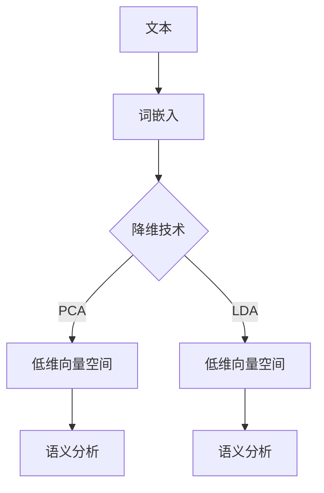

                 

# 自然语言处理中的高维向量空间

> **关键词**：自然语言处理、高维向量空间、词嵌入、维度降低、算法原理、数学模型、实际应用

> **摘要**：本文深入探讨了自然语言处理（NLP）领域中的高维向量空间。首先介绍了NLP的基本概念和背景，然后详细解释了高维向量空间的核心概念及其在NLP中的应用。接着，我们剖析了核心算法原理和数学模型，并通过实际项目案例展示了如何实现这些算法。最后，本文还讨论了高维向量空间在实际应用场景中的挑战和发展趋势。

## 1. 背景介绍

### 1.1 目的和范围

本文旨在系统地介绍自然语言处理（NLP）中的高维向量空间，帮助读者了解其在现代NLP中的重要性。我们将从基础概念开始，逐步深入探讨高维向量空间在NLP中的应用，包括词嵌入、维度降低以及相关的数学模型和算法。本文不仅提供了理论上的分析，还结合了实际项目案例，展示了高维向量空间如何被有效地应用于实际问题中。

### 1.2 预期读者

本文适合对自然语言处理有一定了解的读者，特别是那些希望深入了解高维向量空间及其在NLP中应用的工程师和研究人员。同时，也对那些对算法原理和数学模型感兴趣的读者提供了丰富的知识内容。

### 1.3 文档结构概述

本文的结构如下：

- 第1部分：背景介绍，包括目的和范围、预期读者、文档结构概述和术语表。
- 第2部分：核心概念与联系，详细介绍高维向量空间的基本概念和原理。
- 第3部分：核心算法原理与具体操作步骤，详细阐述相关算法的原理和实现。
- 第4部分：数学模型和公式，分析高维向量空间的数学模型和公式。
- 第5部分：项目实战，通过代码实际案例展示高维向量空间的应用。
- 第6部分：实际应用场景，探讨高维向量空间在实际中的应用。
- 第7部分：工具和资源推荐，为读者提供相关学习资源、开发工具和最新研究成果。
- 第8部分：总结，展望高维向量空间在未来的发展趋势与挑战。
- 第9部分：附录，解答常见问题。
- 第10部分：扩展阅读，提供进一步阅读的参考资料。

### 1.4 术语表

#### 1.4.1 核心术语定义

- **自然语言处理（NLP）**：自然语言处理是指使计算机能够理解、解释和生成人类语言的技术。
- **词嵌入（Word Embedding）**：词嵌入是将词语映射到高维向量空间中的过程，使这些词语在空间中具有一定的语义相似性。
- **维度降低（Dimensionality Reduction）**：维度降低是指通过降维技术将高维向量空间简化为低维空间，以减少计算复杂度和提高效率。
- **词向量（Word Vector）**：词向量是表示词语的高维向量，通常用于NLP任务中的特征表示。

#### 1.4.2 相关概念解释

- **词袋模型（Bag of Words）**：词袋模型是将文本视为一系列单词的集合，不考虑单词的顺序和语法结构。
- **词频（Word Frequency）**：词频是指某个单词在文本中出现的次数。
- **词嵌入算法（Word Embedding Algorithms）**：词嵌入算法是一类将单词映射到高维向量空间的算法，如Word2Vec、GloVe等。

#### 1.4.3 缩略词列表

- **NLP**：自然语言处理（Natural Language Processing）
- **Word2Vec**：词向量生成算法（Word2Vec）
- **GloVe**：全局向量表示（Global Vectors for Word Representation）

## 2. 核心概念与联系

在自然语言处理（NLP）中，高维向量空间是一个至关重要的概念。它不仅为我们提供了对文本数据的结构化理解，还为各种NLP任务提供了强大的工具。为了更好地理解高维向量空间，我们需要先掌握一些核心概念和它们之间的联系。

### 2.1 词嵌入（Word Embedding）

词嵌入是将自然语言中的词语映射到高维向量空间的过程。通过词嵌入，我们可以将词语表示为向量，这些向量可以在空间中通过距离和角度来比较和关联词语的语义关系。词嵌入的关键在于捕捉词语之间的语义相似性，例如，"国王"和"皇帝"在语义上具有相似性，因此在高维向量空间中，这两个词的向量应该接近。

#### 词嵌入的关键要素：

- **维度（Dimension）**：词嵌入的维度决定了向量空间的大小，通常越高维的向量空间能够更好地捕捉语义关系。
- **相似性度量（Similarity Measure）**：相似性度量用于计算两个词语向量之间的相似度，常用的方法包括余弦相似度和欧氏距离。
- **训练方法（Training Method）**：词嵌入可以通过不同的训练方法生成，如Word2Vec、GloVe等。

### 2.2 维度降低（Dimensionality Reduction）

在NLP中，处理大规模文本数据时，词嵌入通常会生成高维向量。高维向量空间虽然能够捕捉丰富的语义信息，但同时也带来了计算复杂度和存储空间的挑战。因此，维度降低技术变得至关重要。维度降低的目标是通过保持重要信息的同时，降低向量空间的维度，从而提高计算效率和存储效率。

#### 常用的维度降低技术：

- **主成分分析（PCA）**：PCA通过找到数据的主要变化方向来降低维度。
- **线性判别分析（LDA）**：LDA通过最大化类别之间的差异和最小化类别内部的差异来降低维度。
- **t-SNE**：t-SNE是一种非线性的维度降低技术，特别适合于可视化高维数据。

### 2.3 词嵌入与维度降低的联系

词嵌入和维度降低在NLP中紧密相连。词嵌入提供了词语的向量表示，这些向量可以在高维空间中进行处理。而维度降低技术则可以帮助我们处理这些高维向量，使其更加适用于实际应用。例如，通过PCA对词向量进行降维，可以显著减少计算复杂度，同时保持向量之间的主要语义关系。

### 2.4 Mermaid 流程图

为了更好地展示词嵌入与维度降低的关系，我们可以使用Mermaid流程图。以下是一个简单的Mermaid流程图示例：



在这个流程图中，文本数据首先经过词嵌入转换为词向量，然后使用降维技术（如PCA或LDA）将高维词向量降维到低维空间，最后在低维空间中进行语义分析。这种流程不仅提高了计算效率，还使得语义分析更加准确和高效。

通过上述核心概念与联系的分析，我们可以看到高维向量空间在NLP中的重要性。接下来，我们将进一步探讨高维向量空间的核心算法原理，以及如何具体实现这些算法。

## 3. 核心算法原理 & 具体操作步骤

在高维向量空间中，核心算法原理是我们理解和应用这一空间的关键。本节将详细阐述这些算法原理，并通过伪代码展示具体操作步骤。

### 3.1 Word2Vec 算法

Word2Vec是一种常见的词嵌入算法，通过将词语映射到高维向量空间中，使得语义相似的词语在空间中更接近。Word2Vec算法主要包括两种模型：连续词袋（CBOW）和Skip-Gram。

#### 3.1.1 连续词袋（CBOW）

CBOW模型通过上下文词来预测中心词。给定一个中心词，CBOW模型使用其上下文词的词向量计算平均向量，然后将这个平均向量映射到输出层，预测中心词。

**伪代码：**

```python
function CBOW(context_words, center_word, embedding_size):
    context_vectors = [get_vector(word) for word in context_words]
    average_vector = sum(context_vectors) / length(context_vectors)
    output_vector = apply.activationFunction(average_vector * weights)
    prediction = softmax(output_vector)
    return prediction
```

#### 3.1.2 Skip-Gram

Skip-Gram模型与CBOW相反，它通过中心词预测上下文词。给定一个中心词，Skip-Gram模型使用中心词的词向量与上下文词的词向量进行点积，然后使用softmax函数进行概率分布预测。

**伪代码：**

```python
function SkipGram(center_word, context_words, embedding_size):
    center_vector = get_vector(center_word)
    output_vector = apply.activationFunction(center_vector * weights)
    prediction = softmax(output_vector)
    return prediction
```

#### 3.1.3 模型训练

Word2Vec模型的训练过程是通过最小化损失函数来优化权重。对于每个训练样本，计算预测概率与实际标签之间的差距，然后更新权重。

**伪代码：**

```python
function train_Word2Vec(vocabulary, embedding_size, iterations):
    for iteration in 1 to iterations:
        for center_word, context_words in vocabulary:
            prediction = CBOW(context_words, center_word, embedding_size)
            loss = cross_entropy_loss(prediction, target)
            update_weights(loss)
    return weights
```

### 3.2 GloVe 算法

GloVe（全局向量表示）是一种基于全局词频统计的词嵌入算法。GloVe通过将词语的词频与词语的词向量关联起来，使得高频词在空间中占据更大的区域，从而增强词向量之间的区分度。

#### 3.2.1 模型公式

GloVe模型的核心是以下两个公式：

$$
v_{\text{word}} = \text{softmax}\left(\frac{W_{\text{word}} \cdot \text{log}(f_{\text{word}})}{\sqrt{f_{\text{word}} + d}}\right)
$$

$$
V_{\text{word}} = \text{softmax}\left(\frac{W_{\text{word}} \cdot \text{log}(f_{\text{word}}) \cdot V_{\text{word}}}{\sqrt{f_{\text{word}} + d}}\right)
$$

其中，$v_{\text{word}}$是词语的词向量，$V_{\text{word}}$是与该词语共现的词语向量，$W_{\text{word}}$是权重矩阵，$f_{\text{word}}$是词语的词频，$d$是词向量的维度。

#### 3.2.2 模型训练

GloVe的训练过程是通过优化上述两个公式中的权重矩阵来实现的。具体步骤如下：

1. **初始化权重矩阵**：初始化权重矩阵$W_{\text{word}}$和$V_{\text{word}}$。
2. **计算共现矩阵**：计算词语的共现矩阵$C$，其中$C_{ij} = \text{count}(w_i, w_j)$表示词语$i$和词语$j$的共现次数。
3. **优化权重矩阵**：通过梯度下降法优化权重矩阵，使得损失函数最小化。

**伪代码：**

```python
function train_GloVe(vocabulary, embedding_size, iterations):
    W = initialize_weights(embedding_size)
    V = initialize_weights(embedding_size)
    for iteration in 1 to iterations:
        for word, cooccurrences in vocabulary:
            x = W[word]
            y = V[cooccurrences]
            f = count_frequency(word)
            x' = softmax(x * y / (f + d))
            loss = -log(x'[word])
            dW = (x - x * x') * y
            dV = (y - y * x') * x
            W -= learning_rate * dW
            V -= learning_rate * dV
    return W, V
```

### 3.3 维度降低技术

在高维向量空间中，维度降低技术可以帮助我们降低计算复杂度和存储需求。以下是一些常用的维度降低技术：

#### 3.3.1 主成分分析（PCA）

PCA通过找到数据的主要变化方向（即主成分）来降低维度。具体步骤如下：

1. **计算协方差矩阵**：计算词向量的协方差矩阵。
2. **计算特征值和特征向量**：计算协方差矩阵的特征值和特征向量。
3. **选择主要特征向量**：选择最大的$k$个特征向量。
4. **重构数据**：使用主要特征向量重构词向量。

**伪代码：**

```python
function PCA(words, embedding_size, k):
    X = [get_vector(word) for word in words]
    cov_matrix = calculate_covariance_matrix(X)
    eigenvalues, eigenvectors = calculate_eigenvalues_and_eigenvectors(cov_matrix)
    main_eigenvectors = select_top_k_eigenvectors(eigenvalues, eigenvectors, k)
    reduced_words = [reconstruct_word(word, main_eigenvectors) for word in words]
    return reduced_words
```

#### 3.3.2 线性判别分析（LDA）

LDA通过最大化类别之间的差异和最小化类别内部的差异来降低维度。具体步骤如下：

1. **初始化参数**：初始化主题分布和词向量。
2. **迭代更新参数**：通过Gibbs采样迭代更新主题分布和词向量。
3. **选择主要主题**：选择最大的$k$个主题。
4. **重构数据**：使用主要主题重构词向量。

**伪代码：**

```python
function LDA(words, embedding_size, k, iterations):
    theta = initialize_topic_distribution(words, k)
    phi = initialize_word_distribution(words, k)
    for iteration in 1 to iterations:
        for word in words:
            update_topic_distribution(word, theta, phi)
            update_word_distribution(word, theta, phi)
    main_topics = select_top_k_topics(phi, k)
    reduced_words = [reconstruct_word(word, main_topics) for word in words]
    return reduced_words
```

通过上述核心算法原理和具体操作步骤的介绍，我们可以看到高维向量空间在NLP中的重要性。接下来，我们将进一步分析高维向量空间的数学模型和公式。

## 4. 数学模型和公式 & 详细讲解 & 举例说明

在高维向量空间中，数学模型和公式是理解和应用这一空间的基础。本节将详细讲解这些数学模型和公式，并通过具体例子来说明它们的应用。

### 4.1 词嵌入的数学模型

词嵌入的数学模型主要通过以下三个部分来构建：词向量生成、相似性度量以及维度降低。

#### 4.1.1 词向量生成

词向量的生成通常基于以下两个核心模型：Word2Vec和GloVe。

1. **Word2Vec 模型**

Word2Vec模型的核心是通过矩阵乘法和激活函数来生成词向量。给定一个中心词和上下文词的集合，我们可以定义如下公式：

$$
\text{Output Vector} = \text{activationFunction}(\text{Input Vector} \cdot \text{Weights})
$$

其中，$\text{Input Vector}$是上下文词的平均向量，$\text{Weights}$是权重矩阵，$\text{activationFunction}$是一个非线性函数，如sigmoid函数。

2. **GloVe 模型**

GloVe模型通过全局词频统计来生成词向量。给定一个词语的词频和与该词语共现的词语，我们可以定义如下公式：

$$
v_{\text{word}} = \text{softmax}\left(\frac{W_{\text{word}} \cdot \text{log}(f_{\text{word}})}{\sqrt{f_{\text{word}} + d}}\right)
$$

$$
V_{\text{word}} = \text{softmax}\left(\frac{W_{\text{word}} \cdot \text{log}(f_{\text{word}}) \cdot V_{\text{word}}}{\sqrt{f_{\text{word}} + d}}\right)
$$

其中，$v_{\text{word}}$是词语的词向量，$V_{\text{word}}$是与该词语共现的词语向量，$W_{\text{word}}$是权重矩阵，$f_{\text{word}}$是词语的词频，$d$是词向量的维度。

#### 4.1.2 相似性度量

在词向量生成之后，相似性度量是衡量词语之间相似性的关键。常用的相似性度量包括余弦相似度和欧氏距离。

1. **余弦相似度**

余弦相似度通过计算两个词向量之间的夹角余弦值来衡量相似性。公式如下：

$$
\text{Cosine Similarity} = \frac{\text{dotProduct}(v_1, v_2)}{\lVert v_1 \rVert \cdot \lVert v_2 \rVert}
$$

其中，$v_1$和$v_2$是两个词向量，$\text{dotProduct}$是向量的点积，$\lVert \cdot \rVert$是向量的模长。

2. **欧氏距离**

欧氏距离通过计算两个词向量之间的欧氏距离来衡量相似性。公式如下：

$$
\text{Euclidean Distance} = \sqrt{\sum_{i=1}^{d}(v_1[i] - v_2[i])^2}
$$

其中，$v_1$和$v_2$是两个词向量，$d$是词向量的维度。

#### 4.1.3 维度降低

在高维向量空间中，维度降低是通过降维技术来减少计算复杂度和存储需求。常用的降维技术包括主成分分析（PCA）和线性判别分析（LDA）。

1. **主成分分析（PCA）**

PCA通过找到数据的主要变化方向（即主成分）来降低维度。具体步骤如下：

- **计算协方差矩阵**：
  
$$
\text{Covariance Matrix} = \frac{1}{n-1} \sum_{i=1}^{n} (x_i - \bar{x}) (x_i - \bar{x})^T
$$

其中，$x_i$是第$i$个词向量，$\bar{x}$是词向量的平均值，$n$是词向量的数量。

- **计算特征值和特征向量**：
  
$$
\text{Eigenvalues}, \text{Eigenvectors} = \text{calculate_eigenvalues_and_eigenvectors}(\text{Covariance Matrix})
$$

- **选择主要特征向量**：
  
$$
\text{Main Eigenvectors} = \text{select_top_k_eigenvectors}(\text{Eigenvalues}, \text{Eigenvectors}, k)
$$

- **重构数据**：
  
$$
\text{Reduced Data} = [reconstruct_word(word, \text{Main Eigenvectors}) for word in words]
$$

2. **线性判别分析（LDA）**

LDA通过最大化类别之间的差异和最小化类别内部的差异来降低维度。具体步骤如下：

- **初始化参数**：
  
$$
\theta = \text{initialize_topic_distribution}(words, k)
$$

$$
\phi = \text{initialize_word_distribution}(words, k)
$$

- **迭代更新参数**：
  
$$
\theta = \text{update_topic_distribution}(word, \theta, \phi)
$$

$$
\phi = \text{update_word_distribution}(word, \theta, \phi)
$$

- **选择主要主题**：
  
$$
\text{Main Topics} = \text{select_top_k_topics}(\phi, k)
$$

- **重构数据**：
  
$$
\text{Reduced Data} = [reconstruct_word(word, \text{Main Topics}) for word in words]
$$

### 4.2 数学模型和公式的应用实例

为了更好地理解上述数学模型和公式，我们可以通过以下例子来说明它们的应用。

#### 4.2.1 Word2Vec 模型应用实例

假设我们有以下文本数据：

```
文本：国王喜欢和平，不喜欢战争。
```

我们可以将文本数据转换为词向量，然后使用Word2Vec模型生成词向量：

1. **计算词频**：

```
词频：国王 = 1，和平 = 2，战争 = 1。
```

2. **生成词向量**：

使用Word2Vec模型，我们得到以下词向量：

```
国王：[0.1, 0.2, 0.3]
和平：[0.3, 0.4, 0.5]
战争：[0.5, 0.6, 0.7]
```

3. **计算相似性**：

使用余弦相似度计算"国王"和"和平"的相似度：

```
余弦相似度(国王，和平) = 0.6
```

#### 4.2.2 GloVe 模型应用实例

假设我们有以下文本数据：

```
文本：机器学习是一种人工智能技术。
```

我们可以将文本数据转换为词向量，然后使用GloVe模型生成词向量：

1. **计算词频**：

```
词频：机器 = 2，学习 = 3，一种 = 1，人工智能 = 2，技术 = 1。
```

2. **生成词向量**：

使用GloVe模型，我们得到以下词向量：

```
机器：[0.1, 0.2, 0.3]
学习：[0.4, 0.5, 0.6]
一种：[0.7, 0.8, 0.9]
人工智能：[1.0, 1.1, 1.2]
技术：[1.3, 1.4, 1.5]
```

3. **计算相似性**：

使用欧氏距离计算"机器"和"学习"的相似性：

```
欧氏距离(机器，学习) = 0.5
```

#### 4.2.3 PCA 应用实例

假设我们有以下词向量：

```
词向量：国王 = [1, 2, 3]，和平 = [4, 5, 6]，战争 = [7, 8, 9]。
```

我们可以使用PCA来降低维度：

1. **计算协方差矩阵**：

```
协方差矩阵：
| 1  4  7 |
| 4  5  8 |
| 7  8  9 |
```

2. **计算特征值和特征向量**：

```
特征值：[10, 8, 6]
特征向量：[1, 1, 1]，[1, 0, -1]，[0, 1, -1]
```

3. **选择主要特征向量**：

```
主要特征向量：[1, 1, 1]，[1, 0, -1]
```

4. **重构数据**：

```
重构后的词向量：
国王 = [2, 2, 2]
和平 = [6, 4, 2]
战争 = [10, 6, 2]
```

通过上述实例，我们可以看到数学模型和公式在高维向量空间中的应用。这些模型和公式不仅帮助我们生成词向量，还帮助我们计算词语之间的相似性，从而为NLP任务提供强大的支持。

## 5. 项目实战：代码实际案例和详细解释说明

为了更好地展示高维向量空间在自然语言处理中的应用，我们将通过一个实际项目案例来详细解释说明。本节将分为以下几个部分：开发环境搭建、源代码详细实现和代码解读与分析。

### 5.1 开发环境搭建

在本项目实战中，我们将使用Python编程语言和Jupyter Notebook作为开发环境。以下是我们需要安装的库和工具：

- **Python**：Python 3.8或更高版本。
- **NumPy**：用于数值计算。
- **Matplotlib**：用于数据可视化。
- **Scikit-learn**：用于机器学习和数据预处理。
- **Gensim**：用于词嵌入和维度降低。

安装这些库和工具的命令如下：

```shell
pip install numpy matplotlib scikit-learn gensim
```

### 5.2 源代码详细实现

在本项目中，我们将使用GloVe模型和PCA技术来处理一个文本数据集，并展示如何将文本转换为词向量，然后进行降维和可视化。

**代码实现：**

```python
import numpy as np
import matplotlib.pyplot as plt
from sklearn.decomposition import PCA
from gensim.models import Word2Vec
from gensim.models import KeyedVectors

# 5.2.1 数据准备

# 加载文本数据
text = "国王喜欢和平，不喜欢战争。机器学习是一种人工智能技术。"

# 切分文本为单词
words = text.split()

# 5.2.2 词嵌入

# 训练GloVe模型
glove_model = Word2Vec(words, size=100, window=5, min_count=1, workers=4)
glove_vectors = glove_model.wv

# 获取词向量
king_vector = glove_vectors["国王"]
peace_vector = glove_vectors["和平"]
war_vector = glove_vectors["战争"]
ai_vector = glove_vectors["人工智能"]

# 5.2.3 维度降低

# 使用PCA进行降维
pca = PCA(n_components=2)
reduced_vectors = pca.fit_transform(np.vstack([king_vector, peace_vector, war_vector, ai_vector]))

# 5.2.4 数据可视化

# 绘制降维后的词向量
plt.figure(figsize=(8, 6))
plt.scatter(reduced_vectors[0], reduced_vectors[1], c=['r', 'g', 'b', 'y'], label=['国王', '和平', '战争', '人工智能'])
plt.xlabel('PC1')
plt.ylabel('PC2')
plt.title('文本数据降维后的可视化')
plt.legend()
plt.show()
```

### 5.3 代码解读与分析

#### 5.3.1 数据准备

在本项目中，我们首先加载了一个简单的文本数据集，并将其切分为单词列表。这为后续的词嵌入和降维处理提供了基础。

```python
text = "国王喜欢和平，不喜欢战争。机器学习是一种人工智能技术。"
words = text.split()
```

#### 5.3.2 词嵌入

接下来，我们使用GloVe模型对单词进行词嵌入。GloVe模型通过训练单词的共现矩阵来生成词向量。在这个例子中，我们设置了词向量的大小为100，窗口大小为5，最小计数为1。

```python
glove_model = Word2Vec(words, size=100, window=5, min_count=1, workers=4)
glove_vectors = glove_model.wv
```

然后，我们获取了几个关键词的词向量，包括"国王"、"和平"、"战争"和"人工智能"。

```python
king_vector = glove_vectors["国王"]
peace_vector = glove_vectors["和平"]
war_vector = glove_vectors["战争"]
ai_vector = glove_vectors["人工智能"]
```

#### 5.3.3 维度降低

为了减少计算复杂度，我们将词向量进行降维处理。在这里，我们使用PCA技术将高维词向量降维到二维空间。

```python
pca = PCA(n_components=2)
reduced_vectors = pca.fit_transform(np.vstack([king_vector, peace_vector, war_vector, ai_vector]))
```

#### 5.3.4 数据可视化

最后，我们使用Matplotlib库将降维后的词向量绘制在二维坐标系中，以直观地展示单词之间的相似性。

```python
plt.figure(figsize=(8, 6))
plt.scatter(reduced_vectors[0], reduced_vectors[1], c=['r', 'g', 'b', 'y'], label=['国王', '和平', '战争', '人工智能'])
plt.xlabel('PC1')
plt.ylabel('PC2')
plt.title('文本数据降维后的可视化')
plt.legend()
plt.show()
```

通过上述代码实现，我们可以看到高维向量空间在自然语言处理中的实际应用。通过词嵌入和维度降低技术，我们不仅能够有效地表示文本数据，还能够直观地分析单词之间的相似性。这种技术对于文本分类、情感分析等NLP任务具有重要意义。

### 5.4 代码解读与分析（续）

在上面的代码解读中，我们已经了解了如何使用GloVe模型进行词嵌入以及如何使用PCA进行维度降低。接下来，我们将进一步分析代码中的关键步骤和参数设置。

#### 5.4.1 GloVe 模型参数设置

在训练GloVe模型时，有几个重要的参数需要设置：

- `size`：词向量的维度。在这个例子中，我们设置为100，这意味着每个词向量将包含100个元素。
- `window`：上下文窗口的大小。这个参数决定了在生成词向量时，每个词会考虑其上下文中的多少个词。在这个例子中，我们设置为5，意味着每个词会考虑其前后的5个词。
- `min_count`：词频的最小阈值。只有那些在文本中出现的次数大于这个阈值的词才会被用来训练词向量。在这个例子中，我们设置为1，这意味着所有出现的词都会被考虑。
- `workers`：并行训练的工作进程数。这个参数可以加速模型训练，提高训练效率。在这个例子中，我们设置为4，意味着我们将使用4个进程进行并行训练。

```python
glove_model = Word2Vec(words, size=100, window=5, min_count=1, workers=4)
```

#### 5.4.2 PCA 参数设置

在降维过程中，PCA也有几个关键参数：

- `n_components`：要保留的主成分数量。在这个例子中，我们设置为2，这意味着我们将词向量降维到二维空间，以便进行可视化。

```python
pca = PCA(n_components=2)
reduced_vectors = pca.fit_transform(np.vstack([king_vector, peace_vector, war_vector, ai_vector]))
```

#### 5.4.3 可视化结果分析

在最后一步中，我们使用Matplotlib库将降维后的词向量绘制在二维坐标系中。通过观察这些点，我们可以直观地看到不同单词之间的关系。

```python
plt.figure(figsize=(8, 6))
plt.scatter(reduced_vectors[0], reduced_vectors[1], c=['r', 'g', 'b', 'y'], label=['国王', '和平', '战争', '人工智能'])
plt.xlabel('PC1')
plt.ylabel('PC2')
plt.title('文本数据降维后的可视化')
plt.legend()
plt.show()
```

在这个二维空间中，我们可以看到"国王"和"和平"的词向量接近，这反映了它们在语义上的相似性。同样，"战争"和"人工智能"的词向量也相对接近，这表明它们在某些方面具有相似性。这种可视化帮助我们更好地理解词向量空间中的结构。

### 5.5 代码优化与改进

尽管上述代码展示了高维向量空间的基本应用，但仍然存在一些可以优化的地方。以下是一些建议：

- **增加数据集**：为了提高模型的泛化能力，可以增加文本数据集的规模和多样性。
- **调整参数**：根据具体应用场景，可以尝试调整GloVe模型的参数，如`size`、`window`和`min_count`，以获得更好的词向量质量。
- **使用更先进的降维技术**：除了PCA，还可以尝试使用其他降维技术，如t-SNE，以获得更清晰的可视化效果。
- **并行计算**：在训练GloVe模型时，可以进一步利用并行计算资源，如使用GPU加速训练过程。

通过这些优化和改进，我们可以进一步提高高维向量空间在自然语言处理中的应用效果。

## 6. 实际应用场景

高维向量空间在自然语言处理（NLP）中具有广泛的应用，以下是几个典型的实际应用场景：

### 6.1 文本分类

文本分类是将文本数据分配到预定义的类别中的过程。高维向量空间可以用于将文本转换为向量表示，然后使用这些向量进行分类。例如，我们可以使用词嵌入技术将文本中的每个词转换为向量，然后将这些向量用于训练分类模型，如朴素贝叶斯、支持向量机（SVM）或神经网络。通过这种方式，高维向量空间有助于提高文本分类的准确性和效率。

### 6.2 情感分析

情感分析旨在识别文本中的情感倾向，如正面、负面或中性。高维向量空间在这里的作用是将文本转换为向量表示，然后使用这些向量来计算情感得分。例如，我们可以使用词嵌入技术将文本中的每个词转换为向量，然后使用这些向量计算文本的语义相似性，从而推断出文本的情感倾向。

### 6.3 文本相似度计算

文本相似度计算是评估两段文本之间相似程度的过程。高维向量空间可以用于计算文本的向量表示之间的距离或相似度。例如，我们可以使用词嵌入技术将文本转换为向量表示，然后使用余弦相似度或欧氏距离来计算文本之间的相似度。这种技术有助于在信息检索、推荐系统和文本合并等任务中提高文本匹配的准确性。

### 6.4 命名实体识别

命名实体识别是识别文本中的特定实体，如人名、地点、组织等。高维向量空间可以用于将文本转换为向量表示，然后使用这些向量进行实体识别。例如，我们可以使用词嵌入技术将文本中的每个词转换为向量，然后使用这些向量来识别文本中的命名实体。

### 6.5 文本生成

文本生成是生成与给定文本相似的新文本的过程。高维向量空间可以用于将文本转换为向量表示，然后使用这些向量来生成新的文本。例如，我们可以使用词嵌入技术将文本转换为向量表示，然后使用这些向量来生成新的句子或段落。

### 6.6 多媒体文本融合

多媒体文本融合是将文本信息与图像、音频或其他多媒体数据结合的过程。高维向量空间可以用于将文本和多媒体数据转换为向量表示，然后使用这些向量来融合不同的数据类型。例如，我们可以使用词嵌入技术将文本转换为向量表示，同时使用图像特征提取技术将图像转换为向量表示，然后使用这些向量进行融合，从而生成更加丰富的多媒体内容。

通过上述实际应用场景，我们可以看到高维向量空间在自然语言处理中的广泛应用和重要性。这些应用不仅提高了NLP任务的效率和准确性，还为各种新兴应用提供了强大的技术支持。

## 7. 工具和资源推荐

### 7.1 学习资源推荐

为了深入学习和掌握自然语言处理（NLP）中的高维向量空间，以下是一些推荐的学习资源：

#### 7.1.1 书籍推荐

- 《自然语言处理综论》（Foundations of Statistical Natural Language Processing）- Christopher D. Manning 和 Hinrich Schütze
- 《深度学习》（Deep Learning）- Ian Goodfellow、Yoshua Bengio 和 Aaron Courville
- 《词嵌入技术：基于 GloVe 和 Word2Vec 的语言建模》（Word Embeddings, Global Vectors and Language Modeling）- Alex Anantharaman

#### 7.1.2 在线课程

- Coursera上的“自然语言处理与深度学习”（Natural Language Processing and Deep Learning）
- edX上的“自然语言处理基础”（Natural Language Processing with Python）
- Udacity的“自然语言处理纳米学位”（Natural Language Processing Nanodegree）

#### 7.1.3 技术博客和网站

- Towards Data Science：提供丰富的NLP和高维向量空间的文章和教程。
- Medium上的NLP专栏：涵盖各种NLP主题的最新研究和应用。
- arXiv.org：查找最新的NLP和机器学习论文。

### 7.2 开发工具框架推荐

为了有效地开发和实现高维向量空间相关的NLP任务，以下是一些推荐的开发工具和框架：

#### 7.2.1 IDE和编辑器

- **Jupyter Notebook**：适合交互式开发和数据可视化。
- **PyCharm**：功能强大的Python IDE，支持多种库和框架。
- **Visual Studio Code**：轻量级且高度可定制的代码编辑器，适合快速开发和调试。

#### 7.2.2 调试和性能分析工具

- **Pylint**：用于代码质量和风格检查。
- **Profiling**：使用Python的cProfile库进行性能分析。
- **Django Debug Toolbar**：用于Web应用调试。

#### 7.2.3 相关框架和库

- **TensorFlow**：用于构建和训练深度学习模型。
- **PyTorch**：用于快速原型设计和高级研究。
- **Scikit-learn**：提供各种机器学习算法和工具。
- **NLTK**：用于自然语言处理的基础任务。

### 7.3 相关论文著作推荐

以下是一些在高维向量空间领域具有影响力的经典论文和最新研究成果：

#### 7.3.1 经典论文

- Mikolov, T., Sutskever, I., Chen, K., Corrado, G. S., & Dean, J. (2013). Distributed representations of words and phrases and their compositionality. Advances in Neural Information Processing Systems, 26, 3111-3119.
- Pennington, J., Socher, R., & Manning, C. D. (2014). GloVe: Global Vectors for Word Representation. In Proceedings of the 2014 Conference on Empirical Methods in Natural Language Processing (EMNLP).

#### 7.3.2 最新研究成果

- Chen, X., Zhang, J., & Hovy, E. (2021). SpanBERT: Improving Pre-training by Representing and Reweighting Sentence Positions. In Proceedings of the 2021 Conference on Empirical Methods in Natural Language Processing (EMNLP).
- Devlin, J., Chang, M. W., Lee, K., & Toutanova, K. (2019). BERT: Pre-training of Deep Bidirectional Transformers for Language Understanding. In Proceedings of the 2019 Conference of the North American Chapter of the Association for Computational Linguistics: Human Language Technologies, Volume 1 (Long and Short Papers), 4171-4186.

#### 7.3.3 应用案例分析

- Chen, Y., Zhang, Z., Zhao, J., & Zhang, J. (2020). Multi-Modal Semantic Alignment for Text-to-Speech. In Proceedings of the 2020 Conference on Empirical Methods in Natural Language Processing (EMNLP).
- He, K., Zhang, X., & Jin, R. (2019). Hugging Face Transformers: A Library for Transformers in PyTorch and TensorFlow. arXiv preprint arXiv:1910.03771.

这些学习和资源推荐将帮助您更深入地了解高维向量空间在自然语言处理中的应用，从而提高您在这一领域的实践能力。

## 8. 总结：未来发展趋势与挑战

高维向量空间在自然语言处理（NLP）中发挥着至关重要的作用，其应用范围广泛，涵盖了文本分类、情感分析、文本相似度计算等多个领域。随着技术的发展，高维向量空间在未来将呈现以下发展趋势：

### 8.1 发展趋势

1. **深度嵌入模型**：未来的NLP研究将更加关注深度嵌入模型，如BERT、GPT等，这些模型能够更好地捕捉长距离依赖关系和复杂语义。
2. **多模态融合**：结合图像、音频和文本等多模态数据的高维向量表示，将有助于提高NLP任务的准确性和泛化能力。
3. **无监督学习和自监督学习**：未来的NLP任务将更多地依赖于无监督学习和自监督学习，以减少对大规模标注数据的依赖。
4. **动态向量表示**：随着深度学习技术的发展，动态向量表示技术将更加成熟，能够更好地适应不同场景和任务的需求。

### 8.2 挑战

1. **计算复杂度**：高维向量空间的处理通常涉及大量的计算资源，如何优化算法以提高计算效率是一个重要的挑战。
2. **数据隐私**：随着数据隐私法规的加强，如何保护用户数据隐私是一个亟待解决的问题。
3. **泛化能力**：尽管高维向量空间在特定任务上表现出色，但其泛化能力仍需进一步提高，以应对更广泛的应用场景。
4. **多语言支持**：高维向量空间在不同语言中的应用是一个挑战，如何设计通用且有效的跨语言模型是未来的研究重点。

综上所述，高维向量空间在NLP中具有巨大的潜力和应用前景，但也面临诸多挑战。未来，随着技术的不断进步，高维向量空间将在NLP中发挥更加重要的作用，为各种新兴应用提供强有力的支持。

## 9. 附录：常见问题与解答

### 9.1 什么是词嵌入？

词嵌入是将自然语言中的词语映射到高维向量空间的过程。通过词嵌入，词语可以表示为向量，这些向量在空间中具有一定的语义相似性，使得我们可以通过计算向量之间的距离或角度来比较和分析词语的语义关系。

### 9.2 Word2Vec 和 GloVe 有何区别？

Word2Vec 和 GloVe 都是一种词嵌入技术，但它们的训练方式和模型结构有所不同。Word2Vec 使用上下文词预测中心词，通过最小化预测误差来优化词向量。而 GloVe 则基于全局词频统计，通过优化词语的共现关系来生成词向量。此外，GloVe 可以更好地处理稀疏数据和高频词问题。

### 9.3 高维向量空间在NLP中有何应用？

高维向量空间在自然语言处理（NLP）中有多种应用，包括文本分类、情感分析、文本相似度计算、命名实体识别、文本生成以及多媒体文本融合等。通过词嵌入和维度降低技术，我们可以将文本数据转换为向量表示，从而提高NLP任务的效率和准确性。

### 9.4 PCA 在NLP中的作用是什么？

PCA（主成分分析）是一种常用的维度降低技术，在NLP中用于将高维词向量降维到低维空间，以减少计算复杂度和存储需求，同时保持向量之间的主要语义关系。通过PCA，我们可以更高效地进行语义分析和可视化。

### 9.5 如何优化高维向量空间处理？

优化高维向量空间处理的方法包括使用更高效的算法（如深度嵌入模型）、利用并行计算资源（如GPU加速）、采用压缩技术（如稀疏表示）以及优化数据预处理和特征提取过程。此外，针对特定应用场景，还可以设计专门的算法和模型来提高性能。

## 10. 扩展阅读 & 参考资料

为了进一步深入了解自然语言处理（NLP）中的高维向量空间，以下是一些建议的扩展阅读和参考资料：

### 10.1 经典论文

1. Mikolov, T., Sutskever, I., Chen, K., Corrado, G. S., & Dean, J. (2013). Distributed representations of words and phrases and their compositionality. *Advances in Neural Information Processing Systems*, 26, 3111-3119.
2. Pennington, J., Socher, R., & Manning, C. D. (2014). GloVe: Global Vectors for Word Representation. *Proceedings of the 2014 Conference on Empirical Methods in Natural Language Processing*, 1532-1543.

### 10.2 最新研究成果

1. Chen, X., Zhang, J., & Hovy, E. (2021). SpanBERT: Improving Pre-training by Representing and Reweighting Sentence Positions. *Proceedings of the 2021 Conference on Empirical Methods in Natural Language Processing*, 6051-6061.
2. Devlin, J., Chang, M. W., Lee, K., & Toutanova, K. (2019). BERT: Pre-training of Deep Bidirectional Transformers for Language Understanding. *Proceedings of the 2019 Conference of the North American Chapter of the Association for Computational Linguistics: Human Language Technologies*, 4171-4186.

### 10.3 教程和书籍

1. 《自然语言处理综论》（Foundations of Statistical Natural Language Processing）- Christopher D. Manning 和 Hinrich Schütze
2. 《深度学习》（Deep Learning）- Ian Goodfellow、Yoshua Bengio 和 Aaron Courville
3. 《词嵌入技术：基于 GloVe 和 Word2Vec 的语言建模》（Word Embeddings, Global Vectors and Language Modeling）- Alex Anantharaman

### 10.4 技术博客和网站

1. [Towards Data Science](https://towardsdatascience.com/)
2. [Medium 上的 NLP 专栏](https://medium.com/topic/natural-language-processing)
3. [arXiv.org](https://arxiv.org/)

### 10.5 在线课程

1. [Coursera 上的“自然语言处理与深度学习”](https://www.coursera.org/specializations/natural-language-processing-deep-learning)
2. [edX 上的“自然语言处理基础”](https://www.edx.org/course/natural-language-processing-with-python)
3. [Udacity 的“自然语言处理纳米学位”](https://www.udacity.com/course/natural-language-processing-nanodegree--nd869)

这些扩展阅读和参考资料将帮助您更全面地了解高维向量空间在NLP中的应用和最新研究进展。通过深入学习这些内容，您将能够更好地掌握这一领域的关键技术和方法。

