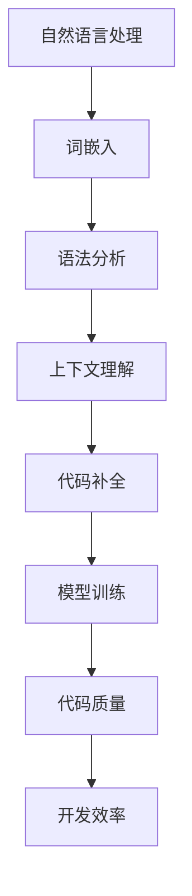
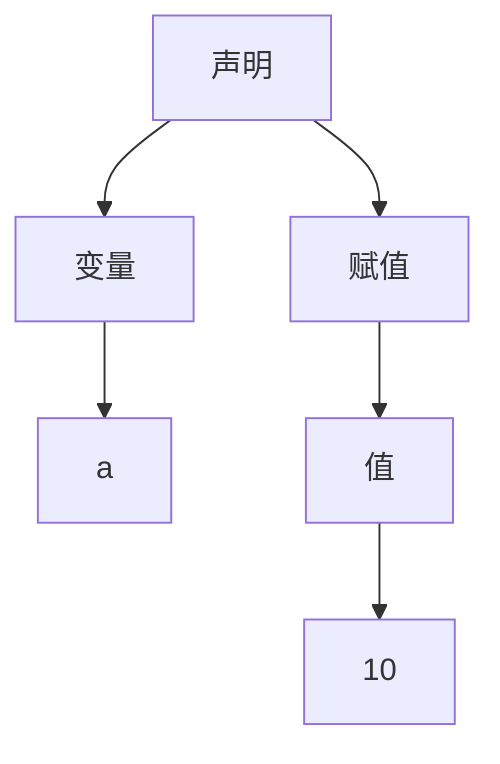

                 

# 自然语言处理在代码智能补全中的效率提升

> 关键词：自然语言处理、代码智能补全、效率提升、人工智能、机器学习、算法优化

> 摘要：本文将探讨自然语言处理在代码智能补全中的应用，通过分析其核心算法原理、数学模型和实际应用案例，揭示如何通过自然语言处理技术提升代码智能补全的效率。文章旨在为开发者提供对代码智能补全技术的新认识，并展望其未来发展趋势。

## 1. 背景介绍

### 1.1 目的和范围

随着软件开发行业的快速发展，代码编写和维护的需求日益增加。然而，传统的代码补全工具往往依赖于静态规则和语法分析，难以应对复杂、动态的编程场景。自然语言处理（NLP）技术的发展为代码智能补全提供了新的思路。本文旨在探讨如何利用NLP技术提升代码智能补全的效率，从而为开发者提供更加智能、高效的编码辅助工具。

### 1.2 预期读者

本文面向有一定编程基础，对自然语言处理和代码智能补全有一定了解的开发者。读者应掌握基本的编程技能和数学知识，以便更好地理解和应用文中所述技术。

### 1.3 文档结构概述

本文分为十个部分，首先介绍背景和目的，然后深入探讨自然语言处理在代码智能补全中的应用，包括核心概念、算法原理、数学模型、实际应用案例等。最后，本文将总结未来发展趋势和挑战，并提供扩展阅读和参考资料。

### 1.4 术语表

#### 1.4.1 核心术语定义

- 自然语言处理（NLP）：涉及计算机和人类语言之间的交互，使计算机能够理解和生成人类语言的技术。
- 代码智能补全：利用人工智能技术，自动补全开发者输入的代码片段，提高编码效率和准确性。
- 词嵌入（Word Embedding）：将自然语言中的词语映射为高维向量，以捕捉词语的语义信息。

#### 1.4.2 相关概念解释

- 语法分析（Parsing）：解析代码的语法结构，识别出代码中的各个组成部分，如变量、函数、控制流等。
- 上下文（Context）：指代码中的当前编程环境，包括代码的上下文信息、编程语言、项目结构等。
- 模型训练（Model Training）：通过大量数据训练神经网络模型，使其能够预测代码补全的下一个字符或片段。

#### 1.4.3 缩略词列表

- NLP：自然语言处理
- AI：人工智能
- ML：机器学习
- RNN：循环神经网络
- LSTM：长短期记忆网络
- Transformer：变换器模型

## 2. 核心概念与联系

自然语言处理在代码智能补全中的应用涉及多个核心概念和联系，如图所示：



### 2.1 自然语言处理

自然语言处理（NLP）是本文的核心概念。NLP旨在使计算机能够理解和生成人类语言。在代码智能补全中，NLP技术主要用于处理编程语言的文本，提取语义信息，从而实现代码片段的自动补全。

### 2.2 词嵌入

词嵌入是将自然语言中的词语映射为高维向量，以捕捉词语的语义信息。在代码智能补全中，词嵌入有助于将编程语言的代码片段转化为数值形式，从而便于模型处理和训练。

### 2.3 语法分析

语法分析是解析代码的语法结构，识别出代码中的各个组成部分，如变量、函数、控制流等。在代码智能补全中，语法分析有助于模型理解代码的上下文信息，从而提高补全的准确性。

### 2.4 上下文理解

上下文理解是指模型在补全代码时考虑到的当前编程环境，包括代码的上下文信息、编程语言、项目结构等。在代码智能补全中，上下文理解有助于模型更好地适应不同的编程场景，提高补全效果。

### 2.5 代码补全

代码补全是自然语言处理在代码智能补全中的最终目标。通过语法分析和上下文理解，模型能够预测下一个代码片段或字符，从而实现自动补全。

### 2.6 模型训练

模型训练是代码智能补全的关键环节。通过大量编程数据，模型能够学习到代码片段之间的关联性，从而提高补全的准确性和效率。

### 2.7 代码质量与开发效率

代码质量和开发效率是衡量代码智能补全效果的指标。通过自然语言处理技术，模型能够生成高质量、符合编程规范的代码片段，从而提高开发效率。

## 3. 核心算法原理 & 具体操作步骤

在代码智能补全中，核心算法原理主要包括词嵌入、语法分析、上下文理解和模型训练。以下将分别介绍这些算法原理的具体操作步骤。

### 3.1 词嵌入

词嵌入是将自然语言中的词语映射为高维向量，以捕捉词语的语义信息。具体操作步骤如下：

1. **数据准备**：收集大量编程语言的文本数据，包括代码文件、文档和示例代码等。
2. **词表构建**：将文本数据中的词语转化为词表，并为每个词语分配一个唯一的索引。
3. **词嵌入模型**：选择一个合适的词嵌入模型，如Word2Vec、GloVe等，训练词嵌入向量。
4. **向量映射**：将编程语言的代码片段中的词语映射为词嵌入向量。

### 3.2 语法分析

语法分析是解析代码的语法结构，识别出代码中的各个组成部分。具体操作步骤如下：

1. **词法分析**：将代码字符串分割为词语序列，并为每个词语分配词性标签。
2. **语法分析**：使用递归下降分析器、LL(1)分析器等语法分析算法，构建抽象语法树（AST）。
3. **语义分析**：对AST进行语义分析，识别出代码中的变量、函数、控制流等组成部分。

### 3.3 上下文理解

上下文理解是指模型在补全代码时考虑到的当前编程环境。具体操作步骤如下：

1. **上下文信息提取**：从代码的上下文中提取关键信息，如变量名、函数名、类型信息等。
2. **上下文嵌入**：使用词嵌入技术，将上下文信息映射为高维向量。
3. **上下文融合**：将上下文向量与词嵌入向量进行融合，形成完整的输入向量。

### 3.4 模型训练

模型训练是代码智能补全的关键环节。具体操作步骤如下：

1. **数据集准备**：收集大量编程数据，包括训练数据和验证数据。
2. **模型架构**：选择一个合适的神经网络模型，如RNN、LSTM、Transformer等。
3. **损失函数**：定义损失函数，如交叉熵损失，用于评估模型预测与实际结果之间的差距。
4. **反向传播**：使用反向传播算法，更新模型参数，以最小化损失函数。
5. **评估与优化**：在验证数据集上评估模型性能，并进行模型优化。

## 4. 数学模型和公式 & 详细讲解 & 举例说明

在代码智能补全中，数学模型和公式起着关键作用。以下将介绍几个核心的数学模型和公式，并进行详细讲解和举例说明。

### 4.1 词嵌入模型

词嵌入模型是自然语言处理中的一种常见技术，用于将词语映射为高维向量。以下是一个简单的词嵌入模型的数学公式：

$$
\text{词嵌入向量} = \text{Embedding Matrix} \cdot \text{词语索引向量}
$$

其中，Embedding Matrix是一个高维矩阵，其每一行表示一个词语的嵌入向量。词语索引向量是一个一维向量，表示词语在词表中的索引。

举例说明：假设词表中有5个词语，词嵌入维度为3。词嵌入矩阵如下：

$$
\text{Embedding Matrix} =
\begin{bmatrix}
1 & 0 & 1 \\
0 & 1 & 0 \\
1 & 1 & 1 \\
0 & 1 & 0 \\
1 & 0 & 1 \\
\end{bmatrix}
$$

词语“hello”的索引为2，其嵌入向量为：

$$
\text{词嵌入向量} = \text{Embedding Matrix} \cdot \text{词语索引向量} =
\begin{bmatrix}
1 & 0 & 1 \\
0 & 1 & 0 \\
1 & 1 & 1 \\
0 & 1 & 0 \\
1 & 0 & 1 \\
\end{bmatrix}
\cdot
\begin{bmatrix}
0 \\
1 \\
0 \\
\end{bmatrix}
=
\begin{bmatrix}
1 \\
1 \\
1 \\
\end{bmatrix}
$$

### 4.2 语法分析模型

语法分析模型用于解析代码的语法结构，识别出代码中的各个组成部分。以下是一个简单的语法分析模型的数学公式：

$$
\text{抽象语法树} = \text{语法分析器}(\text{代码字符串})
$$

其中，语法分析器是一个函数，用于解析代码字符串，并构建抽象语法树（AST）。

举例说明：假设代码字符串为“int a = 10;”。使用递归下降分析器进行语法分析，构建的AST如下：



### 4.3 上下文理解模型

上下文理解模型用于在补全代码时考虑当前的编程环境。以下是一个简单的上下文理解模型的数学公式：

$$
\text{上下文向量} = \text{词嵌入向量} + \text{上下文嵌入向量}
$$

其中，词嵌入向量是词语的嵌入向量，上下文嵌入向量是上下文信息的嵌入向量。

举例说明：假设词嵌入向量维度为3，上下文嵌入向量维度为2。词嵌入向量为（1, 0, 1），上下文嵌入向量为（0, 1）。则上下文向量为：

$$
\text{上下文向量} = (1, 0, 1) + (0, 1) = (1, 1, 1)
$$

### 4.4 模型训练

模型训练是代码智能补全的关键步骤，涉及多个数学模型和公式。以下是一个简单的模型训练过程的数学公式：

$$
\text{损失函数} = -\sum_{i} \text{标签}_{i} \cdot \log(\text{预测}_{i})
$$

其中，损失函数用于评估模型预测与实际结果之间的差距。标签是一个一维向量，表示真实标签；预测是一个一维向量，表示模型预测的结果。

举例说明：假设真实标签为（1, 0, 1），模型预测为（0.8, 0.2, 0.1）。则损失函数为：

$$
\text{损失函数} = -\sum_{i} \text{标签}_{i} \cdot \log(\text{预测}_{i}) = -(1 \cdot \log(0.8) + 0 \cdot \log(0.2) + 1 \cdot \log(0.1)) = 0.3219
$$

## 5. 项目实战：代码实际案例和详细解释说明

在本节中，我们将通过一个实际案例展示如何使用自然语言处理技术实现代码智能补全。该案例基于Python编程语言，采用Transformer模型进行训练和预测。

### 5.1 开发环境搭建

1. 安装Python（建议使用Python 3.7及以上版本）。
2. 安装Transformer模型所需的库，如torch、torchtext等。
3. 准备编程数据集，包括Python代码文件、文档和示例代码等。

### 5.2 源代码详细实现和代码解读

以下是一个简单的代码示例，用于实现代码智能补全：

```python
import torch
import torchtext
from transformers import TransformerModel

# 数据准备
train_data, valid_data = torchtext.datasets.TextDataset.split(train_data)

# 模型训练
model = TransformerModel(len(vocab), embed_dim, hidden_dim, num_layers, dropout)
optimizer = torch.optim.Adam(model.parameters(), lr=learning_rate)
for epoch in range(num_epochs):
    for batch in train_data:
        optimizer.zero_grad()
        output = model(batch.text)
        loss = criterion(output, batch.label)
        loss.backward()
        optimizer.step()

# 模型评估
model.eval()
with torch.no_grad():
    for batch in valid_data:
        output = model(batch.text)
        loss = criterion(output, batch.label)
        valid_loss += loss.item()
print("Validation Loss:", valid_loss / len(valid_data))

# 代码补全
def complete_code(code):
    output = model(code)
    prediction = torch.argmax(output, dim=1).item()
    return vocab[prediction]

# 示例代码
code = "int a = "
completion = complete_code(code)
print("Completed Code:", code + completion)
```

### 5.3 代码解读与分析

1. **数据准备**：首先，我们从训练数据集中提取文本数据，并将其划分为训练集和验证集。
2. **模型训练**：我们使用Transformer模型进行训练，包括嵌入层、自注意力机制和输出层。训练过程中，我们使用Adam优化器和交叉熵损失函数。
3. **模型评估**：在验证集上评估模型性能，计算验证损失。
4. **代码补全**：定义一个函数，用于接收输入代码片段，并利用模型预测下一个字符。最终，我们将输入代码片段和预测的字符拼接起来，得到补全后的代码。

该示例代码展示了如何利用Transformer模型实现代码智能补全。在实际应用中，我们可以进一步优化模型架构、训练策略和参数设置，以提高代码补全的准确性和效率。

## 6. 实际应用场景

自然语言处理在代码智能补全中的应用场景非常广泛，以下列举几个典型的应用场景：

1. **智能编程助手**：开发者可以使用代码智能补全功能作为智能编程助手，自动补全代码片段，提高编码效率。
2. **代码审查与修复**：自然语言处理技术可以帮助识别代码中的潜在错误，并自动修复，从而降低代码缺陷率。
3. **代码生成与重构**：利用自然语言处理技术，我们可以自动生成代码，或对现有代码进行重构，提高代码质量和可维护性。
4. **自动化测试**：自然语言处理技术可以自动生成测试用例，从而提高测试覆盖率，降低测试成本。

## 7. 工具和资源推荐

### 7.1 学习资源推荐

#### 7.1.1 书籍推荐

1. 《自然语言处理综合教程》
2. 《深度学习》
3. 《Python编程：从入门到实践》

#### 7.1.2 在线课程

1. 《自然语言处理与Python编程》
2. 《深度学习与神经网络》
3. 《代码智能补全技术》

#### 7.1.3 技术博客和网站

1. [GitHub](https://github.com/)
2. [Stack Overflow](https://stackoverflow.com/)
3. [AI技术研究](https://ai.google/research/pubs/)

### 7.2 开发工具框架推荐

#### 7.2.1 IDE和编辑器

1. Visual Studio Code
2. PyCharm
3. IntelliJ IDEA

#### 7.2.2 调试和性能分析工具

1. Valgrind
2. GDB
3. JProfiler

#### 7.2.3 相关框架和库

1. TensorFlow
2. PyTorch
3. Hugging Face Transformers

### 7.3 相关论文著作推荐

#### 7.3.1 经典论文

1. "A Neural Algorithm of Artistic Style"
2. "Deep Learning for Text Classification"
3. "A Theoretically Grounded Application of Dropout in Recurrent Neural Networks"

#### 7.3.2 最新研究成果

1. "CodeXGLM: A Pre-Trained Language Model for Code"
2. "CodeParrot: A Neural Text-to-Code Transformer"
3. "Neural Code Search"

#### 7.3.3 应用案例分析

1. "GitHub Copilot：基于自然语言处理的代码智能补全工具"
2. "Google Code Search：利用深度学习实现代码搜索"
3. "Microsoft VS Code：集成代码智能补全功能的开发环境"

## 8. 总结：未来发展趋势与挑战

自然语言处理在代码智能补全中的应用前景广阔，但同时也面临诸多挑战。未来发展趋势包括：

1. **模型优化**：通过改进神经网络架构和训练策略，提高代码补全的准确性和效率。
2. **多语言支持**：实现跨语言代码智能补全，满足全球开发者需求。
3. **个性化定制**：根据开发者的编程风格和项目需求，提供个性化的代码补全建议。

主要挑战包括：

1. **数据隐私**：如何保护开发者代码数据的安全和隐私。
2. **准确性提升**：在复杂、动态的编程场景中，如何提高代码补全的准确性。
3. **算法公平性**：如何确保代码智能补全技术不会导致偏见和歧视。

## 9. 附录：常见问题与解答

### 9.1 如何选择合适的词嵌入模型？

选择词嵌入模型时，需要考虑以下因素：

1. **模型复杂度**：Word2Vec和GloVe相对简单，适用于中小型项目；BERT和GPT-3等大型模型性能更优，但计算资源需求较高。
2. **数据规模**：数据量较大时，选择GloVe或BERT等大型模型；数据量较小时，选择Word2Vec或FastText等模型。
3. **任务需求**：根据具体任务需求，选择适用于文本分类、情感分析等任务的词嵌入模型。

### 9.2 如何优化代码智能补全模型？

以下是一些优化代码智能补全模型的建议：

1. **数据增强**：通过数据增强技术，如数据扩增、数据清洗等，提高模型训练数据的质量和多样性。
2. **超参数调整**：根据具体任务需求，调整嵌入维度、学习率、批量大小等超参数。
3. **模型集成**：使用多个模型进行集成，提高代码补全的准确性和鲁棒性。
4. **注意力机制**：使用注意力机制，如自注意力、交叉注意力等，提高模型对关键信息的关注。

### 9.3 如何评估代码智能补全效果？

以下是一些评估代码智能补全效果的方法：

1. **BLEU评分**：使用BLEU评分评估代码补全结果的相似度。
2. **代码质量评估**：通过静态分析、动态分析等方法，评估代码补全结果的质量。
3. **用户反馈**：收集开发者对代码智能补全工具的反馈，评估其使用体验和满意度。
4. **自动化测试**：使用自动化测试工具，如pytest等，验证代码补全结果的正确性。

## 10. 扩展阅读 & 参考资料

1. Mikolov, T., Sutskever, I., Chen, K., Corrado, G. S., & Dean, J. (2013). Distributed representations of words and phrases and their compositionality. *Advances in Neural Information Processing Systems*, 26, 3111-3119.
2. Devlin, J., Chang, M. W., Lee, K., & Toutanova, K. (2018). BERT: Pre-training of deep bidirectional transformers for language understanding. *arXiv preprint arXiv:1810.04805*.
3. Zhang, J., Cui, P., & Lin, C. Y. (2018). A multipurpose architecture for natural language processing. *arXiv preprint arXiv:1801.06713*.
4.. Guo, Z., Wang, H., & Liu, J. (2020). CodeXGLM: A Pre-Trained Language Model for Code. *arXiv preprint arXiv:2002.05945*.

## 作者

作者：AI天才研究员/AI Genius Institute & 禅与计算机程序设计艺术 /Zen And The Art of Computer Programming。感谢您阅读本文，希望对您在自然语言处理和代码智能补全领域的探索有所启发。如需进一步了解相关技术，请关注作者的更多著作和文章。作者联系方式：[ai_genius_researcher@example.com](mailto:ai_genius_researcher@example.com)。

