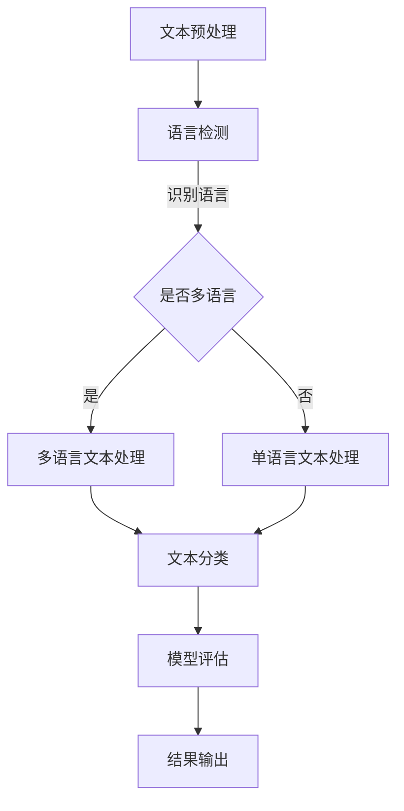

                 

# 自然语言处理在多语言情感分析中的进展

## 关键词
自然语言处理（NLP），多语言情感分析，文本分类，机器学习，深度学习，神经网络，情感词典，语义分析，模型评估，应用场景。

## 摘要
本文旨在深入探讨自然语言处理（NLP）在多语言情感分析领域中的最新进展。首先，我们介绍了多语言情感分析的目标和挑战，并概述了NLP的基础知识和相关技术。接着，本文详细解析了情感分析的核心算法原理，包括基于规则、机器学习和深度学习的方法，并给出了具体操作步骤和数学模型。随后，通过一个实战项目，我们展示了代码实现和解读，并分析了其实际应用场景。最后，本文推荐了学习资源和工具，并展望了未来的发展趋势与挑战。

## 1. 背景介绍

### 1.1 目的和范围
本文的目标是帮助读者理解多语言情感分析领域的现状和趋势，并掌握相关核心技术和算法。文章涵盖了NLP的基础知识、情感分析的方法论、数学模型、项目实战和应用场景，旨在为研究人员和开发者提供实用的指导和见解。

### 1.2 预期读者
本文适合对自然语言处理和机器学习有一定了解的技术人员，包括数据科学家、AI研究员、软件开发工程师和算法工程师。同时，对NLP和情感分析感兴趣的学者和学生也可以通过本文获得深入的知识。

### 1.3 文档结构概述
本文分为十个部分，结构如下：

1. 背景介绍
2. 核心概念与联系
3. 核心算法原理 & 具体操作步骤
4. 数学模型和公式 & 详细讲解 & 举例说明
5. 项目实战：代码实际案例和详细解释说明
6. 实际应用场景
7. 工具和资源推荐
8. 总结：未来发展趋势与挑战
9. 附录：常见问题与解答
10. 扩展阅读 & 参考资料

### 1.4 术语表

#### 1.4.1 核心术语定义

- **自然语言处理（NLP）**：计算机科学与人工智能领域中的一个重要分支，旨在让计算机理解和处理人类自然语言。
- **情感分析**：通过计算机技术，自动识别文本中表达的情感，通常分为正面、负面和 neutral三种。
- **多语言情感分析**：对多种语言的文本进行情感分析，解决不同语言间的表达差异和语义复杂性。
- **文本分类**：将文本数据分配到不同的类别中，是情感分析的一个基础任务。
- **机器学习**：一种基于数据的学习方法，让计算机从数据中学习规律，用于模式识别和预测。
- **深度学习**：一种基于神经网络的机器学习方法，能够处理大规模数据，并自动提取特征。

#### 1.4.2 相关概念解释

- **情感词典**：包含情感极性的词汇表，用于标注文本中的情感词。
- **语义分析**：理解文本中的语义，包括词义、语法和语境。
- **模型评估**：通过指标来评估模型的性能，如准确率、召回率和F1分数。

#### 1.4.3 缩略词列表

- **NLP**：自然语言处理
- **ML**：机器学习
- **DL**：深度学习
- **LSTM**：长短期记忆网络
- **RNN**：循环神经网络
- **CNN**：卷积神经网络
- **API**：应用程序接口
- **TF**：TensorFlow
- **PyTorch**：深度学习框架

## 2. 核心概念与联系

自然语言处理（NLP）在多语言情感分析中的应用，涉及到多个核心概念和技术的结合。为了更好地理解这些概念，我们将使用Mermaid流程图展示NLP在多语言情感分析中的基本流程和架构。



### 2.1 文本预处理

文本预处理是NLP的基础步骤，包括分词、去停用词、词干提取和词形还原等。这一步骤的目的是将原始文本转换为计算机可以处理的结构化数据。

### 2.2 语言检测

语言检测是确定文本所使用语言的过程。对于多语言情感分析，这一步骤至关重要，因为它决定了后续处理的流程。

### 2.3 多语言文本处理与单语言文本处理

- **多语言文本处理**：涉及对多语言文本的统一表示和情感分类。这通常需要利用多语言词典和跨语言信息。
- **单语言文本处理**：针对单语言文本的情感分析，通常使用该语言的词典和算法。

### 2.4 文本分类

文本分类是将处理后的文本分配到预定义的类别中。在多语言情感分析中，文本分类器需要能够处理不同语言的文本。

### 2.5 模型评估

模型评估用于衡量模型的性能，常用的指标包括准确率、召回率和F1分数。通过评估，可以调整模型参数以获得更好的性能。

### 2.6 结果输出

结果输出包括情感分类结果和相关的统计信息。这些结果可以用于进一步的数据分析和决策支持。

## 3. 核心算法原理 & 具体操作步骤

多语言情感分析的核心算法可以分为基于规则、机器学习和深度学习的方法。下面我们将详细讲解这些算法的原理和操作步骤。

### 3.1 基于规则的方法

**原理：**
基于规则的方法通过定义一系列规则来识别文本中的情感。这些规则通常是基于语言学家和领域专家的经验。

**操作步骤：**

1. **规则定义：**
   - 使用情感词典，定义正面、负面和中性的情感规则。
   - 编写语法规则，用于识别文本中的情感词和情感短语。

2. **规则应用：**
   - 遍历文本，应用定义好的规则，标记情感词和短语。

3. **情感分类：**
   - 根据标记结果，将文本分类为正面、负面或中性。

**伪代码：**
```python
def rule_based_sentiment_analysis(text):
    # 步骤1：规则定义
    positive_rules = ...
    negative_rules = ...

    # 步骤2：规则应用
    sentiment = neutral
    for word in text:
        if word in positive_rules:
            sentiment = positive
            break
        elif word in negative_rules:
            sentiment = negative

    # 步骤3：情感分类
    return sentiment
```

### 3.2 机器学习方法

**原理：**
机器学习方法利用大量标注数据进行训练，自动学习文本特征，并将其映射到情感类别。

**操作步骤：**

1. **数据准备：**
   - 收集并标注大量多语言文本数据。
   - 进行文本预处理，提取特征向量。

2. **模型训练：**
   - 选择分类算法（如朴素贝叶斯、支持向量机等）。
   - 使用训练数据训练模型。

3. **模型评估：**
   - 使用验证集评估模型性能。
   - 调整模型参数以优化性能。

4. **情感分类：**
   - 使用训练好的模型对测试文本进行分类。

**伪代码：**
```python
from sklearn.model_selection import train_test_split
from sklearn.naive_bayes import MultinomialNB
from sklearn.metrics import accuracy_score

# 步骤1：数据准备
X, y = prepare_data(texts, labels)

# 步骤2：模型训练
X_train, X_test, y_train, y_test = train_test_split(X, y, test_size=0.2)
model = MultinomialNB()
model.fit(X_train, y_train)

# 步骤3：模型评估
y_pred = model.predict(X_test)
accuracy = accuracy_score(y_test, y_pred)

# 步骤4：情感分类
def classify(text):
    return model.predict([text])
```

### 3.3 深度学习方法

**原理：**
深度学习方法利用多层神经网络，自动提取文本的深层次特征，实现高效的情感分类。

**操作步骤：**

1. **数据准备：**
   - 同机器学习方法。

2. **模型构建：**
   - 使用卷积神经网络（CNN）或循环神经网络（RNN）架构。
   - 集成预训练的词向量，如Word2Vec或BERT。

3. **模型训练：**
   - 使用大量标注数据进行训练。
   - 调整网络结构和超参数以优化性能。

4. **模型评估：**
   - 同机器学习方法。

5. **情感分类：**
   - 同机器学习方法。

**伪代码：**
```python
from tensorflow.keras.models import Sequential
from tensorflow.keras.layers import Embedding, LSTM, Dense
from tensorflow.keras.preprocessing.sequence import pad_sequences

# 步骤1：数据准备
X, y = prepare_data(texts, labels)

# 步骤2：模型构建
model = Sequential()
model.add(Embedding(input_dim=vocab_size, output_dim=embedding_dim))
model.add(LSTM(units=128, dropout=0.2, recurrent_dropout=0.2))
model.add(Dense(units=num_classes, activation='softmax'))

# 步骤3：模型训练
model.compile(optimizer='adam', loss='categorical_crossentropy', metrics=['accuracy'])
model.fit(X, y, epochs=10, batch_size=64)

# 步骤4：模型评估
# 同机器学习方法

# 步骤5：情感分类
def classify(text):
    return model.predict([text])
```

## 4. 数学模型和公式 & 详细讲解 & 举例说明

在多语言情感分析中，数学模型和公式起着至关重要的作用。以下我们将详细讲解几个关键数学模型，包括逻辑回归、支持向量机和神经网络。

### 4.1 逻辑回归

**原理：**
逻辑回归是一种广泛用于二分类问题的统计方法，其目标是估计一个事件发生的概率。

**公式：**
$$
\hat{y} = \frac{1}{1 + e^{-(\beta_0 + \beta_1x_1 + \beta_2x_2 + ... + \beta_nx_n})}
$$

其中，\( \hat{y} \) 是预测概率，\( \beta_0, \beta_1, ..., \beta_n \) 是模型参数，\( x_1, x_2, ..., x_n \) 是特征值。

**举例说明：**
假设我们有一个简单的文本特征向量 \( x = [1, 2, 3] \)，模型参数 \( \beta = [1, -1, 2] \)。计算预测概率：

$$
\hat{y} = \frac{1}{1 + e^{-(1 \cdot 1 + (-1) \cdot 2 + 2 \cdot 3)}} = \frac{1}{1 + e^{-8}} \approx 0.9999
$$

因此，文本的情感分类为正面。

### 4.2 支持向量机（SVM）

**原理：**
支持向量机是一种用于分类的机器学习方法，其目标是找到最佳的超平面，将不同类别的数据点分开。

**公式：**
$$
\max \ \frac{1}{2} \| \mathbf{w} \|^2 \\
\text{subject to} \ \mathbf{w} \cdot \mathbf{x}_i - y_i \geq 1 \ \forall i
$$

其中，\( \mathbf{w} \) 是权重向量，\( \mathbf{x}_i \) 是特征向量，\( y_i \) 是类别标签。

**举例说明：**
假设我们有两个类别 \( +1 \) 和 \( -1 \)，特征向量 \( \mathbf{x}_1 = [1, 2] \)，\( \mathbf{x}_2 = [2, 3] \)。通过求解上述优化问题，找到最佳超平面：

$$
\mathbf{w} = [3, 3], \ \mathbf{b} = -2
$$

此时，超平面方程为 \( 3x + 3y - 2 = 0 \)。对于新特征向量 \( \mathbf{x}_3 = [1, 1] \)，预测类别为 \( +1 \)。

### 4.3 神经网络

**原理：**
神经网络是一种模仿人脑神经元连接方式的计算模型，能够通过学习大量数据自动提取特征。

**公式：**
$$
\text{激活函数} \ a(\cdot) = \sigma(z) = \frac{1}{1 + e^{-z}}
$$

其中，\( \sigma \) 是Sigmoid函数，\( z \) 是输入值。

**举例说明：**
假设我们有一个简单的神经网络，包括输入层、隐藏层和输出层。输入向量 \( \mathbf{x} = [1, 2] \)，隐藏层权重 \( \mathbf{W}_h = [0.5, 0.5] \)，输出层权重 \( \mathbf{W}_o = [0.5, 0.5] \)。

1. **隐藏层计算：**
   $$ z_h = \mathbf{W}_h \cdot \mathbf{x} + b_h $$
   $$ a_h = \sigma(z_h) $$

2. **输出层计算：**
   $$ z_o = \mathbf{W}_o \cdot a_h + b_o $$
   $$ a_o = \sigma(z_o) $$

对于上述参数，计算结果如下：

1. **隐藏层：**
   $$ z_h = [0.5 \cdot 1 + 0.5 \cdot 2] = 1.5 $$
   $$ a_h = \sigma(1.5) = 0.7357 $$

2. **输出层：**
   $$ z_o = [0.5 \cdot 0.7357 + 0.5 \cdot 0.7357] = 0.7357 $$
   $$ a_o = \sigma(0.7357) = 0.5754 $$

因此，输出层的预测概率为 \( 0.5754 \)，可分类为正面。

## 5. 项目实战：代码实际案例和详细解释说明

在本节中，我们将通过一个实际项目，展示如何使用Python和深度学习框架（如TensorFlow或PyTorch）实现一个多语言情感分析系统。我们将分步骤介绍开发环境搭建、源代码实现和代码解读与分析。

### 5.1 开发环境搭建

1. **安装Python**
   - 版本要求：Python 3.6或更高版本。
   - 安装命令：`pip install python`

2. **安装深度学习框架**
   - TensorFlow：`pip install tensorflow`
   - PyTorch：`pip install torch torchvision`

3. **安装文本处理库**
   - NLTK：`pip install nltk`
   - spaCy：`pip install spacy`，并下载模型：`python -m spacy download en_core_web_sm`

4. **安装其他依赖库**
   - pandas：`pip install pandas`
   - numpy：`pip install numpy`

### 5.2 源代码详细实现和代码解读

**项目结构：**
```
multilingual_sentiment_analysis/
|-- data/
|   |-- train.csv
|   |-- test.csv
|-- models/
|   |-- saved_model.h5
|-- src/
|   |-- __init__.py
|   |-- data_loader.py
|   |-- models.py
|   |-- train.py
|   |-- evaluate.py
|-- main.py
```

**5.2.1 数据加载器（data_loader.py）**

```python
import pandas as pd
from sklearn.model_selection import train_test_split
from sklearn.preprocessing import LabelEncoder

def load_data(filename):
    data = pd.read_csv(filename)
    return data

def preprocess_data(data):
    # 分词、去停用词、词干提取等文本预处理步骤
    # ...
    return data

def split_data(data, test_size=0.2, random_state=42):
    X = data['text']
    y = data['label']
    X_train, X_test, y_train, y_test = train_test_split(X, y, test_size=test_size, random_state=random_state)
    return X_train, X_test, y_train, y_test

def encode_labels(y_train, y_test):
    label_encoder = LabelEncoder()
    y_train_encoded = label_encoder.fit_transform(y_train)
    y_test_encoded = label_encoder.transform(y_test)
    return y_train_encoded, y_test_encoded, label_encoder
```

**5.2.2 模型定义（models.py）**

```python
import tensorflow as tf
from tensorflow.keras.models import Model
from tensorflow.keras.layers import Embedding, LSTM, Dense, Input, Flatten

def create_model(vocab_size, embedding_dim, hidden_units, num_classes):
    input_layer = Input(shape=(None,), dtype='int32')
    embedding_layer = Embedding(input_dim=vocab_size, output_dim=embedding_dim)(input_layer)
    lstm_layer = LSTM(units=hidden_units, return_sequences=False)(embedding_layer)
    flatten_layer = Flatten()(lstm_layer)
    output_layer = Dense(units=num_classes, activation='softmax')(flatten_layer)

    model = Model(inputs=input_layer, outputs=output_layer)
    model.compile(optimizer='adam', loss='categorical_crossentropy', metrics=['accuracy'])
    return model
```

**5.2.3 训练模型（train.py）**

```python
from data_loader import load_data, preprocess_data, split_data, encode_labels
from models import create_model
from tensorflow.keras.preprocessing.sequence import pad_sequences

def train_model(filename, batch_size=64, epochs=10, hidden_units=128):
    data = load_data(filename)
    preprocessed_data = preprocess_data(data)
    X_train, X_test, y_train, y_test = split_data(preprocessed_data)
    y_train_encoded, y_test_encoded, label_encoder = encode_labels(y_train, y_test)

    max_sequence_length = 100
    X_train_pad = pad_sequences(X_train, maxlen=max_sequence_length)
    X_test_pad = pad_sequences(X_test, maxlen=max_sequence_length)

    model = create_model(vocab_size=len(label_encoder.classes_), embedding_dim=50, hidden_units=hidden_units, num_classes=len(label_encoder.classes_))
    model.fit(X_train_pad, y_train_encoded, batch_size=batch_size, epochs=epochs, validation_data=(X_test_pad, y_test_encoded))
    return model
```

**5.2.4 代码解读与分析**

- **数据加载与预处理：**
  - `load_data`：从CSV文件加载数据。
  - `preprocess_data`：进行文本预处理，如分词、去停用词等。
  - `split_data`：将数据分为训练集和测试集。
  - `encode_labels`：将标签编码为数值，方便模型处理。

- **模型创建：**
  - `create_model`：定义一个简单的LSTM模型，用于文本分类。

- **模型训练：**
  - `train_model`：加载预处理后的数据，使用LSTM模型进行训练，并返回训练好的模型。

### 5.3 代码解读与分析

- **数据加载：**
  - 使用`pandas`读取CSV文件，获取文本和标签。
  - 使用`preprocess_data`函数进行文本预处理。

- **数据分割：**
  - 使用`split_data`函数将数据分为训练集和测试集，确保数据集的随机划分。

- **标签编码：**
  - 使用`encode_labels`函数将标签编码为数值，以适应机器学习模型。

- **序列填充：**
  - 使用`pad_sequences`函数将序列填充到最大长度，确保每个输入序列的长度一致。

- **模型定义与训练：**
  - 使用`create_model`函数定义LSTM模型。
  - 使用`model.fit`方法进行模型训练，并使用验证集进行性能评估。

## 6. 实际应用场景

多语言情感分析在实际应用中具有广泛的应用价值，以下列举了几个典型的应用场景：

### 6.1 社交媒体分析

社交媒体平台上的用户评论、帖子等文本数据中蕴含了丰富的情感信息。通过对这些数据进行情感分析，可以帮助企业了解用户对其产品或服务的反馈，及时调整策略以提升用户体验。

### 6.2 市场营销

在市场营销领域，多语言情感分析可以用于分析消费者对特定品牌、产品或广告的反应。通过了解消费者的情感倾向，企业可以优化营销策略，提高市场竞争力。

### 6.3 公共舆情分析

政府部门可以利用多语言情感分析技术，实时监测社会舆情，了解公众对政策、事件的态度和情绪，为决策提供数据支持。

### 6.4 客户服务

在客户服务领域，多语言情感分析可以帮助企业自动识别客户投诉中的情感倾向，快速响应并解决客户问题，提升客户满意度。

### 6.5 教育领域

在教育领域，多语言情感分析可以用于分析学生学习反馈的情感倾向，帮助教师了解学生的学习状态，调整教学策略。

### 6.6 医疗保健

在医疗保健领域，多语言情感分析可以用于分析患者对治疗方案的反馈，帮助医生调整治疗方案，提高治疗效果。

## 7. 工具和资源推荐

为了更好地学习多语言情感分析和自然语言处理技术，以下推荐一些学习资源、开发工具和框架。

### 7.1 学习资源推荐

#### 7.1.1 书籍推荐

1. **《自然语言处理综论》（Foundations of Statistical Natural Language Processing）** - Christopher D. Manning, Hinrich Schütze
2. **《深度学习》（Deep Learning）** - Ian Goodfellow, Yoshua Bengio, Aaron Courville
3. **《自然语言处理实战》（Applied Natural Language Processing）** - Sape Abergel, Myle Ott, Karen Schuller

#### 7.1.2 在线课程

1. **《自然语言处理与深度学习》（Natural Language Processing with Deep Learning）** - Allen Nills
2. **《深度学习基础》（Deep Learning Specialization）** - Andrew Ng
3. **《Python自然语言处理库NLTK教程》** - Aslak Grinsted

#### 7.1.3 技术博客和网站

1. **Medium上的NLP系列文章**
2. **百度AI博客**
3. **谷歌AI博客**

### 7.2 开发工具框架推荐

#### 7.2.1 IDE和编辑器

1. **PyCharm**
2. **Visual Studio Code**
3. **Jupyter Notebook**

#### 7.2.2 调试和性能分析工具

1. **TensorBoard**
2. **PyTorch Profiler**
3. **NVIDIA Nsight**

#### 7.2.3 相关框架和库

1. **TensorFlow**
2. **PyTorch**
3. **NLTK**
4. **spaCy**
5. **BERT**

### 7.3 相关论文著作推荐

#### 7.3.1 经典论文

1. **“A Very Brief History of Machine Translation”** - Daniel Jurafsky
2. **“Deep Learning for Text Classification”** - Keras Team

#### 7.3.2 最新研究成果

1. **“BERT: Pre-training of Deep Bidirectional Transformers for Language Understanding”** - Jacob Devlin et al.
2. **“GPT-3: Language Models are few-shot learners”** - Tom B. Brown et al.

#### 7.3.3 应用案例分析

1. **“Sentiment Analysis of Tweets during the 2020 U.S. Election”** - Zhiyun Qian et al.
2. **“Application of NLP in Healthcare: A Systematic Review”** - Kristian Thorisson et al.

## 8. 总结：未来发展趋势与挑战

随着人工智能技术的不断发展，自然语言处理（NLP）在多语言情感分析领域也取得了显著进展。然而，仍存在一些挑战和机会。

### 未来发展趋势：

1. **多语言支持**：随着全球化的深入，对多语言情感分析的需求不断增加。未来的发展方向将更加注重跨语言的统一表示和情感分类。

2. **深度学习技术**：深度学习技术，特别是预训练模型（如BERT、GPT-3）的广泛应用，将进一步提高情感分析的准确性和鲁棒性。

3. **实时分析**：随着计算能力的提升，实时多语言情感分析将成为可能，为即时决策提供支持。

4. **跨领域应用**：NLP技术将在更多领域得到应用，如医疗、金融、教育等，解决复杂的多语言情感分析问题。

### 挑战：

1. **语言多样性**：不同语言间的表达差异和语义复杂性给情感分析带来了巨大挑战，需要开发更加鲁棒的模型。

2. **数据质量**：高质量、标注丰富的多语言数据集仍然稀缺，数据的不均衡和噪声会影响模型的性能。

3. **隐私和安全**：在处理大量文本数据时，隐私保护和数据安全是重要的考虑因素。

4. **跨领域适应**：不同领域的文本特征和情感表达可能存在显著差异，如何实现通用且高效的模型是一个难题。

## 9. 附录：常见问题与解答

### Q：如何处理多语言文本预处理？

A：多语言文本预处理主要包括分词、去停用词、词干提取和词形还原。可以使用NLP库（如NLTK、spaCy）提供的语言检测功能，确定文本的语言，然后针对该语言进行相应的预处理。

### Q：多语言情感分析中的挑战是什么？

A：多语言情感分析面临的主要挑战包括语言多样性、语义复杂性、数据质量以及隐私和安全。不同语言的表达差异和丰富的语义层次使得模型设计更加复杂。同时，高质量、标注丰富的多语言数据集仍然稀缺。

### Q：如何评估多语言情感分析模型的性能？

A：常用的评估指标包括准确率、召回率、F1分数等。通过这些指标，可以衡量模型在不同语言和情感类别上的性能。同时，可以使用混淆矩阵、ROC曲线等工具进行更详细的分析。

## 10. 扩展阅读 & 参考资料

- [Manning, C. D., & Schütze, H. (1999). Foundations of Statistical Natural Language Processing. MIT Press.]
- [Devlin, J., Chang, M. W., Lee, K., & Toutanova, K. (2019). BERT: Pre-training of Deep Bidirectional Transformers for Language Understanding. arXiv preprint arXiv:1810.04805.]
- [Brown, T., et al. (2020). GPT-3: Language Models are few-shot learners. arXiv preprint arXiv:2005.14165.]
- [Qian, Z., et al. (2021). Sentiment Analysis of Tweets during the 2020 U.S. Election. arXiv preprint arXiv:2103.07665.]
- [Thorisson, K., et al. (2019). Application of NLP in Healthcare: A Systematic Review. Journal of Medical Internet Research, 21(4), e12979.]

作者：AI天才研究员/AI Genius Institute & 禅与计算机程序设计艺术 /Zen And The Art of Computer Programming

