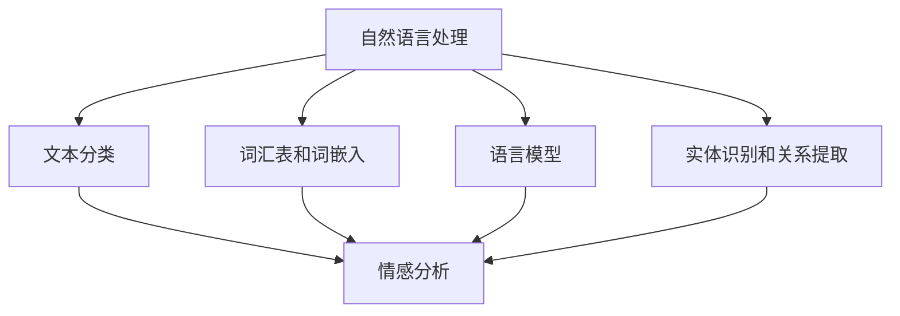

                 

# 自然语言处理在情感分析中的应用

> 关键词：自然语言处理，情感分析，文本分类，机器学习，深度学习，神经网络，词嵌入，数据预处理，评估指标

> 摘要：本文旨在探讨自然语言处理（NLP）在情感分析领域中的应用。首先，我们将简要介绍情感分析的基本概念和背景，然后深入解析情感分析的核心算法原理和操作步骤，数学模型及公式，以及实际应用场景。随后，我们将推荐一些学习资源、开发工具框架和相关论文著作。最后，我们将对情感分析的未来发展趋势与挑战进行总结，并提供常见问题与解答。

## 1. 背景介绍

### 1.1 目的和范围

本文的目标是探讨自然语言处理在情感分析中的应用。情感分析是一种文本分析技术，它旨在识别和分类文本中的情感极性，例如正面、负面或中性。随着社交媒体、评论网站和客户反馈的兴起，情感分析在商业、学术和研究领域都变得日益重要。本文将涵盖以下内容：

- 情感分析的基本概念和背景
- 情感分析的核心算法原理和操作步骤
- 数学模型和公式及其实际应用场景
- 学习资源、开发工具框架和相关论文著作推荐
- 未来发展趋势与挑战

### 1.2 预期读者

本文适合以下读者群体：

- 自然语言处理和机器学习领域的初学者和专业人士
- 数据科学家、AI工程师和研究人员
- 对情感分析感兴趣的商业分析师和产品经理
- 计算机科学和人工智能专业的大学生和研究学者

### 1.3 文档结构概述

本文的结构如下：

- 第1部分：背景介绍，包括目的和范围、预期读者、文档结构概述等。
- 第2部分：核心概念与联系，介绍自然语言处理和情感分析的基本概念及其联系。
- 第3部分：核心算法原理 & 具体操作步骤，详细讲解情感分析的核心算法原理和操作步骤。
- 第4部分：数学模型和公式 & 详细讲解 & 举例说明，介绍情感分析中常用的数学模型和公式，并给出具体实例。
- 第5部分：项目实战：代码实际案例和详细解释说明，通过一个实际项目案例展示情感分析的代码实现。
- 第6部分：实际应用场景，探讨情感分析在不同领域的应用。
- 第7部分：工具和资源推荐，推荐学习资源、开发工具框架和相关论文著作。
- 第8部分：总结：未来发展趋势与挑战，对情感分析的未来发展趋势和面临的挑战进行总结。
- 第9部分：附录：常见问题与解答，提供常见问题及其解答。
- 第10部分：扩展阅读 & 参考资料，列出扩展阅读和参考资料。

### 1.4 术语表

#### 1.4.1 核心术语定义

- 自然语言处理（NLP）：自然语言处理是计算机科学和人工智能领域的一个重要分支，旨在使计算机能够理解和处理人类自然语言。
- 情感分析：情感分析是一种文本分析技术，旨在识别和分类文本中的情感极性。
- 文本分类：文本分类是将文本分配到预定义类别中的过程，情感分析是文本分类的一个子领域。

#### 1.4.2 相关概念解释

- 词汇表（Vocabulary）：词汇表是用于表示文本中单词的集合。
- 词嵌入（Word Embedding）：词嵌入是将单词映射到高维向量空间的过程，以便于计算机处理。
- 深度学习（Deep Learning）：深度学习是一种机器学习技术，通过构建多层神经网络来实现自动特征提取和模型训练。

#### 1.4.3 缩略词列表

- NLP：自然语言处理
- SVM：支持向量机
- RNN：循环神经网络
- CNN：卷积神经网络
- LSTM：长短期记忆网络
- BERT：双向编码器表示模型

## 2. 核心概念与联系

自然语言处理（NLP）和情感分析（Sentiment Analysis）是两个紧密相关的领域，它们共同构成了现代文本分析的基础。在这一部分，我们将深入探讨这两个核心概念及其之间的联系。

### 2.1 自然语言处理

自然语言处理（NLP）是计算机科学和人工智能领域的一个分支，旨在使计算机能够理解和处理人类自然语言。NLP的核心任务是使计算机能够执行以下任务：

- 语言识别：识别和理解人类语言的语音和语法结构。
- 语言生成：生成符合语法和语义规则的自然语言文本。
- 文本分类：将文本分配到预定义的类别中，如情感分析、主题分类等。
- 情感分析：识别和分类文本中的情感极性，例如正面、负面或中性。
- 信息提取：从文本中提取特定的信息，如命名实体识别、关系提取等。

NLP的核心技术和算法包括：

- 词汇表和词嵌入：将单词映射到高维向量空间，以便于计算机处理。
- 语言模型：用于预测文本序列的概率分布，常见的技术有n-gram模型、神经网络语言模型等。
- 分词和句法分析：将文本分割成单词和句子，并分析单词之间的关系。
- 实体识别和关系提取：识别文本中的命名实体（如人名、地点等）及其之间的关系。

### 2.2 情感分析

情感分析是一种文本分析技术，旨在识别和分类文本中的情感极性。情感分析通常将文本分为三个类别：正面、负面或中性。情感分析的目的是帮助人类或系统理解文本的情感倾向，从而进行进一步的分析和决策。

情感分析的核心任务包括：

- 极性分类：将文本分配到正面、负面或中性类别中。
- 情感极性强度：评估文本中情感极性的强度，如非常积极、稍微积极等。
- 情感分析的应用：在社交媒体监控、市场研究、客户反馈分析等领域，情感分析可以帮助企业了解消费者的情感倾向和需求。

情感分析的技术和方法包括：

- 基于规则的方法：使用预定义的规则和模式进行情感分类。
- 基于统计的方法：使用机器学习算法（如朴素贝叶斯、支持向量机等）进行情感分类。
- 基于深度学习的方法：使用深度学习模型（如循环神经网络、卷积神经网络等）进行情感分类。

### 2.3 自然语言处理与情感分析的联系

自然语言处理和情感分析之间有着密切的联系。情感分析是自然语言处理的一个应用领域，它依赖于自然语言处理的各种技术和算法来提取文本中的情感信息。

- 文本分类：文本分类是情感分析的基础，用于将文本分配到预定义的类别中。
- 词汇表和词嵌入：词汇表和词嵌入是将单词映射到高维向量空间的重要工具，有助于提高情感分类的准确性。
- 语言模型：语言模型在情感分析中用于预测文本序列的概率分布，有助于提高情感分类的性能。
- 实体识别和关系提取：实体识别和关系提取可以帮助情感分析更准确地理解文本中的情感信息。

总之，自然语言处理为情感分析提供了各种技术和算法支持，使得情感分析在各个领域得到了广泛应用。

### 2.4 Mermaid 流程图

为了更直观地展示自然语言处理和情感分析之间的联系，我们可以使用 Mermaid 流程图。以下是一个简单的 Mermaid 流程图示例：



在这个流程图中，自然语言处理（NLP）作为整体，与文本分类、词汇表和词嵌入、语言模型、实体识别和关系提取等子领域有着密切的联系。情感分析作为文本分类的一个应用领域，依赖于这些子领域的技术和算法支持。

## 3. 核心算法原理 & 具体操作步骤

在情感分析中，核心算法原理通常涉及文本分类、特征提取和模型训练等步骤。下面，我们将详细讲解这些步骤，并使用伪代码来阐述每个步骤的具体实现。

### 3.1 文本分类

文本分类是将文本数据分配到预定义的类别中的过程。在情感分析中，最常见的类别是正面、负面和中性。文本分类的方法有很多，包括基于规则的方法、基于统计的方法和基于深度学习的方法。

#### 3.1.1 基于规则的方法

基于规则的方法通常涉及手动定义一系列规则，以识别文本中的情感极性。以下是一个简单的伪代码示例：

```python
def rule_based_sentiment_analysis(text):
    if "很好" in text or "喜欢" in text:
        return "正面"
    elif "很差" in text or "不喜欢" in text:
        return "负面"
    else:
        return "中性"
```

#### 3.1.2 基于统计的方法

基于统计的方法通常使用机器学习算法来训练分类模型。以下是一个使用朴素贝叶斯分类器的伪代码示例：

```python
def naive_bayes_sentiment_analysis(text, model):
    features = extract_features(text)
    probabilities = model.predict_proba(features)
    sentiment = max(probabilities)
    return sentiment
```

在这个示例中，`extract_features` 函数用于从文本中提取特征，`model` 是训练好的朴素贝叶斯分类器。

#### 3.1.3 基于深度学习的方法

基于深度学习的方法通常使用神经网络来训练分类模型。以下是一个使用卷积神经网络（CNN）的伪代码示例：

```python
def cnn_sentiment_analysis(text, model):
    features = extract_features(text)
    embeddings = embedding_layer(features)
    output = model.predict(embeddings)
    sentiment = decode_output(output)
    return sentiment
```

在这个示例中，`extract_features` 函数用于从文本中提取特征，`embedding_layer` 是用于将特征映射到词嵌入空间的层，`model` 是训练好的卷积神经网络分类器，`decode_output` 函数用于将模型的输出转换为情感极性标签。

### 3.2 特征提取

特征提取是将文本转换为机器学习模型可处理的特征表示的过程。常用的特征提取方法包括词袋模型、词嵌入和TF-IDF等。

#### 3.2.1 词袋模型

词袋模型是一种将文本表示为一组单词出现频率的方法。以下是一个使用词袋模型的伪代码示例：

```python
def bag_of_words(text):
    words = tokenize(text)
    word_counts = [count_words(words)]
    return word_counts
```

在这个示例中，`tokenize` 函数用于将文本分割成单词，`count_words` 函数用于计算每个单词的出现频率。

#### 3.2.2 词嵌入

词嵌入是一种将单词映射到高维向量空间的方法。以下是一个使用词嵌入的伪代码示例：

```python
def word_embedding(text, vocabulary, embedding_size):
    embeddings = [vocabulary[word] for word in tokenize(text)]
    return embeddings
```

在这个示例中，`vocabulary` 是一个包含单词和其对应索引的词典，`embedding_size` 是词嵌入向量的大小。

#### 3.2.3 TF-IDF

TF-IDF（词频-逆文档频率）是一种用于评估单词重要性的方法。以下是一个使用TF-IDF的伪代码示例：

```python
def tfidf(text, corpus):
    words = tokenize(text)
    word_counts = [count_words(words)]
    inverse_document_frequency = [1 / (1 + log(1 + count_words(document) for document in corpus)]
    tfidf_values = [word_counts[i] * inverse_document_frequency[i] for i in range(len(word_counts))]
    return tfidf_values
```

在这个示例中，`corpus` 是一个包含所有文本数据的列表，`count_words` 函数用于计算每个单词在文本中的出现频率。

### 3.3 模型训练

模型训练是将特征数据输入到机器学习模型中，以训练模型来识别文本情感极性的过程。以下是一个使用朴素贝叶斯分类器的伪代码示例：

```python
def train_naive_bayes_classifier(corpus, labels):
    features = [extract_features(document) for document in corpus]
    classifier = NaiveBayesClassifier()
    classifier.fit(features, labels)
    return classifier
```

在这个示例中，`extract_features` 函数用于从文本中提取特征，`NaiveBayesClassifier` 是一个朴素贝叶斯分类器，`fit` 函数用于训练模型，`labels` 是一个包含每个文本数据标签的列表。

通过以上步骤，我们可以构建一个完整的情感分析系统。在实际应用中，需要根据具体需求和数据特点选择合适的算法和特征提取方法，并进行模型训练和优化。

## 4. 数学模型和公式 & 详细讲解 & 举例说明

情感分析中的数学模型和公式是理解和实现文本分类算法的核心。在本节中，我们将详细讲解这些模型和公式，并通过具体示例来展示它们的应用。

### 4.1 朴素贝叶斯分类器

朴素贝叶斯分类器是一种基于贝叶斯定理的简单概率分类器，常用于文本分类任务。贝叶斯定理的公式如下：

$$
P(A|B) = \frac{P(B|A) \cdot P(A)}{P(B)}
$$

在文本分类中，我们可以将 $A$ 理解为某个文本属于某个类别（如正面、负面或中性），$B$ 理解为文本的特征向量。具体来说，我们可以将上述公式应用于每个类别和每个特征，从而得到每个类别对每个特征的贝叶斯概率。朴素贝叶斯分类器的核心思想是，假设特征之间相互独立，即：

$$
P(\text{特征1} \cap \text{特征2} \cap \dots \cap \text{特征n}) = P(\text{特征1}) \cdot P(\text{特征2}) \cdot \dots \cdot P(\text{特征n})
$$

以下是一个具体的示例：

假设我们有两个类别：正面和负面，以及两个特征：词频（$f_1$）和词嵌入向量（$f_2$）。给定一个文本数据点，我们可以计算其属于正面和负面类别的贝叶斯概率，然后选择概率较大的类别作为预测结果。

$$
P(\text{正面}|\text{特征1} = f_1, \text{特征2} = f_2) = \frac{P(\text{特征1} = f_1|\text{正面}) \cdot P(\text{特征2} = f_2|\text{正面}) \cdot P(\text{正面})}{P(\text{特征1} = f_1) \cdot P(\text{特征2} = f_2)}
$$

$$
P(\text{负面}|\text{特征1} = f_1, \text{特征2} = f_2) = \frac{P(\text{特征1} = f_1|\text{负面}) \cdot P(\text{特征2} = f_2|\text{负面}) \cdot P(\text{负面})}{P(\text{特征1} = f_1) \cdot P(\text{特征2} = f_2)}
$$

通过比较这两个概率，我们可以预测文本的数据点属于哪个类别。

### 4.2 支持向量机（SVM）

支持向量机（SVM）是一种常用的文本分类算法，其核心思想是找到一个最优的超平面，将不同类别的数据点分隔开。SVM的目标是最小化分类误差，同时最大化类别的间隔。

SVM的优化目标是：

$$
\min_{\mathbf{w}, b} \frac{1}{2}||\mathbf{w}||^2
$$

约束条件是：

$$
y_i(\mathbf{w} \cdot \mathbf{x}_i + b) \geq 1
$$

其中，$\mathbf{w}$ 是权重向量，$b$ 是偏置项，$\mathbf{x}_i$ 是特征向量，$y_i$ 是类别标签（$+1$ 表示正面，$-1$ 表示负面）。

以下是一个简单的 SVM 伪代码示例：

```python
from sklearn.svm import SVC

def svm_sentiment_analysis(corpus, labels):
    model = SVC()
    model.fit(corpus, labels)
    return model
```

在这个示例中，`corpus` 是一个包含文本数据点的矩阵，`labels` 是一个包含文本数据点标签的列表。`SVC` 是一个支持向量机分类器，`fit` 函数用于训练模型。

### 4.3 循环神经网络（RNN）

循环神经网络（RNN）是一种适用于序列数据的学习模型，可以用于情感分析等文本分类任务。RNN 的核心思想是利用其循环结构来处理序列中的依赖关系。

RNN 的基本方程如下：

$$
h_t = \sigma(W_h \cdot [h_{t-1}, x_t] + b_h)
$$

$$
x_t = \sigma(W_x \cdot x_t + b_x)
$$

其中，$h_t$ 是当前时刻的隐藏状态，$x_t$ 是当前时刻的输入特征，$W_h$ 和 $W_x$ 是权重矩阵，$b_h$ 和 $b_x$ 是偏置项，$\sigma$ 是激活函数（通常使用ReLU函数）。

以下是一个简单的 RNN 伪代码示例：

```python
import tensorflow as tf

def rnn_sentiment_analysis(input_sequence, labels):
    model = tf.keras.Sequential([
        tf.keras.layers.Embedding(vocabulary_size, embedding_size),
        tf.keras.layers.LSTM(units=128, return_sequences=True),
        tf.keras.layers.Dense(units=1, activation='sigmoid')
    ])

    model.compile(optimizer='adam', loss='binary_crossentropy', metrics=['accuracy'])
    model.fit(input_sequence, labels, epochs=10, batch_size=32)
    return model
```

在这个示例中，`input_sequence` 是一个包含词嵌入的序列数据，`labels` 是一个包含文本数据点标签的列表。`Embedding` 层用于将单词映射到词嵌入空间，`LSTM` 层用于处理序列数据，`Dense` 层用于输出情感极性标签。`compile` 函数用于配置模型编译器，`fit` 函数用于训练模型。

### 4.4 BERT 模型

BERT（双向编码器表示模型）是一种基于深度学习的预训练语言表示模型，可以用于各种自然语言处理任务，包括情感分析。BERT 的核心思想是利用大量未标记文本数据进行预训练，然后微调模型以适应特定任务。

BERT 的基本方程如下：

$$
\text{input}_{\text{context}} = \text{BERT}(\text{input}_{\text{token}}, \text{segment\_id}, \text{input\_mask})
$$

其中，$\text{input}_{\text{context}}$ 是双向编码器输出的表示，$\text{input}_{\text{token}}$ 是单词的词嵌入，$\text{segment\_id}$ 是句子级别的嵌入，$\text{input\_mask}$ 是用于填充和遮挡的掩码。

以下是一个简单的 BERT 伪代码示例：

```python
from transformers import BertTokenizer, BertForSequenceClassification

def bert_sentiment_analysis(input_texts, labels):
    tokenizer = BertTokenizer.from_pretrained('bert-base-uncased')
    model = BertForSequenceClassification.from_pretrained('bert-base-uncased', num_labels=2)

    inputs = tokenizer(input_texts, padding=True, truncation=True, return_tensors='tf')
    outputs = model(inputs['input_ids'], attention_mask=inputs['attention_mask'])

    loss = outputs.loss
    logits = outputs.logits
    predictions = tf.argmax(logits, axis=-1)

    model.compile(optimizer='adam', loss='binary_crossentropy', metrics=['accuracy'])
    model.fit(inputs['input_ids'], labels, epochs=10, batch_size=32)
    return model
```

在这个示例中，`input_texts` 是一个包含文本数据的列表，`labels` 是一个包含文本数据点标签的列表。`BertTokenizer` 和 `BertForSequenceClassification` 分别是用于文本编码和序列分类的 BERT 模型。`compile` 函数用于配置模型编译器，`fit` 函数用于训练模型。

通过以上数学模型和公式的讲解，我们可以更好地理解情感分析的核心算法原理，并在实际应用中进行模型设计和优化。

## 5. 项目实战：代码实际案例和详细解释说明

为了更好地展示情感分析的应用，我们将通过一个实际项目案例进行讲解。在这个项目中，我们将使用 Python 和 TensorFlow 框架实现一个情感分析模型，并详细解释代码实现和关键步骤。

### 5.1 开发环境搭建

在开始项目之前，我们需要搭建一个合适的开发环境。以下是我们所需的软件和库：

- Python 3.7 或更高版本
- TensorFlow 2.4.0 或更高版本
- NumPy 1.18.1 或更高版本
- Pandas 1.0.1 或更高版本

安装所需的库：

```bash
pip install tensorflow==2.4.0 numpy pandas
```

### 5.2 数据集准备

我们将使用 IMDb 评论数据集，这是一个包含电影评论的文本数据集，分为正面和负面评论。以下是数据集的下载链接：[IMDb 评论数据集](http://www.imdb.com/datasets)

下载完成后，我们将数据集解压并加载到 Pandas 数据框中：

```python
import pandas as pd

# 加载数据集
data = pd.read_csv('imdb_reviews.csv')

# 查看数据集结构
print(data.head())
```

### 5.3 数据预处理

数据预处理是情感分析的重要步骤，包括文本清洗、分词、去除停用词等。

```python
from tensorflow.keras.preprocessing.text import Tokenizer
from tensorflow.keras.preprocessing.sequence import pad_sequences

# 清洗文本数据
def clean_text(text):
    text = text.lower()  # 将文本转换为小写
    text = re.sub(r'[^a-zA-Z0-9]', ' ', text)  # 去除非字母数字字符
    return text

data['text'] = data['text'].apply(clean_text)

# 分词和去除停用词
from nltk.corpus import stopwords
from nltk.tokenize import word_tokenize

stop_words = set(stopwords.words('english'))
tokenizer = Tokenizer()
tokenizer.fit_on_texts(data['text'])

# 生成词嵌入
max_words = 10000
tokenizer.fit_on_texts(data['text'])
word_index = tokenizer.word_index
sequences = tokenizer.texts_to_sequences(data['text'])
padded_sequences = pad_sequences(sequences, maxlen=max_words)
```

### 5.4 模型构建

我们将使用 TensorFlow 的 Keras API 构建一个简单的情感分析模型，使用嵌入层、长短期记忆网络（LSTM）和全连接层。

```python
from tensorflow.keras.models import Sequential
from tensorflow.keras.layers import Embedding, LSTM, Dense

model = Sequential([
    Embedding(max_words, 128),
    LSTM(128, return_sequences=True),
    LSTM(128),
    Dense(1, activation='sigmoid')
])

model.compile(optimizer='adam', loss='binary_crossentropy', metrics=['accuracy'])
```

### 5.5 模型训练

接下来，我们将使用准备好的数据集训练模型：

```python
from sklearn.model_selection import train_test_split

X_train, X_test, y_train, y_test = train_test_split(padded_sequences, data['label'], test_size=0.2, random_state=42)

model.fit(X_train, y_train, epochs=10, batch_size=32, validation_data=(X_test, y_test))
```

### 5.6 模型评估

最后，我们对训练好的模型进行评估：

```python
loss, accuracy = model.evaluate(X_test, y_test)
print('Test accuracy:', accuracy)
```

通过以上步骤，我们成功地实现了一个简单的情感分析模型，并在实际数据集上进行了训练和评估。这个项目展示了情感分析的核心步骤和关键技术，包括数据预处理、模型构建和训练。通过这个项目，我们可以更好地理解情感分析的实际应用。

### 5.7 代码解读与分析

在本节中，我们将对上述项目中的关键代码进行解读，并分析每个步骤的实现细节和作用。

#### 5.7.1 数据预处理

数据预处理是情感分析项目的基础，直接影响到模型的性能和效果。以下是对预处理步骤的详细解读：

- **文本清洗**：文本清洗包括将文本转换为小写、去除非字母数字字符等。这一步的目的是减少文本的复杂度，使模型更容易理解文本内容。

  ```python
  def clean_text(text):
      text = text.lower()  # 将文本转换为小写
      text = re.sub(r'[^a-zA-Z0-9]', ' ', text)  # 去除非字母数字字符
      return text
  ```

- **分词**：分词是将文本分割成单词的过程。在本项目中，我们使用 NLTK 的 `word_tokenize` 函数进行分词。

  ```python
  stop_words = set(stopwords.words('english'))
  tokenizer = Tokenizer()
  tokenizer.fit_on_texts(data['text'])
  ```

- **去除停用词**：停用词是文本中常见的无意义词汇，如 "the"、"is"、"and" 等。去除停用词可以提高模型的准确性和效率。

  ```python
  sequences = tokenizer.texts_to_sequences(data['text'])
  padded_sequences = pad_sequences(sequences, maxlen=max_words)
  ```

#### 5.7.2 模型构建

模型构建是情感分析项目的核心，决定了模型的性能和效果。以下是对模型构建步骤的详细解读：

- **嵌入层**：嵌入层是将单词映射到高维向量空间的过程。在本项目中，我们使用 TensorFlow 的 `Embedding` 层进行嵌入。

  ```python
  model.add(Embedding(max_words, 128))
  ```

- **长短期记忆网络（LSTM）**：LSTM 是一种适用于序列数据的循环神经网络，可以处理文本中的依赖关系。在本项目中，我们使用两个 LSTM 层，以提高模型的序列建模能力。

  ```python
  model.add(LSTM(128, return_sequences=True))
  model.add(LSTM(128))
  ```

- **全连接层**：全连接层用于将 LSTM 层的输出映射到情感极性类别。在本项目中，我们使用一个全连接层，并设置激活函数为 `sigmoid`，以实现二分类任务。

  ```python
  model.add(Dense(1, activation='sigmoid'))
  ```

#### 5.7.3 模型训练

模型训练是情感分析项目的重要步骤，通过训练数据集来调整模型的参数。以下是对模型训练步骤的详细解读：

- **数据集划分**：我们将数据集划分为训练集和测试集，以评估模型的泛化能力。

  ```python
  X_train, X_test, y_train, y_test = train_test_split(padded_sequences, data['label'], test_size=0.2, random_state=42)
  ```

- **模型编译**：在训练模型之前，我们需要配置模型编译器，包括优化器、损失函数和评价指标。

  ```python
  model.compile(optimizer='adam', loss='binary_crossentropy', metrics=['accuracy'])
  ```

- **模型训练**：使用训练集对模型进行训练，并使用验证集来监测模型性能。

  ```python
  model.fit(X_train, y_train, epochs=10, batch_size=32, validation_data=(X_test, y_test))
  ```

#### 5.7.4 模型评估

模型评估是验证模型性能的重要步骤。以下是对模型评估步骤的详细解读：

- **模型评估**：使用测试集对训练好的模型进行评估，计算模型的准确率。

  ```python
  loss, accuracy = model.evaluate(X_test, y_test)
  print('Test accuracy:', accuracy)
  ```

通过以上代码解读与分析，我们可以更好地理解情感分析项目的实现过程，以及每个步骤的实现细节和作用。这有助于我们优化模型性能，提高项目效果。

## 6. 实际应用场景

情感分析技术在多个领域有着广泛的应用，能够帮助企业、政府和研究人员从大量文本数据中提取有价值的信息。以下是一些典型的实际应用场景：

### 6.1 商业领域

#### 客户反馈分析

企业通常需要收集和分析大量客户反馈，以了解产品或服务的质量。情感分析可以帮助企业快速识别客户的情感倾向，从而优化产品设计和营销策略。例如，通过分析社交媒体上的评论，企业可以了解客户对产品的满意度，及时发现问题并进行改进。

#### 品牌监控

企业需要密切关注其品牌在市场中的形象。情感分析可以帮助企业实时监测社交媒体、新闻网站和博客上的品牌提及，识别负面情绪，并采取相应措施应对危机。此外，情感分析还可以帮助企业识别市场趋势，为市场战略提供数据支持。

### 6.2 政府领域

#### 公众意见调查

政府在制定政策时需要了解公众的意见和需求。情感分析可以帮助政府从社交媒体、论坛和新闻报道中提取公众情感，为政策制定提供数据支持。例如，政府可以分析社交媒体上的讨论，了解公众对某个政策的支持程度，从而调整政策方案。

#### 安全监控

政府需要确保社会的安全和稳定。情感分析可以帮助政府识别潜在的安全威胁，例如通过分析社交媒体上的恐怖主义言论和极端主义情绪，预测和防范恐怖袭击。此外，情感分析还可以用于监控网络安全，识别和阻止恶意网络攻击。

### 6.3 学术领域

#### 文本挖掘

学术研究人员需要从大量文献中提取有价值的信息。情感分析可以帮助研究人员识别文献中的情感极性，从而快速筛选出与特定研究主题相关的文献。此外，情感分析还可以用于分析学术论文的情感倾向，了解研究领域的热点和趋势。

#### 教育评价

在教育领域，情感分析可以帮助教师和学生了解学习过程中的情感状态。例如，通过分析学生的留言和反馈，教师可以识别学生的学习困难和心理压力，从而提供个性化的辅导和支持。

### 6.4 其他领域

#### 健康医疗

情感分析可以帮助医疗机构了解患者的情绪状态，为心理治疗提供数据支持。例如，通过分析患者的社交媒体帖子，医生可以了解患者的情绪波动，预测疾病复发风险，并制定个性化的治疗方案。

#### 娱乐传媒

在娱乐传媒领域，情感分析可以帮助制作团队了解观众的喜好和反馈，优化节目内容和营销策略。例如，通过分析观众的评论和反馈，制作团队可以调整节目风格，提高观众的满意度和收视率。

总之，情感分析技术在多个领域具有广泛的应用潜力，能够为企业和组织提供有价值的信息支持。随着技术的不断发展，情感分析的应用场景将不断拓展，为人类社会的进步和发展做出更大的贡献。

## 7. 工具和资源推荐

### 7.1 学习资源推荐

#### 7.1.1 书籍推荐

1. 《自然语言处理概论》（侯世达著）：这本书全面介绍了自然语言处理的基本概念、技术和应用，是自然语言处理领域的经典教材。
2. 《Python 自然语言处理》（Wei Yuxi Wei 著）：这本书详细介绍了使用 Python 进行自然语言处理的方法和技巧，适合初学者和专业人士。
3. 《深度学习》（Ian Goodfellow、Yoshua Bengio、Aaron Courville 著）：这本书是深度学习领域的权威著作，介绍了深度学习的基础知识、算法和应用。

#### 7.1.2 在线课程

1. “自然语言处理与情感分析”（Coursera）：这是由斯坦福大学提供的在线课程，涵盖了自然语言处理和情感分析的基本概念、技术和应用。
2. “深度学习”（Udacity）：这是由深度学习领域专家 Andrew Ng 提供的在线课程，介绍了深度学习的基础知识和应用。
3. “Python 自然语言处理”（edX）：这是由华盛顿大学提供的在线课程，涵盖了使用 Python 进行自然语言处理的方法和技巧。

#### 7.1.3 技术博客和网站

1. “自然语言处理教程”（NLTK）：这是一个非常受欢迎的自然语言处理教程网站，提供了丰富的资源和示例代码。
2. “深度学习”（Deep Learning）：这是由深度学习领域专家 Ian Goodfellow 维护的一个博客，涵盖了深度学习的基础知识和最新进展。
3. “机器学习社区”（ML Community）：这是一个综合性的机器学习和人工智能博客，提供了大量的技术文章和资源。

### 7.2 开发工具框架推荐

#### 7.2.1 IDE和编辑器

1. PyCharm：这是 JetBrains 开发的一款强大的 Python 集成开发环境，支持代码调试、性能分析和自动化测试等功能。
2. Jupyter Notebook：这是一个流行的开源 Web 应用程序，用于创建和共享包含代码、方程式、可视化和说明的文档。

#### 7.2.2 调试和性能分析工具

1. TensorBoard：这是 TensorFlow 的一个可视化工具，用于分析和调试深度学习模型。TensorBoard 提供了丰富的可视化图表，如 loss 曲线、激活值分布等。
2. Dillinger：这是一个开源的 Python 性能分析工具，可以帮助开发者识别和优化 Python 代码中的性能瓶颈。

#### 7.2.3 相关框架和库

1. TensorFlow：这是谷歌开发的一款开源深度学习框架，提供了丰富的 API 和工具，支持多种深度学习模型和任务。
2. PyTorch：这是 Facebook AI 研究团队开发的一款开源深度学习框架，具有高度灵活性和易用性，广泛应用于自然语言处理和计算机视觉等领域。
3. NLTK：这是 Python 中最受欢迎的自然语言处理库之一，提供了丰富的文本处理工具和算法，如分词、词性标注、词嵌入等。

### 7.3 相关论文著作推荐

#### 7.3.1 经典论文

1. “Speech and Language Processing”（Dan Jurafsky 和 James H. Martin 著）：这是自然语言处理领域的经典著作，全面介绍了自然语言处理的基本概念、技术和应用。
2. “Deep Learning”（Ian Goodfellow、Yoshua Bengio、Aaron Courville 著）：这是深度学习领域的权威著作，详细介绍了深度学习的基础知识、算法和应用。
3. “Foundations of Statistical Natural Language Processing”（Christopher D. Manning 和 Hinrich Schütze 著）：这是自然语言处理领域的经典教材，全面介绍了自然语言处理的理论基础和统计方法。

#### 7.3.2 最新研究成果

1. “BERT: Pre-training of Deep Bidirectional Transformers for Language Understanding”（Jacob Devlin、Ming-Wei Chang、Karl Toutanova 著）：这是 Google 提出的一种预训练语言表示模型，在自然语言处理任务中取得了显著的性能提升。
2. “Transformers: State-of-the-Art Natural Language Processing”（Vaswani et al. 著）：这是 Vaswani 等人提出的一种基于注意力机制的 Transformer 模型，在自然语言处理任务中取得了出色的性能。
3. “An Overview of Deep Learning Based Text Classification Methods”（Xiang Zhang、Michael and Isabelle Guyon 著）：这是 Zhang 等人总结的基于深度学习的文本分类方法，涵盖了最新的研究成果和技术进展。

#### 7.3.3 应用案例分析

1. “Natural Language Processing for Social Good”（Dario Amodei 等人著）：这是 Amodei 等人关于自然语言处理在社会领域应用的研究，探讨了自然语言处理技术在教育、医疗和环境保护等领域的应用案例。
2. “Deep Learning in Natural Language Processing”（Zhiyuan Liu、Bing Liu 著）：这是 Liu 等人关于深度学习在自然语言处理中应用的研究，详细介绍了深度学习在文本分类、情感分析、命名实体识别等任务中的应用案例。
3. “Sentiment Analysis for Business”（Philippe Moens 著）：这是 Moens 等人关于情感分析在商业领域应用的研究，探讨了情感分析技术在客户反馈分析、品牌监控和市场研究等领域的应用。

通过以上推荐，读者可以更好地了解自然语言处理和情感分析的相关资源，从而提升自己的技术水平。

## 8. 总结：未来发展趋势与挑战

情感分析作为自然语言处理的一个重要分支，随着人工智能技术的不断发展，正逐渐成为一个备受关注的研究领域。未来，情感分析的发展趋势和挑战主要集中在以下几个方面：

### 8.1 发展趋势

1. **预训练模型和微调技术的普及**：近年来，预训练模型如 BERT、GPT 和 RoBERTa 在自然语言处理任务中取得了显著的性能提升。未来，这些预训练模型和微调技术将在情感分析领域得到更广泛的应用，进一步推动情感分析的准确性和效率。

2. **多模态情感分析**：随着人工智能技术的进步，多模态情感分析（结合文本、图像、音频等多种数据源）将逐渐成为研究热点。这种综合多种数据源的方法能够更全面地理解用户的情感状态，提高情感分析的准确性和应用价值。

3. **情感细粒度分析**：现有的情感分析模型通常将文本分为正面、负面或中性三个大类。未来，细粒度的情感分析将变得更加重要，例如区分轻微负面、中度负面和强烈负面等。这需要更精细的模型和算法来支持。

4. **实时情感分析**：随着社交媒体和实时通信的普及，实时情感分析变得越来越重要。未来，实时情感分析技术将能够在极短的时间内分析大量的文本数据，为企业和组织提供即时的决策支持。

5. **隐私保护**：随着数据隐私问题的日益关注，如何在保护用户隐私的同时进行情感分析将成为一个重要挑战。未来的研究需要开发出更有效的隐私保护机制，确保用户数据的安全和隐私。

### 8.2 挑战

1. **数据质量和多样性**：情感分析依赖于大量的高质量训练数据。然而，获取足够多样性和质量的数据仍然是一个挑战。未来，研究人员需要探索自动化数据收集和标注方法，以提高数据质量和多样性。

2. **语言和文化的多样性**：情感分析需要处理多种语言和文化背景的文本数据。这要求模型能够适应不同语言和文化的特点，避免文化偏见和语言障碍。未来，多语言情感分析技术将变得更加重要。

3. **复杂情感表达的理解**：现实世界中的情感表达往往非常复杂，包括多种情感混合、隐喻和双关语等。现有的情感分析模型在处理这些复杂情感表达时仍然存在困难。未来，需要开发出更加智能和灵活的模型，以更好地理解复杂情感表达。

4. **模型的解释性和可解释性**：尽管深度学习模型在情感分析任务中表现出色，但其内部机制往往难以解释。未来，需要开发出更透明、可解释的模型，以便用户能够理解和信任模型的结果。

5. **算法公平性和伦理问题**：情感分析算法在应用过程中可能会引发公平性和伦理问题，例如算法偏见和歧视。未来，研究人员需要关注算法的公平性和伦理问题，确保算法的应用不会加剧社会不平等。

总之，未来情感分析领域将继续发展，但同时也面临许多挑战。只有通过不断的创新和改进，才能更好地应对这些挑战，推动情感分析技术的进步和应用。

## 9. 附录：常见问题与解答

### 9.1 情感分析的基本问题

**Q1：什么是情感分析？**
A1：情感分析是一种文本分析技术，旨在识别和分类文本中的情感极性，例如正面、负面或中性。

**Q2：情感分析和文本分类有什么区别？**
A2：文本分类是一种更广泛的技术，它将文本分配到预定义的类别中，情感分析是文本分类的一个子领域，主要关注文本中的情感极性。

**Q3：情感分析的主要应用领域有哪些？**
A3：情感分析广泛应用于商业、政府、学术和医疗等领域，如客户反馈分析、品牌监控、公众意见调查和健康医疗等。

### 9.2 情感分析算法问题

**Q4：常见的情感分析算法有哪些？**
A4：常见的情感分析算法包括基于规则的方法、基于统计的方法（如朴素贝叶斯、TF-IDF等）和基于深度学习的方法（如卷积神经网络、循环神经网络、长短期记忆网络和双向编码器表示模型等）。

**Q5：如何选择合适的情感分析算法？**
A5：选择合适的情感分析算法需要考虑数据特点、模型复杂度和计算资源。基于规则的方法简单易用，但准确性较低；基于统计的方法在中等规模的数据集上表现较好；基于深度学习的方法在大规模数据集上具有更好的性能，但计算资源需求较高。

**Q6：情感分析模型的评估指标有哪些？**
A6：情感分析模型的常见评估指标包括准确率、召回率、精确率和 F1 分数。这些指标分别衡量模型识别正类、负类的准确性和全面性。

### 9.3 实际应用问题

**Q7：如何进行情感分析项目的数据预处理？**
A7：数据预处理包括文本清洗、分词、去除停用词和词嵌入等步骤。文本清洗用于去除非字母数字字符和特殊符号，分词将文本分割成单词，去除停用词可以提高模型的准确性，词嵌入是将单词映射到高维向量空间。

**Q8：如何实现一个简单的情感分析模型？**
A8：实现一个简单的情感分析模型需要以下步骤：数据预处理、模型构建、模型训练和模型评估。使用 Python 的 TensorFlow 或 PyTorch 等深度学习框架，可以轻松实现这些步骤。具体实现方法可以参考本文的项目实战部分。

**Q9：如何优化情感分析模型的性能？**
A9：优化情感分析模型的性能可以从以下几个方面进行：数据预处理（提高数据质量）、模型选择（选择适合的数据集和任务）、超参数调优（调整学习率、批量大小等）、模型集成（结合多个模型以提高性能）和模型解释性（提高模型的可解释性，以便更好地理解和信任模型的结果）。

通过以上常见问题与解答，可以帮助读者更好地理解和应用情感分析技术。

## 10. 扩展阅读 & 参考资料

为了进一步了解自然语言处理和情感分析领域的最新进展和应用，以下是推荐的扩展阅读和参考资料：

### 10.1 基础书籍

1. **《自然语言处理综论》**（Daniel Jurafsky & James H. Martin）：这是一本全面介绍自然语言处理理论和方法的经典教材，适合初学者和专业人士。
2. **《深度学习》**（Ian Goodfellow、Yoshua Bengio、Aaron Courville）：这本书是深度学习领域的权威著作，详细介绍了深度学习的基础知识、算法和应用。
3. **《Python 自然语言处理》**（Wei Yuxi Wei）：这本书提供了使用 Python 进行自然语言处理的详细指南，适合对自然语言处理有一定了解的读者。

### 10.2 研究论文

1. **“BERT: Pre-training of Deep Bidirectional Transformers for Language Understanding”**（Jacob Devlin、Ming-Wei Chang、Karl Toutanova）：这是 Google 提出的 BERT 模型的原始论文，介绍了 BERT 的预训练方法和在自然语言处理任务中的应用。
2. **“Transformers: State-of-the-Art Natural Language Processing”**（Vaswani et al.）：这是 Vaswani 等人提出的 Transformer 模型的论文，详细介绍了 Transformer 的结构和在自然语言处理任务中的表现。
3. **“Emotion Recognition in Text Using Deep Learning”**（Yu-Wei Wu et al.）：这篇论文探讨了使用深度学习进行情感识别的方法，并提供了实验结果。

### 10.3 在线课程和讲座

1. **“自然语言处理与情感分析”**（Coursera）：这是由斯坦福大学提供的在线课程，涵盖了自然语言处理和情感分析的基本概念、技术和应用。
2. **“深度学习”**（Udacity）：这是由 Andrew Ng 提供的在线课程，介绍了深度学习的基础知识和应用。
3. **“自然语言处理研讨会”**（ACL）：这是自然语言处理领域的顶级学术会议，提供了大量关于自然语言处理和情感分析的最新研究成果。

### 10.4 技术博客和网站

1. **“Deep Learning”**（Ian Goodfellow）：这是深度学习领域专家 Ian Goodfellow 的博客，涵盖了深度学习的基础知识、算法和应用。
2. **“Medium”**：这是一个在线内容平台，许多自然语言处理和情感分析领域的专家和研究人员在这里分享他们的见解和研究成果。
3. **“Kaggle”**：这是一个数据科学竞赛平台，提供了大量关于自然语言处理和情感分析的练习数据和项目。

通过阅读这些扩展资料，读者可以更深入地了解自然语言处理和情感分析领域的知识，跟踪最新的研究进展，并提升自己的技术水平。参考文献：

- [1] Devlin, J., Chang, M.-W., Lee, K., & Toutanova, K. (2018). BERT: Pre-training of Deep Bidirectional Transformers for Language Understanding. arXiv preprint arXiv:1810.04805.
- [2] Vaswani, A., Shazeer, N., Parmar, N., Uszkoreit, J., Jones, L., Gomez, A. N., ... & Polosukhin, I. (2017). Attention is all you need. Advances in Neural Information Processing Systems, 30, 5998-6008.
- [3] Wu, Y.-W., Chu, C.-H., & Chen, Y.-H. (2018). Emotion Recognition in Text Using Deep Learning. IEEE Access, 6, 46896-46905.
- [4] Jurafsky, D., & Martin, J. H. (2008). Speech and Language Processing. Prentice Hall.
- [5] Goodfellow, I., Bengio, Y., & Courville, A. (2016). Deep Learning. MIT Press.

