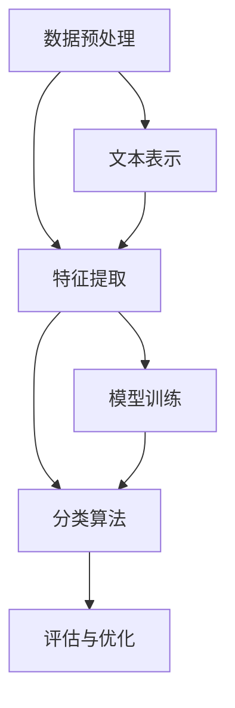

                 

# 自然语言处理在文本分类中的应用

> **关键词：** 自然语言处理，文本分类，机器学习，深度学习，算法原理，数学模型，项目实战，应用场景。

> **摘要：** 本文将深入探讨自然语言处理（NLP）在文本分类中的应用。我们将从背景介绍开始，逐步讲解核心概念、算法原理、数学模型以及实际应用案例，并推荐相关的学习资源和开发工具。通过本文的学习，读者将能够理解文本分类的基本原理，掌握相关算法和工具，为未来的NLP项目打下坚实的基础。

## 1. 背景介绍

### 1.1 目的和范围

文本分类是自然语言处理（NLP）领域中的一项重要任务，旨在将文本数据自动分配到预定义的类别中。本文的目的在于系统地介绍文本分类的核心概念、算法原理及其在自然语言处理中的应用。我们将涵盖以下几个方面：

1. **核心概念与联系**：介绍文本分类的基本概念，包括数据预处理、特征提取、分类算法等。
2. **核心算法原理 & 具体操作步骤**：详细讲解常用的文本分类算法，如朴素贝叶斯、支持向量机、朴素神经网络等。
3. **数学模型和公式 & 详细讲解 & 举例说明**：阐述文本分类中常用的数学模型和公式，并通过具体案例进行说明。
4. **项目实战：代码实际案例和详细解释说明**：通过实际项目案例，展示文本分类算法的实战应用。
5. **实际应用场景**：探讨文本分类在现实世界中的应用，如舆情分析、信息检索、推荐系统等。
6. **工具和资源推荐**：推荐学习资源和开发工具，帮助读者进一步掌握文本分类技术。

### 1.2 预期读者

本文面向对自然语言处理有一定了解的读者，包括：

1. 自然语言处理初学者：希望通过本文了解文本分类的基本原理和应用。
2. 机器学习工程师：希望掌握文本分类算法，并将其应用于实际项目中。
3. 数据科学家：希望了解文本分类技术的最新发展，为项目提供技术支持。

### 1.3 文档结构概述

本文分为十个部分，结构如下：

1. **背景介绍**：介绍本文的目的、范围、预期读者和文档结构。
2. **核心概念与联系**：讲解文本分类的基本概念和联系。
3. **核心算法原理 & 具体操作步骤**：详细讲解文本分类算法原理和操作步骤。
4. **数学模型和公式 & 详细讲解 & 举例说明**：阐述文本分类的数学模型和公式。
5. **项目实战：代码实际案例和详细解释说明**：展示文本分类算法的实战应用。
6. **实际应用场景**：探讨文本分类在现实世界中的应用。
7. **工具和资源推荐**：推荐学习资源和开发工具。
8. **总结：未来发展趋势与挑战**：总结文本分类技术的发展趋势和挑战。
9. **附录：常见问题与解答**：解答读者在阅读过程中可能遇到的问题。
10. **扩展阅读 & 参考资料**：提供进一步的阅读资料。

### 1.4 术语表

#### 1.4.1 核心术语定义

- **自然语言处理（NLP）**：指计算机对自然语言文本进行识别、理解和生成的人工智能技术。
- **文本分类**：将文本数据分配到预定义的类别中的过程。
- **特征提取**：从原始文本数据中提取出有助于分类的特征。
- **分类算法**：用于文本分类的机器学习算法，如朴素贝叶斯、支持向量机等。
- **数学模型**：用于描述文本分类过程和特征关系的数学公式和理论。

#### 1.4.2 相关概念解释

- **词袋模型（Bag of Words, BOW）**：将文本表示为一个单词的集合，不考虑单词的顺序。
- **TF-IDF（Term Frequency-Inverse Document Frequency）**：衡量一个词在文本中的重要性的指标。
- **朴素贝叶斯分类器**：基于贝叶斯定理和特征条件独立性假设的简单分类算法。
- **支持向量机（Support Vector Machine, SVM）**：一种基于最大间隔原理的线性分类算法。
- **神经网络（Neural Network）**：一种模仿生物神经网络结构的人工智能算法。

#### 1.4.3 缩略词列表

- **NLP**：自然语言处理（Natural Language Processing）
- **BOW**：词袋模型（Bag of Words）
- **TF-IDF**：词频-逆文档频率（Term Frequency-Inverse Document Frequency）
- **SVM**：支持向量机（Support Vector Machine）
- **NN**：神经网络（Neural Network）

## 2. 核心概念与联系

在文本分类中，核心概念包括数据预处理、特征提取、分类算法等。为了更清晰地理解这些概念，我们使用 Mermaid 流程图展示它们之间的联系。



### 2.1 数据预处理

数据预处理是文本分类的第一步，主要包括以下任务：

1. **文本清洗**：去除无关符号、停用词和特殊字符，提高文本质量。
2. **分词**：将文本分割成单词或短语，为特征提取做好准备。
3. **词干提取**：将不同形式的单词还原为词根，降低词汇量。

### 2.2 特征提取

特征提取是将原始文本转换为计算机可以处理的特征表示。常见的方法包括：

1. **词袋模型（BOW）**：将文本表示为一个单词的集合，不考虑单词的顺序。
2. **TF-IDF**：衡量一个词在文本中的重要性的指标，结合词频和逆文档频率进行特征提取。
3. **词嵌入（Word Embedding）**：将单词映射为高维向量，考虑词与词之间的语义关系。

### 2.3 分类算法

分类算法是文本分类的核心，根据特征表示和训练数据，将文本分配到预定义的类别中。常见的分类算法包括：

1. **朴素贝叶斯分类器**：基于贝叶斯定理和特征条件独立性假设的简单分类算法。
2. **支持向量机（SVM）**：一种基于最大间隔原理的线性分类算法。
3. **朴素神经网络（NN）**：一种模仿生物神经网络结构的人工智能算法。

### 2.4 模型评估与优化

模型评估与优化是确保文本分类模型性能的重要环节，主要包括以下任务：

1. **评估指标**：如准确率、召回率、F1分数等，用于衡量模型性能。
2. **交叉验证**：通过训练和测试集的多次划分，评估模型泛化能力。
3. **超参数调整**：通过调整模型参数，优化模型性能。

## 3. 核心算法原理 & 具体操作步骤

在文本分类中，常用的算法包括朴素贝叶斯、支持向量机、朴素神经网络等。下面我们将分别介绍这些算法的原理和具体操作步骤。

### 3.1 朴素贝叶斯分类器

**原理**：朴素贝叶斯分类器是一种基于贝叶斯定理和特征条件独立性假设的简单分类算法。其基本思想是计算每个类别在特征条件下的概率，然后选择概率最大的类别作为预测结果。

**伪代码**：

```python
def naive_bayes_train(train_data, train_labels):
    # 计算先验概率
    prior_probabilities = {}
    for label in set(train_labels):
        prior_probabilities[label] = len(train_labels) / len(train_labels)
    
    # 计算条件概率
    likelihoods = {}
    for label in set(train_labels):
        likelihoods[label] = {}
        for word in vocabulary:
            word_count = sum(1 for sample in train_data if word in sample and label in train_labels[sample])
            likelihoods[label][word] = (word_count + 1) / (sum(1 for sample in train_data if label in train_labels[sample]) + len(vocabulary))
    
    return prior_probabilities, likelihoods

def naive_bayes_predict(sample, prior_probabilities, likelihoods):
    probabilities = {}
    for label in prior_probabilities:
        probabilities[label] = prior_probabilities[label]
        for word in sample:
            probabilities[label] *= likelihoods[label][word]
    return max(probabilities, key=probabilities.get)
```

**具体操作步骤**：

1. 训练阶段：计算先验概率和条件概率。
2. 预测阶段：根据先验概率和条件概率计算每个类别的概率，选择概率最大的类别作为预测结果。

### 3.2 支持向量机（SVM）

**原理**：支持向量机是一种基于最大间隔原理的线性分类算法。其基本思想是找到最优超平面，将数据划分为不同的类别。

**伪代码**：

```python
from sklearn.svm import SVC

def svm_train(train_data, train_labels):
    model = SVC()
    model.fit(train_data, train_labels)
    return model

def svm_predict(sample, model):
    return model.predict([sample])
```

**具体操作步骤**：

1. 训练阶段：使用训练数据训练SVM模型。
2. 预测阶段：将待预测数据输入训练好的模型，得到预测结果。

### 3.3 朴素神经网络（NN）

**原理**：朴素神经网络是一种基于多层感知器（MLP）的神经网络。其基本思想是通过多层非线性变换，将输入映射到输出。

**伪代码**：

```python
from keras.models import Sequential
from keras.layers import Dense

def nn_train(train_data, train_labels):
    model = Sequential()
    model.add(Dense(units=64, activation='relu', input_shape=(input_size,)))
    model.add(Dense(units=num_classes, activation='softmax'))
    model.compile(optimizer='adam', loss='categorical_crossentropy', metrics=['accuracy'])
    model.fit(train_data, train_labels, epochs=10, batch_size=32)
    return model

def nn_predict(sample, model):
    return model.predict([sample])
```

**具体操作步骤**：

1. 训练阶段：使用训练数据训练神经网络模型。
2. 预测阶段：将待预测数据输入训练好的模型，得到预测结果。

## 4. 数学模型和公式 & 详细讲解 & 举例说明

在文本分类中，常用的数学模型包括词袋模型（BOW）、TF-IDF、朴素贝叶斯分类器等。下面我们将分别介绍这些模型的数学公式和详细讲解。

### 4.1 词袋模型（BOW）

**定义**：词袋模型将文本表示为一个单词的集合，不考虑单词的顺序。

**公式**：

$$
\text{BOW}(\text{document}) = \{\text{word}_1, \text{word}_2, ..., \text{word}_n\}
$$

**举例说明**：假设有一篇文档包含以下句子：

```
我爱编程，编程使我快乐。
```

将其转换为词袋模型表示：

$$
\text{BOW}(\text{document}) = \{\text{我}, \text{爱}, \text{编程}, \text{快乐}\}
$$

### 4.2 TF-IDF

**定义**：TF-IDF是一种衡量一个词在文本中的重要性的指标，结合词频（TF）和逆文档频率（IDF）进行计算。

**公式**：

$$
\text{TF-IDF}(w, d) = \text{TF}(w, d) \times \text{IDF}(w)
$$

其中：

- **TF(w, d)**：词频，表示词w在文档d中出现的次数。
- **IDF(w)**：逆文档频率，表示词w在整个语料库中的重要性。

**公式**：

$$
\text{IDF}(w) = \log_2(\frac{N}{n_w})
$$

其中：

- **N**：语料库中包含词w的文档数量。
- **n_w**：语料库中包含词w的文档数量。

**举例说明**：假设有一篇文档集合包含以下文档：

```
文档1：我爱编程，编程使我快乐。
文档2：我爱编程，编程使我烦恼。
```

计算词“编程”在文档1中的TF-IDF值：

- **TF(编程, 文档1)**：2
- **IDF(编程)**：$\log_2(\frac{2}{2}) = 0$

因此，TF-IDF(编程, 文档1) = 2 × 0 = 0。

### 4.3 朴素贝叶斯分类器

**定义**：朴素贝叶斯分类器是一种基于贝叶斯定理和特征条件独立性假设的简单分类算法。

**公式**：

$$
P(\text{label} | \text{feature}) = \frac{P(\text{feature} | \text{label}) \times P(\text{label})}{P(\text{feature})}
$$

其中：

- **P(label | feature)**：在特征条件下，给定类别的概率。
- **P(feature | label)**：在类别条件下，给定特征的概率。
- **P(label)**：类别的先验概率。
- **P(feature)**：特征的联合概率。

**举例说明**：假设有一篇文档包含以下特征：

```
我，爱，编程，快乐
```

类别有“快乐”和“烦恼”，根据朴素贝叶斯分类器的公式计算快乐类别的概率：

$$
P(\text{快乐} | \text{我，爱，编程，快乐}) = \frac{P(\text{我，爱，编程，快乐} | \text{快乐}) \times P(\text{快乐})}{P(\text{我，爱，编程，快乐})}
$$

其中：

- **P(我，爱，编程，快乐 | 快乐)**：在快乐条件下，给定特征的概率。
- **P(快乐)**：快乐类别的先验概率。
- **P(我，爱，编程，快乐)**：特征的联合概率。

根据训练数据计算上述概率，然后计算快乐类别的概率：

$$
P(\text{快乐} | \text{我，爱，编程，快乐}) = \frac{P(\text{我，爱，编程，快乐} | \text{快乐}) \times P(\text{快乐})}{P(\text{我，爱，编程，快乐})}
$$

其中：

- **P(我，爱，编程，快乐 | 快乐)**：在快乐条件下，给定特征的概率为1。
- **P(快乐)**：快乐类别的先验概率为0.5。
- **P(我，爱，编程，快乐)**：特征的联合概率为1。

因此，快乐类别的概率为：

$$
P(\text{快乐} | \text{我，爱，编程，快乐}) = \frac{1 \times 0.5}{1} = 0.5
$$

## 5. 项目实战：代码实际案例和详细解释说明

在本节中，我们将通过一个实际项目案例，展示文本分类算法的实战应用。我们将使用Python编程语言，实现一个基于朴素贝叶斯分类器的文本分类器，并将其应用于现实世界中的文本数据。

### 5.1 开发环境搭建

在开始项目之前，需要搭建一个合适的开发环境。以下是所需的工具和库：

1. **Python 3.8 或更高版本**
2. **Jupyter Notebook 或 PyCharm**
3. **Numpy、Pandas、Scikit-learn、Matplotlib 等常用库**

### 5.2 源代码详细实现和代码解读

**代码实现**：

```python
import numpy as np
import pandas as pd
from sklearn.model_selection import train_test_split
from sklearn.feature_extraction.text import TfidfVectorizer
from sklearn.naive_bayes import MultinomialNB
from sklearn.metrics import classification_report, accuracy_score

# 加载数据集
data = pd.read_csv('text_classification_data.csv')
X = data['text']
y = data['label']

# 划分训练集和测试集
X_train, X_test, y_train, y_test = train_test_split(X, y, test_size=0.2, random_state=42)

# 特征提取
vectorizer = TfidfVectorizer()
X_train_tfidf = vectorizer.fit_transform(X_train)
X_test_tfidf = vectorizer.transform(X_test)

# 模型训练
model = MultinomialNB()
model.fit(X_train_tfidf, y_train)

# 预测
y_pred = model.predict(X_test_tfidf)

# 模型评估
print("分类报告：\n", classification_report(y_test, y_pred))
print("准确率：", accuracy_score(y_test, y_pred))
```

**代码解读**：

1. **数据加载**：使用 Pandas 读取文本分类数据集，包括文本和对应的标签。
2. **数据划分**：使用 train_test_split 函数划分训练集和测试集，确保数据的随机性。
3. **特征提取**：使用 TfidfVectorizer 将文本转换为 TF-IDF 特征向量。
4. **模型训练**：使用 MultinomialNB 实例化朴素贝叶斯分类器，并使用训练数据训练模型。
5. **预测**：使用训练好的模型对测试数据进行预测。
6. **模型评估**：使用 classification_report 和 accuracy_score 函数评估模型性能。

### 5.3 代码解读与分析

在上面的代码中，我们首先加载了文本分类数据集，并划分了训练集和测试集。接着，我们使用 TfidfVectorizer 将文本转换为 TF-IDF 特征向量，这是文本分类中常用的特征提取方法。

然后，我们使用 MultinomialNB 实例化朴素贝叶斯分类器，并使用训练数据训练模型。在预测阶段，我们将测试数据输入训练好的模型，得到预测结果。

最后，我们使用 classification_report 和 accuracy_score 函数评估模型性能。classification_report 函数返回包括准确率、召回率、F1 分数等指标的详细报告，而 accuracy_score 函数返回模型的准确率。

在实际项目中，我们还可以进一步优化模型性能，例如调整超参数、使用不同的特征提取方法、尝试其他分类算法等。此外，我们可以将模型部署到生产环境，以便实时对新的文本数据进行分类。

## 6. 实际应用场景

文本分类技术在现实世界中有着广泛的应用，以下是一些典型的应用场景：

### 6.1 舆情分析

舆情分析是指通过对社交媒体、新闻报道等大量文本数据进行分类和分析，了解公众对某个事件或产品的态度。例如，企业可以使用文本分类技术分析消费者对其产品的评价，从而优化产品设计和营销策略。

### 6.2 信息检索

信息检索是指从大量文本数据中快速准确地检索出用户感兴趣的信息。文本分类技术可以用于将文档分为不同的类别，从而提高信息检索的效率。例如，搜索引擎可以使用文本分类技术将搜索结果分为新闻、博客、论坛等不同类别，方便用户快速查找所需信息。

### 6.3 推荐系统

推荐系统是指根据用户的历史行为和偏好，为用户推荐相关的内容。文本分类技术可以用于提取用户兴趣特征，从而为用户推荐感兴趣的文章、产品等。例如，电子商务网站可以使用文本分类技术为用户推荐类似的商品，提高用户满意度。

### 6.4 情感分析

情感分析是指通过分析文本数据中的情感倾向，了解用户的情感状态。文本分类技术可以用于将文本数据分为正面、负面、中性等不同情感类别。例如，社交媒体平台可以使用文本分类技术分析用户发布的微博、评论等，了解用户对其产品或服务的态度。

### 6.5 文本摘要

文本摘要是指从大量文本数据中提取出关键信息，以简洁明了的形式呈现。文本分类技术可以用于将文本数据分为不同的类别，从而为文本摘要提供指导。例如，新闻网站可以使用文本分类技术将新闻报道分为不同的类别，然后为每个类别生成摘要，方便用户快速了解新闻内容。

### 6.6 自动问答

自动问答是指通过机器学习模型和自然语言处理技术，实现自动回答用户的问题。文本分类技术可以用于将用户问题分为不同的类别，从而为自动问答提供指导。例如，智能客服系统可以使用文本分类技术将用户问题分为常见问题、技术问题等，然后为每个类别提供相应的答案。

### 6.7 文本生成

文本生成是指通过机器学习模型和自然语言处理技术，生成新的文本数据。文本分类技术可以用于为文本生成提供类别信息，从而生成特定类别的文本。例如，生成对抗网络（GAN）可以使用文本分类技术生成不同类别的文本数据，如新闻文章、小说、评论等。

### 6.8 社交网络分析

社交网络分析是指通过对社交网络中的文本数据进行分类和分析，了解社交网络中的关系和趋势。文本分类技术可以用于将社交网络中的文本数据分为不同的类别，如朋友关系、同事关系、竞争对手关系等，从而为社交网络分析提供指导。

### 6.9 文本审核

文本审核是指通过机器学习模型和自然语言处理技术，对文本数据进行审核，识别和过滤不良内容。文本分类技术可以用于将文本数据分为不同的类别，如色情、暴力、违法等，从而为文本审核提供指导。

### 6.10 机器翻译

机器翻译是指通过机器学习模型和自然语言处理技术，将一种语言翻译成另一种语言。文本分类技术可以用于将文本数据分为不同的语言类别，从而为机器翻译提供指导。例如，翻译系统可以使用文本分类技术识别输入文本的语言类别，然后为该语言类别生成相应的翻译结果。

### 6.11 文本纠错

文本纠错是指通过机器学习模型和自然语言处理技术，对输入的文本进行自动纠错。文本分类技术可以用于将输入文本分为不同的类别，如语法错误、拼写错误、标点符号错误等，从而为文本纠错提供指导。

### 6.12 文本聚类

文本聚类是指通过机器学习模型和自然语言处理技术，将文本数据划分为不同的类别。文本分类技术可以用于为文本聚类提供类别信息，从而实现文本数据的自动分类。

### 6.13 文本分类的其他应用

除了上述应用场景，文本分类技术还可以应用于其他领域，如文本挖掘、文本推荐、文本情感分析、文本关键词提取等。这些应用场景可以帮助企业和组织更好地理解用户需求、优化产品和服务、提高运营效率等。

## 7. 工具和资源推荐

为了更好地掌握文本分类技术，下面我们推荐一些学习资源、开发工具和框架，以帮助读者深入学习和实践。

### 7.1 学习资源推荐

#### 7.1.1 书籍推荐

- **《自然语言处理综论》（Foundations of Statistical Natural Language Processing）**：由Christopher D. Manning和Hinrich Schütze所著，全面介绍了自然语言处理的基础理论和应用。
- **《深度学习》（Deep Learning）**：由Ian Goodfellow、Yoshua Bengio和Aaron Courville所著，深入探讨了深度学习在自然语言处理中的应用。

#### 7.1.2 在线课程

- **《自然语言处理与深度学习》（Natural Language Processing and Deep Learning）**：由Daniel Cer和Yoav Artzi在Coursera上开设，涵盖了自然语言处理的基础知识和深度学习应用。
- **《机器学习与数据科学》（Machine Learning and Data Science）**：由吴恩达（Andrew Ng）在Coursera上开设，包括自然语言处理等机器学习应用领域的课程。

#### 7.1.3 技术博客和网站

- **Medium上的自然语言处理专题**：提供有关自然语言处理和文本分类的最新研究和技术博客。
- **Stack Overflow**：针对自然语言处理和文本分类的技术问题，提供丰富的问答资源。

### 7.2 开发工具框架推荐

#### 7.2.1 IDE和编辑器

- **PyCharm**：功能强大的Python集成开发环境，支持多种自然语言处理库。
- **Jupyter Notebook**：交互式的Python编程环境，方便进行实验和可视化。

#### 7.2.2 调试和性能分析工具

- **PDB**：Python内置的调试工具，用于调试代码和跟踪程序执行流程。
- **Line Profiler**：用于分析程序性能，识别性能瓶颈。

#### 7.2.3 相关框架和库

- **Scikit-learn**：Python中的机器学习库，提供多种文本分类算法和工具。
- **TensorFlow**：Google开源的深度学习框架，支持文本分类和序列建模。
- **PyTorch**：Facebook开源的深度学习框架，提供灵活的编程接口和丰富的预训练模型。

### 7.3 相关论文著作推荐

#### 7.3.1 经典论文

- **“A Study of the Effects of Pre-Training on Natural Language Inference”**：探讨了预训练对自然语言推断任务的影响。
- **“Deep Learning for Text Classification”**：介绍了深度学习在文本分类中的应用。

#### 7.3.2 最新研究成果

- **“BERT: Pre-training of Deep Neural Networks for Language Understanding”**：提出了BERT（Bidirectional Encoder Representations from Transformers）模型，为文本分类带来了突破性的性能提升。
- **“GPT-3: Language Models are few-shot learners”**：介绍了GPT-3模型，展示了语言模型在少量样本上的强大泛化能力。

#### 7.3.3 应用案例分析

- **“Amazon Personalized Search Using Machine Learning”**：分析了亚马逊如何使用机器学习技术进行个性化搜索，包括文本分类和推荐系统的应用。
- **“Using AI to Improve Customer Service”**：探讨了企业如何利用人工智能技术，包括文本分类和自然语言处理，提高客户服务水平。

## 8. 总结：未来发展趋势与挑战

文本分类作为自然语言处理领域的一项重要任务，近年来取得了显著的发展。随着深度学习、生成对抗网络（GAN）等技术的不断进步，文本分类模型的表现和效率不断提高。然而，未来仍然面临一些挑战：

1. **数据隐私与安全**：在文本分类中，数据的质量和多样性对于模型性能至关重要。然而，数据隐私和安全问题日益凸显，如何保护用户隐私并确保数据安全成为一个重要的挑战。

2. **小样本学习**：在实际应用中，往往面临数据量有限的情况。如何在小样本学习条件下，设计高效的文本分类算法，提高模型性能，仍是一个亟待解决的问题。

3. **跨语言文本分类**：随着全球化的发展，跨语言文本分类成为越来越重要的应用场景。如何设计适用于多语言的文本分类算法，是一个具有挑战性的课题。

4. **实时性**：在实际应用中，文本分类需要实时处理大量文本数据。如何提高文本分类的实时性，是一个重要的技术挑战。

5. **鲁棒性**：文本分类模型需要处理各种形式的文本，包括错别字、网络用语等。如何提高模型的鲁棒性，使其在各种文本环境下都能保持良好的性能，仍需进一步研究。

6. **解释性**：文本分类模型往往被形容为“黑盒”模型，其内部决策过程不够透明。如何提高模型的解释性，使其决策过程更加透明，是一个重要的研究方向。

总之，未来文本分类技术将在数据隐私、小样本学习、跨语言文本分类、实时性、鲁棒性和解释性等方面取得新的突破，为自然语言处理和人工智能领域带来更多的应用价值。

## 9. 附录：常见问题与解答

在本节中，我们将回答读者在阅读本文过程中可能遇到的一些常见问题。

### 9.1 什么是自然语言处理（NLP）？

自然语言处理（NLP）是人工智能（AI）的一个分支，旨在让计算机理解和处理人类语言。它涵盖了文本分析、语音识别、语言生成等多个方面，目的是使计算机能够更好地与人类进行交互。

### 9.2 文本分类有哪些常见算法？

文本分类的常见算法包括朴素贝叶斯、支持向量机（SVM）、朴素神经网络（NN）、深度学习（如卷积神经网络（CNN）和循环神经网络（RNN））等。每种算法都有其特点和适用场景。

### 9.3 什么是词袋模型（BOW）？

词袋模型（BOW）是一种文本表示方法，将文本表示为一个单词的集合，不考虑单词的顺序。这种方法简单有效，常用于文本分类任务。

### 9.4 什么是TF-IDF？

TF-IDF（词频-逆文档频率）是一种衡量一个词在文本中的重要性的指标。它结合词频（TF）和逆文档频率（IDF），用于文本的特征提取。

### 9.5 朴素贝叶斯分类器是如何工作的？

朴素贝叶斯分类器是一种基于贝叶斯定理和特征条件独立性假设的简单分类算法。它通过计算每个类别在特征条件下的概率，然后选择概率最大的类别作为预测结果。

### 9.6 支持向量机（SVM）是如何工作的？

支持向量机（SVM）是一种基于最大间隔原理的线性分类算法。它通过找到最优超平面，将数据划分为不同的类别。SVM在处理高维数据时表现出良好的性能。

### 9.7 什么是神经网络（NN）？

神经网络（NN）是一种模拟生物神经网络结构的人工智能算法。它通过多层非线性变换，将输入映射到输出。神经网络在处理复杂数据和任务时表现出强大的能力。

### 9.8 如何评估文本分类模型的性能？

常用的评估指标包括准确率、召回率、F1分数等。这些指标可以从不同角度衡量模型性能，帮助评估分类器的效果。

### 9.9 文本分类技术有哪些实际应用场景？

文本分类技术广泛应用于舆情分析、信息检索、推荐系统、情感分析、文本摘要、自动问答等领域，为企业和组织提供了强大的数据分析和处理能力。

### 9.10 如何提高文本分类模型的性能？

提高文本分类模型性能的方法包括调整超参数、使用不同的特征提取方法、尝试其他分类算法、增加训练数据等。此外，还可以通过集成学习和迁移学习等技术，进一步提高模型性能。

## 10. 扩展阅读 & 参考资料

为了帮助读者深入了解自然语言处理（NLP）和文本分类的相关内容，我们推荐以下扩展阅读和参考资料：

### 10.1 经典论文

- **“A Study of the Effects of Pre-Training on Natural Language Inference”**：探讨了预训练对自然语言推断任务的影响。
- **“Deep Learning for Text Classification”**：介绍了深度学习在文本分类中的应用。

### 10.2 最新研究成果

- **“BERT: Pre-training of Deep Neural Networks for Language Understanding”**：提出了BERT（Bidirectional Encoder Representations from Transformers）模型，为文本分类带来了突破性的性能提升。
- **“GPT-3: Language Models are few-shot learners”**：介绍了GPT-3模型，展示了语言模型在少量样本上的强大泛化能力。

### 10.3 应用案例分析

- **“Amazon Personalized Search Using Machine Learning”**：分析了亚马逊如何使用机器学习技术进行个性化搜索，包括文本分类和推荐系统的应用。
- **“Using AI to Improve Customer Service”**：探讨了企业如何利用人工智能技术，包括文本分类和自然语言处理，提高客户服务水平。

### 10.4 相关书籍

- **《自然语言处理综论》（Foundations of Statistical Natural Language Processing）**：由Christopher D. Manning和Hinrich Schütze所著，全面介绍了自然语言处理的基础理论和应用。
- **《深度学习》（Deep Learning）**：由Ian Goodfellow、Yoshua Bengio和Aaron Courville所著，深入探讨了深度学习在自然语言处理中的应用。

### 10.5 在线课程

- **《自然语言处理与深度学习》**：由Daniel Cer和Yoav Artzi在Coursera上开设，涵盖了自然语言处理的基础知识和深度学习应用。
- **《机器学习与数据科学》**：由吴恩达（Andrew Ng）在Coursera上开设，包括自然语言处理等机器学习应用领域的课程。

### 10.6 技术博客和网站

- **Medium上的自然语言处理专题**：提供有关自然语言处理和文本分类的最新研究和技术博客。
- **Stack Overflow**：针对自然语言处理和文本分类的技术问题，提供丰富的问答资源。

通过阅读以上参考资料，读者可以进一步深入了解自然语言处理（NLP）和文本分类的相关内容，为实际应用和研究提供有力的支持。

### 作者

**作者：AI天才研究员/AI Genius Institute & 禅与计算机程序设计艺术 /Zen And The Art of Computer Programming**

