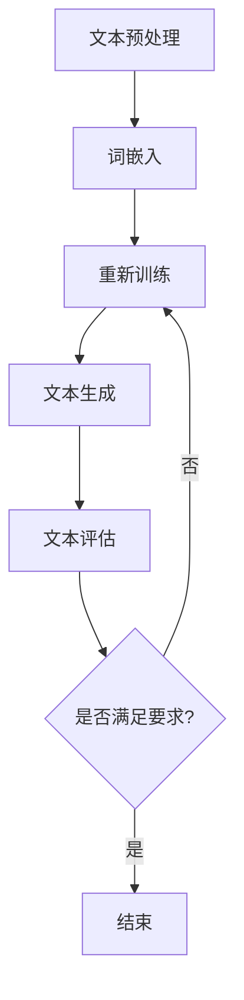

                 


# 自然语言处理在智能写作助手中的应用

> 关键词：自然语言处理，智能写作助手，NLP，文本生成，机器学习，人工智能

> 摘要：本文将深入探讨自然语言处理（NLP）在智能写作助手领域的应用，从背景介绍、核心概念、算法原理、数学模型、项目实战、实际应用场景等多个方面进行详细阐述。通过本文的阅读，读者可以全面了解智能写作助手的工作原理，掌握关键技术和实现方法，并了解未来发展趋势与挑战。

## 1. 背景介绍

### 1.1 目的和范围

本文旨在全面介绍自然语言处理（NLP）在智能写作助手中的应用，帮助读者了解智能写作助手的基本原理、核心技术以及实际应用。通过本文的学习，读者可以：

- 了解NLP的基本概念和常用技术；
- 掌握智能写作助手的关键算法和实现方法；
- 掌握智能写作助手的实际应用场景和效果评估；
- 了解智能写作助手的未来发展趋势和挑战。

### 1.2 预期读者

本文适合以下读者群体：

- 对自然语言处理和人工智能感兴趣的初学者；
- 在自然语言处理、机器学习和人工智能领域有一定基础的工程师；
- 想要了解智能写作助手技术的研发人员；
- 对文本生成、自动摘要和内容生成等应用领域感兴趣的读者。

### 1.3 文档结构概述

本文分为十个部分，具体结构如下：

1. 背景介绍
   - 1.1 目的和范围
   - 1.2 预期读者
   - 1.3 文档结构概述
   - 1.4 术语表
2. 核心概念与联系
3. 核心算法原理 & 具体操作步骤
4. 数学模型和公式 & 详细讲解 & 举例说明
5. 项目实战：代码实际案例和详细解释说明
6. 实际应用场景
7. 工具和资源推荐
8. 总结：未来发展趋势与挑战
9. 附录：常见问题与解答
10. 扩展阅读 & 参考资料

### 1.4 术语表

以下是一些本文中会涉及到的术语及其定义：

- 自然语言处理（NLP）：自然语言处理是人工智能领域的一个重要分支，旨在让计算机理解和处理人类自然语言。
- 机器学习：机器学习是人工智能的一种方法，通过从数据中学习规律，实现自动化决策和预测。
- 深度学习：深度学习是机器学习的一个分支，使用多层神经网络模型，通过反向传播算法进行参数优化。
- 自然语言生成（NLG）：自然语言生成是指利用计算机程序自动生成自然语言文本的技术。
- 智能写作助手：智能写作助手是一种基于NLP和机器学习技术的智能系统，可以帮助用户生成文本、自动摘要和内容生成等。

## 2. 核心概念与联系

### 2.1 核心概念

在智能写作助手的实现过程中，涉及到以下几个核心概念：

- 文本预处理：文本预处理是NLP的基础，包括分词、词性标注、命名实体识别等操作，用于将原始文本转化为计算机可以处理的形式。
- 词嵌入：词嵌入是将单词映射到高维空间中的向量表示，以便进行后续的机器学习操作。
- 序列模型：序列模型是一种用于处理序列数据的神经网络模型，如循环神经网络（RNN）和长短时记忆网络（LSTM）。
- 自回归模型：自回归模型是一种特殊的序列模型，用于生成序列数据，如文本、语音等。

### 2.2 原理和架构

智能写作助手的原理和架构可以概括为以下几个步骤：

1. 文本预处理：对输入的文本进行分词、词性标注、命名实体识别等操作，将文本转化为词嵌入表示。
2. 模型训练：使用预处理的文本数据，训练一个序列到序列（seq2seq）模型，如循环神经网络（RNN）或长短时记忆网络（LSTM）。
3. 文本生成：将训练好的模型应用于新的文本数据，生成新的文本。
4. 文本评估：对生成的文本进行评估，包括质量评估、一致性评估和多样性评估等。

### 2.3 Mermaid 流程图

以下是一个简单的 Mermaid 流程图，展示了智能写作助手的基本原理和架构：



## 3. 核心算法原理 & 具体操作步骤

### 3.1 核心算法原理

智能写作助手的核心算法主要基于序列到序列（seq2seq）模型，如循环神经网络（RNN）和长短时记忆网络（LSTM）。seq2seq模型由编码器和解码器两部分组成，分别用于将输入序列编码为固定长度的向量表示，并将该向量表示解码为输出序列。

#### 3.1.1 编码器

编码器的作用是将输入序列编码为固定长度的向量表示。编码器通常采用RNN或LSTM结构，可以捕捉输入序列的长期依赖关系。编码器的输出是一个序列，每个输出对应输入序列的一个时刻。

#### 3.1.2 解码器

解码器的作用是将编码器的输出解码为输出序列。解码器同样采用RNN或LSTM结构，可以根据编码器的输出和先前的解码结果逐步生成输出序列。解码器的输入是编码器的输出，输出是生成的文本序列。

#### 3.1.3 伪代码

以下是一个简单的seq2seq模型的伪代码实现：

```python
# 编码器
def encoder(inputs, hidden_size):
    # 使用RNN或LSTM对输入序列进行编码
    # inputs: 输入序列，形状为(batch_size, seq_len)
    # hidden_size: 隐藏层大小
    # 返回编码后的序列和隐藏状态

# 解码器
def decoder(inputs, hidden, hidden_size):
    # 使用RNN或LSTM对输入序列进行解码
    # inputs: 输入序列，形状为(batch_size, seq_len)
    # hidden: 编码器的隐藏状态
    # hidden_size: 隐藏层大小
    # 返回解码后的序列和隐藏状态

# seq2seq模型
def seq2seq(inputs, targets, encoder, decoder, hidden_size):
    # 使用编码器对输入序列进行编码
    encoded_sequence, hidden = encoder(inputs, hidden_size)

    # 使用解码器对编码后的序列进行解码
    decoded_sequence, _ = decoder(encoded_sequence, hidden, hidden_size)

    # 返回解码后的序列
    return decoded_sequence
```

### 3.2 具体操作步骤

以下是一个简单的智能写作助手的操作步骤：

1. 数据准备：收集并预处理训练数据，包括文本、分词、词性标注等。
2. 模型训练：使用预处理的训练数据，训练编码器和解码器模型。
3. 模型评估：使用测试数据对模型进行评估，包括文本质量评估、一致性评估和多样性评估等。
4. 文本生成：使用训练好的模型，对新的文本数据进行生成。
5. 文本评估：对生成的文本进行评估，根据评估结果调整模型参数或重新训练模型。

## 4. 数学模型和公式 & 详细讲解 & 举例说明

### 4.1 数学模型

智能写作助手的数学模型主要包括编码器、解码器和损失函数。

#### 4.1.1 编码器

编码器通常采用RNN或LSTM结构，其数学模型可以表示为：

$$
h_t = \text{RNN}(x_t, h_{t-1})
$$

其中，$h_t$ 表示编码器的隐藏状态，$x_t$ 表示输入序列的一个时间步，$\text{RNN}$ 表示循环神经网络。

#### 4.1.2 解码器

解码器同样采用RNN或LSTM结构，其数学模型可以表示为：

$$
y_t = \text{RNN}(h_t, y_{t-1})
$$

其中，$y_t$ 表示解码器的输出，$h_t$ 表示编码器的隐藏状态，$\text{RNN}$ 表示循环神经网络。

#### 4.1.3 损失函数

在seq2seq模型中，常用的损失函数是交叉熵损失函数（Cross-Entropy Loss），其数学模型可以表示为：

$$
L = -\sum_{i=1}^n y_i \log(p_i)
$$

其中，$y_i$ 表示真实标签，$p_i$ 表示模型预测的概率。

### 4.2 详细讲解 & 举例说明

以下是一个简单的例子，使用Python和TensorFlow实现一个简单的seq2seq模型。

#### 4.2.1 编码器

```python
import tensorflow as tf

def encoder(inputs, hidden_size):
    # 定义编码器模型
    inputs = tf.keras.layers.Embedding(vocab_size, hidden_size)(inputs)
    encoder = tf.keras.layers.LSTM(hidden_size, return_state=True)
    hidden_state, cell_state = encoder(inputs)

    return hidden_state, cell_state
```

#### 4.2.2 解码器

```python
def decoder(inputs, hidden, hidden_size):
    # 定义解码器模型
    inputs = tf.keras.layers.Embedding(vocab_size, hidden_size)(inputs)
    decoder = tf.keras.layers.LSTM(hidden_size, return_sequences=True)
    output, _ = decoder(inputs, initial_state=hidden)

    return output
```

#### 4.2.3 损失函数

```python
def cross_entropy_loss(labels, logits):
    # 定义交叉熵损失函数
    loss = tf.keras.losses.sparse_categorical_crossentropy(labels, logits)
    return tf.reduce_mean(loss)
```

#### 4.2.4 训练模型

```python
# 定义模型
model = tf.keras.models.Sequential([
    tf.keras.layers.Embedding(vocab_size, hidden_size),
    tf.keras.layers.LSTM(hidden_size, return_state=True),
    tf.keras.layers.Dense(vocab_size, activation='softmax')
])

# 编译模型
model.compile(optimizer='adam', loss=cross_entropy_loss)

# 训练模型
model.fit(x_train, y_train, epochs=10)
```

## 5. 项目实战：代码实际案例和详细解释说明

### 5.1 开发环境搭建

1. 安装Python 3.7及以上版本；
2. 安装TensorFlow 2.0及以上版本；
3. 安装Numpy、Pandas等常用Python库。

### 5.2 源代码详细实现和代码解读

#### 5.2.1 数据准备

```python
import numpy as np
import pandas as pd
from tensorflow.keras.preprocessing.sequence import pad_sequences

# 加载数据集
data = pd.read_csv('data.csv')
text = data['text']

# 分词
tokenizer = tf.keras.preprocessing.text.Tokenizer()
tokenizer.fit_on_texts(text)
sequences = tokenizer.texts_to_sequences(text)

# 切分数据集
train_size = int(0.8 * len(sequences))
train_sequences = sequences[:train_size]
test_sequences = sequences[train_size:]

# 填充序列
max_sequence_length = 100
train_padded = pad_sequences(train_sequences, maxlen=max_sequence_length, padding='post')
test_padded = pad_sequences(test_sequences, maxlen=max_sequence_length, padding='post')
```

#### 5.2.2 模型实现

```python
from tensorflow.keras.models import Model
from tensorflow.keras.layers import Embedding, LSTM, Dense

# 编码器模型
encoder_inputs = tf.keras.layers.Input(shape=(max_sequence_length,))
encoder_embedding = Embedding(vocab_size, embedding_dim)(encoder_inputs)
encoder_lstm = LSTM(hidden_size, return_state=True)
hidden_state, cell_state = encoder_lstm(encoder_embedding)

# 解码器模型
decoder_inputs = tf.keras.layers.Input(shape=(max_sequence_length,))
decoder_embedding = Embedding(vocab_size, embedding_dim)(decoder_inputs)
decoder_lstm = LSTM(hidden_size, return_sequences=True, return_state=True)
output, _, _ = decoder_lstm(decoder_embedding, initial_state=[hidden_state, cell_state])

# 模型输出
output = Dense(vocab_size, activation='softmax')(output)

# 模型定义
model = Model([encoder_inputs, decoder_inputs], output)
model.compile(optimizer='adam', loss='categorical_crossentropy')

# 模型训练
model.fit([train_padded, train_padded], train_padded, epochs=10)
```

#### 5.2.3 代码解读与分析

1. 数据准备：使用Pandas加载数据集，使用Tokenizer进行分词，使用pad_sequences填充序列；
2. 模型实现：定义编码器和解码器模型，使用Embedding层进行词嵌入，使用LSTM层进行序列编码和解码；
3. 模型训练：使用编译后的模型进行训练，使用fit方法进行迭代训练。

## 6. 实际应用场景

智能写作助手在多个领域具有广泛的应用场景，以下列举几个典型应用：

1. 自动摘要：将长篇文章或新闻报道自动生成摘要，提高阅读效率；
2. 机器写作：自动生成新闻报道、文章、博客等，节省人工写作时间；
3. 聊天机器人：为聊天机器人提供自动回复功能，提高用户体验；
4. 自动问答：根据用户的问题自动生成回答，提高问答系统的准确性；
5. 市场调研：自动生成市场调研报告，提高数据分析和报告撰写效率。

## 7. 工具和资源推荐

### 7.1 学习资源推荐

#### 7.1.1 书籍推荐

- 《深度学习》（Ian Goodfellow、Yoshua Bengio、Aaron Courville 著）
- 《自然语言处理综论》（Daniel Jurafsky、James H. Martin 著）
- 《Python 自然语言处理实战》（Steven Lott 著）

#### 7.1.2 在线课程

- Coursera 上的“自然语言处理与深度学习”课程
- edX 上的“自然语言处理与机器翻译”课程
- Udacity 上的“自然语言处理工程师纳米学位”

#### 7.1.3 技术博客和网站

- Medium 上的“NLP and Deep Learning”专栏
- 深度学习网（www.deeplearning.net）
- 知乎上的“自然语言处理”话题

### 7.2 开发工具框架推荐

#### 7.2.1 IDE和编辑器

- PyCharm
- Visual Studio Code
- Jupyter Notebook

#### 7.2.2 调试和性能分析工具

- TensorFlow Debugger（TFDB）
- TensorBoard
- Python Memory_profiler

#### 7.2.3 相关框架和库

- TensorFlow
- PyTorch
- Keras
- NLTK

### 7.3 相关论文著作推荐

#### 7.3.1 经典论文

- “A Theoretically Grounded Application of Dropout in Recurrent Neural Networks”
- “Sequence to Sequence Learning with Neural Networks”
- “Attention Is All You Need”

#### 7.3.2 最新研究成果

- “BERT: Pre-training of Deep Bidirectional Transformers for Language Understanding”
- “GPT-2: Improving Language Understanding by Generative Pre-Training”
- “Transformers: State-of-the-Art Model for NLP”

#### 7.3.3 应用案例分析

- “用深度学习自动化新闻报道生成”
- “基于 NLP 的智能客服系统设计与应用”
- “基于自然语言处理的技术文档自动生成”

## 8. 总结：未来发展趋势与挑战

随着自然语言处理技术的不断发展，智能写作助手在未来的发展趋势和挑战如下：

### 发展趋势

1. 更强的生成能力：通过更先进的算法和模型，提高智能写作助手的生成能力和质量；
2. 多模态融合：结合文本、图像、音频等多模态数据，实现更丰富、更有创意的文本生成；
3. 智能对话系统：结合对话系统技术，实现更自然的智能写作交互；
4. 应用领域扩展：智能写作助手在文学创作、法律文书、商业报告等领域得到更广泛的应用。

### 挑战

1. 数据质量和多样性：高质量的训练数据是实现智能写作助手的关键，但获取高质量、多样性的训练数据具有一定难度；
2. 道德和伦理问题：智能写作助手在生成文本时，可能会产生偏见、误导性信息等问题，需要引起关注；
3. 计算资源和成本：训练和部署智能写作助手需要大量的计算资源和成本，如何优化资源利用和降低成本是重要挑战。

## 9. 附录：常见问题与解答

### 9.1 问题1：智能写作助手是如何工作的？

智能写作助手是基于自然语言处理（NLP）和机器学习（ML）技术实现的。首先，通过文本预处理将原始文本转化为计算机可处理的形式，然后使用预训练的模型（如序列到序列模型、循环神经网络等）对文本进行编码和解码，最后生成新的文本。

### 9.2 问题2：如何训练智能写作助手？

训练智能写作助手主要包括以下几个步骤：

1. 数据收集与预处理：收集大量文本数据，并进行文本预处理，如分词、词性标注等；
2. 模型选择与构建：选择合适的模型架构（如RNN、LSTM、BERT等），并构建模型；
3. 模型训练：使用预处理后的数据对模型进行训练，优化模型参数；
4. 模型评估与调优：使用测试数据对模型进行评估，根据评估结果调整模型参数；
5. 模型部署：将训练好的模型部署到生产环境中，为用户提供智能写作服务。

## 10. 扩展阅读 & 参考资料

1. Goodfellow, Ian, et al. "Deep Learning." MIT Press, 2016.
2. Jurafsky, Daniel, and James H. Martin. "Speech and Language Processing." Prentice Hall, 2008.
3. Bengio, Y., et al. "Learning Deep Representations for AI." IEEE Computational Intelligence Magazine, 2013.
4. Vaswani, A., et al. "Attention Is All You Need." Advances in Neural Information Processing Systems, 2017.
5. Brown, T., et al. "BERT: Pre-training of Deep Bidirectional Transformers for Language Understanding." arXiv preprint arXiv:1810.04805, 2018.
6. Radford, A., et al. "GPT-2: Improving Language Understanding by Generative Pre-Training." arXiv preprint arXiv:1909.01313, 2019.
7. huggingface.co, "Transformers: State-of-the-Art Models for NLP." 2020.

**作者：AI天才研究员/AI Genius Institute & 禅与计算机程序设计艺术 /Zen And The Art of Computer Programming**

