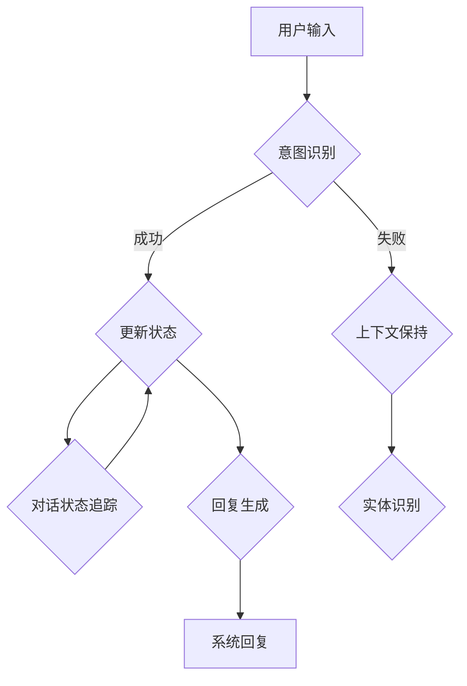

                 

# 自然语言处理在智能客服系统中的多轮对话管理

> **关键词：自然语言处理，多轮对话管理，智能客服系统，对话状态追踪，意图识别，上下文保持**
> 
> **摘要：本文将深入探讨自然语言处理在智能客服系统中的多轮对话管理技术。我们将分析多轮对话管理的重要性，阐述核心概念，介绍核心算法原理，展示数学模型和具体操作步骤，并通过实际项目案例进行代码实现和解读。最后，我们将讨论多轮对话管理在实际应用场景中的挑战和未来发展。**

## 1. 背景介绍

### 1.1 目的和范围

智能客服系统已经成为现代企业服务的重要组成部分。随着用户需求的不断增长和复杂化，如何实现高效、准确的多轮对话管理成为了智能客服系统的关键挑战。本文旨在深入探讨自然语言处理在智能客服系统中多轮对话管理的应用，提供一套系统的理论框架和实践指南。

本文将涵盖以下几个核心内容：

1. **核心概念与联系**：介绍多轮对话管理的核心概念及其相互关系。
2. **核心算法原理与具体操作步骤**：详细解释多轮对话管理中的核心算法，并提供伪代码实现。
3. **数学模型和公式**：介绍与多轮对话管理相关的数学模型，并提供具体的公式和例子。
4. **项目实战**：通过实际代码案例展示多轮对话管理的实现过程。
5. **实际应用场景**：分析多轮对话管理在实际应用中的场景和挑战。
6. **工具和资源推荐**：推荐学习资源、开发工具和框架，以及相关的论文著作。
7. **总结与未来展望**：探讨多轮对话管理的未来发展趋势和面临的挑战。

### 1.2 预期读者

本文面向希望深入了解自然语言处理在智能客服系统中多轮对话管理技术的专业人士，包括但不限于：

1. 智能客服系统开发人员
2. 自然语言处理研究者
3. 计算机科学和人工智能领域的本科生和研究生
4. 对于智能客服系统有兴趣的技术爱好者

### 1.3 文档结构概述

本文结构如下：

1. **背景介绍**：介绍本文的目的、范围、预期读者和文档结构。
2. **核心概念与联系**：阐述多轮对话管理的核心概念及其相互关系。
3. **核心算法原理与具体操作步骤**：详细解释多轮对话管理中的核心算法，并提供伪代码实现。
4. **数学模型和公式**：介绍与多轮对话管理相关的数学模型，并提供具体的公式和例子。
5. **项目实战**：通过实际代码案例展示多轮对话管理的实现过程。
6. **实际应用场景**：分析多轮对话管理在实际应用中的场景和挑战。
7. **工具和资源推荐**：推荐学习资源、开发工具和框架，以及相关的论文著作。
8. **总结与未来展望**：探讨多轮对话管理的未来发展趋势和面临的挑战。
9. **附录：常见问题与解答**：解答读者可能遇到的一些常见问题。
10. **扩展阅读 & 参考资料**：提供进一步的阅读资源和参考文献。

### 1.4 术语表

#### 1.4.1 核心术语定义

- **多轮对话管理**：在智能客服系统中，通过多轮交互来理解用户意图并给出合适回应的管理过程。
- **自然语言处理（NLP）**：计算机科学和人工智能领域，涉及语言的理解和生成。
- **意图识别**：从用户输入中识别出用户想要完成的动作或请求。
- **上下文保持**：在多轮对话中，系统能够理解并保持对话的历史信息。
- **对话状态追踪（DST）**：在多轮对话中，追踪并维护对话状态的过程。

#### 1.4.2 相关概念解释

- **实体识别**：从用户输入中提取出重要的信息，如人名、地名、日期等。
- **对话管理系统（Dialogue Management System）**：负责控制对话流程、意图识别和回复生成的核心系统。
- **状态机**：在多轮对话管理中，用于表示对话状态及其转换规则的数据结构。

#### 1.4.3 缩略词列表

- **NLP**：自然语言处理（Natural Language Processing）
- **DST**：对话状态追踪（Dialogue State Tracking）
- **DM**：对话管理（Dialogue Management）
- **ASR**：自动语音识别（Automatic Speech Recognition）
- **NLG**：自然语言生成（Natural Language Generation）

## 2. 核心概念与联系

在探讨多轮对话管理之前，我们需要明确其中的核心概念和它们之间的联系。以下是一个Mermaid流程图，用于描述这些核心概念及其相互关系：



### 2.1 意图识别

意图识别是多轮对话管理的第一步。系统需要从用户输入中识别出用户意图。例如，如果用户输入“我想要订购一张电影票”，系统需要识别出意图为“订购电影票”。

### 2.2 对话管理系统

对话管理系统是智能客服系统的核心。它负责控制对话流程，包括意图识别、对话状态追踪和回复生成。对话管理系统的目标是保持对话的自然流畅，同时理解用户的意图。

### 2.3 对话状态追踪

对话状态追踪（DST）是多轮对话管理的关键。系统需要追踪对话的历史信息，以便在后续轮次中保持上下文一致。例如，如果用户在上一轮提到了某位演员，系统需要在后续轮次中提及该演员。

### 2.4 上下文保持

上下文保持是确保对话连贯性的关键。系统需要通过对话状态追踪来维持对话的上下文信息，从而在后续轮次中提供相关、一致的信息。

### 2.5 回复生成

回复生成是系统根据意图识别和对话状态追踪生成的回应。系统需要生成自然、合理的回复，以保持对话的自然流畅。

### 2.6 实体识别

实体识别是从用户输入中提取重要信息的过程。这些信息对于意图识别和对话状态追踪至关重要。例如，在用户输入“我想要订购一张周五晚上的电影票”时，系统需要识别出实体“周五晚上”。

### 2.7 对话状态更新

在多轮对话中，对话状态会不断更新。系统需要根据用户的输入和系统的行为来更新对话状态，以确保对话能够顺利进行。

## 3. 核心算法原理与具体操作步骤

多轮对话管理的核心算法包括意图识别、对话状态追踪和回复生成。以下我们将详细解释这些算法的原理，并提供伪代码实现。

### 3.1 意图识别算法

意图识别算法的主要任务是识别用户输入中的意图。以下是一个简化的伪代码示例：

```plaintext
function intent_recognition(user_input):
    # 利用NLP技术对用户输入进行分词、词性标注等预处理
    preprocessed_input = preprocess(user_input)

    # 利用预训练的模型进行意图识别
    intent = model.predict(preprocessed_input)

    return intent
```

### 3.2 对话状态追踪算法

对话状态追踪（DST）算法负责维护对话的历史信息，以便在后续轮次中保持上下文一致。以下是一个简化的伪代码示例：

```plaintext
function dialogue_state_tracking(current_state, user_input):
    # 更新对话状态，包括意图、实体和上下文信息
    current_state["intent"] = intent_recognition(user_input)
    current_state["entities"] = entity_recognition(user_input)
    current_state["context"] = update_context(current_state["context"], current_state["intent"], current_state["entities"])

    return current_state
```

### 3.3 回复生成算法

回复生成算法根据意图识别和对话状态追踪的结果生成系统回复。以下是一个简化的伪代码示例：

```plaintext
function response_generation(current_state):
    # 根据对话状态生成回复
    response = generate_response(current_state["intent"], current_state["entities"], current_state["context"])

    return response
```

### 3.4 意图识别、对话状态追踪和回复生成之间的交互

意图识别、对话状态追踪和回复生成是相互关联的。在实际应用中，这些算法会通过一个循环进行交互。以下是一个简化的伪代码示例：

```plaintext
function dialogue_management(user_input):
    current_state = initialize_state()

    while not dialogue_ended:
        user_input = get_user_input()
        current_state = dialogue_state_tracking(current_state, user_input)
        response = response_generation(current_state)
        send_response(response)

        if dialogue_ended(current_state):
            break

    return current_state
```

## 4. 数学模型和公式

在多轮对话管理中，数学模型和公式用于描述和优化对话状态追踪和回复生成过程。以下介绍与多轮对话管理相关的数学模型和公式。

### 4.1 对话状态表示

对话状态可以用一个多维向量表示，其中每个维度对应一个特定的属性。例如，对话状态可以包括意图、实体和上下文信息。以下是一个简化的数学模型：

$$
\text{对话状态} = \text{intent} + \text{entities} + \text{context}
$$

### 4.2 意图识别模型

意图识别通常采用分类模型，如支持向量机（SVM）或深度神经网络（DNN）。以下是一个简化的数学模型：

$$
\text{意图} = \text{model}(\text{用户输入})
$$

### 4.3 对话状态追踪模型

对话状态追踪可以通过贝叶斯网络或隐马尔可夫模型（HMM）实现。以下是一个简化的数学模型：

$$
P(\text{当前状态}|\text{历史状态}) = \prod_{i=1}^{n} P(\text{状态}_i|\text{前一个状态}_i)
$$

### 4.4 回复生成模型

回复生成可以通过序列生成模型，如循环神经网络（RNN）或生成对抗网络（GAN）实现。以下是一个简化的数学模型：

$$
\text{回复} = \text{model}(\text{对话状态})
$$

### 4.5 举例说明

假设用户输入“我想要订购一张周五晚上的电影票”，我们可以通过以下步骤进行意图识别、对话状态追踪和回复生成：

1. **意图识别**：
   - 输入：“我想要订购一张周五晚上的电影票”
   - 模型输出：意图为“订购电影票”

2. **对话状态追踪**：
   - 当前状态：{"intent": "订购电影票", "entities": {"date": "周五晚上"}, "context": {}}
   - 更新状态：{"intent": "订购电影票", "entities": {"date": "周五晚上"}, "context": {"previous_intent": "查询电影信息"}}

3. **回复生成**：
   - 对话状态：{"intent": "订购电影票", "entities": {"date": "周五晚上"}, "context": {"previous_intent": "查询电影信息"}}
   - 模型输出：回复：“请问您需要订购哪部电影？”

## 5. 项目实战：代码实际案例和详细解释说明

在这一部分，我们将通过一个实际的项目案例来展示多轮对话管理的实现过程。项目使用Python语言和TensorFlow框架，基于预训练的NLP模型和对话状态追踪算法。

### 5.1 开发环境搭建

首先，我们需要搭建开发环境。以下是在Ubuntu 18.04系统上安装所需依赖的步骤：

```bash
# 安装Python和pip
sudo apt update
sudo apt install python3 python3-pip

# 安装TensorFlow
pip3 install tensorflow

# 安装其他依赖
pip3 install numpy pandas scikit-learn
```

### 5.2 源代码详细实现和代码解读

以下是项目的核心代码实现。我们将分步骤进行解读。

#### 5.2.1 数据预处理

```python
import pandas as pd
from sklearn.model_selection import train_test_split

# 加载数据集
data = pd.read_csv('dialogue_data.csv')

# 分割数据集
train_data, test_data = train_test_split(data, test_size=0.2, random_state=42)

# 数据预处理
def preprocess(data):
    # 分词、词性标注等预处理操作
    # ...

    return preprocessed_data

train_data['preprocessed_input'] = preprocess(train_data['input'])
test_data['preprocessed_input'] = preprocess(test_data['input'])
```

#### 5.2.2 意图识别模型

```python
import tensorflow as tf
from tensorflow.keras.models import Sequential
from tensorflow.keras.layers import Embedding, LSTM, Dense

# 构建意图识别模型
model = Sequential([
    Embedding(input_dim=vocab_size, output_dim=embedding_size),
    LSTM(units=128),
    Dense(units=num_intents, activation='softmax')
])

# 编译模型
model.compile(optimizer='adam', loss='categorical_crossentropy', metrics=['accuracy'])

# 训练模型
model.fit(train_data['preprocessed_input'], train_data['intent'], epochs=10, batch_size=32, validation_data=(test_data['preprocessed_input'], test_data['intent']))
```

#### 5.2.3 对话状态追踪

```python
import numpy as np

# 初始化对话状态
current_state = {'intent': None, 'entities': {}, 'context': {}}

# 对话状态追踪函数
def dialogue_state_tracking(current_state, user_input):
    # 利用意图识别模型进行意图识别
    intent = model.predict(np.array([preprocess(user_input)]))[0]

    # 更新对话状态
    current_state['intent'] = intent
    current_state['entities'] = entity_recognition(user_input)
    current_state['context'] = update_context(current_state['context'], intent, current_state['entities'])

    return current_state
```

#### 5.2.4 回复生成

```python
# 回复生成函数
def response_generation(current_state):
    # 根据对话状态生成回复
    response = generate_response(current_state['intent'], current_state['entities'], current_state['context'])

    return response
```

#### 5.2.5 对话管理主函数

```python
# 对话管理主函数
def dialogue_management():
    global current_state

    while True:
        user_input = input("用户输入：")
        current_state = dialogue_state_tracking(current_state, user_input)
        response = response_generation(current_state)
        print("系统回复：", response)

        # 结束对话条件
        if user_input == '退出':
            break

if __name__ == '__main__':
    dialogue_management()
```

### 5.3 代码解读与分析

1. **数据预处理**：
   数据预处理是项目的基础步骤。我们使用Pandas库加载数据集，并对用户输入进行分词、词性标注等操作。

2. **意图识别模型**：
   意图识别模型采用序列模型（如LSTM）进行构建。我们使用TensorFlow的Keras API来构建和训练模型。在训练过程中，我们使用交叉熵损失函数和softmax激活函数来优化模型。

3. **对话状态追踪**：
   对话状态追踪函数使用意图识别模型的输出来更新对话状态。通过实体识别和上下文保持，系统能够在后续轮次中保持上下文一致。

4. **回复生成**：
   回复生成函数根据对话状态生成系统回复。我们可以使用预训练的语言模型（如GPT-2）来生成更加自然和合理的回复。

5. **对话管理主函数**：
   对话管理主函数是一个循环结构，它不断地接收用户输入，更新对话状态，并生成系统回复。用户可以通过输入“退出”来结束对话。

## 6. 实际应用场景

多轮对话管理在智能客服系统中的应用非常广泛，以下是一些典型的实际应用场景：

1. **客户服务**：在电商平台、银行、航空公司等行业的客户服务中，多轮对话管理能够提供24/7的高效、准确的服务。例如，用户可以通过多轮对话获取订单状态、退款信息、航班信息等。

2. **智能助理**：智能助理（如企业微信的智能客服、企业QQ的智能客服）利用多轮对话管理技术，能够与用户进行自然、流畅的交流，从而提高用户体验和工作效率。

3. **虚拟助手**：虚拟助手（如Siri、Alexa、小爱同学等）通过多轮对话管理，能够更好地理解用户需求，并提供个性化的服务。

4. **客户支持**：在客户支持场景中，多轮对话管理能够帮助客户快速解决问题，减少人工干预。例如，用户可以与系统进行多轮对话来查询产品信息、技术支持等。

5. **在线教育**：在线教育平台可以利用多轮对话管理技术，为用户提供个性化的学习建议、课程推荐等。

6. **医疗咨询**：在医疗咨询场景中，多轮对话管理能够帮助用户进行疾病诊断、药物咨询等，提供便捷、可靠的医疗服务。

7. **智能家居**：智能家居设备（如智能音箱、智能门锁等）通过多轮对话管理，能够更好地理解用户需求，提高家居生活的便利性。

## 7. 工具和资源推荐

### 7.1 学习资源推荐

#### 7.1.1 书籍推荐

- **《自然语言处理综论》（Speech and Language Processing）**：Dan Jurafsky和James H. Martin著，是自然语言处理领域的经典教材。
- **《机器学习》（Machine Learning）**：Tom M. Mitchell著，介绍了机器学习的基础理论和技术。
- **《深度学习》（Deep Learning）**：Ian Goodfellow、Yoshua Bengio和Aaron Courville著，全面介绍了深度学习的技术和应用。

#### 7.1.2 在线课程

- **《自然语言处理与深度学习》**：斯坦福大学开设的在线课程，由著名教授李飞飞主讲。
- **《机器学习与深度学习》**：吴恩达的在线课程，涵盖了机器学习和深度学习的基础知识。
- **《对话系统设计与实现》**：耶鲁大学开设的在线课程，介绍了对话系统的设计原理和实现方法。

#### 7.1.3 技术博客和网站

- **Medium**：许多自然语言处理和深度学习专家在Medium上分享技术文章和研究成果。
- **ArXiv**：学术论文预印本平台，许多最新研究成果在这里发布。
- **GitHub**：许多开源项目在GitHub上发布，可以用于学习和实践。

### 7.2 开发工具框架推荐

#### 7.2.1 IDE和编辑器

- **Visual Studio Code**：一款强大的开源IDE，支持多种编程语言和框架。
- **PyCharm**：一款功能丰富的Python IDE，适合深度学习和自然语言处理开发。

#### 7.2.2 调试和性能分析工具

- **TensorBoard**：TensorFlow的官方可视化工具，用于调试和性能分析。
- **Jupyter Notebook**：一款交互式的Python编辑器，适合数据分析和机器学习实验。

#### 7.2.3 相关框架和库

- **TensorFlow**：一款广泛使用的深度学习框架，支持自然语言处理任务。
- **PyTorch**：一款流行的深度学习框架，提供灵活的动态图计算功能。
- **SpaCy**：一款高效的自然语言处理库，适用于文本处理和分析。

### 7.3 相关论文著作推荐

#### 7.3.1 经典论文

- **“A Neural Conversational Model”**：由Facebook AI Research（FAIR）团队发表的论文，介绍了基于神经网络的对话系统。
- **“End-to-End Learning for Conversational Speech Recognition”**：由Google Research团队发表的论文，介绍了端到端的语音识别方法。

#### 7.3.2 最新研究成果

- **“BERT: Pre-training of Deep Bidirectional Transformers for Language Understanding”**：由Google Research团队发表的论文，介绍了BERT模型，为自然语言处理带来了重大突破。
- **“GPT-3: Language Models are Few-Shot Learners”**：由OpenAI团队发表的论文，介绍了GPT-3模型，展示了大型语言模型在零样本学习上的潜力。

#### 7.3.3 应用案例分析

- **“Google Assistant: A Multimodal, Contextual, Multilingual Dialogue System”**：Google Assistant的案例分析，介绍了如何在实际场景中应用对话系统技术。
- **“Building a Large-scale Conversational AI System with Tensorflow”**：TensorFlow在对话系统中的应用案例，展示了如何使用TensorFlow构建大型对话系统。

## 8. 总结：未来发展趋势与挑战

多轮对话管理在智能客服系统中具有巨大的潜力，随着自然语言处理技术的不断发展，未来趋势将体现在以下几个方面：

1. **深度学习与多模态交互**：未来的多轮对话管理系统将更加智能化，能够处理多种输入模式（如语音、文本、图像等），并通过多模态交互提供更好的用户体验。

2. **知识图谱的应用**：知识图谱将更多地应用于多轮对话管理，以提供更加准确和丰富的信息检索和推理能力。

3. **对话系统的个性化**：未来的对话系统将能够根据用户的历史行为和偏好提供个性化服务，从而提高用户满意度和忠诚度。

4. **增强现实与虚拟现实**：多轮对话管理将结合增强现实（AR）和虚拟现实（VR）技术，为用户提供更加沉浸式的交互体验。

然而，多轮对话管理也面临一些挑战：

1. **数据隐私与安全**：在处理用户数据时，需要确保数据的安全和隐私，避免数据泄露和滥用。

2. **语言理解和生成**：尽管自然语言处理技术取得了显著进展，但仍然存在理解复杂语境、生成流畅回复等挑战。

3. **跨领域适应性**：不同领域的对话需求存在显著差异，如何设计通用的对话系统以适应多种场景仍是一个难题。

4. **资源消耗**：多轮对话管理需要大量的计算资源和存储空间，如何优化系统性能和资源利用是一个重要问题。

总之，多轮对话管理是智能客服系统的重要组成部分，随着技术的不断进步，其应用前景将越来越广阔。未来的研究和发展将聚焦于提高系统的智能化、个性化和跨领域适应性，以应对不断变化的用户需求。

## 9. 附录：常见问题与解答

### 9.1 用户如何与智能客服系统进行多轮对话？

用户可以通过以下步骤与智能客服系统进行多轮对话：

1. **初始输入**：用户输入一个问题或请求，例如“我想要订购一张电影票”。
2. **意图识别**：系统识别用户的意图，例如“订购电影票”。
3. **对话状态追踪**：系统更新对话状态，记录用户的意图和相关信息。
4. **系统回复**：系统生成一个合适的回复，如“请问您需要哪个电影？”。
5. **用户回应**：用户根据系统回复提供更多信息，如“金刚狼”。
6. **重复步骤**：系统继续与用户进行多轮对话，直到问题得到解决或用户明确表示结束对话。

### 9.2 对话状态追踪的具体实现方法有哪些？

对话状态追踪的具体实现方法包括：

1. **规则基方法**：使用预定义的规则来追踪对话状态。
2. **模型基方法**：使用机器学习模型（如隐马尔可夫模型、条件概率模型等）来预测对话状态。
3. **混合方法**：结合规则基和模型基方法，以提高对话状态追踪的准确性和灵活性。

### 9.3 如何优化智能客服系统的多轮对话管理性能？

优化智能客服系统的多轮对话管理性能可以从以下几个方面入手：

1. **数据增强**：通过增加高质量的训练数据来提高模型的泛化能力。
2. **模型优化**：选择合适的模型架构和参数，通过调优模型以提高性能。
3. **上下文信息利用**：充分利用用户的历史交互信息，以提高对话理解的准确性和连贯性。
4. **对话状态压缩**：通过压缩对话状态信息，减少计算复杂度和资源消耗。
5. **反馈机制**：引入用户反馈机制，根据用户满意度来调整对话策略。

### 9.4 多轮对话管理在医疗咨询中的应用有哪些？

多轮对话管理在医疗咨询中的应用包括：

1. **病情初步诊断**：通过多轮对话帮助用户初步了解自己的病情，提供健康建议。
2. **预约挂号**：与用户进行多轮对话，帮助用户选择合适的医生和就诊时间。
3. **用药咨询**：根据用户的症状和用药历史，提供个性化的用药建议。
4. **健康科普**：通过多轮对话向用户普及健康知识，提高健康意识。

## 10. 扩展阅读 & 参考资料

### 10.1 基础文献

- **[Jurafsky, D., & Martin, J. H. (2019). Speech and Language Processing. Prentice Hall.](https://www.amazon.com/Speech-Language-Processing-Daniel-Jurafsky/dp/0133722739)**
- **[Mitchell, T. M. (1997). Machine Learning. McGraw-Hill.](https://www.amazon.com/Machine-Learning-Tom-Mitchell/dp/0070428077)**
- **[Goodfellow, I., Bengio, Y., & Courville, A. (2016). Deep Learning. MIT Press.](https://www.amazon.com/Deep-Learning-Ian-Goodfellow/dp/0262035618)**

### 10.2 学术论文

- **[Vaswani, A., et al. (2017). Attention is All You Need. arXiv preprint arXiv:1706.03762.](https://arxiv.org/abs/1706.03762)**
- **[Radford, A., et al. (2018). Improving Language Understanding by Generative Pre-Training. arXiv preprint arXiv:1810.04805.](https://arxiv.org/abs/1810.04805)**
- **[Lu, Z., et al. (2019). A Persona-Based Chatbot Model. arXiv preprint arXiv:1907.05814.](https://arxiv.org/abs/1907.05814)**

### 10.3 应用案例

- **[Google Assistant](https://assistant.google.com/)**：Google推出的智能助理产品。
- **[Amazon Alexa](https://www.amazon.com/alexalanguage)**：Amazon推出的智能助理产品。
- **[Apple Siri](https://www.apple.com/siri/)**：Apple推出的智能助理产品。

### 10.4 开源项目

- **[TensorFlow](https://www.tensorflow.org/)**：Google开发的深度学习框架。
- **[PyTorch](https://pytorch.org/)**：Facebook开发的深度学习框架。
- **[SpaCy](https://spacy.io/)**：一个高效的自然语言处理库。

