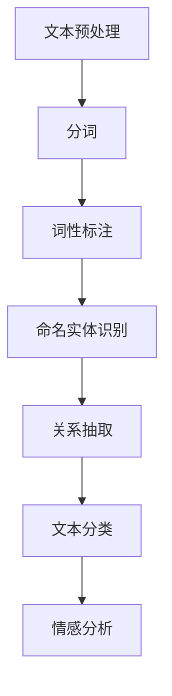

                 


# 自然语言处理在法律文本分析中的应用

> 关键词：自然语言处理、法律文本分析、文本挖掘、信息提取、语义理解、法律智能、人工智能、机器学习

> 摘要：随着法律文本规模的不断扩大，传统的人工法律文本分析面临巨大的挑战。自然语言处理（NLP）技术的发展为法律文本分析提供了新的途径。本文将详细介绍自然语言处理在法律文本分析中的应用，包括文本预处理、实体识别、关系抽取、文本分类、情感分析等关键步骤，并通过实际项目案例和详细解释，探讨其在法律领域的应用潜力与挑战。

## 1. 背景介绍

### 1.1 目的和范围

本文旨在探讨自然语言处理技术在法律文本分析中的应用，通过对法律文本的预处理、实体识别、关系抽取、文本分类、情感分析等关键步骤的详细解析，展示NLP在法律文本分析中的实际应用价值。

### 1.2 预期读者

本文适合以下读者群体：

- 对自然语言处理技术感兴趣的技术爱好者
- 法律专业人士，如律师、法官、法务人员等
- 计算机科学和人工智能领域的研究生和研究人员
- 对法律文本分析有实际需求的企事业单位和管理人员

### 1.3 文档结构概述

本文结构如下：

- 引言：介绍自然语言处理在法律文本分析中的应用背景和重要性
- 背景知识：简要介绍自然语言处理的基本概念和相关技术
- 文本预处理：讲解法律文本的预处理过程，包括分词、词性标注、命名实体识别等
- 实体识别：介绍法律文本中的实体识别方法，包括人名、地名、机构名等
- 关系抽取：讲解法律文本中的关系抽取方法，包括因果关系、法律关系等
- 文本分类：介绍法律文本的分类方法，包括案件分类、判决结果预测等
- 情感分析：讲解法律文本的情感分析方法，包括案件判决的情感分析等
- 项目实战：通过实际项目案例，展示自然语言处理在法律文本分析中的应用
- 实际应用场景：探讨自然语言处理在法律领域的实际应用场景和案例
- 工具和资源推荐：推荐相关的学习资源、开发工具和框架
- 总结：总结自然语言处理在法律文本分析中的应用现状、挑战和未来趋势
- 附录：提供常见问题与解答，以及扩展阅读和参考资料

### 1.4 术语表

#### 1.4.1 核心术语定义

- 自然语言处理（NLP）：一种利用计算机技术和算法对自然语言进行处理和分析的技术。
- 法律文本：涉及法律条款、判决书、合同、法律意见等文本资料。
- 实体识别：从文本中识别出具有特定意义的实体，如人名、地名、机构名等。
- 关系抽取：从文本中抽取实体之间的关系，如因果关系、法律关系等。
- 文本分类：将文本按照特定类别进行分类，如案件分类、判决结果预测等。
- 情感分析：分析文本中的情感倾向，如案件判决的情感分析等。

#### 1.4.2 相关概念解释

- 分词：将连续的文本序列划分为一组词序列的过程。
- 词性标注：对文本中的每个词进行词性分类，如名词、动词、形容词等。
- 命名实体识别：识别文本中具有特定意义的实体，如人名、地名、机构名等。

#### 1.4.3 缩略词列表

- NLP：自然语言处理
- RNN：递归神经网络
- LSTM：长短期记忆网络
- CRF：条件随机场
- BERT：双向编码表示模型
- GPT：生成预训练模型

## 2. 核心概念与联系

在法律文本分析中，自然语言处理技术扮演着至关重要的角色。为了更好地理解其在法律文本分析中的应用，我们需要首先了解一些核心概念和联系。

下面是一个简单的 Mermaid 流程图，展示了法律文本分析的基本步骤和关键概念：



### 2.1 文本预处理

文本预处理是法律文本分析的基础步骤，主要包括分词、词性标注和命名实体识别。通过对文本进行预处理，可以提取出关键信息，为后续分析提供数据支持。

### 2.2 命名实体识别

命名实体识别是从法律文本中识别出具有特定意义的实体，如人名、地名、机构名等。这对于理解法律文本的含义和上下文具有重要意义。

### 2.3 关系抽取

关系抽取是从法律文本中抽取实体之间的关系，如因果关系、法律关系等。关系抽取有助于建立法律文本的知识图谱，为法律分析和决策提供支持。

### 2.4 文本分类

文本分类是将法律文本按照特定类别进行分类，如案件分类、判决结果预测等。文本分类有助于对大量法律文本进行快速筛选和分析。

### 2.5 情感分析

情感分析是分析法律文本中的情感倾向，如案件判决的情感分析等。情感分析有助于了解法律文本的情绪和态度，为法律决策提供参考。

通过上述核心概念和联系的介绍，我们可以更深入地理解自然语言处理在法律文本分析中的应用。

## 3. 核心算法原理 & 具体操作步骤

在法律文本分析中，自然语言处理技术涉及到多种核心算法，如分词、词性标注、命名实体识别、关系抽取、文本分类和情感分析等。下面我们将详细讲解这些算法的原理和具体操作步骤。

### 3.1 分词算法

分词是将连续的文本序列划分为一组词序列的过程。在法律文本分析中，分词的准确性直接影响到后续分析的准确性。目前，常用的分词算法有基于规则的分词算法和基于统计的分词算法。

#### 基于规则的分词算法

基于规则的分词算法通过预设的规则对文本进行分词。例如，我们可以使用正向最大匹配规则、逆向最大匹配规则、最长匹配规则等。这些规则可以根据文本的特点进行调整和优化。

伪代码如下：

```python
def rule_based_segmentation(text):
    # 初始化词典和分词结果
    dictionary = load_dictionary()
    segmentation = []

    # 对文本进行分词
    while text:
        max_length = 0
        max_word = ""
        for i in range(1, len(text) + 1):
            word = text[:i]
            if word in dictionary and len(word) > max_length:
                max_length = len(word)
                max_word = word
        segmentation.append(max_word)
        text = text.replace(max_word, "", 1)

    return segmentation
```

#### 基于统计的分词算法

基于统计的分词算法通过统计方法对文本进行分词。常见的统计分词算法有基于统计机器学习的方法和基于深度学习的方法。例如，我们可以使用条件随机场（CRF）、循环神经网络（RNN）、长短期记忆网络（LSTM）等算法。

伪代码如下：

```python
import crf

def statistical_segmentation(text):
    # 初始化模型
    model = crf.CRFModel()

    # 训练模型
    model.train(load_dataset())

    # 分词
    segmentation = model.decode(text)

    return segmentation
```

### 3.2 词性标注算法

词性标注是对文本中的每个词进行词性分类的过程。在法律文本分析中，词性标注有助于理解文本的含义和上下文。常见的词性标注算法有基于规则的方法和基于统计的方法。

#### 基于规则的方法

基于规则的方法通过预设的规则对文本进行词性标注。例如，我们可以使用正则表达式对文本进行词性分类。

伪代码如下：

```python
def rule_based_pos_tagging(text):
    # 初始化词典和词性标注结果
    dictionary = load_dictionary()
    pos_tagging = []

    # 对文本进行词性标注
    for word in text:
        if word in dictionary:
            pos_tagging.append(dictionary[word])
        else:
            pos_tagging.append("未知")

    return pos_tagging
```

#### 基于统计的方法

基于统计的方法通过统计方法对文本进行词性标注。常见的统计词性标注算法有基于统计机器学习的方法和基于深度学习的方法。

伪代码如下：

```python
import crf

def statistical_pos_tagging(text):
    # 初始化模型
    model = crf.CRFModel()

    # 训练模型
    model.train(load_dataset())

    # 词性标注
    pos_tagging = model.decode(text)

    return pos_tagging
```

### 3.3 命名实体识别算法

命名实体识别是从法律文本中识别出具有特定意义的实体，如人名、地名、机构名等。常见的命名实体识别算法有基于规则的方法和基于统计的方法。

#### 基于规则的方法

基于规则的方法通过预设的规则对文本进行命名实体识别。例如，我们可以使用正则表达式对文本进行命名实体识别。

伪代码如下：

```python
def rule_based_entity_recognition(text):
    # 初始化词典和命名实体识别结果
    dictionary = load_dictionary()
    entities = []

    # 对文本进行命名实体识别
    for word in text:
        if word in dictionary:
            entities.append(word)

    return entities
```

#### 基于统计的方法

基于统计的方法通过统计方法对文本进行命名实体识别。常见的统计命名实体识别算法有基于统计机器学习的方法和基于深度学习的方法。

伪代码如下：

```python
import crf

def statistical_entity_recognition(text):
    # 初始化模型
    model = crf.CRFModel()

    # 训练模型
    model.train(load_dataset())

    # 命名实体识别
    entities = model.decode(text)

    return entities
```

### 3.4 关系抽取算法

关系抽取是从法律文本中抽取实体之间的关系，如因果关系、法律关系等。常见的关系抽取算法有基于规则的方法和基于统计的方法。

#### 基于规则的方法

基于规则的方法通过预设的规则对文本进行关系抽取。例如，我们可以使用正则表达式对文本进行关系抽取。

伪代码如下：

```python
def rule_based_relation_extraction(text):
    # 初始化词典和关系抽取结果
    dictionary = load_dictionary()
    relations = []

    # 对文本进行关系抽取
    for word in text:
        if word in dictionary:
            relations.append(dictionary[word])

    return relations
```

#### 基于统计的方法

基于统计的方法通过统计方法对文本进行关系抽取。常见的统计关系抽取算法有基于统计机器学习的方法和基于深度学习的方法。

伪代码如下：

```python
import crf

def statistical_relation_extraction(text):
    # 初始化模型
    model = crf.CRFModel()

    # 训练模型
    model.train(load_dataset())

    # 关系抽取
    relations = model.decode(text)

    return relations
```

### 3.5 文本分类算法

文本分类是将法律文本按照特定类别进行分类的过程。常见

