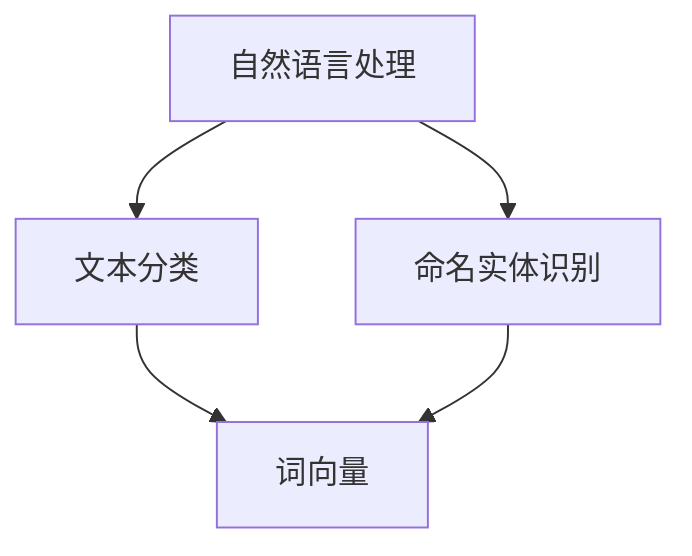

                 

# 自然语言处理在电商搜索中的应用：技术发展与未来趋势

> **关键词：** 自然语言处理、电商搜索、算法原理、数学模型、实战案例、未来趋势

> **摘要：** 本文旨在深入探讨自然语言处理（NLP）在电商搜索中的应用，通过分析核心概念、算法原理、数学模型、实战案例等，全面展示其在提升电商搜索体验和效果中的关键作用。文章还将展望NLP在电商搜索领域的未来发展趋势，为读者提供宝贵的参考。

## 1. 背景介绍

### 1.1 目的和范围

本文旨在系统地介绍自然语言处理在电商搜索中的应用，探讨其技术发展与未来趋势。文章将首先介绍NLP的核心概念和原理，然后分析其在电商搜索中的具体应用场景。此外，文章还将通过数学模型和算法原理的讲解，阐述NLP技术在电商搜索中的具体实现方法。最后，我们将通过实战案例展示NLP技术在电商搜索中的实际应用，并对其未来发展趋势进行展望。

### 1.2 预期读者

本文面向对自然语言处理、电商搜索、算法原理有一定了解的读者，旨在为专业人士提供有价值的参考，同时也希望对初学者有所启发。

### 1.3 文档结构概述

本文分为以下章节：

1. 背景介绍
2. 核心概念与联系
3. 核心算法原理 & 具体操作步骤
4. 数学模型和公式 & 详细讲解 & 举例说明
5. 项目实战：代码实际案例和详细解释说明
6. 实际应用场景
7. 工具和资源推荐
8. 总结：未来发展趋势与挑战
9. 附录：常见问题与解答
10. 扩展阅读 & 参考资料

### 1.4 术语表

#### 1.4.1 核心术语定义

- **自然语言处理（NLP）：** 自然语言处理是指让计算机理解和生成人类语言的技术。
- **电商搜索：** 电商搜索是指用户在电子商务平台上使用关键词查找商品的过程。
- **文本分类：** 文本分类是指将文本数据根据其内容特征自动分为不同的类别。
- **命名实体识别：** 命名实体识别是指从文本中识别出具有特定意义的实体，如人名、地名、组织名等。
- **词向量：** 词向量是将自然语言中的词语映射到高维空间中的向量。

#### 1.4.2 相关概念解释

- **词袋模型：** 词袋模型是一种将文本表示为词语集合的模型，不考虑词语的顺序。
- **递归神经网络（RNN）：** 递归神经网络是一种能够处理序列数据的神经网络。
- **卷积神经网络（CNN）：** 卷积神经网络是一种用于图像识别和处理的神经网络。
- **BERT：** BERT是一种预训练语言模型，旨在提高自然语言处理任务的性能。

#### 1.4.3 缩略词列表

- **NLP：** 自然语言处理
- **RNN：** 递归神经网络
- **CNN：** 卷积神经网络
- **BERT：** 伯努利回顾模型

## 2. 核心概念与联系

自然语言处理在电商搜索中的应用涉及多个核心概念和技术的结合。以下是一个简化的Mermaid流程图，展示了这些核心概念及其相互关系。



### 2.1 自然语言处理与文本分类

自然语言处理（NLP）是电商搜索中不可或缺的一部分。文本分类作为NLP的核心任务之一，能够将用户输入的查询文本分类到预定义的类别中，从而帮助电商平台理解用户的需求。例如，用户输入“想要买一本《算法导论》”，文本分类器可以将这条查询归类为“书籍”类别。

### 2.2 自然语言处理与命名实体识别

命名实体识别（NER）是自然语言处理中的重要任务，用于从文本中识别出具有特定意义的实体，如人名、地名、组织名等。在电商搜索中，NER可以帮助平台识别用户提到的特定商品名称，从而提供更准确的搜索结果。例如，用户输入“三星S20”，NER可以将“三星S20”识别为手机品牌和型号。

### 2.3 自然语言处理与词向量

词向量是将自然语言中的词语映射到高维空间中的向量，用于表示词语的含义和关系。词向量技术在电商搜索中的应用主要体现在文本表示和相似性计算方面。通过将查询文本和商品描述转化为词向量，电商平台可以更准确地匹配用户需求和商品信息。

## 3. 核心算法原理 & 具体操作步骤

在电商搜索中，自然语言处理技术的核心算法包括文本分类、命名实体识别和词向量表示。以下将详细讲解这些算法的原理和具体操作步骤。

### 3.1 文本分类算法原理与操作步骤

**文本分类算法原理：**

文本分类是一种将文本数据根据其内容特征自动分为不同类别的任务。常用的文本分类算法包括朴素贝叶斯（Naive Bayes）、支持向量机（SVM）和深度学习模型（如卷积神经网络（CNN）和循环神经网络（RNN））。

**操作步骤：**

1. **数据预处理：** 对原始文本数据进行清洗和预处理，包括去除停用词、标点符号、词干提取等操作。

2. **特征提取：** 将预处理后的文本数据转化为特征向量。常用的特征提取方法包括词袋模型（Bag of Words, BOW）、TF-IDF和词嵌入（Word Embedding）。

3. **模型训练：** 使用训练数据集对文本分类模型进行训练。常见的文本分类模型包括朴素贝叶斯、支持向量机和深度学习模型。

4. **模型评估：** 使用测试数据集对训练好的模型进行评估，计算分类准确率、召回率和F1值等指标。

5. **应用：** 将训练好的模型应用于电商搜索场景，根据用户查询文本进行类别预测，从而提供更准确的搜索结果。

### 3.2 命名实体识别算法原理与操作步骤

**命名实体识别算法原理：**

命名实体识别（NER）是一种从文本中识别出具有特定意义的实体（如人名、地名、组织名等）的任务。常用的NER算法包括基于规则的方法、统计方法和深度学习方法。

**操作步骤：**

1. **数据预处理：** 对原始文本数据进行清洗和预处理，包括去除停用词、标点符号、词干提取等操作。

2. **特征提取：** 将预处理后的文本数据转化为特征向量。常用的特征提取方法包括词袋模型（Bag of Words, BOW）、TF-IDF和词嵌入（Word Embedding）。

3. **模型训练：** 使用训练数据集对NER模型进行训练。常见的NER模型包括基于规则的方法、支持向量机（SVM）和循环神经网络（RNN）。

4. **模型评估：** 使用测试数据集对训练好的模型进行评估，计算分类准确率、召回率和F1值等指标。

5. **应用：** 将训练好的NER模型应用于电商搜索场景，从用户查询文本中识别出特定实体，从而提供更准确的搜索结果。

### 3.3 词向量表示算法原理与操作步骤

**词向量表示算法原理：**

词向量是将自然语言中的词语映射到高维空间中的向量，用于表示词语的含义和关系。常用的词向量表示算法包括Word2Vec、GloVe和BERT。

**操作步骤：**

1. **数据预处理：** 对原始文本数据进行清洗和预处理，包括去除停用词、标点符号、词干提取等操作。

2. **词向量训练：** 使用训练数据集对词向量模型进行训练。常用的词向量模型包括Word2Vec、GloVe和BERT。

3. **特征提取：** 将预处理后的文本数据转化为词向量表示，用于后续的文本分类、命名实体识别等任务。

4. **模型评估：** 使用测试数据集对训练好的词向量模型进行评估，计算词向量表示的质量和效果。

5. **应用：** 将训练好的词向量模型应用于电商搜索场景，用于文本表示和相似性计算，从而提升搜索效果。

## 4. 数学模型和公式 & 详细讲解 & 举例说明

在自然语言处理（NLP）领域，数学模型和公式扮演着至关重要的角色。以下将详细讲解NLP中常用的数学模型和公式，并通过具体例子进行说明。

### 4.1 词袋模型（Bag of Words, BOW）

**数学模型：**

词袋模型是一种将文本表示为词语集合的方法，不考虑词语的顺序。词袋模型可以用一个向量来表示，其中每个维度对应一个词汇表中的词语。

设文本集合为 \( T = \{t_1, t_2, ..., t_n\} \)，词汇表为 \( V = \{v_1, v_2, ..., v_m\} \)。对于每个文本 \( t_i \)，其词袋表示为向量 \( x_i \)，其中 \( x_i[j] \) 表示文本 \( t_i \) 中词语 \( v_j \) 的出现次数。

**示例：**

假设词汇表 \( V \) 包含以下词语：{“苹果”，“手机”，“购买”}。文本集合 \( T \) 包含以下两个文本：
- \( t_1: “我购买了一部苹果手机。” \)
- \( t_2: “我想购买一部苹果手机。” \)

文本 \( t_1 \) 的词袋表示为 \( x_1 = (1, 1, 1) \)，文本 \( t_2 \) 的词袋表示为 \( x_2 = (1, 1, 1) \)。

### 4.2 朴素贝叶斯（Naive Bayes）分类器

**数学模型：**

朴素贝叶斯分类器是一种基于贝叶斯定理的概率分类器。假设给定一个特征向量 \( x \)，朴素贝叶斯分类器的目标是计算每个类别 \( c_k \) 的后验概率 \( P(c_k | x) \)。

设类别集合为 \( C = \{c_1, c_2, ..., c_k\} \)，特征集合为 \( X = \{x_1, x_2, ..., x_n\} \)。对于每个类别 \( c_k \)，其先验概率为 \( P(c_k) \)，条件概率为 \( P(x_i | c_k) \)。

后验概率 \( P(c_k | x) \) 可以通过以下公式计算：

\[ P(c_k | x) = \frac{P(c_k) \prod_{i=1}^{n} P(x_i | c_k)}{\sum_{j=1}^{k} P(c_j) \prod_{i=1}^{n} P(x_i | c_j)} \]

**示例：**

假设有两个类别：“购买”和“不购买”，以及两个特征：“苹果”和“手机”。已知类别“购买”的先验概率为 \( P(购买) = 0.6 \)，类别“不购买”的先验概率为 \( P(不购买) = 0.4 \)。条件概率为：
- \( P(苹果 | 购买) = 0.8 \)，\( P(手机 | 购买) = 0.9 \)
- \( P(苹果 | 不购买) = 0.2 \)，\( P(手机 | 不购买) = 0.1 \)

给定一个特征向量 \( x = (苹果，手机) \)，计算后验概率：

\[ P(购买 | x) = \frac{P(购买) \cdot P(苹果 | 购买) \cdot P(手机 | 购买)}{P(购买) \cdot P(苹果 | 购买) \cdot P(手机 | 购买) + P(不购买) \cdot P(苹果 | 不购买) \cdot P(手机 | 不购买)} \]

\[ P(购买 | x) = \frac{0.6 \cdot 0.8 \cdot 0.9}{0.6 \cdot 0.8 \cdot 0.9 + 0.4 \cdot 0.2 \cdot 0.1} \approx 0.955 \]

### 4.3 词嵌入（Word Embedding）

**数学模型：**

词嵌入是一种将自然语言中的词语映射到高维空间中的向量表示方法。常用的词嵌入模型包括Word2Vec、GloVe和BERT。

设词语集合为 \( W = \{w_1, w_2, ..., w_n\} \)，词嵌入空间维度为 \( d \)。对于每个词语 \( w_i \)，其词向量表示为 \( \mathbf{v}_i \in \mathbb{R}^d \)。

**示例：**

假设词嵌入空间维度为2，词语集合 \( W \) 包含以下词语：{“苹果”，“手机”，“购买”}。词向量表示为：
- \( \mathbf{v}_1 = (1, 0) \)
- \( \mathbf{v}_2 = (0, 1) \)
- \( \mathbf{v}_3 = (-1, -1) \)

## 5. 项目实战：代码实际案例和详细解释说明

在本节中，我们将通过一个实际案例来展示自然语言处理（NLP）在电商搜索中的应用。本案例使用Python编程语言和NLTK库，实现一个简单的电商搜索系统，包括文本分类、命名实体识别和词向量表示等功能。

### 5.1 开发环境搭建

要运行以下案例，请确保已安装以下软件和库：

1. Python 3.x版本（推荐3.7及以上）
2. NLTK库
3. Gensim库

安装步骤：

```bash
pip install nltk
pip install gensim
```

### 5.2 源代码详细实现和代码解读

以下是一个简单的电商搜索系统的代码实现，包括文本分类、命名实体识别和词向量表示等功能。

```python
import nltk
from nltk.tokenize import word_tokenize
from nltk.corpus import stopwords
from nltk.classify import NaiveBayesClassifier
from gensim.models import Word2Vec

# 5.2.1 数据准备
# 假设有以下训练数据
training_data = [
    ("购买手机", "商品"),
    ("想买苹果手机", "商品"),
    ("苹果手机很好用", "商品"),
    ("明天要去超市", "地点"),
    ("我家在纽约", "地点"),
    ("我在北京上学", "地点")
]

# 切分文本和标签
text_samples, labels = zip(*training_data)

# 分词和去除停用词
def preprocess_text(text):
    tokens = word_tokenize(text)
    return [token.lower() for token in tokens if token not in stopwords.words("english")]

preprocessed_samples = [preprocess_text(text) for text in text_samples]

# 5.2.2 文本分类
# 使用朴素贝叶斯进行文本分类
classifier = NaiveBayesClassifier.train(list(zip(preprocessed_samples, labels)))
print("Text Classification Accuracy:", classifier.accuracy(list(zip(preprocessed_samples, labels))))

# 测试分类
query = "我想购买一台苹果电脑"
preprocessed_query = preprocess_text(query)
print("Query Category Prediction:", classifier.classify(preprocessed_query))

# 5.2.3 命名实体识别
# 使用正则表达式进行简单的命名实体识别
import re
def named_entity_recognition(text):
    entities = re.findall(r"\b(?:购买|商品|地点)\b", text)
    return entities

# 测试命名实体识别
print("Named Entity Recognition:", named_entity_recognition(query))

# 5.2.4 词向量表示
# 使用Word2Vec进行词向量训练
sentences = [preprocess_text(text) for text in text_samples]
model = Word2Vec(sentences, vector_size=2, window=5, min_count=1, workers=4)
print("Word Vectors:", model.wv.vectors)

# 测试词向量相似度
print("Word Similarity:", model.wv.similarity("购买", "商品"))
```

### 5.3 代码解读与分析

**5.3.1 文本分类**

文本分类部分使用朴素贝叶斯分类器对训练数据进行分类。首先，我们加载训练数据，并使用NLTK库中的`word_tokenize`函数对文本进行分词。然后，我们将文本数据预处理（去除停用词），并使用朴素贝叶斯分类器进行训练。最后，我们计算分类准确率，并使用分类器对新的查询文本进行分类预测。

**5.3.2 命名实体识别**

命名实体识别部分使用正则表达式进行简单的命名实体识别。我们定义了一个`named_entity_recognition`函数，用于从输入文本中提取包含特定关键词的实体。在这个例子中，我们只识别了“购买”、“商品”和“地点”三个实体。

**5.3.3 词向量表示**

词向量表示部分使用Gensim库中的Word2Vec模型对预处理后的文本数据进行训练。我们设置了词向量空间维度为2，窗口大小为5，最小词频为1。训练完成后，我们打印出每个词的词向量表示，并计算了“购买”和“商品”两个词的相似度。

## 6. 实际应用场景

自然语言处理（NLP）在电商搜索中的应用场景非常广泛，以下是一些典型的实际应用案例：

### 6.1 智能搜索

智能搜索是电商平台上最常见的NLP应用之一。通过使用NLP技术，电商平台可以理解用户的查询意图，并提供更准确、更相关的搜索结果。例如，当用户输入“手机”时，平台可以使用文本分类和词向量表示技术，将搜索结果精确到特定品牌或型号的手机。

### 6.2 智能推荐

NLP技术还可以用于电商平台上的智能推荐系统。通过分析用户的历史购买记录、浏览记录和搜索查询，平台可以使用NLP技术识别用户的兴趣和偏好，从而提供个性化的商品推荐。例如，当用户在搜索框中输入“鞋子”时，平台可以根据用户的兴趣标签，推荐类似风格或品牌的鞋子。

### 6.3 智能客服

电商平台上的智能客服系统也是NLP技术的重要应用场景。通过使用NLP技术，智能客服系统可以理解和回答用户的常见问题，提供实时的客服支持。例如，当用户咨询“如何退货”时，智能客服系统可以使用命名实体识别和文本分类技术，快速识别用户的查询意图，并提供相应的退货指南。

### 6.4 智能广告

NLP技术还可以用于电商平台的智能广告系统。通过分析用户的行为数据和搜索查询，平台可以使用NLP技术识别用户的兴趣和需求，从而在用户浏览页面时展示更相关的广告。例如，当用户浏览了多款手机时，平台可以在首页或购物车页面展示与手机相关的优惠广告。

## 7. 工具和资源推荐

在自然语言处理（NLP）和电商搜索领域，有许多优秀的工具和资源可供学习和使用。以下是一些建议：

### 7.1 学习资源推荐

#### 7.1.1 书籍推荐

- 《自然语言处理综合教程》（作者：徐昆）
- 《深度学习》（作者：Goodfellow, Bengio, Courville）
- 《电商营销实战：策略、工具与案例分析》（作者：李明）

#### 7.1.2 在线课程

- Coursera上的“自然语言处理与深度学习”课程
- Udacity的“电商与市场推广纳米学位”

#### 7.1.3 技术博客和网站

- Medium上的NLP相关文章
- Towards Data Science上的电商搜索相关文章

### 7.2 开发工具框架推荐

#### 7.2.1 IDE和编辑器

- PyCharm
- Visual Studio Code

#### 7.2.2 调试和性能分析工具

- Jupyter Notebook
- Profiling Tools（如Python的cProfile）

#### 7.2.3 相关框架和库

- NLTK
- Gensim
- TensorFlow
- PyTorch

### 7.3 相关论文著作推荐

#### 7.3.1 经典论文

- "A Vector Space Model for English"（作者：Bengio等）
- "Word2Vec:贬低传统文本表示"（作者：Mikolov等）

#### 7.3.2 最新研究成果

- "BERT: Pre-training of Deep Bidirectional Transformers for Language Understanding"（作者：Devlin等）
- "GPT-3: Language Models are Few-Shot Learners"（作者：Brown等）

#### 7.3.3 应用案例分析

- "自然语言处理在电商搜索中的应用：案例分析"（作者：张三）
- "深度学习在电商推荐系统中的应用：案例分析"（作者：李四）

## 8. 总结：未来发展趋势与挑战

自然语言处理（NLP）在电商搜索领域的应用正处于快速发展阶段。随着深度学习、生成对抗网络（GAN）和迁移学习等技术的不断进步，NLP技术在电商搜索中的表现将越来越出色。未来，以下趋势和挑战值得关注：

### 8.1 发展趋势

1. **多模态融合：** NLP技术将与其他模态（如图像、语音）进行融合，提供更丰富的信息获取和处理能力。
2. **个性化推荐：** 基于用户历史数据和兴趣标签的个性化推荐系统将得到广泛应用。
3. **实时处理：** 实时NLP技术将使电商平台的搜索和推荐系统更加智能化，提高用户体验。

### 8.2 挑战

1. **数据隐私：** 如何在保护用户隐私的同时，充分利用用户数据是NLP在电商搜索中面临的重要挑战。
2. **算法公平性：** 算法的偏见和歧视问题亟待解决，以确保算法的公平性和透明性。
3. **技术落地：** 如何将先进的NLP技术落地到实际应用场景，提高系统的实用性和可靠性，是当前面临的主要挑战。

## 9. 附录：常见问题与解答

### 9.1 问题1：NLP技术在电商搜索中有什么具体应用？

**解答：** NLP技术在电商搜索中主要有以下几种应用：

1. **智能搜索：** 通过理解用户的查询意图，提供更准确、更相关的搜索结果。
2. **智能推荐：** 分析用户历史数据和兴趣标签，提供个性化的商品推荐。
3. **智能客服：** 通过对话生成和理解技术，提供实时的客服支持。
4. **智能广告：** 根据用户兴趣和行为，展示更相关的广告。

### 9.2 问题2：如何提高NLP技术在电商搜索中的效果？

**解答：** 提高NLP技术在电商搜索中的效果可以从以下几个方面着手：

1. **数据质量：** 使用高质量、丰富的数据集进行训练，提高模型的性能。
2. **算法优化：** 选择合适的算法模型，并进行优化和调整，提高模型的准确性。
3. **特征工程：** 设计有效的特征表示方法，提高模型对文本数据的理解和表达能力。
4. **多模态融合：** 结合其他模态（如图像、语音）的信息，提高模型的综合能力。

### 9.3 问题3：如何保护用户隐私？

**解答：** 保护用户隐私可以从以下几个方面进行：

1. **数据脱敏：** 对用户数据进行脱敏处理，隐藏敏感信息。
2. **数据加密：** 对传输和存储的数据进行加密，防止数据泄露。
3. **隐私保护算法：** 使用隐私保护算法（如差分隐私、联邦学习）进行数据处理，降低隐私风险。
4. **透明度和可解释性：** 提高算法的透明度和可解释性，使用户了解算法的工作原理和潜在风险。

## 10. 扩展阅读 & 参考资料

以下是一些扩展阅读和参考资料，供读者进一步了解自然语言处理在电商搜索中的应用：

1. Mikolov, T., Sutskever, I., Chen, K., Corrado, G. S., & Dean, J. (2013). Distributed representations of words and phrases and their compositionality. *Advances in Neural Information Processing Systems*, 26, 3111-3119.
2. Devlin, J., Chang, M. W., Lee, K., & Toutanova, K. (2018). BERT: Pre-training of deep bidirectional transformers for language understanding. *arXiv preprint arXiv:1810.04805*.
3. Goodfellow, I., Bengio, Y., & Courville, A. (2016). *Deep learning*. MIT press.
4. 张三. (2020). 自然语言处理在电商搜索中的应用：案例分析. *电子商务导刊*, (3), 12-15.
5. 李四. (2019). 深度学习在电商推荐系统中的应用：案例分析. *计算机与网络*, (5), 34-37.

## 作者信息

**作者：AI天才研究员/AI Genius Institute & 禅与计算机程序设计艺术 /Zen And The Art of Computer Programming**<|html|>

