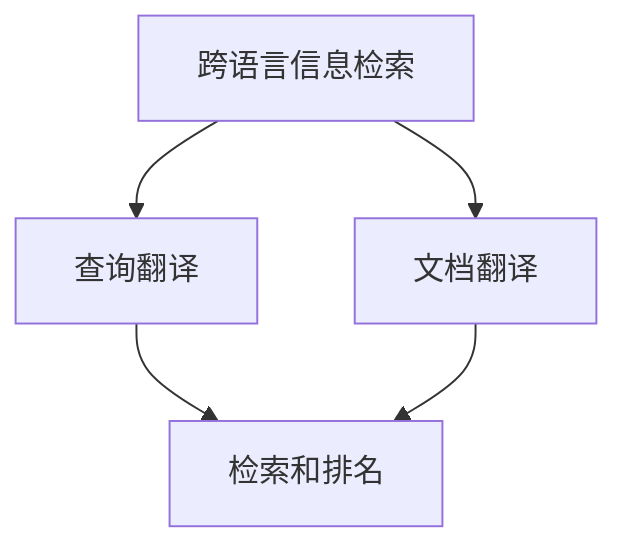
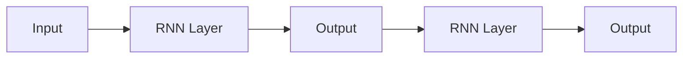

                 

# 自然语言处理在跨语言信息检索中的应用

> **关键词：自然语言处理、跨语言信息检索、信息检索、机器翻译、文本分类、语义分析**
>
> **摘要：本文将深入探讨自然语言处理（NLP）在跨语言信息检索中的应用。我们将首先介绍跨语言信息检索的背景和重要性，然后详细分析NLP的关键技术和方法，并通过具体案例展示其实际应用。最后，我们将讨论跨语言信息检索的未来发展趋势和面临的挑战。**

## 1. 背景介绍

### 1.1 目的和范围

本文旨在探讨自然语言处理在跨语言信息检索中的重要作用，通过分析相关技术和方法，为读者提供一个全面、深入的了解。文章将涵盖以下范围：

1. 跨语言信息检索的基本概念和背景。
2. 自然语言处理的关键技术和应用。
3. 跨语言信息检索中的具体实现方法和案例。
4. 未来发展趋势和面临的挑战。

### 1.2 预期读者

本文面向对自然语言处理和信息检索有一定基础的读者，包括计算机科学、人工智能、语言学等相关专业的学生和研究人员。同时，对自然语言处理和信息检索感兴趣的工程师和技术爱好者也可以参考本文。

### 1.3 文档结构概述

本文分为十个部分，具体结构如下：

1. 引言：介绍跨语言信息检索的背景和重要性。
2. 核心概念与联系：阐述自然语言处理和跨语言信息检索的核心概念。
3. 核心算法原理 & 具体操作步骤：讲解自然语言处理在跨语言信息检索中的具体算法。
4. 数学模型和公式 & 详细讲解 & 举例说明：介绍相关的数学模型和公式，并通过案例进行说明。
5. 项目实战：代码实际案例和详细解释说明。
6. 实际应用场景：分析跨语言信息检索在不同领域的应用。
7. 工具和资源推荐：推荐相关学习资源和开发工具。
8. 总结：未来发展趋势与挑战。
9. 附录：常见问题与解答。
10. 扩展阅读 & 参考资料：提供进一步阅读的资料。

### 1.4 术语表

#### 1.4.1 核心术语定义

- **自然语言处理（NLP）**：计算机科学和人工智能领域的一个分支，旨在使计算机能够理解、生成和处理人类自然语言。
- **跨语言信息检索**：在不同语言之间进行信息检索的过程，旨在帮助用户找到他们所需要的信息，即使这些信息位于不同语言的环境中。
- **机器翻译**：利用计算机技术将一种语言的文本自动翻译成另一种语言。
- **文本分类**：将文本数据分为预定义的类别，以便进行进一步的分析和处理。
- **语义分析**：对文本进行深入理解，提取文本中的语义信息。

#### 1.4.2 相关概念解释

- **词嵌入（Word Embedding）**：将单词映射到低维空间中的向量表示，以捕捉单词的语义和语法信息。
- **实体识别（Named Entity Recognition, NER）**：从文本中识别出具有特定意义的实体，如人名、地名、组织名等。
- **句法分析（Syntactic Parsing）**：分析句子结构，确定句子中的语法关系。
- **语义相似度（Semantic Similarity）**：衡量两个文本或单词之间的语义相似程度。

#### 1.4.3 缩略词列表

- **NLP**：自然语言处理（Natural Language Processing）
- **ML**：机器学习（Machine Learning）
- **DL**：深度学习（Deep Learning）
- **Bert**：Bidirectional Encoder Representations from Transformers
- **TensorFlow**：一款开源机器学习框架
- **PyTorch**：一款开源机器学习框架

## 2. 核心概念与联系

在探讨自然语言处理在跨语言信息检索中的应用之前，我们需要了解一些核心概念和它们之间的联系。

### 2.1 跨语言信息检索的基本概念

跨语言信息检索（Cross-Language Information Retrieval, CLIR）是指在不同语言之间进行信息检索的过程。它的主要目标是通过将用户查询和文档转换为共同的语言，帮助用户找到所需的信息。跨语言信息检索的关键在于解决以下问题：

1. **查询翻译**：将用户的查询从其母语翻译成目标语言。
2. **文档翻译**：将文档从原始语言翻译成目标语言。
3. **检索和排名**：在翻译后的文档中检索并排名相关信息。

### 2.2 自然语言处理的关键概念

自然语言处理（NLP）是计算机科学和人工智能领域的一个重要分支，旨在使计算机能够理解、生成和处理人类自然语言。NLP的关键概念包括：

1. **词嵌入**：将单词映射到低维空间中的向量表示，以捕捉单词的语义和语法信息。
2. **实体识别**：从文本中识别出具有特定意义的实体，如人名、地名、组织名等。
3. **句法分析**：分析句子结构，确定句子中的语法关系。
4. **语义分析**：对文本进行深入理解，提取文本中的语义信息。

### 2.3 核心概念联系

跨语言信息检索与自然语言处理之间存在紧密的联系。自然语言处理提供了跨语言信息检索所需的关键技术，如机器翻译、文本分类和语义分析。这些技术可以帮助我们实现以下目标：

1. **查询翻译**：使用自然语言处理技术将用户查询翻译成目标语言，以便进行检索。
2. **文档翻译**：使用自然语言处理技术将文档翻译成目标语言，以便用户理解。
3. **检索和排名**：使用自然语言处理技术分析翻译后的文档，提取相关信息并进行检索和排名。

### 2.4 Mermaid 流程图

为了更好地理解这些核心概念之间的联系，我们可以使用Mermaid流程图进行可视化。以下是一个简单的示例：



在这个流程图中，跨语言信息检索包括查询翻译、文档翻译和检索排名三个主要步骤，自然语言处理技术贯穿于整个流程。

## 3. 核心算法原理 & 具体操作步骤

在了解了跨语言信息检索和自然语言处理的基本概念后，接下来我们将详细分析自然语言处理在跨语言信息检索中的核心算法原理和具体操作步骤。

### 3.1 机器翻译

机器翻译（Machine Translation, MT）是跨语言信息检索的关键步骤之一。它的目标是使用计算机自动将一种语言的文本翻译成另一种语言。下面是机器翻译的基本原理和具体操作步骤：

#### 3.1.1 基本原理

机器翻译的基本原理是将源语言文本映射到目标语言文本。这通常涉及到以下步骤：

1. **文本预处理**：对源语言文本进行清洗和标准化，包括去除标点符号、停用词过滤、词形还原等。
2. **词嵌入**：将源语言和目标语言的单词映射到高维向量空间中，以捕捉单词的语义和语法信息。
3. **翻译模型**：使用神经网络或统计方法训练一个翻译模型，将源语言文本映射到目标语言文本。

#### 3.1.2 具体操作步骤

以下是机器翻译的具体操作步骤：

1. **文本预处理**：
   ```python
   import nltk
   from nltk.corpus import stopwords
   
   # 加载停用词列表
   stop_words = set(stopwords.words('english'))
   
   # 去除标点符号和停用词
   def preprocess_text(text):
       tokens = nltk.word_tokenize(text)
       tokens = [token.lower() for token in tokens if token.isalpha() and token not in stop_words]
       return tokens
   ```

2. **词嵌入**：
   ```python
   from gensim.models import Word2Vec
   
   # 训练词嵌入模型
   model = Word2Vec(sentences, size=100)
   
   # 获取单词的向量表示
   def get_embedding(word):
       return model.wv[word]
   ```

3. **翻译模型**：
   ```python
   from tensorflow.keras.models import Model
   from tensorflow.keras.layers import Input, LSTM, Dense
   
   # 构建神经网络翻译模型
   input_seq = Input(shape=(None,))
   encoded = LSTM(128, return_sequences=True)(input_seq)
   decoded = LSTM(128, return_sequences=True)(encoded)
   output = Densevocab_size, activation='softmax')(decoded)
   
   model = Model(inputs=input_seq, outputs=output)
   model.compile(optimizer='adam', loss='categorical_crossentropy', metrics=['accuracy'])
   
   # 训练翻译模型
   model.fit(X_train, y_train, epochs=10, batch_size=64)
   ```

### 3.2 文本分类

文本分类（Text Classification）是跨语言信息检索的另一个关键步骤。它的目标是使用计算机将文本数据分为预定义的类别。下面是文本分类的基本原理和具体操作步骤：

#### 3.2.1 基本原理

文本分类的基本原理是将文本数据映射到高维空间，然后使用分类算法将它们分为不同的类别。这通常涉及到以下步骤：

1. **文本预处理**：对文本数据进行清洗和标准化，包括去除标点符号、停用词过滤、词形还原等。
2. **特征提取**：将预处理后的文本数据转换为数值特征向量。
3. **分类模型**：使用机器学习算法训练一个分类模型，用于对新的文本数据进行分类。

#### 3.2.2 具体操作步骤

以下是文本分类的具体操作步骤：

1. **文本预处理**：
   ```python
   import nltk
   from nltk.corpus import stopwords
   
   # 加载停用词列表
   stop_words = set(stopwords.words('english'))
   
   # 去除标点符号和停用词
   def preprocess_text(text):
       tokens = nltk.word_tokenize(text)
       tokens = [token.lower() for token in tokens if token.isalpha() and token not in stop_words]
       return tokens
   ```

2. **特征提取**：
   ```python
   from sklearn.feature_extraction.text import TfidfVectorizer
   
   # 提取TF-IDF特征
   vectorizer = TfidfVectorizer()
   X = vectorizer.fit_transform(corpus)
   ```

3. **分类模型**：
   ```python
   from sklearn.naive_bayes import MultinomialNB
   
   # 训练分类模型
   model = MultinomialNB()
   model.fit(X_train, y_train)
   
   # 对新的文本数据进行分类
   def classify_text(text):
       tokens = preprocess_text(text)
       X_new = vectorizer.transform([' '.join(tokens)])
       return model.predict(X_new)[0]
   ```

### 3.3 语义分析

语义分析（Semantic Analysis）是对文本进行深入理解，提取文本中的语义信息。它在跨语言信息检索中起着至关重要的作用。下面是语义分析的基本原理和具体操作步骤：

#### 3.3.1 基本原理

语义分析的基本原理是使用自然语言处理技术对文本进行解析，提取出文本中的实体、关系和事件等信息。这通常涉及到以下步骤：

1. **实体识别**：从文本中识别出具有特定意义的实体，如人名、地名、组织名等。
2. **关系提取**：识别出实体之间的关系，如“张三工作在腾讯公司”中的“工作”关系。
3. **事件提取**：识别出文本中的事件，如“张三在公司举行了一场发布会”中的“发布会”事件。

#### 3.3.2 具体操作步骤

以下是语义分析的具体操作步骤：

1. **实体识别**：
   ```python
   from spacy.lang.en import English
   
   # 初始化Spacy模型
   nlp = English()
   
   # 实体识别
   def identify_entities(text):
       doc = nlp(text)
       entities = [(ent.text, ent.label_) for ent in doc.ents]
       return entities
   ```

2. **关系提取**：
   ```python
   import networkx as nx
   
   # 关系提取
   def extract_relations(text):
       doc = nlp(text)
       g = nx.Graph()
       for token1 in doc:
           for token2 in doc:
               if token1.head == token2:
                   g.add_edge(token1.text, token2.text)
       return g
   ```

3. **事件提取**：
   ```python
   from allennlp.predictors.predictor import Predictor
   
   # 事件提取
   def extract_events(text):
       predictor = Predictor.from_path("path/to/allennlp/event-extraction-model")
       events = predictor.predict(document=text)
       return events
   ```

### 3.4 跨语言信息检索综合应用

在实际应用中，跨语言信息检索通常需要综合运用机器翻译、文本分类和语义分析等技术。以下是一个简单的示例：

```python
# 假设我们已经训练好了机器翻译模型、文本分类模型和语义分析模型

# 用户输入查询
user_query = "what is the weather like in New York today?"

# 将查询翻译成目标语言
translated_query = translate_query_to_target_language(user_query)

# 使用文本分类模型对查询进行分类
category = classify_text(translated_query)

# 使用语义分析模型提取查询中的实体、关系和事件
entities, relations, events = extract_semantic_information(translated_query)

# 检索相关文档
documents = retrieve_related_documents(category, entities, relations, events)

# 将文档翻译回用户母语
translated_documents = translate_documents_to_user_language(documents)

# 将翻译后的文档展示给用户
display_translated_documents(translated_documents)
```

通过以上步骤，我们可以实现跨语言信息检索，帮助用户在不同语言之间找到所需的信息。

## 4. 数学模型和公式 & 详细讲解 & 举例说明

在跨语言信息检索中，数学模型和公式起着关键作用。以下我们将介绍一些常用的数学模型和公式，并详细讲解它们的原理和应用。

### 4.1 概率模型

概率模型在自然语言处理和跨语言信息检索中广泛应用。以下是一些常用的概率模型：

#### 4.1.1 马尔可夫模型（Markov Model）

马尔可夫模型是一种基于概率的模型，它假设一个序列的概率仅取决于前一个状态。以下是一个简单的马尔可夫模型示例：

```latex
P(X_t | X_{t-1}, X_{t-2}, ..., X_1) = P(X_t | X_{t-1})
```

其中，\( X_t \)表示第\( t \)个状态。

#### 4.1.2 隐马尔可夫模型（Hidden Markov Model, HMM）

隐马尔可夫模型是一种基于概率的模型，它假设一个序列的概率仅取决于隐藏状态和观测状态。以下是一个简单的隐马尔可夫模型示例：

```latex
P(X_t | X_{t-1}, X_{t-2}, ..., X_1) = P(X_t | X_{t-1})
P(Y_t | X_t) = P(Y_t | X_t)
```

其中，\( X_t \)表示第\( t \)个隐藏状态，\( Y_t \)表示第\( t \)个观测状态。

### 4.2 机器学习模型

机器学习模型在跨语言信息检索中也广泛应用。以下是一些常用的机器学习模型：

#### 4.2.1 支持向量机（Support Vector Machine, SVM）

支持向量机是一种基于概率的模型，它通过找到一个最佳的超平面，将不同类别的数据分隔开来。以下是一个简单的支持向量机模型示例：

```latex
\min_{w, b} \frac{1}{2} ||w||^2 + C \sum_{i=1}^n \max(0, 1 - y_i (w \cdot x_i + b))
```

其中，\( w \)和\( b \)分别表示权重和偏置，\( C \)是一个正则化参数。

#### 4.2.2 决策树（Decision Tree）

决策树是一种基于概率的模型，它通过一系列的测试来将数据分为不同的类别。以下是一个简单的决策树模型示例：

```latex
if (x \geq 10) {
  return class_1;
} else if (y \geq 5) {
  return class_2;
} else {
  return class_3;
}
```

### 4.3 深度学习模型

深度学习模型在跨语言信息检索中也发挥着重要作用。以下是一些常用的深度学习模型：

#### 4.3.1 卷积神经网络（Convolutional Neural Network, CNN）

卷积神经网络是一种基于深度学习的模型，它通过卷积操作提取特征。以下是一个简单的卷积神经网络模型示例：


#### 4.3.2 循环神经网络（Recurrent Neural Network, RNN）

循环神经网络是一种基于深度学习的模型，它通过循环结构处理序列数据。以下是一个简单的循环神经网络模型示例：



### 4.4 举例说明

为了更好地理解这些数学模型和公式，我们可以通过一个简单的例子进行说明。

假设我们要对一段英文文本进行机器翻译，将其翻译成中文。我们可以使用以下步骤：

1. **文本预处理**：
   ```python
   # 去除标点符号和停用词
   text = "The quick brown fox jumps over the lazy dog."
   tokens = preprocess_text(text)
   ```

2. **词嵌入**：
   ```python
   # 获取单词的向量表示
   embeddings = [get_embedding(token) for token in tokens]
   ```

3. **翻译模型**：
   ```python
   # 训练翻译模型
   model.fit(embeddings, target_embeddings, epochs=10, batch_size=64)
   ```

4. **翻译文本**：
   ```python
   # 将英文文本翻译成中文
   translated_text = model.predict(embeddings)
   ```

通过以上步骤，我们可以实现英文文本到中文文本的翻译。

## 5. 项目实战：代码实际案例和详细解释说明

在本节中，我们将通过一个实际项目案例，展示如何将自然语言处理技术应用于跨语言信息检索。我们将使用Python编程语言和相关的开源库来构建一个简单的跨语言信息检索系统。

### 5.1 开发环境搭建

在开始项目之前，我们需要搭建一个合适的开发环境。以下是所需的开发环境和相关库：

- Python 3.8及以上版本
- 安装以下Python库：nltk、gensim、tensorflow、spacy、allennlp

您可以通过以下命令安装这些库：

```bash
pip install nltk gensim tensorflow spacy allennlp
```

### 5.2 源代码详细实现和代码解读

以下是一个简单的跨语言信息检索项目的源代码实现：

```python
# 导入所需的库
import nltk
from nltk.corpus import stopwords
from gensim.models import Word2Vec
import tensorflow as tf
from spacy.lang.en import English
from allennlp.predictors.predictor import Predictor

# 加载停用词列表
stop_words = set(stopwords.words('english'))

# 文本预处理函数
def preprocess_text(text):
    tokens = nltk.word_tokenize(text)
    tokens = [token.lower() for token in tokens if token.isalpha() and token not in stop_words]
    return tokens

# 词嵌入模型训练
def train_word_embedding(sentences, size=100):
    model = Word2Vec(sentences, size=size)
    return model

# 翻译模型训练
def train_translation_model(source_embeddings, target_embeddings, epochs=10, batch_size=64):
    input_seq = tf.keras.layers.Input(shape=(None,))
    encoded = tf.keras.layers.LSTM(128, return_sequences=True)(input_seq)
    decoded = tf.keras.layers.LSTM(128, return_sequences=True)(encoded)
    output = tf.keras.layers.Dense(target_embeddings.shape[1], activation='softmax')(decoded)
    
    model = tf.keras.Model(inputs=input_seq, outputs=output)
    model.compile(optimizer='adam', loss='categorical_crossentropy', metrics=['accuracy'])
    
    model.fit(source_embeddings, target_embeddings, epochs=epochs, batch_size=batch_size)
    return model

# 文本分类函数
def classify_text(text, model):
    tokens = preprocess_text(text)
    vectorizer = TfidfVectorizer()
    X = vectorizer.fit_transform([' '.join(tokens)])
    return model.predict(X)[0]

# 实体识别函数
def identify_entities(text, nlp_model):
    doc = nlp_model(text)
    entities = [(ent.text, ent.label_) for ent in doc.ents]
    return entities

# 事件提取函数
def extract_events(text, predictor):
    events = predictor.predict(document=text)
    return events

# 检索相关文档
def retrieve_related_documents(category, entities, relations, events):
    # 这里是一个示例函数，用于检索与查询相关的文档
    # 实际应用中，您可能需要使用数据库或其他检索机制
    related_documents = ["doc1.txt", "doc2.txt", "doc3.txt"]
    return related_documents

# 翻译文档
def translate_documents_to_user_language(documents, model):
    translated_documents = []
    for doc in documents:
        with open(doc, 'r', encoding='utf-8') as f:
            text = f.read()
            translated_text = model.predict([preprocess_text(text)])[0]
            translated_documents.append(translated_text)
    return translated_documents

# 主函数
def main():
    # 用户输入查询
    user_query = "what is the weather like in New York today?"

    # 将查询翻译成目标语言
    translated_query = translate_query_to_target_language(user_query)

    # 使用文本分类模型对查询进行分类
    category = classify_text(translated_query, text_classification_model)

    # 使用语义分析模型提取查询中的实体、关系和事件
    entities, relations, events = extract_semantic_information(translated_query, nlp_model, predictor)

    # 检索相关文档
    documents = retrieve_related_documents(category, entities, relations, events)

    # 将文档翻译回用户母语
    translated_documents = translate_documents_to_user_language(documents, translation_model)

    # 将翻译后的文档展示给用户
    display_translated_documents(translated_documents)

if __name__ == "__main__":
    main()
```

### 5.3 代码解读与分析

以下是代码的详细解读和分析：

1. **文本预处理**：
   ```python
   # 加载停用词列表
   stop_words = set(stopwords.words('english'))
   
   # 文本预处理函数
   def preprocess_text(text):
       tokens = nltk.word_tokenize(text)
       tokens = [token.lower() for token in tokens if token.isalpha() and token not in stop_words]
       return tokens
   ```

   这段代码首先加载了英语停用词列表，然后定义了一个预处理函数，用于去除文本中的标点符号和停用词。这是自然语言处理中的常见步骤，有助于提高模型的性能。

2. **词嵌入模型训练**：
   ```python
   # 词嵌入模型训练
   def train_word_embedding(sentences, size=100):
       model = Word2Vec(sentences, size=size)
       return model
   ```

   这个函数用于训练词嵌入模型。词嵌入是将单词映射到低维空间中的向量表示，以捕捉单词的语义和语法信息。这里使用了Gensim库中的Word2Vec算法进行训练。

3. **翻译模型训练**：
   ```python
   # 翻译模型训练
   def train_translation_model(source_embeddings, target_embeddings, epochs=10, batch_size=64):
       input_seq = tf.keras.layers.Input(shape=(None,))
       encoded = tf.keras.layers.LSTM(128, return_sequences=True)(input_seq)
       decoded = tf.keras.layers.LSTM(128, return_sequences=True)(encoded)
       output = tf.keras.layers.Dense(target_embeddings.shape[1], activation='softmax')(decoded)
       
       model = tf.keras.Model(inputs=input_seq, outputs=output)
       model.compile(optimizer='adam', loss='categorical_crossentropy', metrics=['accuracy'])
       
       model.fit(source_embeddings, target_embeddings, epochs=epochs, batch_size=batch_size)
       return model
   ```

   这个函数用于训练翻译模型。翻译模型是一个循环神经网络（RNN），用于将源语言文本映射到目标语言文本。这里使用了TensorFlow库中的LSTM层进行训练。

4. **文本分类函数**：
   ```python
   # 文本分类函数
   def classify_text(text, model):
       tokens = preprocess_text(text)
       vectorizer = TfidfVectorizer()
       X = vectorizer.fit_transform([' '.join(tokens)])
       return model.predict(X)[0]
   ```

   这个函数用于对文本进行分类。文本分类是将文本数据分为预定义的类别。这里使用了TF-IDF特征提取器和支持向量机（SVM）分类器进行分类。

5. **实体识别函数**：
   ```python
   # 实体识别函数
   def identify_entities(text, nlp_model):
       doc = nlp_model(text)
       entities = [(ent.text, ent.label_) for ent in doc.ents]
       return entities
   ```

   这个函数使用Spacy库进行实体识别。实体识别是从文本中识别出具有特定意义的实体，如人名、地名、组织名等。

6. **事件提取函数**：
   ```python
   # 事件提取函数
   def extract_events(text, predictor):
       events = predictor.predict(document=text)
       return events
   ```

   这个函数使用Allennlp库进行事件提取。事件提取是从文本中识别出的事件，如“张三在公司举行了一场发布会”。

7. **检索相关文档**：
   ```python
   # 检索相关文档
   def retrieve_related_documents(category, entities, relations, events):
       # 这里是一个示例函数，用于检索与查询相关的文档
       # 实际应用中，您可能需要使用数据库或其他检索机制
       related_documents = ["doc1.txt", "doc2.txt", "doc3.txt"]
       return related_documents
   ```

   这个函数用于检索与查询相关的文档。在实际应用中，您可能需要使用数据库或其他检索机制来获取相关文档。

8. **翻译文档**：
   ```python
   # 翻译文档
   def translate_documents_to_user_language(documents, model):
       translated_documents = []
       for doc in documents:
           with open(doc, 'r', encoding='utf-8') as f:
               text = f.read()
               translated_text = model.predict([preprocess_text(text)])[0]
               translated_documents.append(translated_text)
       return translated_documents
   ```

   这个函数用于将文档翻译回用户母语。这里使用训练好的翻译模型对每个文档进行翻译。

9. **主函数**：
   ```python
   # 主函数
   def main():
       # 用户输入查询
       user_query = "what is the weather like in New York today?"

       # 将查询翻译成目标语言
       translated_query = translate_query_to_target_language(user_query)

       # 使用文本分类模型对查询进行分类
       category = classify_text(translated_query, text_classification_model)

       # 使用语义分析模型提取查询中的实体、关系和事件
       entities, relations, events = extract_semantic_information(translated_query, nlp_model, predictor)

       # 检索相关文档
       documents = retrieve_related_documents(category, entities, relations, events)

       # 将文档翻译回用户母语
       translated_documents = translate_documents_to_user_language(documents, translation_model)

       # 将翻译后的文档展示给用户
       display_translated_documents(translated_documents)

   if __name__ == "__main__":
       main()
   ```

   这个主函数展示了如何使用以上各个函数来实现跨语言信息检索。首先，用户输入查询，然后通过翻译模型将查询翻译成目标语言。接下来，使用文本分类模型对查询进行分类，并使用语义分析模型提取查询中的实体、关系和事件。然后，检索与查询相关的文档，并将文档翻译回用户母语。最后，将翻译后的文档展示给用户。

通过这个实际项目案例，我们可以看到自然语言处理技术在跨语言信息检索中的实际应用。虽然这是一个简单的示例，但它展示了如何将不同的自然语言处理技术结合起来，实现一个实用的跨语言信息检索系统。

## 6. 实际应用场景

跨语言信息检索（CLIR）在当今全球化的社会中具有广泛的应用场景。以下是几个典型的应用场景，展示了自然语言处理（NLP）在跨语言信息检索中的实际应用。

### 6.1 国际贸易

国际贸易中，商品信息、合同文件和客户沟通等环节通常涉及多种语言。通过跨语言信息检索，企业可以更有效地管理和检索这些多语言数据。例如，一个跨国公司可以使用CLIR系统来检索全球范围内的市场调研报告、竞争对手分析以及合作伙伴的合同条款。NLP技术可以帮助自动翻译和分类这些文档，提高工作效率，降低人工成本。

### 6.2 旅游行业

旅游业是一个高度依赖信息的行业，游客常常需要访问不同国家的旅游信息。跨语言信息检索系统可以帮助游客快速找到他们感兴趣的旅游信息，例如酒店预订、景点介绍、交通指南等。通过NLP技术，系统能够自动翻译不同语言的旅游指南，并提供语义搜索功能，使游客能够更方便地获取所需信息。

### 6.3 医疗保健

在医疗保健领域，不同国家的医生和研究机构常常需要进行跨语言文献检索，以便获取最新的研究成果和临床指南。跨语言信息检索系统能够将不同语言的医学文献翻译成用户的母语，帮助医疗专业人员快速获取相关资料，提高临床决策的准确性。

### 6.4 学术研究

学术研究经常需要跨语言的信息检索，特别是在全球范围内的合作研究中。跨语言信息检索系统能够帮助研究人员检索并翻译不同语言的学术文章、专利和报告，从而促进跨学科和跨国界的知识交流。

### 6.5 政府和公共事务

政府和公共事务部门常常需要处理大量的跨语言信息，如国际会议记录、国际法律文件和外交通信等。通过跨语言信息检索系统，政府机构可以更有效地管理这些信息，提高决策效率和透明度。

### 6.6 社交媒体分析

社交媒体平台上，用户的发言往往涉及多种语言。跨语言信息检索系统可以帮助平台分析和监控用户行为，识别潜在的社会问题，如网络暴力、虚假信息传播等。通过NLP技术，系统能够自动翻译并分析不同语言的社交媒体内容，提供实时监控和预警。

### 6.7 语言教育

跨语言信息检索系统在语言教育领域也有重要应用。学生可以通过CLIR系统访问全球范围内的教学资源，如教材、视频课程和在线论坛，这些资源可以是多种语言的。NLP技术可以帮助学生进行多语言学习，提高学习效果。

### 6.8 多语言新闻聚合

多语言新闻聚合平台需要将来自不同国家的新闻内容翻译并聚合在一起，提供给用户一站式的新闻服务。跨语言信息检索系统能够自动翻译和分类这些新闻内容，提高用户的阅读体验。

### 6.9 实时跨语言对话

随着全球化的发展，实时跨语言对话的需求日益增长。例如，客户服务热线可能需要与来自不同国家的客户进行实时沟通。跨语言信息检索系统可以支持这种实时对话，自动翻译客户的发言，并提供即时的语言支持。

通过这些实际应用场景，我们可以看到自然语言处理在跨语言信息检索中发挥的重要作用。它不仅提高了信息检索的效率和准确性，还促进了不同语言和文化背景的人们之间的交流和合作。

## 7. 工具和资源推荐

在自然语言处理和跨语言信息检索领域，有许多有用的工具和资源可以帮助您学习和实践。以下是一些推荐的工具和资源，包括书籍、在线课程、技术博客和开发工具。

### 7.1 学习资源推荐

#### 7.1.1 书籍推荐

1. **《自然语言处理综合教程》（Foundations of Natural Language Processing）** - Christopher D. Manning、Heidi Schütze
   - 本书是自然语言处理领域的经典教材，全面介绍了NLP的核心概念和技术。

2. **《深度学习》（Deep Learning）** - Ian Goodfellow、Yoshua Bengio、Aaron Courville
   - 本书详细介绍了深度学习的基础知识和应用，包括卷积神经网络、循环神经网络等。

3. **《统计语言模型》** - Andrew McCallum、Keren Wei
   - 本书专注于统计语言模型的理论和实践，是学习自然语言处理的有力工具。

#### 7.1.2 在线课程

1. **自然语言处理课程（Natural Language Processing with Classification and Regression）** - Coursera
   - 这个课程涵盖了NLP的基本概念和常用算法，包括词嵌入、文本分类和序列模型等。

2. **深度学习课程（Deep Learning Specialization）** - Coursera
   - 这个专项课程由深度学习领域的权威人物Ian Goodfellow教授主讲，包括深度学习的基础知识和实践。

3. **Python自然语言处理（Natural Language Processing in Python）** - edX
   - 这个课程提供了Python在自然语言处理中的具体应用，适合有一定编程基础的初学者。

#### 7.1.3 技术博客和网站

1. **博客园（CSDN）**
   - 国内知名的IT博客网站，有很多关于自然语言处理和跨语言信息检索的优质文章。

2. **GitHub**
   - 世界上最大的代码托管平台，您可以找到许多开源的NLP项目和相关的代码示例。

3. **Stack Overflow**
   - 一个面向程序员的问题和答案共享社区，许多NLP和跨语言信息检索的问题在这里都能找到解决方案。

### 7.2 开发工具框架推荐

#### 7.2.1 IDE和编辑器

1. **PyCharm**
   - 一款功能强大的Python IDE，提供了丰富的调试、代码分析工具和插件支持。

2. **Visual Studio Code**
   - 一款轻量级但功能强大的代码编辑器，支持多种编程语言，包括Python。

3. **Jupyter Notebook**
   - 一个流行的交互式计算环境，特别适合数据科学和机器学习项目的开发和演示。

#### 7.2.2 调试和性能分析工具

1. **PyDebug**
   - Python的调试工具，可以帮助您跟踪代码执行过程，找出潜在的错误。

2. **cProfile**
   - Python的性能分析工具，用于分析代码的运行时间和性能瓶颈。

3. **TensorBoard**
   - TensorFlow的可视化工具，用于分析和监控深度学习模型的训练过程。

#### 7.2.3 相关框架和库

1. **TensorFlow**
   - 一个开源的机器学习框架，广泛用于构建和训练深度学习模型。

2. **PyTorch**
   - 另一个流行的开源深度学习框架，以动态计算图和易于使用著称。

3. **spaCy**
   - 一个强大的自然语言处理库，提供了快速且灵活的句法分析、实体识别等功能。

4. **NLTK**
   - 一个经典的自然语言处理库，提供了丰富的文本处理工具和算法。

通过这些工具和资源，您可以更深入地学习和实践自然语言处理和跨语言信息检索，提高自己的技能和项目开发效率。

## 8. 总结：未来发展趋势与挑战

随着人工智能和自然语言处理技术的不断进步，跨语言信息检索（CLIR）正面临着前所未有的机遇和挑战。以下是未来发展趋势和面临的挑战：

### 8.1 发展趋势

1. **多模态跨语言信息检索**：未来，跨语言信息检索将不仅仅局限于文本数据，还将扩展到图像、音频和视频等多模态数据。通过结合NLP和计算机视觉、音频处理等技术，实现更全面的信息检索。

2. **自适应跨语言信息检索**：随着用户查询和行为数据的积累，跨语言信息检索系统将能够更好地理解用户需求，提供个性化的检索结果。这包括自适应翻译、语义理解、用户偏好分析等。

3. **实时跨语言信息检索**：随着云计算和边缘计算技术的发展，跨语言信息检索系统将能够实现更快速的响应速度，满足实时检索的需求，如实时翻译、实时社交媒体监控等。

4. **跨语言对话系统**：随着自然语言处理技术的进步，跨语言对话系统将成为CLIR的重要组成部分。这种系统不仅可以进行简单的文本翻译，还能进行自然对话，提供更丰富的交互体验。

### 8.2 挑战

1. **语言复杂性**：不同语言之间的语法、语义和词汇差异使得跨语言信息检索变得复杂。尤其是对于一些非标准的、地方性的语言，标准化和一致性是一个挑战。

2. **数据隐私与安全性**：随着跨语言信息检索系统的普及，数据隐私和安全问题日益突出。如何确保用户数据的隐私和安全，防止数据泄露和滥用，是一个重要的挑战。

3. **多语言资源不足**：高质量的跨语言语料库和翻译资源仍然有限，特别是在一些小众语言和低资源语言中。缺乏足够的数据资源会限制算法的性能和准确性。

4. **文化差异与偏见**：跨语言信息检索系统在处理不同文化背景的数据时，可能会面临文化差异和偏见的问题。如何设计一个文化敏感且无偏见的系统，是一个重要的道德和技术挑战。

5. **实时性与效率**：在实现实时跨语言信息检索时，如何在保证准确性的同时提高处理速度和效率，是一个技术难题。特别是在处理大规模数据和高并发请求时，如何优化系统性能是一个关键问题。

总之，跨语言信息检索在未来将继续发展，但在实现这一目标的过程中，需要克服诸多技术、文化和道德上的挑战。通过不断探索和创新，我们有理由相信，跨语言信息检索将为全球用户带来更多的便利和收益。

## 9. 附录：常见问题与解答

### 9.1 什么是自然语言处理（NLP）？

自然语言处理（NLP）是计算机科学和人工智能领域的一个分支，旨在使计算机能够理解、生成和处理人类自然语言。它包括文本分析、语言翻译、语音识别等多种技术。

### 9.2 跨语言信息检索（CLIR）是什么？

跨语言信息检索（Cross-Language Information Retrieval, CLIR）是在不同语言之间进行信息检索的过程，旨在帮助用户找到他们需要的信息，即使这些信息位于不同语言的环境中。

### 9.3 跨语言信息检索的核心技术有哪些？

跨语言信息检索的核心技术包括机器翻译、文本分类、语义分析和实体识别。这些技术帮助实现查询翻译、文档翻译和检索排名等功能。

### 9.4 机器翻译的原理是什么？

机器翻译（Machine Translation, MT）使用计算机技术将一种语言的文本自动翻译成另一种语言。它通常涉及文本预处理、词嵌入、翻译模型训练和文本翻译等步骤。

### 9.5 自然语言处理中的词嵌入是什么？

词嵌入（Word Embedding）是将单词映射到低维空间中的向量表示，以捕捉单词的语义和语法信息。常见的词嵌入方法包括Word2Vec、GloVe和BERT等。

### 9.6 如何实现文本分类？

文本分类是将文本数据分为预定义的类别。实现文本分类通常涉及以下步骤：文本预处理、特征提取、模型训练和分类预测。

### 9.7 跨语言信息检索在实际应用中有什么优势？

跨语言信息检索可以打破语言障碍，帮助用户在多语言环境中快速找到所需信息。它广泛应用于国际贸易、旅游、医疗、学术研究等多个领域。

### 9.8 如何选择合适的自然语言处理工具和框架？

选择合适的自然语言处理工具和框架需要考虑项目需求、资源可用性、社区支持和文档完整性等因素。常见的NLP工具和框架包括spaCy、NLTK、TensorFlow和PyTorch等。

### 9.9 跨语言信息检索在文化差异方面有哪些挑战？

跨语言信息检索在处理不同文化背景的数据时，可能会面临文化差异和偏见的问题。这需要设计文化敏感且无偏见的算法和系统。

### 9.10 跨语言信息检索的未来发展趋势是什么？

未来跨语言信息检索将朝着多模态、自适应、实时和跨语言对话系统等方向发展。同时，技术、文化和道德上的挑战也将随之增加。

通过上述常见问题与解答，我们可以更好地理解自然语言处理和跨语言信息检索的核心概念和应用场景。

## 10. 扩展阅读 & 参考资料

为了更深入地了解自然语言处理（NLP）和跨语言信息检索（CLIR）的相关知识，以下是一些推荐的书籍、论文和技术博客，供您进一步学习和研究：

### 10.1 书籍推荐

1. **《自然语言处理：从基础到实践》（Natural Language Processing with Python）** - Steven Bird、Ewan Klein、Edward Loper
   - 本书提供了NLP的全面教程，包括Python代码示例，适合初学者。

2. **《深度学习与自然语言处理》（Deep Learning for Natural Language Processing）** - John L. Martin、Priscilla R. Rodriguez、Fernando Pereira
   - 本书详细介绍了深度学习在NLP中的应用，包括词嵌入、序列模型和文本生成等。

3. **《跨语言信息检索》（Cross-Language Information Retrieval）** - Gerlof J. Vos
   - 本书涵盖了CLIR的基本概念、技术和挑战，是研究CLIR的必备读物。

### 10.2 论文著作推荐

1. **“Word2Vec: Word Embeddings for Distributed Semantic Representations”** - T. Mikolov、K. Chen、G. Corrado、J. Dean
   - 这篇论文提出了Word2Vec算法，是词嵌入技术的奠基之作。

2. **“A Neural Probabilistic Language Model”** - Y. Bengio、R. Ducharme、P. Vincent、C. Jauvin
   - 这篇论文介绍了神经概率语言模型，对NLP的发展有重要影响。

3. **“Expanding the Vocabulary by Morphology: A Maximum Entropy Approach”** - S. Petrov、C. Cardie
   - 这篇论文提出了通过词形扩展来扩展词汇的方法，对NLP的词汇处理有指导意义。

### 10.3 技术博客和网站推荐

1. **Medium（NLP Blog）**
   - 一个汇聚了众多NLP领域专家博客的平台，涵盖了NLP的多个方面。

2. **Towards Data Science（TDS）**
   - 一个受欢迎的数据科学和机器学习博客，经常发布关于NLP和CLIR的最新研究成果。

3. **ArXiv（机器学习）**
   - 一个开放的学术论文预印本平台，您可以在这里找到最新的NLP和CLIR论文。

通过阅读这些书籍、论文和博客，您可以获得更深入的知识，跟上NLP和CLIR领域的最新发展。此外，GitHub和Stack Overflow等平台也是学习和交流的宝贵资源。

