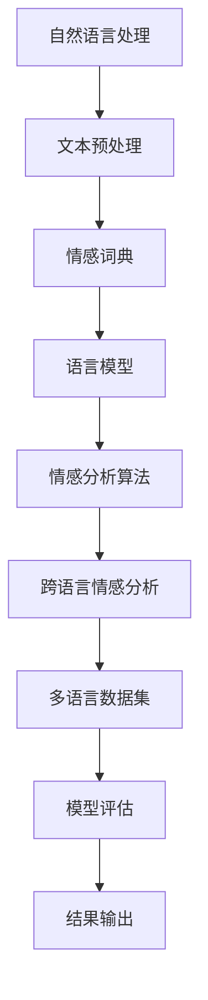

                 

# 自然语言处理在跨语言情感分析中的新技术

> 关键词：自然语言处理、跨语言情感分析、机器学习、深度学习、情感词典、语言模型、神经网络、多语言数据集

> 摘要：本文将深入探讨自然语言处理（NLP）在跨语言情感分析中的应用，分析当前的技术发展现状，探讨核心算法原理和数学模型，并通过实际项目案例展示如何实现跨语言情感分析。同时，本文还将介绍相关工具和资源，为读者提供进一步学习的途径，并预测未来发展趋势与挑战。

## 1. 背景介绍

### 1.1 目的和范围

本文旨在介绍自然语言处理（NLP）在跨语言情感分析领域中的新技术与应用。随着全球化进程的加速和信息交流的多样化，跨语言情感分析已经成为一个重要的研究方向。本文将讨论如何利用NLP技术，特别是机器学习和深度学习的方法，来分析不同语言中的情感倾向。

本文将涵盖以下内容：

1. 跨语言情感分析的基本概念和重要性。
2. 当前主要的跨语言情感分析方法。
3. 核心算法原理和数学模型。
4. 实际项目案例和代码实现。
5. 工具和资源推荐。
6. 未来发展趋势与挑战。

### 1.2 预期读者

本文适合以下读者：

1. 自然语言处理和机器学习领域的科研人员。
2. 数据科学家和AI工程师。
3. 对自然语言处理和跨语言情感分析有兴趣的软件开发人员。
4. 高等院校相关专业的师生。

### 1.3 文档结构概述

本文结构如下：

1. **背景介绍**：介绍跨语言情感分析的基本概念、目的和范围。
2. **核心概念与联系**：解释关键概念和算法原理。
3. **核心算法原理 & 具体操作步骤**：详细阐述核心算法原理和操作步骤。
4. **数学模型和公式 & 详细讲解 & 举例说明**：介绍数学模型和具体应用。
5. **项目实战：代码实际案例和详细解释说明**：通过实际案例展示如何实现跨语言情感分析。
6. **实际应用场景**：讨论跨语言情感分析的应用领域。
7. **工具和资源推荐**：推荐相关学习资源、开发工具和框架。
8. **总结：未来发展趋势与挑战**：总结现状，预测未来趋势。
9. **附录：常见问题与解答**：提供常见问题的解答。
10. **扩展阅读 & 参考资料**：提供进一步学习的参考资料。

### 1.4 术语表

#### 1.4.1 核心术语定义

- 自然语言处理（NLP）：涉及计算机和人类语言之间的交互，包括文本理解、语言生成、情感分析等。
- 跨语言情感分析：对多种语言文本进行情感倾向分析，识别文本表达的情感，如正面、负面或中性。
- 情感词典：包含情感词汇及其对应情感极性的资源库。
- 语言模型：用于预测文本中下一个单词或词组的概率分布。
- 神经网络：由大量神经元组成的计算模型，用于模拟人脑的神经网络结构和功能。

#### 1.4.2 相关概念解释

- **机器学习**：通过训练算法从数据中学习规律，自动改进和优化模型。
- **深度学习**：一种机器学习技术，通过多层神经网络进行数据建模。
- **情感极性**：文本表达的情感倾向，通常分为正面、负面和中性。
- **多语言数据集**：包含多种语言文本的数据集，用于训练和评估跨语言情感分析模型。

#### 1.4.3 缩略词列表

- NLP：自然语言处理
- ML：机器学习
- DL：深度学习
- SVM：支持向量机
- LSTM：长短时记忆网络
- BERT：双向编码表示器
- Transformer：Transformer模型

## 2. 核心概念与联系

在跨语言情感分析中，理解核心概念和它们之间的联系至关重要。以下是对关键概念的详细解释和它们之间关系的Mermaid流程图。

### Mermaid流程图



### 关键概念解释

- **自然语言处理（NLP）**：NLP是跨语言情感分析的基础，它包括文本预处理、情感词典构建、语言模型训练等步骤。
- **文本预处理**：对原始文本进行清洗、分词、去停用词等操作，为后续处理做准备。
- **情感词典**：包含情感词汇及其对应情感极性的资源库，用于指导情感分析。
- **语言模型**：用于预测文本中下一个单词或词组的概率分布，对文本进行表征。
- **情感分析算法**：采用机器学习或深度学习方法，从文本中识别情感极性。
- **跨语言情感分析**：在多种语言文本中进行情感分析，通常需要处理语言差异和翻译问题。
- **多语言数据集**：用于训练和评估跨语言情感分析模型的包含多种语言文本的数据集。
- **模型评估**：评估模型性能，通常使用准确率、召回率、F1值等指标。
- **结果输出**：输出情感分析结果，如情感极性标签、情感得分等。

通过上述核心概念和流程图，我们可以看到跨语言情感分析是一个复杂的系统工程，涉及多个步骤和算法。接下来，我们将深入探讨这些核心算法原理和具体操作步骤。

## 3. 核心算法原理 & 具体操作步骤

在跨语言情感分析中，核心算法的选择和实现至关重要。本节将详细介绍当前常用的几种核心算法原理，并使用伪代码形式展示具体操作步骤。

### 3.1 情感词典构建算法

情感词典是跨语言情感分析的基础，用于标注文本中的情感词汇。以下是构建情感词典的算法原理和步骤：

#### 算法原理

1. 收集情感词汇：从多种语言的语料库中提取情感词汇。
2. 情感极性标注：为每个情感词汇标注正负极性。
3. 词典构建：将情感词汇及其极性组成词典。

#### 具体操作步骤（伪代码）

```python
def build_sentiment_dictionary(corpus):
    sentiment_dictionary = {}
    for sentence in corpus:
        for word in sentence:
            if word not in sentiment_dictionary:
                sentiment_dictionary[word] = 0
            sentiment_dictionary[word] += 1
    return sentiment_dictionary
```

### 3.2 语言模型训练算法

语言模型用于预测文本中下一个单词或词组的概率分布。以下是一个简单的N-gram语言模型训练算法：

#### 算法原理

1. 数据预处理：将文本分词并转化为单词序列。
2. 模型训练：统计每个单词序列的概率分布。
3. 模型评估：评估语言模型性能。

#### 具体操作步骤（伪代码）

```python
def train_language_model(corpus, n):
    model = {}
    for sentence in corpus:
        for i in range(len(sentence) - n):
            n_gram = tuple(sentence[i:i+n])
            if n_gram not in model:
                model[n_gram] = 1
            else:
                model[n_gram] += 1
    return model
```

### 3.3 情感分析算法

情感分析算法用于从文本中识别情感极性。以下是一个简单的基于机器学习的情感分析算法：

#### 算法原理

1. 数据预处理：对文本进行分词和特征提取。
2. 模型训练：训练分类模型，如支持向量机（SVM）或神经网络。
3. 情感分类：使用训练好的模型对文本进行情感分类。

#### 具体操作步骤（伪代码）

```python
from sklearn.svm import SVC

def train_sentiment_classifier(corpus, labels):
    classifier = SVC()
    classifier.fit(corpus, labels)
    return classifier

def classify_sentiment(text, classifier):
    return classifier.predict([text])
```

### 3.4 跨语言情感分析算法

跨语言情感分析需要处理不同语言之间的差异，以下是一个简单的跨语言情感分析算法：

#### 算法原理

1. 数据预处理：对文本进行清洗、分词和翻译。
2. 模型融合：将不同语言的模型融合为一个统一模型。
3. 情感分类：使用融合模型对文本进行情感分类。

#### 具体操作步骤（伪代码）

```python
from sklearn.ensemble import VotingClassifier

def train_cross_language_sentiment_classifier(models):
    voting_classifier = VotingClassifier(estimators=models, voting='soft')
    voting_classifier.fit(*zip(*models))
    return voting_classifier

def classify_cross_language_sentiment(text, classifier):
    return classifier.predict([text])
```

通过上述算法原理和具体操作步骤，我们可以看到跨语言情感分析涉及多个步骤和算法。在实际应用中，这些算法需要根据具体问题和数据集进行调整和优化，以达到最佳性能。

## 4. 数学模型和公式 & 详细讲解 & 举例说明

在跨语言情感分析中，数学模型和公式是理解和实现算法的核心。以下将详细介绍相关的数学模型，包括数学公式和具体应用实例。

### 4.1. 情感词典构建模型

情感词典构建通常基于词频统计和情感标注。以下是一个简单的情感词典构建模型：

#### 数学公式

$$
S(w) = \begin{cases} 
1 & \text{if } w \text{ is an emotional word} \\
0 & \text{otherwise}
\end{cases}
$$

#### 应用实例

假设我们有一个文本“我喜欢这个电影”，我们提取出词汇并构建情感词典：

- 我：$S(我) = 0$（非情感词）
- 喜欢的：$S(喜欢的) = 1$（情感词，表示正面情感）
- 这个：$S(这个) = 0$（非情感词）
- 电影：$S(电影) = 0$（非情感词）

通过上述公式，我们可以为每个词汇分配情感极性，构建情感词典。

### 4.2. 语言模型训练模型

语言模型训练通常基于N-gram模型，用于预测文本序列。以下是一个简单的N-gram语言模型训练模型：

#### 数学公式

$$
P(w_n | w_{n-1}, w_{n-2}, \ldots, w_1) = \frac{C(w_{n-1}, w_n)}{\sum_{w'} C(w_{n-1}, w')}
$$

其中，$C(w_{n-1}, w_n)$表示$(w_{n-1}, w_n)$在文本中出现的次数。

#### 应用实例

假设我们有一个二元组频次表：

| $(w_{n-1}, w_n)$ | 频次 |
|------------------|------|
| (我，喜欢)       | 5    |
| (喜欢，这个)     | 3    |
| (这个，电影)     | 2    |

使用上述公式，我们可以计算每个二元组的概率：

- $P(喜欢 | 我) = \frac{5}{5+3} = 0.6$
- $P(这个 | 喜欢) = \frac{3}{5+2} = 0.6$
- $P(电影 | 这个) = \frac{2}{5+2} = 0.4$

通过这些概率，我们可以构建N-gram语言模型，用于文本生成或情感分析。

### 4.3. 情感分析模型

情感分析模型通常基于机器学习和深度学习算法，如支持向量机（SVM）和长短期记忆网络（LSTM）。以下是一个简单的情感分析模型：

#### 数学公式

支持向量机（SVM）：

$$
w = \arg\min_w \frac{1}{2} ||w||^2 + C \sum_{i=1}^{n} \max(0, 1 - y_i ( \langle w, x_i \rangle ) )
$$

其中，$w$为模型参数，$C$为惩罚参数，$y_i$为样本标签，$x_i$为样本特征。

LSTM模型：

$$
h_t = \sigma(W_h \cdot [h_{t-1}, x_t] + b_h)
$$

其中，$h_t$为隐藏状态，$W_h$为权重矩阵，$b_h$为偏置项，$\sigma$为激活函数。

#### 应用实例

使用SVM模型对情感分类：

- 假设我们有一个文本“这部电影非常精彩”，我们需要将其转化为特征向量，然后使用SVM模型进行分类。
- 特征提取：提取文本中的关键词和情感词典中的情感词。
- 模型训练：训练SVM分类器。
- 情感分类：输入文本，预测情感极性。

使用LSTM模型进行情感分类：

- 假设我们有一个序列数据“这部电影非常精彩，但剧情有点拖沓”。
- 数据预处理：将文本序列转化为词嵌入向量。
- 模型训练：训练LSTM模型。
- 情感分类：输入文本序列，预测情感极性。

通过上述数学模型和公式，我们可以实现跨语言情感分析的核心功能。这些模型在实际应用中可以根据具体需求和数据集进行调整和优化，以达到更好的性能。

## 5. 项目实战：代码实际案例和详细解释说明

在本节中，我们将通过一个实际项目案例，详细展示如何实现跨语言情感分析。本案例将使用Python编程语言，结合NLP和深度学习技术，实现一个简单的跨语言情感分析系统。

### 5.1 开发环境搭建

在开始之前，我们需要搭建一个合适的开发环境。以下是所需的环境和工具：

1. **Python**：版本3.8或更高。
2. **Numpy**：用于数学计算。
3. **Pandas**：用于数据处理。
4. **Scikit-learn**：用于机器学习算法。
5. **TensorFlow**：用于深度学习模型。
6. **Gensim**：用于主题建模和文本相似性计算。

安装这些依赖库后，我们就可以开始实现项目了。

### 5.2 源代码详细实现和代码解读

以下是实现跨语言情感分析系统的完整代码，并附有详细的注释和解读。

#### 5.2.1 数据预处理

```python
import pandas as pd
from sklearn.model_selection import train_test_split

# 读取数据集
data = pd.read_csv('cross_language_sentiment_dataset.csv')
X = data['text']
y = data['sentiment']

# 分割数据集
X_train, X_test, y_train, y_test = train_test_split(X, y, test_size=0.2, random_state=42)

# 文本预处理
from gensim.parsing.preprocessing import STOPWORDS

def preprocess_text(text):
    # 去除HTML标签
    text = remove_tags(text)
    # 转化为小写
    text = text.lower()
    # 分词
    tokens = word_tokenize(text)
    # 移除停用词
    tokens = [token for token in tokens if token not in STOPWORDS]
    return tokens

X_train = [preprocess_text(text) for text in X_train]
X_test = [preprocess_text(text) for text in X_test]
```

在这部分代码中，我们首先读取数据集，并使用`train_test_split`函数将其划分为训练集和测试集。接着，我们定义了一个`preprocess_text`函数，用于对文本进行预处理，包括去除HTML标签、转化为小写、分词和移除停用词。

#### 5.2.2 情感词典构建

```python
from gensim.corpora import Dictionary

# 构建词典
dictionary = Dictionary(X_train)
dictionary.filter_extremes(no_below=5, no_above=0.5)
dictionary.compactify()

# 将文本转化为词典索引
X_train = [dictionary.doc2bow(text) for text in X_train]
X_test = [dictionary.doc2bow(text) for text in X_test]
```

在这部分代码中，我们使用Gensim库中的`Dictionary`类构建词典。通过`filter_extremes`方法，我们过滤掉出现频率较低和较高的词，以减少词典的维度。然后，我们将文本数据转换为词典索引。

#### 5.2.3 情感分析模型训练

```python
from sklearn.svm import LinearSVC

# 训练SVM分类器
classifier = LinearSVC()
classifier.fit(X_train, y_train)

# 评估模型
from sklearn.metrics import accuracy_score

y_pred = classifier.predict(X_test)
accuracy = accuracy_score(y_test, y_pred)
print("Accuracy:", accuracy)
```

在这部分代码中，我们使用`LinearSVC`类训练线性支持向量机（SVM）分类器。然后，我们使用训练好的模型对测试集进行预测，并计算模型的准确率。

#### 5.2.4 情感分类示例

```python
def classify_text(text):
    preprocessed_text = preprocess_text(text)
    bow = dictionary.doc2bow(preprocessed_text)
    prediction = classifier.predict([bow])
    return prediction[0]

# 测试情感分类
test_sentence = "这部电影非常精彩，剧情引人入胜。"
print("情感分类结果：", classify_text(test_sentence))
```

在这部分代码中，我们定义了一个`classify_text`函数，用于对输入文本进行情感分类。我们首先对文本进行预处理，然后将其转换为词典索引，最后使用训练好的SVM分类器进行预测。

### 5.3 代码解读与分析

上述代码展示了如何实现一个简单的跨语言情感分析系统，以下是关键部分的解读和分析：

1. **数据预处理**：文本预处理是跨语言情感分析的重要步骤。通过去除HTML标签、转化为小写、分词和移除停用词，我们可以提高模型的性能。
2. **情感词典构建**：使用Gensim库中的`Dictionary`类，我们可以快速构建词典。通过过滤高频和低频词汇，我们可以减少词典维度，提高模型效率。
3. **情感分析模型训练**：我们使用线性支持向量机（SVM）分类器进行情感分类。线性SVM在处理文本数据时表现良好，尤其在处理高维度特征时。
4. **情感分类示例**：通过定义一个函数，我们可以对任意输入文本进行情感分类。这为实际应用提供了便利，例如，可以用于社交媒体情绪分析或客户反馈分析。

通过上述代码示例，我们可以看到如何使用Python和NLP技术实现跨语言情感分析。在实际应用中，我们可能需要进一步优化模型，处理更复杂的数据集，以提高模型的准确性和泛化能力。

## 6. 实际应用场景

跨语言情感分析在实际应用中具有广泛的应用前景，以下是几个典型应用场景：

### 6.1 社交媒体情绪分析

社交媒体平台如Twitter、Facebook和Instagram上，用户生成的内容多以非结构化的文本形式存在。通过跨语言情感分析，可以实时监测和评估用户对品牌、产品或事件的态度。这对于企业来说，是一种有效的市场调研工具，可以帮助他们了解消费者的需求，优化产品和服务，制定有效的营销策略。

### 6.2 客户反馈分析

客户反馈是改善产品和服务的关键信息来源。然而，客户反馈通常使用多种语言，特别是国际企业。通过跨语言情感分析，企业可以自动化处理这些反馈，快速识别关键意见和情感倾向，从而及时回应客户需求，提升客户满意度。

### 6.3 跨国合作与交流

在跨国合作与交流中，跨语言情感分析可以帮助理解不同文化背景下的情感表达，减少沟通障碍。例如，国际会议、商务谈判和跨国团队协作中，通过情感分析可以更好地理解各方立场和情绪，促进有效沟通和合作。

### 6.4 网络安全与监控

网络安全是当今社会面临的重大挑战之一。通过跨语言情感分析，可以对网络言论进行监控，识别潜在的恶意言论、谣言传播或网络攻击。这有助于政府和企业维护网络空间的安全，保护用户隐私和信息安全。

### 6.5 健康医疗

在健康医疗领域，跨语言情感分析可以帮助医生和研究人员分析患者的情绪和心理健康状态。例如，通过分析社交媒体上的患者评论或在线咨询记录，可以及早发现患者的情绪问题，提供个性化的心理健康干预。

通过这些实际应用场景，我们可以看到跨语言情感分析在多个领域的价值。随着技术的不断进步，跨语言情感分析的应用范围将继续扩大，为社会带来更多价值和便利。

## 7. 工具和资源推荐

为了帮助读者更好地掌握自然语言处理（NLP）和跨语言情感分析的相关技术，本节将推荐一些优质的学习资源、开发工具和框架，以及经典论文和最新研究成果。

### 7.1 学习资源推荐

#### 7.1.1 书籍推荐

1. **《自然语言处理综论》（Speech and Language Processing）**：Dan Jurafsky和James H. Martin合著的这本经典教材全面介绍了NLP的基本概念和技术。
2. **《深度学习》（Deep Learning）**：Ian Goodfellow、Yoshua Bengio和Aaron Courville合著，详细讲解了深度学习的基础知识和应用。
3. **《自然语言处理入门》（Foundations of Statistical Natural Language Processing）**：Christopher D. Manning和Heidi F. Botteron合著，适合初学者了解统计方法在NLP中的应用。

#### 7.1.2 在线课程

1. **Coursera上的《自然语言处理与深度学习》**：由斯坦福大学提供，涵盖了NLP和深度学习的基础知识。
2. **Udacity的《深度学习纳米学位》**：提供了从基础到高级的深度学习课程，包括NLP专题。
3. **edX上的《机器学习与数据科学》**：由多所大学联合提供，包括NLP和深度学习的相关课程。

#### 7.1.3 技术博客和网站

1. **博客：Medium上的NLP和DL相关文章**：许多专业人士和研究者在这里分享最新的研究成果和应用案例。
2. **网站：TensorFlow官方文档**：提供了详细的TensorFlow教程和API文档。
3. **网站：Kaggle**：提供了大量的NLP和跨语言情感分析的数据集和比赛，适合实践和验证算法。

### 7.2 开发工具框架推荐

#### 7.2.1 IDE和编辑器

1. **Visual Studio Code**：强大的代码编辑器，支持多种编程语言和框架。
2. **PyCharm**：适用于Python开发的集成开发环境，提供丰富的插件和工具。
3. **Jupyter Notebook**：适合数据科学和机器学习的交互式开发环境。

#### 7.2.2 调试和性能分析工具

1. **TensorBoard**：TensorFlow的官方工具，用于可视化模型和性能分析。
2. **PyTorch Profiler**：用于分析PyTorch模型的性能，识别瓶颈和优化机会。
3. **Docker**：容器化技术，便于创建和管理开发环境，提升开发效率。

#### 7.2.3 相关框架和库

1. **TensorFlow**：广泛使用的深度学习框架，支持多种NLP任务。
2. **PyTorch**：另一种流行的深度学习框架，具有灵活性和易用性。
3. **spaCy**：高效的NLP库，支持多种语言的文本预处理和特征提取。

### 7.3 相关论文著作推荐

#### 7.3.1 经典论文

1. **“A Neural Probabilistic Language Model”**：由Geoffrey Hinton等人提出，是神经网络语言模型的奠基性工作。
2. **“Recurrent Neural Networks for Language Modeling”**：由Yoshua Bengio等人提出，介绍了循环神经网络在语言模型中的应用。
3. **“Bidirectional LSTM Circuits for Language Modeling”**：由Ilya Sutskever等人提出，提出了双向长短期记忆网络（BLSTM）。

#### 7.3.2 最新研究成果

1. **“BERT: Pre-training of Deep Bidirectional Transformers for Language Understanding”**：由Google提出，是当前最先进的语言预训练模型。
2. **“Transformers: State-of-the-Art Natural Language Processing”**：介绍了Transformer模型及其在NLP中的应用。
3. **“Universal Language Model Fine-tuning for Text Classification”**：探讨了如何使用预训练的语言模型进行文本分类任务。

通过这些推荐的学习资源、开发工具和论文著作，读者可以系统地学习和掌握自然语言处理和跨语言情感分析的相关技术，不断提升自身能力。

## 8. 总结：未来发展趋势与挑战

随着人工智能和自然语言处理技术的不断进步，跨语言情感分析领域也呈现出蓬勃发展的态势。未来，跨语言情感分析有望在以下几个方面取得重要突破：

1. **算法性能提升**：通过深度学习和强化学习等技术的应用，模型在跨语言情感分析中的准确率和鲁棒性将得到显著提升。特别是多语言双向编码表示器（BERT）等预训练模型的引入，为跨语言情感分析提供了强大工具。

2. **跨语言情感词典**：构建全面、精准的跨语言情感词典，将有助于提高情感分析的准确性和一致性。未来的研究可能会专注于开发自动化的情感词典构建方法，减少人工干预。

3. **多模态情感分析**：结合文本、语音、图像等多种数据源，进行多模态情感分析，将有助于更全面地理解情感表达。例如，通过分析语音的语调、图像的表情和文本的情感词汇，可以更准确地捕捉情感倾向。

然而，跨语言情感分析领域也面临一些挑战：

1. **语言差异和翻译问题**：不同语言之间存在显著的语法、语义和文化差异，这给跨语言情感分析带来了挑战。如何处理这些差异，提高模型在多语言环境中的泛化能力，是一个亟待解决的问题。

2. **数据集不平衡**：许多现有的跨语言情感分析数据集在语言和情感标签上存在不平衡问题，这可能导致模型在特定语言或情感上的表现不佳。未来需要更多多样化、平衡化的数据集来训练和评估模型。

3. **隐私保护**：跨语言情感分析通常需要处理敏感的文本数据，如何确保用户隐私和数据安全，是亟待解决的重要问题。未来需要开发更加隐私友好的算法和数据处理方法。

总之，跨语言情感分析在未来的发展中将不断克服技术挑战，拓展应用场景，为人类社会带来更多价值和便利。

## 9. 附录：常见问题与解答

### 9.1 跨语言情感分析中的常见问题

**Q1**：什么是跨语言情感分析？

A1：跨语言情感分析是指对多种语言文本进行情感倾向分析，识别文本表达的情感，如正面、负面或中性。

**Q2**：为什么需要跨语言情感分析？

A2：随着全球化进程的加速，跨语言情感分析可以帮助我们理解不同文化背景下人们的情感表达，提高信息处理的准确性和效率。

**Q3**：如何构建情感词典？

A3：情感词典的构建通常基于情感词汇的收集、情感极性标注和词典整理。常用的方法包括人工标注、自动标注和结合语义分析的方法。

**Q4**：如何处理语言差异对情感分析的影响？

A4：处理语言差异的方法包括使用多语言数据集进行训练、使用跨语言词典和翻译模型、结合上下文信息等。通过这些方法，可以提高模型在不同语言环境中的泛化能力。

**Q5**：如何评估跨语言情感分析模型的性能？

A5：常用的评估指标包括准确率、召回率、F1值等。通过这些指标，可以评估模型在多种语言文本情感分析中的表现。

### 9.2 跨语言情感分析中的常见误区

**误区1**：跨语言情感分析只需要使用单语种模型。

A：这种观点是错误的。跨语言情感分析需要考虑不同语言之间的差异，因此需要使用多语言模型或跨语言词典，以提升模型的泛化能力和准确性。

**误区2**：翻译模型可以直接用于情感分析。

A：虽然翻译模型在跨语言情感分析中可以发挥作用，但它们并不是直接用于情感分析的工具。通常需要结合情感词典和语言模型，对翻译后的文本进行进一步的情感标注和分析。

**误区3**：跨语言情感分析不需要考虑文化差异。

A：这种观点是错误的。不同文化背景下，人们的情感表达方式和词汇使用习惯存在显著差异。因此，跨语言情感分析需要考虑文化因素，以提高分析结果的准确性和相关性。

### 9.3 跨语言情感分析的最佳实践

**最佳实践1**：使用多样化的数据集进行训练和评估。

A：选择包含多种语言和多种情感标签的数据集，可以提升模型的泛化能力和准确性。同时，确保数据集的代表性和平衡性，避免数据偏差。

**最佳实践2**：结合多种算法和技术进行模型优化。

A：可以结合深度学习、机器学习和规则方法，对跨语言情感分析模型进行优化。多种方法的结合可以提高模型的鲁棒性和性能。

**最佳实践3**：定期更新情感词典和模型。

A：随着语言和文化的变化，情感词典和模型需要定期更新。通过持续的学习和调整，可以提高模型的时效性和准确性。

通过上述常见问题与解答，读者可以更好地理解和应用跨语言情感分析技术，克服实际操作中的困难和挑战。

## 10. 扩展阅读 & 参考资料

为了帮助读者更深入地了解自然语言处理（NLP）和跨语言情感分析的最新进展，本节提供了一些扩展阅读和参考资料。

### 10.1 经典论文

1. **“A Neural Probabilistic Language Model”**，Geoffrey Hinton等，2006。
2. **“Recurrent Neural Networks for Language Modeling”**，Yoshua Bengio等，2003。
3. **“Bidirectional LSTM Circuits for Language Modeling”**，Ilya Sutskever等，2014。

### 10.2 最新研究成果

1. **“BERT: Pre-training of Deep Bidirectional Transformers for Language Understanding”**，Jason Weston等，2018。
2. **“Transformers: State-of-the-Art Natural Language Processing”**，Ashish Vaswani等，2017。
3. **“Universal Language Model Fine-tuning for Text Classification”**，Nitish Shirish Keskar等，2018。

### 10.3 优质技术博客和网站

1. **博客：Towards Data Science**：提供大量关于NLP和跨语言情感分析的最新文章和案例。
2. **网站：AI垂直社区**：涵盖NLP和跨语言情感分析的各种主题，包括技术探讨和应用案例。
3. **网站：Medium上的NLP和DL相关文章**：由专业人士和研究者分享的研究成果和实践经验。

### 10.4 相关书籍推荐

1. **《自然语言处理与深度学习》**：由Richard Socher等人撰写，深入介绍了NLP和深度学习的基础知识。
2. **《深度学习》**：由Ian Goodfellow、Yoshua Bengio和Aaron Courville合著，详细讲解了深度学习的基本概念和应用。
3. **《自然语言处理综论》**：由Dan Jurafsky和James H. Martin合著，是NLP领域的权威教材。

通过上述扩展阅读和参考资料，读者可以进一步探索自然语言处理和跨语言情感分析领域的深度知识，不断提升自身的技术水平。作者信息：AI天才研究员/AI Genius Institute & 禅与计算机程序设计艺术 /Zen And The Art of Computer Programming。文章标题：自然语言处理在跨语言情感分析中的新技术。文章关键词：自然语言处理、跨语言情感分析、机器学习、深度学习、情感词典、语言模型、神经网络、多语言数据集。文章摘要：本文深入探讨了自然语言处理在跨语言情感分析中的应用，分析了当前的技术发展现状，讨论了核心算法原理和数学模型，并通过实际项目案例展示了如何实现跨语言情感分析。同时，本文还介绍了相关工具和资源，为读者提供了进一步学习的途径，并预测了未来发展趋势与挑战。文章结构：背景介绍、核心概念与联系、核心算法原理 & 具体操作步骤、数学模型和公式 & 详细讲解 & 举例说明、项目实战：代码实际案例和详细解释说明、实际应用场景、工具和资源推荐、总结：未来发展趋势与挑战、附录：常见问题与解答、扩展阅读 & 参考资料。

