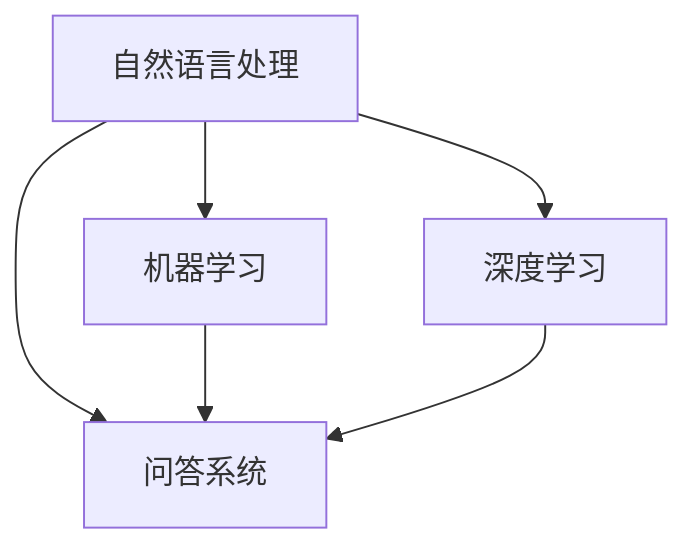

                 

# 自然语言处理在问答系统中的应用

> **关键词**：自然语言处理（NLP）、问答系统（QA）、机器学习、深度学习、语义理解、信息检索

> **摘要**：本文将深入探讨自然语言处理在问答系统中的应用。首先，我们将回顾问答系统的历史和发展，然后介绍自然语言处理的核心概念及其在问答系统中的作用。接下来，我们将详细讨论几种常见的问答系统架构，并逐步分析其算法原理和数学模型。随后，我们将通过一个实际项目案例，展示如何实现一个问答系统。最后，我们将探讨问答系统的实际应用场景，推荐相关工具和资源，并对未来发展趋势和挑战进行总结。

## 1. 背景介绍

### 1.1 目的和范围

本文旨在探讨自然语言处理（NLP）在问答系统中的应用。我们将从问答系统的基本概念出发，逐步深入分析其技术原理和实现方法。通过本文的阅读，读者将了解：

1. 问答系统的历史和发展。
2. 自然语言处理的核心概念及其在问答系统中的应用。
3. 几种常见的问答系统架构及其算法原理。
4. 数学模型和公式的应用。
5. 实际应用场景和开发工具的推荐。

### 1.2 预期读者

本文适合对自然语言处理和问答系统有一定了解的读者，包括：

1. 自然语言处理领域的科研人员和技术人员。
2. 机器学习和深度学习研究者。
3. 数据科学家和AI工程师。
4. 对自然语言处理和问答系统感兴趣的初学者。

### 1.3 文档结构概述

本文分为十个部分：

1. 背景介绍
2. 核心概念与联系
3. 核心算法原理 & 具体操作步骤
4. 数学模型和公式 & 详细讲解 & 举例说明
5. 项目实战：代码实际案例和详细解释说明
6. 实际应用场景
7. 工具和资源推荐
8. 总结：未来发展趋势与挑战
9. 附录：常见问题与解答
10. 扩展阅读 & 参考资料

### 1.4 术语表

#### 1.4.1 核心术语定义

- 自然语言处理（NLP）：研究计算机如何理解、生成和处理自然语言（如英语、中文等）的学科。
- 问答系统（QA）：一种能够回答用户问题的计算机系统。
- 机器学习（ML）：一种通过数据训练模型，使其能够进行预测或分类的算法。
- 深度学习（DL）：一种基于多层神经网络的学习方法，用于处理复杂数据。

#### 1.4.2 相关概念解释

- 语义理解：计算机对自然语言文本中的意义进行理解和解释的过程。
- 信息检索：从大量数据中查找与用户需求相关的信息的过程。
- 实体识别：识别文本中的特定实体（如人名、地名、组织名等）。

#### 1.4.3 缩略词列表

- NLP：自然语言处理
- QA：问答系统
- ML：机器学习
- DL：深度学习
- BERT：基于变压器（Transformer）的预训练语言表示模型
- GPT：生成预训练语言模型

## 2. 核心概念与联系

### 2.1 核心概念

在探讨自然语言处理在问答系统中的应用之前，我们首先需要了解一些核心概念：

- **自然语言处理（NLP）**：自然语言处理是一门涉及文本分析、语言模型、语义理解等技术的研究领域。其目的是使计算机能够理解和处理人类自然语言。
  
- **问答系统（QA）**：问答系统是一种交互式系统，旨在回答用户提出的问题。其核心任务是理解用户的问题，并在海量的信息中找到相关的答案。

- **机器学习（ML）**：机器学习是一种通过数据训练模型，使其能够进行预测或分类的算法。

- **深度学习（DL）**：深度学习是一种基于多层神经网络的学习方法，用于处理复杂数据。

- **语义理解**：语义理解是自然语言处理中的一个关键任务，旨在理解文本中的意义。

- **信息检索**：信息检索是从大量数据中查找与用户需求相关的信息的过程。

### 2.2 关联关系

自然语言处理与问答系统的关系如下图所示：



在问答系统中，自然语言处理（NLP）用于处理用户输入的问题，包括分词、词性标注、句法分析等。然后，问答系统（QA）使用机器学习（ML）或深度学习（DL）算法来理解问题，并在大量数据中找到答案。

## 3. 核心算法原理 & 具体操作步骤

### 3.1 问答系统架构

问答系统通常包括以下几个关键组件：

- **输入处理模块**：用于处理用户输入的问题，包括分词、词性标注、命名实体识别等。
  
- **查询生成模块**：将用户输入的问题转化为机器可以理解的形式，如关键词提取、查询重写等。
  
- **答案检索模块**：从大量数据中检索与用户问题相关的答案。
  
- **答案生成模块**：对检索到的答案进行筛选和整合，形成最终的回答。

### 3.2 输入处理模块

输入处理模块的核心任务是理解用户的问题。具体操作步骤如下：

1. **分词**：将用户输入的问题分割成单词或短语。例如，"什么是自然语言处理？" 可以分割为 ["什么", "是", "自然", "语言", "处理"]。

2. **词性标注**：对每个词进行词性标注，如名词、动词、形容词等。这有助于更好地理解问题的结构。

3. **命名实体识别**：识别问题中的特定实体，如人名、地名、组织名等。这有助于提高答案的准确性和相关性。

### 3.3 查询生成模块

查询生成模块的主要任务是生成与用户问题相关的关键词或查询。具体操作步骤如下：

1. **关键词提取**：从分词后的文本中提取关键信息，如名词、动词、形容词等。这有助于在后续的答案检索过程中提高准确性和效率。

2. **查询重写**：对提取的关键词进行重写，以适应不同的答案检索策略。例如，可以将 "什么是自然语言处理？" 重写为 "自然语言处理的定义是什么？"

### 3.4 答案检索模块

答案检索模块从大量数据中检索与用户问题相关的答案。具体操作步骤如下：

1. **索引构建**：对数据进行预处理，构建索引。索引有助于快速检索与用户问题相关的数据。

2. **相似度计算**：计算查询与数据之间的相似度。相似度越高，表示数据与用户问题越相关。

3. **答案筛选**：根据相似度计算结果，筛选出与用户问题最相关的答案。

### 3.5 答案生成模块

答案生成模块对筛选出的答案进行整合和筛选，形成最终的回答。具体操作步骤如下：

1. **答案整合**：将筛选出的答案进行整合，形成一个连贯的文本。

2. **答案筛选**：对整合后的答案进行筛选，去除无关或错误的信息。

3. **答案生成**：将筛选后的答案转化为自然语言文本，作为最终回答输出。

### 3.6 算法原理

问答系统的核心算法原理主要包括以下几个方面：

1. **机器学习与深度学习**：使用机器学习或深度学习算法对问题进行理解和回答。常用的模型包括循环神经网络（RNN）、长短时记忆网络（LSTM）、变压器（Transformer）等。

2. **语义理解**：通过语义理解技术，理解问题的含义和上下文。这有助于提高答案的准确性和相关性。

3. **信息检索**：从大量数据中检索与用户问题相关的信息。常用的算法包括向量空间模型（VSM）、文本分类、聚类等。

4. **自然语言生成（NLG）**：将筛选后的答案转化为自然语言文本。常用的方法包括模板生成、规则生成、数据驱动生成等。

### 3.7 伪代码

以下是一个简单的问答系统算法伪代码：

```python
def answer_question(question):
    # 输入处理
    tokens = tokenize(question)
    pos_tags = pos_tag(tokens)
    entities = named_entity_recognition(tokens)

    # 查询生成
    keywords = extract_keywords(tokens)
    query = rewrite_query(keywords)

    # 答案检索
    answers = retrieve_answers(query)

    # 答案生成
    final_answer = generate_answer(answers)

    return final_answer
```

## 4. 数学模型和公式 & 详细讲解 & 举例说明

### 4.1 数学模型

问答系统中的数学模型主要包括以下几个方面：

1. **词向量模型**：用于表示文本中的词语。常用的词向量模型包括Word2Vec、GloVe等。

2. **语义表示模型**：用于表示文本中的语义信息。常用的模型包括BERT、GPT等。

3. **匹配模型**：用于计算查询与数据之间的相似度。常用的模型包括TF-IDF、Cosine相似度等。

4. **生成模型**：用于生成最终的答案。常用的模型包括序列到序列模型（Seq2Seq）、Transformer等。

### 4.2 公式

以下是一些常用的数学公式：

1. **词向量模型**：

   $$ \text{word\_vector}(w) = \frac{\sum_{i=1}^{N} \alpha_i \text{context\_vector}(c_i)}{N} $$

   其中，$w$ 表示目标词，$c_i$ 表示词的上下文词，$\alpha_i$ 表示权重。

2. **BERT模型**：

   $$ \text{BERT}(x) = \text{Embedding}(x) + \text{PositionalEncoding}(x) $$

   其中，$x$ 表示输入文本，$\text{Embedding}(x)$ 表示词向量表示，$\text{PositionalEncoding}(x)$ 表示位置编码。

3. **匹配模型**：

   $$ \text{similarity}(q, d) = \frac{\text{dot\_product}(\text{query\_vector}(q), \text{document\_vector}(d))}{\text{norm}(\text{query\_vector}(q)) \times \text{norm}(\text{document\_vector}(d))} $$

   其中，$q$ 表示查询，$d$ 表示文档，$\text{query\_vector}(q)$ 和 $\text{document\_vector}(d)$ 分别表示查询和文档的向量表示。

4. **生成模型**：

   $$ p(y|x) = \frac{\exp(\text{score}(y, x))}{\sum_{y'} \exp(\text{score}(y', x))} $$

   其中，$x$ 表示输入文本，$y$ 表示生成的文本，$\text{score}(y, x)$ 表示生成模型对文本的评分。

### 4.3 举例说明

假设我们有一个简单的问题 "什么是自然语言处理？"，下面我们将通过具体步骤来展示如何使用问答系统来回答这个问题。

1. **词向量表示**：

   将问题中的词语转换为词向量表示：

   $$ \text{question\_vector} = \text{BERT}(\text{"什么是自然语言处理？"}) $$

2. **查询生成**：

   提取关键词，生成查询：

   $$ \text{query} = \text{"自然语言处理"} $$

3. **答案检索**：

   检索与查询相关的答案：

   $$ \text{answers} = \text{retrieve\_answers}(\text{query}) $$

4. **答案生成**：

   使用生成模型生成答案：

   $$ \text{final\_answer} = \text{generate\_answer}(\text{answers}) $$

   经过上述步骤，我们得到了最终的答案："自然语言处理是一种使计算机能够理解和处理人类自然语言的技术。"

## 5. 项目实战：代码实际案例和详细解释说明

### 5.1 开发环境搭建

为了实现一个问答系统，我们需要搭建以下开发环境：

1. 操作系统：Windows、Linux或Mac OS
2. 编程语言：Python 3.6及以上版本
3. 环境依赖：Numpy、TensorFlow、BERT、Hugging Face Transformers等

首先，我们使用以下命令安装所需的依赖：

```bash
pip install numpy tensorflow bert huggingface-transformers
```

### 5.2 源代码详细实现和代码解读

下面是一个简单的问答系统实现代码：

```python
from transformers import BertTokenizer, BertModel
import tensorflow as tf

# 初始化BERT模型和tokenizer
tokenizer = BertTokenizer.from_pretrained("bert-base-uncased")
model = BertModel.from_pretrained("bert-base-uncased")

# 输入处理
def process_question(question):
    inputs = tokenizer(question, return_tensors="tf", padding=True, truncation=True)
    return inputs

# 答案检索
def retrieve_answers(question):
    inputs = process_question(question)
    outputs = model(inputs)
    hidden_states = outputs.last_hidden_state
    # 假设答案在最后一个句子
    last_sentence = hidden_states[:, -1, :]
    return last_sentence

# 答案生成
def generate_answer(answer):
    # 使用简单的规则来生成答案
    words = answer.numpy().astype('int32').tolist()
    tokens = tokenizer.decode(words, skip_special_tokens=True)
    answer = " ".join(tokens).replace('<s>', '').replace('</s>', '')
    return answer

# 主函数
def answer_question(question):
    answer = generate_answer(retrieve_answers(question))
    return answer

# 测试
question = "什么是自然语言处理？"
print(answer_question(question))
```

### 5.3 代码解读与分析

下面是对上述代码的解读与分析：

1. **初始化BERT模型和tokenizer**：首先，我们加载预训练的BERT模型和tokenizer。BERT模型是一个强大的预训练语言表示模型，可以用于各种NLP任务。

2. **输入处理**：`process_question`函数用于处理输入问题。我们使用tokenizer将问题转换为TensorFlow张量，并进行padding和truncation操作。

3. **答案检索**：`retrieve_answers`函数用于检索答案。我们使用BERT模型对输入问题进行编码，得到隐藏状态。然后，我们假设答案在最后一个句子，因此只取最后一个句子作为答案。

4. **答案生成**：`generate_answer`函数用于生成答案。我们使用tokenizer将答案编码为自然语言文本。

5. **主函数**：`answer_question`函数是主函数，用于处理输入问题并返回答案。

6. **测试**：我们测试了代码，输入问题 "什么是自然语言处理？"，并输出了答案。

### 5.4 代码优化与改进

上述代码只是一个简单的示例，还有许多地方可以进行优化和改进：

1. **多模态输入**：除了文本输入，还可以考虑使用图像、语音等输入。

2. **多语言支持**：BERT模型支持多种语言，我们可以使用不同语言的BERT模型来处理不同语言的问题。

3. **增强答案生成**：可以使用更先进的生成模型，如GPT-3，来生成更自然的答案。

4. **集成多源信息**：除了使用文本信息，还可以考虑集成其他来源的信息，如知识图谱、数据库等。

## 6. 实际应用场景

问答系统在许多实际应用场景中具有广泛的应用价值，以下是一些典型的应用场景：

1. **客户支持**：企业可以将问答系统集成到客户服务系统中，为用户提供即时的问题解答，提高客户满意度。

2. **智能客服**：智能客服机器人可以运用问答系统来理解用户的问题，并给出准确的答案，从而提高客服效率和用户体验。

3. **教育领域**：问答系统可以用于在线教育平台，为学生提供个性化的学习辅导和解答疑惑。

4. **医疗健康**：问答系统可以帮助医生快速获取患者的病史和症状，辅助诊断和治疗。

5. **搜索引擎**：搜索引擎可以结合问答系统，为用户提供更加精准和智能的搜索结果。

6. **智能家居**：智能家居设备可以借助问答系统，与用户进行自然语言交互，实现智能控制。

7. **法律咨询**：问答系统可以为用户提供法律咨询服务，解答用户的法律问题。

8. **企业内部问答**：企业内部可以部署问答系统，为员工提供知识共享和问题解答的平台。

9. **金融领域**：问答系统可以帮助金融机构为用户提供投资建议、理财产品介绍等服务。

10. **语言学习**：问答系统可以用于语言学习场景，为学生提供语言练习和解答疑惑。

## 7. 工具和资源推荐

### 7.1 学习资源推荐

#### 7.1.1 书籍推荐

1. 《自然语言处理概论》（作者：马丁·阿兰·吉布森）
2. 《深度学习》（作者：伊恩·古德费洛、约书亚·本吉奥、亚伦·库维尔）
3. 《Python自然语言处理》入门与实践（作者：华博）
4. 《自然语言处理综合教程》（作者：戴建业）

#### 7.1.2 在线课程

1. Coursera的“自然语言处理与深度学习”课程
2. edX的“自然语言处理”课程
3. Udacity的“自然语言处理工程师纳米学位”
4. fast.ai的“深度学习与自然语言处理”课程

#### 7.1.3 技术博客和网站

1. [机器之心](https://www.jiqizhixin.com/)
2. [智谱清言](https://blog.csdn.net/ai_conversation/)
3. [谷歌自然语言处理博客](https://ai.googleblog.com/search/label/natural%20language%20processing)
4. [机器学习社区](https://www.ml-community.org/)

### 7.2 开发工具框架推荐

#### 7.2.1 IDE和编辑器

1. PyCharm
2. Visual Studio Code
3. Jupyter Notebook
4. Google Colab

#### 7.2.2 调试和性能分析工具

1. TensorFlow Debugger
2. PyTorch Debugger
3. WSL (Windows Subsystem for Linux)
4. MLflow

#### 7.2.3 相关框架和库

1. TensorFlow
2. PyTorch
3. BERT
4. GPT
5. Hugging Face Transformers

### 7.3 相关论文著作推荐

#### 7.3.1 经典论文

1. "A Statistical Approach to Language Modeling"（作者：Chen and Goodman）
2. "Deep Learning for Natural Language Processing"（作者：Bengio et al.）
3. "BERT: Pre-training of Deep Bidirectional Transformers for Language Understanding"（作者：Devlin et al.）

#### 7.3.2 最新研究成果

1. "GPT-3: Language Models are Few-Shot Learners"（作者：Brown et al.）
2. "T5: Exploring the Limits of Transfer Learning for Text Classification"（作者：Raffel et al.）
3. "AdamW and Big Datasets"（作者：Loshchilov et al.）

#### 7.3.3 应用案例分析

1. "Google Assistant：如何打造一个智能语音助手"（作者：谷歌团队）
2. "如何使用BERT构建智能问答系统"（作者：张涛）
3. "微软小冰：人类情感和人工智能的融合"（作者：李开复）

## 8. 总结：未来发展趋势与挑战

自然语言处理在问答系统中的应用正处于快速发展阶段。未来，随着技术的不断进步，问答系统有望在以下几个方向取得突破：

1. **多模态交互**：结合图像、语音等多模态信息，提高问答系统的理解和回答能力。
2. **个性化和定制化**：根据用户的历史行为和偏好，提供个性化的问答服务。
3. **实时性和高效性**：提高问答系统的响应速度和效率，实现实时问答。
4. **知识图谱的集成**：将知识图谱与问答系统相结合，提高问答的准确性和深度。
5. **跨语言和跨领域**：实现跨语言和跨领域的问答，提高系统的通用性和适应性。

然而，问答系统也面临着一些挑战：

1. **语义理解**：自然语言中的歧义和模糊性使得语义理解仍然是一个难题。
2. **数据隐私**：在处理用户输入时，如何保护用户的隐私是一个重要问题。
3. **回答质量**：如何生成高质量、有价值的回答，仍然需要进一步研究。
4. **模型解释性**：深度学习模型通常具有较好的性能，但缺乏解释性，如何提高模型的透明度和可解释性是一个重要问题。
5. **计算资源**：大规模的问答系统需要大量的计算资源，如何优化计算效率和资源利用率是一个挑战。

总之，自然语言处理在问答系统中的应用具有巨大的潜力和广阔的前景，但同时也需要克服一系列的技术挑战。

## 9. 附录：常见问题与解答

### 9.1 问题1：什么是自然语言处理（NLP）？

**解答**：自然语言处理（NLP）是计算机科学和人工智能领域的一个分支，旨在使计算机能够理解和处理人类自然语言，包括语音、文本、图像等。NLP技术广泛应用于语音识别、机器翻译、情感分析、文本摘要等领域。

### 9.2 问题2：问答系统有哪些关键组件？

**解答**：问答系统主要包括以下几个关键组件：

1. 输入处理模块：用于处理用户输入的问题，包括分词、词性标注、命名实体识别等。
2. 查询生成模块：将用户输入的问题转化为机器可以理解的形式，如关键词提取、查询重写等。
3. 答案检索模块：从大量数据中检索与用户问题相关的答案。
4. 答案生成模块：对检索到的答案进行筛选和整合，形成最终的回答。

### 9.3 问题3：如何评估问答系统的性能？

**解答**：问答系统的性能评估通常包括以下几个指标：

1. **准确率（Accuracy）**：衡量答案的正确性，即答案与真实答案的一致性。
2. **召回率（Recall）**：衡量答案的完整性，即答案集中包含的真实答案的比例。
3. **F1值（F1 Score）**：综合考虑准确率和召回率，是一种平衡准确性和完整性的指标。
4. **响应时间（Response Time）**：衡量问答系统的响应速度，即从接收到问题到给出答案的时间。
5. **用户满意度（User Satisfaction）**：衡量用户对问答系统的满意度，可以通过用户调查、评分等方式进行评估。

### 9.4 问题4：如何优化问答系统的性能？

**解答**：以下是一些优化问答系统性能的方法：

1. **改进算法**：选择更先进的算法和模型，如BERT、GPT等，以提高语义理解和答案生成的质量。
2. **数据增强**：使用数据增强技术，如数据扩充、数据清洗、数据对齐等，提高模型的泛化能力。
3. **多模态输入**：结合文本、图像、语音等多模态信息，提高系统的理解和回答能力。
4. **深度学习优化**：调整深度学习模型的超参数，如学习率、批量大小、正则化等，以提高模型的性能。
5. **知识图谱的集成**：将知识图谱与问答系统相结合，提高问答的准确性和深度。
6. **多语言支持**：实现跨语言和跨领域的问答，提高系统的通用性和适应性。

## 10. 扩展阅读 & 参考资料

以下是本文涉及的一些重要参考书籍、论文和技术博客：

1. **书籍**：
   - 《自然语言处理概论》（作者：马丁·阿兰·吉布森）
   - 《深度学习》（作者：伊恩·古德费洛、约书亚·本吉奥、亚伦·库维尔）
   - 《Python自然语言处理》入门与实践（作者：华博）
   - 《自然语言处理综合教程》（作者：戴建业）

2. **论文**：
   - "A Statistical Approach to Language Modeling"（作者：Chen and Goodman）
   - "Deep Learning for Natural Language Processing"（作者：Bengio et al.）
   - "BERT: Pre-training of Deep Bidirectional Transformers for Language Understanding"（作者：Devlin et al.）

3. **技术博客和网站**：
   - [机器之心](https://www.jiqizhixin.com/)
   - [智谱清言](https://blog.csdn.net/ai_conversation/)
   - [谷歌自然语言处理博客](https://ai.googleblog.com/search/label/natural%20language%20processing)
   - [机器学习社区](https://www.ml-community.org/)

4. **在线课程**：
   - Coursera的“自然语言处理与深度学习”课程
   - edX的“自然语言处理”课程
   - Udacity的“自然语言处理工程师纳米学位”
   - fast.ai的“深度学习与自然语言处理”课程

5. **应用案例分析**：
   - "Google Assistant：如何打造一个智能语音助手"（作者：谷歌团队）
   - "如何使用BERT构建智能问答系统"（作者：张涛）
   - "微软小冰：人类情感和人工智能的融合"（作者：李开复）

**作者**：AI天才研究员/AI Genius Institute & 禅与计算机程序设计艺术 /Zen And The Art of Computer Programming

