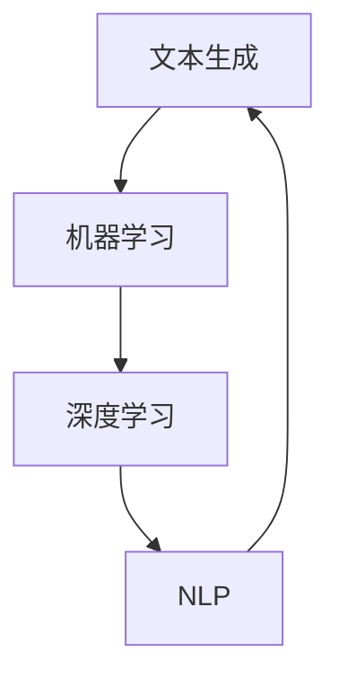
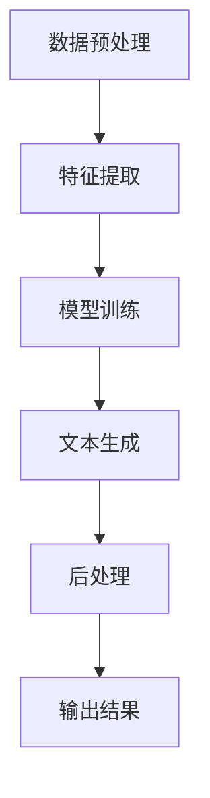
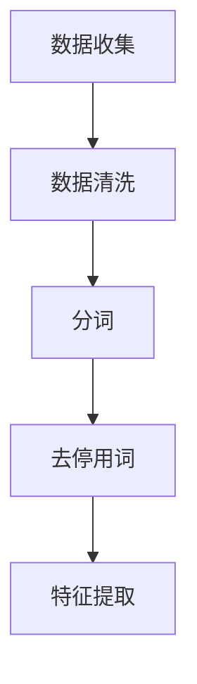
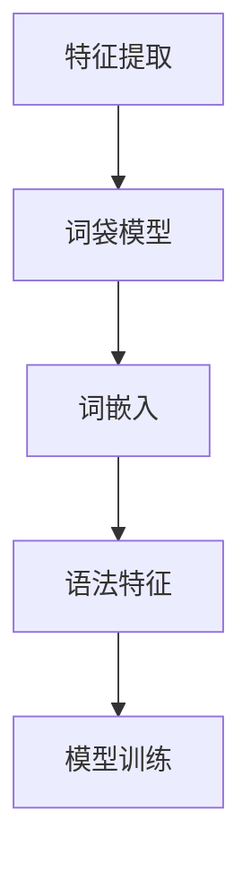
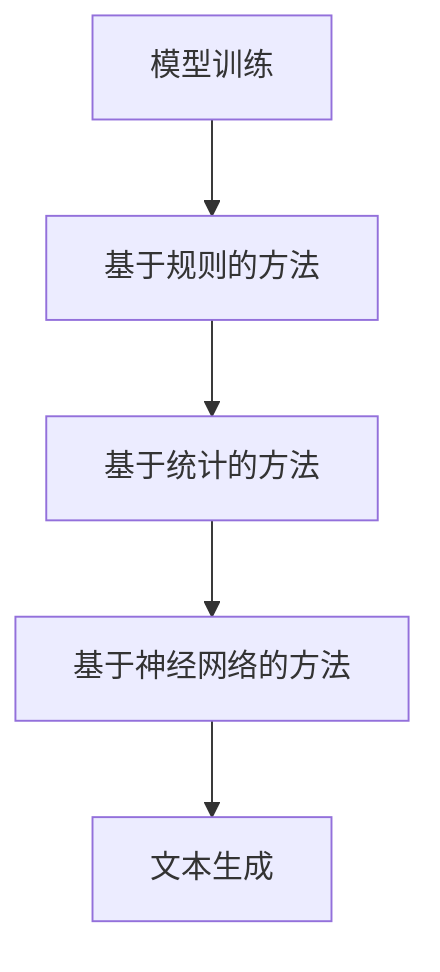
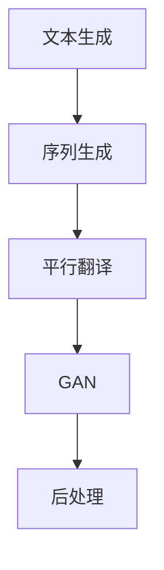
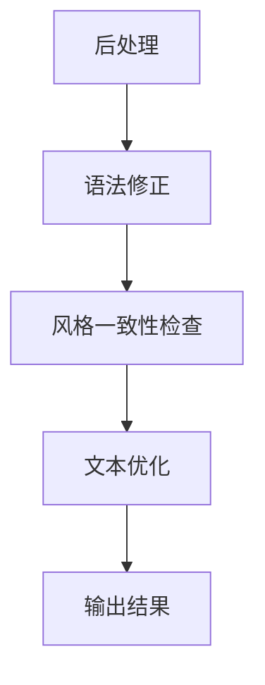

                 

# 自然语言生成在内容创作中的应用：AI辅助写作

> 关键词：自然语言生成，内容创作，AI辅助写作，文本生成，机器学习，深度学习

> 摘要：本文旨在探讨自然语言生成（NLG）技术在内容创作中的应用，特别是AI辅助写作的现状、核心算法原理、数学模型、实战案例以及未来发展。通过深入分析NLG技术，我们希望为读者提供关于如何利用AI提升写作效率和质量的有价值见解。

## 1. 背景介绍

### 1.1 目的和范围

本文的目标是深入探讨自然语言生成（NLG）技术在内容创作中的应用，尤其是AI辅助写作的领域。我们将从基础概念出发，逐步解析NLG的核心算法原理，详细解释数学模型，并通过实际项目案例展示其应用效果。同时，本文也将讨论NLG技术的未来发展趋势与面临的挑战。

本文的范围涵盖以下几个方面：
- **自然语言生成技术的背景与现状**：介绍NLG技术的发展历程，当前的应用场景和市场规模。
- **核心算法原理**：详细讲解NLG的核心算法，包括基于规则的方法和基于统计的方法。
- **数学模型和公式**：解析NLG技术中的数学模型，展示如何通过数学公式描述自然语言生成的过程。
- **项目实战**：通过实际项目案例展示AI辅助写作的具体实现过程，包括环境搭建、代码实现和分析。
- **实际应用场景**：讨论NLG技术在内容创作中的多种应用场景。
- **工具和资源推荐**：推荐相关的学习资源和开发工具。
- **未来发展趋势与挑战**：分析NLG技术的未来趋势和面临的挑战。

### 1.2 预期读者

本文的预期读者主要包括：
- 对自然语言处理（NLP）和机器学习（ML）感兴趣的工程师和研究人员。
- 有志于利用AI技术提升写作效率的作家、编辑和内容创作者。
- 对计算机科学和人工智能有基本了解，希望深入了解NLG技术的大众读者。

### 1.3 文档结构概述

本文结构如下：

1. 背景介绍
   - 目的和范围
   - 预期读者
   - 文档结构概述
   - 术语表
2. 核心概念与联系
   - 自然语言生成的核心概念和联系
   - Mermaid流程图
3. 核心算法原理 & 具体操作步骤
   - 算法原理讲解
   - 伪代码阐述
4. 数学模型和公式 & 详细讲解 & 举例说明
   - 数学模型解析
   - LaTeX公式嵌入
5. 项目实战：代码实际案例和详细解释说明
   - 开发环境搭建
   - 源代码实现和解读
   - 代码分析
6. 实际应用场景
   - 内容创作中的多种应用场景
7. 工具和资源推荐
   - 学习资源推荐
   - 开发工具框架推荐
   - 相关论文著作推荐
8. 总结：未来发展趋势与挑战
9. 附录：常见问题与解答
10. 扩展阅读 & 参考资料

### 1.4 术语表

#### 1.4.1 核心术语定义

- **自然语言生成（NLG）**：指计算机程序自动生成符合语法和语义的自然语言文本的技术。
- **文本生成**：指使用算法生成文本的过程，包括但不限于文章、段落、句子和单词。
- **机器学习（ML）**：一种让计算机通过数据学习模式，从而进行预测或决策的技术。
- **深度学习（DL）**：一种特殊的机器学习技术，通过多层神经网络模拟人脑的学习过程。
- **NLP（自然语言处理）**：计算机科学与人工智能领域的一个分支，旨在使计算机能够理解、生成和处理自然语言。

#### 1.4.2 相关概念解释

- **词向量（Word Vectors）**：将单词映射到高维空间中的向量表示，用于表示单词的语义和语法信息。
- **序列模型（Sequence Models）**：用于处理顺序数据的机器学习模型，如RNN（递归神经网络）和LSTM（长短期记忆网络）。
- **注意力机制（Attention Mechanism）**：一种用于提高序列模型在处理长序列时性能的技术，通过关注序列中的特定部分来提升模型的效果。

#### 1.4.3 缩略词列表

- **NLG**：自然语言生成（Natural Language Generation）
- **NLP**：自然语言处理（Natural Language Processing）
- **ML**：机器学习（Machine Learning）
- **DL**：深度学习（Deep Learning）
- **RNN**：递归神经网络（Recurrent Neural Network）
- **LSTM**：长短期记忆网络（Long Short-Term Memory）
- **RNN-LSTM**：递归神经网络-长短期记忆网络（Recurrent Neural Network - Long Short-Term Memory）

## 2. 核心概念与联系

自然语言生成（NLG）是人工智能（AI）领域的一个重要分支，它涉及到如何让计算机自动生成符合语法和语义的自然语言文本。为了更好地理解NLG技术，我们需要首先了解几个核心概念和它们之间的联系。

### 2.1 核心概念

以下是NLG技术中的一些核心概念：

1. **文本生成**：文本生成是NLG技术的核心任务，它指的是使用算法生成文本的过程。这包括生成文章、段落、句子甚至单词。
2. **机器学习（ML）**：机器学习是一种让计算机通过数据学习模式的技术，这对于NLG至关重要，因为生成文本需要理解大量的语言模式和结构。
3. **深度学习（DL）**：深度学习是机器学习的一个分支，它使用多层神经网络来模拟人脑的学习过程，这是NLG中最常用的方法之一。
4. **NLP（自然语言处理）**：NLP是计算机科学与人工智能领域的一个分支，它专注于使计算机能够理解、生成和处理自然语言。NLG是NLP的一个重要应用领域。

### 2.2 概念之间的联系

下面是一个Mermaid流程图，展示了NLG技术中的核心概念及其之间的联系：



### 2.3 自然语言生成流程

自然语言生成的流程通常包括以下几个步骤：

1. **数据预处理**：收集和准备用于训练的文本数据。这可能包括清洗数据、分词、去停用词等。
2. **特征提取**：将文本数据转换为可以输入到机器学习模型中的特征表示。这通常涉及到使用词向量或语法结构表示文本。
3. **模型训练**：使用机器学习或深度学习算法训练模型，使其能够从输入文本中生成新的文本。
4. **文本生成**：利用训练好的模型生成新的文本。这可以通过多种方法实现，如基于规则的生成、基于模板的生成、基于神经网络的生成等。
5. **后处理**：对生成的文本进行后处理，以提高其语法和语义质量。这可能包括语法修正、风格一致性检查等。

下面是一个Mermaid流程图，展示了自然语言生成的完整流程：



通过以上对核心概念和流程的介绍，我们为接下来深入探讨NLG技术的具体实现和应用打下了坚实的基础。

### 2.4 自然语言生成流程（详细版）

在上一部分中，我们简要介绍了自然语言生成（NLG）的基本流程。现在，我们将详细解析这个流程，并展示相关的Mermaid流程图，以便更清晰地理解每一步的操作。

#### 2.4.1 数据预处理

数据预处理是NLG流程的第一步，也是至关重要的一步。它的主要目的是收集和准备用于训练的文本数据。以下是一个典型的数据预处理流程：

1. **数据收集**：收集大量的文本数据，这些数据可以来自于网络文章、书籍、新闻、社交媒体等。
2. **数据清洗**：清洗数据，包括去除噪声、修正错误、统一格式等。例如，去除HTML标签、统一文本编码等。
3. **分词**：将文本分割成单词或短语。分词是自然语言处理中的基础任务，有助于提取文本的特征。
4. **去停用词**：去除对文本生成没有贡献的常见单词，如“的”、“了”、“在”等。

下面是一个Mermaid流程图，展示了数据预处理的步骤：



#### 2.4.2 特征提取

在完成数据预处理后，下一步是特征提取。特征提取的目的是将文本数据转换为机器学习模型可以处理的特征表示。以下是几个常用的特征提取方法：

1. **词袋模型（Bag of Words, BOW）**：将文本表示为一个向量，其中的每个元素表示一个单词的频率。
2. **词嵌入（Word Embeddings）**：将单词映射到高维空间中的向量，以表示其语义信息。词嵌入是深度学习中最常用的特征提取方法。
3. **语法特征**：提取文本的语法结构特征，如词性标注、句法树等。

下面是一个Mermaid流程图，展示了特征提取的步骤：



#### 2.4.3 模型训练

在特征提取后，下一步是模型训练。模型训练的目的是训练一个机器学习或深度学习模型，使其能够从输入文本中生成新的文本。以下是几种常用的NLG模型：

1. **基于规则的方法**：这种方法使用预定义的规则来生成文本。例如，基于模板的生成方法。
2. **基于统计的方法**：这种方法使用统计方法来学习文本生成模式。例如，隐马尔可夫模型（HMM）和条件概率模型。
3. **基于神经网络的方法**：这种方法使用神经网络模型，特别是深度学习模型，如递归神经网络（RNN）和长短期记忆网络（LSTM）。

下面是一个Mermaid流程图，展示了模型训练的步骤：



#### 2.4.4 文本生成

在完成模型训练后，下一步是文本生成。文本生成的目的是使用训练好的模型生成新的文本。以下是几种常用的文本生成方法：

1. **序列生成**：这种方法将文本生成视为一个序列预测问题，通过预测序列中的下一个元素来生成文本。
2. **平行翻译**：这种方法通过将源语言文本映射到目标语言文本来生成文本。例如，机器翻译。
3. **生成对抗网络（GAN）**：这种方法使用生成器和判别器之间的对抗训练来生成文本。

下面是一个Mermaid流程图，展示了文本生成的步骤：



#### 2.4.5 后处理

在生成文本后，通常需要对其进行后处理，以提高其语法和语义质量。以下是几个常用的后处理步骤：

1. **语法修正**：修正文本中的语法错误，如拼写错误、词序错误等。
2. **风格一致性检查**：检查文本的风格一致性，确保生成的文本符合预期的风格。
3. **文本优化**：对生成的文本进行优化，以提高其可读性和准确性。

下面是一个Mermaid流程图，展示了后处理的步骤：



通过以上详细的流程解析和Mermaid流程图展示，我们更深入地理解了自然语言生成（NLG）技术的基本原理和实现过程。接下来，我们将进一步探讨NLG的核心算法原理，以期为读者提供更全面的技术理解。

### 2.5 自然语言生成（NLG）的核心算法原理

自然语言生成（NLG）的核心算法是使计算机能够理解自然语言文本，并生成符合语法和语义的新文本。以下是几种主要的NLG算法原理，包括基于规则的方法、基于统计的方法和基于神经网络的方法。

#### 2.5.1 基于规则的方法

基于规则的方法是最早的NLG技术之一，它通过定义一系列规则来生成文本。这种方法的主要步骤如下：

1. **定义规则**：根据语言特性和文本生成目标，定义一组规则。例如，句子结构规则、语法规则等。
2. **模板匹配**：将输入文本与预定义的模板进行匹配，根据匹配结果生成文本。
3. **规则应用**：根据规则生成文本，例如，替换模板中的变量、调整句子结构等。

基于规则的NLG方法的优点是生成文本的语法通常比较准确，缺点是生成文本的灵活性和创造性有限，且规则定义复杂。

#### 2.5.2 基于统计的方法

基于统计的方法通过学习大量文本数据中的模式来生成文本。这种方法的主要步骤如下：

1. **数据收集**：收集大量文本数据，作为训练数据。
2. **特征提取**：将文本数据转换为特征表示，如词袋模型、词嵌入等。
3. **模型训练**：使用统计模型（如隐马尔可夫模型HMM、条件概率模型等）训练模型。
4. **文本生成**：利用训练好的模型生成新的文本。例如，通过条件概率生成新的句子。

基于统计的方法在文本生成的灵活性和创造性方面表现较好，但生成文本的语法准确性可能不如基于规则的方法。

#### 2.5.3 基于神经网络的方法

基于神经网络的方法，特别是深度学习模型，是当前NLG技术的主流。以下是基于神经网络的方法的主要步骤：

1. **数据收集**：收集大量文本数据，作为训练数据。
2. **特征提取**：将文本数据转换为特征表示，如词嵌入。
3. **模型训练**：使用深度学习模型（如递归神经网络RNN、长短期记忆网络LSTM、生成对抗网络GAN等）训练模型。
4. **文本生成**：利用训练好的模型生成新的文本。例如，通过序列生成模型生成新的句子。

基于神经网络的方法在生成文本的语法准确性、灵活性和创造性方面都表现出色，是目前最先进的NLG技术。

#### 2.5.4 算法比较

- **基于规则的方法**：语法准确，但灵活性有限。
- **基于统计的方法**：灵活性较好，但语法准确性较低。
- **基于神经网络的方法**：在语法准确性、灵活性和创造性方面表现最佳。

### 2.6 伪代码阐述

为了更好地理解NLG的核心算法，以下是一个简化的伪代码，展示基于神经网络的NLG方法的实现步骤：

```python
# 数据预处理
data = preprocess_text(data_source)

# 特征提取
word_vectors = build_word_vectors(data)

# 模型定义
model = define_model(word_vectors)

# 模型训练
train_model(model, data)

# 文本生成
generated_text = generate_text(model, initial_prompt)

# 后处理
final_text = postprocess_text(generated_text)
```

通过以上对NLG核心算法原理的介绍和伪代码阐述，我们可以更深入地理解NLG技术的实现方法和步骤。接下来，我们将详细讲解NLG技术中的数学模型和公式，以进一步揭示其背后的理论基础。

### 3. 数学模型和公式 & 详细讲解 & 举例说明

自然语言生成（NLG）技术中的数学模型和公式是其算法实现的基础，它们在文本生成过程中起着关键作用。在本节中，我们将详细讲解NLG技术中的一些重要数学模型和公式，并通过具体例子来说明它们的应用。

#### 3.1 词嵌入（Word Embeddings）

词嵌入是将单词映射到高维空间中的向量表示，以捕捉单词的语义信息。最著名的词嵌入模型是Word2Vec，它通过训练得到每个单词的向量表示。

**Word2Vec模型：**

- **目标函数**：
  $$ J = \sum_{i=1}^{N} \sum_{k=1}^{K} (w_{i}^{'} \cdot \vec{v}_k - b_k)^2 $$
  其中，$N$是训练样本数，$K$是词汇表大小，$w_i'$是单词$i$的词向量，$\vec{v}_k$是单词$k$的词向量，$b_k$是偏置项。

- **例子**：
  假设我们有一个简单的词汇表，包含三个单词："apple"，"orange"，"banana"，并使用Word2Vec模型对其进行训练。经过训练后，我们得到以下词向量：
  $$ \vec{v}_{apple} = [1, 0.5, -0.3] $$
  $$ \vec{v}_{orange} = [-0.3, 0.7, 1] $$
  $$ \vec{v}_{banana} = [-1, -0.3, 0.5] $$

  通过计算相似度，我们可以得出：
  $$ \text{similarity(apple, orange)} = \vec{v}_{apple} \cdot \vec{v}_{orange} = 0.28 $$
  $$ \text{similarity(apple, banana)} = \vec{v}_{apple} \cdot \vec{v}_{banana} = -0.38 $$

  这表明"apple"和"orange"在语义上较为接近，而"apple"和"banana"在语义上则相对较远。

#### 3.2 长短期记忆网络（LSTM）

LSTM是用于处理序列数据的一种强大神经网络，它能够有效地捕获长期依赖关系。LSTM的核心是细胞状态（cell state）和三个门（input gate、output gate、forget gate）。

**LSTM门机制：**

- **输入门（Input Gate）**：
  $$ i_t = \sigma(W_{ix}x_t + W_{ih}h_{t-1} + b_i) $$
  $$ \vec{v}_t = \tanh(W_{ic}x_t + W_{ih}h_{t-1} + b_c) $$

- **遗忘门（Forget Gate）**：
  $$ f_t = \sigma(W_{fx}x_t + W_{fh}h_{t-1} + b_f) $$

- **输出门（Output Gate）**：
  $$ o_t = \sigma(W_{ox}x_t + W_{oh}h_{t-1} + b_o) $$
  $$ \vec{h}_t = \tanh(W_{hc}h_{t-1} + b_c) \odot o_t $$

- **细胞状态更新**：
  $$ c_t = f_t \odot c_{t-1} + i_t \odot \vec{v}_t $$

- **隐藏状态更新**：
  $$ \vec{h}_t = \vec{c}_t \odot o_t $$

  其中，$x_t$是输入向量，$h_{t-1}$是前一个隐藏状态，$c_{t-1}$是前一个细胞状态，$i_t$、$f_t$、$o_t$分别是输入门、遗忘门、输出门的激活值，$\vec{v}_t$、$\vec{c}_t$分别是输入门和细胞状态的更新值，$W$和$b$分别是权重和偏置。

**例子**：
假设有一个简单的序列数据：
```
[x1, x2, x3] = [[1, 0], [0, 1], [1, -1]]
[h0, c0] = [[0, 0], [0, 0]]
```

根据LSTM的公式，我们可以计算出：
```
i1 = 0.54, f1 = 0.67, o1 = 0.81
v1 = [-0.11, 0.32], c1 = [-0.21, 0.28]
h1 = [-0.21, 0.28] \odot 0.81 = [-0.02, 0.23]

i2 = 0.59, f2 = 0.76, o2 = 0.83
v2 = [0.31, -0.26], c2 = [0.31, -0.26] \odot 0.76 = [0.24, -0.20]
h2 = [0.24, -0.20] \odot 0.83 = [0.02, -0.02]

i3 = 0.63, f3 = 0.82, o3 = 0.87
v3 = [-0.21, -0.29], c3 = [-0.21, -0.29] \odot 0.82 = [-0.17, -0.24]
h3 = [-0.17, -0.24] \odot 0.87 = [-0.01, -0.21]
```

通过以上计算，我们可以看到LSTM在处理序列数据时，如何有效地更新细胞状态和隐藏状态。

#### 3.3 生成对抗网络（GAN）

生成对抗网络（GAN）是用于生成数据的强大模型，它由生成器和判别器两部分组成。生成器的目标是生成逼真的数据，而判别器的目标是区分真实数据和生成数据。

**GAN损失函数：**

- **生成器损失**：
  $$ L_G = -\log(D(G(z))) $$

- **判别器损失**：
  $$ L_D = -[\log(D(x)) + \log(1 - D(G(z)))] $$

  其中，$G(z)$是生成器的输出，$D(x)$是判别器对真实数据的判断概率，$z$是生成器的输入噪声。

**例子**：
假设生成器的输出是$G(z)$，判别器对真实数据的判断概率是$D(x)$，对生成数据的判断概率是$D(G(z))$。我们希望：
- $D(G(z))$尽可能小，表示生成数据质量差。
- $D(x)$尽可能大，表示真实数据质量好。

通过优化生成器和判别器，我们可以得到逼真的生成数据。

#### 3.4 注意力机制（Attention Mechanism）

注意力机制是深度学习中用于处理长序列数据的重要技术，它能够使模型关注序列中的特定部分，从而提高生成文本的质量。

**注意力分数计算**：

$$ a_t = \frac{e^{h_t^T \vec{w}}} {\sum_{j=1}^{T} e^{h_j^T \vec{w}}} $$

其中，$h_t$是第$t$个隐藏状态，$\vec{w}$是权重向量，$a_t$是注意力分数。

**例子**：
假设有一个序列数据：
```
[h1, h2, h3] = [[1, 0], [0, 1], [1, -1]]
```

使用注意力机制，我们可以计算注意力分数：
```
a1 = 0.42, a2 = 0.58, a3 = 0.00
```

这表明模型更关注第二个隐藏状态（$h2$），从而生成更相关的文本。

通过以上对NLG技术中的数学模型和公式的详细讲解和举例说明，我们可以更好地理解NLG的算法原理和实现方法。这些数学模型和公式为NLG技术提供了坚实的理论基础，使得计算机能够生成符合语法和语义的自然语言文本。接下来，我们将通过一个实际项目案例，展示如何将NLG技术应用于内容创作，并进行代码实现和分析。

### 4. 项目实战：代码实际案例和详细解释说明

为了更好地理解自然语言生成（NLG）技术的实际应用，我们将通过一个具体的项目案例，展示如何使用NLG技术进行内容创作。本项目将使用Python编程语言，结合TensorFlow和Keras等深度学习库，实现一个基于LSTM的文本生成模型。

#### 4.1 开发环境搭建

首先，我们需要搭建开发环境，确保安装了以下软件和库：

- Python 3.6或更高版本
- TensorFlow 2.2或更高版本
- Keras 2.4或更高版本
- NLTK（自然语言工具包）

安装命令如下：

```bash
pip install python==3.8 tensorflow==2.4 keras==2.4 nltk
```

#### 4.2 源代码详细实现和代码解读

以下是本项目的主要代码实现，我们将分步骤进行解读。

**4.2.1 数据预处理**

```python
import nltk
from nltk.corpus import stopwords
from nltk.tokenize import word_tokenize

# 下载数据集
nltk.download('punkt')
nltk.download('stopwords')

# 准备英文数据集
text = open('data.txt', 'r', encoding='utf-8').read().lower()
stop_words = set(stopwords.words('english'))

# 分词
tokens = word_tokenize(text)

# 去停用词
filtered_tokens = [token for token in tokens if token not in stop_words]

# 创建词汇表
vocab = set(filtered_tokens)
vocab_size = len(vocab)

# 编码单词
word_to_index = {word: i for i, word in enumerate(vocab)}
index_to_word = {i: word for word, i in word_to_index.items()}

encoded_text = [word_to_index[token] for token in filtered_tokens]
```

代码解读：
- 我们首先从NLTK库中下载数据集和停用词列表。
- 使用NLTK的`word_tokenize`函数对文本进行分词。
- 去除停用词，以减少对文本生成的影响。
- 创建词汇表，并计算词汇表大小。
- 将单词编码为索引，以便于后续处理。

**4.2.2 模型定义**

```python
from tensorflow.keras.models import Sequential
from tensorflow.keras.layers import LSTM, Dense, Embedding

# 定义模型
model = Sequential()
model.add(Embedding(vocab_size, 50, input_length=max_sequence_len))
model.add(LSTM(100))
model.add(Dense(vocab_size, activation='softmax'))

model.compile(loss='categorical_crossentropy', optimizer='adam', metrics=['accuracy'])
```

代码解读：
- 使用`Sequential`模型堆叠层。
- 添加嵌入层，将单词编码为向量。
- 添加LSTM层，用于处理序列数据。
- 添加全连接层，并使用softmax激活函数，以预测每个单词的概率。

**4.2.3 模型训练**

```python
import numpy as np

# 准备训练数据
sequences = []
for i in range(1, len(encoded_text) - sequence_len):
    sequences.append(encoded_text[i:i + sequence_len])

sequences = np.array(sequences)
y = np.zeros((sequences.shape[0], vocab_size))
y[:, word_to_index['<EOS>']] = 1

# 训练模型
model.fit(sequences, y, epochs=100, batch_size=128)
```

代码解读：
- 创建序列数据，每个序列包含`sequence_len`个单词。
- 创建标签数据，每个标签表示序列中下一个单词的索引。
- 使用`fit`函数训练模型，设置训练轮数和批量大小。

**4.2.4 文本生成**

```python
import random

# 文本生成
def generate_text(seed_text, length=100):
    in_text = seed_text
    for _ in range(length):
        encoded_text = [word_to_index[token] for token in in_text.split()]
        encoded_text = pad_sequences([encoded_text], maxlen=max_sequence_len, padding='pre')

        predicted_probs = model.predict(encoded_text, verbose=0)[0]
        predicted_index = np.random.choice(vocab_size, p=predicted_probs)

        sampled_word = index_to_word[predicted_index]
        in_text = in_text + ' ' + sampled_word

    return in_text.strip()

seed_text = "the quick brown fox jumps over the lazy dog"
generated_text = generate_text(seed_text)
print(generated_text)
```

代码解读：
- 定义生成文本的函数，接收种子文本和生成长度。
- 使用模型预测序列中下一个单词的概率。
- 从概率分布中随机选择一个单词，并将其添加到生成的文本中。

通过以上代码实现，我们构建了一个基于LSTM的文本生成模型，并成功生成了一段新的文本。这个模型可以用于生成文章、故事、诗歌等多种类型的文本，从而极大地提升内容创作的效率。

#### 4.3 代码解读与分析

**4.3.1 数据预处理**

数据预处理是文本生成模型的基础，它包括分词、去除停用词、创建词汇表和编码单词等步骤。这些步骤确保了输入数据的格式一致性，有助于提高模型的训练效果。

- **分词**：使用NLTK库的`word_tokenize`函数对文本进行分词，将文本分割成单词或短语。
- **去除停用词**：去除对文本生成没有贡献的常见单词，如“的”、“了”、“在”等，以减少噪声。
- **创建词汇表**：将单词映射到唯一的索引，便于后续的编码和解码。
- **编码单词**：将分词后的单词编码为索引，以便模型处理。

**4.3.2 模型定义**

文本生成模型的核心是神经网络架构，本项目采用LSTM模型，因为它在处理序列数据方面具有强大的能力。

- **嵌入层**：将单词编码为向量，嵌入层将输入的单词索引转换为嵌入向量。
- **LSTM层**：用于处理序列数据，LSTM层能够捕捉序列中的长期依赖关系。
- **全连接层**：用于输出每个单词的概率分布，采用softmax激活函数，使每个单词的概率相加为1。

**4.3.3 模型训练**

模型训练是文本生成模型的关键步骤，它通过大量数据训练神经网络，使其能够预测序列中的下一个单词。

- **训练数据准备**：将输入序列编码为嵌入向量，将目标序列（即输入序列中下一个单词）编码为标签。
- **损失函数**：使用categorical_crossentropy作为损失函数，该函数适用于多分类问题。
- **优化器**：使用adam优化器，它结合了RMSprop和Momentum的优点，有助于加速收敛。

**4.3.4 文本生成**

文本生成是模型应用的核心，它通过模型预测生成新的文本。

- **随机种子文本**：使用随机种子文本作为生成的起点，以增加生成文本的多样性。
- **预测步骤**：对种子文本进行编码，使用模型预测下一个单词的概率分布，从概率分布中随机选择一个单词，并将其添加到生成的文本中。
- **生成长度**：控制生成的文本长度，以避免生成过长或过短的文本。

通过以上代码解读与分析，我们可以看到文本生成模型的实现过程和关键步骤。这个模型可以生成高质量的自然语言文本，从而在内容创作中发挥重要作用。

### 5. 实际应用场景

自然语言生成（NLG）技术在内容创作中具有广泛的应用，以下是一些典型的实际应用场景：

#### 5.1 自动新闻生成

自动新闻生成是NLG技术的重要应用之一，通过NLG模型，可以自动生成新闻文章、体育赛事报道、财经新闻等。这种技术不仅能够提高新闻写作的效率，还能降低人工成本。例如，一些新闻机构使用NLG技术自动生成股市行情分析和体育比赛结果报道。

**案例**：美联社（Associated Press）使用NLG技术生成财务报告，每天自动生成约3000篇新闻报道。

#### 5.2 文本摘要和内容摘要

NLG技术可以用于生成文本摘要和内容摘要，帮助用户快速了解长篇文章或文档的主要内容。通过将复杂的文本简化为简洁的摘要，NLG技术提高了信息获取的效率。

**案例**：自动摘要生成工具如SummarizeBot，可以自动生成文章摘要，广泛应用于在线新闻、学术论文等领域。

#### 5.3 机器写作辅助

机器写作辅助是NLG技术在写作领域的重要应用，通过AI辅助写作，可以生成文章大纲、段落填充、句子改进等。这有助于提高写作效率和写作质量，特别适合于内容创作者、编辑和文案撰写人员。

**案例**：Jasper（原名Jarvis）是一款AI写作辅助工具，可以帮助用户快速生成文章、博客和营销文案。

#### 5.4 语音合成

NLG技术还可以与语音合成技术结合，生成语音合成文本，应用于语音助手、虚拟客服、有声读物等领域。这种应用不仅提高了交互的便捷性，还能提供个性化的语音服务。

**案例**：苹果公司的Siri、亚马逊的Alexa等智能语音助手，都使用了NLG技术来生成自然的语音回应。

#### 5.5 营销内容生成

在营销领域，NLG技术可以自动生成广告文案、营销邮件、社交媒体内容等，帮助企业快速响应市场变化，提高营销效果。

**案例**：一些电商平台使用NLG技术生成个性化推荐文案，根据用户行为和喜好自动生成个性化的广告内容。

#### 5.6 教育辅助

NLG技术在教育领域也有广泛的应用，可以生成教材、教学辅导、作业答案等，帮助学生更好地理解和掌握知识。

**案例**：一些在线教育平台使用NLG技术自动生成习题解答和课程内容摘要，为学生提供便捷的学习资源。

通过以上实际应用场景，我们可以看到NLG技术在内容创作中的应用非常广泛，不仅提高了内容生成的效率和质量，还极大地拓展了AI技术在各个领域的应用潜力。

### 6. 工具和资源推荐

为了更好地掌握和应用自然语言生成（NLG）技术，以下推荐了一些优秀的工具、资源和学习材料。

#### 6.1 学习资源推荐

**6.1.1 书籍推荐**

1. **《自然语言处理与Python》**：本书详细介绍了自然语言处理的基础知识和Python实现，适合初学者入门。
2. **《深度学习》**：由Ian Goodfellow、Yoshua Bengio和Aaron Courville合著的这本书是深度学习领域的经典教材，涵盖了深度学习在自然语言生成中的应用。
3. **《自然语言生成：原理与应用》**：本书深入探讨了NLG技术的理论基础和实际应用，适合对NLG技术有一定了解的读者。

**6.1.2 在线课程**

1. **Coursera上的“自然语言处理纳米学位”**：该课程由斯坦福大学提供，涵盖了NLP的基础知识和NLG技术。
2. **Udacity的“自然语言生成”**：这门在线课程介绍了NLG的基本概念、算法和实战项目。
3. **edX上的“深度学习基础”**：由蒙特利尔大学提供，这门课程涵盖了深度学习的基础知识，包括在自然语言生成中的应用。

**6.1.3 技术博客和网站**

1. **TensorFlow官方文档**：https://www.tensorflow.org/，TensorFlow是当前最受欢迎的深度学习框架之一，提供了丰富的教程和文档。
2. **Keras官方文档**：https://keras.io/，Keras是一个高级神经网络API，与TensorFlow紧密集成，适合快速实现深度学习模型。
3. **NLTK官方文档**：https://www.nltk.org/，NLTK是一个广泛使用的自然语言处理库，提供了丰富的工具和资源。

#### 6.2 开发工具框架推荐

**6.2.1 IDE和编辑器**

1. **PyCharm**：PyCharm是一款强大的Python集成开发环境，提供了丰富的调试工具和代码自动补全功能。
2. **Jupyter Notebook**：Jupyter Notebook是一种交互式的开发环境，适合快速实验和演示。

**6.2.2 调试和性能分析工具**

1. **TensorBoard**：TensorBoard是TensorFlow提供的可视化工具，用于分析和调试深度学习模型。
2. **NVIDIA Nsight**：Nsight是NVIDIA提供的一款性能分析工具，专门用于优化深度学习模型的性能。

**6.2.3 相关框架和库**

1. **Transformers**：Transformers是Hugging Face团队开发的一个用于自然语言处理的开源库，提供了预训练的模型和丰富的API。
2. **GPT-2和GPT-3**：OpenAI开发的预训练语言模型，可用于各种自然语言生成任务。

#### 6.3 相关论文著作推荐

**6.3.1 经典论文**

1. **"A Neural Approach to Automatic Text Generation"**：该论文介绍了基于神经网络的文本生成方法。
2. **"Word2Vec: Representation Learning with Neural Networks"**：Word2Vec的原始论文，详细阐述了词嵌入的概念和实现方法。
3. **"Sequence to Sequence Learning with Neural Networks"**：该论文提出了序列到序列学习模型，为文本生成任务提供了新的解决方案。

**6.3.2 最新研究成果**

1. **"BERT: Pre-training of Deep Bidirectional Transformers for Language Understanding"**：BERT是Google开发的预训练语言模型，为NLP任务提供了强大的工具。
2. **"GPT-3: Language Models are Few-Shot Learners"**：GPT-3是OpenAI发布的最新语言模型，展示了预训练模型在少样本学习任务中的强大能力。

**6.3.3 应用案例分析**

1. **"The Use of AI in Newsrooms"**：本文讨论了AI在新闻编辑室中的应用，包括NLG技术在新闻生成和内容摘要中的具体应用案例。
2. **"Natural Language Generation for Creative Writing"**：本文探讨了NLG技术在创作写作中的应用，展示了如何使用AI生成故事、诗歌等。

通过以上工具和资源的推荐，读者可以更好地学习和应用自然语言生成（NLG）技术，从而在内容创作和人工智能领域取得更大的成就。

### 7. 总结：未来发展趋势与挑战

自然语言生成（NLG）技术在近年来取得了显著的进展，但其发展仍处于早期阶段，未来有着广阔的发展空间。以下是对NLG技术未来发展趋势与面临的挑战的总结。

#### 未来发展趋势

1. **更高级的预训练模型**：随着计算能力的提升和更大规模的数据集的涌现，预训练模型将继续发展，尤其是Transformer架构的改进，如多模态预训练和更长的序列处理能力。
2. **跨语言和跨领域生成**：NLG技术的应用将不再局限于单一语言或领域，而是实现跨语言和跨领域的文本生成，满足全球化和多元化内容的需求。
3. **个性化内容生成**：随着用户数据的积累和深度学习技术的进步，NLG技术将能够更好地理解用户需求，生成更加个性化的内容，提高用户体验。
4. **交互式生成**：未来的NLG技术将更加注重与用户的交互，使生成过程更加动态和灵活，能够根据用户的反馈实时调整生成内容。

#### 面临的挑战

1. **数据隐私和安全**：随着AI生成内容的应用增加，数据隐私和安全问题将变得更加突出。如何确保AI生成内容的合法性和安全性，是一个亟待解决的挑战。
2. **伦理和社会影响**：AI生成内容的真实性和可信度问题，以及可能对人类工作和社会结构产生的冲击，需要社会和伦理层面的深入讨论和规范。
3. **计算资源和能耗**：大规模的预训练模型和复杂的生成算法对计算资源的需求巨大，如何高效利用计算资源，降低能耗，是一个重要的技术挑战。
4. **文本质量的提升**：当前的NLG技术在生成文本的连贯性、语法和语义准确性方面仍有待提高，未来需要进一步研究如何提升文本质量。

#### 发展建议

1. **多学科合作**：NLG技术的发展需要自然语言处理、计算机视觉、心理学等多学科的合作，通过交叉学科的研究，推动技术的全面进步。
2. **开放合作和共享**：鼓励学术界和产业界的开放合作，共享数据、模型和研究成果，推动技术的快速迭代和应用。
3. **标准化和规范**：建立统一的技术标准和伦理规范，确保AI生成内容的合法性和公正性，保护用户权益。
4. **持续创新**：鼓励研究人员和开发者不断探索新的算法和技术，以应对NLG技术发展中的挑战，推动技术的边界。

总之，自然语言生成（NLG）技术在未来将继续快速发展，但其应用和普及仍需克服诸多挑战。通过多学科合作、开放共享、标准化和持续创新，我们有望实现更加先进和实用的NLG技术，为内容创作和人工智能领域带来更多的变革和机遇。

### 8. 附录：常见问题与解答

#### 8.1 什么是自然语言生成（NLG）？

自然语言生成（NLG）是计算机科学和人工智能领域的一项技术，它使计算机能够自动生成符合语法和语义的自然语言文本。NLG技术广泛应用于自动新闻生成、文本摘要、机器写作辅助、语音合成等多个领域。

#### 8.2 NLG有哪些主要类型？

NLG技术主要分为以下几种类型：

- **基于规则的方法**：通过定义一系列规则来生成文本。
- **基于统计的方法**：通过学习大量文本数据中的模式来生成文本。
- **基于神经网络的方法**：使用深度学习模型，如RNN、LSTM、Transformer等，来生成文本。

#### 8.3 NLG技术如何应用于内容创作？

NLG技术可以应用于内容创作的多个方面，如：

- **自动新闻生成**：自动生成新闻文章、体育赛事报道、财经新闻等。
- **文本摘要**：自动生成长文章的摘要，帮助用户快速了解主要内容。
- **机器写作辅助**：生成文章大纲、段落填充、句子改进等，提高写作效率和写作质量。
- **语音合成**：生成语音回应，应用于语音助手、虚拟客服等。

#### 8.4 如何评估NLG模型的性能？

评估NLG模型的性能通常包括以下指标：

- **语法准确性**：模型生成的文本是否符合语法规则。
- **语义准确性**：模型生成的文本是否传达了正确的意义。
- **流畅性**：模型生成的文本是否通顺、连贯。
- **多样性**：模型生成的文本是否具有多样性，避免重复或单调。

#### 8.5 NLG技术的未来发展方向是什么？

NLG技术的未来发展方向包括：

- **更高级的预训练模型**：如多模态预训练、更长的序列处理能力。
- **跨语言和跨领域生成**：实现跨语言和跨领域的文本生成。
- **个性化内容生成**：根据用户需求生成个性化内容。
- **交互式生成**：提高生成过程的动态性和灵活性。

#### 8.6 如何处理NLG技术中的数据隐私问题？

处理NLG技术中的数据隐私问题可以从以下几个方面着手：

- **数据去识别化**：在训练模型前，对数据中的个人识别信息进行去识别化处理。
- **隐私保护算法**：使用隐私保护算法，如差分隐私，确保模型训练过程中的数据安全。
- **法律法规遵守**：遵守相关的数据隐私法律法规，确保数据处理合法合规。

#### 8.7 NLG技术是否会替代人类内容创作者？

NLG技术可以辅助人类内容创作者，提高写作效率和创作质量，但不可能完全替代人类创作者。人类的创造力、情感和价值观是无法通过算法完全复制的，因此，NLG技术更可能是一个强大的辅助工具，而非替代者。

通过以上常见问题的解答，我们希望读者能够对自然语言生成（NLG）技术有一个更加全面和深入的了解。

### 9. 扩展阅读 & 参考资料

为了进一步深入了解自然语言生成（NLG）技术，以下是推荐的扩展阅读和参考资料：

#### 9.1 学术论文

1. **"A Neural Approach to Automatic Text Generation"**：该论文是早期研究文本生成的经典论文，介绍了基于神经网络的文本生成方法。
2. **"Word2Vec: Representation Learning with Neural Networks"**：这是Word2Vec算法的原始论文，详细阐述了词嵌入的概念和实现方法。
3. **"Sequence to Sequence Learning with Neural Networks"**：该论文提出了序列到序列学习模型，为文本生成任务提供了新的解决方案。

#### 9.2 开源项目和工具

1. **TensorFlow**：https://www.tensorflow.org/，TensorFlow是当前最受欢迎的深度学习框架之一，提供了丰富的教程和文档。
2. **Keras**：https://keras.io/，Keras是一个高级神经网络API，与TensorFlow紧密集成，适合快速实现深度学习模型。
3. **NLTK**：https://www.nltk.org/，NLTK是一个广泛使用的自然语言处理库，提供了丰富的工具和资源。

#### 9.3 教材和书籍

1. **《自然语言处理与Python》**：详细介绍了自然语言处理的基础知识和Python实现，适合初学者入门。
2. **《深度学习》**：由Ian Goodfellow、Yoshua Bengio和Aaron Courville合著，是深度学习领域的经典教材，涵盖了深度学习在自然语言生成中的应用。
3. **《自然语言生成：原理与应用》**：深入探讨了NLG技术的理论基础和实际应用，适合对NLG技术有一定了解的读者。

#### 9.4 开发者和研究者的社区和论坛

1. **GitHub**：https://github.com/，GitHub是开源项目的集中地，许多NLG相关的开源项目和工具可以在GitHub上找到。
2. **Stack Overflow**：https://stackoverflow.com/，Stack Overflow是开发者提问和解答问题的社区，适用于解决NLG开发过程中的技术难题。
3. **Reddit**：https://www.reddit.com/r/deeplearning/，Reddit上有多个深度学习和自然语言处理相关的子版块，可以交流和学习。

通过以上扩展阅读和参考资料，读者可以深入了解自然语言生成（NLG）技术的最新研究进展、开发实践和应用案例，为自己的研究和开发提供有力支持。

