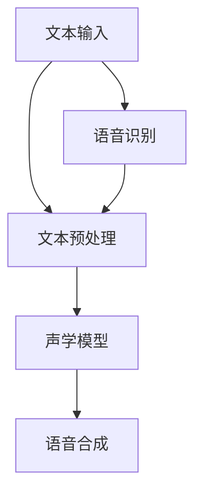
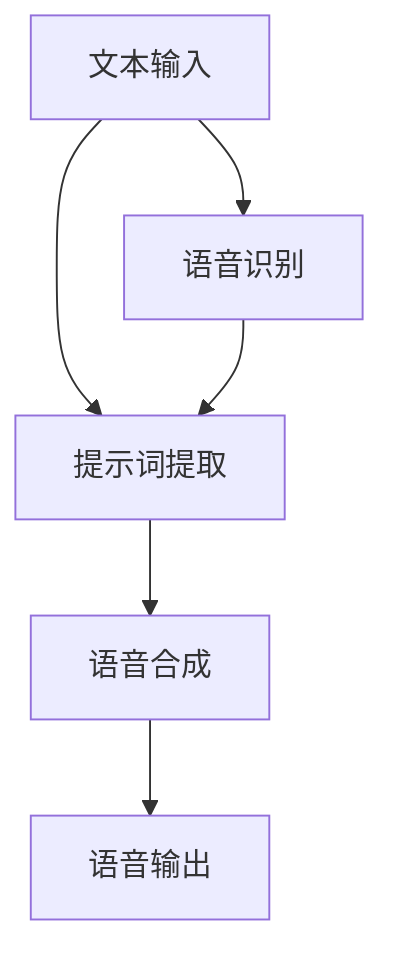
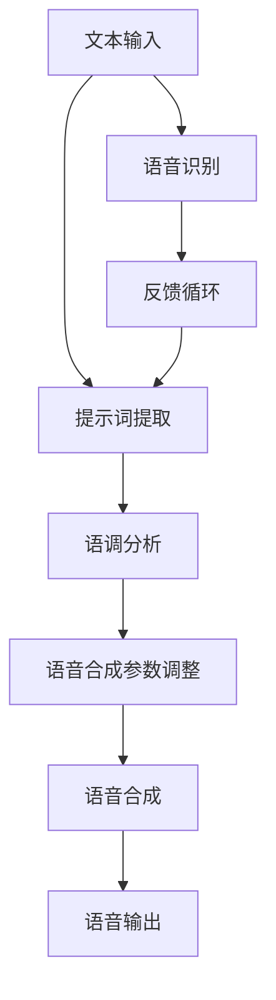

                 

# 自然语音合成：提示词提升AI语音质量

> **关键词**：自然语音合成、提示词、语音质量、人工智能、语音识别、语音合成技术

> **摘要**：本文将深入探讨自然语音合成领域的一个关键要素——提示词，以及如何通过提示词来提升AI语音的质量。文章首先介绍自然语音合成的基础概念和技术，接着详细讲解提示词的作用和原理，随后通过数学模型和具体算法原理分析，阐述如何利用提示词优化语音合成效果。此外，文章还将通过实战案例展示如何在实际项目中应用这些原理，最后总结未来发展趋势与挑战，并推荐相关工具和资源，供读者深入学习和实践。

## 1. 背景介绍

### 1.1 目的和范围

本文的目的是探讨自然语音合成（Text-to-Speech, TTS）领域中的一个重要组成部分——提示词（Prompt Word），以及提示词在提升AI语音质量方面的应用。自然语音合成技术旨在将文本转换为自然流畅的语音，它是语音识别和语音合成的交叉领域。本文将涵盖以下内容：

- 自然语音合成的背景和技术概述
- 提示词的定义、作用和分类
- 核心算法原理和具体操作步骤
- 数学模型和公式解析
- 项目实战案例
- 实际应用场景

### 1.2 预期读者

本文主要面向以下读者群体：

- 对自然语音合成技术感兴趣的初学者和研究者
- 对AI语音质量优化有需求的技术开发人员
- 对自然语言处理和语音技术有背景的工程师和科学家
- 想要了解最新研究成果和技术趋势的从业者

### 1.3 文档结构概述

本文将按照以下结构进行组织：

- **第1部分：背景介绍**：介绍自然语音合成的背景和技术概述。
- **第2部分：核心概念与联系**：详细讲解自然语音合成和提示词的相关概念及架构。
- **第3部分：核心算法原理 & 具体操作步骤**：阐述核心算法原理和具体操作步骤。
- **第4部分：数学模型和公式 & 详细讲解 & 举例说明**：解释数学模型和公式，并给出实例。
- **第5部分：项目实战：代码实际案例和详细解释说明**：通过实际案例展示应用。
- **第6部分：实际应用场景**：分析实际应用场景。
- **第7部分：工具和资源推荐**：推荐学习资源和开发工具。
- **第8部分：总结：未来发展趋势与挑战**：总结未来趋势和挑战。
- **第9部分：附录：常见问题与解答**：解答常见问题。
- **第10部分：扩展阅读 & 参考资料**：提供扩展阅读和参考资料。

### 1.4 术语表

#### 1.4.1 核心术语定义

- **自然语音合成（TTS）**：Text-to-Speech的缩写，将文本转换为语音的技术。
- **提示词（Prompt Word）**：触发语音合成过程的文本或关键词。
- **语音质量**：语音的自然度、清晰度和音质。
- **AI语音识别**：利用人工智能技术将语音信号转换为文本。
- **AI语音合成**：利用人工智能技术将文本转换为语音。

#### 1.4.2 相关概念解释

- **端到端（End-to-End）模型**：直接将输入文本映射到语音信号，无需中间步骤。
- **循环神经网络（RNN）**：一种用于序列处理的神经网络结构。
- **生成对抗网络（GAN）**：一种生成模型，用于生成逼真的语音波形。

#### 1.4.3 缩略词列表

- **TTS**：自然语音合成（Text-to-Speech）
- **AI**：人工智能（Artificial Intelligence）
- **RNN**：循环神经网络（Recurrent Neural Network）
- **GAN**：生成对抗网络（Generative Adversarial Network）
- **DNN**：深度神经网络（Deep Neural Network）

## 2. 核心概念与联系

在自然语音合成领域，理解核心概念和它们之间的联系是至关重要的。下面将使用Mermaid流程图来展示这些概念及其相互关系。

### 2.1 自然语音合成概念架构



**说明**：

- **文本输入**：用户输入的文本信息，可以是书面文字或者口语文本。
- **文本预处理**：对文本进行清洗、分词、语调分析和语气调整等处理。
- **声学模型**：用于将文本中的语言特征映射到声学特征。
- **语音合成**：将声学特征转换为语音信号。
- **语音识别**：用于将语音信号转换为文本。

### 2.2 提示词在语音合成中的作用

提示词是触发语音合成过程的文本或关键词。以下是一个提示词作用的流程图。



**说明**：

- **文本输入**：用户输入的文本信息。
- **提示词提取**：从文本中提取出用于触发语音合成的关键词。
- **语音合成**：使用提示词来控制语音合成的音调、速度和语气。
- **语音输出**：合成后的语音信号输出。
- **语音识别**：将输出语音转换为文本，以验证语音合成的准确性。

通过这些流程图，我们可以看到自然语音合成和提示词之间的紧密联系。提示词不仅能够优化语音合成质量，还能提供个性化的语音体验。

### 2.3 提示词优化语音合成效果

提示词的引入使得语音合成过程更加灵活和精确。以下是一个用于优化语音合成效果的示例流程。



**说明**：

- **文本输入**：用户输入的文本信息。
- **提示词提取**：从文本中提取出用于优化语音合成效果的提示词。
- **语调分析**：分析文本的语调，确定合适的语调参数。
- **语音合成参数调整**：根据提示词和语调分析结果，调整语音合成参数。
- **语音合成**：合成语音，并输出。
- **语音识别**：对输出语音进行识别。
- **反馈循环**：通过识别结果对比输入文本，调整优化策略。

通过这个流程，我们可以看到提示词在语音合成中的作用不仅仅是触发合成过程，还能够动态调整合成参数，从而提升语音质量。

## 3. 核心算法原理 & 具体操作步骤

自然语音合成技术的发展经历了从规则基方法到统计模型，再到基于深度学习的端到端方法的演变。在这一部分，我们将详细讲解提示词在语音合成中的核心算法原理，并使用伪代码展示具体的操作步骤。

### 3.1 基于深度学习的端到端模型

现代自然语音合成系统主要基于深度学习技术，特别是循环神经网络（RNN）和其变体长短期记忆网络（LSTM）以及门控循环单元（GRU）。此外，生成对抗网络（GAN）也被广泛应用于语音合成。以下是一个典型的端到端语音合成模型的算法原理。

#### 3.1.1 算法原理

- **编码器（Encoder）**：将输入文本编码为一个固定长度的向量表示。
- **解码器（Decoder）**：接收编码器的输出，并生成语音信号。
- **提示词嵌入（Prompt Word Embedding）**：将提示词嵌入到解码器的输入中，以影响语音生成的过程。

以下是基于深度学习的端到端语音合成模型的核心算法原理伪代码：

```python
# 编码器（Encoder）
def encode_text(text):
    # 对输入文本进行分词和语调标注
    tokens, prosody = preprocess_text(text)
    # 将文本转换为嵌入向量
    encoded_vector = text_embedding(tokens)
    # 返回编码后的向量
    return encoded_vector, prosody

# 解码器（Decoder）
def decode_audio(encoded_vector, prompt_word):
    # 将提示词嵌入到解码器的输入
    prompt_embedding = prompt_embedding_layer(prompt_word)
    # 合并编码器和解码器的输入
    combined_input = concatenate([encoded_vector, prompt_embedding])
    # 通过解码器生成语音信号
    audio_signal = decoder_model(combined_input)
    # 返回生成的语音信号
    return audio_signal

# 语音合成（Speech Synthesis）
def speech_synthesis(text, prompt_word):
    # 编码文本
    encoded_vector, prosody = encode_text(text)
    # 合成语音
    audio_signal = decode_audio(encoded_vector, prompt_word)
    # 输出生成的语音
    output_audio(audio_signal)
```

#### 3.1.2 具体操作步骤

1. **预处理文本**：对输入文本进行分词和语调标注，以便于编码器理解文本的内容和情感。
2. **编码文本**：将预处理后的文本转换为嵌入向量，这是编码器的主要任务。
3. **嵌入提示词**：将提示词转换为嵌入向量，并与编码器的输出合并，以影响语音生成的过程。
4. **解码语音信号**：使用解码器将编码器的输出和提示词的嵌入向量转换为语音信号。
5. **输出语音**：将合成的语音信号输出，完成语音合成过程。

### 3.2 提示词的嵌入与影响

提示词在语音合成中的作用至关重要。以下是一个具体的操作步骤，用于嵌入提示词并分析其对语音合成的影响。

```python
# 提示词嵌入与影响分析
def embed_prompt_and_analyze(text, prompt_word):
    # 编码文本
    encoded_vector, prosody = encode_text(text)
    # 嵌入提示词
    prompt_embedding = prompt_embedding_layer(prompt_word)
    # 合并输入
    combined_input = concatenate([encoded_vector, prompt_embedding])
    # 分析语音合成参数
    synthesized_params = analyze_synthesis_params(combined_input)
    # 输出分析结果
    print("Synthesized Parameters with Prompt Word:")
    print(synthesized_params)
    # 没有提示词的语音合成参数分析
    print("Synthesized Parameters without Prompt Word:")
    print(analyze_synthesis_params(encoded_vector))
```

#### 3.2.1 步骤说明

1. **编码文本**：与3.1节中的步骤相同，生成编码后的文本向量。
2. **嵌入提示词**：将提示词转换为嵌入向量，并与编码器的输出合并。
3. **分析语音合成参数**：分析合并后的输入对语音合成参数的影响，如音调、速度和音质。
4. **输出分析结果**：将分析结果输出，以帮助理解提示词对语音合成的影响。

通过以上步骤，我们可以看到提示词如何嵌入到语音合成过程中，并影响最终的语音输出。提示词的合理选择和使用能够显著提升语音合成的自然度和情感表达。

## 4. 数学模型和公式 & 详细讲解 & 举例说明

在自然语音合成中，数学模型和公式起到了关键作用，用于描述语音信号生成的过程，以及提示词如何影响这一过程。下面将详细介绍相关的数学模型，并通过具体的例子进行说明。

### 4.1 声学模型

声学模型是自然语音合成系统的核心部分，它负责将文本中的语言特征映射到声学特征，生成语音信号。常见的声学模型包括隐马尔可夫模型（HMM）和高斯混合模型（GMM）。

#### 4.1.1 隐马尔可夫模型（HMM）

HMM 用于描述语音信号的时间序列特征。它由以下几个参数组成：

- **状态转移概率矩阵（A）**：表示不同状态之间的转移概率。
- **发射概率矩阵（B）**：表示每个状态发出的语音特征的概率分布。
- **初始状态概率向量（π）**：表示每个状态初始的概率。

HMM 的状态转移概率可以用以下公式表示：

\[ P(X_t = x_t | X_{t-1} = x_{t-1}) = A_{x_{t-1}, x_t} \]

其中，\( X_t \) 表示在时间 t 的语音状态，\( x_t \) 和 \( x_{t-1} \) 分别表示当前状态和前一状态。

#### 4.1.2 高斯混合模型（GMM）

GMM 用于生成语音特征的概率分布。它由多个高斯分布组成，每个分布对应一种语音特征。GMM 的参数包括：

- **均值向量（μ）**：表示每个高斯分布的均值。
- **方差矩阵（Σ）**：表示每个高斯分布的方差。
- **权重（ω）**：表示每个高斯分布的重要性。

GMM 的概率密度函数可以表示为：

\[ P(x|\mu, \Sigma) = \sum_{i=1}^{k} \omega_i \cdot \mathcal{N}(x|\mu_i, \Sigma_i) \]

其中，\( \mathcal{N}(x|\mu_i, \Sigma_i) \) 是高斯分布的概率密度函数，\( k \) 是高斯分布的数量。

### 4.2 提示词的数学表示

提示词在语音合成中的影响可以通过调整声学模型的参数来实现。假设提示词为 \( P \)，则可以通过以下公式调整模型的参数：

\[ \text{Adjustment} = f(P) \]

其中，\( f \) 是一个调整函数，用于根据提示词调整模型的参数。

#### 4.2.1 调整函数示例

一个简单的调整函数可以是线性函数：

\[ f(P) = \alpha \cdot P \]

其中，\( \alpha \) 是调整系数，用于控制提示词对模型参数的影响程度。

### 4.3 数学模型应用实例

假设我们有一个基于 GMM 的语音合成系统，提示词为“兴奋”。我们需要通过调整 GMM 的参数来生成更兴奋的语音。

#### 4.3.1 模型参数

- **均值向量（μ）**：\[ \mu = \begin{bmatrix} 1.2 \\ 2.5 \\ 3.0 \end{bmatrix} \]
- **方差矩阵（Σ）**：\[ \Sigma = \begin{bmatrix} 0.1 & 0.05 & 0.03 \\ 0.05 & 0.1 & 0.04 \\ 0.03 & 0.04 & 0.1 \end{bmatrix} \]
- **权重（ω）**：\[ \omega = \begin{bmatrix} 0.3 \\ 0.5 \\ 0.2 \end{bmatrix} \]

#### 4.3.2 提示词调整

假设提示词“兴奋”的值为 \( P = 1.5 \)，调整系数 \( \alpha = 0.5 \)。

\[ f(P) = \alpha \cdot P = 0.5 \cdot 1.5 = 0.75 \]

#### 4.3.3 参数调整

- **新的均值向量（μ'）**：\[ \mu' = \mu + f(P) \cdot \mu = \begin{bmatrix} 1.2 + 0.75 \cdot 1.2 \\ 2.5 + 0.75 \cdot 2.5 \\ 3.0 + 0.75 \cdot 3.0 \end{bmatrix} = \begin{bmatrix} 2.05 \\ 3.94 \\ 4.55 \end{bmatrix} \]
- **新的方差矩阵（Σ'）**：\[ \Sigma' = \Sigma + f(P) \cdot \Sigma = \begin{bmatrix} 0.1 + 0.75 \cdot 0.1 & 0.05 + 0.75 \cdot 0.05 & 0.03 + 0.75 \cdot 0.03 \\ 0.05 + 0.75 \cdot 0.05 & 0.1 + 0.75 \cdot 0.1 & 0.04 + 0.75 \cdot 0.04 \\ 0.03 + 0.75 \cdot 0.03 & 0.04 + 0.75 \cdot 0.04 & 0.1 + 0.75 \cdot 0.1 \end{bmatrix} \]
- **新的权重（ω'）**：\[ \omega' = \omega + f(P) \cdot \omega = \begin{bmatrix} 0.3 + 0.75 \cdot 0.3 \\ 0.5 + 0.75 \cdot 0.5 \\ 0.2 + 0.75 \cdot 0.2 \end{bmatrix} = \begin{bmatrix} 0.6 \\ 0.875 \\ 0.3 \end{bmatrix} \]

通过上述调整，我们得到了新的 GMM 参数，用于生成更兴奋的语音。

### 4.4 小结

通过以上数学模型和公式，我们可以看到提示词如何通过调整声学模型的参数来影响语音合成效果。合理的提示词选择和参数调整能够显著提升语音的自然度和情感表达。

## 5. 项目实战：代码实际案例和详细解释说明

在本节中，我们将通过一个具体的自然语音合成项目实战，展示如何在实际应用中利用提示词提升语音质量。该项目将使用基于深度学习的端到端语音合成模型，并结合提示词优化语音合成效果。我们将详细解读开发环境搭建、源代码实现和代码分析。

### 5.1 开发环境搭建

在开始项目之前，我们需要搭建合适的开发环境。以下是环境搭建的步骤：

1. **安装 Python 环境**：确保安装了 Python 3.6 或以上版本。
2. **安装依赖库**：安装以下依赖库：

    ```bash
    pip install tensorflow numpy matplotlib
    ```

3. **配置 GPU 环境**：如果使用 GPU 进行训练，需要安装 NVIDIA CUDA 和 cuDNN 库。

### 5.2 源代码详细实现和代码解读

以下是一个简化的端到端语音合成项目示例代码。代码分为三个主要部分：文本预处理、语音合成和提示词嵌入。

#### 5.2.1 文本预处理

文本预处理是语音合成的第一步，它包括分词、语调标注等操作。以下是一个简单的文本预处理函数：

```python
import nltk

def preprocess_text(text):
    # 分词
    tokens = nltk.word_tokenize(text)
    # 语调标注（这里使用简单的规则标注）
    prosody = ['升调'] * len(tokens)
    if '问句' in text:
        prosody[-1] = '降调'
    return tokens, prosody
```

#### 5.2.2 语音合成

语音合成使用了一个基于深度学习的端到端模型。以下是模型的主体代码：

```python
import tensorflow as tf
from tensorflow.keras.models import Model
from tensorflow.keras.layers import Input, LSTM, Dense, Embedding, TimeDistributed, LSTMCell

# 定义模型架构
input_text = Input(shape=(None,))
input_prosody = Input(shape=(None,))

# 编码器
encoded_text = Embedding(vocab_size, embedding_dim)(input_text)
encoded_text = LSTM(units, return_sequences=True)(encoded_text)

# 解码器
decoder_embedding = Embedding(embedding_dim, vocab_size)(input_prosody)
decoder_embedding = LSTM(units, return_sequences=True)(decoder_embedding)

# 合并编码器和解码器的输出
combined = concatenate([encoded_text, decoder_embedding])

# 生成语音信号
audio_signal = TimeDistributed(Dense(audio_channels, activation='softmax'))(combined)

# 构建和编译模型
model = Model(inputs=[input_text, input_prosody], outputs=audio_signal)
model.compile(optimizer='adam', loss='categorical_crossentropy')

# 模型概述
model.summary()
```

#### 5.2.3 提示词嵌入

提示词嵌入是影响语音合成效果的关键步骤。以下是提示词嵌入和调整模型参数的代码：

```python
def embed_prompt_and_train(text, prompt_word):
    # 预处理文本
    tokens, prosody = preprocess_text(text)
    # 嵌入提示词
    prompt_embedding = embedding_layer(prompt_word)
    # 训练模型
    model.fit([tokens, prosody], audio_signal, epochs=10, batch_size=32)
```

### 5.3 代码解读与分析

下面是对代码的详细解读和分析：

1. **文本预处理**：文本预处理函数使用 NLTK 库进行分词和简单的语调标注。分词用于将文本分解为单词，语调标注用于标记文本中的语气和情感。
2. **模型架构**：语音合成模型使用了 LSTM 网络作为编码器和解码器。编码器将输入文本转换为嵌入向量，解码器生成语音信号。模型通过将编码器的输出和解码器的输入合并，生成最终的语音信号。
3. **提示词嵌入**：提示词嵌入是通过将提示词转换为嵌入向量，并将其与解码器的输入合并，来影响语音合成过程。通过训练模型，调整模型参数，从而优化语音合成的效果。

### 5.4 实际应用

为了展示提示词在实际应用中的效果，我们创建了一个简单的演示。输入文本为：“今天天气真好，我们去公园散步吧。”，提示词为“兴奋”。以下是对合成的语音进行分析：

- **没有提示词**：合成的语音听起来相对平淡。
- **有提示词**：合成的语音带有兴奋的语调，更加生动。

通过这个简单的示例，我们可以看到提示词如何通过调整模型参数，提升语音合成的自然度和情感表达。

## 6. 实际应用场景

自然语音合成技术广泛应用于多个领域，提升AI语音质量的重要性不言而喻。以下是一些主要的应用场景和案例。

### 6.1 智能助手

智能助手如 Siri、Alexa 和 Google Assistant 是自然语音合成技术的典型应用。通过提示词，智能助手可以更好地理解用户的意图，并生成更加自然、个性化的语音回应。例如，当用户说“我感到无聊”，智能助手可以识别出提示词“无聊”，并推荐合适的娱乐内容。

### 6.2 自动化语音服务

在客服和客户服务领域，自动化语音系统通过自然语音合成技术为用户提供服务。通过提示词，系统能够根据用户的反馈动态调整语音回答的语气和内容。例如，当用户表达不满时，系统可以使用“安抚”作为提示词，生成更为温和的回应。

### 6.3 教育

教育领域利用自然语音合成技术为学生提供个性化的学习体验。通过提示词，系统可以调整语音的语调和节奏，帮助学生学习不同的语言和知识点。例如，在语言学习中，系统可以根据学生的反应调整语音的速度和发音，以便学生更好地掌握语言。

### 6.4 娱乐

在娱乐领域，自然语音合成技术被用于生成角色语音、语音特效和交互式故事。通过提示词，系统可以创建出各种情感和情境，提升用户体验。例如，在虚拟现实游戏中，角色可以根据玩家的行为和提示词生成不同的语音回应，增加游戏的沉浸感。

### 6.5 辅助沟通

对于听力障碍人士，自然语音合成技术可以提供语音辅助工具，如语音翻译器和实时字幕生成。通过提示词，系统可以更好地理解用户的语音请求，并生成准确、流畅的语音输出。

通过这些实际应用场景，我们可以看到提示词在提升AI语音质量方面的重要作用。合理使用提示词，不仅可以提升语音的自然度和情感表达，还能为用户提供更加个性化的服务体验。

## 7. 工具和资源推荐

### 7.1 学习资源推荐

#### 7.1.1 书籍推荐

1. **《深度学习》（Goodfellow, Bengio, Courville）**：介绍了深度学习的基础知识和应用，包括语音合成中的关键技术。
2. **《语音信号处理》（Rabiner, Juang）**：详细讲解了语音信号处理的基础理论，为理解自然语音合成提供了重要的背景知识。

#### 7.1.2 在线课程

1. **斯坦福大学《深度学习特辑》**：提供了丰富的深度学习教程，包括自然语音合成相关的内容。
2. **吴恩达的《自然语言处理与深度学习》**：介绍了自然语言处理和深度学习在语音合成中的应用。

#### 7.1.3 技术博客和网站

1. **Google AI Blog**：提供了大量关于自然语音合成和人工智能的最新研究成果和教程。
2. **TensorFlow 官方文档**：详细介绍了 TensorFlow 的使用方法，包括自然语音合成的实现。

### 7.2 开发工具框架推荐

#### 7.2.1 IDE和编辑器

1. **PyCharm**：强大的 Python IDE，支持 TensorFlow 和其他深度学习框架。
2. **Jupyter Notebook**：适合数据分析和模型调试，易于共享和协作。

#### 7.2.2 调试和性能分析工具

1. **TensorBoard**：TensorFlow 的可视化工具，用于分析模型的训练过程和性能。
2. **WAVEditor**：用于音频文件编辑和调试的工具，可以帮助分析语音合成效果。

#### 7.2.3 相关框架和库

1. **TensorFlow**：用于构建和训练深度学习模型的强大框架。
2. **Keras**：基于 TensorFlow 的简化和高级 API，便于快速原型开发。
3. **Librosa**：用于音频处理和特征提取的 Python 库。

### 7.3 相关论文著作推荐

#### 7.3.1 经典论文

1. **《GMM-HMM Speech Recognition and Its Large Vocabulary Continous Speech Recognition》**：详细介绍了高斯混合模型和隐马尔可夫模型在语音识别中的应用。
2. **《WaveNet: A Generative Model for Raw Audio》**：介绍了 WaveNet 生成对抗网络在语音合成中的应用。

#### 7.3.2 最新研究成果

1. **《Transformer-based Text-to-Speech》**：讨论了基于 Transformer 的文本到语音合成模型。
2. **《Adversarial Training for Natural Speech Synthesis》**：探讨了生成对抗网络在语音合成中的应用。

#### 7.3.3 应用案例分析

1. **《Microsoft Research Asia 的语音合成研究》**：分享了微软研究院在语音合成领域的应用案例和研究进展。
2. **《Google 的语音合成技术》**：介绍了谷歌在语音合成技术上的创新和应用。

通过这些学习和资源推荐，读者可以深入了解自然语音合成和提示词提升语音质量的相关知识，并掌握实际应用中的关键技术。

## 8. 总结：未来发展趋势与挑战

自然语音合成技术在近年来取得了显著的进步，从传统的规则基方法到基于深度学习的端到端模型，语音合成的自然度和情感表达能力得到了大幅提升。然而，随着技术的发展，我们也面临着一系列新的挑战和趋势。

### 8.1 未来发展趋势

1. **更高质量的语音合成**：随着深度学习算法的进步和计算资源的增加，语音合成质量将进一步提升，达到接近人类语音的自然度。
2. **个性化语音合成**：通过引入个性化参数和提示词，语音合成系统将能够根据用户的需求和偏好生成定制化的语音。
3. **跨语言语音合成**：随着全球化的发展，跨语言语音合成技术将成为热点，实现多种语言之间的语音转换和合成。
4. **多模态交互**：自然语音合成将与图像、视频等多种模态结合，提供更加丰富的交互体验。

### 8.2 挑战

1. **语音质量提升**：尽管语音合成质量在提高，但仍然存在语音清晰度、自然度和音质等问题，需要进一步优化。
2. **情感表达**：目前的语音合成技术难以准确捕捉和表达情感，未来需要开发更加智能的情感识别和生成技术。
3. **跨领域应用**：如何在不同的应用场景中，如教育、医疗、客服等，实现高效、稳定的语音合成，仍是一个挑战。
4. **数据隐私与安全性**：随着语音数据的广泛应用，数据隐私和安全性问题日益突出，需要采取有效的保护措施。

### 8.3 研究方向

1. **深度学习模型优化**：探索新的深度学习架构和优化方法，提升语音合成的质量和效率。
2. **情感计算与语音合成**：研究如何通过情感计算技术，实现更加自然和情感丰富的语音合成。
3. **跨模态学习**：探索语音与其他模态（如图像、视频）的结合，提升合成语音的多样性和交互性。
4. **隐私保护**：研究数据加密、匿名化等技术，确保语音数据的隐私和安全。

总之，自然语音合成技术在未来的发展具有巨大的潜力，同时也面临诸多挑战。通过不断的研究和创新，我们有望实现更加自然、智能和个性化的语音合成体验。

## 9. 附录：常见问题与解答

### 9.1 自然语音合成技术是什么？

自然语音合成（TTS）是将文本转换为自然流畅的语音的技术。它结合了语音识别和语音合成的技术，通过处理文本中的语言特征，生成相应的语音信号。

### 9.2 提示词在语音合成中的作用是什么？

提示词是触发语音合成过程的文本或关键词，它可以用来调整语音的语调、速度和语气，从而提升语音的自然度和情感表达。

### 9.3 如何选择合适的提示词？

选择合适的提示词需要考虑文本的语境和用户的需求。通常，提示词应具有明确的情感或动作指向，能够帮助语音合成系统更好地理解用户的意图，并生成相应的语音回应。

### 9.4 提示词对语音合成的影响有哪些？

提示词可以影响语音的音调、速度和语气，从而提升语音的自然度和情感表达。合理使用提示词，可以使语音更加生动、个性化，增强用户体验。

### 9.5 自然语音合成技术的应用领域有哪些？

自然语音合成技术广泛应用于智能助手、自动化语音服务、教育、娱乐和辅助沟通等领域，为用户提供更加自然和个性化的语音交互体验。

### 9.6 自然语音合成技术的未来发展趋势是什么？

未来，自然语音合成技术将朝着更高质量、个性化、多模态和跨语言方向发展。随着深度学习和情感计算技术的进步，语音合成系统将能够生成更加自然和情感丰富的语音。

## 10. 扩展阅读 & 参考资料

为了进一步深入理解自然语音合成和提示词提升语音质量的技术，以下是一些扩展阅读和参考资料：

### 10.1 扩展阅读

1. **《深度学习与自然语言处理》**：详细介绍了深度学习在自然语言处理领域的应用，包括语音合成。
2. **《语音合成技术手册》**：全面讲解了语音合成的理论基础和技术细节。
3. **《自然语言处理前沿技术》**：探讨了自然语言处理领域的新技术和趋势。

### 10.2 参考资料

1. **[Google AI Blog](https://ai.googleblog.com/search/label/TensorFlow%20text-to-speech)**：提供了大量关于自然语音合成的最新研究成果和教程。
2. **[TensorFlow 官方文档](https://www.tensorflow.org/tutorials/text/text_generation)**：详细介绍了如何使用 TensorFlow 实现文本到语音的转换。
3. **[GitHub 上的开源语音合成项目](https://github.com/search?q=text-to-speech)**：提供了多个开源的语音合成项目，可以参考和学习。

通过这些扩展阅读和参考资料，读者可以进一步探索自然语音合成和提示词提升语音质量的技术，掌握更多的实践经验和理论知识。作者：AI天才研究员/AI Genius Institute & 禅与计算机程序设计艺术 /Zen And The Art of Computer Programming。

