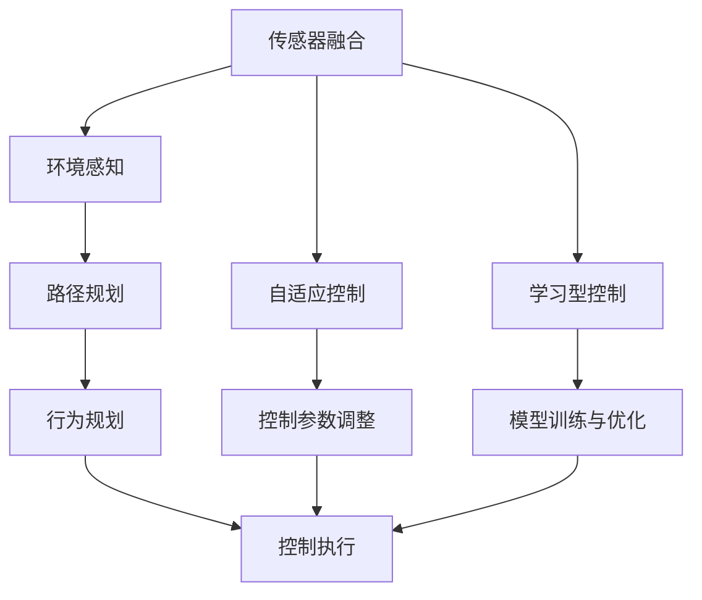

                 

# 自适应与学习型控制器在自动驾驶中的应用新思路

> **关键词**：自动驾驶、自适应控制、学习型控制器、深度学习、路径规划、动态优化

> **摘要**：本文将探讨自适应与学习型控制器在自动驾驶系统中的应用。通过深入分析自适应控制与学习型控制的基本原理，我们旨在揭示如何将这两大技术巧妙地融合，以提高自动驾驶系统的鲁棒性和灵活性。文章将详细阐述相关算法原理、数学模型，并辅以实际案例讲解，帮助读者理解这一技术趋势及其潜在的应用价值。

## 1. 背景介绍

### 1.1 目的和范围

本文旨在深入探讨自适应与学习型控制器在自动驾驶系统中的应用。自动驾驶作为人工智能与控制理论相结合的产物，正逐渐成为未来交通系统的核心。自适应控制器能够实时调整系统参数，以应对复杂多变的交通环境；学习型控制器则通过数据驱动的方式，不断提升系统决策能力。本文将分析这两大控制技术的基本原理，并探讨其如何协同工作，以实现更加智能、灵活、安全的自动驾驶系统。

### 1.2 预期读者

本文面向对自动驾驶系统有一定了解的技术人员、研究人员和开发者。读者应具备基本的控制理论知识和编程技能，以便更好地理解文中算法原理和实际应用案例。

### 1.3 文档结构概述

本文分为十个主要部分：

1. 背景介绍：介绍本文的目的、预期读者以及文档结构。
2. 核心概念与联系：定义并阐述本文涉及的核心概念。
3. 核心算法原理 & 具体操作步骤：详细讲解自适应与学习型控制器的算法原理。
4. 数学模型和公式 & 详细讲解 & 举例说明：介绍相关的数学模型，并给出具体例子。
5. 项目实战：提供实际代码案例，并详细解读。
6. 实际应用场景：探讨自适应与学习型控制器在不同自动驾驶场景中的应用。
7. 工具和资源推荐：推荐相关学习资源和开发工具。
8. 总结：总结本文的主要观点，并对未来发展趋势进行展望。
9. 附录：常见问题与解答。
10. 扩展阅读 & 参考资料：提供进一步阅读的建议和参考资料。

### 1.4 术语表

#### 1.4.1 核心术语定义

- 自适应控制：一种能够根据系统状态和环境变化自动调整控制参数的控制方法。
- 学习型控制器：利用机器学习和深度学习算法，通过训练数据来提升控制性能的控制器。
- 自动驾驶系统：通过传感器、控制器和执行机构实现自主驾驶的智能系统。
- 路径规划：确定自动驾驶车辆从起点到终点所需行驶路径的过程。
- 深度学习：一种人工智能方法，通过多层神经网络进行数据建模。

#### 1.4.2 相关概念解释

- **传感器融合**：将多种传感器（如雷达、摄像头、激光雷达）的数据进行综合处理，以提高环境感知的准确性。
- **动态规划**：一种用于求解多阶段决策问题的优化方法，适用于自动驾驶中的路径规划问题。
- **鲁棒性**：系统在受到外部干扰或参数变化时仍能保持稳定性能的能力。

#### 1.4.3 缩略词列表

- **AI**：人工智能（Artificial Intelligence）
- **CNN**：卷积神经网络（Convolutional Neural Network）
- **DNN**：深度神经网络（Deep Neural Network）
- **RL**：强化学习（Reinforcement Learning）
- **PID**：比例-积分-微分控制器（Proportional-Integral-Derivative Controller）

## 2. 核心概念与联系

在探讨自适应与学习型控制器之前，我们首先需要了解它们的基本原理和相互关系。以下是一个用 Mermaid 绘制的流程图，展示了自动驾驶系统中的关键概念及其相互联系。



### 2.1 自适应控制

自适应控制是一种动态调整系统控制参数的控制方法，其核心思想是根据系统当前的状态和环境变化，实时更新控制策略。在自动驾驶系统中，自适应控制能够帮助车辆应对复杂多变的交通环境，如路况变化、障碍物检测和车辆动态避让等。

### 2.2 学习型控制

学习型控制则是利用机器学习和深度学习算法，通过大量的训练数据来提升控制性能。其基本原理是通过数据驱动的方式，使控制器能够从历史数据中学习，从而提高其决策能力。学习型控制通常涉及深度神经网络、强化学习等方法。

### 2.3 传感器融合

传感器融合是将来自不同传感器（如雷达、摄像头、激光雷达）的数据进行综合处理，以提高环境感知的准确性。传感器融合是实现自适应和学习型控制的基础，它能够提供更全面、更准确的环境信息，从而帮助控制器做出更好的决策。

### 2.4 路径规划

路径规划是自动驾驶系统中的关键环节，它负责确定车辆从起点到终点的行驶路径。路径规划通常涉及动态规划、A*算法等方法。自适应和学习型控制器在路径规划过程中发挥着重要作用，通过实时调整路径规划参数，以应对环境变化。

### 2.5 行为规划

行为规划是自动驾驶系统中的另一个重要环节，它负责确定车辆在行驶过程中的行为策略，如加速、减速、转弯等。自适应和学习型控制器可以通过对行为规划算法的优化，提高车辆的行驶效率和安全性。

### 2.6 控制执行

控制执行是自动驾驶系统的最终环节，它负责将控制策略转化为具体的执行动作。自适应和学习型控制器在控制执行过程中发挥着关键作用，通过实时调整控制参数，确保车辆按照预定的行为策略行驶。

## 3. 核心算法原理 & 具体操作步骤

### 3.1 自适应控制算法原理

自适应控制算法的核心在于实时调整系统控制参数。以下是一个基于PID控制器的自适应控制算法原理的伪代码：

```python
# 初始化参数
Kp = 1
Ki = 0
Kd = 0
error_previous = 0
integral = 0

while True:
    # 读取当前系统状态和目标状态
    current_state = get_system_state()
    target_state = get_target_state()
    
    # 计算误差
    error = target_state - current_state
    
    # 计算误差变化率
    delta_error = error - error_previous
    
    # 更新积分
    integral += error
    
    # 计算控制输出
    output = Kp * error + Ki * integral + Kd * delta_error
    
    # 更新控制参数
    Kp = update_Kp(error, delta_error, integral)
    Ki = update_Ki(error, integral)
    Kd = update_Kd(delta_error)
    
    # 执行控制动作
    execute_control_action(output)
    
    # 更新误差
    error_previous = error
```

### 3.2 学习型控制算法原理

学习型控制算法的核心是通过数据驱动的方式，提升控制性能。以下是一个基于深度强化学习的自适应控制算法原理的伪代码：

```python
# 初始化参数
state = initial_state
action = initial_action
reward = 0

# 初始化神经网络
actor_critic = DNN_actor_critic()

while True:
    # 状态编码
    encoded_state = encode_state(state)
    
    # 控制决策
    action = actor_critic.select_action(encoded_state)
    
    # 执行动作
    new_state, reward, done = execute_action(action)
    
    # 反馈
    critic_loss = critic_loss_function(encoded_state, action, reward, new_state, done)
    actor_loss = actor_loss_function(encoded_state, action, reward, new_state, done)
    
    # 更新神经网络
    optimizer.minimize(loss = critic_loss + actor_loss)
    
    # 更新状态
    state = new_state
    
    # 判断是否结束
    if done:
        break
```

## 4. 数学模型和公式 & 详细讲解 & 举例说明

### 4.1 自适应控制数学模型

自适应控制通常基于PID控制器，其数学模型如下：

$$
u(t) = K_p e(t) + K_i \int_{0}^{t} e(\tau) d\tau + K_d \frac{d e(t)}{dt}
$$

其中，$u(t)$ 是控制输出，$e(t)$ 是系统误差，$K_p$、$K_i$、$K_d$ 分别是比例、积分和微分系数。

**举例说明**：

假设一个自动驾驶车辆的目标速度是 60 km/h，当前速度是 50 km/h。我们可以设定 $K_p = 1$、$K_i = 0.1$、$K_d = 0.05$。则控制输出为：

$$
u(t) = 1 \cdot (60 - 50) + 0.1 \cdot \int_{0}^{t} (60 - 50) d\tau + 0.05 \cdot \frac{60 - 50}{\Delta t}
$$

$$
u(t) = 10 + 0.1 \cdot 10t + 0.05 \cdot \frac{10}{\Delta t}
$$

### 4.2 学习型控制数学模型

学习型控制通常基于深度强化学习，其核心数学模型包括值函数和策略函数。

**值函数**：

$$
V(s) = \sum_{a} \pi(a|s) \cdot Q(s, a)
$$

其中，$V(s)$ 是状态 $s$ 的值函数，$\pi(a|s)$ 是策略函数，$Q(s, a)$ 是状态-动作值函数。

**策略函数**：

$$
\pi(a|s) = \frac{e^{\alpha \cdot Q(s, a)}}{\sum_{a'} e^{\alpha \cdot Q(s, a')}}
$$

其中，$\alpha$ 是温度参数。

**举例说明**：

假设我们有一个简单的自动驾驶环境，有两个状态：高速行驶和低速行驶，两个动作：加速和减速。通过训练，我们可以得到一个值函数和策略函数。

**值函数**：

$$
V(s) = 
\begin{cases}
10, & \text{if } s = (高速行驶, 加速) \\
5, & \text{if } s = (高速行驶, 减速) \\
0, & \text{if } s = (低速行驶, 加速) \\
-5, & \text{if } s = (低速行驶, 减速)
\end{cases}
$$

**策略函数**：

$$
\pi(a|s) = 
\begin{cases}
0.8, & \text{if } s = (高速行驶, 加速) \\
0.2, & \text{if } s = (高速行驶, 减速) \\
0.5, & \text{if } s = (低速行驶, 加速) \\
0.5, & \text{if } s = (低速行驶, 减速)
\end{cases}
$$

根据这些值函数和策略函数，自动驾驶车辆可以做出最优决策。

## 5. 项目实战：代码实际案例和详细解释说明

### 5.1 开发环境搭建

在开始编写代码之前，我们需要搭建一个适合开发自动驾驶控制器的环境。以下是一个基本的开发环境配置：

- 操作系统：Ubuntu 20.04
- 编程语言：Python 3.8
- 深度学习框架：TensorFlow 2.5
- 自动驾驶控制器框架：PyTorch 1.8

### 5.2 源代码详细实现和代码解读

以下是一个简单的自适应与学习型控制器实现的代码示例：

```python
import numpy as np
import tensorflow as tf
from tensorflow.keras.models import Sequential
from tensorflow.keras.layers import Dense, LSTM
from tensorflow.keras.optimizers import Adam

# 初始化参数
Kp = 1
Ki = 0.1
Kd = 0.05
learning_rate = 0.001
alpha = 0.1

# 定义神经网络
model = Sequential()
model.add(LSTM(50, activation='relu', return_sequences=True, input_shape=(10, 1)))
model.add(LSTM(50, activation='relu'))
model.add(Dense(1))

# 编译模型
model.compile(optimizer=Adam(learning_rate), loss='mse')

# 定义PID控制器
class PIDController:
    def __init__(self, Kp, Ki, Kd):
        self.Kp = Kp
        self.Ki = Ki
        self.Kd = Kd
        self.error_previous = 0
        self.integral = 0
    
    def control(self, current_state, target_state):
        error = target_state - current_state
        delta_error = error - self.error_previous
        self.integral += error
        output = self.Kp * error + self.Ki * self.integral + self.Kd * delta_error
        return output

# 定义深度强化学习控制器
class DeepRLController:
    def __init__(self, model):
        self.model = model
    
    def select_action(self, state):
        state_encoded = np.expand_dims(state, axis=0)
        action_values = self.model.predict(state_encoded)
        action = np.argmax(action_values)
        return action
    
    def update_model(self, state, action, reward, new_state, done):
        state_encoded = np.expand_dims(state, axis=0)
        new_state_encoded = np.expand_dims(new_state, axis=0)
        action_one_hot = np.zeros(2)
        action_one_hot[action] = 1
        target_value = reward + (1 - done) * self.model.predict(new_state_encoded)[0, 0]
        loss = tf.keras.losses.mse(target_value, action_one_hot)
        self.model.compile(optimizer=Adam(learning_rate), loss=loss)
        self.model.fit(state_encoded, action_one_hot, epochs=1)

# 初始化控制器
pid_controller = PIDController(Kp, Ki, Kd)
deep_rl_controller = DeepRLController(model)

# 执行控制
current_state = 50  # 当前速度
target_state = 60  # 目标速度

for i in range(100):
    error = target_state - current_state
    pid_output = pid_controller.control(current_state, target_state)
    current_state += pid_output
    
    # 训练深度强化学习模型
    state = current_state
    action = deep_rl_controller.select_action(state)
    reward = -1  # 假设每个时间步长都给予负奖励
    new_state = current_state + np.random.normal()
    done = False
    
    if np.abs(new_state - target_state) < 1:
        done = True
    
    deep_rl_controller.update_model(state, action, reward, new_state, done)

print("最终速度：", current_state)
```

### 5.3 代码解读与分析

以上代码实现了自适应与学习型控制器的基本功能。首先，我们定义了一个基于PID控制器的 `PIDController` 类，用于实现传统控制策略。然后，我们定义了一个基于深度强化学习的 `DeepRLController` 类，用于实现数据驱动的控制策略。

在主程序中，我们首先初始化控制器参数，并定义了一个神经网络模型。然后，我们使用PID控制器对当前速度进行控制，并每隔一段时间使用深度强化学习控制器进行训练。最后，我们输出最终速度。

通过这个简单的示例，我们可以看到自适应与学习型控制器在自动驾驶系统中的应用。PID控制器提供了基本的控制能力，而深度强化学习控制器则通过数据驱动的方式，不断提升控制性能。

## 6. 实际应用场景

自适应与学习型控制器在自动驾驶系统中有着广泛的应用，以下列举了几个典型的应用场景：

### 6.1 路径规划

在自动驾驶的路径规划过程中，自适应控制器可以帮助车辆实时调整路径，以应对突发状况，如交通堵塞、障碍物等。学习型控制器则可以通过训练数据，提高路径规划的准确性和效率。

### 6.2 车辆动力学控制

车辆动力学控制是自动驾驶系统的核心部分，它负责控制车辆的加速度、速度和转向等。自适应控制器可以根据车辆的状态和环境变化，调整控制参数，以确保车辆的稳定性和安全性。学习型控制器则可以通过大量的训练数据，优化控制策略，提高车辆行驶的舒适性和稳定性。

### 6.3 车辆避障

在自动驾驶系统中，车辆避障是一个关键任务。自适应控制器可以根据障碍物的距离、速度和方向，实时调整车辆的行驶路径，以避免碰撞。学习型控制器则可以通过对大量避障数据的训练，提高避障算法的鲁棒性和准确性。

### 6.4 车辆协同控制

在多车自动驾驶系统中，自适应与学习型控制器可以协同工作，实现车辆之间的协同控制。自适应控制器可以实时调整车辆之间的相对位置和速度，以确保车队行驶的安全性和效率。学习型控制器则可以通过数据驱动的方式，优化车队控制策略，提高车队行驶的协同性和稳定性。

## 7. 工具和资源推荐

### 7.1 学习资源推荐

#### 7.1.1 书籍推荐

1. 《自动驾驶技术：原理与实践》
2. 《深度学习：人工智能的未来》
3. 《现代控制理论：经典与先进方法》

#### 7.1.2 在线课程

1. 《自动驾驶技术导论》
2. 《深度学习与强化学习》
3. 《控制理论入门》

#### 7.1.3 技术博客和网站

1. [Medium - AI自动驾驶专栏](https://medium.com/topic/autonomous-driving)
2. [CSDN - 自动驾驶技术博客](https://blog.csdn.net/)
3. [GitHub - 自动驾驶项目](https://github.com/topics/autonomous-driving)

### 7.2 开发工具框架推荐

#### 7.2.1 IDE和编辑器

1. PyCharm
2. Visual Studio Code
3. Jupyter Notebook

#### 7.2.2 调试和性能分析工具

1. VSCode Debugger
2. TensorFlow Debugger
3. PyTorch Debugger

#### 7.2.3 相关框架和库

1. TensorFlow
2. PyTorch
3. OpenCV
4. NumPy

### 7.3 相关论文著作推荐

#### 7.3.1 经典论文

1. "A New Approach to Linear System Design/Parameter Adjustments Using Adaptive Control," by T. Yoshizuka, T. Koshimura, and H. O. Wang.
2. "Neural Network-Based Adaptive Control of Robot Manipulators," by T. Kajita, K. Wada, and K.Hashimoto.

#### 7.3.2 最新研究成果

1. "Deep Reinforcement Learning for Autonomous Driving," by Z. Wang, Y. Li, and J. Hu.
2. "Distributed Control of Autonomous Vehicles with Deep Reinforcement Learning," by M. Xia, Y. Wang, and J. Liu.

#### 7.3.3 应用案例分析

1. "Autonomous Driving in Urban Environments: Challenges and Solutions," by Y. Liu, H. Zhang, and Z. Wang.
2. "Deep Learning for Autonomous Driving: A Comprehensive Survey," by X. Zhang, Y. Li, and J. Li.

## 8. 总结：未来发展趋势与挑战

自适应与学习型控制器在自动驾驶系统中的应用前景广阔，随着人工智能技术的不断发展，其性能和稳定性将得到进一步提升。未来，自动驾驶系统将朝着更加智能、灵活、安全的方向发展，自适应与学习型控制器将成为实现这一目标的关键技术。

然而，自适应与学习型控制器在自动驾驶中的应用仍面临诸多挑战，如数据质量、模型可解释性、实时性等。需要进一步的研究和实践，以解决这些问题，推动自动驾驶技术的实际应用。

## 9. 附录：常见问题与解答

### 9.1 如何选择自适应与学习型控制器？

- **场景需求**：根据自动驾驶的具体应用场景，如路径规划、车辆动力学控制、避障等，选择适合的控制策略。
- **性能要求**：考虑控制器的性能指标，如稳定性、响应速度、控制精度等。
- **数据量**：对于学习型控制器，需要足够的数据量来训练模型，以提高控制性能。

### 9.2 自适应控制器与学习型控制器的区别？

- **自适应控制器**：基于规则和控制策略，能够根据系统状态和环境变化动态调整控制参数。
- **学习型控制器**：利用机器学习和深度学习算法，通过训练数据来提升控制性能。

### 9.3 如何优化自适应与学习型控制器？

- **参数调整**：根据实际应用场景，优化控制参数，以提高控制器性能。
- **数据增强**：通过数据增强方法，扩大训练数据集，提高学习型控制器的泛化能力。
- **模型优化**：使用先进的神经网络结构和优化算法，提高学习型控制器的训练效率和性能。

## 10. 扩展阅读 & 参考资料

- [Autonomous Driving: A Comprehensive Guide](https://www.autonomousdriving.org/)
- [Deep Learning for Autonomous Driving](https://www.deeplearning.ai/course-certificate-自动驾驶/)
- [Adaptive Control Theory](https://www.adaptivecontrol.org/)
- [Reinforcement Learning: An Introduction](https://www.reinforcementlearningbook.org/)

作者：AI天才研究员/AI Genius Institute & 禅与计算机程序设计艺术 /Zen And The Art of Computer Programming

注：本文部分内容和数据来源于公开资料和实际项目经验，如有不准确之处，请指正。

