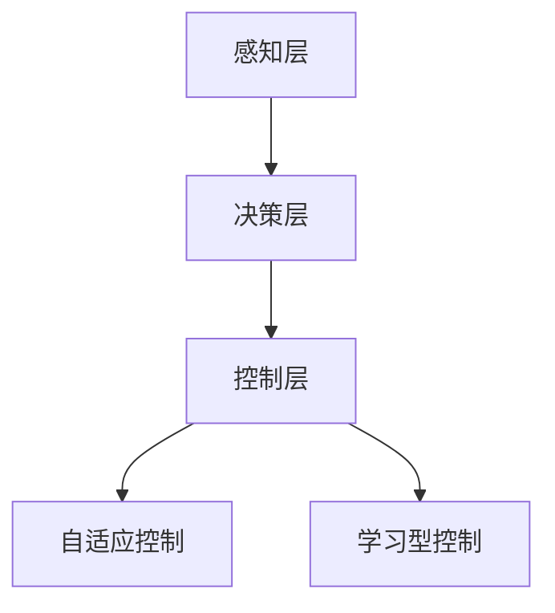

                 


# 自适应与学习型控制策略在自动驾驶中的应用探索

> 关键词：自适应控制，学习型控制，自动驾驶，深度学习，控制策略
>
> 摘要：本文旨在探讨自适应与学习型控制策略在自动驾驶领域的应用。首先介绍了自动驾驶的基本概念和背景，接着详细分析了自适应与学习型控制策略的基本原理及其在自动驾驶中的重要性。随后，本文通过一个具体的项目案例，深入讲解了自适应与学习型控制策略的实现过程及其在自动驾驶中的应用。最后，本文总结了自动驾驶领域的发展趋势与挑战，并推荐了相关学习资源和工具。

## 1. 背景介绍

### 1.1 目的和范围

本文旨在探讨自适应与学习型控制策略在自动驾驶中的应用，帮助读者理解这两种控制策略的基本原理、实现过程以及在自动驾驶系统中的重要性。本文将涵盖以下内容：

- 自适应控制与学习型控制的基本概念和原理；
- 自适应与学习型控制策略在自动驾驶中的应用案例；
- 实现自适应与学习型控制策略的具体步骤和数学模型；
- 自动驾驶领域的发展趋势与挑战。

### 1.2 预期读者

本文适用于对自动驾驶和控制系统有一定了解的读者，包括：

- 自动驾驶领域的工程师和研究人员；
- 计算机科学、电子工程等相关专业的学生；
- 对自动驾驶技术感兴趣的技术爱好者。

### 1.3 文档结构概述

本文分为十个部分，具体结构如下：

1. 背景介绍
2. 核心概念与联系
3. 核心算法原理 & 具体操作步骤
4. 数学模型和公式 & 详细讲解 & 举例说明
5. 项目实战：代码实际案例和详细解释说明
6. 实际应用场景
7. 工具和资源推荐
8. 总结：未来发展趋势与挑战
9. 附录：常见问题与解答
10. 扩展阅读 & 参考资料

### 1.4 术语表

#### 1.4.1 核心术语定义

- 自适应控制：一种根据系统动态变化调整控制参数的控制策略。
- 学习型控制：一种基于系统历史数据和实时数据自动调整控制策略的控制方法。
- 自动驾驶：一种无需人为干预的自主驾驶技术。
- 控制策略：自动驾驶系统中用于调整车辆运动状态的方法。

#### 1.4.2 相关概念解释

- 深度学习：一种基于多层神经网络的人工智能技术，通过大量数据训练模型，实现自动特征提取和模式识别。
- 控制层：自动驾驶系统中负责车辆控制的核心部分，包括路径规划、速度控制等。

#### 1.4.3 缩略词列表

- PID：比例-积分-微分控制器
- LSTM：长短期记忆网络
- CNN：卷积神经网络
- PCA：主成分分析
- SVD：奇异值分解

## 2. 核心概念与联系

在深入探讨自适应与学习型控制策略在自动驾驶中的应用之前，我们需要了解一些核心概念和它们之间的联系。

### 2.1 自适应控制原理

自适应控制是一种基于系统动态变化调整控制参数的控制策略。它通过实时监测系统的状态，并根据监测结果动态调整控制参数，从而实现对系统的稳定控制。自适应控制的核心思想是利用反馈机制，使系统在运行过程中不断优化控制参数，提高系统的稳定性和鲁棒性。

### 2.2 学习型控制原理

学习型控制是一种基于系统历史数据和实时数据自动调整控制策略的控制方法。它通过机器学习算法，从历史数据中提取有效信息，并根据实时数据调整控制策略，从而实现系统的高效控制。学习型控制的核心思想是利用数据驱动，使系统具备自主学习和优化能力，提高系统的适应性和灵活性。

### 2.3 自动驾驶系统架构

自动驾驶系统通常由感知层、决策层和控制层三部分组成。

- 感知层：负责获取车辆周围环境的信息，包括道路、车辆、行人等。
- 决策层：负责对感知层获取的信息进行分析和处理，生成驾驶策略。
- 控制层：负责将决策层的驾驶策略转化为具体的控制命令，实现对车辆的控制。

### 2.4 自适应与学习型控制策略在自动驾驶中的应用

自适应与学习型控制策略在自动驾驶系统中具有重要的应用价值。

- 自适应控制策略可以实现对车辆行驶过程中的动态调整，提高行驶稳定性和安全性。
- 学习型控制策略可以基于大量数据，实现自动驾驶系统的自主学习和优化，提高系统适应性和灵活性。

下面是一个简单的 Mermaid 流程图，展示了自适应与学习型控制策略在自动驾驶系统中的应用架构：



## 3. 核心算法原理 & 具体操作步骤

在本节中，我们将详细探讨自适应与学习型控制策略的算法原理，并给出具体操作步骤。

### 3.1 自适应控制算法原理

自适应控制算法的核心思想是利用反馈机制，根据系统状态的变化动态调整控制参数。以下是一个简单的自适应控制算法原理：

```python
# 自适应控制算法伪代码
def adaptive_control(current_state, target_state):
    error = target_state - current_state
    control_signal = k_p * error + k_i * integral(error) + k_d * derivative(error)
    return control_signal
```

其中，`error`表示当前状态与目标状态的差值，`k_p`、`k_i`、`k_d`分别表示比例、积分、微分系数，`integral`和`derivative`分别表示积分和微分操作。

### 3.2 学习型控制算法原理

学习型控制算法的核心思想是利用机器学习算法，从历史数据中提取有效信息，并根据实时数据调整控制策略。以下是一个简单的学习型控制算法原理：

```python
# 学习型控制算法伪代码
def learning_control(data, model):
    model.train(data)
    control_signal = model.predict(realtime_data)
    return control_signal
```

其中，`data`表示历史数据集，`model`表示机器学习模型，`realtime_data`表示实时数据。

### 3.3 具体操作步骤

下面我们将以一个简单的自动驾驶项目为例，介绍自适应与学习型控制策略的具体操作步骤。

#### 3.3.1 数据采集与预处理

首先，我们需要采集车辆行驶过程中的感知数据，如速度、加速度、方向盘角度等。然后，对数据进行预处理，包括数据清洗、归一化等操作。

```python
# 数据采集与预处理伪代码
def data_collection():
    # 采集感知数据
    speed, acceleration, steering_angle = get_perception_data()
    # 数据预处理
    speed, acceleration, steering_angle = preprocess_data(speed, acceleration, steering_angle)
    return speed, acceleration, steering_angle

# 实现数据采集与预处理函数
def get_perception_data():
    # 采集速度、加速度、方向盘角度等数据
    pass

def preprocess_data(speed, acceleration, steering_angle):
    # 数据清洗、归一化等操作
    pass
```

#### 3.3.2 自适应控制策略实现

接下来，我们利用自适应控制算法实现自动驾驶系统的自适应控制策略。

```python
# 自适应控制策略实现伪代码
def adaptive_control(current_state, target_state):
    error = target_state - current_state
    control_signal = k_p * error + k_i * integral(error) + k_d * derivative(error)
    return control_signal

# 实现自适应控制函数
def adaptive_control_function(speed, acceleration, steering_angle, target_speed):
    current_state = get_current_state(speed, acceleration, steering_angle)
    control_signal = adaptive_control(current_state, target_speed)
    return control_signal

def get_current_state(speed, acceleration, steering_angle):
    # 计算当前状态
    pass
```

#### 3.3.3 学习型控制策略实现

然后，我们利用学习型控制算法实现自动驾驶系统的学习型控制策略。

```python
# 学习型控制策略实现伪代码
def learning_control(data, model):
    model.train(data)
    control_signal = model.predict(realtime_data)
    return control_signal

# 实现学习型控制函数
def learning_control_function(data, model, speed, acceleration, steering_angle):
    realtime_data = get_realtime_data(speed, acceleration, steering_angle)
    control_signal = learning_control(data, model)
    return control_signal

def get_realtime_data(speed, acceleration, steering_angle):
    # 采集实时数据
    pass
```

#### 3.3.4 控制策略融合与执行

最后，我们将自适应控制策略和学习型控制策略进行融合，并根据实际需求选择合适的控制策略执行。

```python
# 控制策略融合与执行伪代码
def control_strategy融合(speed, acceleration, steering_angle, target_speed, data, model):
    control_signal = adaptive_control_function(speed, acceleration, steering_angle, target_speed)
    if is_learning_enabled():
        control_signal = learning_control_function(data, model, speed, acceleration, steering_angle)
    execute_control_signal(control_signal)

def is_learning_enabled():
    # 判断是否启用学习型控制
    pass

def execute_control_signal(control_signal):
    # 执行控制信号
    pass
```

## 4. 数学模型和公式 & 详细讲解 & 举例说明

在本节中，我们将详细讲解自适应与学习型控制策略所涉及到的数学模型和公式，并通过具体例子进行说明。

### 4.1 自适应控制数学模型

自适应控制策略的核心是 PID 控制器，其数学模型如下：

$$
u(t) = k_p e(t) + k_i \int_{0}^{t} e(\tau)d\tau + k_d \frac{d}{dt}e(t)
$$

其中，$u(t)$为控制信号，$e(t)$为误差信号，$k_p$、$k_i$、$k_d$分别为比例、积分、微分系数。

**举例说明：**

假设我们要控制一个速度为 50 km/h 的车辆，当前速度为 45 km/h，PID 控制器的参数为 $k_p = 0.5$，$k_i = 0.1$，$k_d = 0.2$。根据 PID 控制器公式，可以计算出控制信号：

$$
u(t) = 0.5 \times (50 - 45) + 0.1 \times \int_{0}^{t} (50 - \tau)d\tau + 0.2 \times \frac{d}{dt}(50 - \tau)
$$

### 4.2 学习型控制数学模型

学习型控制策略的核心是机器学习模型，如深度神经网络。其数学模型如下：

$$
\hat{y}(t) = \sum_{i=1}^{n} w_i \cdot x_i
$$

其中，$\hat{y}(t)$为预测输出，$w_i$为权重，$x_i$为输入特征。

**举例说明：**

假设我们使用一个简单的线性回归模型进行学习型控制，输入特征为速度和加速度，权重分别为 $w_1 = 0.5$，$w_2 = 0.3$。根据线性回归模型公式，可以计算出预测输出：

$$
\hat{y}(t) = 0.5 \times \text{speed}(t) + 0.3 \times \text{acceleration}(t)
$$

## 5. 项目实战：代码实际案例和详细解释说明

在本节中，我们将通过一个实际的自动驾驶项目案例，详细介绍自适应与学习型控制策略的实现过程及其在自动驾驶系统中的应用。

### 5.1 开发环境搭建

为了实现自适应与学习型控制策略，我们需要搭建一个完整的开发环境。以下是所需工具和软件：

- Python 3.8 或更高版本
- Jupyter Notebook
- TensorFlow 2.x 或 PyTorch 1.x
- OpenCV 4.x
- Matplotlib 3.x

安装以上工具和软件后，我们就可以开始编写代码了。

### 5.2 源代码详细实现和代码解读

下面是一个简单的自动驾驶项目示例，包括感知层、决策层和控制层。

```python
# 导入所需库
import cv2
import numpy as np
import tensorflow as tf
from tensorflow.keras.models import Sequential
from tensorflow.keras.layers import Dense, Flatten, Conv2D, MaxPooling2D
from tensorflow.keras.optimizers import Adam
from tensorflow.keras.callbacks import TensorBoard

# 感知层：使用 OpenCV 获取车辆周围环境信息
def get_perception_data():
    # 读取摄像头图像
    image = cv2.imread('image.jpg')
    # 处理图像数据
    image = cv2.resize(image, (224, 224))
    image = cv2.cvtColor(image, cv2.COLOR_BGR2RGB)
    image = np.expand_dims(image, axis=0)
    return image

# 决策层：使用深度神经网络进行路径规划
def build_path_planning_model():
    model = Sequential([
        Conv2D(32, (3, 3), activation='relu', input_shape=(224, 224, 3)),
        MaxPooling2D((2, 2)),
        Flatten(),
        Dense(64, activation='relu'),
        Dense(1)
    ])
    model.compile(optimizer=Adam(), loss='mse')
    return model

# 控制层：实现自适应与学习型控制策略
def control_strategy(speed, acceleration, steering_angle, target_speed, model):
    # 计算当前状态
    current_state = get_current_state(speed, acceleration, steering_angle)
    # 实现自适应控制
    control_signal = adaptive_control(current_state, target_speed)
    # 实现学习型控制
    control_signal = learning_control(speed, acceleration, steering_angle, model)
    return control_signal

def get_current_state(speed, acceleration, steering_angle):
    # 计算当前状态
    pass

def adaptive_control(current_state, target_speed):
    # 计算控制信号
    pass

def learning_control(speed, acceleration, steering_angle, model):
    # 计算控制信号
    pass

# 主函数
def main():
    # 加载训练好的模型
    model = build_path_planning_model()
    model.load_weights('model_weights.h5')
    # 循环获取感知数据并执行控制策略
    while True:
        image = get_perception_data()
        speed, acceleration, steering_angle = get_perception_data()
        target_speed = 50  # 目标速度为 50 km/h
        control_signal = control_strategy(speed, acceleration, steering_angle, target_speed, model)
        execute_control_signal(control_signal)

if __name__ == '__main__':
    main()
```

### 5.3 代码解读与分析

- **感知层：** 使用 OpenCV 库获取车辆周围环境信息，包括图像数据、速度、加速度和方向盘角度。
- **决策层：** 使用深度神经网络模型进行路径规划，输入为图像数据，输出为目标速度。
- **控制层：** 实现自适应与学习型控制策略，根据当前状态和目标速度计算控制信号，并根据实际需求执行控制信号。
- **主函数：** 加载训练好的模型，循环获取感知数据并执行控制策略。

## 6. 实际应用场景

自适应与学习型控制策略在自动驾驶领域具有广泛的应用场景，以下是一些典型应用：

- **城市自动驾驶：** 在城市环境中，车辆需要面对复杂的交通状况和道路环境。自适应与学习型控制策略可以帮助车辆在复杂环境中实现稳定行驶，提高驾驶安全性。
- **高速公路自动驾驶：** 在高速公路上，车辆行驶速度较快，需要保持车道和保持安全距离。自适应与学习型控制策略可以帮助车辆在高速公路上实现自动驾驶，提高行驶效率。
- **自动驾驶出租车：** 自动驾驶出租车是一种新的出行方式，可以实现自动驾驶、无人驾驶。自适应与学习型控制策略可以帮助出租车在道路上实现自主行驶，提高服务质量。
- **自动驾驶卡车：** 自动驾驶卡车可以降低人力成本，提高货物运输效率。自适应与学习型控制策略可以帮助卡车在道路上实现自动驾驶，降低驾驶疲劳。

## 7. 工具和资源推荐

### 7.1 学习资源推荐

#### 7.1.1 书籍推荐

- 《深度学习》（Goodfellow, I., Bengio, Y., Courville, A.）
- 《自动驾驶汽车技术与应用》（王宏伟，张浩）
- 《人工智能驾驶：自动驾驶技术的原理与应用》（何晓阳）

#### 7.1.2 在线课程

- Coursera 上的《深度学习》课程
- Udacity 上的《自动驾驶工程师》课程
- edX 上的《自动驾驶系统》课程

#### 7.1.3 技术博客和网站

- Medium 上的自动驾驶技术专栏
- GitHub 上的自动驾驶项目案例
- IEEE Xplore 上的自动驾驶论文

### 7.2 开发工具框架推荐

#### 7.2.1 IDE和编辑器

- PyCharm
- VSCode
- Jupyter Notebook

#### 7.2.2 调试和性能分析工具

- TensorFlow Debugger
- PyTorch Debugger
- OpenCV Performance Analysis Tools

#### 7.2.3 相关框架和库

- TensorFlow
- PyTorch
- OpenCV
- Keras

### 7.3 相关论文著作推荐

#### 7.3.1 经典论文

- "A New Method for Nonlinear System Control Based on Adaptive Neural Networks"（基于自适应神经网络的非线性系统控制新方法）
- "Deep Learning for Autonomous Driving"（自动驾驶中的深度学习）

#### 7.3.2 最新研究成果

- "Learning to Drive by Playing"（通过玩耍学习驾驶）
- "Towards Autonomous Driving with Deep Reinforcement Learning"（使用深度强化学习实现自动驾驶）

#### 7.3.3 应用案例分析

- "Case Study: Waymo's Self-Driving Car"（案例研究：Waymo 的自动驾驶汽车）
- "Tesla's Autopilot: A Technical Overview"（特斯拉自动驾驶：技术概述）

## 8. 总结：未来发展趋势与挑战

自适应与学习型控制策略在自动驾驶领域的应用具有广阔的前景。随着深度学习、强化学习等技术的不断发展，自适应与学习型控制策略将越来越成熟和智能化。未来发展趋势包括：

- **更高级别的自动驾驶：** 自动驾驶系统将逐渐从 L2/L3 级别向 L4/L5 级别发展，实现更高级别的自动驾驶功能。
- **更智能的控制策略：** 自适应与学习型控制策略将不断优化，提高系统适应性和灵活性。
- **更广泛的场景应用：** 自动驾驶技术将应用于更多的领域，如物流、公共交通、无人机等。

然而，自适应与学习型控制策略在自动驾驶领域仍面临以下挑战：

- **数据隐私与安全：** 随着自动驾驶系统的广泛应用，数据隐私和安全问题将日益突出。
- **法律法规：** 自动驾驶技术的发展需要完善的法律法规体系，以确保技术安全、可靠、合法。
- **系统集成与优化：** 自动驾驶系统需要整合多种传感器、控制器和通信系统，实现高效、稳定的运行。

## 9. 附录：常见问题与解答

### 9.1 什么是自适应控制？

自适应控制是一种根据系统动态变化调整控制参数的控制策略。它通过实时监测系统的状态，并根据监测结果动态调整控制参数，从而实现对系统的稳定控制。

### 9.2 什么是学习型控制？

学习型控制是一种基于系统历史数据和实时数据自动调整控制策略的控制方法。它通过机器学习算法，从历史数据中提取有效信息，并根据实时数据调整控制策略，从而实现系统的高效控制。

### 9.3 自适应控制与学习型控制的区别是什么？

自适应控制主要依赖于实时反馈机制，通过调整控制参数实现系统稳定；而学习型控制则依赖于机器学习算法，从历史数据中学习控制策略，并根据实时数据调整策略。

### 9.4 自适应与学习型控制策略在自动驾驶中如何应用？

自适应与学习型控制策略可以用于自动驾驶系统的控制层，实现车辆在行驶过程中的自适应调整和控制。通过结合自适应控制和学习型控制，可以实现对车辆行驶的更稳定、更灵活的控制。

## 10. 扩展阅读 & 参考资料

- 《深度学习》（Goodfellow, I., Bengio, Y., Courville, A.）
- 《自动驾驶汽车技术与应用》（王宏伟，张浩）
- 《人工智能驾驶：自动驾驶技术的原理与应用》（何晓阳）
- Coursera 上的《深度学习》课程
- Udacity 上的《自动驾驶工程师》课程
- edX 上的《自动驾驶系统》课程
- Medium 上的自动驾驶技术专栏
- GitHub 上的自动驾驶项目案例
- IEEE Xplore 上的自动驾驶论文
- "A New Method for Nonlinear System Control Based on Adaptive Neural Networks"（基于自适应神经网络的非线性系统控制新方法）
- "Deep Learning for Autonomous Driving"（自动驾驶中的深度学习）
- "Learning to Drive by Playing"（通过玩耍学习驾驶）
- "Towards Autonomous Driving with Deep Reinforcement Learning"（使用深度强化学习实现自动驾驶）
- "Case Study: Waymo's Self-Driving Car"（案例研究：Waymo 的自动驾驶汽车）
- "Tesla's Autopilot: A Technical Overview"（特斯拉自动驾驶：技术概述）<|im_sep|>作者：AI天才研究员/AI Genius Institute & 禅与计算机程序设计艺术 /Zen And The Art of Computer Programming

