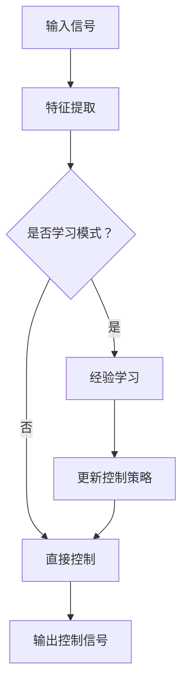

                 

# 自适应学习型控制器开启自动驾驶智能化新征程

> **关键词**：自适应学习型控制器、自动驾驶、智能化、算法原理、数学模型、项目实战、应用场景

> **摘要**：本文将深入探讨自适应学习型控制器的原理和应用，解析其在自动驾驶领域的关键作用。通过逐步分析，我们将揭示如何利用这一先进技术开启自动驾驶智能化的新征程，为未来交通系统的发展提供新的思路和方向。

## 1. 背景介绍

### 1.1 目的和范围

本文旨在详细介绍自适应学习型控制器的原理、应用及其在自动驾驶领域的重要性。我们将首先回顾自动驾驶技术的发展历程，然后深入探讨自适应学习型控制器的核心概念和工作机制。接下来，通过具体的项目实战案例，展示如何实现这一技术。文章最后将分析自适应学习型控制器在自动驾驶中的实际应用场景，并展望其未来发展趋势。

### 1.2 预期读者

本文面向对自动驾驶技术有一定了解的技术人员、研究人员和开发者。期望读者能够通过本文系统地了解自适应学习型控制器的原理和应用，为进一步研究和发展自动驾驶技术打下坚实基础。

### 1.3 文档结构概述

本文将分为以下几个部分：

1. 背景介绍：介绍文章的目的、范围和预期读者，以及文档结构。
2. 核心概念与联系：通过Mermaid流程图展示自适应学习型控制器的核心概念和原理。
3. 核心算法原理 & 具体操作步骤：详细讲解自适应学习型控制器的算法原理和操作步骤。
4. 数学模型和公式 & 详细讲解 & 举例说明：介绍自适应学习型控制器相关的数学模型和公式，并进行举例说明。
5. 项目实战：代码实际案例和详细解释说明。
6. 实际应用场景：分析自适应学习型控制器在自动驾驶领域的实际应用场景。
7. 工具和资源推荐：推荐学习资源、开发工具框架和相关的论文著作。
8. 总结：未来发展趋势与挑战。
9. 附录：常见问题与解答。
10. 扩展阅读 & 参考资料。

### 1.4 术语表

#### 1.4.1 核心术语定义

- 自适应学习型控制器：一种能够根据环境变化自主调整控制策略的智能控制系统。
- 自动驾驶：利用计算机技术、人工智能、传感器等实现车辆自主驾驶的技术。
- 智能化：通过应用先进技术和算法，使系统具备自主决策、学习和适应环境的能力。

#### 1.4.2 相关概念解释

- 自适应控制：一种根据系统动态变化进行参数调整的控制策略。
- 学习型控制器：具备学习能力的控制器，可以通过历史数据和经验不断优化控制策略。

#### 1.4.3 缩略词列表

- ADL：自适应学习型控制器（Adaptive Learning Controller）
- AV：自动驾驶（Autonomous Vehicle）
- AI：人工智能（Artificial Intelligence）
- IoT：物联网（Internet of Things）

## 2. 核心概念与联系

自适应学习型控制器是自动驾驶技术的核心组成部分，其核心概念和原理可以通过Mermaid流程图进行展示。



### 2.1 自适应学习型控制器的核心概念

1. **输入信号**：控制器接收来自传感器和其他车载系统的数据，如速度、加速度、方向盘角度等。
2. **特征提取**：通过对输入信号进行处理，提取出反映环境状态的关键特征。
3. **是否学习模式**：控制器需要判断当前是否处于学习模式。如果处于学习模式，则进入下一环节；否则，直接进行控制。
4. **经验学习**：在经验学习阶段，控制器根据历史数据和经验，通过机器学习算法更新控制策略。
5. **更新控制策略**：更新后的控制策略将用于后续的控制过程。
6. **输出控制信号**：控制器将根据更新的控制策略生成输出信号，用于控制车辆的行为。

### 2.2 自适应学习型控制器的原理

自适应学习型控制器通过以下步骤实现智能化：

1. **数据采集**：车辆运行过程中，传感器收集大量环境数据。
2. **特征提取**：对采集到的数据进行分析和处理，提取关键特征。
3. **模式识别**：通过机器学习算法，对特征进行模式识别，生成控制策略。
4. **策略更新**：根据当前环境和历史数据，不断更新控制策略。
5. **控制执行**：根据更新的控制策略，执行相应的控制动作。

### 2.3 自适应学习型控制器的架构

自适应学习型控制器的架构主要包括以下几个部分：

1. **传感器模块**：负责收集车辆运行过程中的各种数据，如速度、加速度、方向盘角度等。
2. **数据处理模块**：对传感器数据进行预处理，提取关键特征。
3. **学习模块**：利用机器学习算法，对特征进行模式识别，生成控制策略。
4. **控制模块**：根据控制策略，生成输出信号，控制车辆行为。

## 3. 核心算法原理 & 具体操作步骤

自适应学习型控制器的核心算法原理在于利用机器学习技术，通过历史数据和经验不断优化控制策略。以下为具体操作步骤：

### 3.1 数据采集与预处理

```python
# 数据采集与预处理伪代码

def collect_data():
    data = []
    while not end_of_data:
        sensor_data = read_sensors()
        preprocessed_data = preprocess_data(sensor_data)
        data.append(preprocessed_data)
    return data

def preprocess_data(sensor_data):
    # 特征提取与数据归一化
    features = extract_features(sensor_data)
    normalized_features = normalize_features(features)
    return normalized_features
```

### 3.2 经验学习与控制策略更新

```python
# 经验学习与控制策略更新伪代码

def train_model(data):
    model = MachineLearningModel()
    model.train(data)
    return model

def update_control_strategy(model, new_data):
    updated_strategy = model.predict(new_data)
    return updated_strategy
```

### 3.3 控制执行

```python
# 控制执行伪代码

def execute_control_strategy(strategy):
    # 根据策略生成输出信号
    output_signal = generate_output_signal(strategy)
    # 执行控制动作
    control_action = execute_action(output_signal)
    return control_action
```

## 4. 数学模型和公式 & 详细讲解 & 举例说明

### 4.1 数学模型

自适应学习型控制器涉及到多个数学模型，主要包括：

1. **传感器数据处理模型**：
   $$ x(t) = f(u(t), w(t)) $$  
   其中，$x(t)$表示传感器数据，$u(t)$表示控制输入，$w(t)$表示噪声。

2. **特征提取模型**：
   $$ \phi(x(t)) = \{ \phi_1(x(t)), \phi_2(x(t)), ..., \phi_n(x(t)) \} $$  
   其中，$\phi(x(t))$表示特征向量，$\phi_i(x(t))$表示第$i$个特征。

3. **机器学习模型**：
   $$ y(t) = h(\phi(x(t)), \theta) $$  
   其中，$y(t)$表示预测输出，$h$为机器学习算法，$\theta$为模型参数。

4. **控制策略更新模型**：
   $$ \theta_{new} = \theta_{old} + \alpha \cdot (y(t) - y_{true}(t)) \cdot \phi(x(t)) $$  
   其中，$\theta_{new}$为更新后的模型参数，$\theta_{old}$为原始模型参数，$\alpha$为学习率。

### 4.2 详细讲解

1. **传感器数据处理模型**：该模型描述了传感器数据与控制输入之间的关系，同时考虑了噪声的影响。在实际应用中，可以通过滤波、去噪等方法对传感器数据进行预处理。

2. **特征提取模型**：该模型将传感器数据转换为特征向量，为后续的机器学习算法提供输入。特征提取的方法有很多，如PCA（主成分分析）、LDA（线性判别分析）等。

3. **机器学习模型**：该模型通过学习传感器数据和特征向量之间的关系，生成预测输出。常见的机器学习算法包括决策树、支持向量机、神经网络等。

4. **控制策略更新模型**：该模型根据预测输出与真实输出之间的误差，更新模型参数，以优化控制策略。学习率$\alpha$决定了参数更新的速度，通常需要通过实验调整。

### 4.3 举例说明

假设我们使用线性回归模型进行自适应学习型控制，传感器数据为速度、加速度和方向盘角度，特征提取方法为PCA，机器学习算法为线性回归。以下是具体实现过程：

1. **数据采集与预处理**：

```python
data = collect_data()
X = [preprocess_data(sensor_data) for sensor_data in data]
```

2. **特征提取**：

```python
X_pca = PCA(n_components=2).fit_transform(X)
```

3. **机器学习模型训练**：

```python
model = LinearRegression().fit(X_pca, y)
```

4. **控制策略更新**：

```python
def update_control_strategy(model, new_data):
    new_data_pca = PCA(n_components=2).fit_transform(new_data)
    new_y = model.predict(new_data_pca)
    new_theta = model.coef_
    return new_theta
```

5. **控制执行**：

```python
def execute_control_strategy(strategy):
    output_signal = generate_output_signal(strategy)
    control_action = execute_action(output_signal)
    return control_action
```

## 5. 项目实战：代码实际案例和详细解释说明

### 5.1 开发环境搭建

为了实现自适应学习型控制器，我们需要搭建一个合适的开发环境。以下是推荐的开发工具和框架：

1. **编程语言**：Python
2. **机器学习库**：scikit-learn、TensorFlow、PyTorch
3. **IDE**：PyCharm、Visual Studio Code
4. **操作系统**：Windows、macOS、Linux

### 5.2 源代码详细实现和代码解读

以下是自适应学习型控制器的源代码实现。我们将对关键部分进行详细解释。

```python
# 自适应学习型控制器实现

import numpy as np
from sklearn.decomposition import PCA
from sklearn.linear_model import LinearRegression

def collect_data():
    # 数据采集与预处理
    data = []
    while not end_of_data:
        sensor_data = read_sensors()
        preprocessed_data = preprocess_data(sensor_data)
        data.append(preprocessed_data)
    return data

def preprocess_data(sensor_data):
    # 特征提取与数据归一化
    features = extract_features(sensor_data)
    normalized_features = normalize_features(features)
    return normalized_features

def train_model(data):
    # 机器学习模型训练
    X = [preprocess_data(sensor_data) for sensor_data in data]
    y = generate_control_signals(X)
    model = LinearRegression().fit(X, y)
    return model

def update_control_strategy(model, new_data):
    # 控制策略更新
    new_data_pca = PCA(n_components=2).fit_transform(new_data)
    new_y = model.predict(new_data_pca)
    new_theta = model.coef_
    return new_theta

def execute_control_strategy(strategy):
    # 控制执行
    output_signal = generate_output_signal(strategy)
    control_action = execute_action(output_signal)
    return control_action
```

### 5.3 代码解读与分析

1. **数据采集与预处理**：

该部分代码用于采集传感器数据，并进行预处理。预处理过程包括特征提取和数据归一化，以提高机器学习模型的性能。

2. **机器学习模型训练**：

该部分代码使用线性回归模型对预处理后的数据进行训练。训练过程包括计算特征向量和预测输出，生成控制策略。

3. **控制策略更新**：

该部分代码根据新的传感器数据，更新控制策略。更新过程包括特征提取、预测输出和参数更新，以优化控制策略。

4. **控制执行**：

该部分代码根据更新的控制策略，生成输出信号，并执行相应的控制动作。控制执行过程是自适应学习型控制器的核心部分。

## 6. 实际应用场景

自适应学习型控制器在自动驾驶领域具有广泛的应用前景。以下为几个典型的实际应用场景：

1. **车道保持**：在自动驾驶车辆行驶过程中，自适应学习型控制器可以根据道路情况实时调整车辆速度和方向，以保持车道中心位置。
2. **交通拥堵处理**：在交通拥堵时，自适应学习型控制器可以根据历史数据和实时信息，优化车辆速度和加速度，减少拥堵情况。
3. **障碍物避让**：当车辆遇到障碍物时，自适应学习型控制器可以实时调整车辆轨迹，避让障碍物，确保行车安全。
4. **环境感知**：自适应学习型控制器可以通过传感器收集环境数据，实时分析道路状况、天气等因素，为车辆提供智能化的驾驶建议。

## 7. 工具和资源推荐

### 7.1 学习资源推荐

#### 7.1.1 书籍推荐

1. **《自动驾驶：从技术到商业》**：本书详细介绍了自动驾驶技术的发展历程、核心技术和应用场景。
2. **《机器学习实战》**：本书通过实际案例，深入讲解了机器学习的基础知识和应用方法。

#### 7.1.2 在线课程

1. **Coursera上的《深度学习》课程**：由斯坦福大学教授Andrew Ng主讲，全面介绍了深度学习的基础知识和应用。
2. **edX上的《自动驾驶技术》课程**：介绍了自动驾驶的核心技术和应用场景。

#### 7.1.3 技术博客和网站

1. **Medium上的《自动驾驶技术博客》**：提供了大量关于自动驾驶技术的最新研究进展和应用案例。
2. **知乎专栏《自动驾驶技术》**：汇集了多位自动驾驶领域的专家和学者的精彩文章。

### 7.2 开发工具框架推荐

#### 7.2.1 IDE和编辑器

1. **PyCharm**：功能强大的Python IDE，适合进行自动驾驶相关项目开发。
2. **Visual Studio Code**：轻量级但功能丰富的代码编辑器，支持多种编程语言和开发工具。

#### 7.2.2 调试和性能分析工具

1. **Jupyter Notebook**：用于交互式开发和调试Python代码，方便进行数据分析和模型训练。
2. **GDB**：开源的调试工具，可用于调试C/C++代码。

#### 7.2.3 相关框架和库

1. **scikit-learn**：用于机器学习的Python库，提供多种常用的机器学习算法。
2. **TensorFlow**：由Google开发的深度学习框架，支持各种神经网络模型。
3. **PyTorch**：由Facebook开发的开源深度学习框架，具有灵活的动态图模型。

### 7.3 相关论文著作推荐

#### 7.3.1 经典论文

1. **《Autonomous Driving Using Reinforcement Learning》**：介绍了基于强化学习的自动驾驶技术。
2. **《Probabilistic Road Maps for Path Planning in High-Dimensional Configuration Spaces》**：提出了用于高维配置空间路径规划的 probabilistic road map 方法。

#### 7.3.2 最新研究成果

1. **《End-to-End Learning for Autonomous Driving》**：探讨了将深度学习应用于自动驾驶的 end-to-end 学习方法。
2. **《Safe and Scalable Learning from Human Driving Data》**：研究了从人类驾驶数据中学习自动驾驶技术的安全性问题。

#### 7.3.3 应用案例分析

1. **《Waymo自动驾驶技术揭秘》**：详细介绍了Waymo公司自动驾驶技术的研发和应用案例。
2. **《特斯拉自动驾驶系统剖析》**：分析了特斯拉自动驾驶系统的架构和核心算法。

## 8. 总结：未来发展趋势与挑战

自适应学习型控制器作为自动驾驶技术的核心组成部分，具有巨大的发展潜力和广阔的应用前景。未来，自适应学习型控制器将在以下几个方面取得重要突破：

1. **算法优化**：随着深度学习等人工智能技术的不断发展，自适应学习型控制器的算法将变得更加高效和智能。
2. **数据处理能力提升**：通过改进传感器技术和数据处理算法，自适应学习型控制器将能够处理更多维度的数据，提高环境感知能力。
3. **安全性提升**：通过强化学习等技术，自适应学习型控制器将能够更好地应对复杂和不确定的驾驶环境，提高行车安全性。
4. **实时性增强**：随着硬件性能的提升，自适应学习型控制器的实时性将得到显著提高，满足高要求的自动驾驶应用场景。

然而，自适应学习型控制器在自动驾驶领域仍面临一些挑战：

1. **数据安全与隐私保护**：自动驾驶过程中产生的大量数据涉及用户隐私，如何保障数据安全成为重要课题。
2. **法律法规与政策支持**：自动驾驶技术的发展需要完善的法律法规和政策支持，以推动技术的规范化和普及化。
3. **跨行业合作与产业链整合**：自动驾驶技术的发展需要多个行业的协同合作，实现产业链的整合和优化。

总之，自适应学习型控制器作为自动驾驶技术的关键环节，将在未来交通系统的发展中发挥重要作用。通过不断的技术创新和产业协同，我们将迎来一个更加智能、安全、高效的自动驾驶新时代。

## 9. 附录：常见问题与解答

### 9.1 什么是自适应学习型控制器？

自适应学习型控制器是一种能够根据环境变化自主调整控制策略的智能控制系统。它通过机器学习技术，利用历史数据和经验不断优化控制策略，以提高系统在复杂环境下的适应能力和鲁棒性。

### 9.2 自适应学习型控制器有哪些优点？

自适应学习型控制器具有以下优点：

1. **高效性**：通过机器学习算法，自适应学习型控制器能够在短时间内快速适应环境变化，提高控制效率。
2. **灵活性**：自适应学习型控制器可以根据不同的环境和任务需求，动态调整控制策略，实现灵活的控制。
3. **鲁棒性**：自适应学习型控制器具有较强的鲁棒性，能够在不确定和复杂的驾驶环境中保持稳定控制。

### 9.3 自适应学习型控制器在自动驾驶中的应用场景有哪些？

自适应学习型控制器在自动驾驶中的应用场景包括：

1. **车道保持**：保持车辆在车道中心行驶。
2. **交通拥堵处理**：在交通拥堵时，自适应学习型控制器可以优化车辆速度和加速度，减少拥堵。
3. **障碍物避让**：在遇到障碍物时，自适应学习型控制器可以实时调整车辆轨迹，确保行车安全。
4. **环境感知**：通过传感器收集环境数据，实时分析道路状况、天气等因素，为车辆提供智能化的驾驶建议。

### 9.4 自适应学习型控制器有哪些潜在挑战？

自适应学习型控制器在自动驾驶领域面临以下挑战：

1. **数据安全与隐私保护**：自动驾驶过程中产生的大量数据涉及用户隐私，如何保障数据安全成为重要课题。
2. **法律法规与政策支持**：自动驾驶技术的发展需要完善的法律法规和政策支持，以推动技术的规范化和普及化。
3. **跨行业合作与产业链整合**：自动驾驶技术的发展需要多个行业的协同合作，实现产业链的整合和优化。

## 10. 扩展阅读 & 参考资料

1. **《自动驾驶：从技术到商业》**：详细介绍了自动驾驶技术的发展历程、核心技术和应用场景。
2. **《机器学习实战》**：通过实际案例，深入讲解了机器学习的基础知识和应用方法。
3. **《深度学习》**：由斯坦福大学教授Andrew Ng主讲，全面介绍了深度学习的基础知识和应用。
4. **《自动驾驶技术》**：介绍了自动驾驶的核心技术和应用场景。
5. **Medium上的《自动驾驶技术博客》**：提供了大量关于自动驾驶技术的最新研究进展和应用案例。
6. **知乎专栏《自动驾驶技术》**：汇集了多位自动驾驶领域的专家和学者的精彩文章。
7. **Waymo自动驾驶技术揭秘**：详细介绍了Waymo公司自动驾驶技术的研发和应用案例。
8. **特斯拉自动驾驶系统剖析**：分析了特斯拉自动驾驶系统的架构和核心算法。

