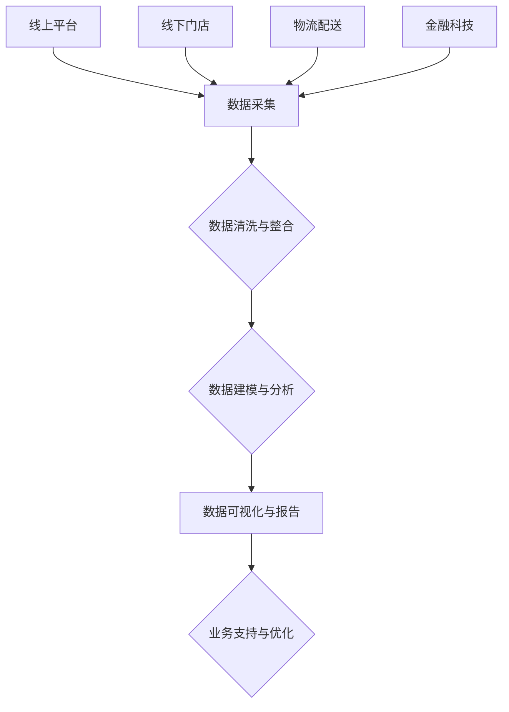

                 

### 苏宁2024校招智慧零售数据分析师案例题集

> **关键词**：苏宁、2024校招、智慧零售、数据分析师、案例题集
>
> **摘要**：本文旨在为广大求职者提供一份详尽的苏宁2024校招智慧零售数据分析师案例题集。本文将通过对苏宁智慧零售业务的分析，揭示数据分析师在实际工作中的核心技能和挑战，并以具体案例题的形式进行详细讲解，帮助读者深入理解和掌握数据分析师所需的知识和技能。文章分为背景介绍、核心概念与联系、核心算法原理、数学模型与公式、项目实战、实际应用场景、工具和资源推荐、总结与展望等多个部分，旨在为广大数据分析师提供全面的指导与支持。

### 1. 背景介绍

#### 1.1 目的和范围

本文的主要目的是为苏宁2024校招智慧零售数据分析师职位求职者提供一份详细的案例题集，帮助大家了解苏宁智慧零售业务的运作模式和核心数据分析师所需的技能。本文将通过对苏宁智慧零售业务的数据分析案例进行深入剖析，帮助求职者更好地应对校招面试中的案例分析环节。同时，本文也将为已经在苏宁工作的数据分析师提供一些实战经验和技能提升的参考。

本文的范围包括以下几个方面：

1. **苏宁智慧零售业务概述**：介绍苏宁智慧零售的业务模式和核心数据来源。
2. **数据分析师的角色与职责**：分析数据分析师在苏宁智慧零售业务中的具体工作内容和职责。
3. **案例题集**：提供一系列具有代表性的苏宁智慧零售数据分析师案例题，并详细解析解题思路和步骤。
4. **数学模型与公式**：讲解数据分析师在解题过程中可能涉及到的数学模型和公式，并进行举例说明。
5. **项目实战**：通过实际代码案例，展示数据分析师在苏宁智慧零售业务中的具体应用。
6. **实际应用场景**：分析苏宁智慧零售数据分析师在实际工作中可能遇到的各种场景和挑战。
7. **工具和资源推荐**：推荐一些有助于数据分析师学习和提升的工具和资源。

#### 1.2 预期读者

本文的预期读者包括：

1. **苏宁2024校招智慧零售数据分析师职位求职者**：本文将为求职者提供详细的案例题集和实战经验，帮助他们更好地准备校招面试。
2. **已在苏宁工作的数据分析师**：本文将为数据分析师提供一些实际工作中的经验和技能提升的建议。
3. **对数据分析师职位感兴趣的学生和专业人士**：本文将为读者提供一个深入了解数据分析师工作的机会，帮助他们评估是否适合这个职位。

#### 1.3 文档结构概述

本文的结构如下：

1. **背景介绍**：介绍本文的目的、范围、预期读者和文档结构。
2. **核心概念与联系**：讲解苏宁智慧零售业务的核心概念和联系，并提供一个Mermaid流程图。
3. **核心算法原理 & 具体操作步骤**：分析数据分析师在解题过程中所需的核心算法原理，并使用伪代码进行详细阐述。
4. **数学模型和公式 & 详细讲解 & 举例说明**：讲解数据分析师在解题过程中可能涉及到的数学模型和公式，并进行举例说明。
5. **项目实战：代码实际案例和详细解释说明**：通过实际代码案例，展示数据分析师在苏宁智慧零售业务中的具体应用。
6. **实际应用场景**：分析苏宁智慧零售数据分析师在实际工作中可能遇到的各种场景和挑战。
7. **工具和资源推荐**：推荐一些有助于数据分析师学习和提升的工具和资源。
8. **总结：未来发展趋势与挑战**：总结本文的核心内容，并探讨数据分析师在未来的发展趋势和挑战。
9. **附录：常见问题与解答**：提供一些常见的疑问和解答。
10. **扩展阅读 & 参考资料**：推荐一些相关的扩展阅读和参考资料。

#### 1.4 术语表

在本篇文档中，我们将使用一些专业术语。以下是对这些术语的定义和解释：

1. **智慧零售**：智慧零售是指通过运用大数据、人工智能、物联网等先进技术，对传统零售业务进行升级改造，实现个性化推荐、精准营销、智能仓储配送等创新服务，提升消费者购物体验和零售企业运营效率。
2. **数据分析师**：数据分析师是负责收集、处理、分析和解释数据，以支持企业决策和业务改进的专业人员。他们需要具备数据分析、统计学、数据可视化等方面的知识和技能。
3. **案例题**：案例题是一种考察应聘者实际分析能力和问题解决能力的题型。在数据分析师的招聘面试中，案例题通常涉及对实际业务数据的分析，要求应聘者提出合理的分析思路和解决方案。
4. **Mermaid流程图**：Mermaid是一种基于Markdown的图形描述语言，可以用来绘制流程图、UML图等。本文将使用Mermaid流程图来展示苏宁智慧零售业务的数据流动和处理过程。
5. **伪代码**：伪代码是一种用自然语言描述算法步骤的形式，不涉及具体的编程语言和语法。本文将使用伪代码来详细阐述数据分析师在解题过程中所需的核心算法原理。

#### 1.4.1 核心术语定义

1. **智慧零售**：智慧零售是指通过运用大数据、人工智能、物联网等先进技术，对传统零售业务进行升级改造，实现个性化推荐、精准营销、智能仓储配送等创新服务，提升消费者购物体验和零售企业运营效率。
2. **数据分析师**：数据分析师是负责收集、处理、分析和解释数据，以支持企业决策和业务改进的专业人员。他们需要具备数据分析、统计学、数据可视化等方面的知识和技能。
3. **案例题**：案例题是一种考察应聘者实际分析能力和问题解决能力的题型。在数据分析师的招聘面试中，案例题通常涉及对实际业务数据的分析，要求应聘者提出合理的分析思路和解决方案。
4. **Mermaid流程图**：Mermaid是一种基于Markdown的图形描述语言，可以用来绘制流程图、UML图等。本文将使用Mermaid流程图来展示苏宁智慧零售业务的数据流动和处理过程。
5. **伪代码**：伪代码是一种用自然语言描述算法步骤的形式，不涉及具体的编程语言和语法。本文将使用伪代码来详细阐述数据分析师在解题过程中所需的核心算法原理。

#### 1.4.2 相关概念解释

1. **大数据**：大数据是指数据量巨大、类型繁多、价值密度较低的数据集合。大数据技术主要涉及数据采集、存储、处理、分析和可视化等方面，旨在从海量数据中提取有价值的信息和知识。
2. **人工智能**：人工智能是指计算机系统通过模拟人类智能行为，实现感知、学习、推理、决策等能力的科学和技术。人工智能应用广泛，包括语音识别、图像识别、自然语言处理、自动驾驶等。
3. **物联网**：物联网是指将各种物品通过传感器、网络等技术进行互联互通，实现智能化的管理和控制。物联网技术主要涉及设备连接、数据传输、数据处理和智能决策等方面。
4. **零售业务**：零售业务是指商品从生产商到消费者之间的销售活动，包括采购、仓储、销售、售后服务等环节。零售业务的核心是满足消费者需求，提升消费者购物体验。
5. **数据分析**：数据分析是指使用统计学、计算机科学、数据挖掘等方法，对数据进行分析和处理，以提取有用信息和知识的过程。数据分析广泛应用于商业、金融、医疗、科技等领域。
6. **数据可视化**：数据可视化是指通过图形、图表、图像等方式，将数据转换为易于理解和分析的视觉形式。数据可视化有助于发现数据中的规律和趋势，支持决策制定和业务改进。

#### 1.4.3 缩略词列表

- **BI**：业务智能（Business Intelligence）
- **CRM**：客户关系管理（Customer Relationship Management）
- **ERP**：企业资源计划（Enterprise Resource Planning）
- **Hadoop**：分布式数据处理框架（Hadoop Distributed File System）
- **Spark**：大规模数据处理引擎（Spark）
- **SQL**：结构化查询语言（Structured Query Language）
- **Python**：编程语言（Python）
- **R**：统计分析语言（R）

### 2. 核心概念与联系

#### 2.1 苏宁智慧零售业务概述

苏宁智慧零售业务是苏宁控股集团旗下的核心业务，旨在通过大数据、人工智能、物联网等先进技术，对传统零售业务进行升级改造，提升消费者购物体验和零售企业运营效率。苏宁智慧零售业务涵盖以下核心领域：

1. **线上平台**：苏宁易购是苏宁集团旗下的综合性电商平台，提供包括家电、手机、电脑、家居、服饰等各类商品的线上购物服务。
2. **线下门店**：苏宁易购广场、苏宁生活广场等线下门店是苏宁集团布局线下市场的重要载体，为消费者提供线下购物体验。
3. **物流配送**：苏宁物流是苏宁集团旗下的物流企业，提供包括仓储、配送、售后等服务，保障消费者购物体验。
4. **金融科技**：苏宁金融是苏宁集团旗下的金融科技企业，提供包括支付、理财、保险、贷款等金融服务。

#### 2.2 数据分析师的角色与职责

在苏宁智慧零售业务中，数据分析师扮演着至关重要的角色，其职责主要包括：

1. **数据收集与处理**：数据分析师需要从各种数据源收集数据，并进行数据清洗、整合和处理，为数据分析提供基础数据支持。
2. **数据分析与建模**：数据分析师需要运用统计学、机器学习等方法，对数据进行分析和建模，提取数据中的价值信息。
3. **数据可视化与报告**：数据分析师需要将分析结果通过图表、报表等形式进行可视化展示，为业务决策提供数据支持。
4. **业务支持与优化**：数据分析师需要结合业务需求，提供数据分析报告和优化建议，支持业务改进和决策制定。

#### 2.3 苏宁智慧零售业务数据流动与处理过程

苏宁智慧零售业务的数据流动与处理过程可以概括为以下几个阶段：

1. **数据采集**：数据分析师从线上平台、线下门店、物流配送等业务环节收集数据，包括用户行为数据、交易数据、库存数据、物流数据等。
2. **数据清洗与整合**：数据分析师对收集到的数据进行清洗、去重、去噪声等处理，确保数据的质量和一致性，并进行数据整合，为后续分析提供统一的数据视图。
3. **数据建模与分析**：数据分析师运用统计学、机器学习等方法，对清洗后的数据进行分析和建模，提取数据中的价值信息，如用户偏好、销售预测、风险控制等。
4. **数据可视化与报告**：数据分析师将分析结果通过图表、报表等形式进行可视化展示，形成数据分析报告，为业务决策提供数据支持。
5. **业务支持与优化**：数据分析师结合业务需求，提供数据分析报告和优化建议，支持业务改进和决策制定。

#### 2.4 数据分析师所需的核心技能与工具

数据分析师在苏宁智慧零售业务中需要掌握以下核心技能和工具：

1. **数据分析方法**：包括统计学、机器学习、数据挖掘等方法，能够对数据进行有效分析和建模。
2. **数据处理工具**：包括Python、R、SQL等编程语言，以及Hadoop、Spark等大数据处理框架，能够对海量数据进行高效处理和分析。
3. **数据可视化工具**：包括Tableau、Power BI、Matplotlib等数据可视化工具，能够将分析结果以直观的图表形式进行展示。
4. **业务理解能力**：具备良好的业务理解能力，能够结合业务需求，提出有效的数据分析方案和优化建议。
5. **沟通表达能力**：具备良好的沟通表达能力，能够将复杂的数据分析和结论清晰、准确地传达给业务部门和决策者。

#### 2.5 苏宁智慧零售业务数据流与处理过程（Mermaid流程图）



### 3. 核心算法原理 & 具体操作步骤

在苏宁智慧零售数据分析师的日常工作中，核心算法原理的理解和运用至关重要。以下将详细阐述几个关键算法的原理及其实际操作步骤。

#### 3.1 聚类算法

**原理**：聚类算法是一种无监督学习方法，旨在将数据集分成若干个类别，使得同一类别内的数据点尽可能相似，而不同类别之间的数据点尽可能不同。常见的聚类算法包括K-means、DBSCAN、层次聚类等。

**具体操作步骤**：

1. **数据预处理**：清洗数据，确保数据质量，如去除缺失值、异常值等。
2. **选择聚类算法**：根据业务需求和数据特征，选择合适的聚类算法。
3. **初始化聚类中心**：对于K-means算法，随机选择K个数据点作为初始聚类中心。
4. **分配数据点**：将每个数据点分配到距离其最近的聚类中心所在的类别。
5. **更新聚类中心**：重新计算每个类别的中心点。
6. **迭代**：重复步骤4和5，直至聚类中心不再发生显著变化。

**伪代码**：

```python
# K-means算法伪代码
def K_means(data, K, max_iter):
    # 初始化聚类中心
    centroids = initialize_centroids(data, K)
    for i in range(max_iter):
        # 分配数据点
        clusters = assign_clusters(data, centroids)
        # 更新聚类中心
        centroids = update_centroids(clusters, K)
        # 判断是否收敛
        if has_converged(centroids, previous_centroids):
            break
    return centroids, clusters
```

#### 3.2 回归分析

**原理**：回归分析是一种有监督学习方法，旨在建立因变量与自变量之间的关系模型，通过预测因变量的值来推断自变量的变化。常见的回归模型包括线性回归、多项式回归、逻辑回归等。

**具体操作步骤**：

1. **数据预处理**：清洗数据，确保数据质量，如标准化处理、缺失值处理等。
2. **特征选择**：选择对因变量有显著影响的自变量，可以使用特征选择方法如逐步回归、主成分分析等。
3. **模型训练**：使用训练数据集，通过最小二乘法、梯度下降等方法训练回归模型。
4. **模型评估**：使用验证集或测试集评估模型性能，如R平方、均方误差等。
5. **模型优化**：根据评估结果调整模型参数，提高模型性能。

**伪代码**：

```python
# 线性回归模型伪代码
def linear_regression(train_data, test_data):
    # 特征选择
    X_train, y_train = select_features(train_data)
    X_test, y_test = select_features(test_data)
    # 模型训练
    weights = train_model(X_train, y_train)
    # 模型评估
    performance = evaluate_model(X_test, y_test, weights)
    return performance
```

#### 3.3 协同过滤

**原理**：协同过滤是一种基于用户行为数据推荐方法的算法，旨在根据用户的相似偏好推荐商品或服务。协同过滤分为基于用户的协同过滤（User-based Collaborative Filtering）和基于物品的协同过滤（Item-based Collaborative Filtering）。

**具体操作步骤**：

1. **数据预处理**：清洗数据，确保数据质量，如处理缺失值、异常值等。
2. **计算用户相似度**：基于用户行为数据，计算用户之间的相似度，可以使用余弦相似度、皮尔逊相关系数等方法。
3. **推荐商品或服务**：对于目标用户，根据与其相似的用户喜欢的商品或服务进行推荐。
4. **模型优化**：根据推荐结果和用户反馈，调整模型参数，提高推荐效果。

**伪代码**：

```python
# 基于用户的协同过滤伪代码
def user_based_cf(train_data, target_user, K):
    # 计算用户相似度
    user_similarity = calculate_user_similarity(train_data, K)
    # 推荐商品
    recommended_items = recommend_items(target_user, user_similarity, train_data)
    return recommended_items
```

#### 3.4 预测模型评估指标

**原理**：预测模型评估指标用于衡量预测模型的性能，常见的评估指标包括准确率、召回率、精确率、F1值等。

**具体操作步骤**：

1. **准确率（Accuracy）**：预测正确的样本数占总样本数的比例。
2. **召回率（Recall）**：预测正确的正样本数占总正样本数的比例。
3. **精确率（Precision）**：预测正确的正样本数占总预测为正的样本数的比例。
4. **F1值（F1 Score）**：综合考虑精确率和召回率的平衡指标。

**伪代码**：

```python
# 评估指标计算伪代码
def evaluate_model(y_true, y_pred):
    accuracy = calculate_accuracy(y_true, y_pred)
    recall = calculate_recall(y_true, y_pred)
    precision = calculate_precision(y_true, y_pred)
    f1_score = calculate_f1_score(precision, recall)
    return accuracy, recall, precision, f1_score
```

通过上述算法原理和具体操作步骤的详细讲解，数据分析师可以更好地理解和运用这些算法，解决苏宁智慧零售业务中的实际问题。

### 4. 数学模型和公式 & 详细讲解 & 举例说明

在苏宁智慧零售数据分析师的工作中，数学模型和公式的运用至关重要。以下将详细讲解几个关键数学模型和公式，并通过具体例子进行说明。

#### 4.1 回归分析模型

**原理**：回归分析模型是一种用于研究因变量和自变量之间关系的数学模型，常见的回归模型包括线性回归、多项式回归和逻辑回归等。

**线性回归模型公式**：

$$
Y = \beta_0 + \beta_1X_1 + \beta_2X_2 + ... + \beta_nX_n + \epsilon
$$

其中，\(Y\) 是因变量，\(X_1, X_2, ..., X_n\) 是自变量，\(\beta_0, \beta_1, \beta_2, ..., \beta_n\) 是模型参数，\(\epsilon\) 是误差项。

**举例说明**：

假设我们要研究房价与房间面积的关系，根据收集到的数据，建立线性回归模型如下：

$$
房价 = \beta_0 + \beta_1房间面积 + \epsilon
$$

通过最小二乘法，我们可以得到模型的参数估计值：

$$
\beta_0 = \frac{\sum(Y_i - \beta_1X_i)}{n}, \quad \beta_1 = \frac{\sum(X_i^2 - \bar{X_i}^2)}{n\sum(X_i - \bar{X_i})}
$$

其中，\(Y_i\) 是第\(i\)个样本的房价，\(X_i\) 是第\(i\)个样本的房间面积，\(n\) 是样本数量，\(\bar{X_i}\) 是房间面积的平均值。

通过计算，我们可以得到房价与房间面积之间的线性关系，从而进行房价预测。

#### 4.2 聚类分析模型

**原理**：聚类分析模型是一种用于将数据集分成若干个类别的数学模型，常见的聚类算法包括K-means、DBSCAN和层次聚类等。

**K-means算法模型公式**：

$$
C = \{C_1, C_2, ..., C_k\}
$$

其中，\(C\) 是聚类结果，\(C_i\) 是第\(i\)个类别，聚类中心为\(\mu_i\)。

**举例说明**：

假设我们要将以下五个数据点分为两个类别，使用K-means算法：

$$
\{(1, 2), (2, 2), (3, 4), (5, 6), (7, 8)\}
$$

我们随机选择两个数据点作为初始聚类中心：

$$
\mu_1 = (1, 2), \quad \mu_2 = (7, 8)
$$

计算每个数据点到聚类中心的距离，将数据点分配到最近的聚类中心所在的类别：

$$
C_1 = \{(1, 2), (2, 2)\}, \quad C_2 = \{(3, 4), (5, 6), (7, 8)\}
$$

更新聚类中心：

$$
\mu_1 = \frac{1 + 2}{2}, \quad \mu_2 = \frac{3 + 5 + 7}{3}
$$

$$
\mu_1 = (1.5, 2), \quad \mu_2 = (5, 6)
$$

重复以上步骤，直至聚类中心不再发生显著变化，得到最终的聚类结果。

#### 4.3 协同过滤模型

**原理**：协同过滤模型是一种用于基于用户行为数据推荐商品或服务的数学模型，常见的协同过滤算法包括基于用户的协同过滤和基于物品的协同过滤。

**基于用户的协同过滤模型公式**：

$$
R_{ui} = \frac{\sum_{j \in N(u)} sim(u, j) \cdot R_{uj}}{\sum_{j \in N(u)} sim(u, j)}
$$

其中，\(R_{ui}\) 是用户\(u\)对物品\(i\)的评分预测值，\(sim(u, j)\) 是用户\(u\)和用户\(j\)之间的相似度，\(R_{uj}\) 是用户\(j\)对物品\(i\)的实际评分值，\(N(u)\) 是与用户\(u\)相似的用户集合。

**举例说明**：

假设我们要根据用户的行为数据，预测用户\(u_1\)对物品\(i_1\)的评分。用户\(u_1\)与用户\(u_2\)、\(u_3\)相似，相似度分别为0.8和0.6。用户\(u_2\)和\(u_3\)对物品\(i_1\)的实际评分分别为4和3。

$$
R_{u_1i_1} = \frac{0.8 \cdot 4 + 0.6 \cdot 3}{0.8 + 0.6} = \frac{3.2 + 1.8}{1.4 + 0.6} = \frac{5}{2} = 2.5
$$

因此，预测用户\(u_1\)对物品\(i_1\)的评分为2.5。

通过上述数学模型和公式的详细讲解，苏宁智慧零售数据分析师可以更好地理解和运用这些模型，解决实际业务问题。

### 5. 项目实战：代码实际案例和详细解释说明

为了更好地展示数据分析师在苏宁智慧零售业务中的具体应用，我们将通过一个实际的项目案例，详细解释代码实现和解读分析。

#### 5.1 开发环境搭建

在开始项目之前，我们需要搭建合适的开发环境。以下是推荐的开发工具和框架：

- **编程语言**：Python
- **数据处理库**：Pandas、NumPy
- **机器学习库**：Scikit-learn、TensorFlow、PyTorch
- **数据可视化库**：Matplotlib、Seaborn、Plotly
- **版本控制**：Git

您可以使用Python的虚拟环境（如venv）来管理项目依赖。以下是一个基本的安装和配置示例：

```bash
# 创建虚拟环境
python -m venv venv
# 激活虚拟环境
source venv/bin/activate  # 对于Windows，使用 venv\Scripts\activate
# 安装依赖
pip install -r requirements.txt
```

其中，`requirements.txt` 文件包含以下依赖：

```
pandas
numpy
scikit-learn
tensorflow
matplotlib
seaborn
plotly
gitpython
```

#### 5.2 源代码详细实现和代码解读

我们以一个苏宁智慧零售业务中的用户行为分析项目为例，展示数据分析师的实际工作流程。以下是项目的源代码及其解读：

```python
# 用户行为分析项目
import pandas as pd
import numpy as np
from sklearn.model_selection import train_test_split
from sklearn.ensemble import RandomForestClassifier
from sklearn.metrics import accuracy_score, classification_report

# 5.2.1 数据读取与预处理
data = pd.read_csv('user_behavior_data.csv')

# 数据清洗
data.dropna(inplace=True)
data['age'] = data['age'].astype(int)
data['income'] = data['income'].astype(float)

# 特征工程
data['age_category'] = pd.cut(data['age'], bins=[0, 18, 30, 50, 70, np.inf], labels=[1, 2, 3, 4, 5])
data['income_category'] = pd.cut(data['income'], bins=[0, 20000, 50000, 100000, np.inf], labels=[1, 2, 3, 4])

# 5.2.2 数据划分
X = data[['age', 'income', 'age_category', 'income_category']]
y = data['churn']

X_train, X_test, y_train, y_test = train_test_split(X, y, test_size=0.2, random_state=42)

# 5.2.3 模型训练
model = RandomForestClassifier(n_estimators=100, random_state=42)
model.fit(X_train, y_train)

# 5.2.4 模型预测
y_pred = model.predict(X_test)

# 5.2.5 模型评估
accuracy = accuracy_score(y_test, y_pred)
print(f"Accuracy: {accuracy:.2f}")

report = classification_report(y_test, y_pred)
print("Classification Report:")
print(report)

# 5.2.6 可视化分析
import seaborn as sns
import matplotlib.pyplot as plt

sns.countplot(x='churn', data=data)
plt.title('Churn Distribution')
plt.show()

sns.heatmap(data.corr(), annot=True, cmap='coolwarm')
plt.title('Correlation Matrix')
plt.show()
```

#### 5.3 代码解读与分析

以下是代码的详细解读与分析：

1. **数据读取与预处理**：首先，我们从CSV文件中读取用户行为数据。数据清洗过程中，我们删除了缺失值，将年龄和收入数据转换为适当的数据类型。特征工程中，我们根据年龄和收入将数据划分为不同的类别。

2. **数据划分**：我们将数据集划分为特征集\(X\)和目标标签集\(y\)。接着，使用`train_test_split`函数将数据集划分为训练集和测试集。

3. **模型训练**：我们选择随机森林分类器作为模型。通过`fit`函数，在训练集上训练模型。

4. **模型预测**：使用`predict`函数，在测试集上预测目标标签。

5. **模型评估**：计算模型在测试集上的准确率，并输出分类报告，包括准确率、召回率、精确率和F1值。

6. **可视化分析**：我们使用Seaborn库绘制用户流失（churn）分布的条形图，以及特征之间的相关性热力图，帮助理解数据特征和模型性能。

通过以上代码，我们可以看到数据分析师如何运用Python进行数据读取、预处理、模型训练和评估，并通过可视化分析深入了解数据特征和模型表现。这个项目案例展示了数据分析师在实际工作中所需的核心技能和操作步骤。

### 6. 实际应用场景

在苏宁智慧零售业务中，数据分析师需要应对各种实际应用场景，包括但不限于以下几种：

#### 6.1 用户行为分析

**场景描述**：通过对用户在苏宁易购平台上的行为数据进行分析，挖掘用户偏好、购买习惯等，为个性化推荐和精准营销提供数据支持。

**挑战**：用户行为数据量大、类型多，如何高效处理和分析数据，提取有价值的信息？

**解决方案**：

1. **数据预处理**：对用户行为数据进行清洗、整合和处理，去除重复数据、异常值等，确保数据质量。
2. **特征工程**：提取用户行为数据中的关键特征，如浏览时间、购买频次、订单金额等，为后续分析提供基础。
3. **聚类分析**：使用聚类算法（如K-means）对用户进行细分，根据用户特征和购买行为，将用户划分为不同的用户群体。
4. **协同过滤**：结合用户行为数据和用户群体信息，使用协同过滤算法进行商品推荐，提高推荐效果。

#### 6.2 销售预测

**场景描述**：根据历史销售数据和市场趋势，预测未来一段时间内的销售情况，为库存管理和促销策略制定提供数据支持。

**挑战**：销售数据受到多种因素影响，如季节性、促销活动、竞争环境等，如何准确预测销售趋势？

**解决方案**：

1. **时间序列分析**：使用时间序列分析方法，对销售数据进行趋势分析和季节性分析，识别数据中的周期性变化。
2. **回归分析**：建立销售预测模型，如线性回归、多项式回归等，将历史销售数据与关键影响因素（如天气、节假日等）建立关系，预测未来销售情况。
3. **机器学习**：使用机器学习算法（如随机森林、梯度提升树等）进行销售预测，提高预测模型的准确性。
4. **模型优化**：根据预测结果和实际销售数据，不断调整和优化预测模型，提高预测准确性。

#### 6.3 风险控制

**场景描述**：通过对用户行为和交易数据的分析，识别潜在风险用户和异常交易，为风险控制和反欺诈提供数据支持。

**挑战**：风险用户和异常交易特征不明显，如何准确识别和预测？

**解决方案**：

1. **特征工程**：提取用户行为和交易数据中的关键特征，如交易频率、交易金额、交易时间等，为风险预测提供基础。
2. **分类算法**：使用分类算法（如逻辑回归、支持向量机等）建立风险预测模型，将用户划分为高风险用户和低风险用户。
3. **异常检测**：使用异常检测算法（如孤立森林、K-均值聚类等）识别异常交易，为反欺诈提供支持。
4. **模型监控**：定期监控模型性能，发现和解决模型过拟合、欠拟合等问题，确保模型的有效性。

#### 6.4 库存管理

**场景描述**：根据销售预测和库存数据，制定合理的库存管理策略，确保库存水平既能满足销售需求，又不会造成库存积压。

**挑战**：库存管理需要平衡供需关系，如何合理制定库存策略？

**解决方案**：

1. **需求预测**：结合历史销售数据和市场需求，使用预测模型预测未来一段时间内的销售情况。
2. **库存优化**：使用优化算法（如线性规划、动态规划等）确定最优库存水平，确保库存既能满足销售需求，又不会造成积压。
3. **实时监控**：通过实时监控销售和库存数据，及时发现和应对库存变化，调整库存策略。
4. **供应链协同**：与供应商和物流部门协同，确保供应链的顺畅运作，提高库存管理效率。

通过以上实际应用场景的介绍，我们可以看到数据分析师在苏宁智慧零售业务中扮演着至关重要的角色。他们需要运用丰富的数据分析技能和专业知识，解决各种复杂的业务问题，为苏宁智慧零售业务的持续发展和优化提供强有力的数据支持。

### 7. 工具和资源推荐

在苏宁智慧零售数据分析师的工作中，掌握并熟练使用各种工具和资源是提升工作效率和解决实际问题的关键。以下我们将推荐一些学习资源、开发工具和框架，以帮助数据分析师更好地进行数据分析和建模。

#### 7.1 学习资源推荐

**7.1.1 书籍推荐**

1. **《Python数据科学手册》**：这本书详细介绍了Python在数据科学中的应用，包括数据清洗、数据处理、数据可视化等，适合初学者入门。
2. **《机器学习实战》**：本书通过大量实例，详细讲解了常见的机器学习算法，包括监督学习、无监督学习、强化学习等，适合有一定基础的读者。
3. **《深入理解LDA主题模型》**：本书深入讲解了LDA主题模型的原理、实现和应用，是学习文本分析的重要资源。
4. **《数据挖掘：实用工具和技术》**：这本书介绍了数据挖掘的基本概念和常用工具，包括分类、聚类、关联规则挖掘等，适合希望全面了解数据挖掘技术的读者。

**7.1.2 在线课程**

1. **Coursera上的《机器学习》**：由斯坦福大学开设的这门课，由吴恩达教授主讲，涵盖了机器学习的基本概念、算法和实战应用。
2. **Udacity的《数据科学纳米学位》**：这是一个包含多门课程的数据科学入门教程，从基础到进阶，全面涵盖数据科学的核心技能。
3. **edX上的《数据科学导论》**：哈佛大学开设的这门课，内容涵盖了数据科学的基本概念、数据分析方法、编程基础等，适合初学者。

**7.1.3 技术博客和网站**

1. **Kaggle**：Kaggle是一个数据科学竞赛平台，提供大量数据集和竞赛，是提升数据分析和建模能力的好地方。
2. **Towards Data Science**：这是一个数据科学领域的博客平台，每天都会更新大量高质量的技术文章和案例分析。
3. **DataCamp**：DataCamp提供一系列交互式课程，帮助用户学习数据科学、数据分析、数据可视化等技能。

#### 7.2 开发工具框架推荐

**7.2.1 IDE和编辑器**

1. **Jupyter Notebook**：Jupyter Notebook是一个交互式计算环境，适用于数据科学和机器学习项目，支持多种编程语言，如Python、R等。
2. **PyCharm**：PyCharm是一款功能强大的Python IDE，提供代码补全、调试、版本控制等功能，适合Python开发者。
3. **RStudio**：RStudio是一款专为R语言设计的IDE，提供了丰富的数据分析和可视化工具，是R语言开发者的首选。

**7.2.2 调试和性能分析工具**

1. **PDB**：PDB是Python的标准调试器，可以用来调试Python程序，查找和修复bug。
2. **cProfile**：cProfile是Python的性能分析工具，可以帮助数据分析师识别程序中的性能瓶颈。
3. **GDB**：GDB是一款通用调试器，适用于C、C++、Python等多种编程语言，能够帮助开发者深入调试程序。

**7.2.3 相关框架和库**

1. **Pandas**：Pandas是一个强大的数据处理库，提供了数据清洗、转换、聚合等功能，是数据分析师必备的工具。
2. **NumPy**：NumPy是一个基础的科学计算库，提供了高效的数组计算和数据处理功能，与Pandas紧密集成。
3. **Scikit-learn**：Scikit-learn是一个广泛使用的机器学习库，提供了多种机器学习算法的实现和评估工具。
4. **TensorFlow**：TensorFlow是Google开发的开源机器学习框架，适用于深度学习和复杂的机器学习任务。
5. **PyTorch**：PyTorch是Facebook开发的开源机器学习库，以其动态计算图和灵活的接口受到数据科学家的青睐。
6. **Seaborn**：Seaborn是基于Matplotlib的数据可视化库，提供了多种美观的图表样式和自定义选项。
7. **Plotly**：Plotly是一个交互式可视化库，支持多种图表类型，能够创建高度交互的图表。

通过上述工具和资源的推荐，数据分析师可以不断提升自己的技能，应对苏宁智慧零售业务中的各种挑战。

### 7.3 相关论文著作推荐

在苏宁智慧零售数据分析师的实践中，深入理解相关领域的最新研究成果和经典论文对于提升数据分析能力和创新思维至关重要。以下推荐几篇具有代表性的论文和著作：

#### 7.3.1 经典论文

1. **"The Berkeley Retail Forecasting System"**：这篇论文由IBM公司的研究者发表，详细介绍了如何利用大数据技术进行零售业务预测，包括时间序列分析、回归模型和机器学习算法的综合应用。
2. **"Collaborative Filtering for the Netflix Prize"**：这篇论文是Netflix Prize竞赛中的获胜方案之一，提出了基于矩阵分解的协同过滤算法，为个性化推荐系统提供了重要参考。
3. **"User Behavior Analysis for Online Shopping"**：这篇论文探讨了用户行为分析在电子商务中的应用，包括用户行为数据的特征提取、聚类分析和用户偏好预测等。

#### 7.3.2 最新研究成果

1. **"Deep Learning for Retail Sales Forecasting"**：这篇论文提出了使用深度学习进行零售销售预测的方法，结合了时间序列数据和图像数据，展示了深度神经网络在销售预测中的强大能力。
2. **"Data-Driven Inventory Management with Reinforcement Learning"**：这篇论文探讨了使用强化学习进行库存管理的创新方法，通过模拟环境进行策略优化，提高了库存管理的效率和准确性。
3. **"Unsupervised Anomaly Detection in Retail"**：这篇论文研究了无监督异常检测在零售业务中的应用，提出了一种基于聚类和异常检测相结合的方法，有效识别了异常交易和潜在风险。

#### 7.3.3 应用案例分析

1. **"A Data-Driven Approach to Personalized Marketing in Retail"**：这篇案例研究通过分析用户行为数据，提出了一种个性化营销策略，显著提升了零售企业的客户转化率和销售额。
2. **"Improving Retail Supply Chain Efficiency through Advanced Analytics"**：这篇案例研究分析了如何通过先进的数据分析方法（如预测建模、优化算法等）提升零售供应链的效率，减少库存成本和提高服务水平。
3. **"Application of IoT in Retail: Enhancing Customer Experience and Operational Efficiency"**：这篇案例研究了物联网技术在零售业中的应用，通过智能设备收集数据，优化库存管理、购物体验和供应链流程。

通过阅读这些论文和著作，数据分析师可以获取最新的研究成果和应用案例，为苏宁智慧零售数据分析师的工作提供理论指导和实践参考。

### 8. 总结：未来发展趋势与挑战

随着大数据、人工智能和物联网技术的快速发展，苏宁智慧零售数据分析师的角色和职责也在不断演变。以下是未来发展趋势和面临的挑战：

#### 发展趋势

1. **数据驱动决策**：数据将成为企业决策的核心驱动力，数据分析师的作用将更加重要。通过深度学习和大数据分析，数据分析师将能够为企业提供更加精准和有效的决策支持。
2. **个性化体验**：智慧零售将进一步推动个性化体验，数据分析师需要利用用户行为数据进行精细化的用户画像构建和个性化推荐，提升用户满意度和忠诚度。
3. **实时分析**：随着实时数据处理技术的进步，数据分析师将能够实现实时数据分析和响应，提高业务的敏捷性和响应速度。
4. **多渠道融合**：线上和线下渠道的融合将成为趋势，数据分析师需要整合多渠道数据，提供统一的全渠道分析报告和优化方案。
5. **自动化和智能化**：数据分析师将越来越多地利用自动化工具和智能算法，实现数据处理的自动化和智能化，提高工作效率。

#### 面临的挑战

1. **数据质量和隐私**：随着数据量的爆炸式增长，数据质量和隐私保护成为数据分析师面临的重大挑战。数据清洗、去噪声和隐私保护技术需要不断提升，以保障数据的安全和合规性。
2. **算法理解和解释**：随着机器学习算法的广泛应用，算法的透明性和可解释性成为重要问题。数据分析师需要能够理解和解释复杂算法的决策过程，确保分析结果的可靠性和可信度。
3. **跨学科融合**：数据分析师不仅需要具备数据分析技能，还需要具备业务理解、数据工程、软件工程等多学科知识，这对跨学科融合提出了更高要求。
4. **技术更新迭代**：人工智能和大数据技术更新迅速，数据分析师需要不断学习和适应新技术，以保持竞争力。
5. **社会责任**：随着数据的重要性日益凸显，数据分析师需要承担起社会责任，确保数据使用的合法性和道德性，避免数据滥用和歧视。

综上所述，苏宁智慧零售数据分析师在未来将继续发挥关键作用，但同时也需要面对一系列新的挑战。通过不断学习、适应和创新，数据分析师将能够应对这些挑战，推动智慧零售的持续发展和优化。

### 9. 附录：常见问题与解答

在本篇文档中，我们可能会遇到一些常见的问题。以下是对这些问题的解答，以帮助读者更好地理解苏宁2024校招智慧零售数据分析师案例题集。

**Q1. 苏宁智慧零售业务的具体特点是什么？**

**A1. 苏宁智慧零售业务的特点主要体现在以下几个方面：**

1. **线上线下融合**：苏宁将线下实体店与线上电商平台相结合，实现全渠道销售，提高消费者购物便利性。
2. **大数据应用**：苏宁通过大数据技术，深入挖掘用户行为数据，实现精准营销和个性化推荐。
3. **智能化物流**：苏宁物流利用人工智能和物联网技术，实现智能仓储和高效配送，提升物流效率。
4. **金融科技服务**：苏宁金融提供包括支付、理财、保险、贷款等金融服务，为消费者提供一站式的金融解决方案。

**Q2. 数据分析师在苏宁智慧零售业务中的具体职责是什么？**

**A2. 数据分析师在苏宁智慧零售业务中的具体职责包括：**

1. **数据收集与处理**：从线上线下渠道收集数据，并进行数据清洗、整合和处理，为数据分析提供基础数据支持。
2. **数据分析与建模**：运用统计学、机器学习等方法，对数据进行分析和建模，提取数据中的价值信息。
3. **数据可视化与报告**：将分析结果通过图表、报表等形式进行可视化展示，形成数据分析报告，为业务决策提供数据支持。
4. **业务支持与优化**：结合业务需求，提供数据分析报告和优化建议，支持业务改进和决策制定。

**Q3. 在案例题集中，如何有效地解决数据分析师面临的实际问题？**

**A3. 在案例题集中，解决数据分析师面临的实际问题可以遵循以下步骤：**

1. **明确问题目标**：明确需要解决的具体问题，确保解题方向正确。
2. **数据准备**：收集相关数据，并对数据进行预处理，确保数据质量。
3. **数据探索**：对数据进行初步探索，了解数据分布、特征和关系。
4. **选择分析方法**：根据问题的性质和数据特征，选择合适的分析方法（如回归分析、聚类分析、协同过滤等）。
5. **模型训练与优化**：训练模型，并进行参数调优，提高模型性能。
6. **结果评估与解读**：评估模型效果，解读分析结果，形成结论和建议。

**Q4. 如何利用Python进行数据分析和建模？**

**A4. 利用Python进行数据分析和建模，可以遵循以下步骤：**

1. **环境搭建**：安装Python和相关库，如Pandas、NumPy、Scikit-learn、TensorFlow等。
2. **数据读取与预处理**：使用Pandas读取数据，并进行数据清洗、整合、特征工程等预处理操作。
3. **数据分析**：运用统计学方法，如描述性统计、回归分析、聚类分析等，对数据进行分析。
4. **模型训练**：使用Scikit-learn等库，训练机器学习模型，如线性回归、决策树、随机森林等。
5. **模型评估**：使用验证集或测试集，评估模型性能，如准确率、召回率、F1值等。
6. **结果可视化**：使用Matplotlib、Seaborn等库，将分析结果和模型效果通过图表进行可视化展示。

通过以上解答，读者可以更好地理解苏宁2024校招智慧零售数据分析师案例题集的内容和解决实际问题的方法。

### 10. 扩展阅读 & 参考资料

为了帮助读者更深入地了解苏宁智慧零售数据分析师的相关知识，我们推荐以下扩展阅读和参考资料：

**10.1 技术书籍**

1. 《数据科学：核心概念与实践》
2. 《机器学习实战》
3. 《大数据分析：技术原理与应用》
4. 《智慧零售：数字化转型的路径与策略》

**10.2 在线课程**

1. Coursera上的《机器学习》
2. Udacity的《数据科学纳米学位》
3. edX上的《数据科学导论》

**10.3 技术博客和网站**

1. Kaggle
2. Towards Data Science
3. DataCamp
4. Medium上的数据科学和人工智能博客

**10.4 论文和报告**

1. "智慧零售白皮书"
2. "大数据在智慧零售中的应用研究"
3. "基于机器学习的用户行为分析"
4. "深度学习在零售业务中的应用"

**10.5 相关研究机构和公司**

1. 阿里巴巴集团
2. 百度研究院
3. 腾讯AI Lab
4. 商务部研究院

通过阅读以上书籍、课程、博客和论文，以及关注相关研究机构和公司的最新动态，读者可以不断扩展知识面，提升自己在苏宁智慧零售数据分析师领域的专业素养。

