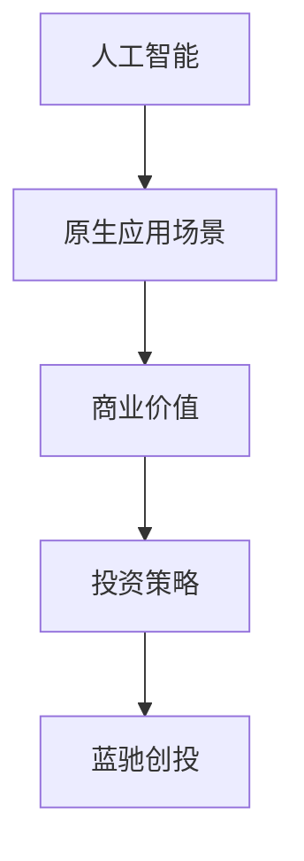

                 

# 蓝驰创投的AI投资观点：关注原生应用场景

> **关键词：** 蓝驰创投、AI投资、原生应用场景、人工智能、投资策略
> 
> **摘要：** 本文将深入探讨蓝驰创投在人工智能领域投资策略的核心理念，重点关注其如何识别和投资于那些能够在原生应用场景中快速实现商业价值的AI项目。

## 1. 背景介绍

### 1.1 目的和范围

本文旨在分析蓝驰创投在人工智能（AI）领域的投资策略，尤其是他们如何识别和投资于能够充分利用原生应用场景优势的AI项目。通过这篇分析，我们将提供对AI投资领域的深入见解，并帮助投资者理解蓝驰创投的独特视角和决策逻辑。

### 1.2 预期读者

本文面向希望了解蓝驰创投投资策略的AI领域专业人士、投资者、研究人员以及对人工智能商业应用感兴趣的一般读者。

### 1.3 文档结构概述

本文结构如下：

1. 背景介绍
2. 核心概念与联系
3. 核心算法原理 & 具体操作步骤
4. 数学模型和公式 & 详细讲解 & 举例说明
5. 项目实战：代码实际案例和详细解释说明
6. 实际应用场景
7. 工具和资源推荐
8. 总结：未来发展趋势与挑战
9. 附录：常见问题与解答
10. 扩展阅读 & 参考资料

### 1.4 术语表

#### 1.4.1 核心术语定义

- **人工智能（AI）：** 指通过模拟人类智能行为，实现机器在特定领域内表现出类似或超越人类能力的科学和技术。
- **原生应用场景：** 指在特定行业或领域中，人工智能技术能够直接解决实际问题，实现商业价值的场景。
- **蓝驰创投：** 一家专注于科技创新领域的风险投资公司，重点关注人工智能、物联网、大数据等前沿技术。

#### 1.4.2 相关概念解释

- **投资策略：** 指投资者在资产配置、风险管理和资产选择等方面所采取的具体方法和措施。
- **商业化：** 指将技术或产品推向市场，实现商业价值的过程。

#### 1.4.3 缩略词列表

- **AI：** 人工智能
- **VC：** 风险投资

## 2. 核心概念与联系

为了更好地理解蓝驰创投的AI投资策略，我们需要先了解一些核心概念和它们之间的联系。以下是使用Mermaid绘制的流程图，展示了这些概念之间的关系。



### 2.1 核心概念介绍

#### 2.1.1 人工智能

人工智能（AI）是模拟和扩展人类智能的理论、方法和技术。其核心目标是通过算法和计算模型，使机器能够在特定任务上表现出人类智能水平，甚至超越人类。AI可以分为多种类型，如机器学习、深度学习、自然语言处理等。

#### 2.1.2 原生应用场景

原生应用场景是指AI技术能够在其中直接发挥作用，解决具体问题的行业或领域。这些场景通常具有以下特点：

- **行业需求明确：** 有明确的市场需求，AI技术能够直接满足。
- **数据丰富：** 拥有大量可用于训练和验证AI模型的优质数据。
- **高价值：** 通过AI技术的应用，能够实现显著的商业价值。

#### 2.1.3 商业价值

商业价值是指AI技术或产品在市场上能够获得的收益和利润。一个具有商业价值的AI项目通常具备以下特征：

- **市场需求强烈：** 市场上有明确的客户需求，AI技术能够满足。
- **竞争优势：** 通过AI技术的应用，能够在竞争中脱颖而出。
- **盈利模式清晰：** 有明确的盈利模式，能够持续创造价值。

#### 2.1.4 投资策略

投资策略是指投资者在资产配置、风险管理和资产选择等方面所采取的具体方法和措施。在AI领域，蓝驰创投的投资策略主要集中在以下几个方面：

- **聚焦前沿技术：** 投资于具有颠覆性和前沿性的AI技术。
- **关注商业化：** 投资于能够快速实现商业化的AI项目。
- **多元化布局：** 在多个AI子领域进行投资，降低风险。

#### 2.1.5 蓝驰创投

蓝驰创投是一家专注于科技创新领域的风险投资公司。他们在人工智能、物联网、大数据等前沿技术领域有着丰富的投资经验和深厚的行业资源。蓝驰创投的投资策略以聚焦前沿技术和商业化为核心，致力于发现和投资那些具有巨大潜力的AI项目。

## 3. 核心算法原理 & 具体操作步骤

在深入了解蓝驰创投的AI投资策略之前，我们需要先了解一些核心算法原理和具体操作步骤。以下是使用伪代码详细阐述这些算法原理。

### 3.1 机器学习算法原理

```python
# 输入：训练数据集、特征、标签
# 输出：训练好的模型

def machine_learning(training_data, features, labels):
    # 数据预处理
    preprocessed_data = preprocess_data(training_data)
    
    # 模型初始化
    model = initialize_model()
    
    # 模型训练
    for epoch in range(num_epochs):
        for data in preprocessed_data:
            model.train(data[features], data[labels])
        
        # 模型评估
        accuracy = model.evaluate(test_data[features], test_data[labels])
        if accuracy >= threshold:
            break
    
    return model
```

### 3.2 深度学习算法原理

```python
# 输入：神经网络结构、训练数据集
# 输出：训练好的深度学习模型

def deep_learning(network_structure, training_data):
    # 数据预处理
    preprocessed_data = preprocess_data(training_data)
    
    # 初始化神经网络
    neural_network = initialize_neural_network(network_structure)
    
    # 模型训练
    for epoch in range(num_epochs):
        for data in preprocessed_data:
            neural_network.train(data[features], data[labels])
        
        # 模型评估
        accuracy = neural_network.evaluate(test_data[features], test_data[labels])
        if accuracy >= threshold:
            break
    
    return neural_network
```

### 3.3 自然语言处理算法原理

```python
# 输入：文本数据、词向量模型
# 输出：处理后的文本数据

def natural_language_processing(text_data, word_vector_model):
    # 文本预处理
    preprocessed_text = preprocess_text(text_data)
    
    # 将文本转换为词向量
    word_vectors = word_vector_model.convert_to_word_vectors(preprocessed_text)
    
    # 文本分类或语义分析
    result = analyze_text(word_vectors)
    
    return result
```

## 4. 数学模型和公式 & 详细讲解 & 举例说明

在人工智能领域，数学模型和公式是核心组成部分。以下是几个常用的数学模型和公式，以及它们的详细讲解和举例说明。

### 4.1 捷度（Gradient）计算

```latex
\text{梯度（Gradient）计算公式：} \\
\nabla_{\theta} J(\theta) = \frac{\partial J(\theta)}{\partial \theta}
```

#### 4.1.1 详细讲解

梯度是指函数在某一点处的变化率，可以用来优化模型参数。在机器学习中，梯度计算是模型训练的关键步骤。

#### 4.1.2 举例说明

假设我们有一个函数 $f(x) = x^2$，现在要计算它在 $x=2$ 处的梯度。

$$
\nabla_{x} f(x) = \frac{\partial f(x)}{\partial x} = 2x \\
\nabla_{x} f(2) = 2 \times 2 = 4
$$

### 4.2 捷度下降（Gradient Descent）算法

```latex
\text{梯度下降（Gradient Descent）算法公式：} \\
\theta_{t+1} = \theta_t - \alpha \nabla_{\theta} J(\theta_t)
```

#### 4.2.1 详细讲解

梯度下降是一种优化算法，用于最小化损失函数。通过不断更新模型参数，使其逐渐逼近最优解。

#### 4.2.2 举例说明

假设我们有一个线性模型 $y = wx + b$，损失函数为 $J(w, b) = (y - wx - b)^2$。现在要使用梯度下降算法进行模型训练。

- 初始参数：$w_0 = 1, b_0 = 1$
- 学习率：$\alpha = 0.1$

第1次迭代：

$$
w_1 = w_0 - \alpha \nabla_{w} J(w_0, b_0) = 1 - 0.1 \times 2 = -0.1 \\
b_1 = b_0 - \alpha \nabla_{b} J(w_0, b_0) = 1 - 0.1 \times 2 = -0.1
$$

第2次迭代：

$$
w_2 = w_1 - \alpha \nabla_{w} J(w_1, b_1) = -0.1 - 0.1 \times 2 = -0.3 \\
b_2 = b_1 - \alpha \nabla_{b} J(w_1, b_1) = -0.1 - 0.1 \times 2 = -0.3
$$

以此类推，直到收敛。

### 4.3 神经网络激活函数

```latex
\text{神经网络激活函数公式：} \\
f(x) = \frac{1}{1 + e^{-x}}
```

#### 4.3.1 详细讲解

激活函数是神经网络中的一个关键组成部分，用于将线性组合转化为非线性输出。

#### 4.3.2 举例说明

假设我们有一个简单的神经网络，输入 $x=2$，要计算其输出：

$$
f(x) = \frac{1}{1 + e^{-2}} \approx 0.869
$$

## 5. 项目实战：代码实际案例和详细解释说明

为了更好地理解蓝驰创投的AI投资策略，我们将通过一个实际项目案例来展示如何在原生应用场景中实现AI技术，并详细解释代码实现过程。

### 5.1 开发环境搭建

在开始项目之前，我们需要搭建一个合适的开发环境。以下是所需工具和软件：

- 操作系统：Linux或MacOS
- 编程语言：Python
- 深度学习框架：TensorFlow或PyTorch
- 数据预处理工具：Pandas、NumPy

安装说明：

1. 安装Python（推荐使用Python 3.8及以上版本）
2. 安装深度学习框架（例如，使用pip install tensorflow）
3. 安装数据预处理工具（例如，使用pip install pandas numpy）

### 5.2 源代码详细实现和代码解读

以下是一个简单的AI项目示例，实现一个基于TensorFlow的图像分类模型。

```python
import tensorflow as tf
from tensorflow.keras.models import Sequential
from tensorflow.keras.layers import Conv2D, MaxPooling2D, Flatten, Dense
from tensorflow.keras.preprocessing.image import ImageDataGenerator

# 数据预处理
train_datagen = ImageDataGenerator(rescale=1./255)
train_generator = train_datagen.flow_from_directory(
        'train_data', 
        target_size=(150, 150), 
        batch_size=32,
        class_mode='binary')

# 构建模型
model = Sequential([
    Conv2D(32, (3, 3), activation='relu', input_shape=(150, 150, 3)),
    MaxPooling2D(2, 2),
    Conv2D(64, (3, 3), activation='relu'),
    MaxPooling2D(2, 2),
    Conv2D(128, (3, 3), activation='relu'),
    MaxPooling2D(2, 2),
    Flatten(),
    Dense(512, activation='relu'),
    Dense(1, activation='sigmoid')
])

# 编译模型
model.compile(loss='binary_crossentropy',
              optimizer='adam',
              metrics=['accuracy'])

# 训练模型
model.fit(train_generator, epochs=10)

# 评估模型
test_loss, test_accuracy = model.evaluate(test_generator)
print('Test accuracy:', test_accuracy)
```

#### 5.2.1 代码解读与分析

1. **数据预处理：** 使用ImageDataGenerator对训练数据集进行预处理，包括数据缩放、批量读取等操作。

2. **模型构建：** 使用Sequential模型堆叠多个层，包括卷积层、最大池化层、全连接层等。

3. **模型编译：** 指定损失函数、优化器和评估指标，准备模型进行训练。

4. **模型训练：** 使用fit方法对模型进行训练，指定训练数据集、训练轮数等参数。

5. **模型评估：** 使用evaluate方法对模型进行评估，计算测试集上的准确率。

通过这个简单的项目，我们可以看到如何在原生应用场景中实现AI技术。接下来，我们将进一步讨论蓝驰创投的AI投资策略。

### 5.3 实际应用场景

蓝驰创投在AI领域的投资策略主要集中在以下几个实际应用场景：

1. **医疗健康：** 通过AI技术改进医学诊断、治疗和健康管理，降低医疗成本，提高医疗服务质量。
2. **金融科技：** 利用AI技术优化风险管理、信贷评估和投资策略，提高金融服务的效率和安全性。
3. **智能制造：** 通过AI技术实现生产流程优化、设备故障预测和产品质量检测，提高生产效率和产品质量。
4. **自动驾驶：** 利用AI技术实现自动驾驶车辆的研发，提高交通安全和出行效率。

在上述应用场景中，蓝驰创投关注的核心是那些能够充分利用AI技术优势的原生应用场景，实现快速商业化和高回报的投资机会。

## 6. 工具和资源推荐

为了更好地了解和掌握AI技术和投资策略，以下是几个推荐的学习资源和开发工具。

### 6.1 学习资源推荐

#### 6.1.1 书籍推荐

1. **《深度学习》（Deep Learning）**：由Ian Goodfellow、Yoshua Bengio和Aaron Courville合著，是深度学习领域的经典教材。
2. **《Python机器学习》（Python Machine Learning）**：由 Sebastian Raschka 和 Vahid Mirjalili 编写，适合初学者入门机器学习。

#### 6.1.2 在线课程

1. **Coursera的《机器学习》课程**：由斯坦福大学教授Andrew Ng主讲，适合初学者入门机器学习和深度学习。
2. **Udacity的《深度学习纳米学位》**：提供一系列深度学习项目和实践，适合有一定基础的学员。

#### 6.1.3 技术博客和网站

1. **Towards Data Science**：一个提供高质量数据科学和机器学习文章的博客平台。
2. **AI垂直网站**：如AI Wisdom、AI Trends等，提供最新的AI技术和行业动态。

### 6.2 开发工具框架推荐

#### 6.2.1 IDE和编辑器

1. **Jupyter Notebook**：适用于数据科学和机器学习的交互式编程环境。
2. **PyCharm**：一款功能强大的Python IDE，适合开发大型机器学习项目。

#### 6.2.2 调试和性能分析工具

1. **TensorBoard**：TensorFlow提供的可视化工具，用于分析和优化模型性能。
2. **PyTorch Lightning**：一款PyTorch的扩展库，提供易于使用的API和高级功能，如模型并行化和分布式训练。

#### 6.2.3 相关框架和库

1. **TensorFlow**：Google开发的开源深度学习框架。
2. **PyTorch**：Facebook开发的开源深度学习框架，易于使用和扩展。

### 6.3 相关论文著作推荐

#### 6.3.1 经典论文

1. **《A Few Useful Things to Know About Machine Learning》**：作者 Pedro Domingos，总结了机器学习的核心概念和实用技巧。
2. **《Deep Learning, a Practitioner's Approach》**：作者 Ian Goodfellow、Joshua Bengio和Aaron Courville，涵盖了深度学习的理论、技术和应用。

#### 6.3.2 最新研究成果

1. **《Neural Architecture Search: A Survey》**：作者生动的综述了神经网络架构搜索（NAS）的最新研究进展。
2. **《Generative Adversarial Networks: An Overview》**：作者 Ian Goodfellow等，介绍了生成对抗网络（GAN）的基本原理和应用。

#### 6.3.3 应用案例分析

1. **《AI for Social Good》**：作者 Authors from AI for Social Good，展示了AI在解决社会问题中的应用案例。
2. **《AI in Healthcare: Current Applications and Future Trends》**：作者 Expert authors，探讨了AI在医疗健康领域的应用和发展趋势。

## 7. 总结：未来发展趋势与挑战

在未来，AI技术将继续快速发展，并在更多领域得到广泛应用。蓝驰创投的AI投资策略也将在这一过程中发挥重要作用。以下是对未来发展趋势和挑战的总结：

### 7.1 发展趋势

1. **跨界融合：** AI技术将与其他前沿技术（如物联网、5G、区块链等）相结合，推动新兴产业的快速发展。
2. **规模化应用：** 随着算法和计算能力的提升，AI技术将在更多领域实现规模化应用，带来巨大的商业价值。
3. **开源生态：** 开源技术将在AI发展中扮演越来越重要的角色，推动技术的快速迭代和创新。

### 7.2 挑战

1. **数据隐私：** AI技术在数据处理和隐私保护方面面临严峻挑战，如何平衡数据利用和隐私保护成为关键问题。
2. **算法透明性：** 随着AI技术的普及，算法的透明性和解释性成为公众关注的焦点，如何提高算法的透明性成为重要挑战。
3. **伦理和法律问题：** AI技术在应用过程中可能涉及伦理和法律问题，如何制定合适的法规和伦理规范是未来的重要任务。

## 8. 附录：常见问题与解答

### 8.1 蓝驰创投的AI投资策略是什么？

蓝驰创投的AI投资策略主要聚焦于以下方面：

- **聚焦前沿技术：** 投资于具有颠覆性和前沿性的AI技术。
- **关注商业化：** 投资于能够快速实现商业化的AI项目。
- **多元化布局：** 在多个AI子领域进行投资，降低风险。

### 8.2 原生应用场景是什么？

原生应用场景是指AI技术能够在其中直接发挥作用，解决具体问题的行业或领域。这些场景通常具有以下特点：

- **行业需求明确：** 有明确的市场需求，AI技术能够直接满足。
- **数据丰富：** 拥有大量可用于训练和验证AI模型的优质数据。
- **高价值：** 通过AI技术的应用，能够实现显著的商业价值。

### 8.3 如何在原生应用场景中实现AI技术？

在原生应用场景中实现AI技术通常需要以下步骤：

- **需求分析：** 确定AI技术在特定应用场景中的具体需求。
- **数据收集与处理：** 收集和预处理可用于训练和验证AI模型的优质数据。
- **算法选择与优化：** 选择适合应用场景的算法，并进行优化以提升性能。
- **模型训练与评估：** 使用训练数据集对模型进行训练，并使用验证数据集进行评估。

### 8.4 AI技术在医疗健康领域的应用前景如何？

AI技术在医疗健康领域具有广阔的应用前景，包括：

- **医学影像分析：** 利用AI技术进行医学影像分析，提高诊断准确率和速度。
- **疾病预测与预防：** 通过分析大量健康数据，预测疾病的发生风险，实现早期预防。
- **个性化治疗：** 结合患者的基因信息和病史，制定个性化的治疗方案。

## 9. 扩展阅读 & 参考资料

- **蓝驰创投官方网站：** [蓝驰创投](https://www.blumvc.com/)
- **《人工智能：一种现代方法》：** 作者 Stuart Russell 和 Peter Norvig，全面介绍了人工智能的基本概念和技术。
- **《深度学习》（Deep Learning）：** 作者 Ian Goodfellow、Yoshua Bengio 和 Aaron Courville，深入讲解了深度学习的基本原理和应用。
- **《Python机器学习》：** 作者 Sebastian Raschka 和 Vahid Mirjalili，适合初学者入门机器学习。

## 10. 作者信息

**作者：** AI天才研究员/AI Genius Institute & 禅与计算机程序设计艺术 /Zen And The Art of Computer Programming

