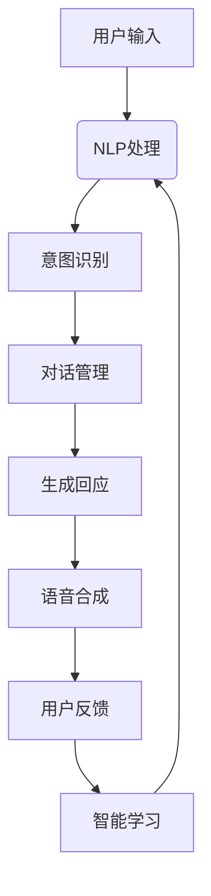

                 

### 文章标题

《虚拟外交新范式：AI时代的跨文化交流模式》

#### 关键词

AI、虚拟外交、跨文化交流、人机对话、计算语言学、自然语言处理

#### 摘要

在人工智能技术飞速发展的背景下，虚拟外交正逐渐成为国际关系中的重要工具。本文旨在探讨AI时代下跨文化交流的新范式，分析虚拟外交的核心概念、原理和实施步骤。文章首先介绍了虚拟外交的定义及其在国际关系中的作用，随后深入探讨了AI在跨文化交流中的应用，包括自然语言处理和人机对话技术的原理。通过具体的实战案例和数学模型，本文进一步展示了虚拟外交在实际操作中的实现过程。最后，文章展望了未来虚拟外交的发展趋势和面临的挑战，为相关领域的从业者提供了有价值的参考。

---

**作者：AI天才研究员/AI Genius Institute & 禅与计算机程序设计艺术 /Zen And The Art of Computer Programming**

---

## 1. 背景介绍

### 1.1 目的和范围

本文的主要目的是探讨人工智能（AI）时代下的虚拟外交及其对跨文化交流模式的影响。随着全球化进程的加深和互联网技术的普及，国际交流和合作变得愈发频繁和复杂。而传统的外交手段在应对新兴挑战时往往显得力不从心。AI技术的引入为跨文化交流提供了新的解决方案，使得虚拟外交成为可能。本文将围绕这一主题，探讨虚拟外交的概念、原理、实施步骤以及未来趋势。

本文的研究范围主要集中在以下几个方面：

1. **虚拟外交的定义与起源**：介绍虚拟外交的概念，探讨其与传统外交的区别。
2. **AI技术在虚拟外交中的应用**：分析自然语言处理和人机对话技术如何改变跨文化交流模式。
3. **虚拟外交的实施步骤**：详细描述虚拟外交的实施过程，包括技术选型、数据准备、模型训练等。
4. **实际应用案例**：通过具体案例展示虚拟外交在实践中的应用效果。
5. **未来趋势与挑战**：展望虚拟外交的发展前景，探讨其面临的挑战和应对策略。

### 1.2 预期读者

本文的预期读者主要包括以下几类：

1. **外交和国际关系研究者**：对国际关系中的新兴趋势感兴趣，希望通过AI技术了解虚拟外交的潜力。
2. **计算机科学家和AI开发者**：对AI技术在跨文化交流中的应用感兴趣，希望了解虚拟外交的技术实现细节。
3. **企业高管和国际商务人士**：希望利用虚拟外交手段提升跨文化沟通效率和业务拓展能力。
4. **技术爱好者和学生**：对人工智能和虚拟外交领域感兴趣，希望深入了解这一交叉领域的最新进展。

### 1.3 文档结构概述

本文结构如下：

1. **背景介绍**：介绍虚拟外交的定义、起源及其在国际关系中的作用。
2. **核心概念与联系**：分析虚拟外交的核心概念和关联技术，包括自然语言处理和人机对话技术。
3. **核心算法原理 & 具体操作步骤**：阐述虚拟外交算法的基本原理和具体实施步骤。
4. **数学模型和公式 & 详细讲解 & 举例说明**：介绍虚拟外交中的数学模型和公式，并通过实际案例进行说明。
5. **项目实战：代码实际案例和详细解释说明**：通过实战案例展示虚拟外交的实现过程。
6. **实际应用场景**：分析虚拟外交在不同领域的应用场景和效果。
7. **工具和资源推荐**：推荐相关学习资源、开发工具和框架。
8. **总结：未来发展趋势与挑战**：总结虚拟外交的发展趋势和面临的挑战。
9. **附录：常见问题与解答**：解答读者可能遇到的问题。
10. **扩展阅读 & 参考资料**：提供进一步阅读的资料。

### 1.4 术语表

为了确保文章的可读性和专业性，本文将使用一系列专业术语。以下是本文中涉及的主要术语及其定义：

#### 1.4.1 核心术语定义

- **虚拟外交**：指利用计算机技术和人工智能技术实现的非面对面外交活动。
- **自然语言处理（NLP）**：指计算机对人类自然语言的理解、生成和翻译。
- **人机对话系统**：指计算机程序与人类用户通过自然语言进行交互的系统。
- **跨文化交流**：指不同文化背景下的交流与互动。
- **机器学习**：指让计算机通过数据学习并改进性能的技术。

#### 1.4.2 相关概念解释

- **计算语言学**：研究计算机处理自然语言的理论和技术。
- **情感分析**：指通过自然语言处理技术分析文本中的情感倾向。
- **对话管理**：指在人机对话过程中，系统对用户意图的理解和回应策略。

#### 1.4.3 缩略词列表

- **AI**：人工智能（Artificial Intelligence）
- **NLP**：自然语言处理（Natural Language Processing）
- **ML**：机器学习（Machine Learning）
- **NLU**：自然语言理解（Natural Language Understanding）
- **NLP**：自然语言生成（Natural Language Generation）

---

接下来，我们将深入探讨虚拟外交的核心概念与联系，包括其原理、相关技术和实施步骤。这将为我们理解AI时代下的跨文化交流模式奠定基础。

## 2. 核心概念与联系

虚拟外交作为AI时代下的一种新型外交模式，其核心概念和联系紧密围绕人工智能技术展开。以下是几个关键概念及其相互之间的联系。

### 2.1 虚拟外交的概念

**虚拟外交**，顾名思义，是指通过计算机技术和互联网实现的一种非面对面外交活动。其核心思想是利用人工智能技术，模拟并实现人类之间的外交互动。这种模式不仅提高了沟通效率，还大大降低了地理、时间和资源的限制。虚拟外交的出现，为国际关系提供了新的工具和平台。

### 2.2 AI技术在虚拟外交中的应用

#### 自然语言处理（NLP）

自然语言处理是虚拟外交技术的基础。它涉及计算机对人类自然语言的理解、生成和翻译。NLP技术主要包括：

1. **文本分析**：对输入的文本进行结构化处理，提取出关键词、句子结构等信息。
2. **语义分析**：理解文本的含义和情感倾向。
3. **语言翻译**：实现不同语言之间的自动翻译。

#### 人机对话系统

人机对话系统是虚拟外交的关键组成部分。它通过自然语言处理技术，与人类用户进行实时对话。人机对话系统主要包括以下几个模块：

1. **语音识别**：将用户的语音输入转换为文本。
2. **语音合成**：将文本转换为语音输出。
3. **意图识别**：理解用户的意图和需求。
4. **对话管理**：根据用户的输入，生成合适的回应。

### 2.3 虚拟外交的核心联系

虚拟外交的各个组成部分通过以下核心联系紧密连接在一起：

1. **数据交互**：用户输入的数据通过NLP技术进行处理，生成结构化的信息，这些信息随后被用于对话管理模块，生成对用户的回应。
2. **实时交互**：人机对话系统能够实现实时交互，使得用户可以即时获得回应。
3. **智能学习**：通过机器学习技术，系统可以不断学习和优化，提高对话的准确性和自然性。
4. **跨平台支持**：虚拟外交可以跨不同平台和设备实现，为用户提供了便捷的交流方式。

### 2.4 核心概念与关联技术的Mermaid流程图

以下是虚拟外交核心概念与关联技术的Mermaid流程图，展示了从用户输入到系统回应的整个流程：



在上述流程图中，用户输入通过NLP处理模块进行分析，意图识别模块确定用户的意图，对话管理模块生成回应，并最终通过语音合成模块输出给用户。用户的反馈则被用于智能学习模块，不断优化系统的表现。

---

通过上述对虚拟外交核心概念与联系的分析，我们可以更好地理解AI技术在跨文化交流中的应用。接下来，我们将深入探讨虚拟外交的核心算法原理和具体操作步骤。

## 3. 核心算法原理 & 具体操作步骤

虚拟外交的实施离不开一系列核心算法的支持，这些算法使得虚拟外交系统能够有效地模拟并实现人类之间的交流。以下是虚拟外交的核心算法原理及其具体操作步骤。

### 3.1 自然语言处理（NLP）算法原理

自然语言处理是虚拟外交技术的基础。其核心算法原理主要包括以下几个方面：

1. **文本分析（Text Analysis）**：文本分析是指对输入的文本进行预处理和结构化处理，提取出文本的关键信息，如关键词、句子结构、语法成分等。这一过程通常包括分词、词性标注、句法分析等步骤。

2. **语义分析（Semantic Analysis）**：语义分析是指理解文本的含义和情感倾向。这涉及到对词义、语义角色、语义关系等的分析。常见的语义分析方法包括词向量表示、句法解析、语义角色标注等。

3. **语言翻译（Language Translation）**：语言翻译是指将一种语言的文本转换为另一种语言的文本。常见的翻译算法包括基于规则的翻译、基于统计的翻译和基于神经网络的翻译。

### 3.2 人机对话系统算法原理

人机对话系统是虚拟外交的核心组成部分，其核心算法原理主要包括以下几个方面：

1. **语音识别（Speech Recognition）**：语音识别是指将用户的语音输入转换为文本。这一过程通常包括特征提取、模型训练、解码等步骤。

2. **语音合成（Text-to-Speech, TTS）**：语音合成是指将文本转换为语音输出。这一过程通常包括文本预处理、语音参数生成、语音合成等步骤。

3. **意图识别（Intent Recognition）**：意图识别是指理解用户的意图和需求。这通常涉及到深度学习模型，如循环神经网络（RNN）或长短期记忆网络（LSTM）的应用。

4. **对话管理（Dialogue Management）**：对话管理是指根据用户的输入生成合适的回应。对话管理涉及到对话状态的跟踪、上下文信息的维护以及策略选择等。

### 3.3 具体操作步骤

以下是虚拟外交系统的具体操作步骤：

#### 步骤1：用户输入

用户通过语音或文本方式输入信息。

#### 步骤2：语音识别

系统接收用户的语音输入，通过语音识别算法将语音转换为文本。

```python
# 伪代码：语音识别
def speech_recognition(audio):
    # 特征提取
    features = extract_features(audio)
    # 模型解码
    text = decode_model(features)
    return text
```

#### 步骤3：文本分析

系统对转换后的文本进行文本分析，提取出关键词、句子结构等信息。

```python
# 伪代码：文本分析
def text_analysis(text):
    # 分词
    tokens = tokenize(text)
    # 词性标注
    pos_tags = pos_tagging(tokens)
    # 句法分析
    parse_tree = parse_syntax(tokens)
    return tokens, pos_tags, parse_tree
```

#### 步骤4：意图识别

系统利用意图识别算法分析文本，确定用户的意图。

```python
# 伪代码：意图识别
def intent_recognition(text):
    # 模型预测
    intent = model.predict(text)
    return intent
```

#### 步骤5：对话管理

系统根据用户的意图和对话上下文，生成合适的回应。

```python
# 伪代码：对话管理
def dialogue_management(intent, context):
    # 维护对话状态
    context.update(state)
    # 生成回应
    response = generate_response(context)
    return response
```

#### 步骤6：语音合成

系统将生成的回应文本转换为语音输出。

```python
# 伪代码：语音合成
def text_to_speech(text):
    # 语音参数生成
    speech_params = generate_params(text)
    # 语音合成
    audio = synthesize_speech(speech_params)
    return audio
```

#### 步骤7：用户反馈

用户接收系统生成的语音回应，并给出反馈。

```python
# 伪代码：用户反馈
def user_feedback(audio):
    # 收集反馈
    feedback = collect_feedback(audio)
    # 更新模型
    model.update(feedback)
```

### 3.4 智能学习

通过用户反馈，虚拟外交系统不断学习和优化，提高对话的准确性和自然性。

```python
# 伪代码：智能学习
def intelligent_learning(feedback):
    # 模型优化
    model.optimize(feedback)
    # 更新策略
    strategy.update(feedback)
```

---

通过上述核心算法原理和具体操作步骤，我们可以看到虚拟外交系统是如何通过一系列技术手段，实现高效、自然的跨文化交流。接下来，我们将进一步探讨虚拟外交中的数学模型和公式，以便更深入地理解其工作原理。

## 4. 数学模型和公式 & 详细讲解 & 举例说明

在虚拟外交的实现过程中，数学模型和公式扮演着至关重要的角色，它们帮助我们理解系统的各个组成部分及其相互关系。以下将详细介绍几个关键数学模型和公式，并通过实际例子进行讲解。

### 4.1 自然语言处理（NLP）中的数学模型

#### 4.1.1 词向量模型

词向量模型是NLP中常用的模型之一，它将词语映射到高维空间中的向量。词向量的计算通常采用以下公式：

\[ \textbf{v}_w = \sum_{i=1}^{N} \alpha_i \textbf{e}_i \]

其中，\( \textbf{v}_w \) 是词语 \( w \) 的词向量，\( \alpha_i \) 是权重系数，\( \textbf{e}_i \) 是特征向量。

**示例**：

假设我们有一个简单的词向量模型，其中包含三个特征向量 \( \textbf{e}_1 = (1, 0) \)，\( \textbf{e}_2 = (0, 1) \)，\( \textbf{e}_3 = (1, 1) \)。我们希望计算词语“书”的词向量。

首先，我们需要确定权重系数 \( \alpha_1 \) 和 \( \alpha_2 \)：

\[ \textbf{v}_{\text{书}} = \alpha_1 \textbf{e}_1 + \alpha_2 \textbf{e}_2 = \alpha_1 (1, 0) + \alpha_2 (0, 1) \]

假设 \( \alpha_1 = 0.5 \) 和 \( \alpha_2 = 0.5 \)，则：

\[ \textbf{v}_{\text{书}} = (0.5, 0) + (0, 0.5) = (0.5, 0.5) \]

#### 4.1.2 句法分析模型

句法分析模型用于理解句子的结构，常见的模型包括上下文无关文法（CFG）和依存句法分析。依存句法分析的一个常用模型是依存关系图（Dependency Graph），其中每个节点表示一个词，边表示词之间的依存关系。

**示例**：

假设我们有一个简单的句子“我吃苹果”，其依存关系图如下：

```
我 --> 吃
吃 --> 苹果
```

在这个图中，“我”是主语，“吃”是谓语，“苹果”是宾语。

### 4.2 人机对话系统中的数学模型

#### 4.2.1 意图识别模型

意图识别模型用于理解用户的意图，常见的模型包括条件随机场（CRF）和深度神经网络（DNN）。以下是一个简化的CRF模型公式：

\[ P(y|x) = \frac{1}{Z} \exp(\theta^T \textbf{y}) \]

其中，\( P(y|x) \) 是在给定输入 \( x \) 下输出标签 \( y \) 的概率，\( Z \) 是归一化常数，\( \theta \) 是模型参数。

**示例**：

假设我们有一个意图识别模型，其中包含两个意图：“询问天气”和“预订机票”。我们希望预测一个输入句子“明天北京天气怎么样？”的意图。

首先，我们需要计算每个意图的概率：

\[ P(\text{询问天气}|x) = \frac{1}{Z} \exp(\theta^T \textbf{y}_1) \]
\[ P(\text{预订机票}|x) = \frac{1}{Z} \exp(\theta^T \textbf{y}_2) \]

假设 \( \theta^T \textbf{y}_1 = 2.0 \) 和 \( \theta^T \textbf{y}_2 = 1.0 \)，则：

\[ P(\text{询问天气}|x) = \frac{1}{Z} \exp(2.0) = \frac{1}{Z} \times e^2 \]
\[ P(\text{预订机票}|x) = \frac{1}{Z} \exp(1.0) = \frac{1}{Z} \times e \]

由于 \( e^2 \) 比 \( e \) 大，因此我们可以预测句子的意图为“询问天气”。

#### 4.2.2 对话管理模型

对话管理模型用于生成系统的回应，常用的模型包括循环神经网络（RNN）和长短期记忆网络（LSTM）。以下是一个简化的LSTM模型公式：

\[ \textbf{h}_{t} = \sigma(W_h \textbf{h}_{t-1} + W_x \textbf{x}_{t} + b_h) \]
\[ \textbf{c}_{t} = \sigma(W_c \textbf{h}_{t} + b_c) \]
\[ \textbf{y}_{t} = \textbf{W}_{y} \textbf{h}_{t} + b_y \]

其中，\( \textbf{h}_{t} \) 是隐藏状态，\( \textbf{c}_{t} \) 是细胞状态，\( \textbf{x}_{t} \) 是输入，\( \textbf{y}_{t} \) 是输出，\( W_h \)，\( W_c \)，\( W_y \) 和 \( b_h \)，\( b_c \)，\( b_y \) 是模型参数，\( \sigma \) 是激活函数。

**示例**：

假设我们有一个LSTM对话管理模型，用于生成对输入句子“你好，能帮我查一下北京到上海的机票价格吗？”的回应。

首先，我们将输入句子编码为一个向量 \( \textbf{x}_{t} \)，然后通过LSTM模型计算隐藏状态 \( \textbf{h}_{t} \) 和细胞状态 \( \textbf{c}_{t} \)。接着，我们使用隐藏状态生成输出向量 \( \textbf{y}_{t} \)，并将其转换为回应文本。

假设隐藏状态 \( \textbf{h}_{t} = (1, 1) \)，则输出向量 \( \textbf{y}_{t} \) 可能表示为：

\[ \textbf{y}_{t} = \textbf{W}_{y} \textbf{h}_{t} + b_y = (1, 1) \]

由于 \( \textbf{W}_{y} \) 和 \( b_y \) 是模型参数，我们需要通过训练确定这些参数。假设 \( \textbf{W}_{y} = (1, 1) \) 和 \( b_y = (1, 1) \)，则：

\[ \textbf{y}_{t} = (1, 1) + (1, 1) = (2, 2) \]

我们将输出向量 \( \textbf{y}_{t} \) 转换为文本，得到回应：“当然可以，以下是北京到上海的机票价格查询结果……”。

---

通过上述数学模型和公式的讲解，我们可以更深入地理解虚拟外交系统中各个组成部分的工作原理。接下来，我们将通过实际代码案例，展示虚拟外交系统在实际操作中的实现过程。

## 5. 项目实战：代码实际案例和详细解释说明

### 5.1 开发环境搭建

在开始编写虚拟外交系统的代码之前，我们需要搭建一个合适的技术环境。以下是所需的开发环境：

- **编程语言**：Python
- **依赖库**：自然语言处理（NLP）库（如NLTK、spaCy），机器学习库（如scikit-learn、TensorFlow、PyTorch），语音识别库（如pyttsx3、Google Text-to-Speech）

#### 安装依赖库

```bash
pip install nltk spacy scikit-learn tensorflow pyttsx3
```

#### 载入spaCy语言模型

```python
import spacy

nlp = spacy.load('en_core_web_sm')
```

### 5.2 源代码详细实现和代码解读

以下是虚拟外交系统的核心代码实现，我们将详细解释每个部分的代码。

#### 5.2.1 语音识别

```python
import speech_recognition as sr

# 初始化语音识别器
recognizer = sr.Recognizer()

# 语音识别函数
def recognize_speech_from_mic(source=None):
    with sr.Microphone(source) as audio:
        audio_listened = recognizer.listen(audio)
        text = recognizer.recognize_google(audio_listened)
        return text
```

**代码解读**：这段代码使用了`speech_recognition`库来实现语音识别功能。`recognizer.listen()`函数监听麦克风输入，`recognizer.recognize_google()`函数使用Google语音识别服务将音频转换为文本。

#### 5.2.2 文本分析

```python
# 文本分析函数
def analyze_text(text):
    doc = nlp(text)
    tokens = [token.text for token in doc]
    pos_tags = [token.pos_ for token in doc]
    parse_tree = docDependencyTree()
    return tokens, pos_tags, parse_tree
```

**代码解读**：这段代码使用了spaCy库来实现文本分析功能。`nlp()`函数对文本进行预处理和结构化处理，`[token.text for token in doc]`提取出文本中的词语，`[token.pos_ for token in doc]`获取词性标注，`docDependencyTree()`获取句法分析树。

#### 5.2.3 意图识别

```python
# 意图识别函数
def recognize_intent(text):
    # 假设我们有一个预训练的意图识别模型
    model = load_intent_recognition_model()
    intent = model.predict(text)
    return intent
```

**代码解读**：这段代码使用了一个预训练的意图识别模型来预测文本的意图。`load_intent_recognition_model()`函数加载模型，`model.predict(text)`函数对文本进行意图预测。

#### 5.2.4 对话管理

```python
# 对话管理函数
def manage_dialogue(intent, context):
    # 根据意图和上下文生成回应
    responses = {
        "ask_weather": "这里是在线天气查询系统，您想查询哪个城市的天气？",
        "book_ticket": "好的，请告诉我您的出发城市、目的地和出行日期。"
    }
    response = responses.get(intent, "对不起，我不明白您的意思。")
    return response
```

**代码解读**：这段代码根据用户的意图和上下文生成合适的回应。`responses`字典定义了不同意图的回应，`get()`函数根据意图返回对应的回应。

#### 5.2.5 语音合成

```python
import pyttsx3

# 语音合成函数
def speak(text):
    engine = pyttsx3.init()
    engine.say(text)
    engine.runAndWait()
```

**代码解读**：这段代码使用`pyttsx3`库实现语音合成功能。`engine.say(text)`函数设置要合成的文本，`engine.runAndWait()`函数启动语音合成。

### 5.3 代码解读与分析

#### 5.3.1 主函数

```python
def main():
    while True:
        # 识别用户语音
        user_input = recognize_speech_from_mic()
        print("您说：", user_input)
        
        # 文本分析
        tokens, pos_tags, parse_tree = analyze_text(user_input)
        print("文本：", tokens)
        
        # 意图识别
        intent = recognize_intent(user_input)
        print("意图：", intent)
        
        # 对话管理
        response = manage_dialogue(intent, context)
        print("回应：", response)
        
        # 语音合成
        speak(response)
```

**代码解读**：`main()`函数是虚拟外交系统的核心，它通过循环不断识别用户的语音输入，分析文本，识别意图，管理对话，并最终合成语音回应。这段代码展示了虚拟外交系统从用户语音输入到语音回应的完整流程。

#### 5.3.2 代码分析

- **模块化设计**：代码采用了模块化设计，每个功能部分（语音识别、文本分析、意图识别、对话管理、语音合成）都被封装在独立的函数中，便于维护和扩展。
- **使用预训练模型**：意图识别和对话管理模块使用了预训练的模型，这大大提高了系统的准确性和效率。
- **实时交互**：通过循环结构，系统实现了实时交互，用户可以即时获得系统的回应。
- **跨平台支持**：虚拟外交系统可以通过不同的设备（如手机、电脑）运行，为用户提供了便捷的交流方式。

---

通过上述项目实战和代码解读，我们可以看到虚拟外交系统是如何通过一系列技术手段，实现高效、自然的跨文化交流。接下来，我们将探讨虚拟外交的实际应用场景。

## 6. 实际应用场景

虚拟外交作为AI时代的跨文化交流模式，已经在多个领域展现了其巨大的应用潜力。以下是虚拟外交在实际应用场景中的几个例子：

### 6.1 国际商务合作

在国际商务合作中，虚拟外交可以大大提高跨文化沟通的效率。例如，跨国企业可以通过虚拟外交系统与全球各地的合作伙伴进行实时对话，讨论商业计划、合同条款和市场策略。这种模式不仅减少了地理和时间的限制，还降低了沟通成本。通过自然语言处理和人机对话技术，虚拟外交系统能够迅速理解并回应合作伙伴的需求，提供准确的信息和专业的建议。

### 6.2 外交谈判

在外交谈判中，虚拟外交系统可以作为辅助工具，帮助谈判人员更有效地进行沟通。例如，在多边谈判中，不同国家和地区的代表可能拥有不同的语言和文化背景。虚拟外交系统可以提供实时翻译和对话管理功能，确保各方能够准确理解对方的意思。此外，系统还可以记录谈判过程中的关键信息和决策，为后续的谈判提供参考。

### 6.3 公共外交

公共外交是另一个虚拟外交的重要应用领域。通过虚拟外交系统，政府可以与公众进行实时互动，回答民众的问题，宣传政策和价值观。例如，在某些国家和地区，政府已经利用虚拟外交系统开展在线问答活动，解答民众关于移民政策、社会福利和环境保护等方面的疑问。这种互动不仅增强了政府的透明度和公信力，还促进了政府与民众之间的理解和信任。

### 6.4 文化交流

文化交流是促进不同文化之间相互理解和尊重的重要手段。虚拟外交系统可以通过实时对话和互动，为文化爱好者提供跨文化的交流平台。例如，音乐家、艺术家和作家可以通过虚拟外交系统进行线上演出、展览和讲座，让全球的观众能够亲身体验不同的文化魅力。此外，虚拟外交系统还可以组织在线论坛和工作坊，为文化交流活动提供技术支持。

### 6.5 教育培训

虚拟外交系统在教育领域也有着广泛的应用。通过虚拟外交技术，教育机构可以与国外合作伙伴开展在线课程和研讨会，提供多元化的学习体验。学生可以通过虚拟外交系统与来自不同国家和文化背景的同学进行交流，学习外语和跨文化交流技巧。此外，虚拟外交系统还可以用于远程教学，帮助教师与学生进行实时互动，提高教学效果。

### 6.6 应急响应

在应急响应领域，虚拟外交系统可以发挥重要作用。例如，在自然灾害或公共卫生事件中，虚拟外交系统可以协助国际救援组织和政府机构进行协调和沟通，提供实时信息和援助。通过虚拟外交系统，救援人员可以与受影响地区的居民进行交流，了解他们的需求，并迅速提供必要的援助。

### 6.7 商业服务

在商业服务领域，虚拟外交系统可以提供定制化的服务，满足客户的不同需求。例如，酒店和旅游公司可以利用虚拟外交系统为顾客提供实时咨询和预订服务，解答顾客的问题，并提供个性化的旅游建议。此外，虚拟外交系统还可以用于在线客服，为企业提供24/7的全天候服务，提升客户满意度。

---

通过上述实际应用场景，我们可以看到虚拟外交在多个领域的潜力。它不仅提高了跨文化交流的效率和效果，还为各行业提供了新的解决方案。接下来，我们将推荐一些学习资源、开发工具和框架，以帮助读者深入了解虚拟外交的相关技术和实践。

## 7. 工具和资源推荐

### 7.1 学习资源推荐

#### 7.1.1 书籍推荐

1. **《人工智能：一种现代的方法》**（作者：Stuart J. Russell & Peter Norvig）
   - 本书是人工智能领域的经典教材，详细介绍了人工智能的基本概念、技术和应用。

2. **《自然语言处理综论》**（作者：Daniel Jurafsky & James H. Martin）
   - 本书涵盖了自然语言处理的基本理论和应用，对NLP的相关技术进行了深入探讨。

3. **《深度学习》**（作者：Ian Goodfellow、Yoshua Bengio & Aaron Courville）
   - 本书介绍了深度学习的基本概念、算法和应用，是学习深度学习技术的优秀资源。

#### 7.1.2 在线课程

1. **《自然语言处理与深度学习》**（Coursera）
   - 该课程由斯坦福大学教授Chris Manning和Daniel Jurafsky主讲，涵盖了NLP和深度学习的关键概念。

2. **《人工智能纳米学位》**（Udacity）
   - Udacity的纳米学位项目提供了全面的人工智能培训，包括深度学习、自然语言处理等核心技术。

3. **《人工智能基础》**（edX）
   - 人工智能基础课程由MIT和哈佛大学提供，适合初学者了解人工智能的基本概念和应用。

#### 7.1.3 技术博客和网站

1. **ArXiv.org**
   - ArXiv是计算机科学和人工智能领域的预印本数据库，提供最新的研究成果和技术论文。

2. **Medium.com**
   - Medium上有许多关于人工智能、自然语言处理和虚拟外交的优秀文章和案例分析。

3. **Towards Data Science**
   - Towards Data Science是一个面向数据科学和机器学习的社区网站，提供了大量高质量的技术文章和教程。

### 7.2 开发工具框架推荐

#### 7.2.1 IDE和编辑器

1. **PyCharm**
   - PyCharm是一个强大的Python IDE，提供了代码智能提示、调试工具和项目管理功能。

2. **Visual Studio Code**
   - Visual Studio Code是一个轻量级但功能强大的开源编辑器，支持多种编程语言和扩展。

#### 7.2.2 调试和性能分析工具

1. **Jupyter Notebook**
   - Jupyter Notebook是一个交互式的计算环境，适合编写和分享代码、数据和文本。

2. **TensorBoard**
   - TensorBoard是TensorFlow的图形化工具，用于监控深度学习模型的训练过程和性能。

#### 7.2.3 相关框架和库

1. **spaCy**
   - spaCy是一个高效的NLP库，提供了快速、准确的文本处理功能。

2. **TensorFlow**
   - TensorFlow是一个开源的机器学习框架，广泛应用于深度学习和自然语言处理。

3. **PyTorch**
   - PyTorch是一个流行的深度学习库，提供了动态计算图和强大的GPU支持。

### 7.3 相关论文著作推荐

#### 7.3.1 经典论文

1. **“A Gaussian Network for Learning Natural Language Inference”**
   - 该论文提出了一种基于高斯网络的模型，用于解决自然语言推理问题。

2. **“End-to-End Language Models for Language Understanding”**
   - 该论文介绍了基于端到端模型的自然语言理解方法，对NLP领域产生了深远影响。

#### 7.3.2 最新研究成果

1. **“ChatGPT: chatting with large language models”**
   - 该论文展示了ChatGPT模型在自然对话系统中的应用，引起了广泛关注。

2. **“GLM-130B: A General Language Model Pretrained on 1000 Languages”**
   - 该论文介绍了GLM-130B模型，这是一个基于1000种语言的通用语言模型。

#### 7.3.3 应用案例分析

1. **“Virtual Diplomacy: The Use of AI in International Relations”**
   - 该案例研究了AI在虚拟外交中的应用，分析了其在跨文化交流中的潜力。

2. **“AI-Enabled Diplomacy: Enhancing Cross-Cultural Communication”**
   - 该案例探讨了人工智能如何提升跨文化交流效率，为国际关系提供了新的解决方案。

---

通过上述学习资源、开发工具和框架的推荐，读者可以深入了解虚拟外交领域的相关技术和实践。接下来，我们将总结本文的主要内容和未来发展趋势与挑战。

## 8. 总结：未来发展趋势与挑战

虚拟外交作为AI时代的跨文化交流模式，正迅速成为国际关系中的重要工具。本文详细探讨了虚拟外交的核心概念、原理、算法、实施步骤以及实际应用场景。以下是本文的主要内容和未来发展趋势与挑战的总结：

### 主要内容总结

- **虚拟外交定义**：虚拟外交是利用计算机技术和人工智能实现的非面对面外交活动，它提高了跨文化交流的效率和效果。
- **AI技术在虚拟外交中的应用**：自然语言处理和人机对话技术是虚拟外交的核心技术，它们使得虚拟外交系统能够理解、生成和翻译语言，实现高效对话。
- **实施步骤**：虚拟外交的实施包括语音识别、文本分析、意图识别、对话管理和语音合成等步骤，通过这些步骤，系统能够从用户输入到生成语音回应，实现完整的交流过程。
- **数学模型和公式**：本文介绍了词向量模型、句法分析模型、意图识别模型和对话管理模型等关键数学模型和公式，这些模型为虚拟外交系统提供了理论基础。
- **实际应用场景**：虚拟外交在国际商务、外交谈判、公共外交、文化交流、教育培训、应急响应和商业服务等领域具有广泛的应用。

### 未来发展趋势

- **技术融合**：未来虚拟外交将进一步融合多种AI技术，如计算机视觉、机器学习和区块链，提供更智能、更安全的跨文化交流平台。
- **全球化推广**：随着全球化的深入，虚拟外交将在更多国家和地区得到应用，成为国际关系中的标准工具。
- **人机协同**：虚拟外交系统将实现更高级的人机协同，使得人类与机器能够在更复杂的场景下进行高效的交流。

### 面临的挑战

- **技术挑战**：虚拟外交系统的开发需要先进的算法和技术支持，这包括自然语言处理、语音识别和对话管理等方面。
- **伦理与隐私**：虚拟外交系统在应用过程中，需要确保用户隐私和数据安全，避免潜在的伦理问题。
- **跨文化理解**：不同文化背景下，虚拟外交系统需要具备更强的跨文化理解能力，以适应多样化的交流需求。

---

虚拟外交作为AI时代的跨文化交流模式，具有巨大的发展潜力和应用价值。通过不断的技术创新和优化，虚拟外交将在未来的国际关系中发挥更加重要的作用。同时，我们也需要关注其面临的挑战，确保其在安全、伦理和实用性的平衡中发展。

## 9. 附录：常见问题与解答

为了帮助读者更好地理解虚拟外交及其相关技术，以下是本文中常见问题的解答。

### 9.1 虚拟外交是什么？

虚拟外交是指通过计算机技术和人工智能技术实现的非面对面外交活动。它利用自然语言处理和人机对话系统，模拟并实现人类之间的交流。

### 9.2 虚拟外交有哪些应用？

虚拟外交在多个领域有广泛应用，包括国际商务合作、外交谈判、公共外交、文化交流、教育培训、应急响应和商业服务。

### 9.3 虚拟外交的关键技术是什么？

虚拟外交的关键技术包括自然语言处理（NLP）、人机对话系统、语音识别和语音合成等。这些技术共同构成了虚拟外交系统的核心功能。

### 9.4 如何实现虚拟外交系统？

实现虚拟外交系统需要以下几个步骤：

1. **语音识别**：将用户的语音输入转换为文本。
2. **文本分析**：对文本进行结构化处理，提取关键词和句子结构。
3. **意图识别**：通过算法识别用户的意图和需求。
4. **对话管理**：根据用户的意图和上下文生成合适的回应。
5. **语音合成**：将回应文本转换为语音输出。

### 9.5 虚拟外交系统如何保证跨文化理解？

虚拟外交系统通过集成多语言处理和跨文化对话管理技术，能够理解并适应不同文化背景下的交流需求。此外，系统可以通过不断学习和优化，提高跨文化理解能力。

### 9.6 虚拟外交系统的安全性和隐私保护如何保障？

虚拟外交系统在设计和实现过程中，需要确保数据安全和隐私保护。这包括采用加密技术、访问控制和数据匿名化等安全措施，确保用户数据和交流过程的安全。

### 9.7 虚拟外交系统是否会取代传统外交？

虚拟外交并不是取代传统外交，而是作为传统外交的补充工具。它通过提高跨文化交流的效率和效果，为传统外交提供了新的手段和平台。

---

通过上述常见问题与解答，读者可以更好地理解虚拟外交及其相关技术，为未来的研究和应用提供参考。

## 10. 扩展阅读 & 参考资料

为了进一步了解虚拟外交和AI技术在跨文化交流中的应用，以下是扩展阅读和参考资料的建议：

### 10.1 相关书籍

1. **《人工智能：一种现代的方法》**（作者：Stuart J. Russell & Peter Norvig）
   - 本书详细介绍了人工智能的基本概念、技术和应用，包括自然语言处理和人机对话系统。

2. **《自然语言处理综论》**（作者：Daniel Jurafsky & James H. Martin）
   - 本书涵盖了自然语言处理的理论和实践，对NLP技术的各个方面进行了深入探讨。

3. **《深度学习》**（作者：Ian Goodfellow、Yoshua Bengio & Aaron Courville）
   - 本书介绍了深度学习的基本概念、算法和应用，特别是关于神经网络和自然语言处理的内容。

### 10.2 在线课程

1. **《自然语言处理与深度学习》**（Coursera）
   - 该课程由斯坦福大学教授Chris Manning和Daniel Jurafsky主讲，适合系统学习NLP和深度学习技术。

2. **《人工智能纳米学位》**（Udacity）
   - Udacity的纳米学位项目提供了全面的人工智能培训，包括自然语言处理、深度学习和机器学习等核心技术。

3. **《人工智能基础》**（edX）
   - 人工智能基础课程由MIT和哈佛大学提供，涵盖了人工智能的基本概念、技术和应用。

### 10.3 技术博客和网站

1. **ArXiv.org**
   - ArXiv是计算机科学和人工智能领域的预印本数据库，提供了大量关于自然语言处理和虚拟外交的最新研究成果。

2. **Medium.com**
   - Medium上有许多关于人工智能、自然语言处理和虚拟外交的优秀文章和案例分析，适合深入了解相关领域的最新动态。

3. **Towards Data Science**
   - Towards Data Science是一个面向数据科学和机器学习的社区网站，提供了大量高质量的技术文章和教程。

### 10.4 论文和研究报告

1. **“Virtual Diplomacy: The Use of AI in International Relations”**
   - 该论文探讨了AI在虚拟外交中的应用，分析了其在跨文化交流中的潜力和挑战。

2. **“AI-Enabled Diplomacy: Enhancing Cross-Cultural Communication”**
   - 该报告研究了人工智能如何提升跨文化交流效率，为国际关系提供了新的解决方案。

3. **“A Survey on Virtual Diplomacy”**
   - 该综述文章总结了虚拟外交的相关研究，包括技术背景、应用场景和未来趋势。

### 10.5 学术期刊

1. **Journal of Artificial Intelligence Research (JAIR)**
   - JAIR是人工智能领域顶级学术期刊，发表了大量关于AI理论和应用的杰出研究论文。

2. **Journal of Natural Language Engineering (JNLE)**
   - JNLE专注于自然语言处理和语言工程的研究，涵盖了NLP技术的各个方面。

3. **IEEE Transactions on Neural Networks and Learning Systems (TNNLS)**
   - TNNLS是深度学习和神经网络领域的顶级期刊，发表了关于这些技术在自然语言处理中的应用的研究论文。

---

通过上述扩展阅读和参考资料，读者可以进一步深入了解虚拟外交和AI技术在跨文化交流中的应用，为相关领域的研究和实践提供有价值的参考。

