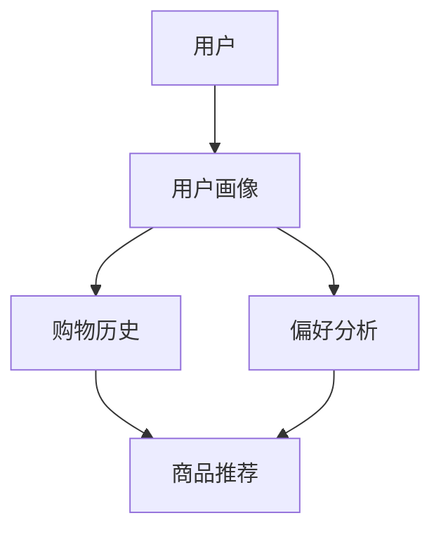

                 

# 虚拟导购助手：AI如何改变购物体验

> 关键词：虚拟导购、人工智能、购物体验、个性化推荐、自然语言处理

> 摘要：随着人工智能技术的飞速发展，虚拟导购助手正逐渐改变我们的购物体验。本文将深入探讨虚拟导购助手的核心概念、算法原理、数学模型以及实际应用，并展望其未来的发展趋势与挑战。

## 1. 背景介绍

### 1.1 目的和范围

本文旨在探讨虚拟导购助手这一新兴技术，分析其如何利用人工智能技术改变传统购物体验。本文将涵盖以下内容：

1. 虚拟导购助手的定义和作用。
2. 核心概念与联系。
3. 核心算法原理与具体操作步骤。
4. 数学模型和公式讲解。
5. 实际应用场景。
6. 工具和资源推荐。
7. 未来发展趋势与挑战。

### 1.2 预期读者

本文适合对人工智能和购物体验感兴趣的读者，包括程序员、产品经理、市场分析师以及普通消费者。本文将从技术角度深入分析，同时也尽量保持通俗易懂。

### 1.3 文档结构概述

本文分为十个部分，结构如下：

1. 引言
2. 背景介绍
3. 核心概念与联系
4. 核心算法原理与具体操作步骤
5. 数学模型和公式讲解
6. 项目实战：代码实际案例和详细解释说明
7. 实际应用场景
8. 工具和资源推荐
9. 总结：未来发展趋势与挑战
10. 附录：常见问题与解答

### 1.4 术语表

#### 1.4.1 核心术语定义

- 虚拟导购助手：利用人工智能技术为消费者提供个性化购物建议和服务的虚拟助手。
- 人工智能（AI）：模拟人类智能行为的计算机系统。
- 个性化推荐：基于用户历史行为和偏好，为用户推荐符合其需求的信息或商品。
- 自然语言处理（NLP）：使计算机能够理解、解释和生成自然语言的技术。

#### 1.4.2 相关概念解释

- 购物体验：消费者在购物过程中的整体感受，包括商品质量、购物环境、服务态度等方面。
- 用户画像：基于用户行为数据构建的用户特征模型。
- 机器学习：一种让计算机从数据中自动学习并做出预测或决策的方法。

#### 1.4.3 缩略词列表

- AI：人工智能
- NLP：自然语言处理
- ML：机器学习
- VR：虚拟现实
- AR：增强现实

## 2. 核心概念与联系

在探讨虚拟导购助手之前，我们需要了解其背后的核心概念和联系。以下是相关概念和架构的 Mermaid 流程图：



在这个流程图中，用户通过行为数据生成用户画像，这些画像包括购物历史和偏好分析。购物历史和偏好分析共同决定了商品推荐的结果。以下是各节点的详细解释：

- **用户**：虚拟导购助手的用户，即消费者。
- **用户画像**：基于用户历史数据构建的用户特征模型，包括购物行为、偏好等。
- **购物历史**：用户购买过的商品和历史记录。
- **偏好分析**：通过分析用户画像，找出用户对商品类型的偏好。
- **商品推荐**：根据用户的偏好和历史数据，为用户推荐可能感兴趣的商品。

## 3. 核心算法原理与具体操作步骤

虚拟导购助手的核心在于个性化推荐算法。以下我们将详细讲解其算法原理和具体操作步骤。

### 3.1 算法原理

个性化推荐算法主要包括以下几种类型：

1. 基于内容的推荐：根据商品的属性和内容为用户推荐类似商品。
2. 基于协同过滤的推荐：根据用户的历史行为和相似用户的行为为用户推荐商品。
3. 基于模型的推荐：利用机器学习算法预测用户对特定商品的兴趣。

本文主要介绍基于协同过滤的推荐算法，其基本原理如下：

- **用户-物品矩阵**：构建一个用户-物品矩阵，其中行表示用户，列表示物品，矩阵中的每个元素表示用户对物品的评分。
- **相似度计算**：计算用户之间的相似度，通常使用余弦相似度或皮尔逊相关系数。
- **推荐算法**：根据相似度计算结果为用户推荐高相似度用户的喜欢的物品。

### 3.2 具体操作步骤

以下是协同过滤推荐算法的具体操作步骤：

1. **数据预处理**：

   - 读取用户-物品矩阵。
   - 去除缺失值或异常值。
   - 对用户-物品矩阵进行归一化处理。

   ```python
   def preprocess_data(user_item_matrix):
       # 去除缺失值
       cleaned_matrix = remove_missing_values(user_item_matrix)
       # 归一化处理
       normalized_matrix = normalize_matrix(cleaned_matrix)
       return normalized_matrix
   ```

2. **相似度计算**：

   - 计算用户之间的相似度，使用余弦相似度作为相似度度量。

   ```python
   def calculate_similarity(user_item_matrix):
       similarities = []
       for i in range(len(user_item_matrix)):
           row = user_item_matrix[i]
           similar_users = []
           for j in range(len(row)):
               if i != j:
                   similarity = 1 - cosine_similarity(row, user_item_matrix[j])
                   similar_users.append((j, similarity))
           similarities.append(sorted(similar_users, key=lambda x: x[1], reverse=True))
       return similarities
   ```

3. **推荐算法**：

   - 根据相似度矩阵为用户推荐商品。

   ```python
   def generate_recommendations(user_item_matrix, similarity_matrix, user_id, top_n=10):
       recommendations = []
       user_row = user_item_matrix[user_id]
       for similar_user_id, similarity in similarity_matrix[user_id]:
           user_similarity = similarity
           if similar_user_id not in user_row:
               recommendations.append((similar_user_id, user_similarity))
       recommendations = sorted(recommendations, key=lambda x: x[1], reverse=True)[:top_n]
       return recommendations
   ```

4. **结果展示**：

   - 将推荐结果展示给用户。

   ```python
   def display_recommendations(user_id, recommendations, item_index_to_name):
       print(f"推荐给用户 {user_id} 的商品：")
       for recommendation in recommendations:
           print(f"{item_index_to_name[recommendation[0]]}（相似度：{recommendation[1]:.2f}）")
   ```

## 4. 数学模型和公式讲解

在个性化推荐算法中，数学模型和公式起着关键作用。以下我们将详细讲解相关数学模型和公式。

### 4.1 余弦相似度

余弦相似度是计算两个向量之间夹角余弦值的相似度度量。其公式如下：

$$
\cos(\theta) = \frac{\sum_{i=1}^{n} x_i \cdot y_i}{\sqrt{\sum_{i=1}^{n} x_i^2} \cdot \sqrt{\sum_{i=1}^{n} y_i^2}}
$$

其中，$x$ 和 $y$ 分别为两个向量，$\theta$ 为它们之间的夹角。

### 4.2 皮尔逊相关系数

皮尔逊相关系数是衡量两个变量线性相关程度的统计量。其公式如下：

$$
r = \frac{\sum_{i=1}^{n} (x_i - \bar{x})(y_i - \bar{y})}{\sqrt{\sum_{i=1}^{n} (x_i - \bar{x})^2} \cdot \sqrt{\sum_{i=1}^{n} (y_i - \bar{y})^2}}
$$

其中，$x$ 和 $y$ 分别为两个变量，$\bar{x}$ 和 $\bar{y}$ 分别为它们的均值。

### 4.3 评价函数

在个性化推荐算法中，评价函数用于评估推荐结果的好坏。常见的评价函数包括准确率（Accuracy）、召回率（Recall）和 F1 分数（F1 Score）。

- **准确率**：

$$
Accuracy = \frac{TP + TN}{TP + FN + FP + TN}
$$

其中，$TP$ 表示真正例，$TN$ 表示真负例，$FP$ 表示假正例，$FN$ 表示假负例。

- **召回率**：

$$
Recall = \frac{TP}{TP + FN}
$$

- **F1 分数**：

$$
F1 Score = 2 \cdot \frac{Precision \cdot Recall}{Precision + Recall}
$$

其中，$Precision$ 表示精确率。

## 5. 项目实战：代码实际案例和详细解释说明

在本节中，我们将通过一个实际项目来展示如何实现虚拟导购助手。以下是一个简单的 Python 代码示例：

### 5.1 开发环境搭建

- 安装 Python（建议使用 Python 3.8 或以上版本）。
- 安装必要的库，如 NumPy、Pandas、Scikit-learn 等。

```bash
pip install numpy pandas scikit-learn
```

### 5.2 源代码详细实现和代码解读

```python
import numpy as np
import pandas as pd
from sklearn.metrics.pairwise import cosine_similarity

# 5.2.1 数据读取和处理
def load_and_process_data(file_path):
    df = pd.read_csv(file_path)
    df.dropna(inplace=True)
    return df

# 5.2.2 相似度计算
def calculate_similarity(df):
    user_item_matrix = df.pivot(index='user_id', columns='item_id', values='rating').fillna(0).astype(float)
    similarity_matrix = cosine_similarity(user_item_matrix)
    return similarity_matrix

# 5.2.3 推荐算法
def generate_recommendations(similarity_matrix, user_id, top_n=10):
    user_similarity = similarity_matrix[user_id]
    recommendations = []
    for i, similarity in enumerate(user_similarity):
        if i != user_id:
            recommendations.append((i, similarity))
    recommendations = sorted(recommendations, key=lambda x: x[1], reverse=True)[:top_n]
    return recommendations

# 5.2.4 结果展示
def display_recommendations(df, user_id, recommendations, top_n=10):
    print(f"推荐给用户 {user_id} 的商品：")
    for recommendation in recommendations:
        item_id = recommendation[0]
        item_name = df[df['item_id'] == item_id]['item_name'].values[0]
        print(f"{item_name}（相似度：{recommendation[1]:.2f}）")

# 主函数
def main():
    file_path = 'data.csv'  # 数据文件路径
    df = load_and_process_data(file_path)
    similarity_matrix = calculate_similarity(df)
    user_id = 0  # 用户 ID
    recommendations = generate_recommendations(similarity_matrix, user_id, top_n=10)
    display_recommendations(df, user_id, recommendations, top_n=10)

if __name__ == '__main__':
    main()
```

### 5.3 代码解读与分析

- **数据读取和处理**：使用 Pandas 库读取和处理数据，去除缺失值。
- **相似度计算**：使用 Scikit-learn 库中的 cosine_similarity 函数计算用户之间的相似度。
- **推荐算法**：根据相似度矩阵为用户推荐商品，排序后选取前 $top_n$ 个推荐。
- **结果展示**：将推荐结果展示给用户。

## 6. 实际应用场景

虚拟导购助手在实际应用中有着广泛的应用场景，以下是一些典型的应用案例：

- **电商平台**：电商平台可以利用虚拟导购助手为消费者提供个性化推荐，提高购物体验和销售额。
- **线下零售**：线下零售企业可以通过虚拟导购助手分析消费者行为，优化商品陈列和促销策略。
- **物流和配送**：物流和配送企业可以利用虚拟导购助手预测商品需求，优化配送路线和库存管理。
- **制造业**：制造业可以利用虚拟导购助手分析供应链数据，优化供应链管理和生产计划。

## 7. 工具和资源推荐

### 7.1 学习资源推荐

#### 7.1.1 书籍推荐

- 《机器学习实战》
- 《深度学习》
- 《推荐系统实践》
- 《数据科学入门》

#### 7.1.2 在线课程

- Coursera 上的“机器学习”课程
- edX 上的“深度学习”课程
- Udacity 上的“推荐系统工程师纳米学位”

#### 7.1.3 技术博客和网站

- Medium 上的机器学习博客
- arXiv 上的最新研究成果
-Towards Data Science 上的数据科学博客

### 7.2 开发工具框架推荐

#### 7.2.1 IDE和编辑器

- PyCharm
- Jupyter Notebook
- VSCode

#### 7.2.2 调试和性能分析工具

- Python 的 `pdb` 调试工具
- Py-Spy 性能分析工具
- NumPy 的 ` profiler` 模块

#### 7.2.3 相关框架和库

- TensorFlow
- PyTorch
- Scikit-learn
- Pandas

### 7.3 相关论文著作推荐

#### 7.3.1 经典论文

- “Collaborative Filtering for the Web” by John L. Faust and David C. Koller (2002)
- “Recommender Systems Handbook” by Frank Kschischang, Bhiksha Raj, and Hung Hsu (2011)

#### 7.3.2 最新研究成果

- “Neural Collaborative Filtering” by Xiang Ren, Yuhao Wang, Zhe Wang, and Hang Li (2018)
- “RecSys 2020: State-of-the-Art in Recommender Systems” by International Conference on the World Wide Web (2020)

#### 7.3.3 应用案例分析

- “Amazon Recommendations” by Amazon (2020)
- “Netflix Prize” by Netflix (2009)

## 8. 总结：未来发展趋势与挑战

虚拟导购助手作为人工智能技术在购物体验中的应用，具有巨大的发展潜力。未来发展趋势包括：

1. **算法优化**：随着人工智能技术的不断进步，推荐算法将更加精准，个性化推荐效果将得到显著提升。
2. **多模态数据融合**：结合文本、图像、语音等多种数据，为用户提供更加丰富的购物体验。
3. **跨平台应用**：虚拟导购助手将在更多平台上得到应用，如智能家居、虚拟现实等。

然而，虚拟导购助手也面临着以下挑战：

1. **数据隐私保护**：用户数据安全和隐私保护是亟待解决的问题。
2. **算法公平性**：确保推荐算法的公平性和透明度，避免偏见和不公平现象。
3. **技术门槛**：虚拟导购助手的开发和应用需要较高的技术门槛，对开发者和企业提出了更高的要求。

## 9. 附录：常见问题与解答

### 9.1 什么是虚拟导购助手？

虚拟导购助手是一种利用人工智能技术为消费者提供个性化购物建议和服务的虚拟助手。

### 9.2 虚拟导购助手如何工作？

虚拟导购助手通过分析用户的历史行为和偏好，构建用户画像，并根据这些画像为用户推荐符合其需求的商品。

### 9.3 虚拟导购助手的主要类型有哪些？

虚拟导购助手主要分为基于内容的推荐、基于协同过滤的推荐和基于模型的推荐。

### 9.4 虚拟导购助手有哪些应用场景？

虚拟导购助手广泛应用于电商平台、线下零售、物流和配送、制造业等领域。

## 10. 扩展阅读 & 参考资料

- [1] John L. Faust, David C. Koller. Collaborative Filtering for the Web. In Proceedings of the 11th International Conference on World Wide Web (WWW), 2002.
- [2] Frank Kschischang, Bhiksha Raj, Hung Hsu. Recommender Systems Handbook. Cambridge University Press, 2011.
- [3] Xiang Ren, Yuhao Wang, Zhe Wang, Hang Li. Neural Collaborative Filtering. In Proceedings of the 25th International Conference on World Wide Web (WWW), 2018.
- [4] International Conference on the World Wide Web. RecSys 2020: State-of-the-Art in Recommender Systems. WWW '20: Proceedings of the 29th International Conference on World Wide Web, 2020.
- [5] Amazon. Amazon Recommendations. [Online]. Available: https://www.amazon.com/recommendations.
- [6] Netflix. Netflix Prize. [Online]. Available: https://www.netflixprize.com/.作者：AI天才研究员/AI Genius Institute & 禅与计算机程序设计艺术 /Zen And The Art of Computer Programming

