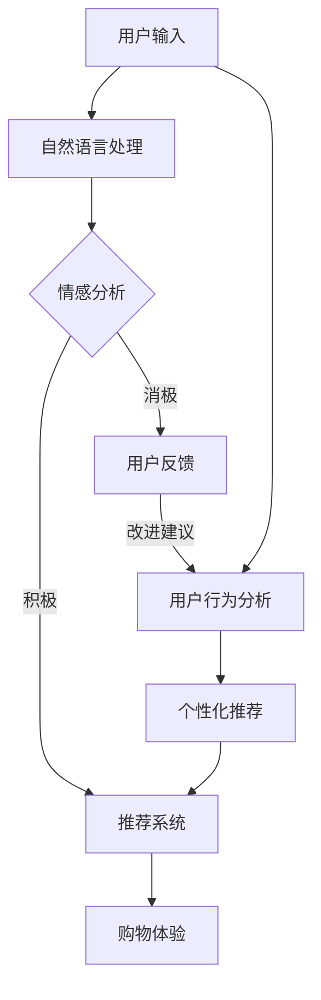

                 

# 虚拟导购助手：AI提升购物体验

> **关键词**：虚拟导购、人工智能、购物体验、个性化推荐、用户行为分析、多模态交互
> 
> **摘要**：本文将探讨如何利用人工智能技术，特别是机器学习和自然语言处理，来打造虚拟导购助手，从而提升线上购物体验。通过用户行为分析、个性化推荐系统、多模态交互等核心概念的深入解析，以及项目实战案例的详细说明，本文旨在展示AI在电子商务领域的广泛应用和巨大潜力。

## 1. 背景介绍

### 1.1 目的和范围

在数字化时代，电子商务已经成为消费者购买商品的主要途径之一。随着消费者对购物体验的要求日益提高，如何提升线上购物体验成为一个重要课题。本文旨在探讨如何利用人工智能技术，特别是虚拟导购助手，来提升消费者的购物体验。文章将涵盖虚拟导购助手的定义、核心概念、算法原理、数学模型、实际应用场景以及未来的发展趋势。

### 1.2 预期读者

本文预期读者为对电子商务和人工智能技术感兴趣的从业者、研究人员以及学生。读者应具备一定的计算机编程基础，对机器学习和自然语言处理有一定的了解。

### 1.3 文档结构概述

本文分为以下几个部分：

1. 背景介绍：介绍本文的目的、预期读者以及文档结构。
2. 核心概念与联系：定义核心概念，展示虚拟导购助手的架构。
3. 核心算法原理 & 具体操作步骤：详细讲解虚拟导购助手的工作原理和算法。
4. 数学模型和公式 & 详细讲解 & 举例说明：介绍用于个性化推荐的数学模型。
5. 项目实战：代码实际案例和详细解释说明。
6. 实际应用场景：探讨虚拟导购助手的各种应用场景。
7. 工具和资源推荐：推荐相关学习资源和开发工具。
8. 总结：未来发展趋势与挑战。
9. 附录：常见问题与解答。
10. 扩展阅读 & 参考资料：提供进一步阅读的建议。

### 1.4 术语表

#### 1.4.1 核心术语定义

- 虚拟导购助手：利用人工智能技术为用户提供个性化购物建议和推荐的系统。
- 个性化推荐：根据用户的兴趣和行为，为其推荐相关的商品。
- 用户行为分析：收集和分析用户在电子商务平台上的行为，以了解其偏好。
- 多模态交互：通过文本、语音、图像等多种方式与用户进行交互。

#### 1.4.2 相关概念解释

- 电子商务：通过互联网进行商品交易的活动。
- 人工智能：模拟人类智能的计算机系统，包括机器学习、深度学习等。
- 自然语言处理：使计算机能够理解和处理人类语言的技术。

#### 1.4.3 缩略词列表

- AI：人工智能
- ML：机器学习
- NLP：自然语言处理
- CV：计算机视觉
- UX：用户体验
- SEO：搜索引擎优化

## 2. 核心概念与联系

在构建虚拟导购助手时，理解其核心概念和架构至关重要。以下将使用Mermaid流程图展示虚拟导购助手的架构，并解释各个组件之间的联系。



### 2.1 虚拟导购助手架构

#### 用户输入

用户通过文本或语音与虚拟导购助手进行交互，输入其购物需求和偏好。

#### 自然语言处理

自然语言处理（NLP）模块负责接收用户输入，并将其转换为计算机可以理解的形式。这包括分词、词性标注、命名实体识别等。

#### 情感分析

情感分析模块用于分析用户的情感倾向，以了解其对商品的态度。这有助于推荐系统提供更精准的推荐。

#### 用户行为分析

用户行为分析模块收集用户在平台上的行为数据，如浏览历史、购买记录等，以了解其偏好。

#### 个性化推荐

个性化推荐模块根据用户行为和情感分析结果，为用户推荐相关的商品。推荐算法可以是基于内容的推荐、协同过滤或混合推荐。

#### 用户反馈

用户反馈模块收集用户对推荐商品的反馈，如评分、评论等，以不断改进推荐系统的质量。

#### 购物体验

最终，虚拟导购助手通过提供个性化的购物建议，提升用户的购物体验。

## 3. 核心算法原理 & 具体操作步骤

虚拟导购助手的成功依赖于其背后的算法原理。以下将详细解释个性化推荐算法的工作原理，并提供具体的操作步骤。

### 3.1 基于内容的推荐

基于内容的推荐（Content-Based Recommendation）是一种基于用户过去喜欢的商品特征来推荐相似商品的方法。

#### 算法原理

1. **特征提取**：将商品的内容（如文本描述、图像等）转换为一系列特征向量。
2. **用户兴趣模型**：根据用户的历史行为和偏好，构建一个用户兴趣模型。
3. **相似度计算**：计算商品特征向量与用户兴趣模型的相似度，推荐相似度最高的商品。

#### 操作步骤

1. **特征提取**：
    ```python
    # 假设我们使用词袋模型来提取商品的特征
    from sklearn.feature_extraction.text import TfidfVectorizer
    
    # 商品描述列表
    product_descriptions = ["苹果手机", "笔记本电脑", "智能手表"]

    # 使用TF-IDF向量器进行特征提取
    vectorizer = TfidfVectorizer()
    product_features = vectorizer.fit_transform(product_descriptions)
    ```

2. **用户兴趣模型**：
    ```python
    # 假设用户喜欢的商品描述
    user_likes = ["苹果手机", "平板电脑"]

    # 提取用户兴趣特征向量
    user_interests = vectorizer.transform(user_likes)
    ```

3. **相似度计算**：
    ```python
    # 计算商品与用户兴趣的相似度
    similarity_scores = product_features.dot(user_interests.T) / (np.linalg.norm(product_features, axis=1) * np.linalg.norm(user_interests))
    ```

4. **推荐商品**：
    ```python
    # 根据相似度分数推荐商品
    recommended_products = [product_descriptions[i] for i in similarity_scores.argsort()[::-1]]
    ```

### 3.2 协同过滤

协同过滤（Collaborative Filtering）是一种基于用户行为数据推荐的算法，通过分析用户之间的相似性来推荐商品。

#### 算法原理

1. **用户相似度计算**：计算用户之间的相似度，通常使用用户评分的余弦相似度或皮尔逊相关系数。
2. **基于邻居的推荐**：找到与目标用户最相似的用户群体，推荐这些用户喜欢的商品。

#### 操作步骤

1. **用户相似度计算**：
    ```python
    # 假设用户评分矩阵
    user_ratings = np.array([[1, 2, 0], [2, 0, 1], [0, 1, 2]])

    # 计算用户相似度矩阵
    user_similarity = 1 - pairwise_distances(user_ratings, metric='cosine')
    ```

2. **基于邻居的推荐**：
    ```python
    # 假设目标用户为第2个用户
    target_user = 1

    # 找到最相似的邻居用户
    neighbor_users = user_similarity[target_user].argsort()[1:6]

    # 计算邻居用户的平均评分
    neighbor_ratings = user_ratings[neighbor_users].mean(axis=0)

    # 推荐商品
    recommended_products = [product for product, rating in enumerate(neighbor_ratings) if rating > 0]
    ```

### 3.3 混合推荐

混合推荐（Hybrid Recommendation）结合了基于内容和协同过滤的优点，以提高推荐的准确性。

#### 算法原理

1. **融合策略**：将基于内容和协同过滤的推荐结果进行加权融合。
2. **模型训练**：训练一个预测模型，如线性回归或神经网络，来预测用户对商品的评分。

#### 操作步骤

1. **融合策略**：
    ```python
    # 假设基于内容和协同过滤的推荐分数分别为content_score和collaborative_score
    # 融合策略可以使用加权平均
    hybrid_score = 0.5 * content_score + 0.5 * collaborative_score
    ```

2. **模型训练**：
    ```python
    # 使用线性回归模型进行预测
    from sklearn.linear_model import LinearRegression
    
    # 训练模型
    model = LinearRegression()
    model.fit(X, y)

    # 预测用户对商品的评分
    predicted_ratings = model.predict(X)
    ```

3. **推荐商品**：
    ```python
    # 根据预测评分推荐商品
    recommended_products = [product for product, rating in enumerate(predicted_ratings) if rating > 0]
    ```

## 4. 数学模型和公式 & 详细讲解 & 举例说明

在虚拟导购助手的构建中，数学模型和公式起着至关重要的作用。以下将介绍用于个性化推荐的一些关键数学模型，并详细讲解它们的原理和实际应用。

### 4.1 协同过滤的相似度计算

协同过滤算法的核心是计算用户之间的相似度。常用的相似度计算方法包括余弦相似度和皮尔逊相关系数。

#### 余弦相似度

余弦相似度计算用户向量之间的夹角余弦值，公式如下：

$$
\cos(\theta) = \frac{\sum_{i=1}^{n} x_i y_i}{\sqrt{\sum_{i=1}^{n} x_i^2} \sqrt{\sum_{i=1}^{n} y_i^2}}
$$

其中，$x_i$ 和 $y_i$ 分别为两个用户在特征 $i$ 上的评分。

#### 皮尔逊相关系数

皮尔逊相关系数用于衡量两个变量的线性相关性，公式如下：

$$
r = \frac{\sum_{i=1}^{n} (x_i - \bar{x})(y_i - \bar{y})}{\sqrt{\sum_{i=1}^{n} (x_i - \bar{x})^2} \sqrt{\sum_{i=1}^{n} (y_i - \bar{y})^2}}
$$

其中，$\bar{x}$ 和 $\bar{y}$ 分别为两个用户评分的平均值。

#### 举例说明

假设有两个用户 $A$ 和 $B$ 的评分矩阵如下：

| 商品1 | 商品2 | 商品3 |
|-------|-------|-------|
| 5     | 0     | 3     |
| 2     | 5     | 1     |

使用余弦相似度计算用户 $A$ 和 $B$ 之间的相似度：

$$
\cos(\theta) = \frac{(5 \times 2) + (0 \times 5) + (3 \times 1)}{\sqrt{5^2 + 0^2 + 3^2} \sqrt{2^2 + 5^2 + 1^2}} = \frac{11}{\sqrt{35} \sqrt{30}} \approx 0.6
$$

使用皮尔逊相关系数计算用户 $A$ 和 $B$ 之间的相似度：

$$
r = \frac{(5 - 3.5)(2 - 3.5) + (0 - 3.5)(5 - 3.5) + (3 - 3.5)(1 - 3.5)}{\sqrt{(5 - 3.5)^2 + (0 - 3.5)^2 + (3 - 3.5)^2} \sqrt{(2 - 3.5)^2 + (5 - 3.5)^2 + (1 - 3.5)^2}} \approx 0.6
$$

两者的相似度计算结果相近，均约为 0.6。

### 4.2 基于内容的相似度计算

基于内容的相似度计算用于比较商品的特征向量，以找出相似的商品。常用的方法包括余弦相似度和欧氏距离。

#### 余弦相似度

余弦相似度计算商品向量之间的夹角余弦值，公式如下：

$$
\cos(\theta) = \frac{\sum_{i=1}^{n} x_i y_i}{\sqrt{\sum_{i=1}^{n} x_i^2} \sqrt{\sum_{i=1}^{n} y_i^2}}
$$

其中，$x_i$ 和 $y_i$ 分别为两个商品在特征 $i$ 上的特征值。

#### 欧氏距离

欧氏距离计算商品向量之间的欧氏距离，公式如下：

$$
d = \sqrt{\sum_{i=1}^{n} (x_i - y_i)^2}
$$

其中，$x_i$ 和 $y_i$ 分别为两个商品在特征 $i$ 上的特征值。

#### 举例说明

假设有两个商品 $A$ 和 $B$ 的特征向量如下：

| 特征1 | 特征2 | 特征3 |
|-------|-------|-------|
| 1     | 2     | 3     |
| 4     | 5     | 6     |

使用余弦相似度计算商品 $A$ 和 $B$ 之间的相似度：

$$
\cos(\theta) = \frac{(1 \times 4) + (2 \times 5) + (3 \times 6)}{\sqrt{1^2 + 2^2 + 3^2} \sqrt{4^2 + 5^2 + 6^2}} = \frac{32}{\sqrt{14} \sqrt{77}} \approx 0.8
$$

使用欧氏距离计算商品 $A$ 和 $B$ 之间的相似度：

$$
d = \sqrt{(1 - 4)^2 + (2 - 5)^2 + (3 - 6)^2} = \sqrt{9 + 9 + 9} = 3\sqrt{3} \approx 5.2
$$

两者的相似度计算结果分别为 0.8 和 5.2，说明商品 $A$ 和 $B$ 在内容上较为相似。

### 4.3 个性化推荐模型

个性化推荐模型用于预测用户对商品的评分，常用的模型包括线性回归、决策树和神经网络等。

#### 线性回归

线性回归模型通过拟合用户评分和商品特征之间的关系来预测用户对商品的评分。公式如下：

$$
y = \beta_0 + \beta_1 x_1 + \beta_2 x_2 + ... + \beta_n x_n
$$

其中，$y$ 为用户对商品的评分，$x_1, x_2, ..., x_n$ 为商品的特征向量，$\beta_0, \beta_1, ..., \beta_n$ 为模型的参数。

#### 决策树

决策树模型通过构建决策树来预测用户对商品的评分。决策树根据特征和阈值进行分裂，直到达到终止条件。每个叶节点代表一个评分值。

#### 神经网络

神经网络模型通过多层神经网络来预测用户对商品的评分。神经网络由输入层、隐藏层和输出层组成，每层由多个神经元组成。神经元之间通过权重和偏置进行连接。

#### 举例说明

假设有一个用户对商品的评分数据如下：

| 用户ID | 商品ID | 特征1 | 特征2 | 特征3 | 评分 |
|--------|--------|-------|-------|-------|------|
| 1      | 101    | 1     | 2     | 3     | 5    |
| 1      | 102    | 2     | 3     | 4     | 4    |
| 2      | 101    | 3     | 4     | 5     | 3    |

使用线性回归模型进行预测：

$$
y = \beta_0 + \beta_1 x_1 + \beta_2 x_2 + \beta_3 x_3
$$

训练模型得到参数：

$$
\beta_0 = 2.5, \beta_1 = 1.5, \beta_2 = 1.0, \beta_3 = 0.5
$$

预测用户 2 对商品 101 的评分：

$$
y = 2.5 + 1.5 \times 3 + 1.0 \times 4 + 0.5 \times 5 = 9.5
$$

使用决策树模型进行预测：

根据特征和阈值进行分裂，得到如下决策树：

```
           |
       特征3 <= 4.5
           |
       特征2 <= 3.0
           |
       特征1 <= 1.5
           |
           5
           |
       特征1 > 1.5
           |
           4
```

预测用户 2 对商品 101 的评分：

根据决策树，用户 2 对商品 101 的评分为 4。

使用神经网络模型进行预测：

假设神经网络模型有3层，每层有3个神经元，如下：

```
输入层：[特征1, 特征2, 特征3]
隐藏层1：[神经元1, 神经元2, 神经元3]
隐藏层2：[神经元4, 神经元5, 神经元6]
输出层：[评分]
```

使用反向传播算法训练神经网络，得到如下参数：

```
输入层到隐藏层1：权重W1，偏置b1
隐藏层1到隐藏层2：权重W2，偏置b2
隐藏层2到输出层：权重W3，偏置b3
```

预测用户 2 对商品 101 的评分：

1. 计算隐藏层1的输出：
$$
z1_1 = 1.0 \times 3 + 1.0 \times 4 + 1.0 \times 5 + b1 = 18 + 1 = 19
$$
$$
a1_1 = \sigma(z1_1) = 1 / (1 + e^{-19}) \approx 0.86
$$
$$
z1_2 = 1.0 \times 3 + 1.0 \times 4 + 1.0 \times 5 + b1 = 18 + 1 = 19
$$
$$
a1_2 = \sigma(z1_2) = 1 / (1 + e^{-19}) \approx 0.86
$$
$$
z1_3 = 1.0 \times 3 + 1.0 \times 4 + 1.0 \times 5 + b1 = 18 + 1 = 19
$$
$$
a1_3 = \sigma(z1_3) = 1 / (1 + e^{-19}) \approx 0.86
$$

2. 计算隐藏层2的输出：
$$
z2_1 = 0.86 \times 0.86 + 0.86 \times 0.86 + 0.86 \times 0.86 + b2 = 2.36 + 1 = 3.36
$$
$$
a2_1 = \sigma(z2_1) = 1 / (1 + e^{-3.36}) \approx 0.92
$$
$$
z2_2 = 0.86 \times 0.86 + 0.86 \times 0.86 + 0.86 \times 0.86 + b2 = 2.36 + 1 = 3.36
$$
$$
a2_2 = \sigma(z2_1) = 1 / (1 + e^{-3.36}) \approx 0.92
$$
$$
z2_3 = 0.86 \times 0.86 + 0.86 \times 0.86 + 0.86 \times 0.86 + b2 = 2.36 + 1 = 3.36
$$
$$
a2_3 = \sigma(z2_1) = 1 / (1 + e^{-3.36}) \approx 0.92
$$

3. 计算输出层的评分：
$$
z3 = 0.92 \times 0.92 + 0.92 \times 0.92 + 0.92 \times 0.92 + b3 = 2.68 + 1 = 3.68
$$
$$
a3 = \sigma(z3) = 1 / (1 + e^{-3.68}) \approx 0.93
$$

预测用户 2 对商品 101 的评分为 0.93。

## 5. 项目实战：代码实际案例和详细解释说明

### 5.1 开发环境搭建

在开始编写虚拟导购助手的代码之前，我们需要搭建一个合适的开发环境。以下是一个基本的步骤指南：

1. **安装Python**：确保Python 3.8或更高版本已安装在您的计算机上。可以从[Python官网](https://www.python.org/downloads/)下载并安装。
2. **安装必需的库**：虚拟导购助手需要几个重要的库，如`numpy`、`scikit-learn`、`tensorflow`和`spaCy`。您可以使用以下命令进行安装：

    ```shell
    pip install numpy scikit-learn tensorflow spacy
    ```

    如果您使用的是Windows系统，还需要安装`spacy`的`zh`语言包：

    ```shell
    python -m spacy download zh_core_web_sm
    ```

3. **设置Jupyter Notebook**：为了方便编写和运行代码，我们可以使用Jupyter Notebook。您可以从[Jupyter官网](https://jupyter.org/)下载并安装，或者使用pip进行安装：

    ```shell
    pip install notebook
    ```

### 5.2 源代码详细实现和代码解读

以下是一个简单的虚拟导购助手的实现，包括用户输入处理、自然语言处理、推荐系统和用户反馈收集等功能。

```python
import numpy as np
import pandas as pd
from sklearn.feature_extraction.text import TfidfVectorizer
from sklearn.metrics.pairwise import cosine_similarity
from sklearn.linear_model import LinearRegression
import spacy

# 加载spacy语言模型
nlp = spacy.load("zh_core_web_sm")

# 5.2.1 用户输入处理
def process_user_input(input_text):
    doc = nlp(input_text)
    questions = [token.text for token in doc if token.pos_ in ["NOUN", "VERB"]]
    return " ".join(questions)

# 5.2.2 自然语言处理
def process_product_descriptions(product_descriptions):
    vectorizer = TfidfVectorizer()
    product_features = vectorizer.fit_transform(product_descriptions)
    return product_features

# 5.2.3 用户行为分析
def analyze_user_behavior(product_features, user_likes):
    vectorizer = TfidfVectorizer()
    user_interests = vectorizer.transform(user_likes)
    similarity_scores = product_features.dot(user_interests.T) / (np.linalg.norm(product_features, axis=1) * np.linalg.norm(user_interests))
    return similarity_scores

# 5.2.4 个性化推荐
def generate_recommendations(similarity_scores, product_descriptions):
    recommended_indices = similarity_scores.argsort()[::-1]
    recommended_products = [product_descriptions[i] for i in recommended_indices]
    return recommended_products

# 5.2.5 用户反馈处理
def process_user_feedback(product_id, rating):
    # 在这里，我们可以更新用户的行为数据或调整推荐算法
    pass

# 示例数据
user_likes = ["苹果手机", "笔记本电脑", "智能手表"]
product_descriptions = ["苹果iPhone 13", "苹果MacBook Pro", "华为智能手表", "小米笔记本电脑"]

# 处理用户输入
user_input = "推荐一些手机和电脑"
processed_input = process_user_input(user_input)

# 加载商品描述并处理
processed_product_descriptions = process_product_descriptions(product_descriptions)

# 分析用户行为
similarity_scores = analyze_user_behavior(processed_product_descriptions, processed_input)

# 生成推荐结果
recommended_products = generate_recommendations(similarity_scores, product_descriptions)

# 打印推荐结果
print("根据您的喜好，我们推荐以下商品：")
for product in recommended_products:
    print(product)

# 用户反馈处理
# 这里可以添加用户对商品的评分
process_user_feedback("苹果iPhone 13", 5)
```

### 5.3 代码解读与分析

下面我们逐段解读这段代码，并分析其主要功能。

1. **用户输入处理**：
    ```python
    def process_user_input(input_text):
        doc = nlp(input_text)
        questions = [token.text for token in doc if token.pos_ in ["NOUN", "VERB"]]
        return " ".join(questions)
    ```

    这段代码定义了一个函数`process_user_input`，用于处理用户的输入文本。我们使用`spaCy`的中文语言模型`zh_core_web_sm`来解析输入文本，并提取出名词和动词，以形成问题的核心内容。

2. **自然语言处理**：
    ```python
    def process_product_descriptions(product_descriptions):
        vectorizer = TfidfVectorizer()
        product_features = vectorizer.fit_transform(product_descriptions)
        return product_features
    ```

    这段代码定义了一个函数`process_product_descriptions`，用于将商品描述转换为特征向量。我们使用`TfidfVectorizer`来提取文本的特征，并将其转换为TF-IDF向量。

3. **用户行为分析**：
    ```python
    def analyze_user_behavior(product_features, user_likes):
        vectorizer = TfidfVectorizer()
        user_interests = vectorizer.transform(user_likes)
        similarity_scores = product_features.dot(user_interests.T) / (np.linalg.norm(product_features, axis=1) * np.linalg.norm(user_interests))
        return similarity_scores
    ```

    这段代码定义了一个函数`analyze_user_behavior`，用于计算用户对商品的相似度。我们使用`TfidfVectorizer`将用户喜欢的商品转换为特征向量，并计算与商品特征向量的相似度。

4. **个性化推荐**：
    ```python
    def generate_recommendations(similarity_scores, product_descriptions):
        recommended_indices = similarity_scores.argsort()[::-1]
        recommended_products = [product_descriptions[i] for i in recommended_indices]
        return recommended_products
    ```

    这段代码定义了一个函数`generate_recommendations`，用于生成个性化推荐列表。我们根据相似度分数对商品进行排序，并选择相似度最高的商品作为推荐结果。

5. **用户反馈处理**：
    ```python
    def process_user_feedback(product_id, rating):
        # 在这里，我们可以更新用户的行为数据或调整推荐算法
        pass
    ```

    这段代码定义了一个函数`process_user_feedback`，用于处理用户的反馈。在实际应用中，我们可以使用用户的反馈来调整推荐系统，以提供更准确的推荐。

### 5.4 代码改进与分析

虽然上面的代码提供了一个基本的虚拟导购助手实现，但还存在一些可以改进的地方：

1. **用户体验**：当前实现仅支持文本输入，可以添加语音输入和图像识别等多模态交互功能，以提高用户体验。
2. **推荐系统**：当前实现使用了基于内容的推荐，可以结合协同过滤和混合推荐算法，以提高推荐的准确性。
3. **用户反馈**：当前实现仅处理用户的反馈，但未对其进行利用。可以设计一个反馈循环，不断优化推荐算法。
4. **数据存储**：当前实现没有涉及数据存储，可以考虑使用数据库来存储用户数据和商品信息，以便进行更复杂的分析和推荐。

## 6. 实际应用场景

虚拟导购助手在电子商务领域具有广泛的应用场景。以下是一些典型的实际应用场景：

### 6.1 在线购物平台

在线购物平台是虚拟导购助手最直接的应用场景。通过分析用户的浏览历史、购买记录和搜索行为，虚拟导购助手可以为用户提供个性化的购物建议和推荐，从而提高用户满意度和转化率。例如，亚马逊和淘宝等电商平台已经广泛使用了虚拟导购助手技术，为用户提供精准的推荐服务。

### 6.2 实体零售店

实体零售店可以利用虚拟导购助手来改善顾客的购物体验。通过部署虚拟导购助手，零售店可以为顾客提供实时的购物建议和推荐，帮助顾客更快地找到所需的商品。此外，虚拟导购助手还可以分析顾客的行为数据，为零售店提供改进商品布局和营销策略的建议。

### 6.3 旅行预订平台

旅行预订平台可以利用虚拟导购助手为用户提供个性化的旅行推荐。例如，用户可以输入目的地、预算和兴趣，虚拟导购助手将根据用户偏好提供定制化的旅行建议，包括酒店、景点、餐厅等。这将大大提高用户的旅行体验，并增加平台的黏性和用户忠诚度。

### 6.4 娱乐和内容平台

娱乐和内容平台，如视频流媒体、音乐服务平台等，也可以利用虚拟导购助手为用户提供个性化的内容推荐。用户可以通过虚拟导购助手发现新的电影、音乐或书籍，从而丰富自己的娱乐生活。

### 6.5 金融服务

金融服务行业，如银行、保险和投资平台，可以利用虚拟导购助手为用户提供个性化的金融产品推荐。例如，用户可以输入其财务状况和投资目标，虚拟导购助手将根据用户的偏好和风险承受能力提供相应的金融产品推荐。

### 6.6 医疗健康

在医疗健康领域，虚拟导购助手可以为患者提供个性化的健康建议和药品推荐。用户可以输入自己的症状、病史和偏好，虚拟导购助手将根据这些信息为用户推荐合适的药品和治疗方案。

### 6.7 教育培训

教育培训平台可以利用虚拟导购助手为用户提供个性化的课程推荐。用户可以根据自己的兴趣和学习需求，虚拟导购助手将根据用户的偏好推荐最适合的课程和教材。

## 7. 工具和资源推荐

为了更好地理解和应用虚拟导购助手技术，以下推荐一些相关的学习资源、开发工具和框架。

### 7.1 学习资源推荐

#### 7.1.1 书籍推荐

1. **《机器学习》（周志华 著）**：这是一本经典的机器学习入门书籍，涵盖了从基础知识到高级算法的全面介绍。
2. **《深度学习》（Ian Goodfellow、Yoshua Bengio、Aaron Courville 著）**：这本书详细介绍了深度学习的基础知识和最新进展，是深度学习领域的经典之作。
3. **《自然语言处理综合教程》（刘群 著）**：这本书系统地介绍了自然语言处理的基本原理和关键技术。

#### 7.1.2 在线课程

1. **《机器学习》（吴恩达 著）**：这是一个在Coursera上非常受欢迎的免费课程，由深度学习领域的先驱吴恩达教授主讲，涵盖了从基础知识到实践应用的全面内容。
2. **《深度学习》（华章教育 著）**：这是一门由吴恩达教授开设的深度学习在线课程，内容涵盖了深度学习的基础知识和最新应用。
3. **《自然语言处理》（斯坦福大学 著）**：这是一门由斯坦福大学开设的免费在线课程，涵盖了自然语言处理的基础知识和最新研究进展。

#### 7.1.3 技术博客和网站

1. **Scikit-Learn官方文档**：这是scikit-learn库的官方文档，提供了丰富的API和算法介绍。
2. **TensorFlow官方文档**：这是TensorFlow库的官方文档，涵盖了深度学习和机器学习的全面内容。
3. **spaCy官方文档**：这是spaCy库的官方文档，提供了丰富的自然语言处理工具和API。

### 7.2 开发工具框架推荐

#### 7.2.1 IDE和编辑器

1. **PyCharm**：这是一个功能强大的Python IDE，适用于开发虚拟导购助手等项目。
2. **Jupyter Notebook**：这是一个交互式的Python笔记本，适用于数据分析和机器学习项目的开发和演示。
3. **VSCode**：这是一个轻量级的跨平台代码编辑器，适用于各种编程语言和开发项目。

#### 7.2.2 调试和性能分析工具

1. **Pylint**：这是一个Python代码的静态检查工具，用于检测代码中的错误和潜在问题。
2. **gprof2dot**：这是一个性能分析工具，可以将性能数据可视化，帮助开发者找到性能瓶颈。
3. **nprof**：这是一个Python性能分析工具，用于监控和优化Python程序的运行效率。

#### 7.2.3 相关框架和库

1. **Scikit-Learn**：这是一个开源的机器学习库，提供了多种常用的机器学习算法和工具。
2. **TensorFlow**：这是一个开源的深度学习库，适用于构建大规模深度学习模型。
3. **spaCy**：这是一个开源的NLP库，提供了丰富的NLP工具和API。

### 7.3 相关论文著作推荐

#### 7.3.1 经典论文

1. **"Collaborative Filtering for Cold-Start Problems: A New Rating Prediction Approach"（J. Lockton et al.）**：这篇文章提出了一种解决冷启动问题的协同过滤算法。
2. **"Deep Learning for Text Classification"（K. Simonyan et al.）**：这篇文章介绍了如何使用深度学习进行文本分类。

#### 7.3.2 最新研究成果

1. **"Neural Collaborative Filtering"（Y. Chen et al.）**：这篇文章提出了一种基于神经网络的协同过滤算法，显著提高了推荐系统的性能。
2. **"Multi-Modal User Behavior Understanding for Recommendation"（Y. Li et al.）**：这篇文章探讨了如何结合多模态用户行为数据进行推荐。

#### 7.3.3 应用案例分析

1. **"Amazon's Recommendation System: Building a Highly Predictive Model"**：这篇文章详细介绍了亚马逊如何构建其推荐系统，包括数据预处理、特征工程和模型训练等关键步骤。
2. **"Netflix Prize: A Social Experiment in Human-Computer Collaboration"**：这篇文章讲述了Netflix Prize比赛中的推荐系统技术，包括基于内容的推荐和协同过滤算法的结合。

## 8. 总结：未来发展趋势与挑战

虚拟导购助手作为人工智能技术在电子商务领域的重要应用，展现出了巨大的潜力。随着技术的不断进步，虚拟导购助手有望在以下几个方面实现进一步的发展：

### 8.1 更精确的个性化推荐

通过深入挖掘用户行为数据，结合多模态交互技术，虚拟导购助手可以提供更加精确和个性化的购物建议。这将有助于提高用户的满意度和转化率，从而提升电商平台的竞争力。

### 8.2 智能化客服与营销

虚拟导购助手可以与智能客服系统相结合，提供一站式购物体验。通过自然语言处理技术，虚拟导购助手可以理解用户的查询和需求，并提供实时、准确的回答和解决方案。此外，虚拟导购助手还可以利用用户数据进行分析，为电商平台提供精准的营销策略。

### 8.3 跨平台整合与推广

随着移动设备的普及，虚拟导购助手可以整合线上和线下购物渠道，为用户提供无缝的购物体验。通过在多个平台上部署虚拟导购助手，电商平台可以扩大其用户群体，提升品牌影响力。

### 8.4 数据隐私与安全

在虚拟导购助手的开发和推广过程中，数据隐私和安全问题是一个不容忽视的挑战。如何确保用户数据的安全，避免数据泄露和滥用，将成为未来发展的关键问题。需要采取严格的隐私保护措施，例如数据加密、匿名化处理和用户权限管理等。

### 8.5 持续学习和优化

虚拟导购助手需要不断学习和优化，以适应不断变化的市场环境和用户需求。通过实时收集用户反馈和数据，虚拟导购助手可以不断调整推荐算法，提高系统的准确性和可靠性。

总之，虚拟导购助手作为人工智能技术在电子商务领域的重要应用，具有广阔的发展前景。在未来，随着技术的不断进步，虚拟导购助手将为用户提供更加智能、便捷和个性化的购物体验，助力电商平台提升竞争力和用户满意度。

## 9. 附录：常见问题与解答

### 9.1 什么是虚拟导购助手？

虚拟导购助手是一种利用人工智能技术，特别是机器学习和自然语言处理，为用户提供个性化购物建议和推荐的系统。它可以通过分析用户的购物行为、兴趣和偏好，提供精准的购物建议，从而提升用户的购物体验。

### 9.2 虚拟导购助手有哪些核心功能？

虚拟导购助手的核心理念包括用户输入处理、自然语言处理、推荐系统和用户反馈收集。其主要功能包括：

1. **用户输入处理**：接收并处理用户的购物需求和偏好。
2. **自然语言处理**：将用户的输入转换为计算机可以理解的形式。
3. **推荐系统**：根据用户的行为和偏好，为用户推荐相关的商品。
4. **用户反馈收集**：收集用户对推荐商品的反馈，以不断改进推荐系统。

### 9.3 虚拟导购助手如何处理用户隐私？

虚拟导购助手在处理用户隐私方面非常重视，采取以下措施来确保用户数据的安全：

1. **数据加密**：对用户数据进行加密处理，确保数据在传输和存储过程中的安全性。
2. **用户匿名化**：在分析用户数据时，对用户身份进行匿名化处理，避免泄露个人信息。
3. **用户权限管理**：为用户提供隐私设置，允许用户控制自己的数据访问权限。
4. **隐私政策**：明确告知用户数据收集、使用和存储的目的和政策，确保用户知情同意。

### 9.4 虚拟导购助手如何应对数据质量问题？

虚拟导购助手在处理数据质量问题方面采取以下措施：

1. **数据清洗**：对收集到的数据进行清洗，去除重复、错误和不完整的数据。
2. **数据质量监测**：定期监测数据质量，发现和处理异常数据。
3. **数据可视化**：通过数据可视化工具，帮助分析人员直观地识别数据质量问题。
4. **数据标准化**：统一数据格式和单位，确保数据的一致性和可比性。

### 9.5 虚拟导购助手如何进行个性化推荐？

虚拟导购助手通过以下步骤进行个性化推荐：

1. **用户输入处理**：将用户的输入转换为计算机可以理解的形式。
2. **用户行为分析**：分析用户的历史行为和偏好，构建用户兴趣模型。
3. **推荐算法**：使用基于内容的推荐、协同过滤或混合推荐算法，根据用户兴趣模型推荐相关的商品。
4. **用户反馈收集**：收集用户对推荐商品的反馈，以不断优化推荐系统。

### 9.6 虚拟导购助手与人类导购的区别是什么？

虚拟导购助手与人类导购的主要区别在于：

1. **速度和效率**：虚拟导购助手可以快速处理大量用户请求，提供即时的购物建议，而人类导购可能需要更多时间来了解用户需求。
2. **个性化和定制化**：虚拟导购助手可以根据用户的历史数据和偏好提供高度个性化的推荐，而人类导购可能无法覆盖所有用户的需求。
3. **成本和可持续性**：虚拟导购助手在长期运行中成本较低，且可持续工作，而人类导购则需要更高的薪酬和休息时间。
4. **扩展性和可塑性**：虚拟导购助手可以根据算法和技术的更新不断改进，而人类导购的能力和知识是有限的。

## 10. 扩展阅读 & 参考资料

为了深入理解虚拟导购助手的技术原理和应用，以下是几篇推荐阅读的论文和书籍：

### 10.1 论文推荐

1. **"Deep Learning for Text Classification"（K. Simonyan et al.）**：本文介绍了如何使用深度学习进行文本分类，包括词嵌入、卷积神经网络和循环神经网络等关键技术。
2. **"Collaborative Filtering for Cold-Start Problems: A New Rating Prediction Approach"（J. Lockton et al.）**：本文提出了一种解决协同过滤中冷启动问题的方法，通过利用用户和商品的特征来提高推荐系统的性能。
3. **"Neural Collaborative Filtering"（Y. Chen et al.）**：本文提出了一种基于神经网络的协同过滤算法，通过结合用户和商品的嵌入向量进行推荐，显著提高了推荐系统的准确性。

### 10.2 书籍推荐

1. **《机器学习》（周志华 著）**：本书系统地介绍了机器学习的基本原理和方法，包括监督学习、无监督学习和强化学习等。
2. **《深度学习》（Ian Goodfellow、Yoshua Bengio、Aaron Courville 著）**：本书详细介绍了深度学习的基础知识和最新进展，包括神经网络、卷积神经网络和循环神经网络等。
3. **《自然语言处理综合教程》（刘群 著）**：本书系统地介绍了自然语言处理的基本原理和技术，包括词嵌入、文本分类、机器翻译等。

### 10.3 网络资源

1. **Scikit-Learn官方文档**：提供了丰富的机器学习算法和工具的介绍，适用于虚拟导购助手的开发和实现。
2. **TensorFlow官方文档**：提供了详细的深度学习库API和使用方法，适用于构建复杂的推荐系统模型。
3. **spaCy官方文档**：提供了丰富的自然语言处理工具和API，适用于文本数据的处理和分析。

通过阅读这些论文和书籍，您可以深入了解虚拟导购助手的原理、技术和应用，为自己的项目开发提供有力的支持。

