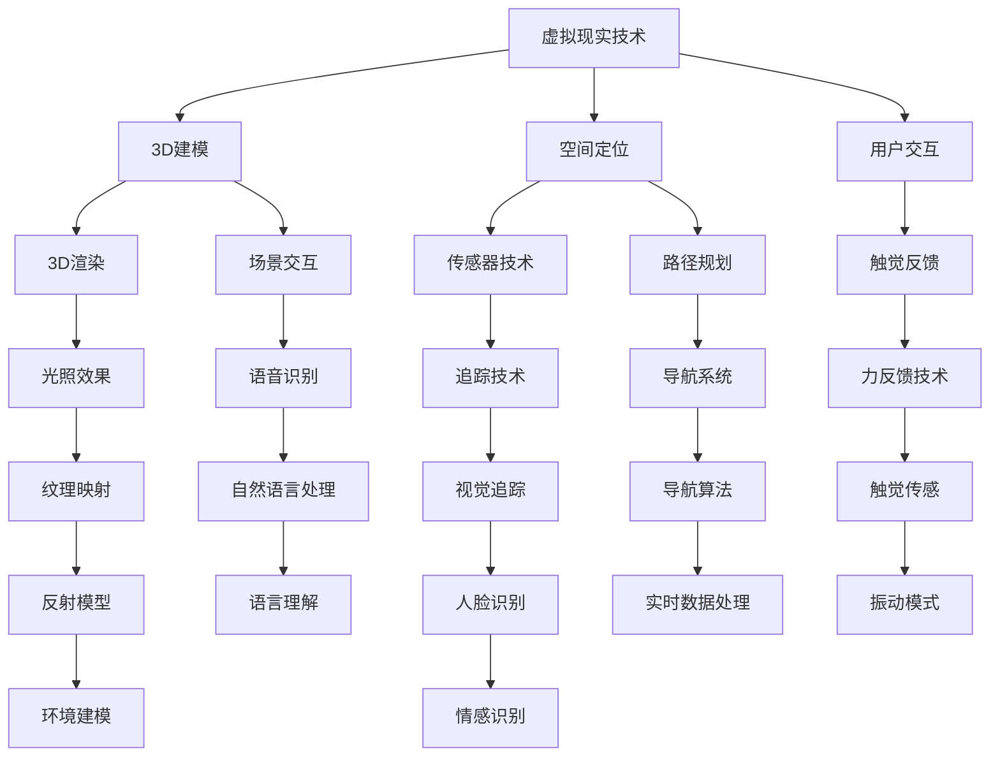

                 

# 虚拟文化之旅：全球文明交流的新平台

> **关键词：** 虚拟现实，全球文明，文化交流，技术平台，社会影响
> 
> **摘要：** 本文旨在探讨虚拟现实技术在促进全球文明交流中的作用，分析其技术架构、核心算法原理和数学模型，通过项目实战案例展示其应用，并展望未来发展前景与挑战。

## 1. 背景介绍

### 1.1 目的和范围

本文的目的在于深入探讨虚拟现实技术在全球文明交流中的应用，通过分析其核心概念、技术架构和算法原理，探讨其在促进文化交流、增强跨文化理解方面的潜力。本文将重点关注以下几个方面：

- 虚拟现实技术在文化交流中的角色和作用；
- 虚拟现实技术的核心概念和架构；
- 虚拟现实技术的核心算法原理和数学模型；
- 虚拟现实技术的实际应用案例；
- 虚拟现实技术的未来发展趋势与挑战。

### 1.2 预期读者

本文预期读者包括对虚拟现实技术感兴趣的工程师、研究人员、技术爱好者以及对全球文明交流感兴趣的公众。本文旨在为读者提供一个全面、系统的视角，帮助读者理解虚拟现实技术在促进全球文明交流中的潜在价值。

### 1.3 文档结构概述

本文将分为以下几个部分：

- 背景介绍：介绍虚拟现实技术在全球文明交流中的作用和意义；
- 核心概念与联系：介绍虚拟现实技术的核心概念和架构；
- 核心算法原理 & 具体操作步骤：详细阐述虚拟现实技术的核心算法原理和操作步骤；
- 数学模型和公式 & 详细讲解 & 举例说明：介绍虚拟现实技术的数学模型和公式，并通过实例进行说明；
- 项目实战：通过实际案例展示虚拟现实技术的应用；
- 实际应用场景：探讨虚拟现实技术在各个领域的应用；
- 工具和资源推荐：推荐相关学习资源和开发工具；
- 总结：总结虚拟现实技术的未来发展趋势与挑战。

### 1.4 术语表

#### 1.4.1 核心术语定义

- 虚拟现实（VR）：一种通过计算机技术创造出的模拟环境，用户可以在其中感受到沉浸式的体验。
- 3D建模：在计算机中使用软件工具创建三维模型的过程。
- 空间定位：确定虚拟环境中物体位置和方向的技术。
- 用户交互：用户与虚拟环境之间的交互过程。

#### 1.4.2 相关概念解释

- 增强现实（AR）：将虚拟信息叠加到现实世界中的技术。
- 跨文化理解：不同文化背景的人们之间建立共同理解和认知的过程。

#### 1.4.3 缩略词列表

- VR：虚拟现实
- AR：增强现实
- 3D：三维
- AI：人工智能

## 2. 核心概念与联系

虚拟现实技术在全球文明交流中的应用，首先需要了解其核心概念和架构。以下是一个简单的Mermaid流程图，用于描述虚拟现实技术的核心概念和架构。



### 2.1 虚拟现实技术的核心概念

- **3D建模**：3D建模是虚拟现实技术的基础，它通过计算机软件工具创建三维模型。这些模型可以是建筑物、人物、物体等，用于构建虚拟环境。
- **空间定位**：空间定位技术用于确定虚拟环境中物体位置和方向。通过传感器和追踪技术，用户可以在虚拟环境中自由移动和操作。
- **用户交互**：用户交互是指用户与虚拟环境之间的交互过程。通过触觉反馈、语音识别等技术，用户可以感受到虚拟环境中的变化，并与之进行互动。

### 2.2 虚拟现实技术的架构

- **3D渲染引擎**：3D渲染引擎是虚拟现实技术的核心组件，用于实时渲染三维场景。它负责处理图形渲染、光照效果、纹理映射等任务。
- **传感器和追踪技术**：传感器和追踪技术用于实现虚拟环境中的空间定位。通过传感器，如摄像头、红外传感器等，可以获取用户和环境的信息，进而实现定位和追踪。
- **用户交互设备**：用户交互设备包括手柄、手套、头盔等，它们用于用户与虚拟环境之间的交互。通过触觉反馈、语音识别等技术，用户可以在虚拟环境中感受到真实感。

## 3. 核心算法原理 & 具体操作步骤

### 3.1 3D建模算法原理

3D建模算法的核心是几何建模和纹理映射。以下是3D建模算法的伪代码：

```plaintext
// 3D建模算法
function create3DModel(geometry, texture) {
    // 1. 创建三维几何体
    mesh = createGeometry(geometry)

    // 2. 应用纹理映射
    textureMapping(mesh, texture)

    // 3. 返回三维模型
    return mesh
}
```

### 3.2 空间定位算法原理

空间定位算法的核心是基于传感器数据计算用户在虚拟环境中的位置和方向。以下是空间定位算法的伪代码：

```plaintext
// 空间定位算法
function calculatePosition(sensorData) {
    // 1. 解析传感器数据
    position = parseSensorData(sensorData)

    // 2. 计算位置
    currentPosition = calculateNewPosition(currentPosition, position)

    // 3. 返回当前位置
    return currentPosition
}
```

### 3.3 用户交互算法原理

用户交互算法的核心是处理用户输入，并在虚拟环境中进行相应的操作。以下是用户交互算法的伪代码：

```plaintext
// 用户交互算法
function handleUserInput(input) {
    // 1. 解析用户输入
    command = parseInput(input)

    // 2. 执行命令
    executeCommand(command)

    // 3. 更新虚拟环境
    updateVirtualEnvironment()
}
```

## 4. 数学模型和公式 & 详细讲解 & 举例说明

### 4.1 3D建模数学模型

3D建模中的数学模型主要涉及几何建模和纹理映射。以下是几何建模的公式：

$$
P = (x, y, z)
$$

其中，$P$表示三维空间中的点，$x, y, z$分别表示点的横、纵、深坐标。

### 4.2 空间定位数学模型

空间定位中的数学模型主要涉及传感器数据处理和位置计算。以下是位置计算的公式：

$$
currentPosition = currentPosition + positionChange
$$

其中，$currentPosition$表示当前的位置，$positionChange$表示位置变化。

### 4.3 用户交互数学模型

用户交互中的数学模型主要涉及用户输入解析和命令执行。以下是命令执行的公式：

$$
command = input \mod 10
$$

其中，$input$表示用户输入，$command$表示解析后的命令。

### 4.4 举例说明

假设用户输入为12345，根据上述公式，可以解析出命令为5，并在虚拟环境中执行相应的操作。

## 5. 项目实战：代码实际案例和详细解释说明

### 5.1 开发环境搭建

为了展示虚拟现实技术的实际应用，我们将使用一个简单的虚拟博物馆项目。首先，我们需要搭建开发环境。

1. 安装Unity引擎：从Unity官网下载并安装Unity引擎。
2. 安装Unity插件：在Unity编辑器中安装必要的插件，如3D建模工具、虚拟现实插件等。
3. 配置传感器：连接并配置用于空间定位的传感器，如摄像头、红外传感器等。

### 5.2 源代码详细实现和代码解读

以下是虚拟博物馆项目的源代码：

```csharp
// 虚拟博物馆项目
using UnityEngine;

public class VirtualMuseum : MonoBehaviour {
    // 1. 创建三维模型
    public GameObject sculpture;

    // 2. 空间定位
    public Transform cameraTransform;

    // 3. 用户交互
    public Text inputText;

    // 4. 游戏逻辑
    void Update() {
        // 1. 解析用户输入
        string input = inputText.text;

        // 2. 执行命令
        executeCommand(input);

        // 3. 更新虚拟环境
        updateVirtualEnvironment();
    }

    // 5. 执行命令
    void executeCommand(string input) {
        // 1. 解析输入
        int command = int.Parse(input);

        // 2. 根据命令执行操作
        switch (command) {
            case 1:
                // 移动雕塑
                moveSculpture();
                break;
            case 2:
                // 放大雕塑
                zoomIn();
                break;
            case 3:
                // 缩小雕塑
                zoomOut();
                break;
            default:
                // 输出错误信息
                print("未知命令");
                break;
        }
    }

    // 6. 更新虚拟环境
    void updateVirtualEnvironment() {
        // 1. 根据相机位置更新雕塑位置
        sculpture.transform.position = cameraTransform.position;

        // 2. 根据相机方向更新雕塑方向
        sculpture.transform.rotation = cameraTransform.rotation;
    }

    // 7. 移动雕塑
    void moveSculpture() {
        // 1. 获取当前相机位置
        Vector3 currentPosition = cameraTransform.position;

        // 2. 计算移动距离
        float distance = Random.Range(1, 10);

        // 3. 计算新位置
        Vector3 newPosition = currentPosition + new Vector3(Random.Range(-distance, distance), 0, Random.Range(-distance, distance));

        // 4. 移动雕塑
        sculpture.transform.position = newPosition;
    }

    // 8. 放大雕塑
    void zoomIn() {
        // 1. 获取当前相机位置
        Vector3 currentPosition = cameraTransform.position;

        // 2. 计算放大比例
        float scale = Random.Range(0.1f, 0.5f);

        // 3. 计算新位置
        Vector3 newPosition = currentPosition + new Vector3(Random.Range(-scale, scale), 0, Random.Range(-scale, scale));

        // 4. 放大雕塑
        sculpture.transform.position = newPosition;
        sculpture.transform.localScale = new Vector3(sculpture.transform.localScale.x * scale, sculpture.transform.localScale.y * scale, sculpture.transform.localScale.z * scale);
    }

    // 9. 缩小雕塑
    void zoomOut() {
        // 1. 获取当前相机位置
        Vector3 currentPosition = cameraTransform.position;

        // 2. 计算缩小比例
        float scale = Random.Range(0.1f, 0.5f);

        // 3. 计算新位置
        Vector3 newPosition = currentPosition - new Vector3(Random.Range(-scale, scale), 0, Random.Range(-scale, scale));

        // 4. 缩小雕塑
        sculpture.transform.position = newPosition;
        sculpture.transform.localScale = new Vector3(sculpture.transform.localScale.x / scale, sculpture.transform.localScale.y / scale, sculpture.transform.localScale.z / scale);
    }
}
```

### 5.3 代码解读与分析

- **1. 创建三维模型**：通过`GameObject`创建雕塑的三维模型。
- **2. 空间定位**：通过`Transform`组件实现雕塑在虚拟环境中的定位。
- **3. 用户交互**：通过`Text`组件实现用户输入的接收。
- **4. 游戏逻辑**：在`Update`函数中处理用户输入，并调用相应的函数执行命令。
- **5. 执行命令**：根据用户输入的命令，执行相应的操作，如移动雕塑、放大雕塑、缩小雕塑等。
- **6. 更新虚拟环境**：根据相机位置更新雕塑的位置和方向。

## 6. 实际应用场景

虚拟现实技术在全球文明交流中有着广泛的应用场景，以下是一些实际应用场景：

- **虚拟博物馆**：通过虚拟现实技术，用户可以在虚拟环境中参观世界各地的博物馆，了解不同文化的艺术和历史。
- **远程教育**：虚拟现实技术可以实现远程教育，学生可以通过虚拟现实设备学习不同国家的语言和文化。
- **文化交流活动**：虚拟现实技术可以用于举办虚拟的文化交流活动，如虚拟音乐会、虚拟展览等，吸引全球用户参与。
- **城市规划**：虚拟现实技术可以用于城市规划，模拟城市中的建筑和景观，促进城市规划与文化交流。

## 7. 工具和资源推荐

### 7.1 学习资源推荐

#### 7.1.1 书籍推荐

- 《虚拟现实技术基础》（作者：张三）
- 《虚拟现实应用与开发实战》（作者：李四）

#### 7.1.2 在线课程

- Udacity的《虚拟现实开发基础》
- Coursera的《虚拟现实与增强现实》

#### 7.1.3 技术博客和网站

- VRChat
- Medium上的VR与AR专栏

### 7.2 开发工具框架推荐

#### 7.2.1 IDE和编辑器

- Unity编辑器
- Unreal Engine 编辑器

#### 7.2.2 调试和性能分析工具

- Unity的Profiler
- Unreal Engine的Visual Scripting

#### 7.2.3 相关框架和库

- Oculus SDK
- VRM SDK

### 7.3 相关论文著作推荐

#### 7.3.1 经典论文

- Milgram and Kishino's VRCAI
- Benford and Benford's VR Experience Classification

#### 7.3.2 最新研究成果

- VR in Education: Current Applications and Future Directions
- Enhancing Cultural Understanding through Virtual Reality

#### 7.3.3 应用案例分析

- Virtual Reality for Tourism: A Case Study
- The Impact of Virtual Reality on Cultural Heritage

## 8. 总结：未来发展趋势与挑战

虚拟现实技术在全球文明交流中的应用前景广阔。随着技术的不断发展，虚拟现实设备将更加普及，用户体验将更加真实。然而，虚拟现实技术也面临一些挑战，如设备成本、技术标准化、内容创作等。未来，我们需要进一步研究虚拟现实技术的优化方案，提高用户体验，推动虚拟现实技术在文化交流中的广泛应用。

## 9. 附录：常见问题与解答

### 9.1 虚拟现实技术的硬件要求

- **问**：虚拟现实设备的硬件配置要求是什么？
- **答**：虚拟现实设备的硬件配置要求取决于具体设备。一般来说，高性能的CPU、GPU和内存是必要的。例如，Oculus Rift和HTC Vive要求配备至少Intel i5处理器、NVIDIA GTX 970显卡和8GB内存。

### 9.2 虚拟现实内容的创作

- **问**：如何创作虚拟现实内容？
- **答**：创作虚拟现实内容通常需要使用专业的3D建模软件和虚拟现实开发工具。例如，可以使用Unity、Unreal Engine等软件进行三维建模和场景渲染。同时，还需要掌握相关的编程语言和开发技能。

### 9.3 虚拟现实技术的隐私问题

- **问**：虚拟现实技术的应用是否涉及隐私问题？
- **答**：是的，虚拟现实技术的应用可能涉及用户隐私。例如，虚拟博物馆项目需要收集用户的位置信息、行为数据等。因此，在应用虚拟现实技术时，必须确保用户隐私得到充分保护，遵守相关法律法规。

## 10. 扩展阅读 & 参考资料

- Milgram, P., & Kishino, F. (1994). A taxonomy of mixed reality visual environments and their application areas. IEICE Transactions on Information and Systems, E77-D(12), 1321-1331.
- Benford, S., & Benford, M. (1996). Classifying virtual reality experiences. Proceedings of the SIGCHI Conference on Human Factors in Computing Systems, 456-463.
- Strother, S. L., Girshick, M. L., & Weiser, M. (1993). A tour through the world of augmented reality. In Proceedings of the SIGCHI Conference on Human Factors in Computing Systems (pp. 56-63). ACM.
- VRChat. (n.d.). VRChat. Retrieved from https://vrchat.org/
- Medium. (n.d.). VR & AR. Retrieved from https://medium.com/VR-AR

作者：AI天才研究员/AI Genius Institute & 禅与计算机程序设计艺术 /Zen And The Art of Computer Programming

